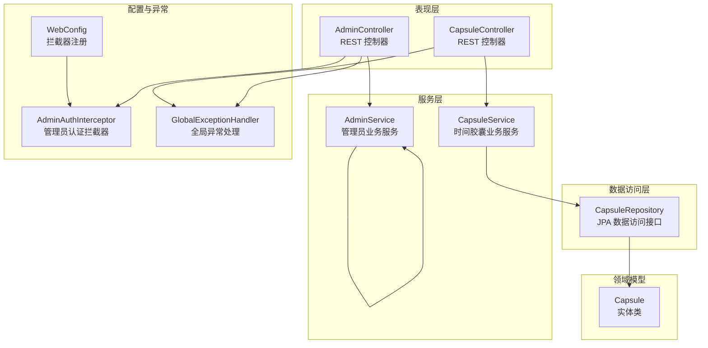
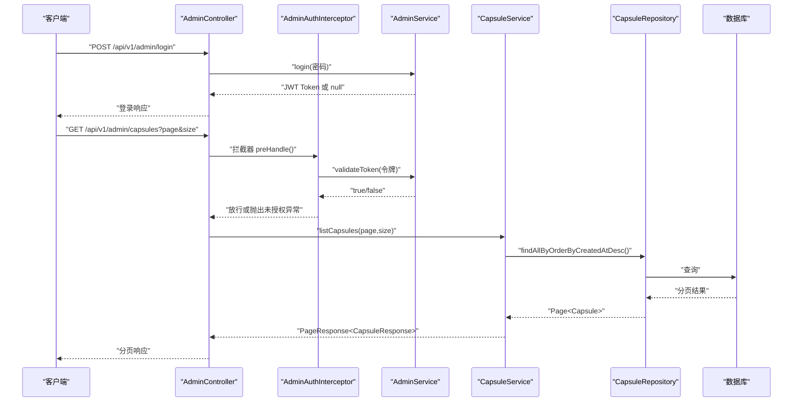
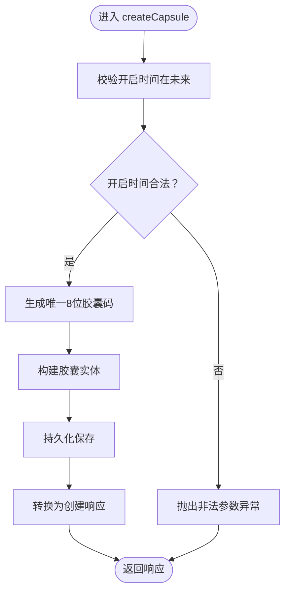
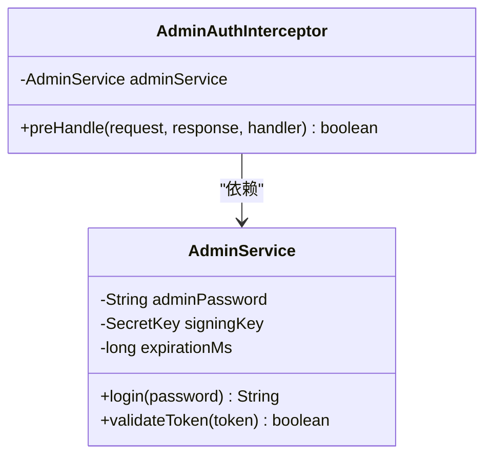
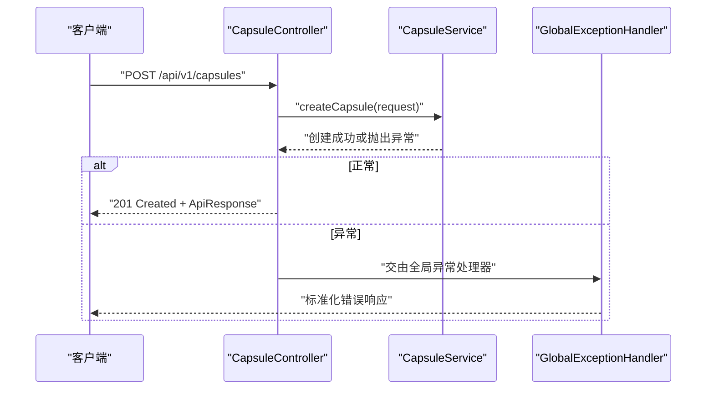
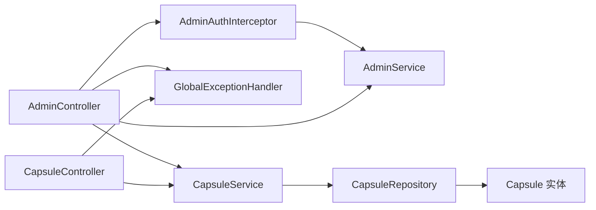

# 服务层业务逻辑

<cite>
**本文引用的文件**
- [CapsuleService.java](file://backends/spring-boot/src/main/java/com/hellotime/service/CapsuleService.java)
- [AdminService.java](file://backends/spring-boot/src/main/java/com/hellotime/service/AdminService.java)
- [CapsuleController.java](file://backends/spring-boot/src/main/java/com/hellotime/controller/CapsuleController.java)
- [AdminController.java](file://backends/spring-boot/src/main/java/com/hellotime/controller/AdminController.java)
- [CapsuleRepository.java](file://backends/spring-boot/src/main/java/com/hellotime/repository/CapsuleRepository.java)
- [Capsule.java](file://backends/spring-boot/src/main/java/com/hellotime/entity/Capsule.java)
- [CreateCapsuleRequest.java](file://backends/spring-boot/src/main/java/com/hellotime/dto/CreateCapsuleRequest.java)
- [CapsuleResponse.java](file://backends/spring-boot/src/main/java/com/hellotime/dto/CapsuleResponse.java)
- [GlobalExceptionHandler.java](file://backends/spring-boot/src/main/java/com/hellotime/exception/GlobalExceptionHandler.java)
- [AdminAuthInterceptor.java](file://backends/spring-boot/src/main/java/com/hellotime/config/AdminAuthInterceptor.java)
- [WebConfig.java](file://backends/spring-boot/src/main/java/com/hellotime/config/WebConfig.java)
- [application.yml](file://backends/spring-boot/src/main/resources/application.yml)
- [CapsuleServiceTest.java](file://backends/spring-boot/src/test/java/com/hellotime/service/CapsuleServiceTest.java)
- [AdminServiceTest.java](file://backends/spring-boot/src/test/java/com/hellotime/service/AdminServiceTest.java)
</cite>

## 目录
1. [引言](#引言)
2. [项目结构](#项目结构)
3. [核心组件](#核心组件)
4. [架构总览](#架构总览)
5. [详细组件分析](#详细组件分析)
6. [依赖关系分析](#依赖关系分析)
7. [性能考虑](#性能考虑)
8. [故障排查指南](#故障排查指南)
9. [结论](#结论)
10. [附录](#附录)

## 引言
本文件聚焦于Spring Boot后端服务层的业务逻辑，系统性解析服务层在分层架构中的核心职责：业务规则封装、事务管理、数据协调与服务编排。重点覆盖以下两个业务服务：
- CapsuleService：时间胶囊业务服务，涵盖创建、查询、删除、分页列表、内容可见性控制、唯一码生成与校验等。
- AdminService：管理员业务服务，负责登录认证、JWT签发与校验、配合拦截器完成权限控制。

同时，文档阐述依赖注入机制、事务传播行为、异常处理策略、性能优化技巧，并提供单元测试与集成测试的最佳实践指导。

## 项目结构
后端采用标准Spring Boot目录结构，服务层位于service包，控制器位于controller包，数据访问层位于repository包，实体模型位于entity包，DTO位于dto包，异常处理与Web配置位于exception与config包。

图表来源
- [CapsuleController.java:17-28](file://backends/spring-boot/src/main/java/com/hellotime/controller/CapsuleController.java#L17-L28)
- [AdminController.java:16-29](file://backends/spring-boot/src/main/java/com/hellotime/controller/AdminController.java#L16-L29)
- [CapsuleService.java:22-38](file://backends/spring-boot/src/main/java/com/hellotime/service/CapsuleService.java#L22-L38)
- [AdminService.java:18-44](file://backends/spring-boot/src/main/java/com/hellotime/service/AdminService.java#L18-L44)
- [CapsuleRepository.java:15-47](file://backends/spring-boot/src/main/java/com/hellotime/repository/CapsuleRepository.java#L15-L47)
- [Capsule.java:10-65](file://backends/spring-boot/src/main/java/com/hellotime/entity/Capsule.java#L10-L65)
- [WebConfig.java:12-31](file://backends/spring-boot/src/main/java/com/hellotime/config/WebConfig.java#L12-L31)
- [AdminAuthInterceptor.java:15-58](file://backends/spring-boot/src/main/java/com/hellotime/config/AdminAuthInterceptor.java#L15-L58)
- [GlobalExceptionHandler.java:15-86](file://backends/spring-boot/src/main/java/com/hellotime/exception/GlobalExceptionHandler.java#L15-L86)

章节来源
- [CapsuleController.java:17-56](file://backends/spring-boot/src/main/java/com/hellotime/controller/CapsuleController.java#L17-L56)
- [AdminController.java:16-77](file://backends/spring-boot/src/main/java/com/hellotime/controller/AdminController.java#L16-L77)
- [CapsuleService.java:22-194](file://backends/spring-boot/src/main/java/com/hellotime/service/CapsuleService.java#L22-L194)
- [AdminService.java:18-88](file://backends/spring-boot/src/main/java/com/hellotime/service/AdminService.java#L18-L88)
- [CapsuleRepository.java:15-47](file://backends/spring-boot/src/main/java/com/hellotime/repository/CapsuleRepository.java#L15-L47)
- [Capsule.java:10-89](file://backends/spring-boot/src/main/java/com/hellotime/entity/Capsule.java#L10-L89)
- [WebConfig.java:12-31](file://backends/spring-boot/src/main/java/com/hellotime/config/WebConfig.java#L12-L31)
- [AdminAuthInterceptor.java:15-58](file://backends/spring-boot/src/main/java/com/hellotime/config/AdminAuthInterceptor.java#L15-L58)
- [GlobalExceptionHandler.java:15-86](file://backends/spring-boot/src/main/java/com/hellotime/exception/GlobalExceptionHandler.java#L15-L86)

## 核心组件
- CapsuleService：封装时间胶囊的全部业务逻辑，包括创建、查询、删除、分页列表、内容可见性控制、唯一码生成与校验、事务管理等。
- AdminService：封装管理员登录认证与JWT签发/校验，配合拦截器实现统一权限控制。
- CapsuleRepository：基于Spring Data JPA的仓库接口，提供按code查询、存在性检查、分页排序、按code删除等能力。
- Capsule实体：映射数据库表，包含code、title、content、creator、openAt、createdAt等字段，持久化前自动填充创建时间。
- DTO与控制器：CreateCapsuleRequest用于入参校验，CapsuleResponse用于出参序列化（内容字段按需隐藏），控制器负责HTTP路由与参数绑定。

章节来源
- [CapsuleService.java:22-194](file://backends/spring-boot/src/main/java/com/hellotime/service/CapsuleService.java#L22-L194)
- [AdminService.java:18-88](file://backends/spring-boot/src/main/java/com/hellotime/service/AdminService.java#L18-L88)
- [CapsuleRepository.java:15-47](file://backends/spring-boot/src/main/java/com/hellotime/repository/CapsuleRepository.java#L15-L47)
- [Capsule.java:10-89](file://backends/spring-boot/src/main/java/com/hellotime/entity/Capsule.java#L10-L89)
- [CreateCapsuleRequest.java:13-55](file://backends/spring-boot/src/main/java/com/hellotime/dto/CreateCapsuleRequest.java#L13-L55)
- [CapsuleResponse.java:6-30](file://backends/spring-boot/src/main/java/com/hellotime/dto/CapsuleResponse.java#L6-L30)

## 架构总览
服务层在整体架构中承担“业务规则与流程编排”的职责，向上承接控制器层的HTTP请求，向下协调数据访问层与外部依赖（如JWT库）。异常处理集中在全局异常处理器，统一输出标准化错误响应；Web配置与拦截器确保管理员接口的安全访问。

图表来源
- [AdminController.java:39-62](file://backends/spring-boot/src/main/java/com/hellotime/controller/AdminController.java#L39-L62)
- [AdminAuthInterceptor.java:34-57](file://backends/spring-boot/src/main/java/com/hellotime/config/AdminAuthInterceptor.java#L34-L57)
- [AdminService.java:53-87](file://backends/spring-boot/src/main/java/com/hellotime/service/AdminService.java#L53-L87)
- [CapsuleService.java:93-100](file://backends/spring-boot/src/main/java/com/hellotime/service/CapsuleService.java#L93-L100)
- [CapsuleRepository.java:33-46](file://backends/spring-boot/src/main/java/com/hellotime/repository/CapsuleRepository.java#L33-L46)

## 详细组件分析

### CapsuleService：时间胶囊业务服务
- 业务职责
  - 创建：校验开启时间在未来，生成唯一8位胶囊码，构建实体并持久化，返回不含内容的创建响应。
  - 查询：按code查找，未到开启时间隐藏content字段，返回opened标记。
  - 删除：管理员功能，先校验存在性再删除。
  - 列表：管理员功能，按创建时间倒序分页返回。
- 关键实现要点
  - 唯一码生成：字符集62进制（A-Z,a-z,0-9），长度8位，循环重试最多MAX_RETRIES次，超限抛异常。
  - 内容可见性：根据当前时间与openAt比较决定是否返回content。
  - 事务管理：创建与删除标注@Transactional，保证原子性。
  - 数据转换：toCreatedResponse、toDetailResponse、toAdminResponse分别面向不同场景的响应对象。
- 依赖注入
  - 通过构造函数注入CapsuleRepository，遵循不可变依赖原则，便于测试与扩展。
- 错误处理
  - 参数校验失败由全局异常处理器统一转为400。
  - 未找到胶囊抛出CapsuleNotFoundException，统一转为404。
  - 开启时间在未来由业务逻辑校验，转为400。
- 性能与复杂度
  - 唯一码生成期望O(1)，最坏O(MAX_RETRIES)；重复检测为O(1)（数据库索引）。
  - 分页查询复杂度O(n)（n为页面大小），数据库层面支持高效分页。
- 日志记录
  - 代码中未直接记录日志，建议在生产环境增加必要的审计日志（如创建、删除、查询）以满足合规要求。

图表来源
- [CapsuleService.java:48-69](file://backends/spring-boot/src/main/java/com/hellotime/service/CapsuleService.java#L48-L69)
- [CapsuleService.java:121-129](file://backends/spring-boot/src/main/java/com/hellotime/service/CapsuleService.java#L121-L129)
- [CapsuleService.java:147-155](file://backends/spring-boot/src/main/java/com/hellotime/service/CapsuleService.java#L147-L155)

章节来源
- [CapsuleService.java:22-194](file://backends/spring-boot/src/main/java/com/hellotime/service/CapsuleService.java#L22-L194)
- [CapsuleRepository.java:15-47](file://backends/spring-boot/src/main/java/com/hellotime/repository/CapsuleRepository.java#L15-L47)
- [Capsule.java:10-89](file://backends/spring-boot/src/main/java/com/hellotime/entity/Capsule.java#L10-L89)
- [CreateCapsuleRequest.java:13-55](file://backends/spring-boot/src/main/java/com/hellotime/dto/CreateCapsuleRequest.java#L13-L55)
- [CapsuleResponse.java:6-30](file://backends/spring-boot/src/main/java/com/hellotime/dto/CapsuleResponse.java#L6-L30)

### AdminService：管理员业务服务
- 业务职责
  - 登录：校验密码，成功则签发JWT，包含主题、签发时间、过期时间与签名。
  - 校验：解析并验证签名与过期时间，返回有效性。
- 关键实现要点
  - 密钥：使用HMAC-SHA256算法，从配置读取密钥字符串并转换为SecretKey。
  - 过期时间：小时配置转换为毫秒，支持灵活调整。
  - 安全性：密码常量比较，避免明文泄露；Token包含必要声明，便于后续鉴权。
- 依赖注入
  - 通过构造函数注入配置参数（密码、密钥、过期时长），实现不可变配置对象。
- 与拦截器协作
  - AdminAuthInterceptor从Authorization头提取Bearer Token并调用validateToken进行校验，未通过抛出未授权异常。

图表来源
- [AdminService.java:18-88](file://backends/spring-boot/src/main/java/com/hellotime/service/AdminService.java#L18-L88)
- [AdminAuthInterceptor.java:15-58](file://backends/spring-boot/src/main/java/com/hellotime/config/AdminAuthInterceptor.java#L15-L58)

章节来源
- [AdminService.java:18-88](file://backends/spring-boot/src/main/java/com/hellotime/service/AdminService.java#L18-L88)
- [AdminAuthInterceptor.java:15-58](file://backends/spring-boot/src/main/java/com/hellotime/config/AdminAuthInterceptor.java#L15-L58)
- [application.yml:16-22](file://backends/spring-boot/src/main/resources/application.yml#L16-L22)

### 控制器与异常处理
- CapsuleController
  - 提供创建与详情查询接口，使用@Valid自动参数校验，返回标准化响应。
- AdminController
  - 提供登录、分页列表、删除接口，其中列表与删除接口受拦截器保护。
- 全局异常处理
  - 统一处理未找到、未授权、参数校验、非法参数与通用异常，返回标准化错误响应与状态码。

图表来源
- [CapsuleController.java:37-42](file://backends/spring-boot/src/main/java/com/hellotime/controller/CapsuleController.java#L37-L42)
- [CapsuleService.java:48-69](file://backends/spring-boot/src/main/java/com/hellotime/service/CapsuleService.java#L48-L69)
- [GlobalExceptionHandler.java:15-86](file://backends/spring-boot/src/main/java/com/hellotime/exception/GlobalExceptionHandler.java#L15-L86)

章节来源
- [CapsuleController.java:17-56](file://backends/spring-boot/src/main/java/com/hellotime/controller/CapsuleController.java#L17-L56)
- [AdminController.java:16-77](file://backends/spring-boot/src/main/java/com/hellotime/controller/AdminController.java#L16-L77)
- [GlobalExceptionHandler.java:15-86](file://backends/spring-boot/src/main/java/com/hellotime/exception/GlobalExceptionHandler.java#L15-L86)

## 依赖关系分析
- 服务层依赖
  - CapsuleService依赖CapsuleRepository，实现业务逻辑与数据访问的解耦。
  - AdminService独立于数据访问层，仅依赖配置参数与JWT库。
- 控制器依赖
  - 控制器通过构造函数注入服务，实现依赖注入与可测试性。
- 异常处理与拦截器
  - 全局异常处理器统一处理各层异常，拦截器在Web层前置校验JWT有效性。

图表来源
- [CapsuleController.java:17-28](file://backends/spring-boot/src/main/java/com/hellotime/controller/CapsuleController.java#L17-L28)
- [AdminController.java:16-29](file://backends/spring-boot/src/main/java/com/hellotime/controller/AdminController.java#L16-L29)
- [CapsuleService.java:22-38](file://backends/spring-boot/src/main/java/com/hellotime/service/CapsuleService.java#L22-L38)
- [AdminService.java:18-44](file://backends/spring-boot/src/main/java/com/hellotime/service/AdminService.java#L18-L44)
- [CapsuleRepository.java:15-47](file://backends/spring-boot/src/main/java/com/hellotime/repository/CapsuleRepository.java#L15-L47)
- [Capsule.java:10-89](file://backends/spring-boot/src/main/java/com/hellotime/entity/Capsule.java#L10-L89)
- [GlobalExceptionHandler.java:15-86](file://backends/spring-boot/src/main/java/com/hellotime/exception/GlobalExceptionHandler.java#L15-L86)
- [AdminAuthInterceptor.java:15-58](file://backends/spring-boot/src/main/java/com/hellotime/config/AdminAuthInterceptor.java#L15-L58)

章节来源
- [CapsuleService.java:22-38](file://backends/spring-boot/src/main/java/com/hellotime/service/CapsuleService.java#L22-L38)
- [AdminService.java:18-44](file://backends/spring-boot/src/main/java/com/hellotime/service/AdminService.java#L18-L44)
- [CapsuleRepository.java:15-47](file://backends/spring-boot/src/main/java/com/hellotime/repository/CapsuleRepository.java#L15-L47)
- [Capsule.java:10-89](file://backends/spring-boot/src/main/java/com/hellotime/entity/Capsule.java#L10-L89)
- [GlobalExceptionHandler.java:15-86](file://backends/spring-boot/src/main/java/com/hellotime/exception/GlobalExceptionHandler.java#L15-L86)
- [AdminAuthInterceptor.java:15-58](file://backends/spring-boot/src/main/java/com/hellotime/config/AdminAuthInterceptor.java#L15-L58)

## 性能考虑
- 唯一码生成
  - 使用SecureRandom与62进制字符集，冲突概率低；MAX_RETRIES限制避免无限重试。
- 数据访问
  - 使用Spring Data JPA分页接口，数据库层面支持高效分页；code字段唯一索引提升查询与存在性检查效率。
- 事务管理
  - 创建与删除标注@Transactional，确保原子性；注意避免长事务占用数据库连接。
- DTO序列化
  - 使用@JsonInclude(NON_NULL)按需隐藏content字段，减少网络传输与序列化开销。
- 配置优化
  - SQLite方言与DDL自动更新适合开发环境；生产环境建议显式迁移脚本与索引优化。

[本节为通用性能讨论，无需特定文件引用]

## 故障排查指南
- 400参数校验失败
  - 检查CreateCapsuleRequest字段约束（标题、内容、创建者、开启时间）。
  - 查看全局异常处理器对MethodArgumentNotValidException的统一响应。
- 400非法参数
  - 开启时间必须在未来；业务逻辑校验失败将返回400。
- 404未找到
  - 查询或删除不存在的code将触发CapsuleNotFoundException，返回404。
- 401未授权
  - 管理员接口缺少或无效的Bearer Token将被拦截器拦截，返回401。
- JWT签发与校验问题
  - 确认配置项app.jwt.secret与app.jwt.expiration-hours正确；密钥长度满足HS256要求。

章节来源
- [GlobalExceptionHandler.java:15-86](file://backends/spring-boot/src/main/java/com/hellotime/exception/GlobalExceptionHandler.java#L15-L86)
- [AdminAuthInterceptor.java:34-57](file://backends/spring-boot/src/main/java/com/hellotime/config/AdminAuthInterceptor.java#L34-L57)
- [AdminService.java:53-87](file://backends/spring-boot/src/main/java/com/hellotime/service/AdminService.java#L53-L87)
- [application.yml:16-22](file://backends/spring-boot/src/main/resources/application.yml#L16-L22)

## 结论
服务层通过清晰的职责划分与依赖注入，实现了业务规则的集中封装与可测试性。CapsuleService围绕“内容可见性”与“唯一码生成”两大核心特性，提供了稳健的业务实现；AdminService结合拦截器与全局异常处理，构建了统一的安全与错误响应体系。建议在生产环境中补充审计日志、完善监控指标，并对关键路径进行压力测试与性能优化。

[本节为总结性内容，无需特定文件引用]

## 附录

### 服务层单元测试与集成测试最佳实践
- 单元测试
  - 使用@SpringBootTest加载完整上下文，或通过Mockito对依赖进行Mock以进行单元测试。
  - 测试点示例：创建胶囊返回8位code、开启时间在未来、未到开启时间隐藏content、删除后查询抛异常等。
- 集成测试
  - 使用WebTestClient或RestAssured发起HTTP请求，验证控制器、拦截器与异常处理器的协同工作。
  - 覆盖登录成功/失败、分页列表、删除等端到端流程。
- Mock对象使用
  - 对AdminService进行Mock，验证控制器在不同Token有效性下的行为。
  - 对CapsuleRepository进行Mock，隔离数据库依赖，提高测试稳定性与速度。
- 业务逻辑最佳实践
  - 保持服务方法单一职责，避免跨服务的长链路调用。
  - 对外暴露稳定的DTO，内部使用实体，降低耦合。
  - 在事务边界内完成原子性操作，避免在事务外访问外部资源。
  - 使用全局异常处理器统一错误响应，便于前端一致处理。

章节来源
- [CapsuleServiceTest.java:17-94](file://backends/spring-boot/src/test/java/com/hellotime/service/CapsuleServiceTest.java#L17-L94)
- [AdminServiceTest.java:9-38](file://backends/spring-boot/src/test/java/com/hellotime/service/AdminServiceTest.java#L9-L38)