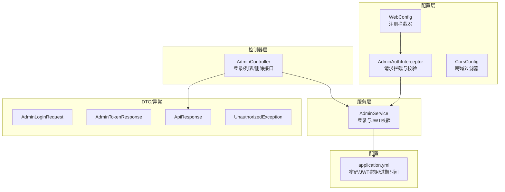
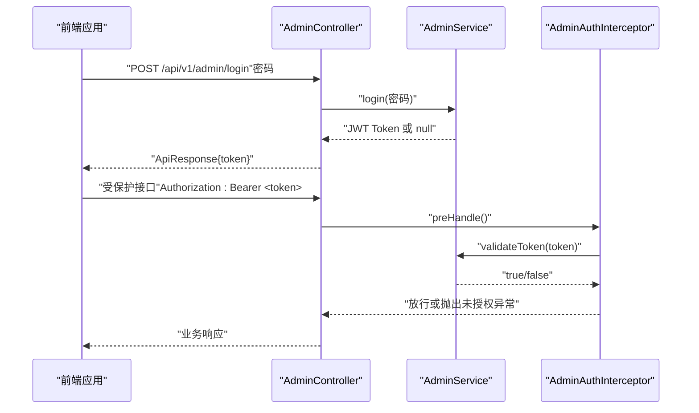
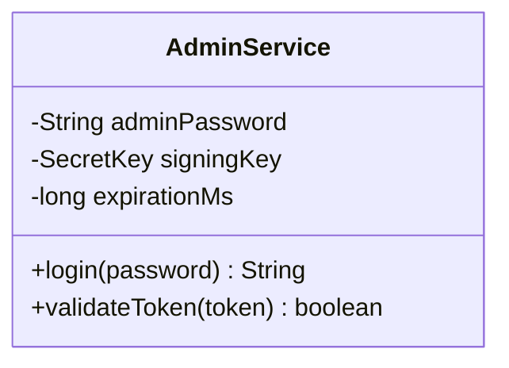
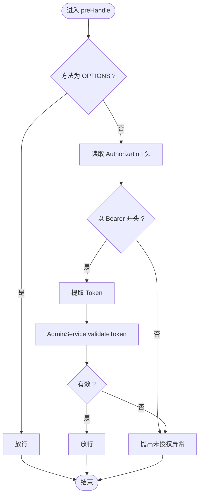
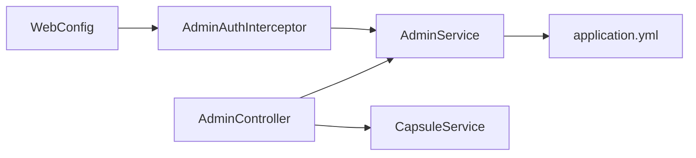
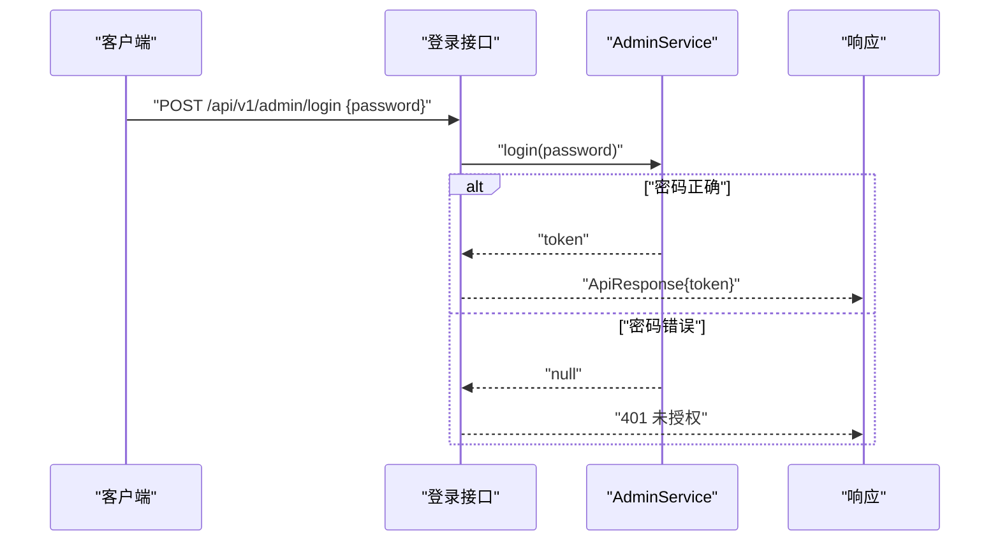
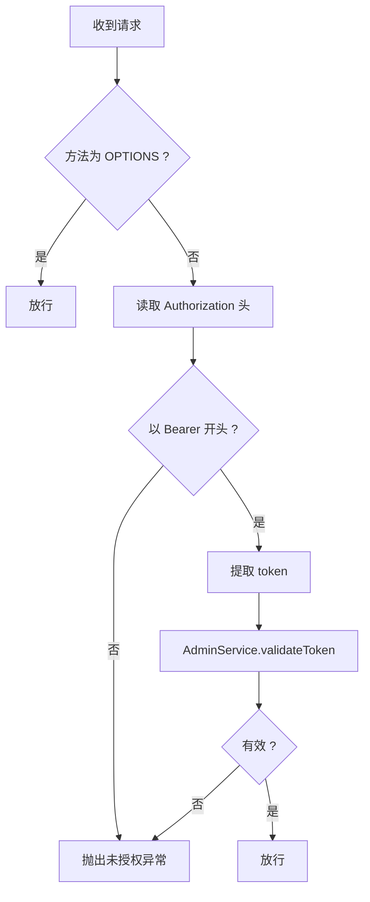

# 管理员认证服务

<cite>
**本文引用的文件**
- [AdminService.java](file://backends/spring-boot/src/main/java/com/hellotime/service/AdminService.java)
- [AdminAuthInterceptor.java](file://backends/spring-boot/src/main/java/com/hellotime/config/AdminAuthInterceptor.java)
- [WebConfig.java](file://backends/spring-boot/src/main/java/com/hellotime/config/WebConfig.java)
- [CorsConfig.java](file://backends/spring-boot/src/main/java/com/hellotime/config/CorsConfig.java)
- [AdminController.java](file://backends/spring-boot/src/main/java/com/hellotime/controller/AdminController.java)
- [AdminLoginRequest.java](file://backends/spring-boot/src/main/java/com/hellotime/dto/AdminLoginRequest.java)
- [AdminTokenResponse.java](file://backends/spring-boot/src/main/java/com/hellotime/dto/AdminTokenResponse.java)
- [ApiResponse.java](file://backends/spring-boot/src/main/java/com/hellotime/dto/ApiResponse.java)
- [UnauthorizedException.java](file://backends/spring-boot/src/main/java/com/hellotime/exception/UnauthorizedException.java)
- [application.yml](file://backends/spring-boot/src/main/resources/application.yml)
- [AdminServiceTest.java](file://backends/spring-boot/src/test/java/com/hellotime/service/AdminServiceTest.java)
- [admin.service.ts](file://frontends/angular-ts/src/app/services/admin.service.ts)
- [AdminLogin.tsx](file://frontends/react-ts/src/components/AdminLogin.tsx)
- [AdminLogin.vue](file://frontends/vue3-ts/src/components/AdminLogin.vue)
</cite>

## 目录
1. [简介](#简介)
2. [项目结构](#项目结构)
3. [核心组件](#核心组件)
4. [架构总览](#架构总览)
5. [详细组件分析](#详细组件分析)
6. [依赖分析](#依赖分析)
7. [性能考虑](#性能考虑)
8. [故障排查指南](#故障排查指南)
9. [结论](#结论)
10. [附录](#附录)

## 简介
本文件面向管理员认证服务的技术与非技术读者，系统性解析 Spring Boot 后端的 AdminService 类与 AdminAuthInterceptor 拦截器，涵盖管理员登录验证、JWT 令牌生成与校验、权限拦截、异常处理、跨域配置以及与前端的集成方式。文档同时提供最佳实践、安全考量、性能优化建议与常见问题解决方案。

## 项目结构
后端采用 Spring MVC + JPA 的标准分层架构，认证相关的关键模块位于以下包与文件：
- 服务层：com.hellotime.service（AdminService）
- 控制器层：com.hellotime.controller（AdminController）
- 配置层：com.hellotime.config（WebConfig、AdminAuthInterceptor、CorsConfig）
- DTO 层：com.hellotime.dto（AdminLoginRequest、AdminTokenResponse、ApiResponse）
- 异常层：com.hellotime.exception（UnauthorizedException）
- 配置文件：application.yml
- 测试：AdminServiceTest

图表来源
- [WebConfig.java:25-30](file://backends/spring-boot/src/main/java/com/hellotime/config/WebConfig.java#L25-L30)
- [AdminAuthInterceptor.java:34-57](file://backends/spring-boot/src/main/java/com/hellotime/config/AdminAuthInterceptor.java#L34-L57)
- [AdminService.java:35-44](file://backends/spring-boot/src/main/java/com/hellotime/service/AdminService.java#L35-L44)
- [AdminController.java:39-46](file://backends/spring-boot/src/main/java/com/hellotime/controller/AdminController.java#L39-L46)
- [application.yml:16-22](file://backends/spring-boot/src/main/resources/application.yml#L16-L22)

章节来源
- [WebConfig.java:11-31](file://backends/spring-boot/src/main/java/com/hellotime/config/WebConfig.java#L11-L31)
- [application.yml:1-22](file://backends/spring-boot/src/main/resources/application.yml#L1-L22)

## 核心组件
- AdminService：负责管理员登录验证与 JWT 令牌的生成与校验，使用对称加密（HMAC-SHA256）签名，支持可配置的过期时间。
- AdminAuthInterceptor：基于 Servlet Interceptor 的请求拦截器，校验 Authorization 头中的 Bearer Token，并对 OPTIONS 预检请求放行。
- WebConfig：注册拦截器并对 /api/v1/admin/** 路径启用认证，排除 /api/v1/admin/login。
- AdminController：提供登录、列表与删除接口，其中登录接口无需认证，其余接口受拦截器保护。
- DTO 与统一响应：AdminLoginRequest、AdminTokenResponse、ApiResponse 统一前后端交互格式。
- 异常体系：UnauthorizedException 用于未授权场景，由全局异常处理捕获并返回 401。

章节来源
- [AdminService.java:14-88](file://backends/spring-boot/src/main/java/com/hellotime/service/AdminService.java#L14-L88)
- [AdminAuthInterceptor.java:10-58](file://backends/spring-boot/src/main/java/com/hellotime/config/AdminAuthInterceptor.java#L10-L58)
- [WebConfig.java:20-30](file://backends/spring-boot/src/main/java/com/hellotime/config/WebConfig.java#L20-L30)
- [AdminController.java:31-77](file://backends/spring-boot/src/main/java/com/hellotime/controller/AdminController.java#L31-L77)
- [AdminLoginRequest.java:5-12](file://backends/spring-boot/src/main/java/com/hellotime/dto/AdminLoginRequest.java#L5-L12)
- [AdminTokenResponse.java:3-12](file://backends/spring-boot/src/main/java/com/hellotime/dto/AdminTokenResponse.java#L3-L12)
- [ApiResponse.java:15-67](file://backends/spring-boot/src/main/java/com/hellotime/dto/ApiResponse.java#L15-L67)
- [UnauthorizedException.java:8-18](file://backends/spring-boot/src/main/java/com/hellotime/exception/UnauthorizedException.java#L8-L18)

## 架构总览
下图展示管理员认证的端到端流程：前端提交密码 -> 后端 AdminController 登录 -> AdminService 生成 JWT -> 前端携带 Authorization: Bearer Token -> AdminAuthInterceptor 校验 -> 业务接口放行。

图表来源
- [AdminController.java:39-46](file://backends/spring-boot/src/main/java/com/hellotime/controller/AdminController.java#L39-L46)
- [AdminService.java:53-66](file://backends/spring-boot/src/main/java/com/hellotime/service/AdminService.java#L53-L66)
- [AdminAuthInterceptor.java:34-57](file://backends/spring-boot/src/main/java/com/hellotime/config/AdminAuthInterceptor.java#L34-L57)

## 详细组件分析

### AdminService：登录与 JWT 管理
- 配置注入
  - 从配置文件读取管理员密码、JWT 密钥与过期时间（小时），过期时间转换为毫秒。
- 登录流程
  - 输入密码与配置中的管理员密码比较，一致则使用 JJWT 生成带签名的 JWT，包含签发时间与过期时间；否则返回空值。
- Token 校验
  - 使用相同签名密钥验证签名与解析，捕获签名异常或非法参数异常并返回无效。
- 安全要点
  - 使用强密钥（建议长度满足 HS256 要求）。
  - 过期时间短（默认 2 小时）降低泄露风险。
  - 仅在登录接口返回 Token，其他接口通过拦截器校验。

图表来源
- [AdminService.java:21-44](file://backends/spring-boot/src/main/java/com/hellotime/service/AdminService.java#L21-L44)
- [AdminService.java:53-66](file://backends/spring-boot/src/main/java/com/hellotime/service/AdminService.java#L53-L66)
- [AdminService.java:75-87](file://backends/spring-boot/src/main/java/com/hellotime/service/AdminService.java#L75-L87)

章节来源
- [AdminService.java:35-44](file://backends/spring-boot/src/main/java/com/hellotime/service/AdminService.java#L35-L44)
- [AdminService.java:53-66](file://backends/spring-boot/src/main/java/com/hellotime/service/AdminService.java#L53-L66)
- [AdminService.java:75-87](file://backends/spring-boot/src/main/java/com/hellotime/service/AdminService.java#L75-L87)
- [application.yml:16-22](file://backends/spring-boot/src/main/resources/application.yml#L16-L22)

### AdminAuthInterceptor：请求拦截与权限验证
- 拦截范围
  - 在 WebConfig 中注册，拦截 /api/v1/admin/** 并排除 /api/v1/admin/login。
- 校验逻辑
  - 放行 OPTIONS 预检请求。
  - 校验 Authorization 头必须以 "Bearer " 开头，提取 Token。
  - 调用 AdminService.validateToken 校验签名与过期，失败抛出 UnauthorizedException。
- 异常处理
  - 未授权异常由全局异常处理器捕获并返回 401。

图表来源
- [AdminAuthInterceptor.java:34-57](file://backends/spring-boot/src/main/java/com/hellotime/config/AdminAuthInterceptor.java#L34-L57)
- [WebConfig.java:25-30](file://backends/spring-boot/src/main/java/com/hellotime/config/WebConfig.java#L25-L30)
- [AdminService.java:75-87](file://backends/spring-boot/src/main/java/com/hellotime/service/AdminService.java#L75-L87)

章节来源
- [AdminAuthInterceptor.java:24-57](file://backends/spring-boot/src/main/java/com/hellotime/config/AdminAuthInterceptor.java#L24-L57)
- [WebConfig.java:25-30](file://backends/spring-boot/src/main/java/com/hellotime/config/WebConfig.java#L25-L30)
- [UnauthorizedException.java:8-18](file://backends/spring-boot/src/main/java/com/hellotime/exception/UnauthorizedException.java#L8-L18)

### WebConfig：拦截器注册与排除规则
- 注册 AdminAuthInterceptor。
- 对 /api/v1/admin/** 生效，排除 /api/v1/admin/login，避免登录接口被拦截。

章节来源
- [WebConfig.java:25-30](file://backends/spring-boot/src/main/java/com/hellotime/config/WebConfig.java#L25-L30)

### AdminController：登录与受保护接口
- 登录接口：POST /api/v1/admin/login，接收 AdminLoginRequest，调用 AdminService.login，返回 AdminTokenResponse 包裹在 ApiResponse 中。
- 受保护接口：GET /api/v1/admin/capsules、DELETE /api/v1/admin/capsules/{code}，由拦截器保证 Token 有效。

章节来源
- [AdminController.java:39-46](file://backends/spring-boot/src/main/java/com/hellotime/controller/AdminController.java#L39-L46)
- [AdminController.java:57-76](file://backends/spring-boot/src/main/java/com/hellotime/controller/AdminController.java#L57-L76)
- [AdminLoginRequest.java:5-12](file://backends/spring-boot/src/main/java/com/hellotime/dto/AdminLoginRequest.java#L5-L12)
- [AdminTokenResponse.java:3-12](file://backends/spring-boot/src/main/java/com/hellotime/dto/AdminTokenResponse.java#L3-L12)
- [ApiResponse.java:27-55](file://backends/spring-boot/src/main/java/com/hellotime/dto/ApiResponse.java#L27-L55)

### DTO 与统一响应
- AdminLoginRequest：校验密码非空。
- AdminTokenResponse：封装 token 字段。
- ApiResponse：统一 success/data/message/errorCode 结构，序列化时忽略 null 字段。

章节来源
- [AdminLoginRequest.java:5-12](file://backends/spring-boot/src/main/java/com/hellotime/dto/AdminLoginRequest.java#L5-L12)
- [AdminTokenResponse.java:3-12](file://backends/spring-boot/src/main/java/com/hellotime/dto/AdminTokenResponse.java#L3-L12)
- [ApiResponse.java:15-67](file://backends/spring-boot/src/main/java/com/hellotime/dto/ApiResponse.java#L15-L67)

### CORS 配置
- 允许本地开发域名 http://localhost:*。
- 支持常用方法与通配符头，允许凭据，预检缓存 1 小时。
- 仅对 /api/** 生效。

章节来源
- [CorsConfig.java:14-26](file://backends/spring-boot/src/main/java/com/hellotime/config/CorsConfig.java#L14-L26)

## 依赖分析
- AdminController 依赖 AdminService 与 CapsuleService。
- AdminAuthInterceptor 依赖 AdminService。
- WebConfig 依赖 AdminAuthInterceptor。
- AdminService 依赖配置文件中的密码、JWT 密钥与过期时间。
- 前端通过 HTTP 请求访问后端接口，使用 Authorization 头传递 Bearer Token。

图表来源
- [AdminController.java:20-29](file://backends/spring-boot/src/main/java/com/hellotime/controller/AdminController.java#L20-L29)
- [AdminAuthInterceptor.java:18-22](file://backends/spring-boot/src/main/java/com/hellotime/config/AdminAuthInterceptor.java#L18-L22)
- [WebConfig.java:14-18](file://backends/spring-boot/src/main/java/com/hellotime/config/WebConfig.java#L14-L18)
- [AdminService.java:35-44](file://backends/spring-boot/src/main/java/com/hellotime/service/AdminService.java#L35-L44)
- [application.yml:16-22](file://backends/spring-boot/src/main/resources/application.yml#L16-L22)

章节来源
- [AdminController.java:20-29](file://backends/spring-boot/src/main/java/com/hellotime/controller/AdminController.java#L20-L29)
- [AdminAuthInterceptor.java:18-22](file://backends/spring-boot/src/main/java/com/hellotime/config/AdminAuthInterceptor.java#L18-L22)
- [WebConfig.java:14-18](file://backends/spring-boot/src/main/java/com/hellotime/config/WebConfig.java#L14-L18)
- [AdminService.java:35-44](file://backends/spring-boot/src/main/java/com/hellotime/service/AdminService.java#L35-L44)
- [application.yml:16-22](file://backends/spring-boot/src/main/resources/application.yml#L16-L22)

## 性能考虑
- Token 校验开销极低，主要为对称解密与时间比较，性能影响可忽略。
- 建议：
  - 将过期时间设为较短（如 2 小时），结合刷新策略（可在前端定期续期）。
  - 使用连接池与数据库索引优化受保护接口的数据库查询。
  - 对频繁访问的接口开启合理的缓存（需注意数据一致性）。

## 故障排查指南
- 登录失败
  - 确认密码与配置文件一致；检查 AdminService.login 返回 null 的分支。
  - 查看控制器返回的 401 未授权响应。
- Token 无效或过期
  - 检查 Authorization 头格式是否为 "Bearer <token>"。
  - 确认签名密钥与生成时一致；核对过期时间。
  - 拦截器会抛出未授权异常，确认异常被捕获并返回 401。
- CORS 问题
  - 确认请求域名匹配配置的允许模式；检查预检请求是否被放行。
- 单元测试参考
  - AdminServiceTest 覆盖了正确密码登录、错误密码登录、有效/无效 Token 校验。

章节来源
- [AdminServiceTest.java:15-37](file://backends/spring-boot/src/test/java/com/hellotime/service/AdminServiceTest.java#L15-L37)
- [AdminAuthInterceptor.java:44-53](file://backends/spring-boot/src/main/java/com/hellotime/config/AdminAuthInterceptor.java#L44-L53)
- [UnauthorizedException.java:8-18](file://backends/spring-boot/src/main/java/com/hellotime/exception/UnauthorizedException.java#L8-L18)
- [CorsConfig.java:14-26](file://backends/spring-boot/src/main/java/com/hellotime/config/CorsConfig.java#L14-L26)

## 结论
该管理员认证方案以最小依赖实现了完整的登录、Token 生成与校验、请求拦截与权限控制。通过配置化的密码与密钥、可调的过期时间，以及清晰的拦截与异常处理，既满足开发与运维需求，又具备良好的扩展性。建议在生产环境进一步强化密钥管理、引入更严格的审计与监控，并评估 Token 刷新与多设备会话管理策略。

## 附录

### 管理员登录验证流程（代码级）

图表来源
- [AdminController.java:39-46](file://backends/spring-boot/src/main/java/com/hellotime/controller/AdminController.java#L39-L46)
- [AdminService.java:53-66](file://backends/spring-boot/src/main/java/com/hellotime/service/AdminService.java#L53-L66)

### 权限拦截流程（代码级）

图表来源
- [AdminAuthInterceptor.java:34-57](file://backends/spring-boot/src/main/java/com/hellotime/config/AdminAuthInterceptor.java#L34-L57)
- [AdminService.java:75-87](file://backends/spring-boot/src/main/java/com/hellotime/service/AdminService.java#L75-L87)

### 集成指南（前端）
- Angular
  - 使用 AdminLoginComponent 触发登录事件，将密码传入后端登录接口。
  - 登录成功后，将返回的 token 存储于本地存储或内存中。
  - 发送受保护请求时，在 Authorization 头设置 "Bearer <token>"。
- React
  - 使用 AdminLogin 组件收集密码，调用 onLogin 回调。
  - 登录成功后保存 token，并在请求拦截器或 fetch/axios 中统一添加 Authorization 头。
- Vue3
  - 使用 AdminLogin 组件，通过 emits('login') 传递密码。
  - 登录成功后保存 token，并在请求时统一设置 Authorization 头。

章节来源
- [admin.service.ts](file://frontends/angular-ts/src/app/services/admin.service.ts)
- [AdminLogin.tsx:10-18](file://frontends/react-ts/src/components/AdminLogin.tsx#L10-L18)
- [AdminLogin.vue:30-40](file://frontends/vue3-ts/src/components/AdminLogin.vue#L30-L40)