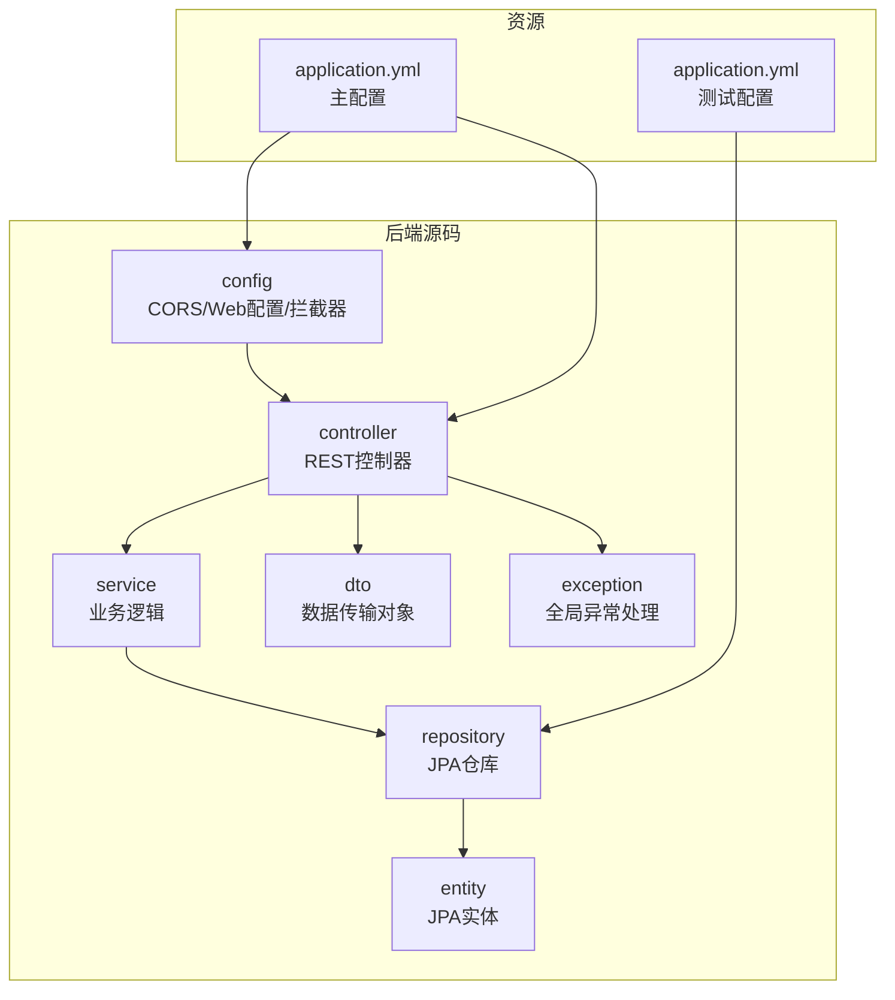
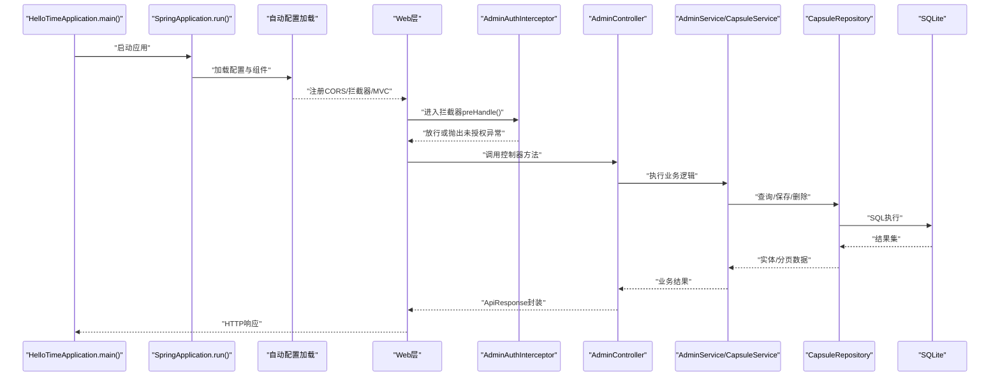
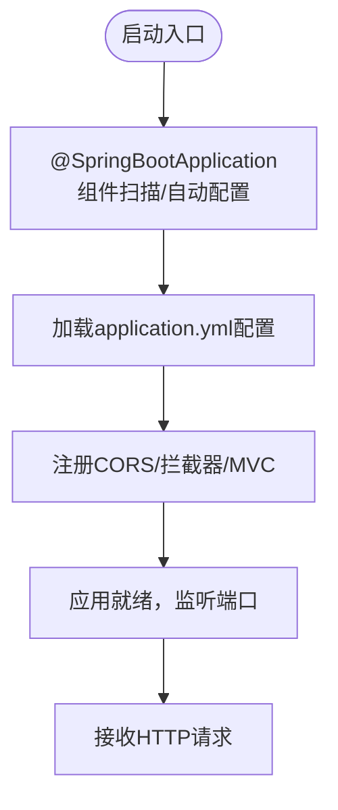
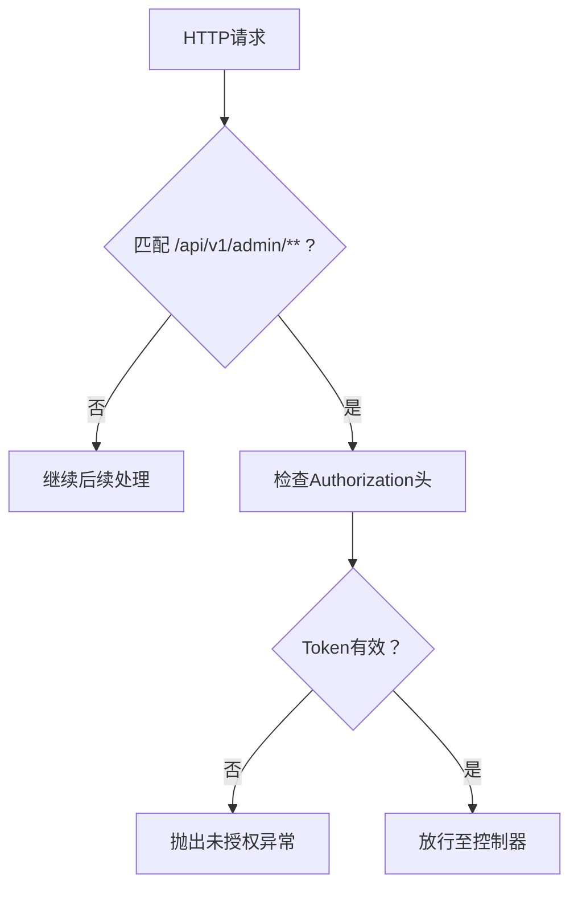
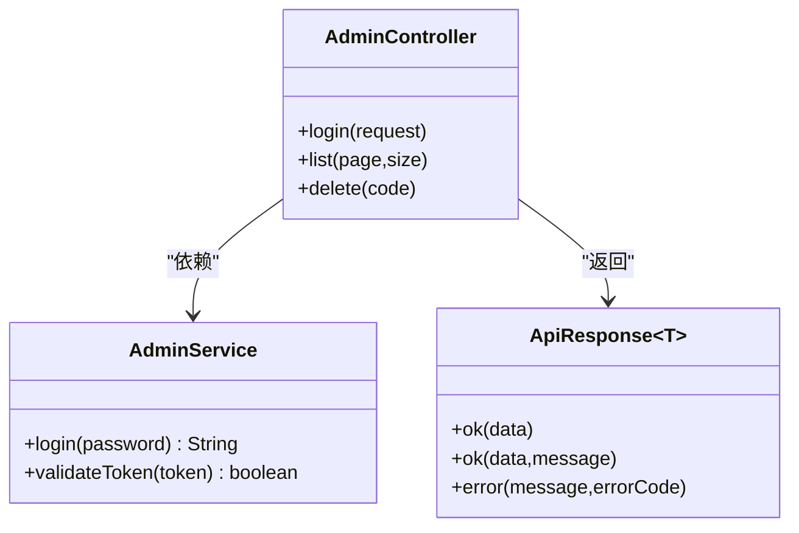
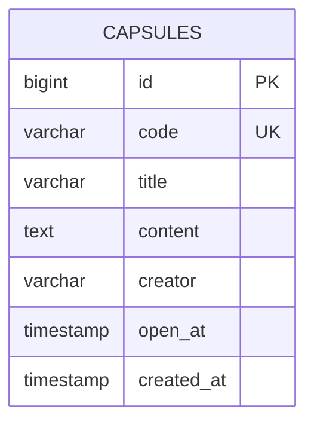
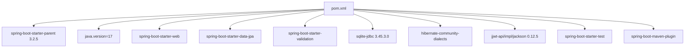

# 项目初始化与配置

<cite>
**本文引用的文件**
- [HelloTimeApplication.java](file://backends/spring-boot/src/main/java/com/hellotime/HelloTimeApplication.java)
- [application.yml（主资源）](file://backends/spring-boot/src/main/resources/application.yml)
- [pom.xml](file://backends/spring-boot/pom.xml)
- [README.md](file://backends/spring-boot/README.md)
- [CorsConfig.java](file://backends/spring-boot/src/main/java/com/hellotime/config/CorsConfig.java)
- [WebConfig.java](file://backends/spring-boot/src/main/java/com/hellotime/config/WebConfig.java)
- [AdminAuthInterceptor.java](file://backends/spring-boot/src/main/java/com/hellotime/config/AdminAuthInterceptor.java)
- [AdminController.java](file://backends/spring-boot/src/main/java/com/hellotime/controller/AdminController.java)
- [HealthController.java](file://backends/spring-boot/src/main/java/com/hellotime/controller/HealthController.java)
- [AdminService.java](file://backends/spring-boot/src/main/java/com/hellotime/service/AdminService.java)
- [Capsule.java](file://backends/spring-boot/src/main/java/com/hellotime/entity/Capsule.java)
- [CapsuleRepository.java](file://backends/spring-boot/src/main/java/com/hellotime/repository/CapsuleRepository.java)
- [ApiResponse.java](file://backends/spring-boot/src/main/java/com/hellotime/dto/ApiResponse.java)
- [GlobalExceptionHandler.java](file://backends/spring-boot/src/main/java/com/hellotime/exception/GlobalExceptionHandler.java)
- [application.yml（测试资源）](file://backends/spring-boot/src/test/resources/application.yml)
</cite>

## 目录
1. [简介](#简介)
2. [项目结构](#项目结构)
3. [核心组件](#核心组件)
4. [架构总览](#架构总览)
5. [详细组件分析](#详细组件分析)
6. [依赖分析](#依赖分析)
7. [性能考虑](#性能考虑)
8. [故障排查指南](#故障排查指南)
9. [结论](#结论)
10. [附录](#附录)

## 简介
本文件面向Spring Boot项目初始化与配置，围绕HelloTimeApplication主类的@SpringBootApplication注解作用、SpringApplication.run()启动流程与自动配置机制进行深入解析；同时详细说明application.yml配置项（服务器端口、数据库连接、CORS、日志级别等）、pom.xml依赖与Maven构建配置（Spring Boot Starter、JPA、MySQL驱动、测试框架等）的作用与版本控制策略，并提供项目结构说明、开发环境配置建议与常见配置问题的解决方案。

## 项目结构
后端采用标准的Spring Boot目录布局，主要源代码位于src/main/java，资源文件位于src/main/resources；测试代码位于src/test/java与src/test/resources。核心包结构如下：
- config：Web与安全相关配置（CORS、拦截器、MVC注册）
- controller：REST控制器（管理员、胶囊、健康检查）
- service：业务逻辑层（管理员认证、胶囊服务）
- repository：数据访问层（JPA仓库）
- entity：JPA实体（胶囊）
- dto：数据传输对象（统一响应封装）
- exception：全局异常处理

图表来源
- [CorsConfig.java:1-28](file://backends/spring-boot/src/main/java/com/hellotime/config/CorsConfig.java#L1-L28)
- [WebConfig.java:1-32](file://backends/spring-boot/src/main/java/com/hellotime/config/WebConfig.java#L1-L32)
- [AdminController.java:1-78](file://backends/spring-boot/src/main/java/com/hellotime/controller/AdminController.java#L1-L78)
- [HealthController.java:1-28](file://backends/spring-boot/src/main/java/com/hellotime/controller/HealthController.java#L1-L28)
- [AdminService.java:1-89](file://backends/spring-boot/src/main/java/com/hellotime/service/AdminService.java#L1-L89)
- [CapsuleRepository.java:1-48](file://backends/spring-boot/src/main/java/com/hellotime/repository/CapsuleRepository.java#L1-L48)
- [Capsule.java:1-90](file://backends/spring-boot/src/main/java/com/hellotime/entity/Capsule.java#L1-L90)
- [ApiResponse.java:1-68](file://backends/spring-boot/src/main/java/com/hellotime/dto/ApiResponse.java#L1-L68)
- [GlobalExceptionHandler.java:1-87](file://backends/spring-boot/src/main/java/com/hellotime/exception/GlobalExceptionHandler.java#L1-L87)
- [application.yml（主资源）:1-22](file://backends/spring-boot/src/main/resources/application.yml#L1-L22)
- [application.yml（测试资源）:1-16](file://backends/spring-boot/src/test/resources/application.yml#L1-L16)

章节来源
- [HelloTimeApplication.java:1-12](file://backends/spring-boot/src/main/java/com/hellotime/HelloTimeApplication.java#L1-L12)
- [README.md:77-87](file://backends/spring-boot/README.md#L77-L87)

## 核心组件
- HelloTimeApplication主类：通过@SpringBootApplication启用自动配置与组件扫描，入口方法调用SpringApplication.run()完成启动。
- 配置体系：application.yml定义数据库、JPA、服务器端口、应用级配置（管理员密码、JWT密钥与过期时长）；测试资源覆盖内存数据库与测试专用配置。
- Web与安全：CORS配置允许本地开发跨域；拦截器对管理员接口进行认证校验；全局异常处理器统一错误响应。
- 数据层：JPA实体与仓库实现胶囊的CRUD与分页查询；Hibernate方言指向SQLite方言。
- 业务层：管理员服务负责登录与JWT签发/校验；控制器提供登录、分页查询、删除等接口。

章节来源
- [HelloTimeApplication.java:6-10](file://backends/spring-boot/src/main/java/com/hellotime/HelloTimeApplication.java#L6-L10)
- [application.yml（主资源）:1-22](file://backends/spring-boot/src/main/resources/application.yml#L1-L22)
- [application.yml（测试资源）:1-16](file://backends/spring-boot/src/test/resources/application.yml#L1-L16)
- [CorsConfig.java:11-27](file://backends/spring-boot/src/main/java/com/hellotime/config/CorsConfig.java#L11-L27)
- [WebConfig.java:11-31](file://backends/spring-boot/src/main/java/com/hellotime/config/WebConfig.java#L11-L31)
- [AdminAuthInterceptor.java:15-59](file://backends/spring-boot/src/main/java/com/hellotime/config/AdminAuthInterceptor.java#L15-L59)
- [GlobalExceptionHandler.java:15-87](file://backends/spring-boot/src/main/java/com/hellotime/exception/GlobalExceptionHandler.java#L15-L87)
- [Capsule.java:10-90](file://backends/spring-boot/src/main/java/com/hellotime/entity/Capsule.java#L10-L90)
- [CapsuleRepository.java:15-47](file://backends/spring-boot/src/main/java/com/hellotime/repository/CapsuleRepository.java#L15-L47)
- [AdminService.java:18-89](file://backends/spring-boot/src/main/java/com/hellotime/service/AdminService.java#L18-L89)
- [AdminController.java:16-78](file://backends/spring-boot/src/main/java/com/hellotime/controller/AdminController.java#L16-L78)

## 架构总览
下图展示从启动到请求处理的关键流程：主类启动、自动配置加载、Web层接收请求、拦截器校验、控制器调用服务、JPA持久化、统一响应与异常处理。

图表来源
- [HelloTimeApplication.java:8-10](file://backends/spring-boot/src/main/java/com/hellotime/HelloTimeApplication.java#L8-L10)
- [CorsConfig.java:14-26](file://backends/spring-boot/src/main/java/com/hellotime/config/CorsConfig.java#L14-L26)
- [WebConfig.java:26-30](file://backends/spring-boot/src/main/java/com/hellotime/config/WebConfig.java#L26-L30)
- [AdminAuthInterceptor.java:34-57](file://backends/spring-boot/src/main/java/com/hellotime/config/AdminAuthInterceptor.java#L34-L57)
- [AdminController.java:39-76](file://backends/spring-boot/src/main/java/com/hellotime/controller/AdminController.java#L39-L76)
- [AdminService.java:53-87](file://backends/spring-boot/src/main/java/com/hellotime/service/AdminService.java#L53-L87)
- [CapsuleRepository.java:23-46](file://backends/spring-boot/src/main/java/com/hellotime/repository/CapsuleRepository.java#L23-L46)
- [application.yml（主资源）:4-21](file://backends/spring-boot/src/main/resources/application.yml#L4-L21)

## 详细组件分析

### HelloTimeApplication主类与启动流程
- @SpringBootApplication：组合注解，启用组件扫描、自动配置与条件化配置，是Spring Boot应用的入口。
- SpringApplication.run()：引导应用上下文启动，加载外部配置与自动配置，绑定Web嵌入式容器（默认Tomcat由starter-web引入）。

图表来源
- [HelloTimeApplication.java:6-10](file://backends/spring-boot/src/main/java/com/hellotime/HelloTimeApplication.java#L6-L10)
- [application.yml（主资源）:1-22](file://backends/spring-boot/src/main/resources/application.yml#L1-L22)

章节来源
- [HelloTimeApplication.java:6-10](file://backends/spring-boot/src/main/java/com/hellotime/HelloTimeApplication.java#L6-L10)

### application.yml配置详解
- spring.application.name：应用名称。
- spring.datasource：数据源配置，使用SQLite JDBC驱动与URL。
- spring.jpa：数据库平台为SQLite方言，DDL策略为更新，SQL显示开关关闭。
- server.port：HTTP服务端口。
- app.admin.password：管理员登录密码（支持环境变量覆盖）。
- app.jwt.secret：JWT签名密钥（支持环境变量覆盖）。
- app.jwt.expiration-hours：JWT过期时长（小时）。

章节来源
- [application.yml（主资源）:1-22](file://backends/spring-boot/src/main/resources/application.yml#L1-L22)
- [README.md:40-52](file://backends/spring-boot/README.md#L40-L52)

### CORS与拦截器配置
- CorsConfig：定义CORS策略，允许本地开发域名、通用方法与头部、凭证与缓存时间，并仅对/api/**路径生效。
- WebConfig：注册AdminAuthInterceptor，拦截/api/v1/admin/**路径，排除登录接口。
- AdminAuthInterceptor：校验Authorization头中Bearer Token，放行OPTIONS预检请求，否则抛出未授权异常。

图表来源
- [WebConfig.java:26-30](file://backends/spring-boot/src/main/java/com/hellotime/config/WebConfig.java#L26-L30)
- [AdminAuthInterceptor.java:34-57](file://backends/spring-boot/src/main/java/com/hellotime/config/AdminAuthInterceptor.java#L34-L57)
- [CorsConfig.java:14-26](file://backends/spring-boot/src/main/java/com/hellotime/config/CorsConfig.java#L14-L26)

章节来源
- [CorsConfig.java:11-27](file://backends/spring-boot/src/main/java/com/hellotime/config/CorsConfig.java#L11-L27)
- [WebConfig.java:11-31](file://backends/spring-boot/src/main/java/com/hellotime/config/WebConfig.java#L11-L31)
- [AdminAuthInterceptor.java:15-59](file://backends/spring-boot/src/main/java/com/hellotime/config/AdminAuthInterceptor.java#L15-L59)

### 控制器与业务层
- AdminController：提供管理员登录、分页查询胶囊、删除胶囊接口；登录接口无需认证，其余接口受拦截器保护。
- AdminService：基于配置的管理员密码与JWT密钥生成与校验Token；使用HMAC-SHA256算法。
- ApiResponse：统一响应封装，包含success、data、message、errorCode字段，序列化时忽略null。

图表来源
- [AdminController.java:16-78](file://backends/spring-boot/src/main/java/com/hellotime/controller/AdminController.java#L16-L78)
- [AdminService.java:18-89](file://backends/spring-boot/src/main/java/com/hellotime/service/AdminService.java#L18-L89)
- [ApiResponse.java:15-68](file://backends/spring-boot/src/main/java/com/hellotime/dto/ApiResponse.java#L15-L68)

章节来源
- [AdminController.java:16-78](file://backends/spring-boot/src/main/java/com/hellotime/controller/AdminController.java#L16-L78)
- [AdminService.java:18-89](file://backends/spring-boot/src/main/java/com/hellotime/service/AdminService.java#L18-L89)
- [ApiResponse.java:15-68](file://backends/spring-boot/src/main/java/com/hellotime/dto/ApiResponse.java#L15-L68)

### 数据模型与仓储
- Capsule实体：定义胶囊表字段（code、title、content、creator、openAt、createdAt），持久化前自动填充创建时间。
- CapsuleRepository：继承JpaRepository，提供按code查询、存在性判断、分页查询与按创建时间倒序、按code删除等方法。

图表来源
- [Capsule.java:10-90](file://backends/spring-boot/src/main/java/com/hellotime/entity/Capsule.java#L10-L90)
- [CapsuleRepository.java:15-47](file://backends/spring-boot/src/main/java/com/hellotime/repository/CapsuleRepository.java#L15-L47)

章节来源
- [Capsule.java:10-90](file://backends/spring-boot/src/main/java/com/hellotime/entity/Capsule.java#L10-L90)
- [CapsuleRepository.java:15-47](file://backends/spring-boot/src/main/java/com/hellotime/repository/CapsuleRepository.java#L15-L47)

### 全局异常处理
- GlobalExceptionHandler：统一处理未找到、未授权、参数校验、非法参数与通用异常，返回标准化错误响应与对应HTTP状态码。

章节来源
- [GlobalExceptionHandler.java:15-87](file://backends/spring-boot/src/main/java/com/hellotime/exception/GlobalExceptionHandler.java#L15-L87)

## 依赖分析
- 父POM：spring-boot-starter-parent 3.2.5，统一插件与依赖版本管理。
- Java版本：17。
- 核心Starter：web、data-jpa、validation。
- 数据库：sqlite-jdbc 3.45.3.0；Hibernate社区方言模块。
- 安全：jjwt-api/impl/jackson 0.12.5。
- 测试：spring-boot-starter-test。
- 构建：spring-boot-maven-plugin。

图表来源
- [pom.xml:7-12](file://backends/spring-boot/pom.xml#L7-L12)
- [pom.xml:20-23](file://backends/spring-boot/pom.xml#L20-L23)
- [pom.xml:25-80](file://backends/spring-boot/pom.xml#L25-L80)
- [pom.xml:82-89](file://backends/spring-boot/pom.xml#L82-L89)

章节来源
- [pom.xml:1-91](file://backends/spring-boot/pom.xml#L1-L91)
- [README.md:7-11](file://backends/spring-boot/README.md#L7-L11)

## 性能考虑
- 数据库：SQLite适合开发与小规模场景；生产建议评估事务并发、索引与连接池配置。
- JPA：合理使用分页查询与懒加载；避免N+1查询；必要时使用原生SQL或投影DTO。
- 日志：生产环境建议调整日志级别与输出位置，避免过多I/O开销。
- CORS：仅开放必要的Origin与方法，减少跨域风险与预检次数。
- JWT：短小精悍的负载，避免过长声明；定期轮换密钥；注意客户端Token存储安全。

## 故障排查指南
- 启动失败（端口占用）：检查server.port配置，或更换端口。
- 数据库连接失败：确认datasource.url与driver-class-name正确；SQLite需确保路径可写。
- CORS跨域失败：确认CORS配置对/api/**路径生效，允许的Origin与方法是否包含前端地址。
- 管理员登录失败：核对ADMIN_PASSWORD环境变量或配置文件；确认请求头Authorization格式为Bearer Token。
- 参数校验错误：关注400响应中的字段错误提示，修正请求体字段。
- 未授权访问：确认携带有效的JWT Token，且未过期。

章节来源
- [application.yml（主资源）:13-21](file://backends/spring-boot/src/main/resources/application.yml#L13-L21)
- [CorsConfig.java:16-21](file://backends/spring-boot/src/main/java/com/hellotime/config/CorsConfig.java#L16-L21)
- [AdminAuthInterceptor.java:41-53](file://backends/spring-boot/src/main/java/com/hellotime/config/AdminAuthInterceptor.java#L41-L53)
- [GlobalExceptionHandler.java:50-59](file://backends/spring-boot/src/main/java/com/hellotime/exception/GlobalExceptionHandler.java#L50-L59)
- [README.md:40-52](file://backends/spring-boot/README.md#L40-L52)

## 结论
本项目以Spring Boot为核心，结合JPA与SQLite实现轻量级后端服务，通过统一配置、拦截器与全局异常处理保障开发效率与运行稳定性。建议在开发阶段充分利用环境变量与测试配置，在生产阶段优化数据库与日志策略，并加强安全与监控能力。

## 附录
- 开发与运行：使用Maven Wrapper或系统Maven执行spring-boot:run；测试使用./mvnw test；构建可执行JAR使用package。
- 健康检查：/api/v1/health返回技术栈信息。
- API端点：管理员登录、分页查询、删除胶囊等。

章节来源
- [README.md:28-107](file://backends/spring-boot/README.md#L28-L107)
- [HealthController.java:15-26](file://backends/spring-boot/src/main/java/com/hellotime/controller/HealthController.java#L15-L26)
- [AdminController.java:39-76](file://backends/spring-boot/src/main/java/com/hellotime/controller/AdminController.java#L39-L76)