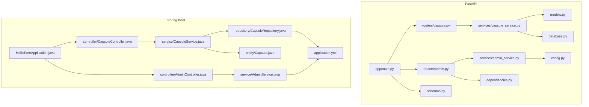
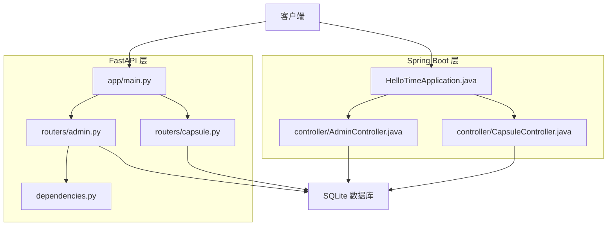
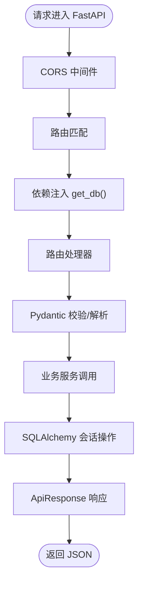
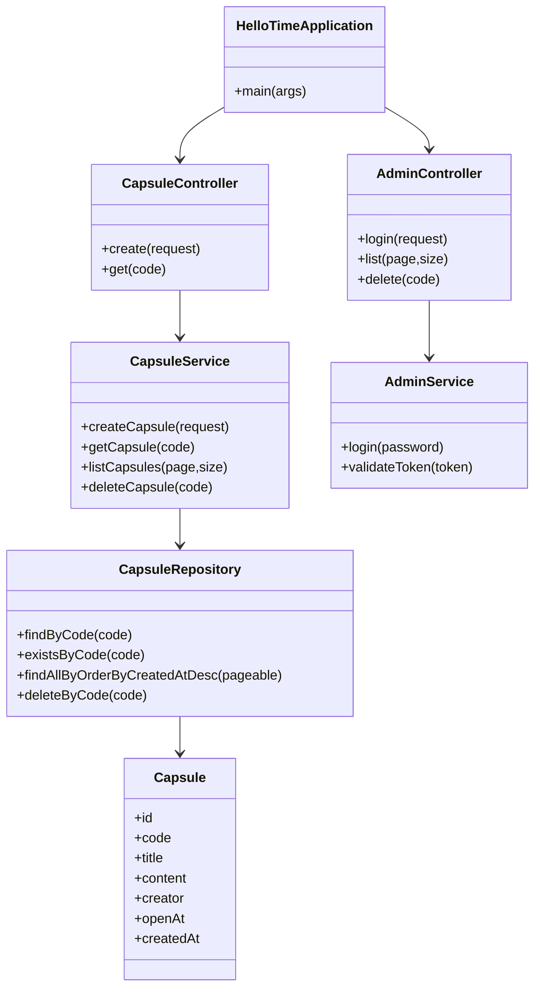
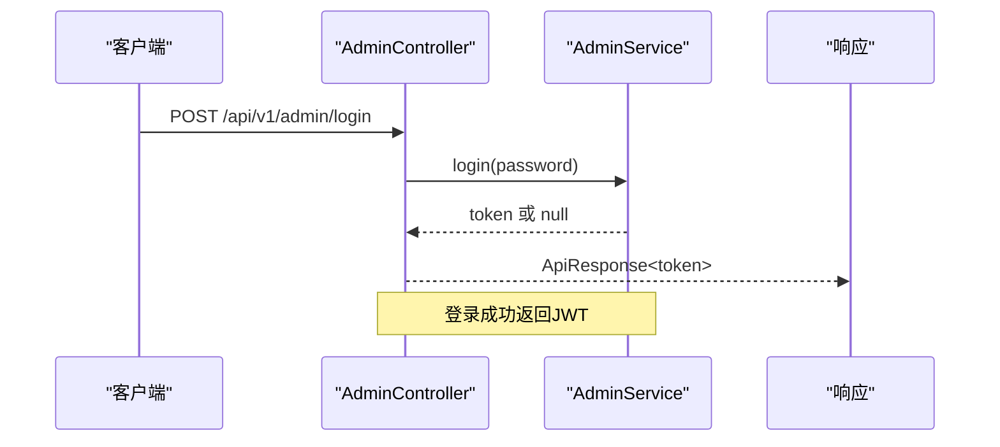
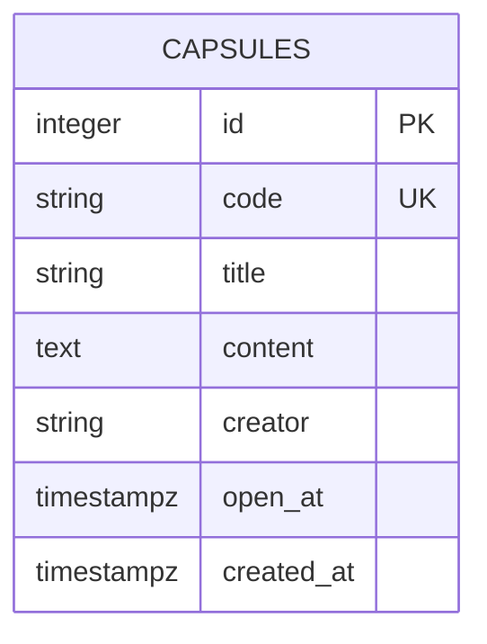
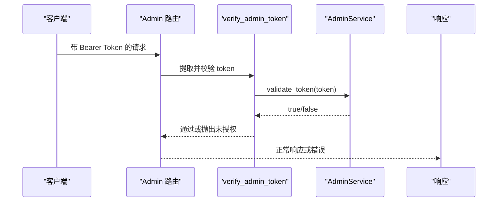
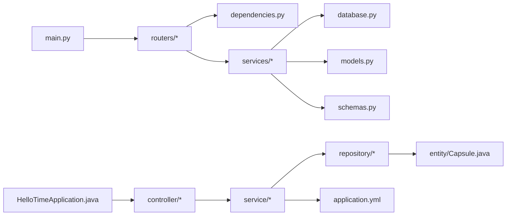

# 后端实现详解

<cite>
**本文引用的文件**
- [backends/fastapi/app/main.py](file://backends/fastapi/app/main.py)
- [backends/fastapi/app/routers/capsule.py](file://backends/fastapi/app/routers/capsule.py)
- [backends/fastapi/app/routers/admin.py](file://backends/fastapi/app/routers/admin.py)
- [backends/fastapi/app/services/capsule_service.py](file://backends/fastapi/app/services/capsule_service.py)
- [backends/fastapi/app/services/admin_service.py](file://backends/fastapi/app/services/admin_service.py)
- [backends/fastapi/app/models.py](file://backends/fastapi/app/models.py)
- [backends/fastapi/app/database.py](file://backends/fastapi/app/database.py)
- [backends/fastapi/app/config.py](file://backends/fastapi/app/config.py)
- [backends/fastapi/app/schemas.py](file://backends/fastapi/app/schemas.py)
- [backends/fastapi/app/dependencies.py](file://backends/fastapi/app/dependencies.py)
- [backends/spring-boot/src/main/java/com/hellotime/HelloTimeApplication.java](file://backends/spring-boot/src/main/java/com/hellotime/HelloTimeApplication.java)
- [backends/spring-boot/src/main/java/com/hellotime/controller/CapsuleController.java](file://backends/spring-boot/src/main/java/com/hellotime/controller/CapsuleController.java)
- [backends/spring-boot/src/main/java/com/hellotime/controller/AdminController.java](file://backends/spring-boot/src/main/java/com/hellotime/controller/AdminController.java)
- [backends/spring-boot/src/main/java/com/hellotime/service/CapsuleService.java](file://backends/spring-boot/src/main/java/com/hellotime/service/CapsuleService.java)
- [backends/spring-boot/src/main/java/com/hellotime/service/AdminService.java](file://backends/spring-boot/src/main/java/com/hellotime/service/AdminService.java)
- [backends/spring-boot/src/main/java/com/hellotime/entity/Capsule.java](file://backends/spring-boot/src/main/java/com/hellotime/entity/Capsule.java)
- [backends/spring-boot/src/main/java/com/hellotime/repository/CapsuleRepository.java](file://backends/spring-boot/src/main/java/com/hellotime/repository/CapsuleRepository.java)
- [backends/spring-boot/src/main/resources/application.yml](file://backends/spring-boot/src/main/resources/application.yml)
</cite>

## 目录
1. [引言](#引言)
2. [项目结构](#项目结构)
3. [核心组件](#核心组件)
4. [架构总览](#架构总览)
5. [详细组件分析](#详细组件分析)
6. [依赖分析](#依赖分析)
7. [性能考虑](#性能考虑)
8. [故障排查指南](#故障排查指南)
9. [结论](#结论)
10. [附录](#附录)

## 引言
本文件面向HelloTime项目的后端实现，系统性对比FastAPI与Spring Boot两套后端方案，覆盖异步编程模型、依赖注入、数据验证、路由与控制器、服务层架构、业务逻辑、数据库集成、JWT认证、异常处理、性能优化与扩展实践。读者可据此快速理解并高效维护与扩展该系统。

## 项目结构
后端采用双栈架构：
- FastAPI（Python）：轻量、类型安全、基于Pydantic的数据契约与自动OpenAPI。
- Spring Boot（Java）：注解驱动、自动配置、依赖注入容器、JPA数据访问。

图表来源
- [backends/fastapi/app/main.py:1-89](file://backends/fastapi/app/main.py#L1-L89)
- [backends/fastapi/app/routers/capsule.py:1-31](file://backends/fastapi/app/routers/capsule.py#L1-L31)
- [backends/fastapi/app/routers/admin.py:1-55](file://backends/fastapi/app/routers/admin.py#L1-L55)
- [backends/fastapi/app/services/capsule_service.py:1-144](file://backends/fastapi/app/services/capsule_service.py#L1-L144)
- [backends/fastapi/app/services/admin_service.py:1-42](file://backends/fastapi/app/services/admin_service.py#L1-L42)
- [backends/fastapi/app/models.py:1-26](file://backends/fastapi/app/models.py#L1-L26)
- [backends/fastapi/app/database.py:1-30](file://backends/fastapi/app/database.py#L1-L30)
- [backends/fastapi/app/config.py:1-18](file://backends/fastapi/app/config.py#L1-L18)
- [backends/fastapi/app/schemas.py:1-96](file://backends/fastapi/app/schemas.py#L1-L96)
- [backends/fastapi/app/dependencies.py:1-23](file://backends/fastapi/app/dependencies.py#L1-L23)
- [backends/spring-boot/src/main/java/com/hellotime/HelloTimeApplication.java:1-12](file://backends/spring-boot/src/main/java/com/hellotime/HelloTimeApplication.java#L1-L12)
- [backends/spring-boot/src/main/java/com/hellotime/controller/CapsuleController.java:1-57](file://backends/spring-boot/src/main/java/com/hellotime/controller/CapsuleController.java#L1-L57)
- [backends/spring-boot/src/main/java/com/hellotime/controller/AdminController.java:1-78](file://backends/spring-boot/src/main/java/com/hellotime/controller/AdminController.java#L1-L78)
- [backends/spring-boot/src/main/java/com/hellotime/service/CapsuleService.java:1-195](file://backends/spring-boot/src/main/java/com/hellotime/service/CapsuleService.java#L1-L195)
- [backends/spring-boot/src/main/java/com/hellotime/service/AdminService.java:1-89](file://backends/spring-boot/src/main/java/com/hellotime/service/AdminService.java#L1-L89)
- [backends/spring-boot/src/main/java/com/hellotime/entity/Capsule.java:1-90](file://backends/spring-boot/src/main/java/com/hellotime/entity/Capsule.java#L1-L90)
- [backends/spring-boot/src/main/java/com/hellotime/repository/CapsuleRepository.java:1-48](file://backends/spring-boot/src/main/java/com/hellotime/repository/CapsuleRepository.java#L1-L48)
- [backends/spring-boot/src/main/resources/application.yml:1-22](file://backends/spring-boot/src/main/resources/application.yml#L1-L22)

章节来源
- [backends/fastapi/app/main.py:1-89](file://backends/fastapi/app/main.py#L1-L89)
- [backends/spring-boot/src/main/java/com/hellotime/HelloTimeApplication.java:1-12](file://backends/spring-boot/src/main/java/com/hellotime/HelloTimeApplication.java#L1-L12)

## 核心组件
- FastAPI
  - 应用入口与全局异常处理、CORS、路由注册
  - Pydantic数据模型与序列化规范
  - SQLAlchemy ORM模型与依赖注入会话
  - JWT工具与令牌验证依赖
- Spring Boot
  - 启动类与自动配置
  - 控制器层（REST接口）
  - 服务层（业务逻辑与事务）
  - JPA实体与仓库接口
  - YAML配置与外部化属性

章节来源
- [backends/fastapi/app/main.py:1-89](file://backends/fastapi/app/main.py#L1-L89)
- [backends/fastapi/app/schemas.py:1-96](file://backends/fastapi/app/schemas.py#L1-L96)
- [backends/fastapi/app/database.py:1-30](file://backends/fastapi/app/database.py#L1-L30)
- [backends/fastapi/app/dependencies.py:1-23](file://backends/fastapi/app/dependencies.py#L1-L23)
- [backends/spring-boot/src/main/java/com/hellotime/HelloTimeApplication.java:1-12](file://backends/spring-boot/src/main/java/com/hellotime/HelloTimeApplication.java#L1-L12)
- [backends/spring-boot/src/main/java/com/hellotime/controller/CapsuleController.java:1-57](file://backends/spring-boot/src/main/java/com/hellotime/controller/CapsuleController.java#L1-L57)
- [backends/spring-boot/src/main/java/com/hellotime/controller/AdminController.java:1-78](file://backends/spring-boot/src/main/java/com/hellotime/controller/AdminController.java#L1-L78)
- [backends/spring-boot/src/main/java/com/hellotime/service/CapsuleService.java:1-195](file://backends/spring-boot/src/main/java/com/hellotime/service/CapsuleService.java#L1-L195)
- [backends/spring-boot/src/main/java/com/hellotime/service/AdminService.java:1-89](file://backends/spring-boot/src/main/java/com/hellotime/service/AdminService.java#L1-L89)
- [backends/spring-boot/src/main/java/com/hellotime/entity/Capsule.java:1-90](file://backends/spring-boot/src/main/java/com/hellotime/entity/Capsule.java#L1-L90)
- [backends/spring-boot/src/main/java/com/hellotime/repository/CapsuleRepository.java:1-48](file://backends/spring-boot/src/main/java/com/hellotime/repository/CapsuleRepository.java#L1-L48)
- [backends/spring-boot/src/main/resources/application.yml:1-22](file://backends/spring-boot/src/main/resources/application.yml#L1-L22)

## 架构总览
双栈后端共享同一数据库（SQLite），通过HTTP API对外提供胶囊创建、查询、管理员登录与管理能力。FastAPI侧重类型安全与自动文档；Spring Boot强调约定优于配置与声明式事务。

图表来源
- [backends/fastapi/app/main.py:1-89](file://backends/fastapi/app/main.py#L1-L89)
- [backends/fastapi/app/routers/capsule.py:1-31](file://backends/fastapi/app/routers/capsule.py#L1-L31)
- [backends/fastapi/app/routers/admin.py:1-55](file://backends/fastapi/app/routers/admin.py#L1-L55)
- [backends/fastapi/app/dependencies.py:1-23](file://backends/fastapi/app/dependencies.py#L1-L23)
- [backends/spring-boot/src/main/java/com/hellotime/HelloTimeApplication.java:1-12](file://backends/spring-boot/src/main/java/com/hellotime/HelloTimeApplication.java#L1-L12)
- [backends/spring-boot/src/main/java/com/hellotime/controller/CapsuleController.java:1-57](file://backends/spring-boot/src/main/java/com/hellotime/controller/CapsuleController.java#L1-L57)
- [backends/spring-boot/src/main/java/com/hellotime/controller/AdminController.java:1-78](file://backends/spring-boot/src/main/java/com/hellotime/controller/AdminController.java#L1-L78)

## 详细组件分析

### FastAPI：异步编程模型、依赖注入与Pydantic
- 异步与并发
  - FastAPI基于Starlette，天然支持异步路由与中间件；本项目未显式使用async def，但具备扩展潜力。
- 依赖注入
  - 通过依赖函数get_db提供SQLAlchemy Session，路由层以依赖参数注入db，生命周期在yield前后管理。
- Pydantic数据验证
  - 请求模型对字段长度、必填、类型进行约束；open_at支持ISO 8601字符串与datetime对象解析，并强制UTC时区。
  - 响应模型统一camelCase序列化，时间字段标准化为ISO 8601字符串。
- 全局异常处理
  - 针对业务异常（胶囊不存在、未授权）、参数校验错误、值错误、通用异常分别映射为标准响应与状态码。

图表来源
- [backends/fastapi/app/main.py:1-89](file://backends/fastapi/app/main.py#L1-L89)
- [backends/fastapi/app/database.py:1-30](file://backends/fastapi/app/database.py#L1-L30)
- [backends/fastapi/app/schemas.py:1-96](file://backends/fastapi/app/schemas.py#L1-L96)
- [backends/fastapi/app/routers/capsule.py:1-31](file://backends/fastapi/app/routers/capsule.py#L1-L31)
- [backends/fastapi/app/routers/admin.py:1-55](file://backends/fastapi/app/routers/admin.py#L1-L55)

章节来源
- [backends/fastapi/app/main.py:1-89](file://backends/fastapi/app/main.py#L1-L89)
- [backends/fastapi/app/database.py:1-30](file://backends/fastapi/app/database.py#L1-L30)
- [backends/fastapi/app/schemas.py:1-96](file://backends/fastapi/app/schemas.py#L1-L96)
- [backends/fastapi/app/dependencies.py:1-23](file://backends/fastapi/app/dependencies.py#L1-L23)

### Spring Boot：注解驱动、自动配置与依赖注入容器
- 注解驱动
  - @SpringBootApplication启动类；@RestController、@RequestMapping定义控制器；@Service、@Repository声明服务与仓库。
- 自动配置
  - application.yml中配置数据源、JPA方言、DDL策略、端口与应用属性，Spring Boot自动装配数据源与JPA。
- 依赖注入
  - 构造函数注入依赖，保证不可变性与测试友好；服务层通过@Transactional声明事务边界。
- 数据访问
  - JPA实体与仓库接口继承JpaRepository，自动获得CRUD与分页排序能力；方法命名约定生成查询。

图表来源
- [backends/spring-boot/src/main/java/com/hellotime/HelloTimeApplication.java:1-12](file://backends/spring-boot/src/main/java/com/hellotime/HelloTimeApplication.java#L1-L12)
- [backends/spring-boot/src/main/java/com/hellotime/controller/CapsuleController.java:1-57](file://backends/spring-boot/src/main/java/com/hellotime/controller/CapsuleController.java#L1-L57)
- [backends/spring-boot/src/main/java/com/hellotime/controller/AdminController.java:1-78](file://backends/spring-boot/src/main/java/com/hellotime/controller/AdminController.java#L1-L78)
- [backends/spring-boot/src/main/java/com/hellotime/service/CapsuleService.java:1-195](file://backends/spring-boot/src/main/java/com/hellotime/service/CapsuleService.java#L1-L195)
- [backends/spring-boot/src/main/java/com/hellotime/service/AdminService.java:1-89](file://backends/spring-boot/src/main/java/com/hellotime/service/AdminService.java#L1-L89)
- [backends/spring-boot/src/main/java/com/hellotime/repository/CapsuleRepository.java:1-48](file://backends/spring-boot/src/main/java/com/hellotime/repository/CapsuleRepository.java#L1-L48)
- [backends/spring-boot/src/main/java/com/hellotime/entity/Capsule.java:1-90](file://backends/spring-boot/src/main/java/com/hellotime/entity/Capsule.java#L1-L90)

章节来源
- [backends/spring-boot/src/main/java/com/hellotime/HelloTimeApplication.java:1-12](file://backends/spring-boot/src/main/java/com/hellotime/HelloTimeApplication.java#L1-L12)
- [backends/spring-boot/src/main/resources/application.yml:1-22](file://backends/spring-boot/src/main/resources/application.yml#L1-L22)

### 路由设计与控制器实现对比
- FastAPI
  - 路由前缀/api/v1/capsules与/api/v1/admin，使用APIRouter与依赖注入；响应统一包装ApiResponse。
- Spring Boot
  - 控制器@RequestMapping("/api/v1/capsules")与("/api/v1/admin")；@PostMapping/@GetMapping/@DeleteMapping声明HTTP方法；返回值封装在ApiResponse。

章节来源
- [backends/fastapi/app/routers/capsule.py:1-31](file://backends/fastapi/app/routers/capsule.py#L1-L31)
- [backends/fastapi/app/routers/admin.py:1-55](file://backends/fastapi/app/routers/admin.py#L1-L55)
- [backends/spring-boot/src/main/java/com/hellotime/controller/CapsuleController.java:1-57](file://backends/spring-boot/src/main/java/com/hellotime/controller/CapsuleController.java#L1-L57)
- [backends/spring-boot/src/main/java/com/hellotime/controller/AdminController.java:1-78](file://backends/spring-boot/src/main/java/com/hellotime/controller/AdminController.java#L1-L78)

### 服务层架构与业务逻辑
- 时间胶囊服务（FastAPI）
  - 生成唯一8位编码（Base62），校验开启时间为未来；查询时未到时间隐藏content；分页查询管理员专用；删除胶囊。
- 时间胶囊服务（Spring Boot）
  - 事务性创建与删除；生成唯一编码；查询细节与FastAPI一致；分页查询管理员专用。
- 管理员服务（FastAPI）
  - HS256签名JWT，含sub、iat、exp；依赖verify_admin_token校验Authorization头。
- 管理员服务（Spring Boot）
  - JJWT生成与验证Token，配置来自application.yml；构造函数注入密钥与过期时间。

图表来源
- [backends/spring-boot/src/main/java/com/hellotime/controller/AdminController.java:1-78](file://backends/spring-boot/src/main/java/com/hellotime/controller/AdminController.java#L1-L78)
- [backends/spring-boot/src/main/java/com/hellotime/service/AdminService.java:1-89](file://backends/spring-boot/src/main/java/com/hellotime/service/AdminService.java#L1-L89)

章节来源
- [backends/fastapi/app/services/capsule_service.py:1-144](file://backends/fastapi/app/services/capsule_service.py#L1-L144)
- [backends/fastapi/app/services/admin_service.py:1-42](file://backends/fastapi/app/services/admin_service.py#L1-L42)
- [backends/spring-boot/src/main/java/com/hellotime/service/CapsuleService.java:1-195](file://backends/spring-boot/src/main/java/com/hellotime/service/CapsuleService.java#L1-L195)
- [backends/spring-boot/src/main/java/com/hellotime/service/AdminService.java:1-89](file://backends/spring-boot/src/main/java/com/hellotime/service/AdminService.java#L1-L89)

### 数据库集成：SQLAlchemy vs JPA
- FastAPI（SQLAlchemy）
  - Base元类、Engine、SessionLocal、get_db依赖；Capsule模型定义字段与索引；SQLite默认配置。
- Spring Boot（JPA）
  - application.yml配置SQLite JDBC与Hibernate方言；实体注解映射表；仓库接口继承JpaRepository自动生成查询；DDL策略为update。

图表来源
- [backends/fastapi/app/models.py:1-26](file://backends/fastapi/app/models.py#L1-L26)
- [backends/spring-boot/src/main/java/com/hellotime/entity/Capsule.java:1-90](file://backends/spring-boot/src/main/java/com/hellotime/entity/Capsule.java#L1-L90)

章节来源
- [backends/fastapi/app/database.py:1-30](file://backends/fastapi/app/database.py#L1-L30)
- [backends/fastapi/app/models.py:1-26](file://backends/fastapi/app/models.py#L1-L26)
- [backends/spring-boot/src/main/resources/application.yml:1-22](file://backends/spring-boot/src/main/resources/application.yml#L1-L22)
- [backends/spring-boot/src/main/java/com/hellotime/repository/CapsuleRepository.java:1-48](file://backends/spring-boot/src/main/java/com/hellotime/repository/CapsuleRepository.java#L1-L48)

### JWT认证机制
- FastAPI
  - HS256算法，payload包含sub、iat、exp；verify_admin_token从Authorization头提取并验证；异常交由全局处理器。
- Spring Boot
  - JJWT构建与解析，签名密钥来自配置；validateToken解析并校验签名与过期时间。

图表来源
- [backends/fastapi/app/routers/admin.py:1-55](file://backends/fastapi/app/routers/admin.py#L1-L55)
- [backends/fastapi/app/dependencies.py:1-23](file://backends/fastapi/app/dependencies.py#L1-L23)
- [backends/fastapi/app/services/admin_service.py:1-42](file://backends/fastapi/app/services/admin_service.py#L1-L42)
- [backends/spring-boot/src/main/java/com/hellotime/controller/AdminController.java:1-78](file://backends/spring-boot/src/main/java/com/hellotime/controller/AdminController.java#L1-L78)
- [backends/spring-boot/src/main/java/com/hellotime/service/AdminService.java:1-89](file://backends/spring-boot/src/main/java/com/hellotime/service/AdminService.java#L1-L89)

章节来源
- [backends/fastapi/app/dependencies.py:1-23](file://backends/fastapi/app/dependencies.py#L1-L23)
- [backends/fastapi/app/services/admin_service.py:1-42](file://backends/fastapi/app/services/admin_service.py#L1-L42)
- [backends/spring-boot/src/main/java/com/hellotime/service/AdminService.java:1-89](file://backends/spring-boot/src/main/java/com/hellotime/service/AdminService.java#L1-L89)

### 异常处理策略与全局异常处理器
- FastAPI
  - 针对业务异常（胶囊不存在、未授权）、参数校验错误、值错误、通用异常，统一返回ApiResponse结构与对应HTTP状态码。
- Spring Boot
  - 控制器内对未授权场景抛出自定义异常；全局异常处理器可统一处理（当前示例未展示全局类，但控制器已体现异常语义）。

章节来源
- [backends/fastapi/app/main.py:37-89](file://backends/fastapi/app/main.py#L37-L89)
- [backends/spring-boot/src/main/java/com/hellotime/controller/AdminController.java:1-78](file://backends/spring-boot/src/main/java/com/hellotime/controller/AdminController.java#L1-L78)

## 依赖分析
- FastAPI
  - 路由依赖数据库会话与Pydantic模型；管理员路由依赖verify_admin_token中间件；全局异常处理器依赖ApiResponse。
- Spring Boot
  - 控制器依赖服务；服务依赖仓库；仓库依赖JPA与实体；配置来源于application.yml。

图表来源
- [backends/fastapi/app/main.py:1-89](file://backends/fastapi/app/main.py#L1-L89)
- [backends/fastapi/app/routers/capsule.py:1-31](file://backends/fastapi/app/routers/capsule.py#L1-L31)
- [backends/fastapi/app/routers/admin.py:1-55](file://backends/fastapi/app/routers/admin.py#L1-L55)
- [backends/fastapi/app/dependencies.py:1-23](file://backends/fastapi/app/dependencies.py#L1-L23)
- [backends/fastapi/app/services/capsule_service.py:1-144](file://backends/fastapi/app/services/capsule_service.py#L1-L144)
- [backends/fastapi/app/services/admin_service.py:1-42](file://backends/fastapi/app/services/admin_service.py#L1-L42)
- [backends/fastapi/app/database.py:1-30](file://backends/fastapi/app/database.py#L1-L30)
- [backends/fastapi/app/models.py:1-26](file://backends/fastapi/app/models.py#L1-L26)
- [backends/fastapi/app/schemas.py:1-96](file://backends/fastapi/app/schemas.py#L1-L96)
- [backends/spring-boot/src/main/java/com/hellotime/HelloTimeApplication.java:1-12](file://backends/spring-boot/src/main/java/com/hellotime/HelloTimeApplication.java#L1-L12)
- [backends/spring-boot/src/main/java/com/hellotime/controller/CapsuleController.java:1-57](file://backends/spring-boot/src/main/java/com/hellotime/controller/CapsuleController.java#L1-L57)
- [backends/spring-boot/src/main/java/com/hellotime/controller/AdminController.java:1-78](file://backends/spring-boot/src/main/java/com/hellotime/controller/AdminController.java#L1-L78)
- [backends/spring-boot/src/main/java/com/hellotime/service/CapsuleService.java:1-195](file://backends/spring-boot/src/main/java/com/hellotime/service/CapsuleService.java#L1-L195)
- [backends/spring-boot/src/main/java/com/hellotime/service/AdminService.java:1-89](file://backends/spring-boot/src/main/java/com/hellotime/service/AdminService.java#L1-L89)
- [backends/spring-boot/src/main/java/com/hellotime/repository/CapsuleRepository.java:1-48](file://backends/spring-boot/src/main/java/com/hellotime/repository/CapsuleRepository.java#L1-L48)
- [backends/spring-boot/src/main/java/com/hellotime/entity/Capsule.java:1-90](file://backends/spring-boot/src/main/java/com/hellotime/entity/Capsule.java#L1-L90)
- [backends/spring-boot/src/main/resources/application.yml:1-22](file://backends/spring-boot/src/main/resources/application.yml#L1-L22)

章节来源
- [backends/fastapi/app/main.py:1-89](file://backends/fastapi/app/main.py#L1-L89)
- [backends/spring-boot/src/main/java/com/hellotime/HelloTimeApplication.java:1-12](file://backends/spring-boot/src/main/java/com/hellotime/HelloTimeApplication.java#L1-L12)

## 性能考虑
- 连接池与会话
  - FastAPI使用SQLAlchemy连接参数；Spring Boot通过JPA/Hibernate管理连接与缓存。
- 查询优化
  - Capsule.code建立唯一索引；分页查询避免一次性加载大量记录。
- 编码生成
  - 采用安全随机源与重试上限，防止碰撞与死循环。
- 序列化
  - Pydantic与JPA响应均控制字段输出，未到开启时间隐藏content，减少传输开销。
- 并发与异步
  - FastAPI具备异步潜力；如需高并发I/O可引入异步依赖与非阻塞IO。

## 故障排查指南
- 参数校验失败
  - FastAPI：全局校验异常处理器返回结构化错误；检查请求体字段与类型。
  - Spring Boot：@Valid触发JSR-303校验，控制器捕获异常并返回统一响应。
- 未授权访问
  - FastAPI：verify_admin_token校验失败抛出未授权异常；确认Authorization头格式与令牌有效性。
  - Spring Boot：AdminService.validateToken返回false；检查密钥与过期时间配置。
- 数据库问题
  - FastAPI：确认DATABASE_URL与SQLite文件权限；初始化表结构。
  - Spring Boot：确认JDBC驱动与SQLite方言；DDL策略与表结构一致性。
- 业务异常
  - 胶囊不存在：检查code是否正确；确认查询逻辑与索引。

章节来源
- [backends/fastapi/app/main.py:37-89](file://backends/fastapi/app/main.py#L37-L89)
- [backends/fastapi/app/dependencies.py:1-23](file://backends/fastapi/app/dependencies.py#L1-L23)
- [backends/spring-boot/src/main/java/com/hellotime/service/AdminService.java:1-89](file://backends/spring-boot/src/main/java/com/hellotime/service/AdminService.java#L1-L89)

## 结论
本项目在双栈后端上实现了统一的业务能力：时间胶囊的创建、查询、分页与删除，以及管理员登录与管理。FastAPI强调类型安全与自动文档，Spring Boot强调约定与声明式事务。两者在数据模型、路由设计、认证与异常处理方面保持一致的用户体验与API契约，便于前端统一对接与跨语言演进。

## 附录
- 扩展新功能
  - 新增路由：FastAPI在routers下新增模块并通过include_router注册；Spring Boot在controller/service/repository层按职责拆分。
  - 集成第三方服务：FastAPI可引入aiohttp/aiosqlite等异步库；Spring Boot可引入RestTemplate/WebClient与JPA扩展。
- 最佳实践
  - 明确分层：控制器仅编排，服务处理业务，仓库负责持久化。
  - 统一响应：保持ApiResponse风格，便于前端消费。
  - 配置分离：敏感信息与运行时参数通过环境变量注入。
  - 测试先行：为控制器与服务编写单元测试，结合Mock与内存数据库。