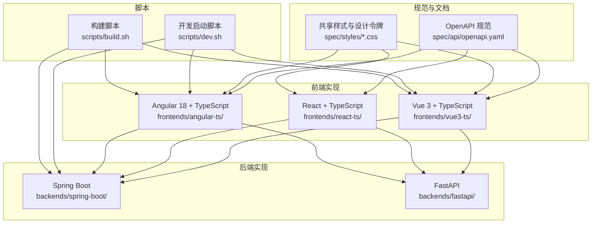
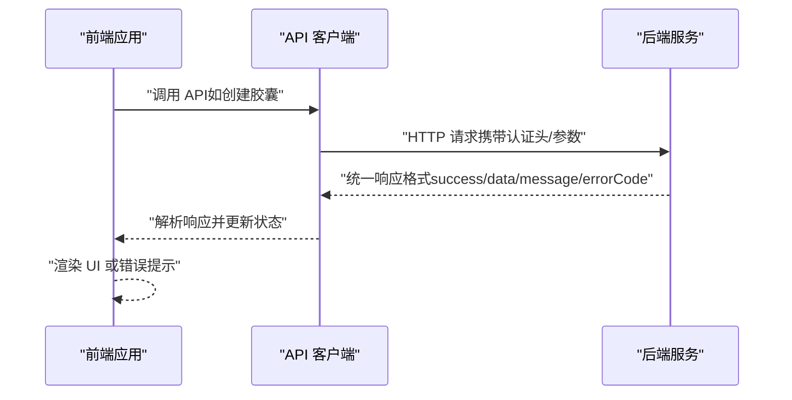
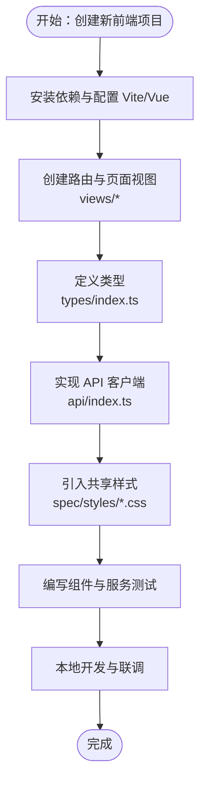
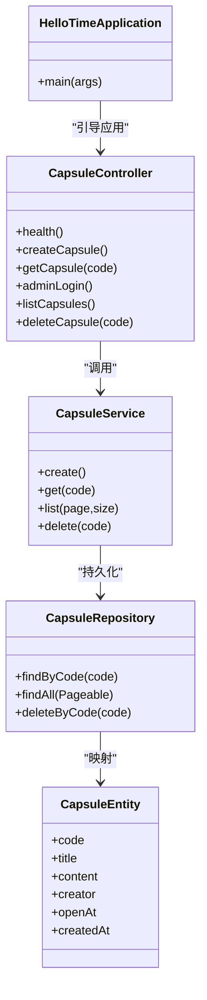
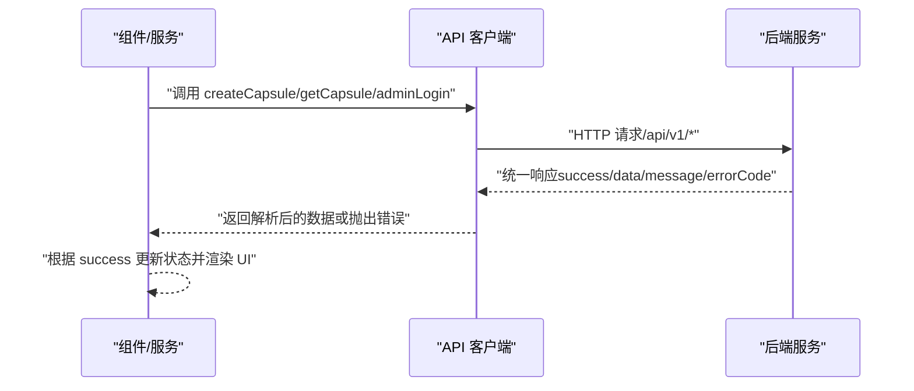
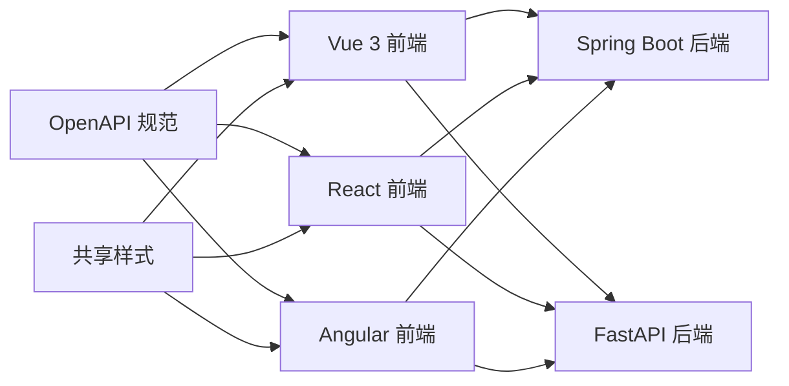

# 开发指南

<cite>
**本文引用的文件**
- [README.md](file://README.md)
- [backends/fastapi/README.md](file://backends/fastapi/README.md)
- [backends/spring-boot/README.md](file://backends/spring-boot/README.md)
- [frontends/vue3-ts/README.md](file://frontends/vue3-ts/README.md)
- [frontends/react-ts/README.md](file://frontends/react-ts/README.md)
- [frontends/angular-ts/README.md](file://frontends/angular-ts/README.md)
- [spec/api/openapi.yaml](file://spec/api/openapi.yaml)
- [backends/fastapi/app/main.py](file://backends/fastapi/app/main.py)
- [backends/spring-boot/src/main/java/com/hellotime/HelloTimeApplication.java](file://backends/spring-boot/src/main/java/com/hellotime/HelloTimeApplication.java)
- [frontends/vue3-ts/src/api/index.ts](file://frontends/vue3-ts/src/api/index.ts)
- [frontends/react-ts/src/api/index.ts](file://frontends/react-ts/src/api/index.ts)
- [frontends/angular-ts/src/app/api/index.ts](file://frontends/angular-ts/src/app/api/index.ts)
- [frontends/vue3-ts/src/types/index.ts](file://frontends/vue3-ts/src/types/index.ts)
- [frontends/react-ts/src/types/index.ts](file://frontends/react-ts/src/types/index.ts)
- [spec/styles/tokens.css](file://spec/styles/tokens.css)
- [scripts/dev.sh](file://scripts/dev.sh)
- [scripts/build.sh](file://scripts/build.sh)
</cite>

## 目录
1. [简介](#简介)
2. [项目结构](#项目结构)
3. [核心组件](#核心组件)
4. [架构总览](#架构总览)
5. [详细组件分析](#详细组件分析)
6. [依赖关系分析](#依赖关系分析)
7. [性能考虑](#性能考虑)
8. [故障排查指南](#故障排查指南)
9. [结论](#结论)
10. [附录](#附录)

## 简介
HelloTime 是一个“类似 RealWorld”的技术展示应用，通过统一的 API 规范与可复用的前端样式，演示不同前后端技术栈的组合能力。项目提供三套前端实现（Vue 3、React、Angular）与两套后端实现（Spring Boot、FastAPI），所有实现均遵循同一份 OpenAPI 规范与共享样式系统，确保功能与体验一致。

本开发指南面向希望新增前端或后端实现、扩展功能模块、制定代码规范与质量保障流程的开发者，涵盖从项目结构、API 客户端集成、样式系统使用、路由配置，到后端 API 实现、数据库集成、统一响应格式与错误处理的完整流程，并提供调试技巧、开发工具推荐、版本控制与分支管理建议、代码审查流程与质量保证措施，以及常见问题解决方案与效率提升建议。

## 项目结构
项目采用多实现并存的结构：frontends 下包含三种前端实现；backends 下包含两种后端实现；spec 下提供共享规范（API 与样式）；scripts 提供开发与构建脚本。

图表来源
- [README.md:18-34](file://README.md#L18-L34)
- [spec/api/openapi.yaml:1-349](file://spec/api/openapi.yaml#L1-L349)
- [spec/styles/tokens.css:1-104](file://spec/styles/tokens.css#L1-L104)
- [scripts/dev.sh:1-45](file://scripts/dev.sh#L1-L45)
- [scripts/build.sh:1-34](file://scripts/build.sh#L1-L34)

章节来源
- [README.md:18-34](file://README.md#L18-L34)

## 核心组件
- 统一 API 规范：所有实现遵循同一份 OpenAPI 规范，确保端点、参数、响应格式一致。
- 共享样式系统：通过 spec/styles 提供设计令牌与基础样式，前端实现统一引入。
- 前端 API 客户端：各前端实现均提供基于 fetch 的 API 客户端，封装统一错误处理与认证头。
- 后端统一响应与错误处理：后端实现均提供统一的 ApiResponse/Error 格式与全局异常映射。
- 路由与视图：前端实现均包含相同的路由与页面视图，确保功能一致性。

章节来源
- [README.md:16, 171-184:16-184](file://README.md#L16-L184)
- [spec/api/openapi.yaml:1-349](file://spec/api/openapi.yaml#L1-L349)
- [spec/styles/tokens.css:1-104](file://spec/styles/tokens.css#L1-L104)

## 架构总览
前后端通过统一的 REST API 通信，前端通过各自的 API 客户端发起请求，后端提供统一的响应格式与错误码。开发时可独立启动任一前端与任一后端组合，也可使用脚本同时启动多个服务。

图表来源
- [frontends/vue3-ts/src/api/index.ts:1-120](file://frontends/vue3-ts/src/api/index.ts#L1-L120)
- [frontends/react-ts/src/api/index.ts:1-94](file://frontends/react-ts/src/api/index.ts#L1-L94)
- [frontends/angular-ts/src/app/api/index.ts:1-71](file://frontends/angular-ts/src/app/api/index.ts#L1-L71)
- [spec/api/openapi.yaml:165-349](file://spec/api/openapi.yaml#L165-L349)

## 详细组件分析

### 添加新的前端实现（以 Vue 3 为例）
- 项目结构与技术栈
  - 基于 Vite + Vue 3 + TypeScript，使用 Composition API 与可复用组合式函数。
  - 路由采用 Vue Router，页面组件位于 views，可复用组件位于 components。
  - 类型定义位于 types，API 客户端位于 api，统一使用 /api/v1 基础路径。
- API 客户端集成
  - API 客户端封装了通用请求方法、JSON 序列化、统一错误处理与认证头设置。
  - 通过 ApiResponse 泛型统一接收后端响应，失败时抛出错误，便于在组件中集中处理。
- 样式系统使用
  - 在主样式文件中引入共享设计令牌与基础样式，支持深色主题通过 data-theme 属性切换。
- 路由配置
  - 路由覆盖首页、创建、打开、关于、管理后台等页面，参数与命名与规范一致。
- 测试与开发
  - 使用 Vitest + Vue Testing Library，提供组件与组合式函数的测试示例。
  - 开发服务器端口为 5173，可通过环境变量配置后端地址。

图表来源
- [frontends/vue3-ts/README.md:34-83](file://frontends/vue3-ts/README.md#L34-L83)
- [frontends/vue3-ts/src/api/index.ts:1-120](file://frontends/vue3-ts/src/api/index.ts#L1-L120)
- [frontends/vue3-ts/src/types/index.ts:1-80](file://frontends/vue3-ts/src/types/index.ts#L1-L80)
- [spec/styles/tokens.css:1-104](file://spec/styles/tokens.css#L1-L104)

章节来源
- [frontends/vue3-ts/README.md:1-205](file://frontends/vue3-ts/README.md#L1-L205)
- [frontends/vue3-ts/src/api/index.ts:1-120](file://frontends/vue3-ts/src/api/index.ts#L1-L120)
- [frontends/vue3-ts/src/types/index.ts:1-80](file://frontends/vue3-ts/src/types/index.ts#L1-L80)
- [spec/styles/tokens.css:1-104](file://spec/styles/tokens.css#L1-L104)

### 添加新的后端实现（以 Spring Boot 为例）
- 项目结构与技术栈
  - 基于 Spring Boot 3 + Java 17 + Maven + Spring Data JPA + SQLite。
  - 控制器、服务、仓库、实体、DTO、安全配置分层清晰。
- API 端点实现
  - 遵循 OpenAPI 规范，提供健康检查、胶囊 CRUD、管理员登录与管理等端点。
  - 使用统一响应格式与全局异常处理，映射业务异常为标准错误码。
- 数据库集成
  - 使用 SQLite，首次运行自动创建数据库与表结构。
  - 实体字段与时间戳均使用 UTC。
- 认证与安全
  - 管理员登录颁发 JWT，请求头携带 Bearer Token。
  - 通过拦截器或安全配置实现认证与授权。
- 测试与构建
  - 使用 Maven 进行测试与打包，支持跳过测试运行与构建 JAR。

图表来源
- [backends/spring-boot/src/main/java/com/hellotime/HelloTimeApplication.java:1-12](file://backends/spring-boot/src/main/java/com/hellotime/HelloTimeApplication.java#L1-L12)
- [backends/spring-boot/README.md:77-87](file://backends/spring-boot/README.md#L77-L87)

章节来源
- [backends/spring-boot/README.md:1-136](file://backends/spring-boot/README.md#L1-L136)
- [backends/spring-boot/src/main/java/com/hellotime/HelloTimeApplication.java:1-12](file://backends/spring-boot/src/main/java/com/hellotime/HelloTimeApplication.java#L1-L12)

### 添加新的后端实现（以 FastAPI 为例）
- 项目结构与技术栈
  - 基于 FastAPI + Python 3.12 + SQLAlchemy 2.0 + PyJWT + Uvicorn。
  - 路由器、服务层、模型与依赖注入分层清晰。
- API 端点实现
  - 遵循 OpenAPI 规范，提供健康检查、胶囊 CRUD、管理员登录与管理等端点。
  - 使用 Pydantic 进行数据验证，统一响应格式与全局异常映射。
- 数据库集成
  - 使用 SQLite，首次运行自动创建表。
- 认证与安全
  - 管理员登录颁发 JWT，请求头携带 Bearer Token。
- 测试与部署
  - 使用 pytest 进行测试，支持覆盖率统计与单测运行。

章节来源
- [backends/fastapi/README.md:1-176](file://backends/fastapi/README.md#L1-L176)
- [backends/fastapi/app/main.py:1-89](file://backends/fastapi/app/main.py#L1-L89)

### API 客户端与统一响应格式
- API 客户端
  - 三个前端实现均提供相同的 API 客户端，封装通用请求、错误处理与认证头。
  - 基础路径为 /api/v1，端点与参数与 OpenAPI 规范一致。
- 统一响应格式
  - 成功响应包含 success、data、message；错误响应包含 success=false、message、errorCode。
  - 错误码与状态码映射在后端实现中统一处理。

图表来源
- [frontends/vue3-ts/src/api/index.ts:1-120](file://frontends/vue3-ts/src/api/index.ts#L1-L120)
- [frontends/react-ts/src/api/index.ts:1-94](file://frontends/react-ts/src/api/index.ts#L1-L94)
- [frontends/angular-ts/src/app/api/index.ts:1-71](file://frontends/angular-ts/src/app/api/index.ts#L1-L71)
- [spec/api/openapi.yaml:282-349](file://spec/api/openapi.yaml#L282-L349)

章节来源
- [frontends/vue3-ts/src/api/index.ts:1-120](file://frontends/vue3-ts/src/api/index.ts#L1-L120)
- [frontends/react-ts/src/api/index.ts:1-94](file://frontends/react-ts/src/api/index.ts#L1-L94)
- [frontends/angular-ts/src/app/api/index.ts:1-71](file://frontends/angular-ts/src/app/api/index.ts#L1-L71)
- [spec/api/openapi.yaml:282-349](file://spec/api/openapi.yaml#L282-L349)

### 路由配置与页面视图
- 路由覆盖
  - 首页、创建、打开（带参数）、关于、管理后台等页面，参数与命名与规范一致。
- 页面视图
  - views 下的页面组件负责承载业务逻辑与布局，配合可复用组件与组合式函数/服务实现状态管理。
- 路由参数绑定
  - Vue 与 Angular 实现支持路由参数自动绑定到组件属性，简化参数传递。

章节来源
- [frontends/vue3-ts/README.md:85-94](file://frontends/vue3-ts/README.md#L85-L94)
- [frontends/react-ts/README.md:83-92](file://frontends/react-ts/README.md#L83-L92)
- [frontends/angular-ts/README.md:84-93](file://frontends/angular-ts/README.md#L84-L93)

### 样式系统与主题切换
- 设计令牌
  - 通过 spec/styles/tokens.css 提供颜色、字体、间距、圆角、阴影、过渡与布局等设计令牌。
- 深色主题
  - 通过在 documentElement 上设置 data-theme="dark" 激活深色模式，所有颜色与阴影变量自动切换。
- 组件样式
  - Vue 与 React 实现分别使用组件 CSS 文件与 CSS Modules，确保样式隔离与可维护性。

章节来源
- [spec/styles/tokens.css:1-104](file://spec/styles/tokens.css#L1-L104)
- [frontends/vue3-ts/README.md:117-125](file://frontends/vue3-ts/README.md#L117-L125)
- [frontends/react-ts/README.md:115-125](file://frontends/react-ts/README.md#L115-L125)
- [frontends/angular-ts/README.md:103-117](file://frontends/angular-ts/README.md#L103-L117)

### 扩展功能模块
- 新 API 端点
  - 在后端实现中新增控制器、服务与仓储，遵循统一响应格式与错误码。
  - 在 OpenAPI 规范中补充端点定义与参数说明。
- 新组件与服务
  - 前端实现中新增可复用组件与组合式函数/服务，保持与 API 客户端的契约一致。
  - 在路由中注册新页面视图，确保参数与命名符合规范。
- 数据库变更
  - 后端实现中更新实体与仓储，迁移或自动创建表结构，保持字段与时间戳一致。

章节来源
- [spec/api/openapi.yaml:10-164](file://spec/api/openapi.yaml#L10-L164)
- [backends/spring-boot/README.md:77-87](file://backends/spring-boot/README.md#L77-L87)
- [backends/fastapi/README.md:76-98](file://backends/fastapi/README.md#L76-L98)

## 依赖关系分析
- 前后端解耦
  - 前端通过 /api/v1 基础路径与后端通信，不依赖具体后端实现。
- 统一规范
  - OpenAPI 规范约束端点、参数与响应格式，确保跨实现一致性。
- 样式共享
  - spec/styles 提供设计令牌与基础样式，前端实现统一引入。

图表来源
- [spec/api/openapi.yaml:1-349](file://spec/api/openapi.yaml#L1-L349)
- [spec/styles/tokens.css:1-104](file://spec/styles/tokens.css#L1-L104)

章节来源
- [README.md:226-254](file://README.md#L226-L254)

## 性能考虑
- 前端
  - 使用组件懒加载与路由分割，减少首屏体积。
  - 统一的 API 客户端减少重复网络请求与错误处理逻辑。
- 后端
  - 使用异步/同步 I/O 与连接池，避免阻塞。
  - 统一响应格式与异常处理降低客户端解析成本。
- 构建与部署
  - 使用脚本统一构建，确保产物一致性与可缓存性。

## 故障排查指南
- 端口冲突
  - 前端开发端口：Vue 5173、Angular 5175、React 5174；后端 8080。
  - 修改端口或关闭占用进程。
- CORS 问题
  - 后端已配置允许 localhost 跨域，确认前端代理与后端地址一致。
- 认证失败
  - 确认管理员登录成功并正确携带 Bearer Token。
- 数据库连接
  - 确认 SQLite 文件存在且可写，首次运行会自动创建。
- OpenAPI 不一致
  - 核对前端 API 客户端与后端实现是否与规范一致。

章节来源
- [scripts/dev.sh:35-45](file://scripts/dev.sh#L35-L45)
- [backends/fastapi/app/main.py:21-29](file://backends/fastapi/app/main.py#L21-L29)
- [README.md:214-225](file://README.md#L214-L225)

## 结论
HelloTime 通过统一的 API 规范与共享样式系统，实现了前后端的高内聚、低耦合与可扩展性。新增前端或后端实现只需遵循规范与契约，即可快速集成。建议在开发过程中坚持统一的响应格式、错误码与样式体系，配合完善的测试与脚本工具，确保高质量交付。

## 附录

### 代码规范与最佳实践
- 命名约定
  - 类型与接口使用 PascalCase；常量使用 UPPER_SNAKE_CASE；函数与变量使用 camelCase。
  - 文件与目录使用 kebab-case 或小驼峰，组件文件使用 .tsx/.vue 或 .ts。
- 文件组织
  - 前端：api、components、views、composables/hooks、services、types、router。
  - 后端：controller、service、repository、entity、dto、exception、config。
- 注释标准
  - 函数与接口提供简明注释，说明用途、参数与返回值；复杂逻辑提供行内注释。
- 统一响应与错误处理
  - 前后端均使用统一的 ApiResponse/Error 格式与错误码映射。
- 样式与主题
  - 使用 spec/styles 中的设计令牌，深色主题通过 data-theme 切换。

### 版本控制策略与分支管理
- 分支策略
  - 主分支保护，功能开发在 feature/* 分支，修复在 hotfix/* 分支。
  - 发布前在 release/* 分支进行集成测试与文档更新。
- 提交规范
  - 使用清晰的提交信息，包含类型（feat/fix/docs/chore）与简述。
- 合并与审查
  - 通过 Pull Request 进行代码审查，至少一名维护者批准后合并。

### 代码审查流程与质量保证
- 代码审查
  - 覆盖功能正确性、性能影响、安全性与可维护性。
  - 关注统一响应格式、错误处理、类型安全与样式一致性。
- 质量保证
  - 单元测试、集成测试与端到端测试并行推进。
  - 使用脚本统一运行测试，确保 CI/CD 一致性。

### 调试技巧与开发工具推荐
- 前端
  - Vue DevTools、React Developer Tools、Angular DevTools。
  - 浏览器 Network 面板观察 API 请求与响应。
- 后端
  - Swagger UI 与 ReDoc 查看与调试 API。
  - 日志与断点定位异常。
- 通用
  - 使用统一的环境变量与 .env 文件管理配置。
  - 使用脚本统一启动与构建，减少环境差异。

### 贡献代码与参与开发
- 提交流程
  - Fork 仓库 -> 创建功能分支 -> 编写代码与测试 -> 提交 PR -> 代码审查 -> 合并。
- 参与讨论
  - 通过 Issue 讨论需求与问题，PR 中引用相关 Issue。
- 文档更新
  - 新增功能需同步更新 README、API 规范与设计文档。

### 常见开发问题与解决方案
- 前端无法访问后端
  - 检查代理配置与后端地址，确认 CORS 已允许。
- JWT 认证失败
  - 确认登录成功并正确存储 Token，请求头携带 Bearer Token。
- OpenAPI 不一致
  - 对齐前端 API 客户端与后端实现，确保契约一致。
- 构建失败
  - 检查依赖安装与 Node/Maven/Python 环境版本，使用脚本重新构建。