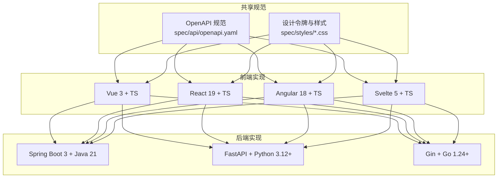
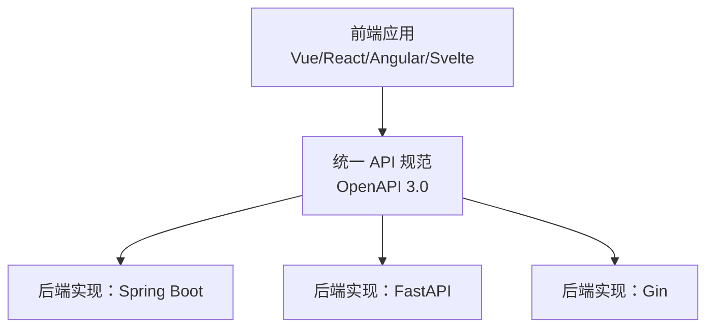
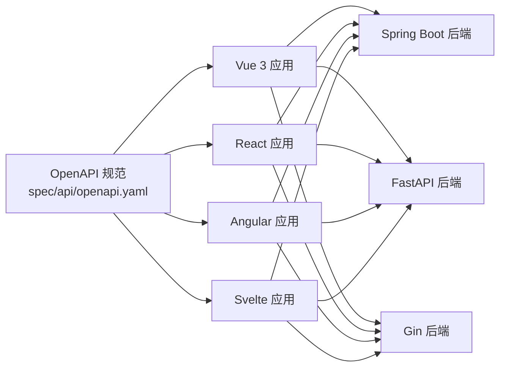

# 代码规范

<cite>
**本文引用的文件**
- [README.md](file://README.md)
- [openapi.yaml](file://spec/api/openapi.yaml)
- [fastapi/README.md](file://backends/fastapi/README.md)
- [gin/README.md](file://backends/gin/README.md)
- [spring-boot/README.md](file://backends/spring-boot/README.md)
- [vue3-ts/README.md](file://frontends/vue3-ts/README.md)
- [react-ts/README.md](file://frontends/react-ts/README.md)
- [angular-ts/README.md](file://frontends/angular-ts/README.md)
- [svelte-ts/README.md](file://frontends/svelte-ts/README.md)
- [fastapi/app/main.py](file://backends/fastapi/app/main.py)
- [gin/main.go](file://backends/gin/main.go)
- [spring-boot/src/main/java/com/hellotime/HelloTimeApplication.java](file://backends/spring-boot/src/main/java/com/hellotime/HelloTimeApplication.java)
- [vue3-ts/src/main.ts](file://frontends/vue3-ts/src/main.ts)
- [react-ts/src/main.tsx](file://frontends/react-ts/src/main.tsx)
- [angular-ts/src/main.ts](file://frontends/angular-ts/src/main.ts)
- [svelte-ts/src/main.ts](file://frontends/svelte-ts/src/main.ts)
</cite>

## 目录
1. [引言](#引言)
2. [项目结构](#项目结构)
3. [核心组件](#核心组件)
4. [架构总览](#架构总览)
5. [详细组件分析](#详细组件分析)
6. [依赖关系分析](#依赖关系分析)
7. [性能考虑](#性能考虑)
8. [故障排查指南](#故障排查指南)
9. [结论](#结论)
10. [附录](#附录)

## 引言
本文件为 HelloTime 项目制定统一的代码规范，目标是：
- 统一命名约定、目录结构与代码组织原则
- 覆盖前端（Vue 3、React 19、Angular 18、Svelte 5）与后端（Spring Boot、FastAPI、Gin）的实现规范
- 明确 Git 提交规范、分支管理策略与代码评审标准
- 提供正反面示例的对比路径，帮助团队提升一致性与可维护性

HelloTime 通过统一的 API 规范与设计系统，确保多端实现的一致性与可对比性。

章节来源
- [README.md:1-323](file://README.md#L1-L323)

## 项目结构
项目采用“多端并行”的分层组织方式：
- docs/：项目文档（需求、设计、部署指南）
- spec/：共享规范（OpenAPI 3.0、设计令牌与样式）
- frontends/：前端实现（Vue 3、React 19、Angular 18、Svelte 5）
- backends/：后端实现（Spring Boot、FastAPI、Gin）
- scripts/：开发/构建/测试脚本

图表来源
- [README.md:37-63](file://README.md#L37-L63)
- [openapi.yaml:1-349](file://spec/api/openapi.yaml#L1-L349)

章节来源
- [README.md:37-63](file://README.md#L37-L63)

## 核心组件
- 统一 API 规范：所有后端实现必须严格遵循 OpenAPI 3.0 规范，保证端点、参数、响应格式一致
- 统一响应格式：后端统一返回 success、data、message、errorCode 字段；错误码枚举见 API 规范
- 统一设计系统：前端共享 spec/styles 下的设计令牌与样式，确保视觉一致性
- 跨端一致性：同一业务逻辑在不同框架中保持行为一致（如路由、主题切换、认证流程）

章节来源
- [README.md:219-264](file://README.md#L219-L264)
- [openapi.yaml:165-349](file://spec/api/openapi.yaml#L165-L349)

## 架构总览
多端架构强调“前后端完全解耦”，通过统一的 API 与设计系统实现任意前端与任意后端自由组合。

图表来源
- [README.md:16-35](file://README.md#L16-L35)
- [openapi.yaml:1-349](file://spec/api/openapi.yaml#L1-L349)

## 详细组件分析

### 前端框架规范

#### Vue 3 + TypeScript
- 目录组织
  - src/api：统一 API 客户端封装（基于 fetch），与其它前端实现保持一致
  - src/components：可复用 UI 组件
  - src/composables：可复用组合式函数（状态与逻辑）
  - src/views：页面级组件
  - src/router：路由配置
  - src/types：全局类型定义
- 命名约定
  - 组件文件：PascalCase.vue（如 CapsuleCard.vue）
  - 组合式函数：useXxx.ts（如 useCapsule.ts）
  - 类型定义：index.ts（集中导出）
- 路由与视图
  - 路由：HomeView、CreateView、OpenView、AdminView、AboutView
  - 路由参数：/open/:code
- 样式
  - 全局样式：导入 spec/styles 下的 tokens、base、components、layout
  - 组件样式：CSS Modules（.module.css）
- 入口文件
  - main.ts：创建应用、注册路由、导入全局样式

章节来源
- [vue3-ts/README.md:51-115](file://frontends/vue3-ts/README.md#L51-L115)
- [vue3-ts/README.md:126-205](file://frontends/vue3-ts/README.md#L126-L205)
- [vue3-ts/src/main.ts:1-23](file://frontends/vue3-ts/src/main.ts#L1-L23)

#### React 19 + TypeScript
- 目录组织
  - src/api：API 客户端封装（基于 fetch）
  - src/components：可复用组件（模块化样式）
  - src/hooks：自定义 Hooks（useCapsule、useAdmin、useTheme）
  - src/views：页面级组件
  - src/types：全局类型定义
- 命名约定
  - 组件文件：PascalCase.tsx（如 CapsuleForm.tsx）
  - Hooks：useXxx.ts（如 useTheme.ts）
- 路由与视图
  - 路由：/、/create、/open/:code、/admin、/about
- 样式
  - 全局样式：导入 spec/styles 下的 tokens、base、components、layout
  - 组件样式：CSS Modules（.module.css）
- 入口文件
  - main.tsx：创建根节点、导入全局样式

章节来源
- [react-ts/README.md:51-113](file://frontends/react-ts/README.md#L51-L113)
- [react-ts/README.md:126-210](file://frontends/react-ts/README.md#L126-L210)
- [react-ts/src/main.tsx:1-20](file://frontends/react-ts/src/main.tsx#L1-L20)

#### Angular 18 + TypeScript
- 目录组织
  - src/app/services：根级服务（ThemeService、CapsuleService、AdminService）
  - src/app/components：可复用 UI 组件
  - src/app/views：页面级组件
  - src/app/api：API 客户端封装（与 Vue/React 保持一致）
  - src/app/types：全局类型定义
- 命名约定
  - 服务：PascalCase（如 ThemeService）
  - 组件：PascalCase（如 AppHeader）
  - 类型：index.ts（集中导出）
- 路由与视图
  - 路由：/、/create、/open/:code?、/about、/admin
  - 路由参数通过 withComponentInputBinding 自动绑定到组件 @Input()
- 状态管理
  - 使用 Angular Signals（signal、computed、effect）进行响应式状态管理
- 样式
  - 通过 angular.json 的 styles 数组导入 spec/styles 下的 CSS
  - 深色模式通过设置 documentElement 的 [data-theme="dark"] 激活
- 入口文件
  - main.ts：bootstrapApplication，传入 appConfig

章节来源
- [angular-ts/README.md:34-51](file://frontends/angular-ts/README.md#L34-L51)
- [angular-ts/README.md:84-93](file://frontends/angular-ts/README.md#L84-L93)
- [angular-ts/README.md:103-117](file://frontends/angular-ts/README.md#L103-L117)
- [angular-ts/src/main.ts:1-7](file://frontends/angular-ts/src/main.ts#L1-L7)

#### Svelte 5 + TypeScript
- 目录组织
  - src/lib/api：统一 API 客户端
  - src/lib/components：可复用 Svelte 组件
  - src/lib/theme.ts：主题状态管理
  - src/views：页面级组件（Home、Create、Open 等）
  - src/App.svelte：根组件（配置路由）
  - src/main.ts：挂载入口点
- 命名约定
  - 组件：PascalCase.svelte（如 App.svelte）
  - 类型：index.ts（集中导出）
- 样式
  - 全局样式：导入 spec/styles 下的 tokens、base、components、layout
- 入口文件
  - main.ts：mount(App, { target })

章节来源
- [svelte-ts/README.md:26-41](file://frontends/svelte-ts/README.md#L26-L41)
- [svelte-ts/src/main.ts:1-17](file://frontends/svelte-ts/src/main.ts#L1-L17)

### 后端框架规范

#### Spring Boot 3 + Java 21
- 包结构
  - controller：REST 控制器
  - service：业务逻辑层
  - repository：数据访问层
  - entity：JPA 实体
  - dto：数据传输对象
  - config/security：安全与跨域配置
- 命名约定
  - 控制器：XxxController（如 CapsuleController）
  - 服务：XxxService（如 CapsuleService）
  - 异常：XxxException（如 CapsuleNotFoundException）
  - DTO：XxxRequest/XxxResponse（如 CreateCapsuleRequest、CapsuleResponse）
- 路由与端点
  - 遵循 OpenAPI 规范的端点与路径
- 异常处理
  - 全局异常处理与统一响应格式
- 入口文件
  - HelloTimeApplication.java：Spring Boot 启动类

章节来源
- [spring-boot/README.md:77-87](file://backends/spring-boot/README.md#L77-L87)
- [spring-boot/src/main/java/com/hellotime/HelloTimeApplication.java:1-12](file://backends/spring-boot/src/main/java/com/hellotime/HelloTimeApplication.java#L1-L12)

#### FastAPI + Python 3.12+
- 目录组织
  - app/main.py：应用入口、CORS、异常处理、路由注册
  - app/routers/：路由模块（health、capsule、admin）
  - app/services/：业务逻辑层（capsule_service、admin_service）
  - app/models.py、schemas.py、dependencies.py、config.py、database.py
- 命名约定
  - 路由模块：小写加下划线（如 capsule.py）
  - 服务：小写加下划线（如 capsule_service.py）
  - Pydantic 模式：首字母大写（如 CreateCapsuleRequest）
- 异常处理
  - 全局异常处理：Validation、ValueError、Unauthorized、通用异常
- 入口文件
  - app/main.py：FastAPI 应用入口

章节来源
- [fastapi/README.md:99-116](file://backends/fastapi/README.md#L99-L116)
- [fastapi/app/main.py:1-89](file://backends/fastapi/app/main.py#L1-L89)

#### Gin + Go 1.24+
- 目录组织
  - main.go：应用入口
  - config/：配置管理
  - database/：数据库连接
  - model/：GORM 模型
  - dto/：请求/响应 DTO
  - service/：业务逻辑（capsule_service、admin_service）
  - handler/：HTTP 处理器（health、capsule、admin）
  - middleware/：中间件（cors、auth）
  - router/：路由注册
- 命名约定
  - 结构体与方法：PascalCase（如 CapsuleHandler）
  - DTO：PascalCase（如 CreateCapsuleDTO）
  - 包名：小写（如 config、service）
- 入口文件
  - main.go：初始化数据库、创建引擎、注册路由、启动服务

章节来源
- [gin/README.md:84-111](file://backends/gin/README.md#L84-L111)
- [gin/main.go:1-32](file://backends/gin/main.go#L1-L32)

### API 与路由规范（跨端）
- 统一端点
  - /api/v1/health、/api/v1/capsules、/api/v1/capsules/{code}、/api/v1/admin/login、/api/v1/admin/capsules、/api/v1/admin/capsules/{code}
- 统一响应格式
  - 成功：success=true，data 为具体数据，message 为操作成功提示，errorCode=null
  - 失败：success=false，data=null，message 为错误描述，errorCode 为错误码
- 统一认证
  - JWT Bearer Token，Header: Authorization: Bearer <token>
  - 管理员端点需携带有效 Token
- 统一路由
  - 前端路由：/、/create、/open/:code、/about、/admin

章节来源
- [README.md:219-264](file://README.md#L219-L264)
- [openapi.yaml:10-164](file://spec/api/openapi.yaml#L10-L164)

## 依赖关系分析

图表来源
- [README.md:16-35](file://README.md#L16-L35)
- [openapi.yaml:1-349](file://spec/api/openapi.yaml#L1-L349)

章节来源
- [README.md:16-35](file://README.md#L16-L35)

## 性能考虑
- 前端
  - 组件拆分与按需加载：优先使用路由级懒加载（Angular 使用 loadComponent，其他框架可参考）
  - 样式隔离：使用 CSS Modules 或框架推荐的样式方案，避免全局污染
  - 状态管理：合理划分本地状态与全局状态，避免不必要的重渲染
- 后端
  - 数据库连接池与事务边界清晰，避免长事务
  - API 响应尽量精简，减少序列化开销
  - 使用统一异常处理，快速失败并返回明确错误码
- 共同点
  - 统一 API 规范有助于缓存策略与网关治理
  - 设计令牌与样式复用减少重复计算与带宽消耗

## 故障排查指南
- 前端
  - 端口冲突：修改开发服务器端口或关闭占用进程
  - 路由参数绑定：确认路由配置与组件输入绑定一致（Angular）
  - 样式不生效：检查 angular.json 或构建配置中的样式导入顺序
- 后端
  - CORS 问题：确认允许的源、方法与凭据配置
  - 认证失败：核对 JWT 密钥、签名算法与有效期
  - 数据库连接：确认 DATABASE_URL 与 SQLite 文件权限
- 通用
  - 统一响应格式：若返回字段缺失或类型不符，检查后端异常处理与序列化配置

章节来源
- [angular-ts/README.md:223-241](file://frontends/angular-ts/README.md#L223-L241)
- [fastapi/README.md:60-68](file://backends/fastapi/README.md#L60-L68)
- [gin/README.md:44-52](file://backends/gin/README.md#L44-L52)

## 结论
通过统一的 API 规范、设计系统与代码组织原则，HelloTime 在多端实现中实现了高度一致性与可维护性。建议团队在日常开发中严格遵循本文规范，并在代码评审中重点检查命名、目录结构、响应格式与路由配置的一致性。

## 附录

### 命名约定清单（摘要）
- 前端
  - 组件：PascalCase（.vue/.tsx/.svelte/.ts）
  - 组合式/Hooks：useXxx（.ts）
  - 服务：PascalCase（.ts）
  - 类型：index.ts（集中导出）
- 后端
  - Java：PascalCase（类、方法）
  - Python：snake_case（模块、函数、变量）
  - Go：PascalCase（结构体、方法），包名小写

章节来源
- [vue3-ts/README.md:51-115](file://frontends/vue3-ts/README.md#L51-L115)
- [react-ts/README.md:51-113](file://frontends/react-ts/README.md#L51-L113)
- [angular-ts/README.md:34-51](file://frontends/angular-ts/README.md#L34-L51)
- [spring-boot/README.md:77-87](file://backends/spring-boot/README.md#L77-L87)
- [fastapi/README.md:99-116](file://backends/fastapi/README.md#L99-L116)
- [gin/README.md:84-111](file://backends/gin/README.md#L84-L111)

### 目录结构规范（摘要）
- 共享规范：spec/api/openapi.yaml、spec/styles/*
- 前端：src/api、src/components、src/views、src/composables/hooks（依框架而定）、src/types、src/router
- 后端：按框架分层（controller/service/repository/entity/dto/config/security 或 routers/services/models/dto/handler/middleware）

章节来源
- [README.md:37-63](file://README.md#L37-L63)
- [vue3-ts/README.md:51-115](file://frontends/vue3-ts/README.md#L51-L115)
- [react-ts/README.md:51-113](file://frontends/react-ts/README.md#L51-L113)
- [angular-ts/README.md:34-51](file://frontends/angular-ts/README.md#L34-L51)
- [svelte-ts/README.md:26-41](file://frontends/svelte-ts/README.md#L26-L41)
- [spring-boot/README.md:77-87](file://backends/spring-boot/README.md#L77-L87)
- [fastapi/README.md:99-116](file://backends/fastapi/README.md#L99-L116)
- [gin/README.md:84-111](file://backends/gin/README.md#L84-L111)

### Git 提交规范、分支管理与评审标准（建议）
- 提交信息
  - 格式：type(scope): subject
  - 类型：feat、fix、docs、style、refactor、test、chore
  - 示例：feat(frontend): 添加胶囊表单组件
- 分支策略
  - main：稳定发布
  - develop：开发集成
  - feature/*：功能开发
  - hotfix/*：紧急修复
- 代码评审
  - 至少一名 reviewer 通过
  - 关注：命名一致性、目录结构、API 与样式复用、异常处理与错误码
  - 通过 CI/测试

（本节为通用建议，不直接分析具体文件，故不附“章节来源”）