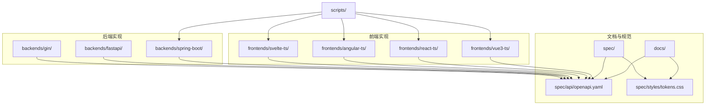
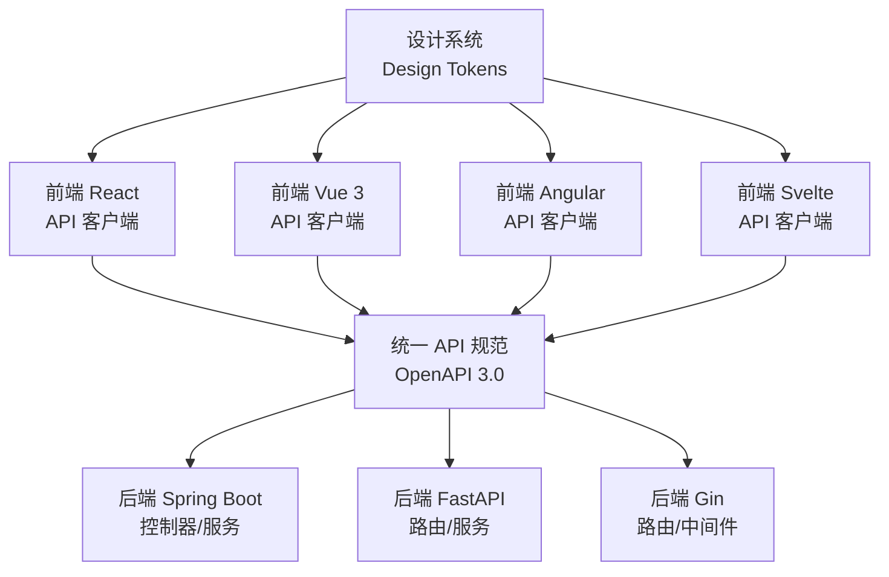
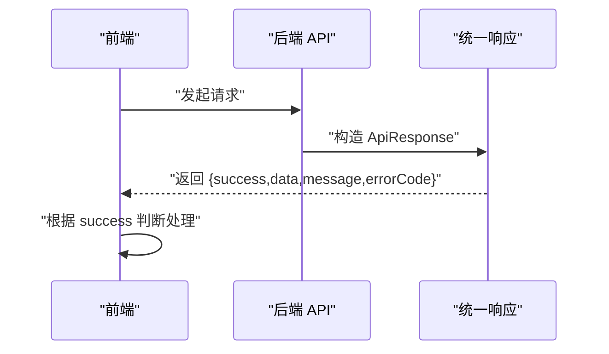
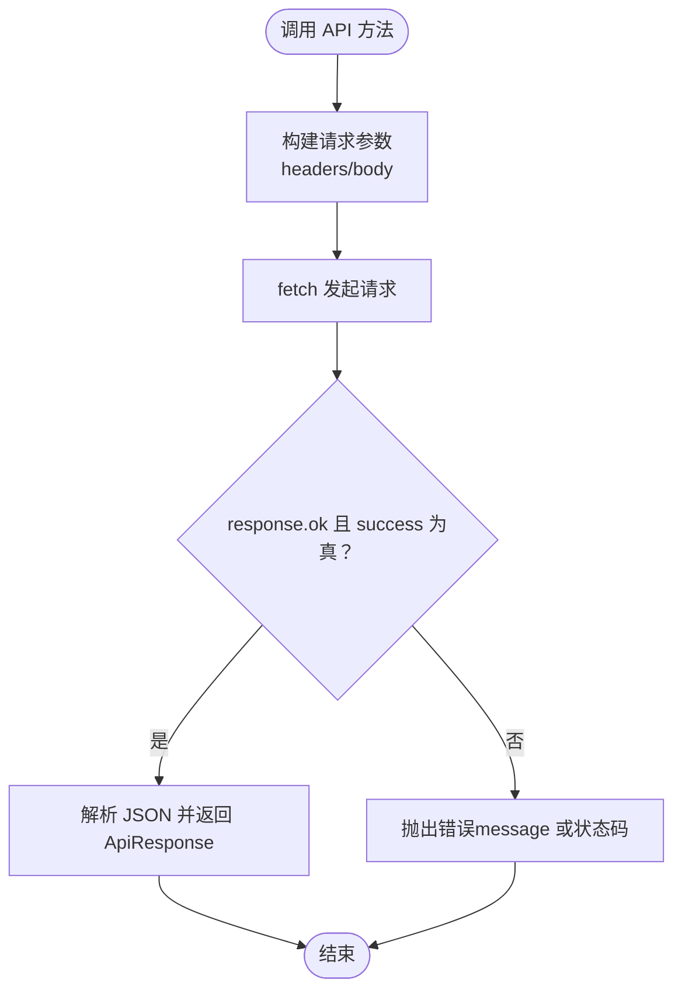
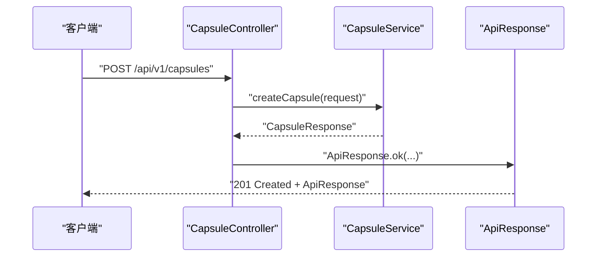
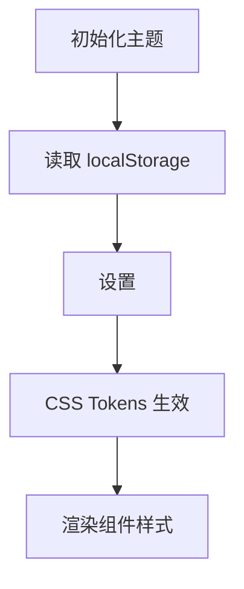
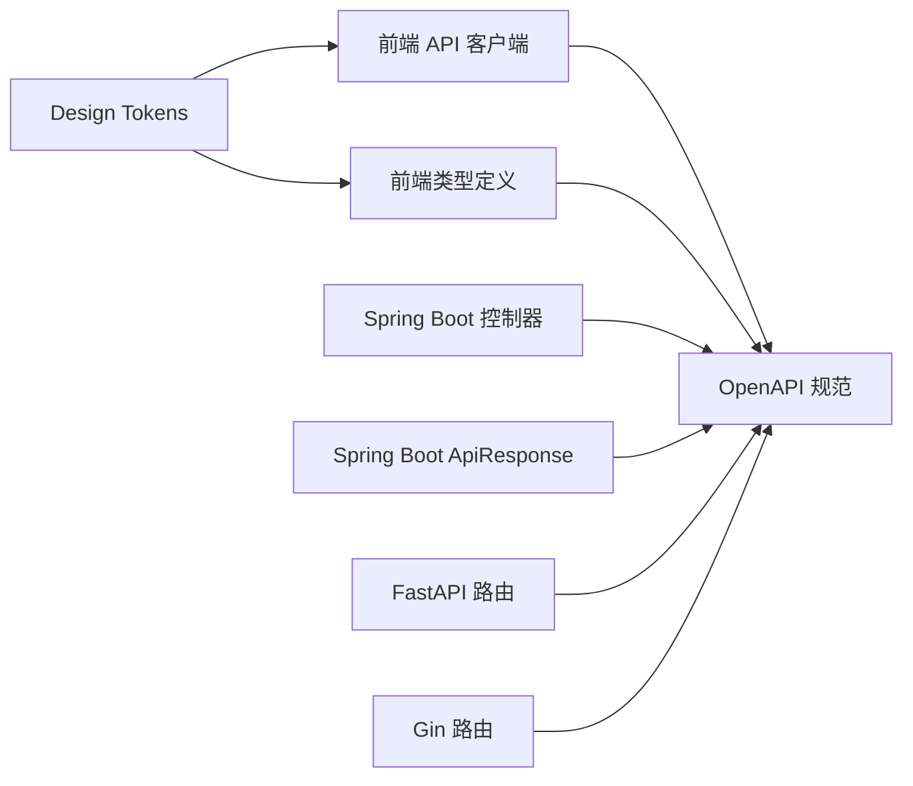

# 开发指南

<cite>
**本文引用的文件**
- [README.md](file://README.md)
- [CLAUDE.md](file://CLAUDE.md)
- [docs/api-spec.md](file://docs/api-spec.md)
- [docs/design-tokens.md](file://docs/design-tokens.md)
- [spec/api/openapi.yaml](file://spec/api/openapi.yaml)
- [spec/styles/tokens.css](file://spec/styles/tokens.css)
- [frontends/react-ts/src/api/index.ts](file://frontends/react-ts/src/api/index.ts)
- [frontends/vue3-ts/src/types/index.ts](file://frontends/vue3-ts/src/types/index.ts)
- [backends/spring-boot/src/main/java/com/hellotime/controller/CapsuleController.java](file://backends/spring-boot/src/main/java/com/hellotime/controller/CapsuleController.java)
- [backends/spring-boot/src/main/java/com/hellotime/dto/ApiResponse.java](file://backends/spring-boot/src/main/java/com/hellotime/dto/ApiResponse.java)
- [backends/fastapi/app/routers/capsule.py](file://backends/fastapi/app/routers/capsule.py)
- [backends/gin/router/router.go](file://backends/gin/router/router.go)
- [scripts/dev.sh](file://scripts/dev.sh)
- [scripts/test.sh](file://scripts/test.sh)
</cite>

## 目录
1. [简介](#简介)
2. [项目结构](#项目结构)
3. [核心组件](#核心组件)
4. [架构总览](#架构总览)
5. [详细组件分析](#详细组件分析)
6. [依赖关系分析](#依赖关系分析)
7. [性能考虑](#性能考虑)
8. [故障排查指南](#故障排查指南)
9. [结论](#结论)
10. [附录](#附录)

## 简介
HelloTime 是一个“时间胶囊”应用，用户可以创建消息并在未来某个时刻开启。项目通过统一的 API 规范与设计系统，实现多前端与多后端的自由组合，强调前后端解耦、响应式设计、主题切换、完整测试与详尽文档。

- 前后端完全解耦，任意前端可与任意后端组合
- 统一的 OpenAPI 3.0 规范与 CSS Design Tokens 设计系统
- 响应式设计，支持 PC 与移动端
- 明亮/深色主题一键切换
- 完整测试覆盖核心业务逻辑

**章节来源**
- [README.md:1-323](file://README.md#L1-L323)

## 项目结构
项目采用 monorepo 结构，包含文档、共享规范、多个前端实现与多个后端实现，以及统一的开发脚本。

**图表来源**
- [README.md:37-63](file://README.md#L37-L63)
- [CLAUDE.md:66-78](file://CLAUDE.md#L66-L78)

**章节来源**
- [README.md:37-63](file://README.md#L37-L63)
- [CLAUDE.md:66-78](file://CLAUDE.md#L66-L78)

## 核心组件
- 统一 API 规范：OpenAPI 3.0，定义了健康检查、创建胶囊、查询胶囊、管理员登录与管理等端点及统一响应格式
- 设计系统：基于 CSS 自定义属性的 Design Tokens，提供颜色、排版、间距、圆角等设计令牌，并支持暗色模式
- 前端 API 客户端：各前端实现共享同一套 API 客户端与类型定义，保证调用一致性
- 后端控制器/路由：严格遵循 OpenAPI 规范，统一响应包装与错误处理

**章节来源**
- [docs/api-spec.md:1-195](file://docs/api-spec.md#L1-L195)
- [docs/design-tokens.md:1-91](file://docs/design-tokens.md#L1-L91)
- [spec/api/openapi.yaml:1-349](file://spec/api/openapi.yaml#L1-L349)
- [spec/styles/tokens.css:1-104](file://spec/styles/tokens.css#L1-L104)
- [frontends/react-ts/src/api/index.ts:1-94](file://frontends/react-ts/src/api/index.ts#L1-L94)
- [frontends/vue3-ts/src/types/index.ts:1-80](file://frontends/vue3-ts/src/types/index.ts#L1-L80)

## 架构总览
系统采用“共享规范 + 多实现”的架构：前端通过统一 API 客户端访问后端；后端实现严格遵循 OpenAPI 规范；设计系统通过 Design Tokens 保障视觉一致性。

**图表来源**
- [README.md:35](file://README.md#L35)
- [CLAUDE.md:154-167](file://CLAUDE.md#L154-L167)
- [CLAUDE.md:176-182](file://CLAUDE.md#L176-L182)

**章节来源**
- [README.md:35](file://README.md#L35)
- [CLAUDE.md:154-167](file://CLAUDE.md#L154-L167)
- [CLAUDE.md:176-182](file://CLAUDE.md#L176-L182)

## 详细组件分析

### 统一 API 响应与错误处理
- 统一响应格式包含 success、data、message、errorCode 字段
- 失败场景抛出异常或返回非 2xx 状态，前端统一捕获并转换为错误
- OpenAPI 规范中定义了各端点的响应模型与错误码

**图表来源**
- [docs/api-spec.md:5-14](file://docs/api-spec.md#L5-L14)
- [spec/api/openapi.yaml:165-171](file://spec/api/openapi.yaml#L165-L171)

**章节来源**
- [docs/api-spec.md:5-14](file://docs/api-spec.md#L5-L14)
- [spec/api/openapi.yaml:165-171](file://spec/api/openapi.yaml#L165-L171)

### 前端 API 客户端（React 示例）
- 基于 fetch 的请求封装，统一处理 Content-Type 与错误
- 提供 createCapsule、getCapsule、adminLogin、getAdminCapsules、deleteAdminCapsule、getHealthInfo 等方法
- 与后端统一的 API 基础路径与响应格式

**图表来源**
- [frontends/react-ts/src/api/index.ts:14-31](file://frontends/react-ts/src/api/index.ts#L14-L31)

**章节来源**
- [frontends/react-ts/src/api/index.ts:1-94](file://frontends/react-ts/src/api/index.ts#L1-L94)

### 后端控制器（Spring Boot 示例）
- 控制器层负责接收请求、参数校验与返回 ResponseEntity
- 业务逻辑委托给服务层，最终以统一 ApiResponse 包装响应
- 严格遵循 OpenAPI 路径与响应模型

**图表来源**
- [backends/spring-boot/src/main/java/com/hellotime/controller/CapsuleController.java:37-42](file://backends/spring-boot/src/main/java/com/hellotime/controller/CapsuleController.java#L37-L42)
- [backends/spring-boot/src/main/java/com/hellotime/dto/ApiResponse.java:21-48](file://backends/spring-boot/src/main/java/com/hellotime/dto/ApiResponse.java#L21-L48)

**章节来源**
- [backends/spring-boot/src/main/java/com/hellotime/controller/CapsuleController.java:1-57](file://backends/spring-boot/src/main/java/com/hellotime/controller/CapsuleController.java#L1-L57)
- [backends/spring-boot/src/main/java/com/hellotime/dto/ApiResponse.java:1-48](file://backends/spring-boot/src/main/java/com/hellotime/dto/ApiResponse.java#L1-L48)

### 后端路由（FastAPI 示例）
- 使用 APIRouter 定义路由前缀与标签
- 通过依赖注入获取数据库会话，调用服务层并返回 JSONResponse
- 响应使用 Pydantic 模型序列化，符合统一格式

**章节来源**
- [backends/fastapi/app/routers/capsule.py:1-31](file://backends/fastapi/app/routers/capsule.py#L1-L31)

### 后端路由（Gin 示例）
- 使用 gin.Engine 注册路由组 /api/v1
- 管理员相关路由使用 JWT 中间件鉴权
- 健康检查、胶囊 CRUD、管理员登录与管理均在统一前缀下

**章节来源**
- [backends/gin/router/router.go:1-46](file://backends/gin/router/router.go#L1-L46)

### 设计系统与主题切换
- Design Tokens 通过 CSS 自定义属性定义颜色、排版、间距、圆角等
- 暗色模式通过 [data-theme="dark"] 覆盖亮色令牌值
- 前端实现需同步主题到 localStorage，并在 <html> 上设置 data-theme

**图表来源**
- [docs/design-tokens.md:76-82](file://docs/design-tokens.md#L76-L82)
- [spec/styles/tokens.css:82-103](file://spec/styles/tokens.css#L82-L103)

**章节来源**
- [docs/design-tokens.md:1-91](file://docs/design-tokens.md#L1-L91)
- [spec/styles/tokens.css:1-104](file://spec/styles/tokens.css#L1-L104)

## 依赖关系分析
- 前端依赖：各前端实现共享 API 客户端与类型定义，确保调用一致性
- 后端依赖：控制器/路由依赖服务层与数据库依赖注入；统一响应包装
- 规范依赖：OpenAPI 与 Design Tokens 作为共享契约，约束实现行为

**图表来源**
- [frontends/react-ts/src/api/index.ts:1-94](file://frontends/react-ts/src/api/index.ts#L1-L94)
- [frontends/vue3-ts/src/types/index.ts:1-80](file://frontends/vue3-ts/src/types/index.ts#L1-L80)
- [backends/spring-boot/src/main/java/com/hellotime/dto/ApiResponse.java:21-48](file://backends/spring-boot/src/main/java/com/hellotime/dto/ApiResponse.java#L21-L48)
- [spec/api/openapi.yaml:1-349](file://spec/api/openapi.yaml#L1-L349)
- [spec/styles/tokens.css:1-104](file://spec/styles/tokens.css#L1-L104)

**章节来源**
- [frontends/react-ts/src/api/index.ts:1-94](file://frontends/react-ts/src/api/index.ts#L1-L94)
- [frontends/vue3-ts/src/types/index.ts:1-80](file://frontends/vue3-ts/src/types/index.ts#L1-L80)
- [backends/spring-boot/src/main/java/com/hellotime/dto/ApiResponse.java:1-48](file://backends/spring-boot/src/main/java/com/hellotime/dto/ApiResponse.java#L1-L48)
- [spec/api/openapi.yaml:1-349](file://spec/api/openapi.yaml#L1-L349)
- [spec/styles/tokens.css:1-104](file://spec/styles/tokens.css#L1-L104)

## 性能考虑
- 前端：组件级样式与状态管理，避免不必要的重渲染；合理拆分路由与懒加载
- 后端：数据库连接池与事务控制；缓存热点数据；限制分页 size；日志与监控
- 共享：统一 API 响应减少前端分支判断；Design Tokens 减少重复计算

[本节为通用建议，无需特定文件引用]

## 故障排查指南
- 启动与联调
  - 使用一键脚本同时启动后端与多个前端，确认端口占用与跨域
  - 健康检查端点用于确认后端可用性与技术栈信息
- 前端调用
  - 若请求失败，检查统一错误处理是否抛出 message 或状态码
  - 确认 BASE_URL 与代理配置正确
- 后端接口
  - 校验控制器/路由是否遵循 OpenAPI 路径与响应模型
  - 统一响应包装是否正确返回 success/data/message/errorCode
- 设计系统
  - 检查 [data-theme] 属性与 localStorage 同步
  - 确认 Design Tokens 文件被正确引入

**章节来源**
- [scripts/dev.sh:1-52](file://scripts/dev.sh#L1-L52)
- [scripts/test.sh:1-34](file://scripts/test.sh#L1-L34)
- [docs/api-spec.md:18-31](file://docs/api-spec.md#L18-L31)
- [frontends/react-ts/src/api/index.ts:14-31](file://frontends/react-ts/src/api/index.ts#L14-L31)
- [backends/spring-boot/src/main/java/com/hellotime/dto/ApiResponse.java:21-48](file://backends/spring-boot/src/main/java/com/hellotime/dto/ApiResponse.java#L21-L48)
- [docs/design-tokens.md:76-82](file://docs/design-tokens.md#L76-L82)

## 结论
HelloTime 通过统一的 API 规范与设计系统，实现了多前端与多后端的自由组合与一致性体验。遵循本文档的开发规范、命名约定与最佳实践，可高效地新增前端或后端实现，并确保质量与可维护性。

[本节为总结，无需特定文件引用]

## 附录

### 新增前端实现流程
- 在 frontends/ 下创建新项目
- 遵循 OpenAPI 规范实现 API 调用
- 引入 Design Tokens 与共享类型定义
- 实现标准路由：/, /create, /open/:code, /about, /admin

**章节来源**
- [README.md:285-296](file://README.md#L285-L296)

### 新增后端实现流程
- 在 backends/ 下创建新项目
- 实现 OpenAPI 定义的所有端点
- 使用统一的 SQLite 数据库结构
- 遵循统一的 API 响应格式与错误处理

**章节来源**
- [README.md:297-303](file://README.md#L297-L303)

### 代码规范与命名约定
- 统一响应：success、data、message、errorCode
- 类型定义：与后端保持一致的字段命名与可空性
- 路由与端点：严格遵循 OpenAPI 路径与方法
- 设计系统：使用 Design Tokens，支持暗色模式

**章节来源**
- [docs/api-spec.md:5-14](file://docs/api-spec.md#L5-L14)
- [frontends/vue3-ts/src/types/index.ts:1-80](file://frontends/vue3-ts/src/types/index.ts#L1-L80)
- [docs/design-tokens.md:1-91](file://docs/design-tokens.md#L1-L91)

### 目录结构最佳实践
- 前端：按组件/视图/服务/类型划分，共享 API 与类型
- 后端：按控制器/服务/仓库/DTO/实体划分，统一响应包装
- 共享：spec/ 下存放 OpenAPI 与 Design Tokens

**章节来源**
- [CLAUDE.md:79-116](file://CLAUDE.md#L79-L116)
- [CLAUDE.md:117-153](file://CLAUDE.md#L117-L153)

### 新功能开发流程
- 基于 OpenAPI 规范扩展端点与模型
- 前端实现对应 API 客户端与视图组件
- 后端实现控制器/路由与服务层
- 引入 Design Tokens 保持视觉一致
- 编写单元与集成测试

**章节来源**
- [docs/api-spec.md:16-184](file://docs/api-spec.md#L16-L184)
- [spec/api/openapi.yaml:10-164](file://spec/api/openapi.yaml#L10-L164)
- [docs/design-tokens.md:83-91](file://docs/design-tokens.md#L83-L91)

### 分支管理与代码审查
- 建议采用 Feature 分支开发，主分支保持稳定
- 提交信息清晰描述变更与影响范围
- 代码审查关注：API 兼容性、响应一致性、设计系统使用、测试覆盖率

[本节为通用建议，无需特定文件引用]

### 调试与性能分析
- 前端：利用统一错误处理定位失败原因；检查网络面板与控制台
- 后端：启用日志与指标；对慢查询与高延迟接口进行优化
- 共享：通过健康检查端点确认后端状态与技术栈

**章节来源**
- [docs/api-spec.md:18-31](file://docs/api-spec.md#L18-L31)
- [scripts/dev.sh:19](file://scripts/dev.sh#L19)

### 贡献流程与社区协作
- Fork 仓库并创建功能分支
- 遵循统一规范与测试要求
- 提交 Pull Request，附带变更说明与测试结果
- 社区成员进行代码审查与讨论

**章节来源**
- [README.md:152-194](file://README.md#L152-L194)