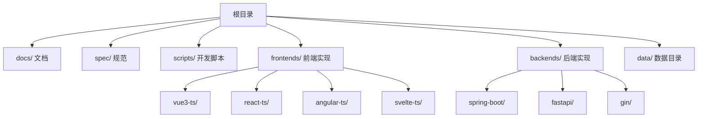
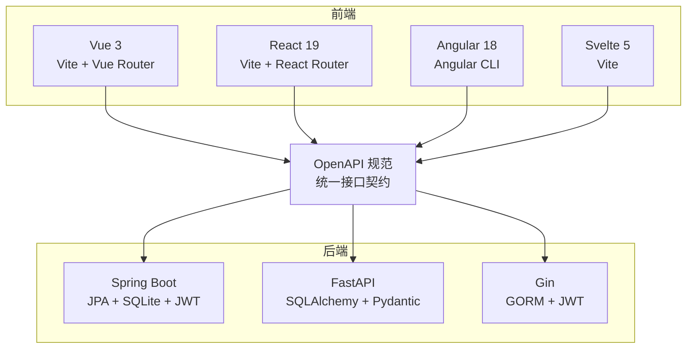
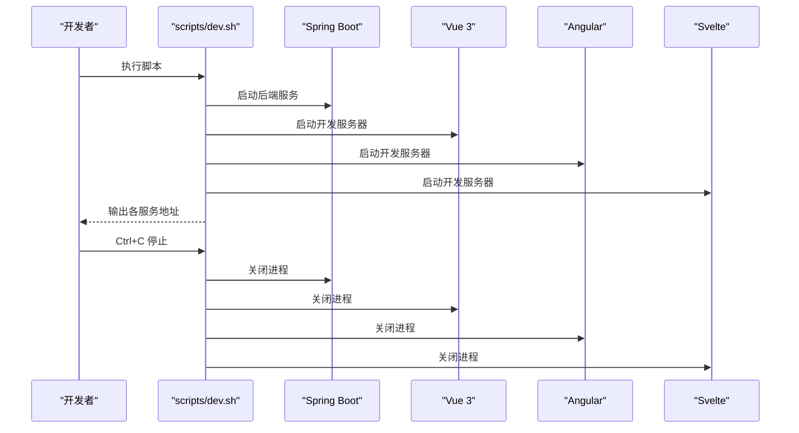
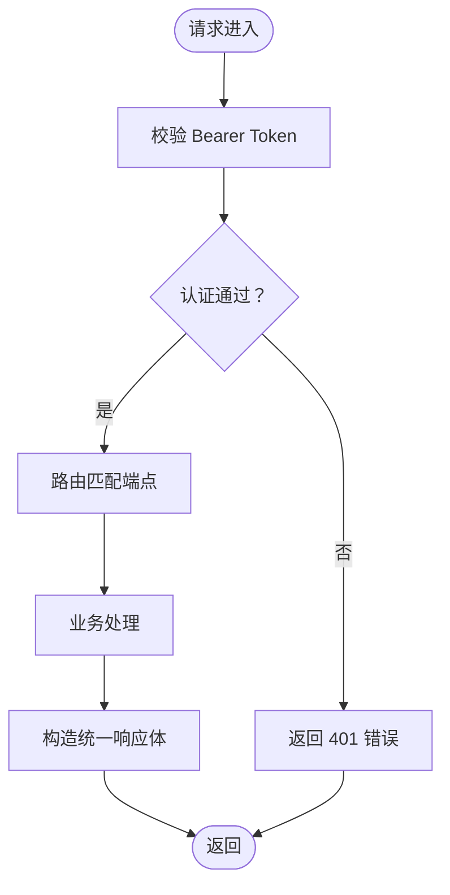
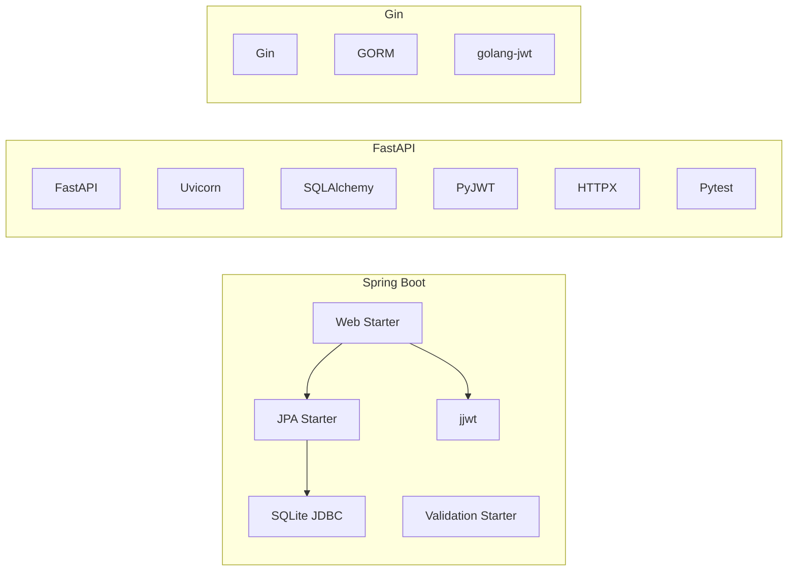

# 开发流程

<cite>
**本文引用的文件**
- [README.md](file://README.md)
- [deployment.md](file://docs/deployment.md)
- [backend-comparison.md](file://docs/backend-comparison.md)
- [dev.sh](file://scripts/dev.sh)
- [build.sh](file://scripts/build.sh)
- [test.sh](file://scripts/test.sh)
- [openapi.yaml](file://spec/api/openapi.yaml)
- [pom.xml](file://backends/spring-boot/pom.xml)
- [requirements.txt](file://backends/fastapi/requirements.txt)
- [package.json (Vue 3)](file://frontends/vue3-ts/package.json)
- [package.json (Angular)](file://frontends/angular-ts/package.json)
- [package.json (React)](file://frontends/react-ts/package.json)
- [HelloTimeApplication.java](file://backends/spring-boot/src/main/java/com/hellotime/HelloTimeApplication.java)
- [FastAPI 说明](file://backends/fastapi/README.md)
- [Gin 说明](file://backends/gin/README.md)
- [Vue 3 说明](file://frontends/vue3-ts/README.md)
</cite>

## 目录
1. [简介](#简介)
2. [项目结构](#项目结构)
3. [核心组件](#核心组件)
4. [架构总览](#架构总览)
5. [详细组件分析](#详细组件分析)
6. [依赖分析](#依赖分析)
7. [性能考虑](#性能考虑)
8. [故障排查指南](#故障排查指南)
9. [结论](#结论)
10. [附录](#附录)

## 简介
本指南面向 HelloTime 项目开发者，提供从环境准备、依赖安装、本地开发、测试执行、构建打包到部署发布的完整流程。项目采用前后端完全解耦的多实现架构，统一的 OpenAPI 规范与设计系统确保各技术栈实现的功能一致性。仓库内提供一键开发脚本与构建脚本，便于快速启动与批量执行。

## 项目结构
项目采用多实现并存的组织方式：后端提供 Spring Boot、FastAPI、Gin 三种实现；前端提供 Vue 3、React、Angular、Svelte 四种实现；同时通过共享规范（OpenAPI 与设计令牌）保证一致性。

图表来源
- [README.md:37-63](file://README.md#L37-L63)

章节来源
- [README.md:37-63](file://README.md#L37-L63)

## 核心组件
- 开发脚本
  - scripts/dev.sh：一键启动后端与多个前端开发服务器，便于联调
  - scripts/build.sh：构建后端 JAR 与前端静态产物
  - scripts/test.sh：统一运行后端与前端测试
- 规范与接口
  - spec/api/openapi.yaml：统一的 REST API 规范，定义健康检查、胶囊 CRUD、管理员登录与分页列表等端点
- 后端实现
  - Spring Boot：Maven 构建，JPA + SQLite，JWT 认证，全局异常处理
  - FastAPI：Python 异步框架，Pydantic 校验，Uvicorn 服务器
  - Gin：Go 微服务，GORM 持久化，JWT 认证
- 前端实现
  - Vue 3 + TypeScript + Vite：Composition API + 路由 + Vitest
  - React + TypeScript + Vite：Hooks + 路由 + Vitest
  - Angular + TypeScript + Angular CLI：Standalone 组件 + 测试
  - Svelte + TypeScript + Vite：组件化 + 路由

章节来源
- [dev.sh:1-52](file://scripts/dev.sh#L1-L52)
- [build.sh:1-41](file://scripts/build.sh#L1-L41)
- [test.sh:1-34](file://scripts/test.sh#L1-L34)
- [openapi.yaml:1-349](file://spec/api/openapi.yaml#L1-L349)
- [pom.xml:1-91](file://backends/spring-boot/pom.xml#L1-L91)
- [requirements.txt:1-7](file://backends/fastapi/requirements.txt#L1-L7)
- [package.json (Vue 3):1-30](file://frontends/vue3-ts/package.json#L1-L30)
- [package.json (Angular):1-38](file://frontends/angular-ts/package.json#L1-L38)
- [package.json (React):1-31](file://frontends/react-ts/package.json#L1-L31)

## 架构总览
项目采用“统一规范 + 多实现”的架构：前端通过统一的 API 规范对接后端，后端实现之间通过相同的数据库与认证机制保持行为一致。开发阶段可通过脚本一键启动，生产阶段分别构建后端 JAR 与前端静态资源，由 Web 服务器或容器承载。

图表来源
- [README.md:16-35](file://README.md#L16-L35)
- [openapi.yaml:1-349](file://spec/api/openapi.yaml#L1-L349)

## 详细组件分析

### 开发脚本与工作流
- scripts/dev.sh
  - 启动顺序：Spring Boot → Vue 3 → Angular → Svelte
  - 并发启动，统一输出服务地址，捕获退出信号统一关闭子进程
- scripts/build.sh
  - 后端：Maven 打包生成 JAR
  - 前端：Vue 3、Angular、Svelte 分别构建静态产物
- scripts/test.sh
  - 后端：Spring Boot 测试
  - 前端：Vue 3 Vitest、Angular Karma 测试

图表来源
- [dev.sh:11-51](file://scripts/dev.sh#L11-L51)

章节来源
- [dev.sh:1-52](file://scripts/dev.sh#L1-L52)
- [build.sh:1-41](file://scripts/build.sh#L1-L41)
- [test.sh:1-34](file://scripts/test.sh#L1-L34)

### API 规范与统一响应
- 统一的 OpenAPI 3.0 规范定义了健康检查、胶囊 CRUD、管理员登录与分页列表等端点
- 统一的响应体字段：success、data、message、errorCode，便于前端一致处理
- 认证采用 Bearer Token（JWT），管理员登录获取 token，后续请求在 Header 中携带

图表来源
- [openapi.yaml:100-163](file://spec/api/openapi.yaml#L100-L163)

章节来源
- [openapi.yaml:1-349](file://spec/api/openapi.yaml#L1-L349)

### 后端实现对比与选型建议
- Spring Boot：生态丰富、注解驱动、适合复杂业务与企业级特性
- FastAPI：开发效率高、自动文档、类型安全、异步性能佳
- Gin：轻量、并发模型优秀、适合高吞吐场景

章节来源
- [backend-comparison.md:1-72](file://docs/backend-comparison.md#L1-L72)

### 前端实现与测试
- Vue 3：Composition API + 路由 + Vitest，支持主题切换与统一 API 客户端
- React：Hooks + 路由 + Vitest，组件化程度高
- Angular：Standalone 组件 + 测试框架，TypeScript 类型安全
- Svelte：组件化 + 路由，构建简单

章节来源
- [package.json (Vue 3):1-30](file://frontends/vue3-ts/package.json#L1-L30)
- [package.json (Angular):1-38](file://frontends/angular-ts/package.json#L1-L38)
- [package.json (React):1-31](file://frontends/react-ts/package.json#L1-L31)
- [Vue 3 说明:1-205](file://frontends/vue3-ts/README.md#L1-L205)

### 后端实现要点
- Spring Boot
  - 入口类与依赖声明，使用 JPA + SQLite + JWT
- FastAPI
  - 异步框架、Pydantic 校验、Uvicorn 服务器、统一响应与异常处理
- Gin
  - RESTful 路由、GORM 持久化、JWT 中间件、全局异常处理

章节来源
- [HelloTimeApplication.java:1-12](file://backends/spring-boot/src/main/java/com/hellotime/HelloTimeApplication.java#L1-L12)
- [pom.xml:25-80](file://backends/spring-boot/pom.xml#L25-L80)
- [FastAPI 说明:1-176](file://backends/fastapi/README.md#L1-L176)
- [Gin 说明:1-171](file://backends/gin/README.md#L1-L171)

## 依赖分析
- 后端依赖
  - Spring Boot：Web、JPA、Validation、SQLite JDBC、JWT
  - FastAPI：FastAPI、Uvicorn、SQLAlchemy、PyJWT、HTTPX、Pytest
  - Gin：Gin、GORM、JWT
- 前端依赖
  - Vue 3：Vue、Vue Router、Vitest、Testing Library
  - React：React、React Router、Vitest、Testing Library
  - Angular：Angular 核心、CLI、测试套件
  - Svelte：Svelte、Vite、测试工具链

图表来源
- [pom.xml:25-80](file://backends/spring-boot/pom.xml#L25-L80)
- [requirements.txt:1-7](file://backends/fastapi/requirements.txt#L1-L7)

章节来源
- [pom.xml:1-91](file://backends/spring-boot/pom.xml#L1-L91)
- [requirements.txt:1-7](file://backends/fastapi/requirements.txt#L1-L7)

## 性能考虑
- 后端性能
  - Gin 在高并发与低延迟方面具备优势
  - Spring Boot 通过虚拟线程提升 I/O 密集型场景并发能力
  - FastAPI 异步处理能力强，适合高吞吐 API
- 前端性能
  - 使用 Vite 构建，按需加载与 Tree Shaking 优化
  - 组件拆分与路由懒加载减少首屏负担
- 数据库
  - SQLite 适合演示与小规模应用，生产建议评估读写压力与备份策略

章节来源
- [backend-comparison.md:56-71](file://docs/backend-comparison.md#L56-L71)
- [deployment.md:109-112](file://docs/deployment.md#L109-L112)

## 故障排查指南
- 端口冲突
  - 后端默认 8080，前端默认 5173/5174/5175/5176，可在各自配置中调整
- CORS 问题
  - 后端已配置允许 localhost:* 跨域，开发阶段无需额外设置
- 数据库文件位置
  - SQLite 默认在后端运行目录生成数据库文件，注意备份与权限
- 环境变量
  - 生产环境务必修改 JWT 密钥与管理员密码，避免默认值被利用
- 代理与联调
  - 前端开发服务器会代理 API 请求至后端，确认 .env 中的 API 基础地址

章节来源
- [README.md:265-282](file://README.md#L265-L282)
- [deployment.md:71-107](file://docs/deployment.md#L71-L107)
- [Vue 3 说明:43-50](file://frontends/vue3-ts/README.md#L43-L50)

## 结论
HelloTime 提供了统一规范下的多技术栈实现，开发者可依据团队技术栈与性能需求选择合适的后端与前端组合。通过脚本化的工作流与完善的测试体系，能够显著提升开发效率与交付质量。生产部署时请关注环境变量安全与数据库备份策略。

## 附录

### 开发环境搭建与依赖安装
- 后端
  - Spring Boot：安装 Java 与 Maven，直接运行启动类或使用 Maven 插件
  - FastAPI：创建虚拟环境并安装依赖
  - Gin：使用模块管理安装依赖
- 前端
  - Vue 3/React/Svelte：安装 Node.js 与 npm，执行安装命令
  - Angular：安装 Node.js 与 npm，使用 Angular CLI

章节来源
- [HelloTimeApplication.java:1-12](file://backends/spring-boot/src/main/java/com/hellotime/HelloTimeApplication.java#L1-L12)
- [FastAPI 说明:23-49](file://backends/fastapi/README.md#L23-L49)
- [Gin 说明:22-42](file://backends/gin/README.md#L22-L42)
- [Vue 3 说明:24-41](file://frontends/vue3-ts/README.md#L24-L41)
- [package.json (Vue 3):1-30](file://frontends/vue3-ts/package.json#L1-L30)
- [package.json (Angular):1-38](file://frontends/angular-ts/package.json#L1-L38)
- [package.json (React):1-31](file://frontends/react-ts/package.json#L1-L31)

### 本地开发与联调
- 使用 scripts/dev.sh 同时启动后端与多个前端，便于联调
- 前端通过代理访问后端 API，确认 .env 中的 API 基础地址
- 如需单独启动某端，参考各实现的 README 或 package.json 中的脚本

章节来源
- [dev.sh:11-46](file://scripts/dev.sh#L11-L46)
- [Vue 3 说明:43-50](file://frontends/vue3-ts/README.md#L43-L50)

### 测试执行
- 统一使用 scripts/test.sh 运行所有测试
- 后端：Spring Boot 使用 Maven 测试插件；FastAPI 使用 pytest；Gin 使用 go test
- 前端：Vue 3 使用 Vitest；Angular 使用 Karma；React 使用 Vitest

章节来源
- [test.sh:11-33](file://scripts/test.sh#L11-L33)
- [FastAPI 说明:118-129](file://backends/fastapi/README.md#L118-L129)
- [Gin 说明:113-121](file://backends/gin/README.md#L113-L121)
- [Vue 3 说明:107-115](file://frontends/vue3-ts/README.md#L107-L115)
- [package.json (Angular):1-38](file://frontends/angular-ts/package.json#L1-L38)
- [package.json (React):1-31](file://frontends/react-ts/package.json#L1-L31)

### 构建与打包
- 使用 scripts/build.sh 构建后端 JAR 与前端静态产物
- 后端：Maven 打包生成 JAR
- 前端：Vue 3、Angular、Svelte 分别构建静态目录

章节来源
- [build.sh:11-40](file://scripts/build.sh#L11-L40)

### 部署发布
- 后端：运行 JAR 文件，确保环境变量安全
- 前端：将静态文件部署至 Web 服务器或反向代理，配置 API 代理
- Nginx 示例与数据库备份策略见部署文档

章节来源
- [deployment.md:44-112](file://docs/deployment.md#L44-L112)

### 版本控制与分支策略
- 建议采用功能分支开发，主分支仅接受通过测试与审查的变更
- 发布前打标签并更新版本号，记录变更日志
- 保持规范文件（OpenAPI、设计令牌）同步更新

章节来源
- [README.md:283-311](file://README.md#L283-L311)