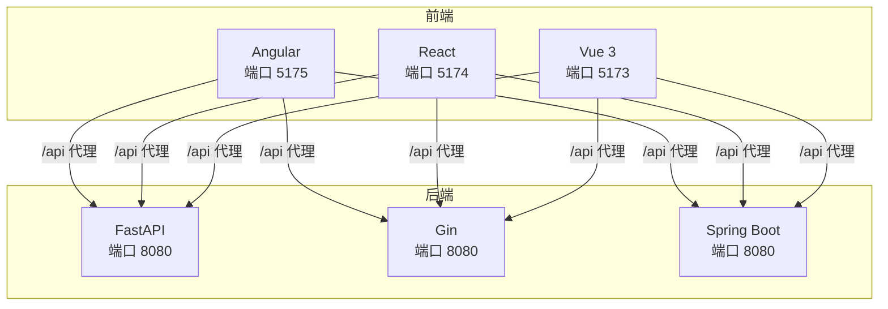
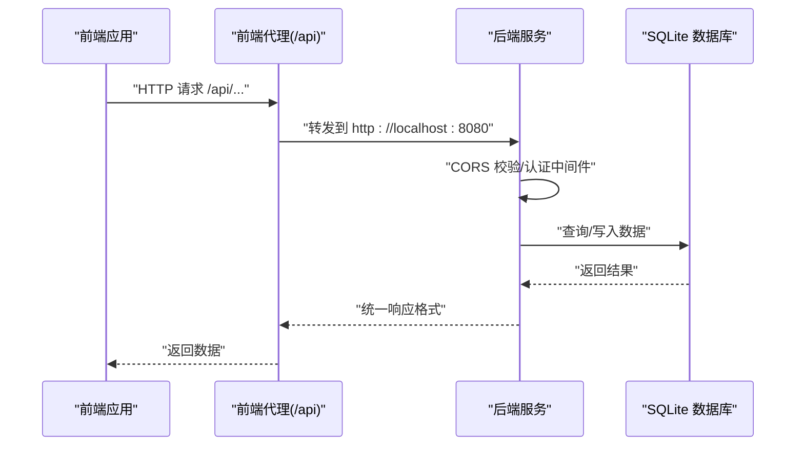
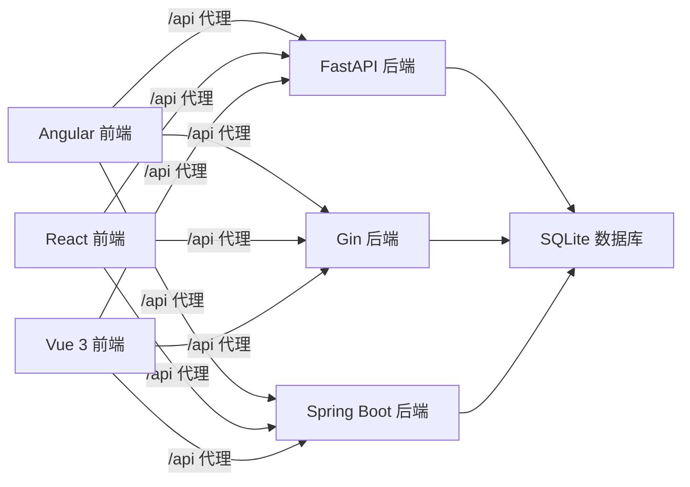
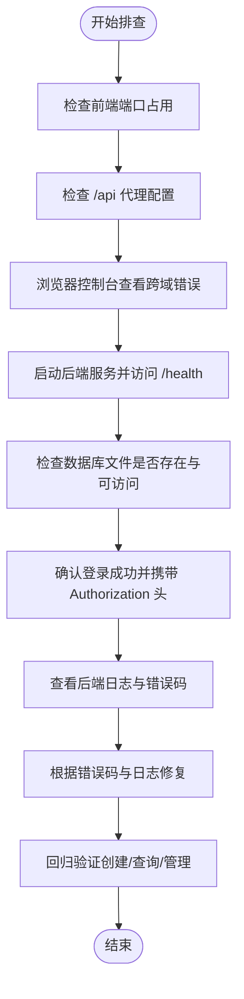

# 故障排除与调试

<cite>
**本文引用的文件**
- [backends/fastapi/README.md](file://backends/fastapi/README.md)
- [backends/fastapi/app/main.py](file://backends/fastapi/app/main.py)
- [backends/fastapi/app/config.py](file://backends/fastapi/app/config.py)
- [backends/fastapi/app/database.py](file://backends/fastapi/app/database.py)
- [backends/gin/README.md](file://backends/gin/README.md)
- [backends/gin/config/config.go](file://backends/gin/config/config.go)
- [backends/gin/middleware/cors.go](file://backends/gin/middleware/cors.go)
- [backends/gin/middleware/auth.go](file://backends/gin/middleware/auth.go)
- [backends/spring-boot/README.md](file://backends/spring-boot/README.md)
- [backends/spring-boot/src/main/resources/application.yml](file://backends/spring-boot/src/main/resources/application.yml)
- [backends/spring-boot/src/main/java/com/hellotime/config/CorsConfig.java](file://backends/spring-boot/src/main/java/com/hellotime/config/CorsConfig.java)
- [backends/spring-boot/src/main/java/com/hellotime/config/AdminAuthInterceptor.java](file://backends/spring-boot/src/main/java/com/hellotime/config/AdminAuthInterceptor.java)
- [frontends/angular-ts/README.md](file://frontends/angular-ts/README.md)
- [frontends/angular-ts/proxy.conf.json](file://frontends/angular-ts/proxy.conf.json)
- [frontends/react-ts/README.md](file://frontends/react-ts/README.md)
- [frontends/react-ts/vite.config.ts](file://frontends/react-ts/vite.config.ts)
- [frontends/vue3-ts/README.md](file://frontends/vue3-ts/README.md)
- [frontends/vue3-ts/vite.config.ts](file://frontends/vue3-ts/vite.config.ts)
</cite>

## 目录
1. [简介](#简介)
2. [项目结构](#项目结构)
3. [核心组件](#核心组件)
4. [架构总览](#架构总览)
5. [详细组件分析](#详细组件分析)
6. [依赖分析](#依赖分析)
7. [性能考虑](#性能考虑)
8. [故障排除指南](#故障排除指南)
9. [结论](#结论)
10. [附录](#附录)

## 简介
本指南面向 HelloTime 项目开发者，聚焦于前后端连接、数据库连接、JWT 认证、CORS 跨域等常见问题的诊断与解决。文档同时提供浏览器开发者工具、后端日志分析、数据库查询调试等实用方法，并覆盖开发、测试、生产三类环境的差异化排查策略。最后给出问题反馈模板与社区支持渠道，帮助快速定位与解决问题。

## 项目结构
HelloTime 采用多后端与多前端并行的架构：
- 后端提供三套实现：FastAPI（Python）、Gin（Go）、Spring Boot（Java），均暴露一致的 REST API。
- 前端提供 Angular、React、Vue 三种实现，共享 API 客户端与设计系统，统一通过代理转发 /api 到后端 8080 端口。

图表来源
- [frontends/angular-ts/proxy.conf.json:1-8](file://frontends/angular-ts/proxy.conf.json#L1-L8)
- [frontends/react-ts/vite.config.ts:1-23](file://frontends/react-ts/vite.config.ts#L1-L23)
- [frontends/vue3-ts/vite.config.ts:1-23](file://frontends/vue3-ts/vite.config.ts#L1-L23)
- [backends/fastapi/README.md:41-51](file://backends/fastapi/README.md#L41-L51)
- [backends/gin/README.md:32-42](file://backends/gin/README.md#L32-L42)
- [backends/spring-boot/README.md:30-38](file://backends/spring-boot/README.md#L30-L38)

章节来源
- [frontends/angular-ts/README.md:1-283](file://frontends/angular-ts/README.md#L1-L283)
- [frontends/react-ts/README.md:1-210](file://frontends/react-ts/README.md#L1-L210)
- [frontends/vue3-ts/README.md:1-205](file://frontends/vue3-ts/README.md#L1-L205)
- [backends/fastapi/README.md:1-176](file://backends/fastapi/README.md#L1-L176)
- [backends/gin/README.md:1-171](file://backends/gin/README.md#L1-L171)
- [backends/spring-boot/README.md:1-136](file://backends/spring-boot/README.md#L1-L136)

## 核心组件
- 前端代理与端口
  - Angular 使用本地代理将 /api 转发至后端 8080；React/Vue 使用 Vite 代理同构配置。
- 后端 CORS
  - FastAPI/Gin/Spring Boot 均配置了允许 http://localhost:* 的来源，支持开发环境跨域。
- 后端数据库
  - 三套后端均使用 SQLite，默认数据库文件位于 data/hellotime.db（相对路径）。
- 后端认证
  - 管理员登录接口返回 JWT；各后端均提供认证中间件/拦截器，要求 Authorization: Bearer {token}。

章节来源
- [frontends/angular-ts/proxy.conf.json:1-8](file://frontends/angular-ts/proxy.conf.json#L1-L8)
- [frontends/react-ts/vite.config.ts:13-22](file://frontends/react-ts/vite.config.ts#L13-L22)
- [frontends/vue3-ts/vite.config.ts:13-22](file://frontends/vue3-ts/vite.config.ts#L13-L22)
- [backends/fastapi/app/main.py:21-29](file://backends/fastapi/app/main.py#L21-L29)
- [backends/gin/middleware/cors.go:14-35](file://backends/gin/middleware/cors.go#L14-L35)
- [backends/spring-boot/src/main/java/com/hellotime/config/CorsConfig.java:14-26](file://backends/spring-boot/src/main/java/com/hellotime/config/CorsConfig.java#L14-L26)
- [backends/fastapi/app/database.py:11-14](file://backends/fastapi/app/database.py#L11-L14)
- [backends/gin/config/config.go:32-43](file://backends/gin/config/config.go#L32-L43)
- [backends/spring-boot/src/main/resources/application.yml:4-6](file://backends/spring-boot/src/main/resources/application.yml#L4-L6)
- [backends/spring-boot/src/main/java/com/hellotime/config/AdminAuthInterceptor.java:34-57](file://backends/spring-boot/src/main/java/com/hellotime/config/AdminAuthInterceptor.java#L34-L57)

## 架构总览
下图展示了典型请求链路：前端通过 /api 发起请求，经由代理到达后端，后端执行业务逻辑并访问数据库，最终返回统一格式的响应。

图表来源
- [frontends/angular-ts/proxy.conf.json:1-8](file://frontends/angular-ts/proxy.conf.json#L1-L8)
- [frontends/react-ts/vite.config.ts:15-20](file://frontends/react-ts/vite.config.ts#L15-L20)
- [frontends/vue3-ts/vite.config.ts:15-20](file://frontends/vue3-ts/vite.config.ts#L15-L20)
- [backends/fastapi/app/main.py:21-29](file://backends/fastapi/app/main.py#L21-L29)
- [backends/gin/middleware/cors.go:14-35](file://backends/gin/middleware/cors.go#L14-L35)
- [backends/spring-boot/src/main/java/com/hellotime/config/CorsConfig.java:14-26](file://backends/spring-boot/src/main/java/com/hellotime/config/CorsConfig.java#L14-L26)

## 详细组件分析

### 前端代理与端口冲突
- 症状
  - 前端启动时报端口被占用或无法访问后端。
- 排查要点
  - 确认前端开发端口（Angular 5175、React 5174、Vue 5173）未被占用。
  - 确认代理配置正确指向后端 8080 端口。
- 解决方案
  - 更改前端开发端口或释放占用端口。
  - 检查代理配置中的 target 是否为 http://localhost:8080。

章节来源
- [frontends/angular-ts/README.md:223-228](file://frontends/angular-ts/README.md#L223-L228)
- [frontends/react-ts/vite.config.ts:13-22](file://frontends/react-ts/vite.config.ts#L13-L22)
- [frontends/vue3-ts/vite.config.ts:13-22](file://frontends/vue3-ts/vite.config.ts#L13-L22)
- [frontends/angular-ts/proxy.conf.json:1-8](file://frontends/angular-ts/proxy.conf.json#L1-L8)

### 后端 CORS 跨域问题
- 症状
  - 前端发起 /api 请求时出现跨域错误。
- 排查要点
  - 检查后端 CORS 配置是否允许 http://localhost:*。
  - 确认浏览器发送的 Origin 头是否匹配允许规则。
- 解决方案
  - 在开发环境保持允许 http://localhost:*；生产环境建议精确配置域名白名单。
  - 如需支持其他来源，调整后端 CORS 配置。

章节来源
- [backends/fastapi/app/main.py:21-29](file://backends/fastapi/app/main.py#L21-L29)
- [backends/gin/middleware/cors.go:14-35](file://backends/gin/middleware/cors.go#L14-L35)
- [backends/spring-boot/src/main/java/com/hellotime/config/CorsConfig.java:14-26](file://backends/spring-boot/src/main/java/com/hellotime/config/CorsConfig.java#L14-L26)

### JWT 认证问题
- 症状
  - 管理员接口返回 401 未授权；登录成功但后续请求仍提示未授权。
- 排查要点
  - 确认登录接口返回的 JWT 是否正确。
  - 确认请求头 Authorization: Bearer {token} 是否携带且格式正确。
  - 确认 JWT 密钥与过期时间配置一致。
- 解决方案
  - 登录成功后将 token 存储在 sessionStorage/localStorage，并在后续请求中带上 Authorization 头。
  - 检查后端 JWT_SECRET、JWT_EXPIRATION_HOURS 配置是否一致。

章节来源
- [backends/fastapi/app/config.py:11-17](file://backends/fastapi/app/config.py#L11-L17)
- [backends/gin/config/config.go:32-43](file://backends/gin/config/config.go#L32-L43)
- [backends/spring-boot/src/main/resources/application.yml:20-26](file://backends/spring-boot/src/main/resources/application.yml#L20-L26)
- [backends/gin/middleware/auth.go:13-37](file://backends/gin/middleware/auth.go#L13-L37)
- [backends/spring-boot/src/main/java/com/hellotime/config/AdminAuthInterceptor.java:34-57](file://backends/spring-boot/src/main/java/com/hellotime/config/AdminAuthInterceptor.java#L34-L57)

### 数据库连接问题
- 症状
  - 启动后端报数据库连接失败；或访问接口返回数据库相关错误。
- 排查要点
  - 检查 DATABASE_URL/DatabasePath 是否指向正确的 SQLite 文件路径。
  - 确认 data/hellotime.db 文件存在且可读写。
  - 确认后端进程对数据库文件具有足够权限。
- 解决方案
  - 在首次运行时确认数据库文件自动创建；若手动清理，请重新启动后端触发迁移。
  - 修改 DATABASE_URL/DatabasePath 为绝对路径或确保相对路径正确。

章节来源
- [backends/fastapi/app/database.py:11-14](file://backends/fastapi/app/database.py#L11-L14)
- [backends/fastapi/app/config.py](file://backends/fastapi/app/config.py#L9)
- [backends/gin/config/config.go:32-36](file://backends/gin/config/config.go#L32-L36)
- [backends/spring-boot/src/main/resources/application.yml:4-6](file://backends/spring-boot/src/main/resources/application.yml#L4-L6)

### 健康检查与统一响应格式
- 症状
  - 接口返回格式不一致；健康检查端点不可用。
- 排查要点
  - 使用 /health 或 /api/v1/health 检查后端可用性。
  - 统一响应字段包含 success/data/message/errorCode，便于前端统一处理。
- 解决方案
  - 通过健康检查端点确认后端存活；如失败，结合日志定位具体模块。

章节来源
- [backends/fastapi/README.md:93-98](file://backends/fastapi/README.md#L93-L98)
- [backends/gin/README.md:78-83](file://backends/gin/README.md#L78-L83)
- [backends/spring-boot/README.md:71-76](file://backends/spring-boot/README.md#L71-L76)

## 依赖分析
- 前端到后端
  - 三套前端均通过 /api 代理到后端 8080 端口，避免跨域问题。
- 后端到数据库
  - 三套后端均使用 SQLite，配置项 DATABASE_URL/DatabasePath/JDBC URL 指向同一数据库文件。
- 后端到认证
  - FastAPI/Gin/Spring Boot 分别提供 CORS 中间件与管理员认证拦截器/中间件，保证请求在进入业务前完成跨域与鉴权校验。

图表来源
- [frontends/angular-ts/proxy.conf.json:1-8](file://frontends/angular-ts/proxy.conf.json#L1-L8)
- [frontends/react-ts/vite.config.ts:15-20](file://frontends/react-ts/vite.config.ts#L15-L20)
- [frontends/vue3-ts/vite.config.ts:15-20](file://frontends/vue3-ts/vite.config.ts#L15-L20)
- [backends/fastapi/app/database.py:11-14](file://backends/fastapi/app/database.py#L11-L14)
- [backends/gin/config/config.go:32-36](file://backends/gin/config/config.go#L32-L36)
- [backends/spring-boot/src/main/resources/application.yml:4-6](file://backends/spring-boot/src/main/resources/application.yml#L4-L6)

## 性能考虑
- 前端
  - 使用 Vite 代理减少开发时跨域开销；生产构建启用 Tree-shaking 与代码分割。
- 后端
  - FastAPI 使用异步与自动 OpenAPI 文档；Gin 使用中间件与 GORM；Spring Boot 启用虚拟线程（JDK 21+）提升并发。
- 数据库
  - SQLite 适合开发与小规模场景；生产建议评估读写分离与缓存策略。

章节来源
- [frontends/react-ts/README.md:95-114](file://frontends/react-ts/README.md#L95-L114)
- [frontends/vue3-ts/README.md:95-115](file://frontends/vue3-ts/README.md#L95-L115)
- [backends/fastapi/README.md:41-49](file://backends/fastapi/README.md#L41-L49)
- [backends/gin/README.md:32-40](file://backends/gin/README.md#L32-L40)
- [backends/spring-boot/README.md:30-36](file://backends/spring-boot/README.md#L30-L36)

## 故障排除指南

### 通用排查流程

### 常见问题与解决步骤

- 前端无法访问后端
  - 症状：前端页面空白或网络错误。
  - 步骤：
    - 确认后端已在 8080 端口启动。
    - 检查前端代理配置是否指向 http://localhost:8080。
    - 使用 curl 或浏览器直接访问 http://localhost:8080/health 验证后端可用。
  - 参考
    - [frontends/angular-ts/proxy.conf.json:1-8](file://frontends/angular-ts/proxy.conf.json#L1-L8)
    - [frontends/react-ts/vite.config.ts:15-20](file://frontends/react-ts/vite.config.ts#L15-L20)
    - [frontends/vue3-ts/vite.config.ts:15-20](file://frontends/vue3-ts/vite.config.ts#L15-L20)
    - [backends/fastapi/README.md:53-58](file://backends/fastapi/README.md#L53-L58)

- CORS 跨域错误
  - 症状：浏览器控制台报跨域错误。
  - 步骤：
    - 确认后端 CORS 已允许 http://localhost:*。
    - 确认请求头 Origin 与后端允许规则匹配。
  - 参考
    - [backends/fastapi/app/main.py:21-29](file://backends/fastapi/app/main.py#L21-L29)
    - [backends/gin/middleware/cors.go:14-35](file://backends/gin/middleware/cors.go#L14-L35)
    - [backends/spring-boot/src/main/java/com/hellotime/config/CorsConfig.java:14-26](file://backends/spring-boot/src/main/java/com/hellotime/config/CorsConfig.java#L14-L26)

- JWT 认证失败
  - 症状：登录成功但后续请求 401。
  - 步骤：
    - 确认 Authorization 头格式为 Bearer {token}。
    - 确认 JWT_SECRET、JWT_EXPIRATION_HOURS 配置一致。
    - 检查 token 是否过期。
  - 参考
    - [backends/gin/middleware/auth.go:13-37](file://backends/gin/middleware/auth.go#L13-L37)
    - [backends/spring-boot/src/main/java/com/hellotime/config/AdminAuthInterceptor.java:34-57](file://backends/spring-boot/src/main/java/com/hellotime/config/AdminAuthInterceptor.java#L34-L57)
    - [backends/fastapi/app/config.py:11-17](file://backends/fastapi/app/config.py#L11-L17)
    - [backends/gin/config/config.go:32-43](file://backends/gin/config/config.go#L32-L43)
    - [backends/spring-boot/src/main/resources/application.yml:20-26](file://backends/spring-boot/src/main/resources/application.yml#L20-L26)

- 数据库连接失败
  - 症状：启动后端报数据库连接错误。
  - 步骤：
    - 检查 DATABASE_URL/DatabasePath 是否正确。
    - 确认 data/hellotime.db 文件存在且权限正常。
  - 参考
    - [backends/fastapi/app/database.py:11-14](file://backends/fastapi/app/database.py#L11-L14)
    - [backends/gin/config/config.go:32-36](file://backends/gin/config/config.go#L32-L36)
    - [backends/spring-boot/src/main/resources/application.yml:4-6](file://backends/spring-boot/src/main/resources/application.yml#L4-L6)

- 统一响应与错误码
  - 症状：前端对错误处理困难。
  - 步骤：
    - 使用统一响应字段 success/data/message/errorCode 进行判断。
    - 根据 errorCode 定位具体业务错误（如 CAPSULE_NOT_FOUND、UNAUTHORIZED、VALIDATION_ERROR）。
  - 参考
    - [backends/fastapi/app/main.py:40-89](file://backends/fastapi/app/main.py#L40-L89)
    - [backends/gin/README.md:145-166](file://backends/gin/README.md#L145-L166)

### 调试工具与方法

- 浏览器开发者工具
  - Network 面板：观察 /api 请求的请求头、响应头、状态码与响应体。
  - Console 面板：查看跨域错误、JS 异常与网络错误。
  - Application 面板：检查 sessionStorage/localStorage 中的 token 是否正确存储。
- 后端日志分析
  - FastAPI：查看 Uvicorn 启动日志与全局异常处理器输出。
  - Gin：查看控制台输出与中间件日志。
  - Spring Boot：查看控制台输出与异常堆栈。
- 数据库查询调试
  - 使用 SQLite 命令行或可视化工具连接 data/hellotime.db，执行查询验证数据一致性。
- 断点调试
  - 前端：在组件或服务的关键节点设置断点，观察状态变化与请求参数。
  - 后端：在路由处理函数、服务层与数据库访问处设置断点，逐步跟踪执行流。

章节来源
- [backends/fastapi/README.md:41-49](file://backends/fastapi/README.md#L41-L49)
- [backends/gin/README.md:32-40](file://backends/gin/README.md#L32-L40)
- [backends/spring-boot/README.md:30-36](file://backends/spring-boot/README.md#L30-L36)
- [backends/fastapi/app/main.py:37-89](file://backends/fastapi/app/main.py#L37-L89)
- [backends/gin/middleware/auth.go:13-37](file://backends/gin/middleware/auth.go#L13-L37)
- [backends/spring-boot/src/main/java/com/hellotime/config/AdminAuthInterceptor.java:34-57](file://backends/spring-boot/src/main/java/com/hellotime/config/AdminAuthInterceptor.java#L34-L57)

### 不同环境下的排查方法

- 开发环境
  - 前端：使用 Vite/webpack-dev-server 代理；后端：Uvicorn/Go 进程热重载。
  - CORS：允许 http://localhost:*；JWT：使用本地配置密钥。
- 测试环境
  - 前端：使用测试代理配置；后端：使用测试数据库快照。
  - CORS：允许测试域名；JWT：使用测试密钥与短过期时间。
- 生产环境
  - 前端：构建产物部署静态服务器；后端：使用稳定版本与监控。
  - CORS：仅允许生产域名；JWT：使用强密钥与合理过期时间；数据库：备份与只读副本策略。

章节来源
- [frontends/react-ts/README.md:95-114](file://frontends/react-ts/README.md#L95-L114)
- [frontends/vue3-ts/README.md:95-115](file://frontends/vue3-ts/README.md#L95-L115)
- [backends/fastapi/README.md:41-49](file://backends/fastapi/README.md#L41-L49)
- [backends/gin/README.md:32-40](file://backends/gin/README.md#L32-L40)
- [backends/spring-boot/README.md:30-36](file://backends/spring-boot/README.md#L30-L36)

### 问题反馈模板
- 环境信息
  - 前端框架与版本、后端实现与版本、操作系统与浏览器。
- 复现步骤
  - 详细描述如何复现问题，包含关键操作与截图。
- 期望行为
  - 明确期望的结果。
- 实际行为
  - 实际发生的错误与异常。
- 日志与截图
  - 前端 Network 面板截图、后端日志片段、数据库查询结果。
- 附加信息
  - 代理配置、CORS 配置、JWT 密钥与过期时间配置。

### 社区支持渠道
- 仓库 Issues：在项目仓库提交问题反馈，附上上述模板与必要证据。
- 代码注释与文档：参考各后端 README 与配置文件，定位问题线索。

## 结论
通过明确的代理与 CORS 配置、统一的响应格式与错误码、以及一致的 JWT 策略，HelloTime 在多后端与多前端环境下实现了稳定的联调体验。遇到问题时，建议按“前端代理 → 后端 CORS → 数据库连接 → JWT 认证 → 日志分析”的顺序逐项排查，并结合不同环境的差异配置进行修正。问题反馈时请附带充分的上下文信息，以便社区高效协助。

## 附录

### API 健康检查与端点对照
- FastAPI
  - /health（技术栈信息）
  - /docs、/redoc、/openapi.json（OpenAPI 文档）
- Gin
  - /api/v1/health（技术栈信息）
- Spring Boot
  - /health（技术栈信息）

章节来源
- [backends/fastapi/README.md:53-58](file://backends/fastapi/README.md#L53-L58)
- [backends/fastapi/README.md:93-98](file://backends/fastapi/README.md#L93-L98)
- [backends/gin/README.md:78-83](file://backends/gin/README.md#L78-L83)
- [backends/spring-boot/README.md:71-76](file://backends/spring-boot/README.md#L71-L76)