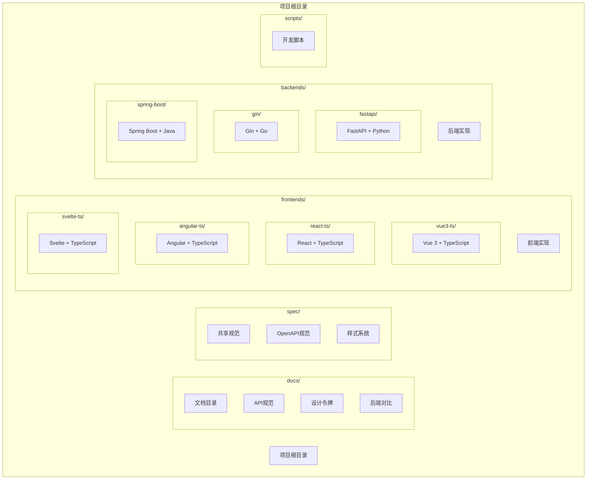
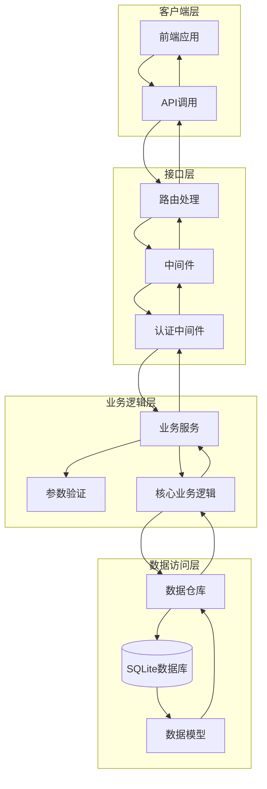
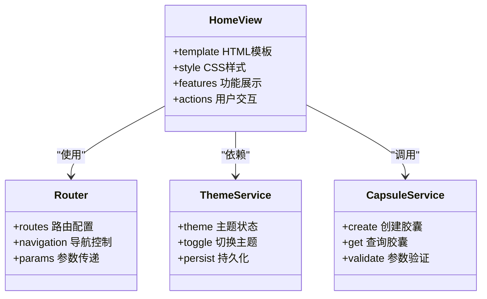
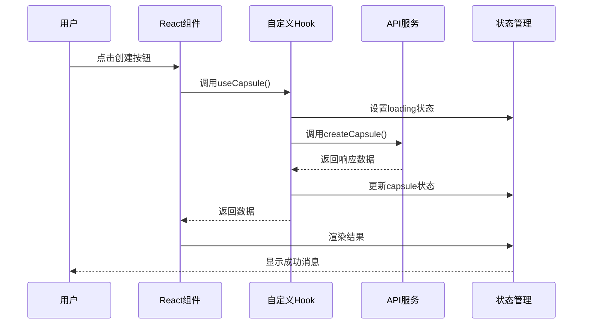
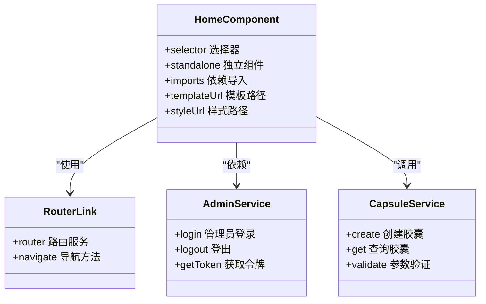
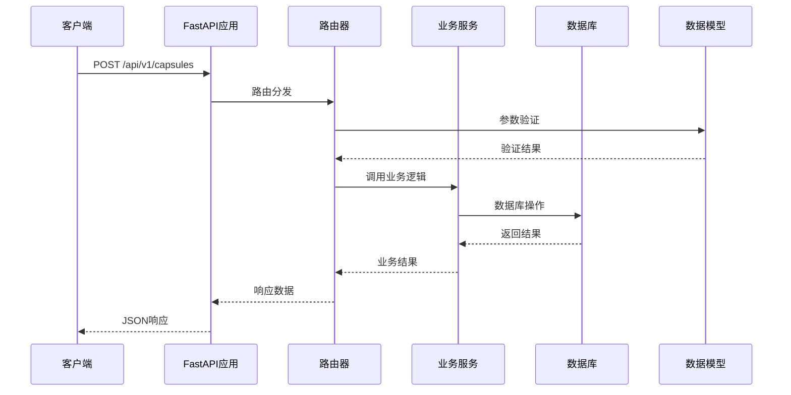
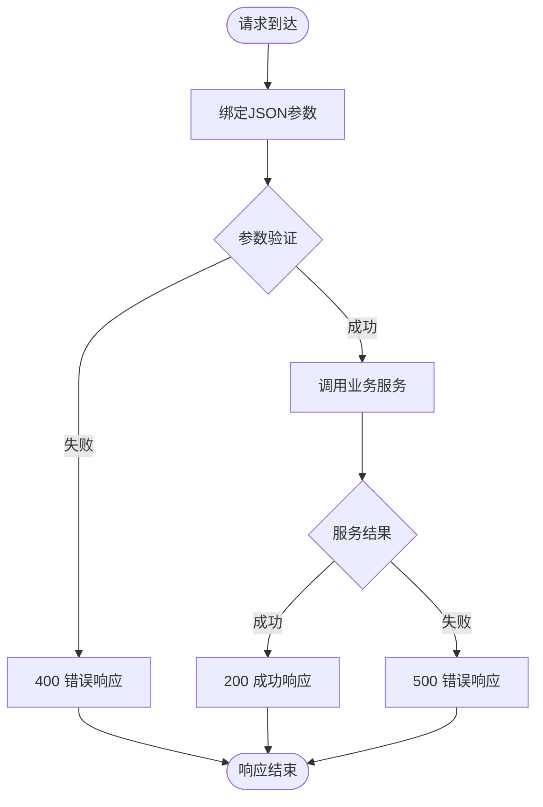
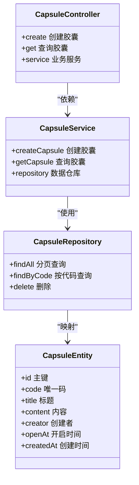

# 新增实现指南

<cite>
**本文档引用的文件**
- [README.md](file://README.md)
- [api-spec.md](file://docs/api-spec.md)
- [design-tokens.md](file://docs/design-tokens.md)
- [openapi.yaml](file://spec/api/openapi.yaml)
- [fastapi README.md](file://backends/fastapi/README.md)
- [gin README.md](file://backends/gin/README.md)
- [spring-boot README.md](file://backends/spring-boot/README.md)
- [main.py](file://backends/fastapi/app/main.py)
- [capsule.py](file://backends/fastapi/app/routers/capsule.py)
- [main.go](file://backends/gin/main.go)
- [capsule.go](file://backends/gin/handler/capsule.go)
- [HelloTimeApplication.java](file://backends/spring-boot/src/main/java/com/hellotime/HelloTimeApplication.java)
- [CapsuleController.java](file://backends/spring-boot/src/main/java/com/hellotime/controller/CapsuleController.java)
- [HomeView.vue](file://frontends/vue3-ts/src/views/HomeView.vue)
- [HomeView.tsx](file://frontends/react-ts/src/views/HomeView.tsx)
- [home.component.ts](file://frontends/angular-ts/src/app/views/home/home.component.ts)
- [useCapsule.ts](file://frontends/react-ts/src/hooks/useCapsule.ts)
</cite>

## 目录
1. [简介](#简介)
2. [项目结构](#项目结构)
3. [核心组件](#核心组件)
4. [架构概览](#架构概览)
5. [详细组件分析](#详细组件分析)
6. [依赖关系分析](#依赖关系分析)
7. [性能考虑](#性能考虑)
8. [故障排除指南](#故障排除指南)
9. [结论](#结论)
10. [附录](#附录)

## 简介

HelloTime是一个时间胶囊应用，通过统一的API规范和可复用的设计系统，展示了多种前后端技术栈的自由组合能力。该项目的核心目标是提供一致的用户体验，同时允许不同的前端框架与后端技术栈进行灵活搭配。

项目采用前后端完全解耦的设计理念，所有实现都遵循统一的OpenAPI 3.0规范和CSS Design Tokens设计系统。这种架构设计使得开发者可以独立开发和测试前端和后端组件，同时确保功能的一致性和兼容性。

## 项目结构

HelloTime项目采用模块化组织结构，清晰地分离了前端实现、后端实现和共享规范：

**图表来源**
- [README.md:37-63](file://README.md#L37-L63)

项目结构的主要特点：

- **模块化设计**：每个前端框架和后端技术栈都是独立的模块
- **共享规范**：所有实现都遵循相同的API规范和设计系统
- **独立运行**：每个实现都可以独立开发和测试
- **统一接口**：通过OpenAPI规范确保接口一致性

**章节来源**
- [README.md:37-63](file://README.md#L37-L63)

## 核心组件

HelloTime项目的核心组件包括统一的API规范、设计令牌系统和标准化的路由结构。这些组件确保了不同技术栈之间的兼容性和一致性。

### 统一API规范

所有后端实现都严格遵循OpenAPI 3.0规范，提供以下核心接口：

| 方法 | 端点 | 说明 | 认证 |
|------|------|------|------|
| `GET` | `/api/v1/health` | 健康检查 | ❌ |
| `POST` | `/api/v1/capsules` | 创建胶囊 | ❌ |
| `GET` | `/api/v1/capsules/{code}` | 查询胶囊 | ❌ |
| `POST` | `/api/v1/admin/login` | 管理员登录 | ❌ |
| `GET` | `/api/v1/admin/capsules` | 分页列表 | ✅ |
| `DELETE` | `/api/v1/admin/capsules/{code}` | 删除胶囊 | ✅ |

### 设计令牌系统

项目使用CSS自定义属性作为设计令牌，确保不同前端实现保持一致的视觉风格：

- **颜色系统**：主色调、背景色、文字色、状态色
- **排版系统**：字体族、字号体系
- **间距系统**：基于4px基准的间距
- **圆角系统**：多种圆角半径
- **暗色模式**：通过`[data-theme="dark"]`选择器实现

### 标准化路由结构

所有前端实现都实现了标准的路由结构：

- `/` - 主页
- `/create` - 创建胶囊页面
- `/open/:code` - 开启胶囊页面
- `/about` - 关于页面
- `/admin` - 管理员页面

**章节来源**
- [README.md:219-232](file://README.md#L219-L232)
- [docs/api-spec.md:16-183](file://docs/api-spec.md#L16-L183)
- [docs/design-tokens.md:1-91](file://docs/design-tokens.md#L1-L91)

## 架构概览

HelloTime项目采用分层架构设计，通过统一的接口层、业务逻辑层和数据访问层实现前后端分离：

**图表来源**
- [main.py:19-34](file://backends/fastapi/app/main.py#L19-L34)
- [capsule.py:14-30](file://backends/fastapi/app/routers/capsule.py#L14-L30)

该架构的关键特点：

- **分层清晰**：每层都有明确的职责分工
- **接口统一**：通过OpenAPI规范确保接口一致性
- **数据隔离**：数据访问层与业务逻辑层分离
- **认证统一**：JWT Bearer Token认证机制

**章节来源**
- [main.py:19-89](file://backends/fastapi/app/main.py#L19-L89)

## 详细组件分析

### 前端实现指南

#### Vue 3 + TypeScript 实现

Vue 3实现展示了现代化前端开发的最佳实践：

**图表来源**
- [HomeView.vue:1-173](file://frontends/vue3-ts/src/views/HomeView.vue#L1-L173)

Vue 3实现的关键特性：

- **Composition API**：使用`setup()`函数和响应式API
- **TypeScript集成**：完整的类型定义支持
- **样式系统**：使用设计令牌和CSS自定义属性
- **组件化**：模块化的组件架构

#### React + TypeScript 实现

React实现展示了函数组件和Hooks的使用：

**图表来源**
- [useCapsule.ts:9-47](file://frontends/react-ts/src/hooks/useCapsule.ts#L9-L47)

React实现的关键特性：

- **Hooks模式**：使用useState、useCallback等Hooks
- **模块化样式**：CSS Modules实现样式隔离
- **类型安全**：完整的TypeScript类型定义
- **状态管理**：集中式的状态管理模式

#### Angular + TypeScript 实现

Angular实现展示了现代前端框架的最佳实践：

**图表来源**
- [home.component.ts:1-12](file://frontends/angular-ts/src/app/views/home/home.component.ts#L1-L12)

Angular实现的关键特性：

- **Standalone Components**：独立组件架构
- **Signals**：响应式编程模型
- **依赖注入**：模块化的依赖管理
- **TypeScript强类型**：完整的类型安全保障

### 后端实现指南

#### FastAPI + Python 实现

FastAPI实现展示了异步API开发的最佳实践：

**图表来源**
- [capsule.py:17-30](file://backends/fastapi/app/routers/capsule.py#L17-L30)

FastAPI实现的关键特性：

- **异步支持**：基于async/await的异步编程
- **自动文档**：自动生成OpenAPI文档
- **数据验证**：Pydantic模型实现参数验证
- **依赖注入**：模块化的依赖管理

#### Gin + Go 实现

Gin实现展示了Go语言Web开发的优势：

**图表来源**
- [capsule.go:19-55](file://backends/gin/handler/capsule.go#L19-L55)

Gin实现的关键特性：

- **高性能**：基于HTTP/2和GOMAXPROCS优化
- **中间件支持**：灵活的中间件架构
- **结构清晰**：Handler-Service-Model分层架构
- **测试友好**：内置测试支持

#### Spring Boot + Java 实现

Spring Boot实现展示了企业级应用开发的最佳实践：

**图表来源**
- [CapsuleController.java:17-56](file://backends/spring-boot/src/main/java/com/hellotime/controller/CapsuleController.java#L17-L56)

Spring Boot实现的关键特性：

- **注解驱动**：基于注解的配置管理
- **依赖注入**：Spring容器管理依赖关系
- **数据访问**：Spring Data JPA简化数据操作
- **安全集成**：Spring Security提供认证授权

**章节来源**
- [HomeView.vue:1-173](file://frontends/vue3-ts/src/views/HomeView.vue#L1-L173)
- [HomeView.tsx:1-60](file://frontends/react-ts/src/views/HomeView.tsx#L1-L60)
- [home.component.ts:1-12](file://frontends/angular-ts/src/app/views/home/home.component.ts#L1-L12)
- [useCapsule.ts:1-48](file://frontends/react-ts/src/hooks/useCapsule.ts#L1-L48)
- [capsule.py:1-31](file://backends/fastapi/app/routers/capsule.py#L1-L31)
- [capsule.go:1-56](file://backends/gin/handler/capsule.go#L1-L56)
- [CapsuleController.java:1-57](file://backends/spring-boot/src/main/java/com/hellotime/controller/CapsuleController.java#L1-L57)

## 依赖关系分析

HelloTime项目的依赖关系体现了清晰的分层架构和模块化设计：

```mermaid
graph TB
subgraph "前端依赖"
Vue3[Vue 3]
React[React]
Angular[Angular]
Svelte[Svelte]
Vue3 --> VueRouter[Vue Router]
Vue3 --> CompositionAPI[Composition API]
React --> ReactRouter[React Router]
React --> Hooks[React Hooks]
Angular --> Router[Angular Router]
Angular --> Signals[Signals]
Svelte --> SvelteRouter[Svelte Router]
end
subgraph "后端依赖"
FastAPI[FastAPI]
Gin[Gin]
SpringBoot[Spring Boot]
FastAPI --> SQLAlchemy[SQLAlchemy]
FastAPI --> Pydantic[Pydantic]
Gin --> GORM[GORM]
Gin --> JWT[golang-jwt]
SpringBoot --> JPA[Spring Data JPA]
SpringBoot --> JWT[Spring Security JWT]
end
subgraph "共享依赖"
OpenAPI[OpenAPI规范]
DesignTokens[设计令牌]
SQLite[SQLite数据库]
end
Vue3 --- OpenAPI
React --- OpenAPI
Angular --- OpenAPI
Svelte --- OpenAPI
FastAPI --- DesignTokens
Gin --- DesignTokens
SpringBoot --- DesignTokens
FastAPI --- SQLite
Gin --- SQLite
SpringBoot --- SQLite
```

**图表来源**
- [README.md:16-31](file://README.md#L16-L31)
- [openapi.yaml:1-349](file://spec/api/openapi.yaml#L1-L349)

依赖关系的关键特点：

- **统一规范**：所有实现都依赖OpenAPI规范
- **设计一致性**：共享设计令牌系统
- **数据一致性**：统一的SQLite数据库结构
- **技术无关**：前端框架与后端技术栈完全解耦

**章节来源**
- [README.md:16-31](file://README.md#L16-L31)
- [openapi.yaml:1-349](file://spec/api/openapi.yaml#L1-L349)

## 性能考虑

HelloTime项目在设计时充分考虑了性能优化，采用了多种技术和最佳实践：

### 前端性能优化

**Vue 3实现的性能特性**：
- **Tree Shaking**：按需加载组件和功能
- **懒加载**：路由级别的代码分割
- **响应式优化**：细粒度的响应式更新
- **虚拟DOM**：高效的DOM操作

**React实现的性能特性**：
- **Memoization**：useMemo和useCallback优化
- **Suspense**：异步组件加载
- **Concurrent Rendering**：并发渲染支持
- **Profiler**：性能分析工具

**Angular实现的性能特性**：
- **OnPush变更检测**：优化的变更检测策略
- **Zone.js优化**：减少不必要的变更检测
- **ivy编译器**：编译时优化
- **Service Workers**：离线缓存支持

### 后端性能优化

**FastAPI性能特性**：
- **异步I/O**：非阻塞的数据库操作
- **自动优化**：Pydantic模型的快速验证
- **Uvicorn**：高性能ASGI服务器
- **连接池**：数据库连接池管理

**Gin性能特性**：
- **零分配**：最小化的内存分配
- **路由优化**：高效的路由匹配算法
- **中间件链**：可配置的中间件执行顺序
- **GOMAXPROCS**：充分利用多核CPU

**Spring Boot性能特性**：
- **Spring Caching**：缓存层优化
- **Connection Pool**：数据库连接池配置
- **Actuator**：生产就绪的监控指标
- **AOT编译**：Ahead-of-Time编译优化

## 故障排除指南

### 常见问题及解决方案

**API调用失败**：
1. 检查API端点是否正确
2. 验证请求参数格式
3. 确认认证令牌有效性
4. 查看网络连接状态

**数据库连接问题**：
1. 检查数据库文件权限
2. 验证连接字符串格式
3. 确认SQLite版本兼容性
4. 查看数据库锁定状态

**跨域请求问题**：
1. 检查CORS配置
2. 验证源地址白名单
3. 确认预检请求处理
4. 查看浏览器开发者工具

**认证失败问题**：
1. 检查JWT令牌格式
2. 验证签名密钥配置
3. 确认令牌过期时间
4. 查看认证中间件日志

### 调试技巧

**前端调试**：
- 使用浏览器开发者工具检查网络请求
- 利用Vue DevTools或React Developer Tools
- 实施详细的日志记录
- 使用断点调试异步操作

**后端调试**：
- 启用详细日志记录
- 使用Postman或curl测试API
- 实施单元测试和集成测试
- 利用调试器逐步执行代码

**章节来源**
- [README.md:248-264](file://README.md#L248-L264)

## 结论

HelloTime项目通过统一的API规范、设计令牌系统和标准化的架构设计，成功实现了前后端技术栈的自由组合。这种设计理念不仅提高了开发效率，还确保了不同实现之间的一致性和兼容性。

项目的核心优势包括：

- **技术无关性**：前端框架与后端技术栈完全解耦
- **标准化程度高**：统一的API规范和设计系统
- **可扩展性强**：模块化架构支持新功能添加
- **维护成本低**：清晰的代码结构和文档

对于新实现的添加，建议遵循以下原则：

1. **严格遵守规范**：确保API接口和数据格式符合OpenAPI规范
2. **保持设计一致性**：使用共享的设计令牌系统
3. **关注性能优化**：采用最佳实践提升应用性能
4. **完善测试覆盖**：实施全面的单元测试和集成测试
5. **文档完整性**：提供详细的实现文档和使用说明

通过遵循这些指导原则，开发者可以快速而可靠地为HelloTime项目添加新的前端或后端实现，同时保持整个生态系统的稳定性和一致性。

## 附录

### 最佳实践清单

**前端实现最佳实践**：
- 使用TypeScript确保类型安全
- 实施响应式设计适配移动端
- 采用模块化组件架构
- 实现完善的错误处理机制
- 提供友好的用户反馈

**后端实现最佳实践**：
- 遵循RESTful API设计原则
- 实施统一的错误处理和响应格式
- 使用数据库连接池优化性能
- 实现完整的认证和授权机制
- 提供详细的API文档

**开发工具推荐**：
- **前端**：Vite、ESLint、Prettier、TypeScript
- **后端**：IDEA、Postman、Docker、Git
- **测试**：Jest、PyTest、JUnit、Cypress