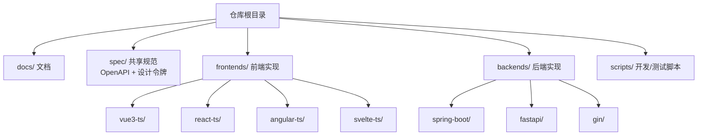
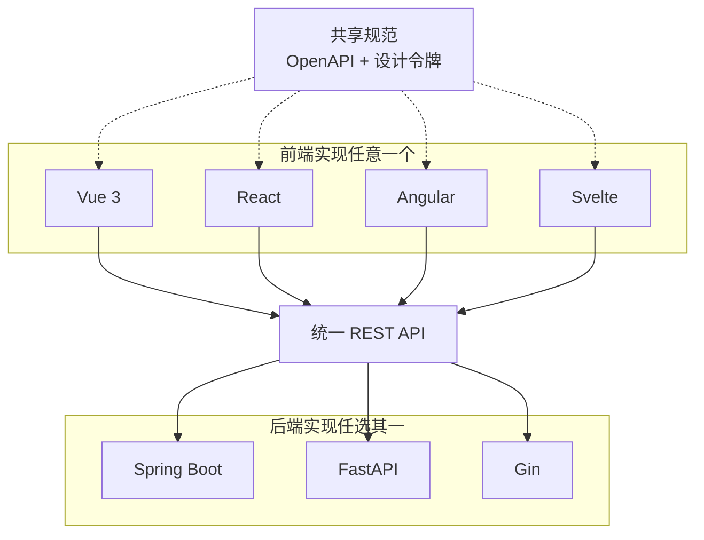
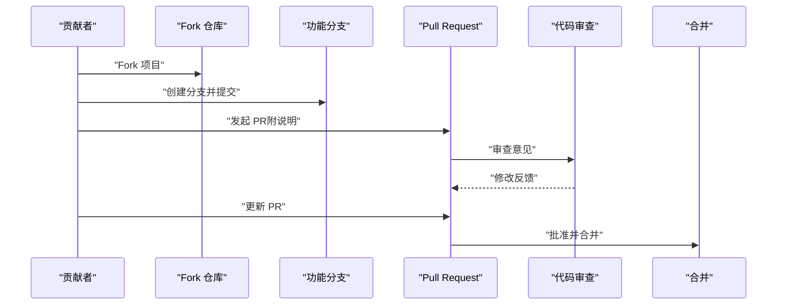
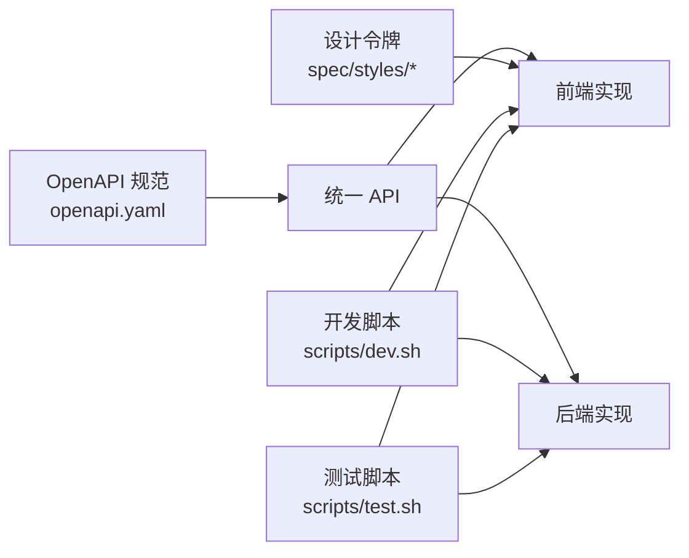

# 社区贡献

<cite>
**本文引用的文件**   
- [README.md](file://README.md)
- [CLAUDE.md](file://CLAUDE.md)
- [docs/api-spec.md](file://docs/api-spec.md)
- [spec/api/openapi.yaml](file://spec/api/openapi.yaml)
- [scripts/dev.sh](file://scripts/dev.sh)
- [scripts/test.sh](file://scripts/test.sh)
- [backends/spring-boot/README.md](file://backends/spring-boot/README.md)
- [backends/fastapi/README.md](file://backends/fastapi/README.md)
- [frontends/vue3-ts/README.md](file://frontends/vue3-ts/README.md)
- [docs/backend-comparison.md](file://docs/backend-comparison.md)
</cite>

## 目录
1. [简介](#简介)
2. [项目结构](#项目结构)
3. [核心贡献方式](#核心贡献方式)
4. [架构总览](#架构总览)
5. [详细贡献指南](#详细贡献指南)
6. [依赖关系分析](#依赖关系分析)
7. [性能与质量保障](#性能与质量保障)
8. [故障排查与支持](#故障排查与支持)
9. [结论](#结论)
10. [附录](#附录)

## 简介
HelloTime 是一个“时间胶囊”应用，通过统一的 API 规范与设计系统，展示多种前后端技术栈的自由组合能力。项目采用多后端（Spring Boot、FastAPI、Gin）与多前端（Vue 3、React、Angular、Svelte）实现，确保各实现的功能与体验一致，便于学习与对比。

本社区贡献指南面向新老贡献者，提供从问题报告、功能建议、代码贡献到文档改进的全流程指引；同时给出 GitHub 工作流、行为准则、沟通规范与协作方式，帮助你在友好、高效、透明的开源社区中参与共建。

## 项目结构
项目采用 monorepo 结构，核心目录与职责如下：
- docs/：项目文档（API 规范、数据库设计、部署指南、设计令牌等）
- spec/：共享规范（OpenAPI 3.0、设计令牌与样式）
- frontends/：前端实现（Vue 3、React、Angular、Svelte）
- backends/：后端实现（Spring Boot、FastAPI、Gin）
- scripts/：开发/构建/测试脚本（一键启动、测试聚合）

图表来源
- [README.md:37-63](file://README.md#L37-L63)

章节来源
- [README.md:37-63](file://README.md#L37-L63)

## 核心贡献方式
你可以通过以下方式参与 HelloTime 的建设：
- 报告 Bug：使用统一的 Issue 模板，提供环境信息、复现步骤与期望/实际结果
- 提出功能建议：描述背景、目标、影响范围与验收条件
- 代码贡献：修复缺陷或新增功能，遵循统一 API 与设计规范
- 文档改进：完善 API 文档、架构说明、部署指南与设计令牌
- 测试与质量：补充单元测试、集成测试，提升覆盖率与稳定性

## 架构总览
HelloTime 采用“前后端完全解耦”的架构：前端通过统一的 REST API 与任一后端交互；后端实现遵循同一份 OpenAPI 规范与统一响应格式；共享样式通过 CSS Design Tokens 保证视觉一致性。

图表来源
- [README.md:16-35](file://README.md#L16-L35)
- [spec/api/openapi.yaml:1-20](file://spec/api/openapi.yaml#L1-L20)
- [docs/api-spec.md:1-15](file://docs/api-spec.md#L1-L15)

章节来源
- [README.md:16-35](file://README.md#L16-L35)
- [docs/api-spec.md:1-15](file://docs/api-spec.md#L1-L15)
- [spec/api/openapi.yaml:1-20](file://spec/api/openapi.yaml#L1-L20)

## 详细贡献指南

### GitHub 工作流（Fork → 分支 → PR → 审查 → 合并）
- Fork 仓库至个人账号
- 创建功能/修复/文档分支（建议使用清晰的前缀，如 feat/fix/docs/）
- 提交变更并推送至远程分支
- 在 GitHub 上发起 Pull Request，填写模板化信息（背景、动机、变更摘要、测试与风险评估）
- 根据 Review 意见迭代修改，直至获得批准
- Maintainer 合并 PR 并关闭关联 Issue

（该图为概念流程示意，不直接映射具体源码文件）

### 新贡献者入门
- 快速开始：参考根 README 的“快速开始”，选择一套前后端组合运行起来
- 项目结构：浏览 README 的“项目结构”与 CLAUDE.md 的“Monorepo 结构”
- 统一规范：阅读 API 规范与设计令牌，确保实现一致
- 开发脚本：使用 scripts/dev.sh 一键启动后端与多个前端，或按需单独启动
- 测试：使用 scripts/test.sh 运行全量测试，或进入各子项目运行对应测试命令

章节来源
- [README.md:65-150](file://README.md#L65-L150)
- [CLAUDE.md:64-78](file://CLAUDE.md#L64-L78)
- [scripts/dev.sh:1-52](file://scripts/dev.sh#L1-L52)
- [scripts/test.sh:1-34](file://scripts/test.sh#L1-L34)

### 问题报告（Bug Report）
- 使用 Issue 模板（如存在），或参考模板字段：
  - 环境信息：操作系统、浏览器/Node/Java 版本、后端语言与版本
  - 复现步骤：最小可复现步骤
  - 期望结果与实际结果
  - 日志/截图（必要时）
  - 影响范围（是否涉及 API、UI、性能、兼容性）
- 若涉及 API，附上请求/响应片段与 OpenAPI 路径
- 若涉及 UI，附上设计令牌使用情况与主题状态

章节来源
- [docs/api-spec.md:186-195](file://docs/api-spec.md#L186-L195)
- [spec/api/openapi.yaml:10-164](file://spec/api/openapi.yaml#L10-L164)

### 功能建议（Feature Request）
- 描述背景与动机（为什么需要此功能）
- 明确影响范围（是否影响 API、UI、性能、兼容性）
- 说明验收条件（如何判定功能完成）
- 如涉及 API，建议先在 spec/api/openapi.yaml 中补充或讨论
- 如涉及 UI，建议参考设计令牌与现有组件，避免过度偏离统一风格

章节来源
- [docs/api-spec.md:16-31](file://docs/api-spec.md#L16-L31)
- [spec/api/openapi.yaml:165-349](file://spec/api/openapi.yaml#L165-L349)

### 代码贡献（含后端与前端）
- 后端贡献
  - 遵循统一 API 规范与响应格式
  - 使用 SQLite，遵循统一表结构与时区约定
  - 保持 JWT 认证与错误码一致
  - 补充单元/集成测试，确保覆盖率与稳定性
  - 参考各后端 README 的结构与测试命令
- 前端贡献
  - 使用统一 API 客户端与类型定义
  - 遵循共享设计令牌与路由约定
  - 保持主题切换与本地存储一致性
  - 补充组件/页面测试，确保交互正确
  - 参考各前端 README 的结构与测试命令

章节来源
- [docs/api-spec.md:5-14](file://docs/api-spec.md#L5-L14)
- [docs/api-spec.md:186-195](file://docs/api-spec.md#L186-L195)
- [spec/api/openapi.yaml:10-164](file://spec/api/openapi.yaml#L10-L164)
- [backends/spring-boot/README.md:13-20](file://backends/spring-boot/README.md#L13-L20)
- [backends/fastapi/README.md:13-20](file://backends/fastapi/README.md#L13-L20)
- [frontends/vue3-ts/README.md:13-21](file://frontends/vue3-ts/README.md#L13-L21)

### 文档改进
- API 文档：基于 openapi.yaml 更新 docs/api-spec.md
- 架构/部署：完善 docs/backend-comparison.md 等对比与部署指南
- 设计令牌：更新 spec/styles/ 下的 CSS 与 tokens
- README：补充或修正使用说明、环境变量与测试命令

章节来源
- [docs/api-spec.md:1-195](file://docs/api-spec.md#L1-L195)
- [docs/backend-comparison.md:1-80](file://docs/backend-comparison.md#L1-L80)
- [spec/api/openapi.yaml:1-349](file://spec/api/openapi.yaml#L1-L349)

### 行为准则与沟通规范
- 尊重与包容：欢迎不同背景的贡献者，保持友善与专业
- 透明沟通：优先在 Issue/PR 中公开讨论，必要时私下沟通敏感问题
- 积极审查：及时提供高质量的 Review 意见，聚焦代码与规范一致性
- 小步快跑：尽量拆分小的 PR，减少上下文切换与冲突
- 代码即文档：注释与命名要清晰，减少审查成本

（本节为通用社区规范说明，不直接分析具体源码文件）

### 协作方式与评审流程
- 评审时机：PR 创建后，至少一名 Maintainer 进行审查
- 评审关注点：规范一致性、测试覆盖、性能与安全性、可维护性
- 修改与跟进：根据 Review 意见及时更新，避免长时间无人响应
- 合并策略：通过 CI 与审查后由 Maintainer 合并

（本节为通用协作流程说明，不直接分析具体源码文件）

## 依赖关系分析
- 统一 API 与响应格式：所有实现严格遵循 spec/api/openapi.yaml 与 docs/api-spec.md 的统一格式
- 共享样式：前端通过 spec/styles/ 使用设计令牌，确保视觉一致性
- 测试与脚本：scripts/dev.sh 与 scripts/test.sh 提供一键式开发与测试体验

图表来源
- [spec/api/openapi.yaml:1-349](file://spec/api/openapi.yaml#L1-L349)
- [docs/api-spec.md:1-195](file://docs/api-spec.md#L1-L195)
- [scripts/dev.sh:1-52](file://scripts/dev.sh#L1-L52)
- [scripts/test.sh:1-34](file://scripts/test.sh#L1-L34)

章节来源
- [spec/api/openapi.yaml:1-349](file://spec/api/openapi.yaml#L1-L349)
- [docs/api-spec.md:1-195](file://docs/api-spec.md#L1-L195)
- [scripts/dev.sh:1-52](file://scripts/dev.sh#L1-L52)
- [scripts/test.sh:1-34](file://scripts/test.sh#L1-L34)

## 性能与质量保障
- 测试策略
  - 后端：Spring Boot 使用 Maven 测试；FastAPI 使用 pytest；Gin 使用 go test
  - 前端：Vue/React/Angular/Svelte 均有单元测试与类型检查
  - 聚合测试：scripts/test.sh 一键运行全量测试
- 性能与并发
  - 不同后端实现具备不同的并发模型与性能特征，详见 docs/backend-comparison.md
- 开发体验
  - scripts/dev.sh 支持一键启动后端与多前端，提升联调效率

章节来源
- [backends/spring-boot/README.md:89-98](file://backends/spring-boot/README.md#L89-L98)
- [backends/fastapi/README.md:118-130](file://backends/fastapi/README.md#L118-L130)
- [frontends/vue3-ts/README.md:107-115](file://frontends/vue3-ts/README.md#L107-L115)
- [scripts/test.sh:1-34](file://scripts/test.sh#L1-L34)
- [docs/backend-comparison.md:1-80](file://docs/backend-comparison.md#L1-L80)

## 故障排查与支持
- 环境与依赖
  - 前端：确认 Node.js 版本与包管理器，设置 VITE_API_BASE_URL 指向后端
  - 后端：Spring Boot 需要 Java/Maven；FastAPI 需要 Python 与虚拟环境；Gin 需要 Go
- API 一致性
  - 若出现响应不一致，核对是否遵循统一的 API 规范与响应格式
- 调试建议
  - 使用 scripts/dev.sh 同时启动后端与前端，观察联调日志
  - 查看各实现 README 的“快速开始”与“命令”部分
- 文档与规范
  - 参考 docs/api-spec.md 与 spec/api/openapi.yaml 核对接口定义

章节来源
- [frontends/vue3-ts/README.md:24-50](file://frontends/vue3-ts/README.md#L24-L50)
- [backends/spring-boot/README.md:23-52](file://backends/spring-boot/README.md#L23-L52)
- [backends/fastapi/README.md:23-75](file://backends/fastapi/README.md#L23-L75)
- [docs/api-spec.md:1-195](file://docs/api-spec.md#L1-L195)
- [spec/api/openapi.yaml:1-349](file://spec/api/openapi.yaml#L1-L349)
- [scripts/dev.sh:1-52](file://scripts/dev.sh#L1-L52)

## 结论
HelloTime 通过统一的 API 与设计规范，实现了多技术栈的自由组合与一致性体验。我们鼓励各类贡献：从问题报告到功能建议，从代码修复到文档完善。请遵循本文的工作流与规范，共同维护一个开放、高效、友好的开源社区。

## 附录

### 常用命令速查
- 启动开发环境：./scripts/dev.sh
- 运行全量测试：./scripts/test.sh
- 后端/前端各自测试命令可参考各实现 README

章节来源
- [scripts/dev.sh:1-52](file://scripts/dev.sh#L1-L52)
- [scripts/test.sh:1-34](file://scripts/test.sh#L1-L34)
- [backends/spring-boot/README.md:89-98](file://backends/spring-boot/README.md#L89-L98)
- [backends/fastapi/README.md:118-130](file://backends/fastapi/README.md#L118-L130)
- [frontends/vue3-ts/README.md:107-115](file://frontends/vue3-ts/README.md#L107-L115)