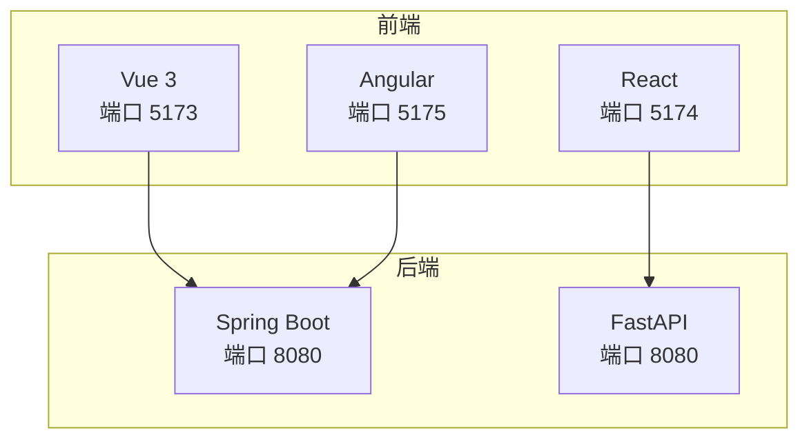
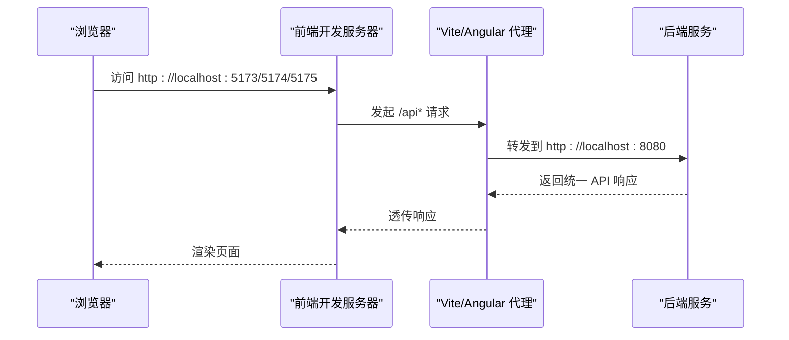
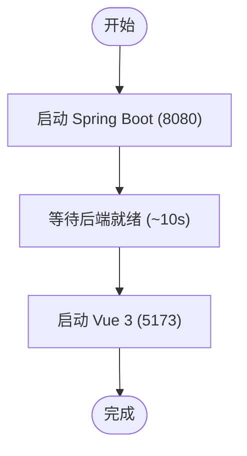
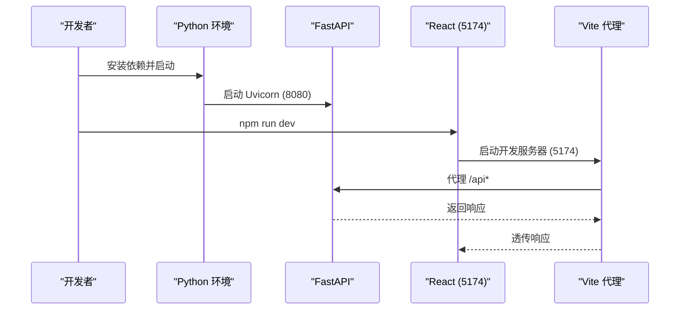
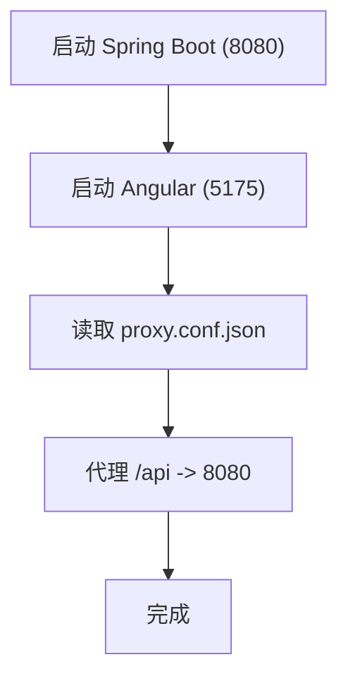
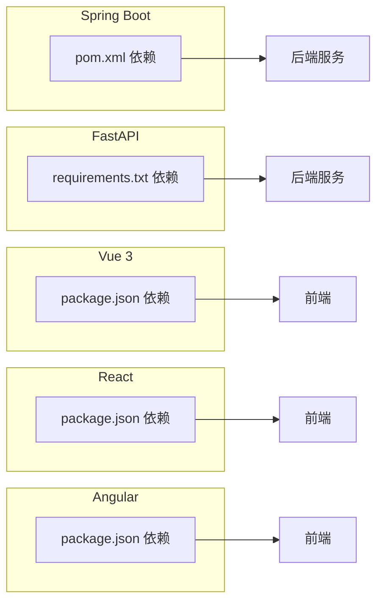

# 快速开始

<cite>
**本文引用的文件**
- [README.md](file://README.md)
- [backends/spring-boot/README.md](file://backends/spring-boot/README.md)
- [backends/fastapi/README.md](file://backends/fastapi/README.md)
- [frontends/vue3-ts/README.md](file://frontends/vue3-ts/README.md)
- [frontends/react-ts/README.md](file://frontends/react-ts/README.md)
- [frontends/angular-ts/README.md](file://frontends/angular-ts/README.md)
- [scripts/dev.sh](file://scripts/dev.sh)
- [scripts/build.sh](file://scripts/build.sh)
- [scripts/test.sh](file://scripts/test.sh)
- [backends/spring-boot/pom.xml](file://backends/spring-boot/pom.xml)
- [backends/fastapi/requirements.txt](file://backends/fastapi/requirements.txt)
- [frontends/vue3-ts/package.json](file://frontends/vue3-ts/package.json)
- [frontends/react-ts/package.json](file://frontends/react-ts/package.json)
- [frontends/angular-ts/package.json](file://frontends/angular-ts/package.json)
- [frontends/angular-ts/proxy.conf.json](file://frontends/angular-ts/proxy.conf.json)
- [frontends/vue3-ts/vite.config.ts](file://frontends/vue3-ts/vite.config.ts)
- [frontends/react-ts/vite.config.ts](file://frontends/react-ts/vite.config.ts)
- [backends/spring-boot/src/main/resources/application.yml](file://backends/spring-boot/src/main/resources/application.yml)
</cite>

## 目录
1. [简介](#简介)
2. [项目结构](#项目结构)
3. [核心组件](#核心组件)
4. [架构总览](#架构总览)
5. [详细组件分析](#详细组件分析)
6. [依赖分析](#依赖分析)
7. [性能考虑](#性能考虑)
8. [故障排查指南](#故障排查指南)
9. [结论](#结论)
10. [附录](#附录)

## 简介
HelloTime 是一个“类似 RealWorld”的技术展示应用，通过统一的 API 规范与可复用的前端样式，演示多种前后端技术栈组合。项目提供三套开发方案：
- Spring Boot + Vue 3
- FastAPI + React
- Spring Boot + Angular

同时提供统一的启动脚本，便于一次性启动后端与多个前端实例，并内置测试与构建脚本。

## 项目结构
项目采用多模块结构，前后端分离且可自由组合：
- docs/：项目文档
- spec/：共享规范（API 与样式）
- frontends/：前端实现（Vue 3、React、Angular）
- backends/：后端实现（Spring Boot、FastAPI）
- scripts/：开发/构建/测试脚本

图表来源
- [README.md:36-111](file://README.md#L36-L111)
- [frontends/vue3-ts/vite.config.ts:13-22](file://frontends/vue3-ts/vite.config.ts#L13-L22)
- [frontends/react-ts/vite.config.ts:13-22](file://frontends/react-ts/vite.config.ts#L13-L22)
- [frontends/angular-ts/package.json:6](file://frontends/angular-ts/package.json#L6)
- [backends/spring-boot/src/main/resources/application.yml:13-14](file://backends/spring-boot/src/main/resources/application.yml#L13-L14)

章节来源
- [README.md:18-34](file://README.md#L18-L34)

## 核心组件
- 后端（Spring Boot）
  - Java 17+，Maven，SQLite，JPA，JWT
  - 端口：8080
- 后端（FastAPI）
  - Python 3.12+，Uvicorn，SQLAlchemy，PyJWT
  - 端口：8080
- 前端（Vue 3）
  - Vite，Vue 3 + TypeScript，路由 5173
- 前端（React）
  - Vite，React + TypeScript，路由 5174
- 前端（Angular）
  - Angular 18，Standalone Components，路由 5175

章节来源
- [README.md:5-16](file://README.md#L5-L16)
- [backends/spring-boot/README.md:23-38](file://backends/spring-boot/README.md#L23-L38)
- [backends/fastapi/README.md:23-51](file://backends/fastapi/README.md#L23-L51)
- [frontends/vue3-ts/README.md:24-41](file://frontends/vue3-ts/README.md#L24-L41)
- [frontends/react-ts/README.md:24-41](file://frontends/react-ts/README.md#L24-L41)
- [frontends/angular-ts/README.md:5-20](file://frontends/angular-ts/README.md#L5-L20)

## 架构总览
统一 API 规范与共享样式，前后端通过 /api 前缀通信；Vue/React 使用 Vite 代理到后端 8080；Angular 使用本地代理配置。

图表来源
- [frontends/vue3-ts/vite.config.ts:15-20](file://frontends/vue3-ts/vite.config.ts#L15-L20)
- [frontends/react-ts/vite.config.ts:15-20](file://frontends/react-ts/vite.config.ts#L15-L20)
- [frontends/angular-ts/proxy.conf.json:2-6](file://frontends/angular-ts/proxy.conf.json#L2-L6)
- [backends/spring-boot/src/main/resources/application.yml:13-14](file://backends/spring-boot/src/main/resources/application.yml#L13-L14)

## 详细组件分析

### 方案一：Spring Boot + Vue 3
- 后端
  - 使用 Maven Wrapper 启动，端口 8080
  - 环境变量：ADMIN_PASSWORD、JWT_SECRET
- 前端
  - Vite 开发服务器，端口 5173
  - 通过 Vite 代理转发 /api 到后端 8080
- 统一启动
  - 脚本会先启动后端，等待约 10 秒，再启动 Vue 3 与 Angular

图表来源
- [scripts/dev.sh:11-25](file://scripts/dev.sh#L11-L25)
- [backends/spring-boot/README.md:30-36](file://backends/spring-boot/README.md#L30-L36)
- [frontends/vue3-ts/README.md:35-41](file://frontends/vue3-ts/README.md#L35-L41)

章节来源
- [README.md:38-57](file://README.md#L38-L57)
- [backends/spring-boot/README.md:23-52](file://backends/spring-boot/README.md#L23-L52)
- [frontends/vue3-ts/README.md:22-49](file://frontends/vue3-ts/README.md#L22-L49)
- [scripts/dev.sh:11-37](file://scripts/dev.sh#L11-L37)

### 方案二：FastAPI + React
- 后端
  - Python 3.12+，安装 requirements.txt，Uvicorn 启动 8080
  - 环境变量：DATABASE_URL、ADMIN_PASSWORD、JWT_SECRET、JWT_EXPIRATION_HOURS
- 前端
  - Vite 开发服务器，端口 5174
  - 通过 Vite 代理转发 /api 到后端 8080

图表来源
- [backends/fastapi/README.md:28-49](file://backends/fastapi/README.md#L28-L49)
- [frontends/react-ts/vite.config.ts:13-22](file://frontends/react-ts/vite.config.ts#L13-L22)
- [frontends/react-ts/README.md:22-49](file://frontends/react-ts/README.md#L22-L49)

章节来源
- [README.md:59-79](file://README.md#L59-L79)
- [backends/fastapi/README.md:23-74](file://backends/fastapi/README.md#L23-L74)
- [frontends/react-ts/README.md:22-49](file://frontends/react-ts/README.md#L22-L49)

### 方案三：Spring Boot + Angular
- 后端
  - Spring Boot，端口 8080
- 前端
  - Angular CLI 开发服务器，端口 5175
  - 通过 proxy.conf.json 将 /api 转发到后端 8080

图表来源
- [frontends/angular-ts/package.json:6](file://frontends/angular-ts/package.json#L6)
- [frontends/angular-ts/proxy.conf.json:2-6](file://frontends/angular-ts/proxy.conf.json#L2-L6)
- [backends/spring-boot/src/main/resources/application.yml:13-14](file://backends/spring-boot/src/main/resources/application.yml#L13-L14)

章节来源
- [README.md:85-104](file://README.md#L85-L104)
- [frontends/angular-ts/README.md:5-20](file://frontends/angular-ts/README.md#L5-L20)
- [frontends/angular-ts/proxy.conf.json:1-8](file://frontends/angular-ts/proxy.conf.json#L1-L8)

### 统一启动脚本
- scripts/dev.sh
  - 同时启动后端（Spring Boot）、Vue 3、Angular
  - 默认端口：后端 8080，Vue 5173，Angular 5175
  - Ctrl+C 停止所有进程

章节来源
- [scripts/dev.sh:1-45](file://scripts/dev.sh#L1-L45)
- [README.md:106-111](file://README.md#L106-L111)

### 单独启动命令
- Spring Boot
  - 使用 Maven Wrapper：./mvnw spring-boot:run
  - 端口：8080
- FastAPI
  - 安装依赖：pip install -r requirements.txt
  - 启动：uvicorn app.main:app --port 8080
  - 端口：8080
- Vue 3
  - 安装依赖：npm install
  - 启动：npm run dev
  - 端口：5173
- React
  - 安装依赖：npm install
  - 启动：npm run dev
  - 端口：5174
- Angular
  - 安装依赖：npm install
  - 启动：npm run dev
  - 端口：5175

章节来源
- [README.md:40-57](file://README.md#L40-L57)
- [README.md:61-79](file://README.md#L61-L79)
- [README.md:87-104](file://README.md#L87-L104)
- [backends/spring-boot/README.md:30-36](file://backends/spring-boot/README.md#L30-L36)
- [backends/fastapi/README.md:30-49](file://backends/fastapi/README.md#L30-L49)
- [frontends/vue3-ts/README.md:31-41](file://frontends/vue3-ts/README.md#L31-L41)
- [frontends/react-ts/README.md:31-41](file://frontends/react-ts/README.md#L31-L41)
- [frontends/angular-ts/README.md:7-20](file://frontends/angular-ts/README.md#L7-L20)

## 依赖分析
- 后端依赖
  - Spring Boot：Web、JPA、Validation、SQLite、JWT
  - FastAPI：FastAPI、Uvicorn、SQLAlchemy、PyJWT、HTTPX、pytest
- 前端依赖
  - Vue 3：Vue、Vue Router、Vite、TypeScript、Vitest
  - React：React、React Router、Vite、TypeScript、Vitest
  - Angular：Angular 18、Angular CLI、Karma/Jasmine

图表来源
- [backends/spring-boot/pom.xml:25-79](file://backends/spring-boot/pom.xml#L25-L79)
- [backends/fastapi/requirements.txt:1-7](file://backends/fastapi/requirements.txt#L1-L7)
- [frontends/vue3-ts/package.json:13-28](file://frontends/vue3-ts/package.json#L13-L28)
- [frontends/react-ts/package.json:13-29](file://frontends/react-ts/package.json#L13-L29)
- [frontends/angular-ts/package.json:11-36](file://frontends/angular-ts/package.json#L11-L36)

章节来源
- [backends/spring-boot/pom.xml:1-91](file://backends/spring-boot/pom.xml#L1-L91)
- [backends/fastapi/requirements.txt:1-7](file://backends/fastapi/requirements.txt#L1-L7)
- [frontends/vue3-ts/package.json:1-30](file://frontends/vue3-ts/package.json#L1-L30)
- [frontends/react-ts/package.json:1-31](file://frontends/react-ts/package.json#L1-L31)
- [frontends/angular-ts/package.json:1-38](file://frontends/angular-ts/package.json#L1-L38)

## 性能考虑
- 使用 Vite 的快速冷启动与热更新，提升前端开发体验
- 后端使用 SQLite，适合开发与演示场景；生产建议评估数据库扩展性
- 代理仅在开发阶段生效，避免生产环境额外网络开销

## 故障排查指南
- 端口冲突
  - Vue：若 5173 被占用，可在 Vite 配置中调整端口
  - React：若 5174 被占用，可在 Vite 配置中调整端口
  - Angular：若 5175 被占用，可在脚本中修改端口参数
- 代理无效
  - Vue/React：确认 Vite 代理配置中的 /api 目标地址为 8080
  - Angular：确认 proxy.conf.json 的 target 为 8080
- 后端未启动
  - Spring Boot：确认 Java 版本满足要求（17+），使用 Maven Wrapper 启动
  - FastAPI：确认 Python 版本满足要求（3.12+），requirements.txt 已安装
- 环境变量
  - Spring Boot：可通过环境变量 ADMIN_PASSWORD、JWT_SECRET 覆盖默认值
  - FastAPI：可通过 DATABASE_URL、ADMIN_PASSWORD、JWT_SECRET、JWT_EXPIRATION_HOURS 覆盖默认值
- 统一启动脚本
  - 若后端启动较慢导致前端无法连接，可适当延长等待时间

章节来源
- [frontends/vue3-ts/vite.config.ts:13-22](file://frontends/vue3-ts/vite.config.ts#L13-L22)
- [frontends/react-ts/vite.config.ts:13-22](file://frontends/react-ts/vite.config.ts#L13-L22)
- [frontends/angular-ts/proxy.conf.json:1-8](file://frontends/angular-ts/proxy.conf.json#L1-L8)
- [backends/spring-boot/README.md:40-52](file://backends/spring-boot/README.md#L40-L52)
- [backends/fastapi/README.md:60-74](file://backends/fastapi/README.md#L60-L74)
- [scripts/dev.sh:17-19](file://scripts/dev.sh#L17-L19)

## 结论
通过统一的 API 规范与共享样式，HelloTime 为不同技术栈组合提供了清晰的开发路径。按照本文档的环境准备与启动步骤，新手开发者可以快速完成多套开发方案的本地运行，并借助统一脚本与代理配置高效联调前后端。

## 附录

### 端口配置一览
- 后端通用：8080
- Vue 3：5173
- React：5174
- Angular：5175

章节来源
- [README.md:8-10](file://README.md#L8-L10)
- [frontends/vue3-ts/vite.config.ts:14](file://frontends/vue3-ts/vite.config.ts#L14)
- [frontends/react-ts/vite.config.ts:14](file://frontends/react-ts/vite.config.ts#L14)
- [frontends/angular-ts/package.json:6](file://frontends/angular-ts/package.json#L6)

### 验证服务是否正常运行
- 健康检查
  - 后端健康端点：GET /api/v1/health
  - Spring Boot：/health（技术栈信息）
  - FastAPI：/health（技术栈信息）
- 前端访问
  - Vue 3：http://localhost:5173
  - React：http://localhost:5174
  - Angular：http://localhost:5175

章节来源
- [README.md:171-184](file://README.md#L171-L184)
- [backends/spring-boot/README.md:71-75](file://backends/spring-boot/README.md#L71-L75)
- [backends/fastapi/README.md:93-97](file://backends/fastapi/README.md#L93-L97)

### 测试与构建脚本
- 运行所有测试：./scripts/test.sh
- 构建项目：./scripts/build.sh
- 构建产物
  - Spring Boot：target/hellotime-backend-1.0.0.jar
  - Vue 3：frontends/vue3-ts/dist/
  - Angular：frontends/angular-ts/dist/angular-ts/

章节来源
- [scripts/test.sh:1-34](file://scripts/test.sh#L1-L34)
- [scripts/build.sh:1-34](file://scripts/build.sh#L1-L34)
- [README.md:113-144](file://README.md#L113-L144)