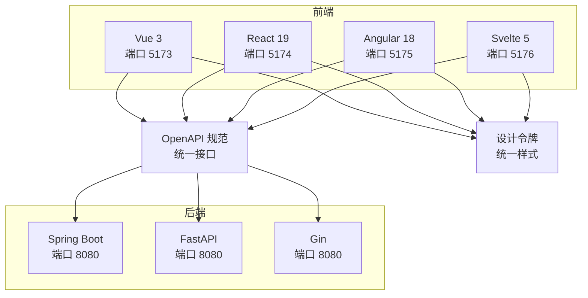
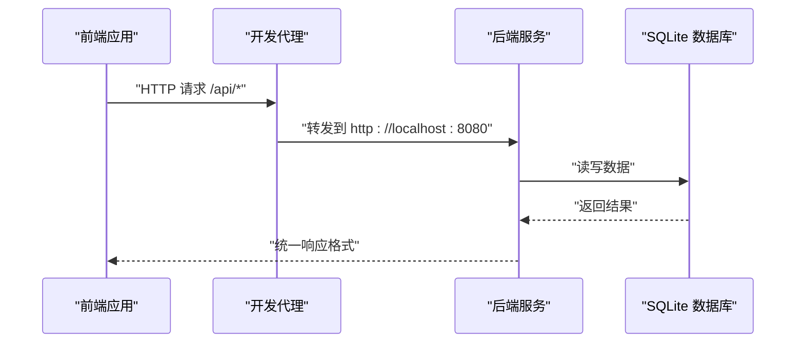
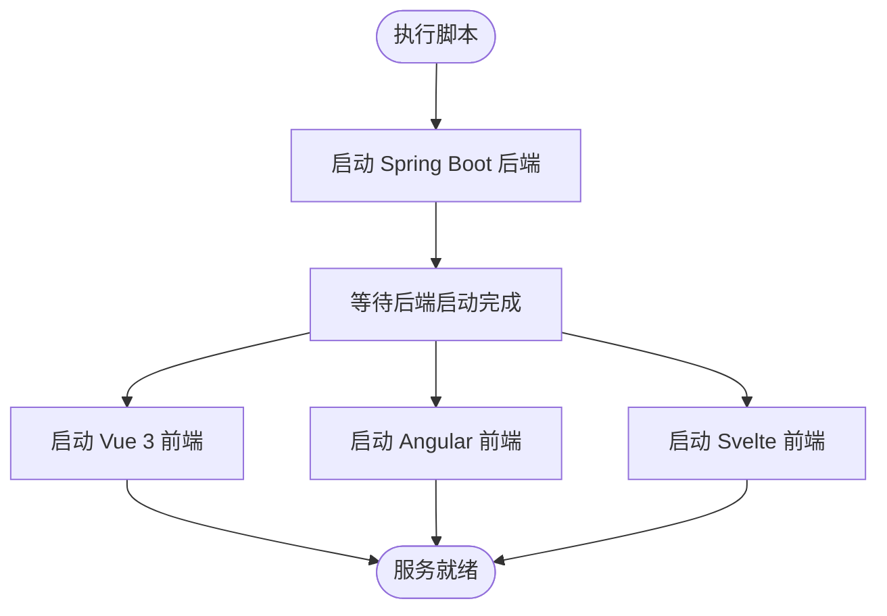

# 快速开始

<cite>
**本文引用的文件**
- [README.md](file://README.md)
- [scripts/dev.sh](file://scripts/dev.sh)
- [backends/fastapi/README.md](file://backends/fastapi/README.md)
- [backends/fastapi/requirements.txt](file://backends/fastapi/requirements.txt)
- [backends/gin/README.md](file://backends/gin/README.md)
- [backends/gin/go.mod](file://backends/gin/go.mod)
- [backends/spring-boot/README.md](file://backends/spring-boot/README.md)
- [backends/spring-boot/pom.xml](file://backends/spring-boot/pom.xml)
- [frontends/vue3-ts/README.md](file://frontends/vue3-ts/README.md)
- [frontends/vue3-ts/vite.config.ts](file://frontends/vue3-ts/vite.config.ts)
- [frontends/react-ts/README.md](file://frontends/react-ts/README.md)
- [frontends/angular-ts/README.md](file://frontends/angular-ts/README.md)
- [frontends/angular-ts/proxy.conf.json](file://frontends/angular-ts/proxy.conf.json)
- [frontends/angular-ts/tsconfig.app.json](file://frontends/angular-ts/tsconfig.app.json)
- [spec/api/openapi.yaml](file://spec/api/openapi.yaml)
</cite>

## 目录
1. [简介](#简介)
2. [项目结构](#项目结构)
3. [核心组件](#核心组件)
4. [架构总览](#架构总览)
5. [详细组件分析](#详细组件分析)
6. [依赖分析](#依赖分析)
7. [性能考虑](#性能考虑)
8. [故障排除指南](#故障排除指南)
9. [结论](#结论)
10. [附录](#附录)

## 简介
HelloTime 是一个“时间胶囊”应用，通过统一的 REST API 与设计系统，展示多种前后端技术栈的自由组合能力。项目提供五种启动方式：Spring Boot + Vue 3、FastAPI + React、Spring Boot + Angular、Gin + Vue 3，以及一键启动全部服务。所有实现遵循相同的 OpenAPI 规范与设计令牌，确保功能一致性。

## 项目结构
项目采用“前后端分离 + 统一规范”的组织方式，核心目录如下：
- docs/：项目文档（需求、设计、部署指南）
- spec/：共享规范（OpenAPI 3.0、设计令牌）
- frontends/：前端实现（Vue 3、React、Angular、Svelte）
- backends/：后端实现（Spring Boot、FastAPI、Gin）
- scripts/：开发/构建/测试脚本

图表来源
- [README.md:37-63](file://README.md#L37-L63)
- [frontends/vue3-ts/vite.config.ts:13-22](file://frontends/vue3-ts/vite.config.ts#L13-L22)
- [frontends/angular-ts/proxy.conf.json:1-7](file://frontends/angular-ts/proxy.conf.json#L1-L7)
- [spec/api/openapi.yaml:7-8](file://spec/api/openapi.yaml#L7-L8)

章节来源
- [README.md:37-63](file://README.md#L37-L63)

## 核心组件
- 统一 API 规范：所有后端实现遵循 OpenAPI 3.0，提供健康检查、胶囊 CRUD、管理员认证等端点。
- 设计系统：通过 CSS 设计令牌（tokens.css）与基础样式（base.css、components.css、layout.css）保证视觉一致性。
- 前后端解耦：前端通过代理或环境变量指向后端 API，支持任意前端与任意后端组合。

章节来源
- [README.md:16-35](file://README.md#L16-L35)
- [spec/api/openapi.yaml:1-200](file://spec/api/openapi.yaml#L1-L200)

## 架构总览
下图展示了五种启动方式的典型交互流程：前端开发服务器通过本地代理转发到后端服务，后端服务访问 SQLite 数据库，统一响应格式与错误码。

图表来源
- [frontends/vue3-ts/vite.config.ts:15-20](file://frontends/vue3-ts/vite.config.ts#L15-L20)
- [frontends/angular-ts/proxy.conf.json:2-6](file://frontends/angular-ts/proxy.conf.json#L2-L6)
- [spec/api/openapi.yaml:7-8](file://spec/api/openapi.yaml#L7-L8)

## 详细组件分析

### 方式一：Spring Boot + Vue 3
- 后端
  - 使用 Spring Boot 3 + Java 21，默认端口 8080。
  - 通过 Maven Wrapper 启动，支持环境变量配置（管理员密码、JWT 密钥）。
- 前端
  - 使用 Vue 3 + TypeScript + Vite，默认端口 5173。
  - 通过 Vite 代理将 /api 前缀请求转发至后端。
- 启动命令
  - 后端：进入 backends/spring-boot，使用 Maven Wrapper 启动。
  - 前端：进入 frontends/vue3-ts，安装依赖后启动开发服务器。
- 端口与地址
  - 后端：http://localhost:8080
  - 前端：http://localhost:5173

章节来源
- [README.md:67-83](file://README.md#L67-L83)
- [backends/spring-boot/README.md:21-52](file://backends/spring-boot/README.md#L21-L52)
- [frontends/vue3-ts/README.md:22-50](file://frontends/vue3-ts/README.md#L22-L50)
- [frontends/vue3-ts/vite.config.ts:13-22](file://frontends/vue3-ts/vite.config.ts#L13-L22)

### 方式二：FastAPI + React
- 后端
  - 使用 FastAPI + Python 3.12+，默认端口 8080。
  - 通过 Uvicorn 启动，支持环境变量配置（数据库 URL、管理员密码、JWT 密钥、过期时间）。
- 前端
  - 使用 React 19 + TypeScript + Vite，默认端口 5174。
  - 通过 Vite 代理将 /api 前缀请求转发至后端。
- 启动命令
  - 后端：进入 backends/fastapi，安装依赖后使用 Uvicorn 启动。
  - 前端：进入 frontends/react-ts，安装依赖后启动开发服务器。
- 端口与地址
  - 后端：http://localhost:8080
  - 前端：http://localhost:5174

章节来源
- [README.md:86-103](file://README.md#L86-L103)
- [backends/fastapi/README.md:21-74](file://backends/fastapi/README.md#L21-L74)
- [frontends/react-ts/README.md:22-50](file://frontends/react-ts/README.md#L22-L50)

### 方式三：Spring Boot + Angular
- 后端
  - 使用 Spring Boot 3 + Java 21，默认端口 8080。
- 前端
  - 使用 Angular 18 + TypeScript，默认端口 5175。
  - 通过 Angular CLI 的代理配置将 /api 前缀请求转发至后端。
- 启动命令
  - 后端：进入 backends/spring-boot，使用 Maven Wrapper 启动。
  - 前端：进入 frontends/angular-ts，安装依赖后启动开发服务器。
- 端口与地址
  - 后端：http://localhost:8080
  - 前端：http://localhost:5175

章节来源
- [README.md:106-121](file://README.md#L106-L121)
- [backends/spring-boot/README.md:21-52](file://backends/spring-boot/README.md#L21-L52)
- [frontends/angular-ts/README.md:5-20](file://frontends/angular-ts/README.md#L5-L20)
- [frontends/angular-ts/proxy.conf.json:1-7](file://frontends/angular-ts/proxy.conf.json#L1-L7)

### 方式四：Gin + Vue 3
- 后端
  - 使用 Gin + Go 1.24+，默认端口 8080。
  - 通过 go run 启动，支持环境变量配置（数据库 URL、管理员密码、JWT 密钥、过期时间、端口）。
- 前端
  - 使用 Vue 3 + TypeScript + Vite，默认端口 5173。
  - 通过 Vite 代理将 /api 前缀请求转发至后端。
- 启动命令
  - 后端：进入 backends/gin，安装依赖后使用 go run 启动。
  - 前端：进入 frontends/vue3-ts，安装依赖后启动开发服务器。
- 端口与地址
  - 后端：http://localhost:8080
  - 前端：http://localhost:5173

章节来源
- [README.md:124-140](file://README.md#L124-L140)
- [backends/gin/README.md:20-59](file://backends/gin/README.md#L20-L59)
- [frontends/vue3-ts/README.md:22-50](file://frontends/vue3-ts/README.md#L22-L50)
- [frontends/vue3-ts/vite.config.ts:13-22](file://frontends/vue3-ts/vite.config.ts#L13-L22)

### 一键启动所有服务
- 使用脚本同时启动 Spring Boot 后端与 Vue 3、Angular、Svelte 前端。
- 默认端口：后端 8080，前端 Vue 5173、Angular 5175、Svelte 5176。
- 停止：Ctrl+C 停止所有进程。

图表来源
- [scripts/dev.sh:11-46](file://scripts/dev.sh#L11-L46)

章节来源
- [README.md:143-148](file://README.md#L143-L148)
- [scripts/dev.sh:1-52](file://scripts/dev.sh#L1-L52)

## 依赖分析
- 后端依赖
  - Spring Boot：Web、JPA、Validation、SQLite、JWT（jjwt）。
  - FastAPI：FastAPI、Uvicorn、SQLAlchemy、PyJWT、HTTPX、Pytest。
  - Gin：Gin、GORM、SQLite 驱动、golang-jwt。
- 前端依赖
  - Vue 3：Vue、Vue Router。
  - React：React、React Router。
  - Angular：Angular 核心包、路由、RxJS、Zone.js。
- 代理与路径别名
  - Vue：Vite 代理将 /api 转发到后端；路径别名 @ 指向 src，@spec 指向 spec。
  - Angular：CLI 代理配置 /api；tsconfig 中 @app 与 @spec 路径别名。

章节来源
- [backends/spring-boot/pom.xml:25-79](file://backends/spring-boot/pom.xml#L25-L79)
- [backends/fastapi/requirements.txt:1-7](file://backends/fastapi/requirements.txt#L1-L7)
- [backends/gin/go.mod:5-10](file://backends/gin/go.mod#L5-L10)
- [frontends/vue3-ts/vite.config.ts:7-12](file://frontends/vue3-ts/vite.config.ts#L7-L12)
- [frontends/angular-ts/tsconfig.app.json:19-22](file://frontends/angular-ts/tsconfig.app.json#L19-L22)

## 性能考虑
- 前后端分离：代理仅用于开发阶段，生产环境建议将前端静态资源托管于 CDN 或反向代理。
- 数据库：SQLite 适合开发与演示，生产环境建议迁移到关系型数据库（如 PostgreSQL/MySQL）。
- 并发与热更新：后端开发服务器（Uvicorn reload、Go run）与前端 Vite 热更新提升开发效率。
- 资源体积：生产构建会进行 Tree-shaking 与压缩，注意第三方库大小与按需引入。

## 故障排除指南
- 端口冲突
  - Vue 3：默认 5173；React：默认 5174；Angular：默认 5175；Svelte：默认 5176；后端：默认 8080。
  - 解决：修改前端 Vite 或 Angular CLI 的端口配置；或停止占用端口的进程。
- 代理无效
  - Vue：确认 vite.config.ts 中 /api 代理目标为 http://localhost:8080。
  - Angular：确认 proxy.conf.json 中 /api 代理目标为 http://localhost:8080。
- 环境变量未生效
  - Spring Boot：通过 JVM 启动参数或环境变量设置 ADMIN_PASSWORD、JWT_SECRET。
  - FastAPI：通过 export 设置 DATABASE_URL、ADMIN_PASSWORD、JWT_SECRET、JWT_EXPIRATION_HOURS。
  - Gin：通过 export 设置 DATABASE_URL、ADMIN_PASSWORD、JWT_SECRET、JWT_EXPIRATION_HOURS、PORT。
- 模块解析失败（Angular）
  - 检查 tsconfig.app.json 中 @app 与 @spec 的路径别名是否正确。
- 测试失败
  - Spring Boot：使用 Maven Wrapper 执行测试。
  - FastAPI：使用 pytest。
  - Gin：使用 go test ./tests/ -v。
- 一键启动失败
  - 确认脚本权限可执行；检查各后端与前端依赖是否安装完成。

章节来源
- [frontends/vue3-ts/vite.config.ts:13-22](file://frontends/vue3-ts/vite.config.ts#L13-L22)
- [frontends/angular-ts/proxy.conf.json:1-7](file://frontends/angular-ts/proxy.conf.json#L1-L7)
- [backends/spring-boot/README.md:40-52](file://backends/spring-boot/README.md#L40-L52)
- [backends/fastapi/README.md:60-74](file://backends/fastapi/README.md#L60-L74)
- [backends/gin/README.md:44-59](file://backends/gin/README.md#L44-L59)
- [frontends/angular-ts/tsconfig.app.json:19-22](file://frontends/angular-ts/tsconfig.app.json#L19-L22)
- [scripts/dev.sh:11-19](file://scripts/dev.sh#L11-L19)

## 结论
通过本指南，你可以快速选择任一种技术组合启动 HelloTime，并在本地完成开发与调试。项目提供了统一的 API 规范与设计系统，便于横向对比不同框架的实现差异。遇到问题时，可依据“故障排除指南”逐项排查。

## 附录

### 环境准备清单
- Node.js 18+（前端开发）
- Java 21+（Spring Boot）
- Python 3.12+（FastAPI）
- Go 1.24+（Gin）

章节来源
- [frontends/vue3-ts/README.md:24-27](file://frontends/vue3-ts/README.md#L24-L27)
- [backends/spring-boot/README.md:23-26](file://backends/spring-boot/README.md#L23-L26)
- [backends/fastapi/README.md:23-26](file://backends/fastapi/README.md#L23-L26)
- [backends/gin/README.md:22-24](file://backends/gin/README.md#L22-L24)

### API 端点一览（统一规范）
- 健康检查：GET /api/v1/health
- 创建胶囊：POST /api/v1/capsules
- 查询胶囊：GET /api/v1/capsules/{code}
- 管理员登录：POST /api/v1/admin/login
- 分页列表：GET /api/v1/admin/capsules
- 删除胶囊：DELETE /api/v1/admin/capsules/{code}

章节来源
- [spec/api/openapi.yaml:10-164](file://spec/api/openapi.yaml#L10-L164)