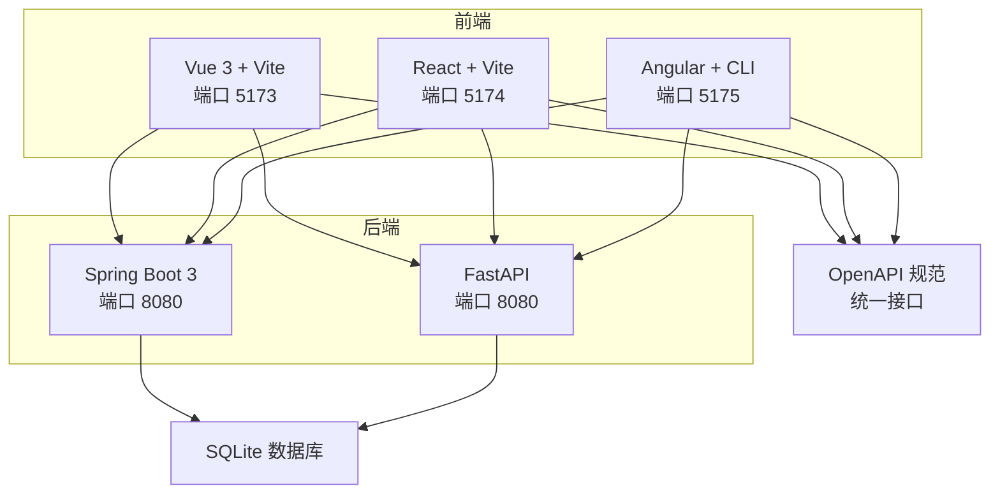
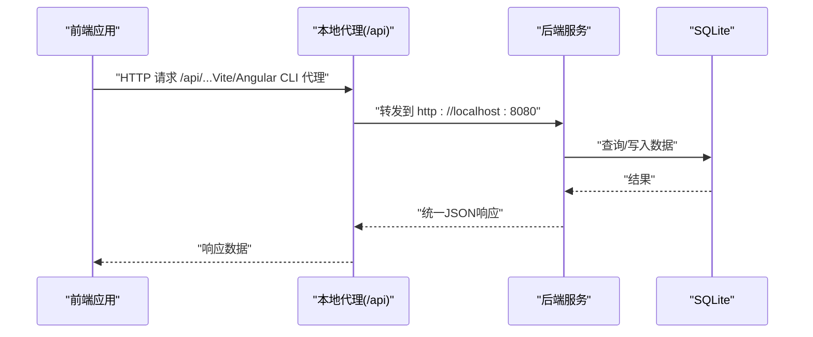
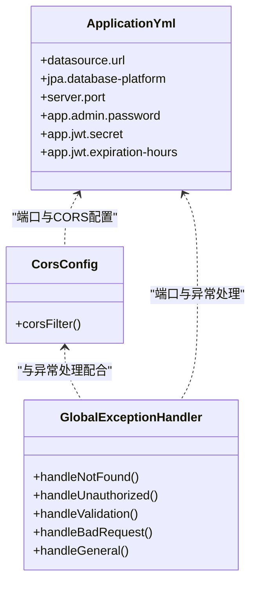
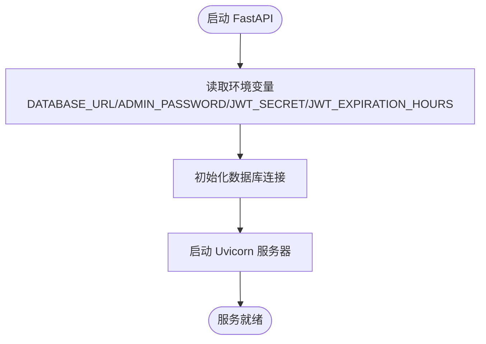
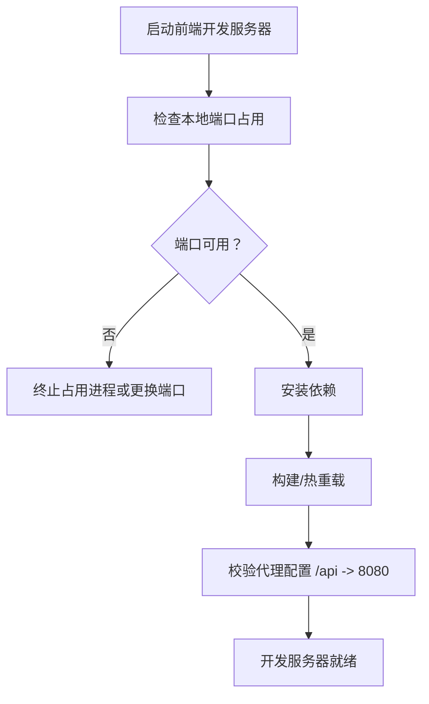
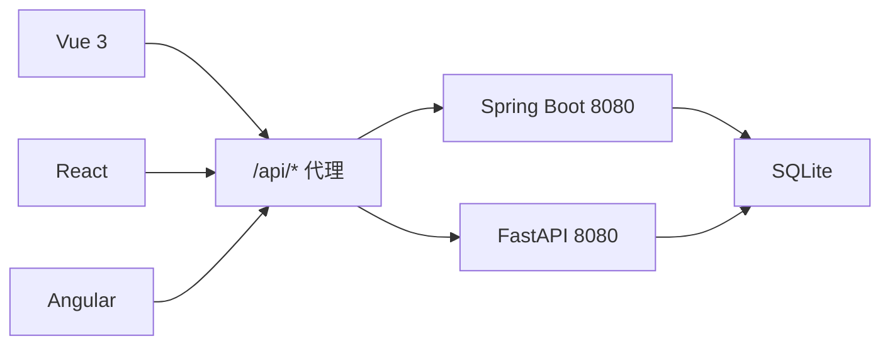

# 故障排除

<cite>
**本文引用的文件**
- [README.md](file://README.md)
- [dev.sh](file://scripts/dev.sh)
- [build.sh](file://scripts/build.sh)
- [pom.xml](file://backends/spring-boot/pom.xml)
- [application.yml](file://backends/spring-boot/src/main/resources/application.yml)
- [requirements.txt](file://backends/fastapi/requirements.txt)
- [config.py](file://backends/fastapi/app/config.py)
- [package.json（Angular）](file://frontends/angular-ts/package.json)
- [proxy.conf.json](file://frontends/angular-ts/proxy.conf.json)
- [vite.config.ts（Vue 3）](file://frontends/vue3-ts/vite.config.ts)
- [vite.config.ts（React）](file://frontends/react-ts/vite.config.ts)
- [openapi.yaml](file://spec/api/openapi.yaml)
- [CorsConfig.java](file://backends/spring-boot/src/main/java/com/hellotime/config/CorsConfig.java)
- [GlobalExceptionHandler.java](file://backends/spring-boot/src/main/java/com/hellotime/exception/GlobalExceptionHandler.java)
</cite>

## 目录
1. [简介](#简介)
2. [项目结构](#项目结构)
3. [核心组件](#核心组件)
4. [架构总览](#架构总览)
5. [详细组件分析](#详细组件分析)
6. [依赖关系分析](#依赖关系分析)
7. [性能注意事项](#性能注意事项)
8. [故障排除指南](#故障排除指南)
9. [结论](#结论)
10. [附录](#附录)

## 简介
本指南面向HelloTime项目的开发者与运维人员，聚焦于开发与运行阶段的常见问题与系统化排查方法。内容覆盖环境配置（Node.js版本、Python依赖、Java环境）、API相关问题（端点不可访问、CORS跨域、JWT认证、数据库连接）、前端构建问题（Vite热重载、组件渲染、样式不生效）、后端启动问题（端口占用、依赖冲突、配置错误）、性能问题（内存泄漏、响应缓慢、并发处理）、日志与调试技巧、网络与数据库诊断以及版本兼容与依赖冲突的解决方案。

## 项目结构
HelloTime采用前后端分离架构，支持多前端与多后端组合：
- 前端：Vue 3 + TypeScript（Vite）、React + TypeScript（Vite）、Angular 18 + TypeScript（Angular CLI）
- 后端：Spring Boot 3（Java 17+）、FastAPI（Python 3.10+）
- 统一API规范与样式规范位于 spec/ 目录
- 开发与构建脚本位于 scripts/ 目录

图表来源
- [README.md: 18-34:18-34](file://README.md#L18-L34)
- [vite.config.ts（Vue 3）: 13-22:13-22](file://frontends/vue3-ts/vite.config.ts#L13-L22)
- [vite.config.ts（React）: 13-22:13-22](file://frontends/react-ts/vite.config.ts#L13-L22)
- [application.yml: 13-14:13-14](file://backends/spring-boot/src/main/resources/application.yml#L13-L14)
- [openapi.yaml: 7-8:7-8](file://spec/api/openapi.yaml#L7-L8)

章节来源
- [README.md: 18-34:18-34](file://README.md#L18-L34)

## 核心组件
- 统一API规范：所有后端实现遵循同一OpenAPI规范，确保前后端一致的接口契约。
- 前端代理：各前端通过Vite/Angular CLI内置代理将/api前缀转发至后端8080端口。
- 后端CORS：Spring Boot后端配置允许本地跨域请求；FastAPI后端通过统一规范与前端代理协作。
- 异常处理：Spring Boot后端使用全局异常处理器统一错误响应格式。
- 配置管理：后端通过环境变量控制数据库、JWT密钥与过期时间等。

章节来源
- [openapi.yaml: 10-164:10-164](file://spec/api/openapi.yaml#L10-L164)
- [CorsConfig.java: 14-26:14-26](file://backends/spring-boot/src/main/java/com/hellotime/config/CorsConfig.java#L14-L26)
- [GlobalExceptionHandler.java: 15-86:15-86](file://backends/spring-boot/src/main/java/com/hellotime/exception/GlobalExceptionHandler.java#L15-L86)
- [application.yml: 4-21:4-21](file://backends/spring-boot/src/main/resources/application.yml#L4-L21)
- [config.py: 8-17:8-17](file://backends/fastapi/app/config.py#L8-L17)

## 架构总览
下图展示了典型开发场景下的请求流：前端通过本地代理访问后端，后端访问SQLite数据库，统一返回JSON响应。

图表来源
- [vite.config.ts（Vue 3）: 15-20:15-20](file://frontends/vue3-ts/vite.config.ts#L15-L20)
- [proxy.conf.json: 2-6:2-6](file://frontends/angular-ts/proxy.conf.json#L2-L6)
- [openapi.yaml: 7-8:7-8](file://spec/api/openapi.yaml#L7-L8)
- [application.yml: 4-14:4-14](file://backends/spring-boot/src/main/resources/application.yml#L4-L14)

## 详细组件分析

### Spring Boot 后端（Java 17+）
- 版本与依赖：使用Spring Boot 3、Java 17、SQLite JDBC与Hibernate方言、jjwt用于JWT。
- 数据库：JDBC URL指向相对路径的SQLite数据库文件，DDL自动更新。
- CORS：允许http://localhost:*的来源，支持常用方法与凭据。
- 全局异常：统一封装错误响应，映射常见业务异常为标准HTTP状态码。

图表来源
- [CorsConfig.java: 14-26:14-26](file://backends/spring-boot/src/main/java/com/hellotime/config/CorsConfig.java#L14-L26)
- [GlobalExceptionHandler.java: 15-86:15-86](file://backends/spring-boot/src/main/java/com/hellotime/exception/GlobalExceptionHandler.java#L15-L86)
- [application.yml: 4-21:4-21](file://backends/spring-boot/src/main/resources/application.yml#L4-L21)

章节来源
- [pom.xml: 20-72:20-72](file://backends/spring-boot/pom.xml#L20-L72)
- [application.yml: 4-21:4-21](file://backends/spring-boot/src/main/resources/application.yml#L4-L21)
- [CorsConfig.java: 14-26:14-26](file://backends/spring-boot/src/main/java/com/hellotime/config/CorsConfig.java#L14-L26)
- [GlobalExceptionHandler.java: 15-86:15-86](file://backends/spring-boot/src/main/java/com/hellotime/exception/GlobalExceptionHandler.java#L15-L86)

### FastAPI 后端（Python 3.10+）
- 依赖：FastAPI、Uvicorn、SQLAlchemy、PyJWT、HTTPX、Pytest。
- 配置：从环境变量读取数据库URL、管理员密码、JWT密钥与过期小时数。
- 数据库：默认SQLite，相对路径存储。

图表来源
- [requirements.txt: 1-7:1-7](file://backends/fastapi/requirements.txt#L1-L7)
- [config.py: 8-17:8-17](file://backends/fastapi/app/config.py#L8-L17)

章节来源
- [requirements.txt: 1-7:1-7](file://backends/fastapi/requirements.txt#L1-L7)
- [config.py: 8-17:8-17](file://backends/fastapi/app/config.py#L8-L17)

### 前端（Vite/Angular CLI）
- Vue 3 + Vite：本地开发端口5173，代理/api到8080。
- React + Vite：本地开发端口5174，代理/api到8080。
- Angular + CLI：本地开发端口5175，通过proxy.conf.json代理/api到8080。

图表来源
- [vite.config.ts（Vue 3）: 13-22:13-22](file://frontends/vue3-ts/vite.config.ts#L13-L22)
- [vite.config.ts（React）: 13-22:13-22](file://frontends/react-ts/vite.config.ts#L13-L22)
- [package.json（Angular）: 5-10:5-10](file://frontends/angular-ts/package.json#L5-L10)
- [proxy.conf.json: 2-6:2-6](file://frontends/angular-ts/proxy.conf.json#L2-L6)

章节来源
- [vite.config.ts（Vue 3）: 13-22:13-22](file://frontends/vue3-ts/vite.config.ts#L13-L22)
- [vite.config.ts（React）: 13-22:13-22](file://frontends/react-ts/vite.config.ts#L13-L22)
- [package.json（Angular）: 5-10:5-10](file://frontends/angular-ts/package.json#L5-L10)
- [proxy.conf.json: 2-6:2-6](file://frontends/angular-ts/proxy.conf.json#L2-L6)

## 依赖关系分析
- 前端对后端的依赖：通过本地代理转发/api请求，不直接依赖后端实现语言。
- 后端对数据库的依赖：Spring Boot使用JDBC + SQLite；FastAPI使用SQLAlchemy + SQLite。
- 统一API规范：所有实现遵循OpenAPI规范，减少集成成本。

图表来源
- [openapi.yaml: 7-8:7-8](file://spec/api/openapi.yaml#L7-L8)
- [vite.config.ts（Vue 3）: 15-20:15-20](file://frontends/vue3-ts/vite.config.ts#L15-L20)
- [vite.config.ts（React）: 15-20:15-20](file://frontends/react-ts/vite.config.ts#L15-L20)
- [proxy.conf.json: 2-6:2-6](file://frontends/angular-ts/proxy.conf.json#L2-L6)
- [application.yml: 4-14:4-14](file://backends/spring-boot/src/main/resources/application.yml#L4-L14)

章节来源
- [openapi.yaml: 7-8:7-8](file://spec/api/openapi.yaml#L7-L8)

## 性能注意事项
- 响应缓慢
  - 检查后端数据库查询是否缺少索引或存在N+1问题。
  - 关注Spring Boot日志中的慢查询与异常。
  - 对高频接口进行缓存（如胶囊详情在未开启前的查询）。
- 并发处理
  - 控制并发请求数，避免数据库锁竞争。
  - 合理设置线程池大小与超时时间。
- 内存泄漏
  - 前端：确认事件监听器与定时器在组件销毁时清理。
  - 后端：关闭数据库连接与释放资源，避免长生命周期对象持有上下文。

## 故障排除指南

### 环境配置问题
- Node.js 版本不兼容
  - 现象：npm/yarn安装失败、Vite编译报错、TypeScript类型检查异常。
  - 排查：确认Node版本满足各前端工程要求；优先使用NVM管理版本。
  - 解决：升级/降级Node版本至推荐范围；清理node_modules与重新安装依赖。
  章节来源
  - [package.json（Angular）: 24-35:24-35](file://frontends/angular-ts/package.json#L24-L35)
  - [package.json（React）: 18-29:18-29](file://frontends/react-ts/package.json#L18-L29)
  - [package.json（Vue 3）: 17-28:17-28](file://frontends/vue3-ts/package.json#L17-L28)

- Python 依赖安装失败（FastAPI）
  - 现象：pip安装依赖报错、找不到编译工具、权限问题。
  - 排查：检查Python 3.10+、虚拟环境激活、网络代理与pip源。
  - 解决：使用虚拟环境隔离依赖；更换国内镜像源；以管理员权限或修复权限。
  章节来源
  - [requirements.txt: 1-7:1-7](file://backends/fastapi/requirements.txt#L1-L7)

- Java 环境配置错误（Spring Boot）
  - 现象：编译失败、找不到符号、Maven/Gradle报错。
  - 排查：确认Java 17+、JAVA_HOME、PATH正确；Maven Wrapper可用。
  - 解决：安装匹配版本JDK；修复环境变量；使用./mvnw替代mvn。
  章节来源
  - [pom.xml: 20-23:20-23](file://backends/spring-boot/pom.xml#L20-L23)

### API 相关问题
- 端点无法访问
  - 现象：浏览器或Postman返回404/500。
  - 排查：核对OpenAPI路径与实际实现；确认后端端口8080是否启动；检查代理配置。
  - 解决：修正路径大小写与参数；确保后端先于前端启动；校验代理目标地址。
  章节来源
  - [openapi.yaml: 10-164:10-164](file://spec/api/openapi.yaml#L10-L164)
  - [vite.config.ts（Vue 3）: 15-20:15-20](file://frontends/vue3-ts/vite.config.ts#L15-L20)
  - [proxy.conf.json: 2-6:2-6](file://frontends/angular-ts/proxy.conf.json#L2-L6)

- CORS 跨域错误
  - 现象：浏览器控制台出现CORS错误。
  - 排查：Spring Boot CORS配置是否允许http://localhost:*；前端代理是否正确转发。
  - 解决：调整allowedOriginPatterns；确认代理changeOrigin与target正确。
  章节来源
  - [CorsConfig.java: 17-18:17-18](file://backends/spring-boot/src/main/java/com/hellotime/config/CorsConfig.java#L17-L18)
  - [vite.config.ts（Vue 3）: 15-20:15-20](file://frontends/vue3-ts/vite.config.ts#L15-L20)
  - [proxy.conf.json: 2-6:2-6](file://frontends/angular-ts/proxy.conf.json#L2-L6)

- JWT 认证失败
  - 现象：401未授权；Token无效或过期。
  - 排查：核对Authorization头格式；确认JWT_SECRET一致；检查过期时间。
  - 解决：使用正确的Bearer Token格式；确保后端环境变量一致；缩短或调整过期时间。
  章节来源
  - [openapi.yaml: 166-170:166-170](file://spec/api/openapi.yaml#L166-L170)
  - [application.yml: 16-21:16-21](file://backends/spring-boot/src/main/resources/application.yml#L16-L21)
  - [config.py: 13-17:13-17](file://backends/fastapi/app/config.py#L13-L17)

- 数据库连接问题
  - 现象：启动时报数据库连接失败、DDL异常。
  - 排查：确认SQLite驱动、JDBC URL与相对路径；检查文件权限与磁盘空间。
  - 解决：修正数据库URL；确保data目录存在且可写；必要时手动初始化数据库。
  章节来源
  - [application.yml: 4-10:4-10](file://backends/spring-boot/src/main/resources/application.yml#L4-L10)
  - [config.py: 9](file://backends/fastapi/app/config.py#L9)

### 前端构建问题
- Vite 热重载失败
  - 现象：修改代码后页面不刷新。
  - 排查：检查端口占用（5173/5174/5175）；代理是否指向8080；网络防火墙。
  - 解决：终止占用进程；修改vite.config.ts端口或代理；放通防火墙。
  章节来源
  - [vite.config.ts（Vue 3）: 13-22:13-22](file://frontends/vue3-ts/vite.config.ts#L13-L22)
  - [vite.config.ts（React）: 13-22:13-22](file://frontends/react-ts/vite.config.ts#L13-L22)
  - [package.json（Angular）: 5-6:5-6](file://frontends/angular-ts/package.json#L5-L6)

- 组件渲染错误
  - 现象：空白页面、TS类型报错、运行时异常。
  - 排查：检查TypeScript配置、依赖版本一致性；确认路由与API调用。
  - 解决：同步依赖版本；修复类型定义；检查API响应结构。
  章节来源
  - [openapi.yaml: 172-349:172-349](file://spec/api/openapi.yaml#L172-L349)

- 样式不生效
  - 现象：主题切换无效、组件样式丢失。
  - 排查：确认样式导入顺序；检查CSS模块命名与作用域。
  - 解决：调整导入顺序；使用正确的类名与作用域。
  章节来源
  - [README.md: 229-234:229-234](file://README.md#L229-L234)

### 后端启动问题
- 端口占用
  - 现象：启动失败提示端口被占用。
  - 排查：使用netstat/lsof查找占用进程；确认8080端口。
  - 解决：终止占用进程或修改server.port。
  章节来源
  - [application.yml: 13-14:13-14](file://backends/spring-boot/src/main/resources/application.yml#L13-L14)

- 依赖冲突
  - 现象：编译失败、运行时报NoClassDefFoundError或ModuleNotFound。
  - 排查：检查pom.xml与requirements.txt版本；清理缓存与重新安装。
  - 解决：锁定版本；使用依赖树工具定位冲突；统一依赖来源。
  章节来源
  - [pom.xml: 25-80:25-80](file://backends/spring-boot/pom.xml#L25-L80)
  - [requirements.txt: 1-7:1-7](file://backends/fastapi/requirements.txt#L1-L7)

- 配置文件错误
  - 现象：JWT密钥不一致、数据库路径错误、管理员密码不生效。
  - 排查：核对环境变量与配置文件；确认大小写与特殊字符。
  - 解决：统一环境变量；修正配置文件；重启服务使变更生效。
  章节来源
  - [application.yml: 16-21:16-21](file://backends/spring-boot/src/main/resources/application.yml#L16-L21)
  - [config.py: 11-17:11-17](file://backends/fastapi/app/config.py#L11-L17)

### 性能问题诊断
- 内存泄漏
  - 前端：使用浏览器性能面板检测事件监听器与定时器；确保组件销毁时清理。
  - 后端：检查连接池与事务边界；避免静态集合无限增长。
- 响应缓慢
  - 使用后端日志与指标监控；分析慢查询与异常；优化数据库索引与接口。
- 并发处理
  - 控制并发请求与线程池；避免热点资源争用；引入限流与熔断。

### 日志分析与调试工具
- 后端日志
  - Spring Boot：查看控制台输出与日志文件；关注异常堆栈与慢查询。
  - FastAPI：启用Uvicorn日志；结合pytest输出定位问题。
- 前端调试
  - 浏览器开发者工具：Network检查请求与响应；Console查看错误；Sources断点调试。
- 统一日志
  - 建议在后端统一日志格式与级别，便于集中检索。

### 网络问题排查
- 代理不通
  - 确认前端代理配置与后端8080端口可达；检查防火墙与安全组。
- DNS解析
  - 如使用域名，请检查DNS解析与hosts文件。
- 超时与重试
  - 合理设置超时与重试策略，避免阻塞UI。

### 数据库问题诊断
- 文件权限
  - 确保SQLite数据库文件与所在目录具备读写权限。
- 连接字符串
  - 核对相对路径与绝对路径；避免跨平台路径分隔符差异。
- 数据迁移
  - DDL自动更新可能导致数据不一致，建议在开发环境谨慎使用。

### 版本兼容性与依赖冲突
- 前端
  - 保持TypeScript、Vite与框架版本一致；使用package-lock.json锁定版本。
- 后端
  - Spring Boot 3需Java 17+；FastAPI需Python 3.10+；依赖版本尽量对齐官方推荐。
- 依赖冲突
  - 使用依赖树工具（如mvn dependency:tree、pip-tools）定位冲突；必要时降级或升级相关包。

## 结论
通过统一的API规范与清晰的代理与配置约定，HelloTime实现了多前端与多后端的灵活组合。在开发与运维中，建议优先从环境版本、代理与端口、CORS与JWT、数据库连接等基础环节入手排查，再逐步深入到性能与日志分析。遵循本指南可显著提升问题定位与解决效率。

## 附录
- 快速启动与测试
  - 开发：使用统一脚本同时启动后端与多个前端。
  - 测试：分别运行后端与前端测试套件。
- 常用命令参考
  - 后端（Spring Boot）：使用Maven Wrapper启动。
  - 后端（FastAPI）：安装依赖后使用Uvicorn启动。
  - 前端：安装依赖后使用Vite或Angular CLI启动。

章节来源
- [README.md: 106-144:106-144](file://README.md#L106-L144)
- [dev.sh: 12-38:12-38](file://scripts/dev.sh#L12-L38)
- [build.sh: 12-33:12-33](file://scripts/build.sh#L12-L33)