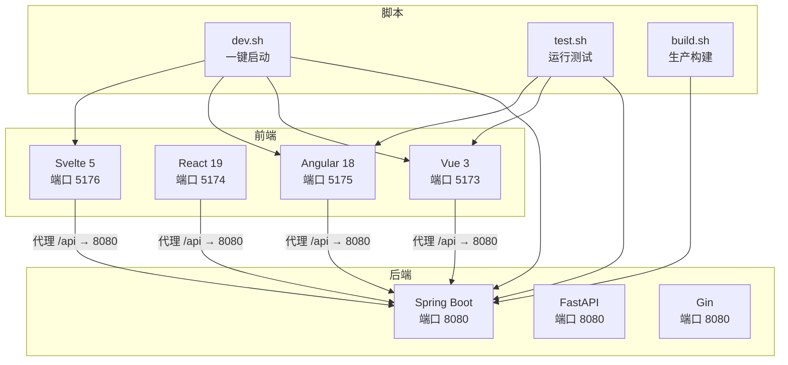
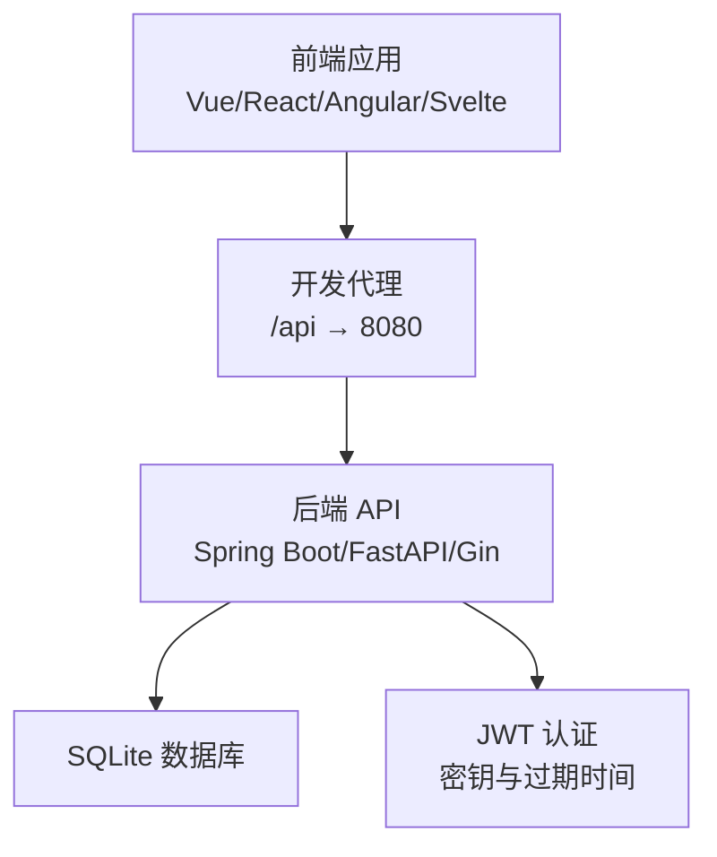
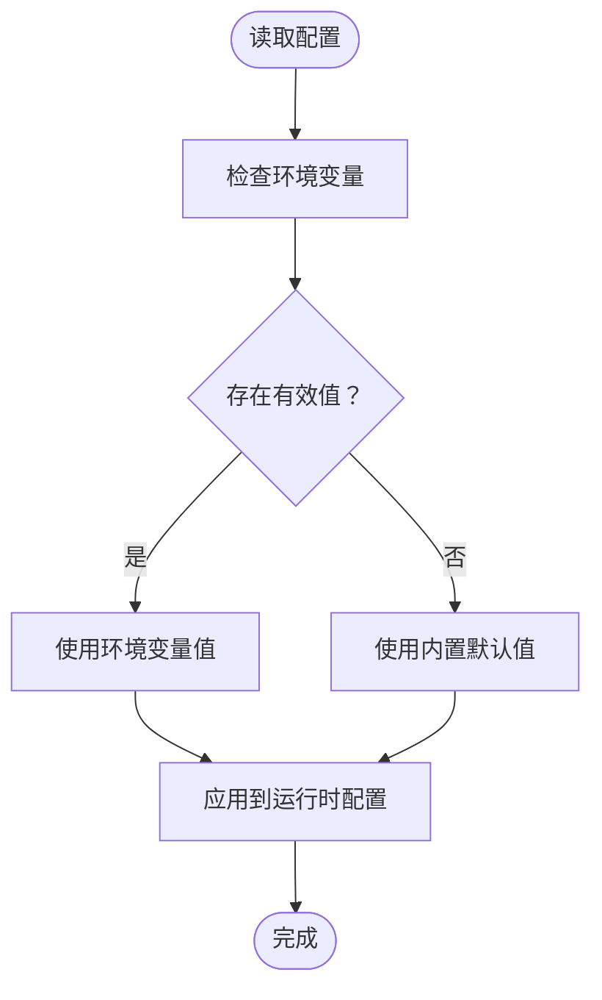
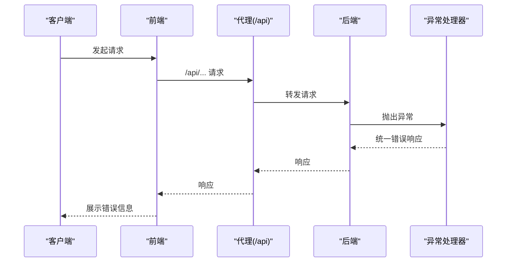
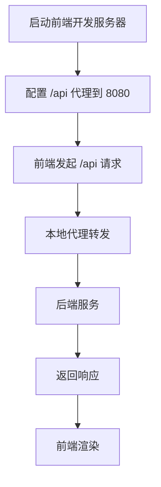
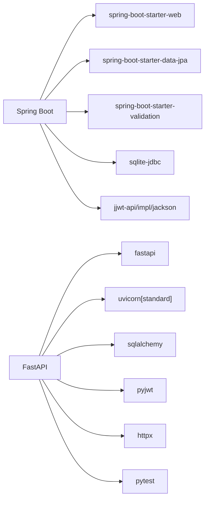

# 故障排除

<cite>
**本文引用的文件**
- [README.md](file://README.md)
- [requirements.txt](file://backends/fastapi/requirements.txt)
- [pom.xml](file://backends/spring-boot/pom.xml)
- [application.yml](file://backends/spring-boot/src/main/resources/application.yml)
- [config.py](file://backends/fastapi/app/config.py)
- [config.go](file://backends/gin/config/config.go)
- [main.py](file://backends/fastapi/app/main.py)
- [GlobalExceptionHandler.java](file://backends/spring-boot/src/main/java/com/hellotime/exception/GlobalExceptionHandler.java)
- [main.go](file://backends/gin/main.go)
- [proxy.conf.json](file://frontends/angular-ts/proxy.conf.json)
- [vite.config.ts (Vue)](file://frontends/vue3-ts/vite.config.ts)
- [vite.config.ts (React)](file://frontends/react-ts/vite.config.ts)
- [dev.sh](file://scripts/dev.sh)
- [test.sh](file://scripts/test.sh)
- [build.sh](file://scripts/build.sh)
</cite>

## 目录
1. [简介](#简介)
2. [项目结构](#项目结构)
3. [核心组件](#核心组件)
4. [架构总览](#架构总览)
5. [详细组件分析](#详细组件分析)
6. [依赖分析](#依赖分析)
7. [性能考虑](#性能考虑)
8. [故障排除指南](#故障排除指南)
9. [结论](#结论)
10. [附录](#附录)

## 简介
本指南面向开发者与运维人员，聚焦 HelloTime 项目的常见问题与排错流程，覆盖环境配置、依赖冲突、编译与运行时异常、网络与数据库连接、JWT 认证、性能与并发问题、日志与错误信息解读、调试工具使用等。文档同时提供跨前后端的通用排查方法与可视化图示，帮助快速定位并解决问题。

## 项目结构
HelloTime 采用“前后端完全解耦”的多实现架构：同一套 API 规范与设计系统被三种后端（Spring Boot、FastAPI、Gin）与四种前端（Vue 3、React 19、Angular 18、Svelte 5）复用。开发脚本可一键启动后端与多前端服务，便于联调与回归测试。

图表来源
- [dev.sh:1-52](file://scripts/dev.sh#L1-L52)
- [test.sh:1-34](file://scripts/test.sh#L1-L34)
- [build.sh:1-41](file://scripts/build.sh#L1-L41)
- [proxy.conf.json:1-8](file://frontends/angular-ts/proxy.conf.json#L1-L8)
- [vite.config.ts (Vue):1-23](file://frontends/vue3-ts/vite.config.ts#L1-L23)
- [vite.config.ts (React):1-23](file://frontends/react-ts/vite.config.ts#L1-L23)

章节来源
- [README.md:37-63](file://README.md#L37-L63)
- [dev.sh:1-52](file://scripts/dev.sh#L1-L52)

## 核心组件
- 后端配置与环境变量
  - Spring Boot：数据源、JPA、JWT 密钥与过期时间、线程模型、端口等
  - FastAPI：数据库 URL、管理员密码、JWT 密钥与过期时间
  - Gin：数据库路径、管理员密码、JWT 密钥、端口
- 异常处理与统一响应
  - Spring Boot：全局异常处理器，统一错误码与状态码映射
  - FastAPI：路由级异常处理器，统一错误响应
  - Gin：中间件与路由层错误处理（见 main.go）
- 前端代理与开发服务器
  - Angular：proxy.conf.json
  - Vue/React：vite.config.ts 内置代理
- 开发与测试脚本
  - dev.sh：一键启动后端与多前端
  - test.sh：统一执行后端与前端测试
  - build.sh：生产构建输出

章节来源
- [application.yml:1-26](file://backends/spring-boot/src/main/resources/application.yml#L1-L26)
- [config.py:1-18](file://backends/fastapi/app/config.py#L1-L18)
- [config.go:1-51](file://backends/gin/config/config.go#L1-L51)
- [GlobalExceptionHandler.java:1-66](file://backends/spring-boot/src/main/java/com/hellotime/exception/GlobalExceptionHandler.java#L1-L66)
- [main.py:1-89](file://backends/fastapi/app/main.py#L1-L89)
- [main.go:1-32](file://backends/gin/main.go#L1-L32)
- [proxy.conf.json:1-8](file://frontends/angular-ts/proxy.conf.json#L1-L8)
- [vite.config.ts (Vue):1-23](file://frontends/vue3-ts/vite.config.ts#L1-L23)
- [vite.config.ts (React):1-23](file://frontends/react-ts/vite.config.ts#L1-L23)
- [dev.sh:1-52](file://scripts/dev.sh#L1-L52)
- [test.sh:1-34](file://scripts/test.sh#L1-L34)
- [build.sh:1-41](file://scripts/build.sh#L1-L41)

## 架构总览
下图展示典型“前端 → 代理 → 后端”链路，以及后端对数据库与 JWT 的依赖关系。

图表来源
- [proxy.conf.json:1-8](file://frontends/angular-ts/proxy.conf.json#L1-L8)
- [vite.config.ts (Vue):1-23](file://frontends/vue3-ts/vite.config.ts#L1-L23)
- [vite.config.ts (React):1-23](file://frontends/react-ts/vite.config.ts#L1-L23)
- [main.py:1-89](file://backends/fastapi/app/main.py#L1-L89)
- [main.go:1-32](file://backends/gin/main.go#L1-L32)
- [application.yml:1-26](file://backends/spring-boot/src/main/resources/application.yml#L1-L26)
- [config.py:1-18](file://backends/fastapi/app/config.py#L1-L18)
- [config.go:1-51](file://backends/gin/config/config.go#L1-L51)

## 详细组件分析

### 组件：后端配置与环境变量
- Spring Boot
  - 数据库：SQLite，JDBC URL 指向 data 目录下的数据库文件；JPA DDL 自动更新；启用虚拟线程（Java 21+）
  - JWT：密钥与过期小时数通过环境变量注入
  - 端口：8080
- FastAPI
  - 数据库 URL：相对项目根目录的 SQLite 文件
  - JWT：密钥与过期小时数通过环境变量注入
- Gin
  - 数据库路径、JWT 密钥、JWT 过期小时数、端口均支持环境变量覆盖

图表来源
- [application.yml:1-26](file://backends/spring-boot/src/main/resources/application.yml#L1-L26)
- [config.py:1-18](file://backends/fastapi/app/config.py#L1-L18)
- [config.go:1-51](file://backends/gin/config/config.go#L1-L51)

章节来源
- [application.yml:1-26](file://backends/spring-boot/src/main/resources/application.yml#L1-L26)
- [config.py:1-18](file://backends/fastapi/app/config.py#L1-L18)
- [config.go:1-51](file://backends/gin/config/config.go#L1-L51)

### 组件：异常处理与统一响应
- Spring Boot：全局异常处理器，针对特定异常返回统一错误响应与状态码，并格式化参数校验错误
- FastAPI：路由级异常处理器，对未找到胶囊、未授权、参数校验、值错误与通用异常进行统一处理
- Gin：通过中间件与路由层捕获错误，结合配置模块的环境变量控制行为

图表来源
- [GlobalExceptionHandler.java:1-66](file://backends/spring-boot/src/main/java/com/hellotime/exception/GlobalExceptionHandler.java#L1-L66)
- [main.py:1-89](file://backends/fastapi/app/main.py#L1-L89)
- [main.go:1-32](file://backends/gin/main.go#L1-L32)

章节来源
- [GlobalExceptionHandler.java:1-66](file://backends/spring-boot/src/main/java/com/hellotime/exception/GlobalExceptionHandler.java#L1-L66)
- [main.py:1-89](file://backends/fastapi/app/main.py#L1-L89)
- [main.go:1-32](file://backends/gin/main.go#L1-L32)

### 组件：前端代理与开发服务器
- Angular：通过 proxy.conf.json 将 /api 代理至后端 8080 端口
- Vue/React：在 vite.config.ts 中配置 /api 代理与跨域变更

图表来源
- [proxy.conf.json:1-8](file://frontends/angular-ts/proxy.conf.json#L1-L8)
- [vite.config.ts (Vue):1-23](file://frontends/vue3-ts/vite.config.ts#L1-L23)
- [vite.config.ts (React):1-23](file://frontends/react-ts/vite.config.ts#L1-L23)

章节来源
- [proxy.conf.json:1-8](file://frontends/angular-ts/proxy.conf.json#L1-L8)
- [vite.config.ts (Vue):1-23](file://frontends/vue3-ts/vite.config.ts#L1-L23)
- [vite.config.ts (React):1-23](file://frontends/react-ts/vite.config.ts#L1-L23)

## 依赖分析
- 后端依赖
  - Spring Boot：Web、JPA、Validation、SQLite JDBC、jjwt（API/impl/jackson）、测试
  - FastAPI：FastAPI、Uvicorn、SQLAlchemy、PyJWT、HTTPX、Pytest
- 前端依赖
  - Vue/React/Angular：各自框架与路由依赖，测试工具链由各项目自行管理

图表来源
- [pom.xml:1-91](file://backends/spring-boot/pom.xml#L1-L91)
- [requirements.txt:1-7](file://backends/fastapi/requirements.txt#L1-L7)

章节来源
- [pom.xml:1-91](file://backends/spring-boot/pom.xml#L1-L91)
- [requirements.txt:1-7](file://backends/fastapi/requirements.txt#L1-L7)

## 性能考虑
- Spring Boot
  - 启用虚拟线程（Java 21+），有助于提升高并发场景下的吞吐
  - JPA DDL 自动更新建议仅在开发环境使用，生产建议显式迁移
- FastAPI
  - Uvicorn 标准变体提供高性能 ASGI 服务器
- Gin
  - 使用 Gin 路由器与中间件，注意避免在热路径上做阻塞操作
- 前端
  - 开发代理与构建优化，减少不必要的重渲染与网络请求

章节来源
- [application.yml:12-15](file://backends/spring-boot/src/main/resources/application.yml#L12-L15)
- [requirements.txt:1-2](file://backends/fastapi/requirements.txt#L1-L2)
- [main.go:1-32](file://backends/gin/main.go#L1-L32)

## 故障排除指南

### 一、环境配置问题
- 症状
  - 后端无法连接数据库或启动失败
  - JWT 登录失败或 Token 失效异常频繁
  - 前端代理导致跨域或 404
- 排查步骤
  - 检查环境变量是否正确注入（数据库 URL、JWT 密钥、过期时间、端口）
  - 确认数据库文件路径与权限
  - 确认前端代理目标地址与端口一致
- 解决方案
  - 在后端配置文件中补充或修正环境变量
  - 确保 data 目录存在且可写
  - 校正前端代理配置，确保 /api 前缀一致

章节来源
- [application.yml:1-26](file://backends/spring-boot/src/main/resources/application.yml#L1-L26)
- [config.py:1-18](file://backends/fastapi/app/config.py#L1-L18)
- [config.go:1-51](file://backends/gin/config/config.go#L1-L51)
- [proxy.conf.json:1-8](file://frontends/angular-ts/proxy.conf.json#L1-L8)
- [vite.config.ts (Vue):1-23](file://frontends/vue3-ts/vite.config.ts#L1-L23)
- [vite.config.ts (React):1-23](file://frontends/react-ts/vite.config.ts#L1-L23)

### 二、依赖冲突与安装问题
- 症状
  - pip/包管理器安装失败或版本不兼容
  - 启动时报缺少依赖或导入错误
- 排查步骤
  - 核对后端依赖清单与当前环境版本
  - 清理缓存并重新安装
- 解决方案
  - 使用官方依赖清单锁定版本
  - 在隔离环境中安装（如虚拟环境/容器）

章节来源
- [pom.xml:1-91](file://backends/spring-boot/pom.xml#L1-L91)
- [requirements.txt:1-7](file://backends/fastapi/requirements.txt#L1-L7)

### 三、编译错误
- 症状
  - TypeScript/Vite/Gradle 编译报错
- 排查步骤
  - 查看构建脚本输出与错误堆栈
  - 确认类型定义与插件版本兼容
- 解决方案
  - 更新构建工具与插件版本
  - 修复类型错误或缺失的类型声明

章节来源
- [build.sh:1-41](file://scripts/build.sh#L1-L41)
- [pom.xml:82-89](file://backends/spring-boot/pom.xml#L82-L89)

### 四、运行时异常
- 症状
  - 500 服务器内部错误、400 参数校验失败、401 未授权
- 排查步骤
  - 查看后端统一异常处理映射
  - 检查请求体与路径参数是否符合 API 规范
- 解决方案
  - 依据错误码调整请求参数或认证流程
  - 在开发阶段启用更详细的日志

章节来源
- [GlobalExceptionHandler.java:1-66](file://backends/spring-boot/src/main/java/com/hellotime/exception/GlobalExceptionHandler.java#L1-L66)
- [main.py:37-89](file://backends/fastapi/app/main.py#L37-L89)

### 五、网络连接问题
- 症状
  - 前端无法访问后端接口
  - 代理转发失败或跨域错误
- 排查步骤
  - 检查后端端口占用与防火墙
  - 校验前端代理配置与 /api 前缀
- 解决方案
  - 更改端口或关闭占用进程
  - 修正代理规则，确保目标地址与端口一致

章节来源
- [dev.sh:1-52](file://scripts/dev.sh#L1-L52)
- [proxy.conf.json:1-8](file://frontends/angular-ts/proxy.conf.json#L1-L8)
- [vite.config.ts (Vue):1-23](file://frontends/vue3-ts/vite.config.ts#L1-L23)
- [vite.config.ts (React):1-23](file://frontends/react-ts/vite.config.ts#L1-L23)

### 六、数据库连接问题
- 症状
  - 启动即报数据库连接失败
  - 运行中出现数据库锁或文件不可写
- 排查步骤
  - 检查数据库文件路径与权限
  - 确认 SQLite JDBC 与方言配置
- 解决方案
  - 确保 data 目录存在且具备写权限
  - 在 Spring Boot 中确认 JDBC URL 与驱动类名

章节来源
- [application.yml:4-11](file://backends/spring-boot/src/main/resources/application.yml#L4-L11)
- [config.py:8-9](file://backends/fastapi/app/config.py#L8-L9)

### 七、JWT 认证问题
- 症状
  - 登录成功但后续请求 401
  - Token 过期或签名不匹配
- 排查步骤
  - 检查 JWT 密钥一致性与过期时间
  - 确认请求头格式与携带方式
- 解决方案
  - 统一密钥与过期时间配置
  - 重新登录获取新 Token 并正确放入 Authorization 头

章节来源
- [application.yml:20-25](file://backends/spring-boot/src/main/resources/application.yml#L20-L25)
- [config.py:11-17](file://backends/fastapi/app/config.py#L11-L17)
- [config.go:32-42](file://backends/gin/config/config.go#L32-L42)
- [README.md:234-264](file://README.md#L234-L264)

### 八、性能问题分析
- 症状
  - 响应缓慢、CPU 或内存占用高
- 排查步骤
  - 使用后端性能监控与日志采样
  - 检查是否存在阻塞 I/O 或过度连接
- 解决方案
  - 启用虚拟线程（Spring Boot）或异步处理（FastAPI/Gin）
  - 优化数据库查询与索引

章节来源
- [application.yml:12-15](file://backends/spring-boot/src/main/resources/application.yml#L12-L15)
- [main.py:1-89](file://backends/fastapi/app/main.py#L1-L89)
- [main.go:1-32](file://backends/gin/main.go#L1-L32)

### 九、内存泄漏与并发问题
- 症状
  - 长时间运行后内存持续增长
  - 并发请求下偶发死锁或资源竞争
- 排查步骤
  - 使用内存分析工具定位泄漏对象
  - 检查共享状态与锁粒度
- 解决方案
  - 减少长生命周期对象持有
  - 使用无锁数据结构或细粒度锁

章节来源
- [main.go:1-32](file://backends/gin/main.go#L1-L32)

### 十、日志分析与错误信息解读
- 日志要点
  - 统一错误响应中的 success、message、errorCode 字段
  - Spring Boot 使用全局异常处理器映射状态码与错误码
  - FastAPI 使用路由级异常处理器返回标准化错误
- 解读方法
  - BAD_REQUEST：参数或业务逻辑错误
  - VALIDATION_ERROR：参数校验失败，关注字段与消息
  - UNAUTHORIZED：认证失败，检查 Token 与密钥
  - CAPSULE_NOT_FOUND：胶囊不存在或已过期
- 工具建议
  - 后端：启用更详细日志级别，结合统一异常处理输出上下文
  - 前端：在拦截器中记录请求与响应摘要

章节来源
- [GlobalExceptionHandler.java:1-66](file://backends/spring-boot/src/main/java/com/hellotime/exception/GlobalExceptionHandler.java#L1-L66)
- [main.py:37-89](file://backends/fastapi/app/main.py#L37-L89)
- [README.md:248-264](file://README.md#L248-L264)

### 十一、调试工具与流程
- 前端调试
  - 浏览器开发者工具 Network/Console
  - 代理日志与断点调试
- 后端调试
  - Spring Boot：启用 debug 日志与 Actuator
  - FastAPI：Uvicorn 调试模式与日志级别
  - Gin：Gin 的 Debug 模式与中间件日志
- 脚本辅助
  - 使用 dev.sh 一键启动，快速复现问题
  - 使用 test.sh 运行全量测试，定位回归问题

章节来源
- [dev.sh:1-52](file://scripts/dev.sh#L1-L52)
- [test.sh:1-34](file://scripts/test.sh#L1-L34)

## 结论
通过统一的 API 规范与多实现后端，HelloTime 提供了良好的可维护性与可扩展性。本指南总结了从环境配置、依赖管理、网络与数据库连接、JWT 认证到性能与并发问题的系统化排查方法。建议在开发与运维实践中结合脚本与日志工具，形成标准化的排错流程，以提升问题定位效率与稳定性。

## 附录
- 常用命令与端口
  - 后端：Spring Boot（8080）、FastAPI（8080）、Gin（8080）
  - 前端：Vue（5173）、React（5174）、Angular（5175）、Svelte（5176）
- 关键配置位置
  - Spring Boot：application.yml
  - FastAPI：config.py
  - Gin：config.go
  - 前端代理：Angular proxy.conf.json、Vue/React vite.config.ts

章节来源
- [README.md:16-32](file://README.md#L16-L32)
- [application.yml:1-26](file://backends/spring-boot/src/main/resources/application.yml#L1-L26)
- [config.py:1-18](file://backends/fastapi/app/config.py#L1-L18)
- [config.go:1-51](file://backends/gin/config/config.go#L1-L51)
- [proxy.conf.json:1-8](file://frontends/angular-ts/proxy.conf.json#L1-L8)
- [vite.config.ts (Vue):1-23](file://frontends/vue3-ts/vite.config.ts#L1-L23)
- [vite.config.ts (React):1-23](file://frontends/react-ts/vite.config.ts#L1-L23)