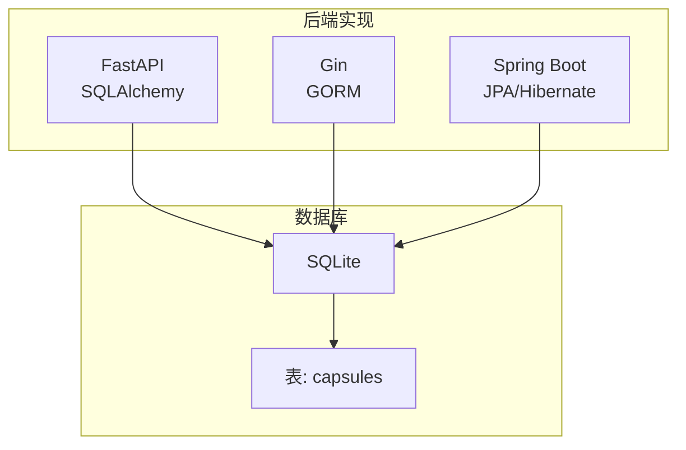
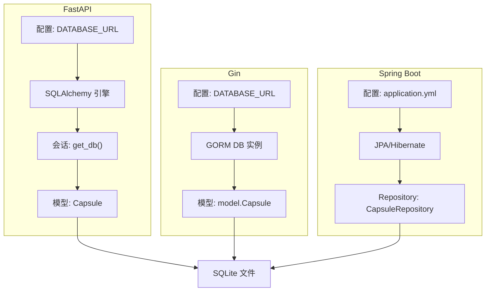
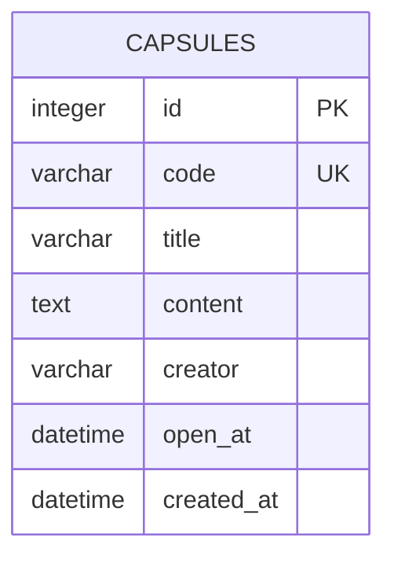
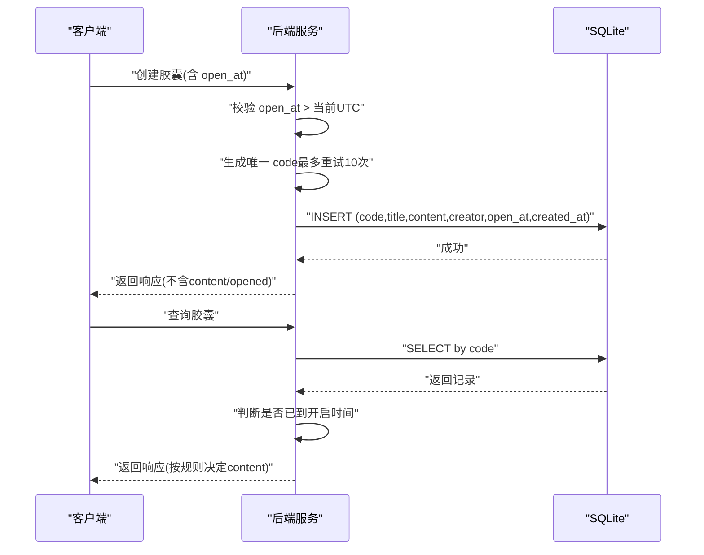
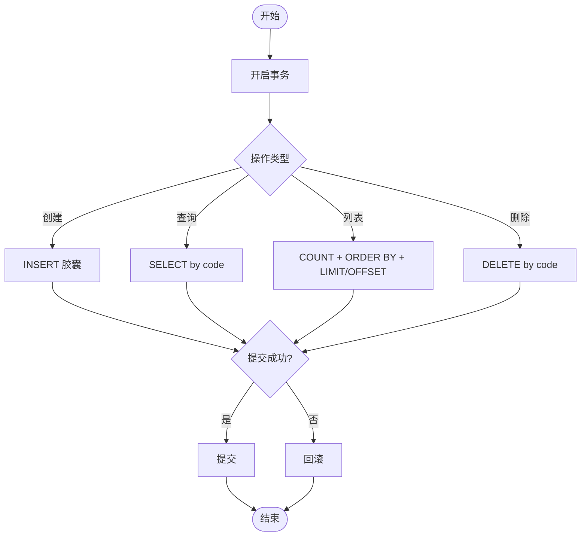
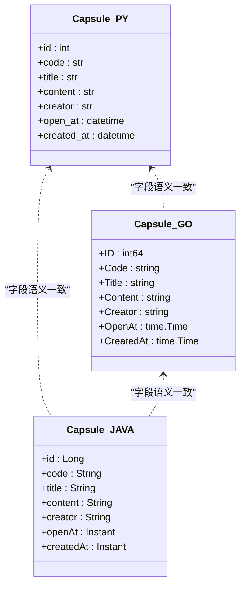

# 数据库设计

<cite>
**本文引用的文件**
- [database-schema.md](file://docs/database-schema.md)
- [database.py](file://backends/fastapi/app/database.py)
- [models.py](file://backends/fastapi/app/models.py)
- [schemas.py](file://backends/fastapi/app/schemas.py)
- [capsule_service.py](file://backends/fastapi/app/services/capsule_service.py)
- [config.py](file://backends/fastapi/app/config.py)
- [database.go](file://backends/gin/database/database.go)
- [capsule.go](file://backends/gin/model/capsule.go)
- [capsule_service.go](file://backends/gin/service/capsule_service.go)
- [config.go](file://backends/gin/config/config.go)
- [Capsule.java](file://backends/spring-boot/src/main/java/com/hellotime/entity/Capsule.java)
- [CapsuleRepository.java](file://backends/spring-boot/src/main/java/com/hellotime/repository/CapsuleRepository.java)
- [application.yml](file://backends/spring-boot/src/main/resources/application.yml)
- [deployment.md](file://docs/deployment.md)
</cite>

## 目录
1. [简介](#简介)
2. [项目结构](#项目结构)
3. [核心组件](#核心组件)
4. [架构总览](#架构总览)
5. [详细组件分析](#详细组件分析)
6. [依赖分析](#依赖分析)
7. [性能考虑](#性能考虑)
8. [故障排查指南](#故障排查指南)
9. [结论](#结论)
10. [附录](#附录)

## 简介
本文件面向数据库管理员与后端开发者，系统化梳理 HelloTime 项目的统一 SQLite 数据库设计与实现。重点覆盖“胶囊”表的字段定义、主键与唯一性约束、外键关系、时间字段存储与时区处理、索引优化策略、数据访问模式与查询优化技巧、事务处理机制、数据迁移与版本升级策略、备份与恢复方案，并对比 FastAPI/SQLAlchemy、Go/GORM、Spring Boot/JPA 三种后端实现中的 ORM 映射差异与注意事项。

## 项目结构
- 统一数据库引擎：SQLite（轻量、零配置，适合演示与小规模部署）
- 统一表结构：capsules 表
- 统一时间字段：UTC 时间戳（DATETIME 或 TIMESTAMP WITH TIME ZONE）
- 统一索引策略：code 字段唯一索引
- 多后端实现：
  - FastAPI + SQLAlchemy（Python）
  - Gin + GORM（Go）
  - Spring Boot + JPA/Hibernate（Java）



图表来源
- [database.py:11-16](file://backends/fastapi/app/database.py#L11-L16)
- [database.go:24-36](file://backends/gin/database/database.go#L24-L36)
- [application.yml:4-11](file://backends/spring-boot/src/main/resources/application.yml#L4-L11)

章节来源
- [database-schema.md:1-48](file://docs/database-schema.md#L1-L48)
- [database.py:1-30](file://backends/fastapi/app/database.py#L1-L30)
- [database.go:1-38](file://backends/gin/database/database.go#L1-L38)
- [application.yml:1-26](file://backends/spring-boot/src/main/resources/application.yml#L1-L26)

## 核心组件
- 表：capsules
  - 字段与约束：id（主键自增）、code（VARCHAR(8) 唯一非空）、title（VARCHAR(100) 非空）、content（TEXT 非空）、creator（VARCHAR(30) 非空）、open_at（DATETIME 非空，UTC）、created_at（DATETIME 非空，UTC）
  - 索引：code 字段具备唯一索引
- 时间字段
  - 所有后端均以 UTC 存储；FastAPI/Spring Boot 使用带时区的时间类型，Go 使用 time.Time 并在入库前转换为 UTC
- 胶囊码
  - 8 位，字符集 A-Z a-z 0-9，空间约 218 万亿；生成采用随机算法，冲突检测与最多重试 10 次
- 数据访问层
  - FastAPI：SQLAlchemy 模型 + 服务层封装
  - Gin：GORM 模型 + 服务层封装
  - Spring Boot：JPA 实体 + Repository 接口

章节来源
- [database-schema.md:9-24](file://docs/database-schema.md#L9-L24)
- [models.py:14-25](file://backends/fastapi/app/models.py#L14-L25)
- [capsule.go:6-15](file://backends/gin/model/capsule.go#L6-L15)
- [Capsule.java:10-57](file://backends/spring-boot/src/main/java/com/hellotime/entity/Capsule.java#L10-L57)

## 架构总览
三套后端通过各自的 ORM/驱动连接 SQLite，统一使用 capsules 表与 UTC 时间语义。FastAPI 使用 SQLAlchemy，Gin 使用 GORM，Spring Boot 使用 JPA/Hibernate。配置层面，三者均支持通过环境变量设置数据库路径、管理员密码、JWT 密钥与过期时长。



图表来源
- [config.py:8-9](file://backends/fastapi/app/config.py#L8-L9)
- [database.py:11-16](file://backends/fastapi/app/database.py#L11-L16)
- [config.go:32-36](file://backends/gin/config/config.go#L32-L36)
- [database.go:24-36](file://backends/gin/database/database.go#L24-L36)
- [application.yml:4-11](file://backends/spring-boot/src/main/resources/application.yml#L4-L11)

## 详细组件分析

### 表结构与字段定义
- 字段与类型
  - id: 整型主键，自增
  - code: 文本，长度 8，唯一且非空
  - title: 文本，长度 100，非空
  - content: 长文本，非空
  - creator: 文本，长度 30，非空
  - open_at: 时间戳（UTC），非空
  - created_at: 时间戳（UTC），非空
- 约束与索引
  - 主键：id
  - 唯一性：code
  - 索引：code（由唯一约束自动建立）
- 时间字段存储与时区
  - Python（SQLAlchemy）：DateTime(timezone=True) 或 datetime+tzinfo
  - Go（GORM）：time.Time，入库前转换为 UTC
  - Java（JPA）：Instant（UTC），持久化前自动设置 created_at



图表来源
- [database-schema.md:11-19](file://docs/database-schema.md#L11-L19)
- [models.py:18-25](file://backends/fastapi/app/models.py#L18-L25)
- [capsule.go:8-14](file://backends/gin/model/capsule.go#L8-L14)
- [Capsule.java:17-57](file://backends/spring-boot/src/main/java/com/hellotime/entity/Capsule.java#L17-L57)

章节来源
- [database-schema.md:9-24](file://docs/database-schema.md#L9-L24)
- [models.py:14-25](file://backends/fastapi/app/models.py#L14-L25)
- [capsule.go:6-15](file://backends/gin/model/capsule.go#L6-L15)
- [Capsule.java:10-57](file://backends/spring-boot/src/main/java/com/hellotime/entity/Capsule.java#L10-L57)

### 主键、唯一性与外键
- 主键：id（自增）
- 唯一性：code（唯一索引）
- 外键：本表无外键字段，不涉及跨表引用

章节来源
- [database-schema.md:13-13](file://docs/database-schema.md#L13-L13)
- [models.py:18-19](file://backends/fastapi/app/models.py#L18-L19)
- [capsule.go:8-9](file://backends/gin/model/capsule.go#L8-L9)
- [Capsule.java:17-24](file://backends/spring-boot/src/main/java/com/hellotime/entity/Capsule.java#L17-L24)

### 时间字段存储与时区处理
- 存储格式
  - FastAPI：使用带时区的 datetime（ISO 8601 字符串），统一为 UTC
  - Gin：time.Time，入库前转换为 UTC
  - Spring Boot：Instant（UTC），created_at 在持久化前自动填充
- API 层输出
  - 统一以 ISO 8601 字符串返回，末尾 Z 表示 UTC
  - 未到开启时间时，content 字段不返回或置空



图表来源
- [capsule_service.py:79-102](file://backends/fastapi/app/services/capsule_service.py#L79-L102)
- [capsule_service.go:94-129](file://backends/gin/service/capsule_service.go#L94-L129)
- [CapsuleRepository.java:15-46](file://backends/spring-boot/src/main/java/com/hellotime/repository/CapsuleRepository.java#L15-L46)

章节来源
- [schemas.py:26-44](file://backends/fastapi/app/schemas.py#L26-L44)
- [capsule_service.py:46-76](file://backends/fastapi/app/services/capsule_service.py#L46-L76)
- [capsule_service.go:61-92](file://backends/gin/service/capsule_service.go#L61-L92)
- [Capsule.java:62-65](file://backends/spring-boot/src/main/java/com/hellotime/entity/Capsule.java#L62-L65)

### 索引与查询优化
- 已有索引
  - code 字段唯一索引（由唯一约束自动创建）
- 建议索引
  - open_at：用于“到期查询/清理任务”
  - created_at：用于按创建时间排序分页
- 查询模式
  - 按 code 查询：命中唯一索引，O(log N)
  - 列表分页：ORDER BY created_at DESC + LIMIT/OFFSET
  - 管理员后台：全表统计 + 分页

章节来源
- [database-schema.md:21-23](file://docs/database-schema.md#L21-L23)
- [capsule_service.py:114-134](file://backends/fastapi/app/services/capsule_service.py#L114-L134)
- [capsule_service.go:145-166](file://backends/gin/service/capsule_service.go#L145-L166)
- [CapsuleRepository.java:39-39](file://backends/spring-boot/src/main/java/com/hellotime/repository/CapsuleRepository.java#L39-L39)

### 数据访问模式与事务处理
- FastAPI（SQLAlchemy）
  - 会话管理：依赖注入 get_db()，手动 commit/refresh
  - 事务：显式提交，异常回滚
- Gin（GORM）
  - 事务：可使用 db.Transaction(...) 或单条语句自动事务
  - 自动迁移：启动时执行 AutoMigrate
- Spring Boot（JPA）
  - 事务：@Transactional 默认传播行为，异常回滚
  - 自动迁移：Hibernate ddl-auto: update



图表来源
- [capsule_service.py:96-98](file://backends/fastapi/app/services/capsule_service.py#L96-L98)
- [capsule_service.go:120-122](file://backends/gin/service/capsule_service.go#L120-L122)
- [CapsuleRepository.java:46-46](file://backends/spring-boot/src/main/java/com/hellotime/repository/CapsuleRepository.java#L46-L46)

章节来源
- [capsule_service.py:79-144](file://backends/fastapi/app/services/capsule_service.py#L79-L144)
- [capsule_service.go:94-177](file://backends/gin/service/capsule_service.go#L94-L177)
- [application.yml:9-11](file://backends/spring-boot/src/main/resources/application.yml#L9-L11)

### 数据迁移与版本升级
- 自动迁移
  - Gin：InitWithPath 执行 AutoMigrate(&model.Capsule{})
  - Spring Boot：application.yml 设置 ddl-auto: update
  - FastAPI：未显式迁移，测试使用内存数据库；生产建议使用 Alembic 或手动迁移
- 版本升级建议
  - 新增字段：添加非空字段需提供默认值或分步迁移
  - 索引变更：避免在大表上频繁重建索引
  - 时间字段：统一为 UTC，避免混合存储

章节来源
- [database.go:33-36](file://backends/gin/database/database.go#L33-L36)
- [application.yml:9-11](file://backends/spring-boot/src/main/resources/application.yml#L9-L11)
- [database-schema.md:47-47](file://docs/database-schema.md#L47-L47)

### 备份与恢复
- 备份
  - SQLite 为单文件，直接复制数据库文件即可
- 恢复
  - 停止服务后替换数据库文件，重启生效
- 运行路径
  - 默认路径由各后端配置决定，可通过环境变量调整

章节来源
- [deployment.md:109-112](file://docs/deployment.md#L109-L112)
- [config.py:8-9](file://backends/fastapi/app/config.py#L8-L9)
- [config.go:32-36](file://backends/gin/config/config.go#L32-L36)
- [application.yml:4-6](file://backends/spring-boot/src/main/resources/application.yml#L4-L6)

### ORM 映射差异与注意事项
- 字段映射一致性
  - code/title/content/creator：三端一致
  - open_at/created_at：三端均为 UTC 时间
- 时间类型差异
  - Python：datetime+timezone 或 DateTime(timezone=True)
  - Go：time.Time（入库前转 UTC）
  - Java：Instant（UTC），@PrePersist 自动设置 created_at
- 约束声明
  - Python：String/Text/DateTime + unique=True/index=True
  - Go：gorm 标签（type、uniqueIndex、not null）
  - Java：JPA 注解（@Column、@Id、@GeneratedValue）
- 生成唯一 code 的注意点
  - 三端均实现最多重试 10 次的冲突检测
  - 建议在高并发场景下增加重试退避策略



图表来源
- [models.py:14-25](file://backends/fastapi/app/models.py#L14-L25)
- [capsule.go:6-15](file://backends/gin/model/capsule.go#L6-L15)
- [Capsule.java:10-57](file://backends/spring-boot/src/main/java/com/hellotime/entity/Capsule.java#L10-L57)

章节来源
- [models.py:14-25](file://backends/fastapi/app/models.py#L14-L25)
- [capsule.go:6-15](file://backends/gin/model/capsule.go#L6-L15)
- [Capsule.java:10-57](file://backends/spring-boot/src/main/java/com/hellotime/entity/Capsule.java#L10-L57)

## 依赖分析
- 连接与会话
  - FastAPI：SQLAlchemy 引擎 + 会话工厂 + 依赖注入
  - Gin：GORM 打开 SQLite + 自动迁移
  - Spring Boot：JPA/Hibernate + SQLite Dialect + ddl-auto
- 配置来源
  - 数据库路径、管理员密码、JWT 密钥与过期时长均可通过环境变量覆盖

```mermaid
graph LR
CFGFA["FastAPI 配置"] --> ENGFA["SQLAlchemy 引擎"]
CFGGI["Gin 配置"] --> DBGI["GORM DB"]
CFGSB["Spring 配置"] --> JPASB["JPA/Hibernate"]
DBFA["SQLite"] <- --> ENGFA
DBGI <- --> DBFA
JPASB <- --> DBFA
```

图表来源
- [config.py:8-15](file://backends/fastapi/app/config.py#L8-L15)
- [config.go:32-42](file://backends/gin/config/config.go#L32-L42)
- [application.yml:4-25](file://backends/spring-boot/src/main/resources/application.yml#L4-L25)

章节来源
- [config.py:8-18](file://backends/fastapi/app/config.py#L8-L18)
- [config.go:31-50](file://backends/gin/config/config.go#L31-L50)
- [application.yml:1-26](file://backends/spring-boot/src/main/resources/application.yml#L1-L26)

## 性能考虑
- 查询性能
  - code 查询：唯一索引，高效
  - 列表分页：created_at 倒序，建议为 created_at 建立索引
  - 到期扫描：如需定期清理或通知，建议为 open_at 建立索引
- 写入性能
  - 唯一 code 生成：冲突概率低时 O(1)，高并发下建议引入批量预留或去重队列
  - 事务：批量写入合并提交，减少磁盘刷写次数
- 存储与 IO
  - SQLite 单文件，适合小规模部署；大规模建议评估分片或迁移到关系型数据库

## 故障排查指南
- 常见问题
  - 无法连接数据库：检查 DATABASE_URL/数据库路径权限
  - 唯一约束冲突：确认 code 生成逻辑与重试上限
  - 时间格式错误：确保前端传入 ISO 8601 字符串，后端解析为 UTC
  - 未到开启时间内容为空：确认服务端“未到时间隐藏 content”的逻辑
- 日志与调试
  - Gin：GORM Logger 设置为 Warn 级别，便于定位慢查询
  - Spring Boot：application.yml 中可关闭 show-sql 或启用日志分析

章节来源
- [capsule_service.py:37-43](file://backends/fastapi/app/services/capsule_service.py#L37-L43)
- [capsule_service.go:45-59](file://backends/gin/service/capsule_service.go#L45-L59)
- [database.go:26-28](file://backends/gin/database/database.go#L26-L28)
- [application.yml:9-11](file://backends/spring-boot/src/main/resources/application.yml#L9-L11)

## 结论
HelloTime 项目采用统一的 SQLite 设计与 UTC 时间语义，在 FastAPI/Go/Spring Boot 三端实现中保持高度一致。capsules 表结构简洁、约束明确，配合唯一 code 与索引策略满足核心业务需求。建议在生产环境中关注索引扩展（open_at/created_at）、事务批处理与备份策略，并在需要时考虑数据库迁移与容量规划。

## 附录
- 建表 SQL（参考）
  - 参考文档提供建表语句，实际项目中由 ORM 自动迁移维护
- 配置项速览
  - FastAPI：DATABASE_URL、ADMIN_PASSWORD、JWT_SECRET、JWT_EXPIRATION_HOURS
  - Gin：DATABASE_URL、ADMIN_PASSWORD、JWT_SECRET、JWT_EXPIRATION_HOURS、PORT
  - Spring Boot：datasource.url、jpa.hibernate.ddl-auto、jwt 配置

章节来源
- [database-schema.md:33-45](file://docs/database-schema.md#L33-L45)
- [config.py:8-18](file://backends/fastapi/app/config.py#L8-L18)
- [config.go:32-42](file://backends/gin/config/config.go#L32-L42)
- [application.yml:4-25](file://backends/spring-boot/src/main/resources/application.yml#L4-L25)