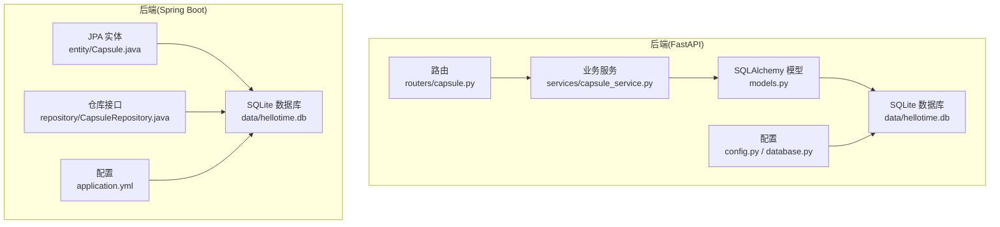
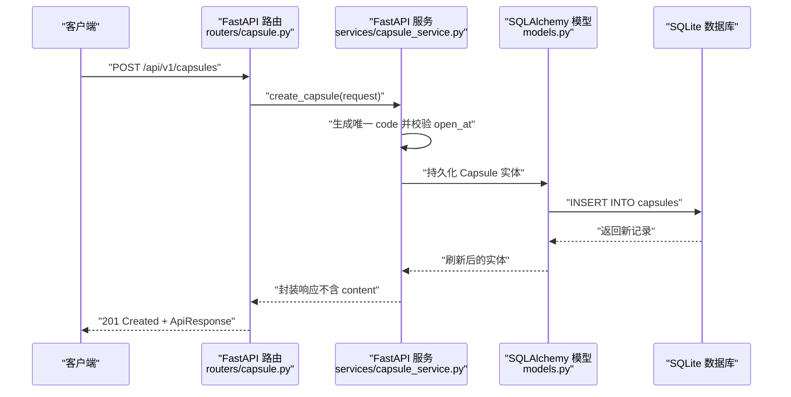
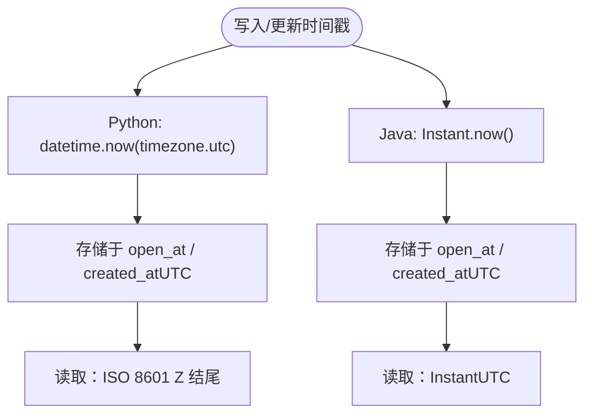
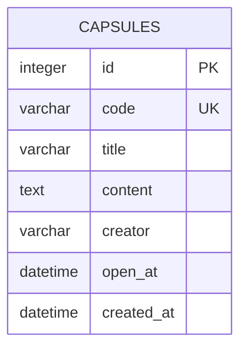
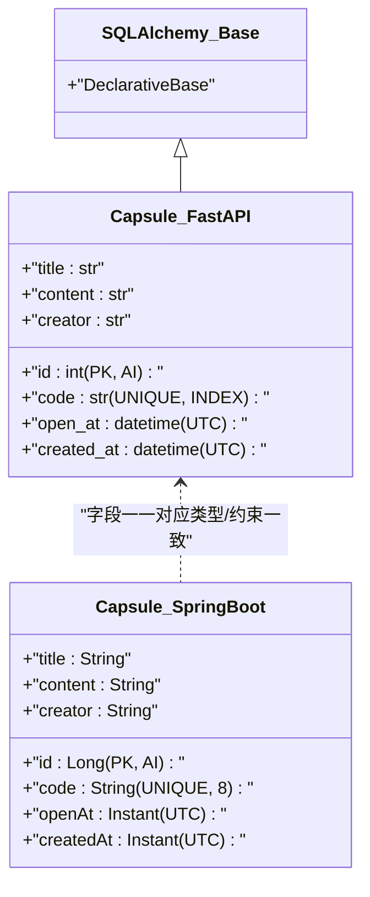
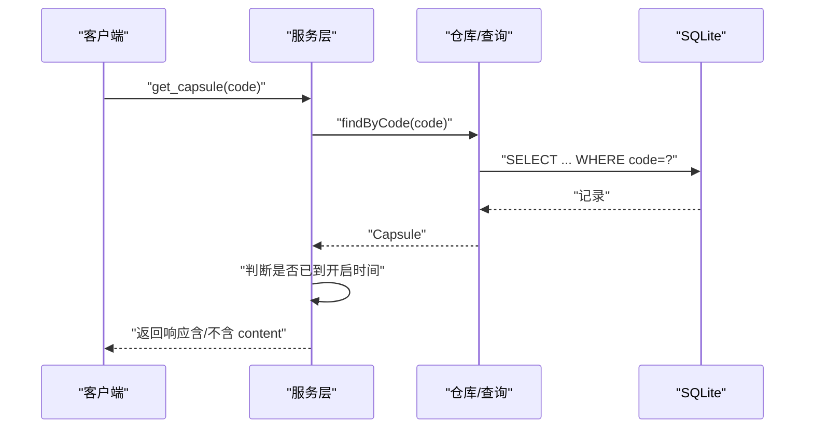
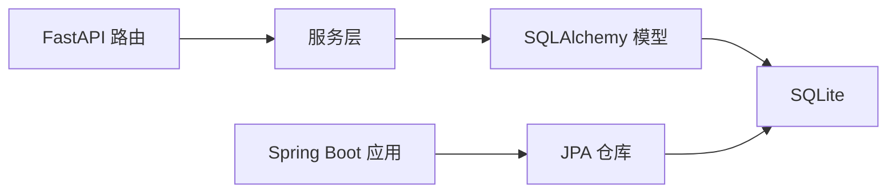

# 数据库设计

<cite>
**本文引用的文件**
- [models.py](file://backends/fastapi/app/models.py)
- [database.py](file://backends/fastapi/app/database.py)
- [config.py](file://backends/fastapi/app/config.py)
- [capsule.py](file://backends/fastapi/app/routers/capsule.py)
- [capsule_service.py](file://backends/fastapi/app/services/capsule_service.py)
- [Capsule.java](file://backends/spring-boot/src/main/java/com/hellotime/entity/Capsule.java)
- [CapsuleRepository.java](file://backends/spring-boot/src/main/java/com/hellotime/repository/CapsuleRepository.java)
- [application.yml](file://backends/spring-boot/src/main/resources/application.yml)
- [database-schema.md](file://docs/database-schema.md)
- [deployment.md](file://docs/deployment.md)
- [conftest.py](file://backends/fastapi/tests/conftest.py)
</cite>

## 目录
1. [简介](#简介)
2. [项目结构](#项目结构)
3. [核心组件](#核心组件)
4. [架构总览](#架构总览)
5. [详细组件分析](#详细组件分析)
6. [依赖分析](#依赖分析)
7. [性能考量](#性能考量)
8. [故障排查指南](#故障排查指南)
9. [结论](#结论)
10. [附录](#附录)

## 简介
本文件面向 HelloTime 项目，系统化阐述基于 SQLite 的数据库设计与实现要点，重点覆盖 capsules 表的字段定义、索引与约束、时间戳统一策略（UTC）、ORM 映射关系（SQLAlchemy 与 JPA），以及跨后端的一致数据模型说明。同时给出数据访问模式、查询优化建议、迁移与版本管理策略、SQLite 局限性与扩展性考虑，并提供针对不同后端的实现一致性指导。

## 项目结构
HelloTime 采用前后端分离与多后端并行的架构。数据库层以 SQLite 为核心，分别在 FastAPI（Python SQLAlchemy）与 Spring Boot（Java JPA/Hibernate）中落地实现，二者共享一致的表结构与业务规则，确保跨语言、跨平台的数据一致性。

图表来源
- [models.py:14-25](file://backends/fastapi/app/models.py#L14-L25)
- [database.py:11-20](file://backends/fastapi/app/database.py#L11-L20)
- [config.py:9](file://backends/fastapi/app/config.py#L9)
- [capsule.py:17-30](file://backends/fastapi/app/routers/capsule.py#L17-L30)
- [Capsule.java:10-57](file://backends/spring-boot/src/main/java/com/hellotime/entity/Capsule.java#L10-L57)
- [CapsuleRepository.java:15-47](file://backends/spring-boot/src/main/java/com/hellotime/repository/CapsuleRepository.java#L15-L47)
- [application.yml:4-11](file://backends/spring-boot/src/main/resources/application.yml#L4-L11)

章节来源
- [database-schema.md:1-48](file://docs/database-schema.md#L1-L48)
- [config.py:9](file://backends/fastapi/app/config.py#L9)
- [application.yml:4-11](file://backends/spring-boot/src/main/resources/application.yml#L4-L11)

## 核心组件
- 数据库引擎：SQLite（轻量、零配置，适合演示与小规模部署）
- 主表：capsules（时间胶囊）
- 关键字段：id、code、title、content、creator、open_at、created_at
- 约束与索引：code 唯一性约束；SQLAlchemy 在 code 上显式建立索引
- 时间策略：统一使用 UTC 时区（Python SQLAlchemy 使用带时区的 DateTime，Java JPA 使用 Instant）

章节来源
- [database-schema.md:3-24](file://docs/database-schema.md#L3-L24)
- [models.py:18-25](file://backends/fastapi/app/models.py#L18-L25)
- [Capsule.java:46-57](file://backends/spring-boot/src/main/java/com/hellotime/entity/Capsule.java#L46-L57)

## 架构总览
下图展示跨后端的数据库交互流程，强调统一的数据模型与一致的业务规则。

图表来源
- [capsule.py:17-24](file://backends/fastapi/app/routers/capsule.py#L17-L24)
- [capsule_service.py:79-102](file://backends/fastapi/app/services/capsule_service.py#L79-L102)
- [models.py:14-25](file://backends/fastapi/app/models.py#L14-L25)

## 详细组件分析

### capsules 表字段定义与约束
- id
  - 类型与约束：INTEGER PRIMARY KEY AUTOINCREMENT
  - 含义：自增主键，唯一标识每条记录
- code
  - 类型与约束：VARCHAR(8) NOT NULL UNIQUE；SQLAlchemy 显式建立索引
  - 含义：8 位唯一识别码（62 进制：A-Z a-z 0-9），用于公开分享与检索
- title
  - 类型与约束：VARCHAR(100) NOT NULL
  - 含义：胶囊标题
- content
  - 类型与约束：TEXT NOT NULL
  - 含义：胶囊内容；未到开启时间时不对外返回
- creator
  - 类型与约束：VARCHAR(30) NOT NULL
  - 含义：创建者昵称
- open_at
  - 类型与约束：DATETIME NOT NULL（UTC）
  - 含义：开启时间；仅到达该时刻后内容可被查看
- created_at
  - 类型与约束：DATETIME NOT NULL（UTC）
  - 含义：创建时间（Spring Boot 通过 @PrePersist 自动填充）

章节来源
- [database-schema.md:9-19](file://docs/database-schema.md#L9-L19)
- [models.py:18-25](file://backends/fastapi/app/models.py#L18-L25)
- [Capsule.java:24-25](file://backends/spring-boot/src/main/java/com/hellotime/entity/Capsule.java#L24-L25)
- [Capsule.java:50-57](file://backends/spring-boot/src/main/java/com/hellotime/entity/Capsule.java#L50-L57)

### 时间戳统一策略（UTC）
- Python（SQLAlchemy）：使用带时区的 DateTime，服务层在构造响应时统一转为 ISO 8601（末尾 Z 表示 UTC）
- Java（JPA）：使用 Instant（UTC），持久化前自动设置 created_at

图表来源
- [capsule_service.py:51-60](file://backends/fastapi/app/services/capsule_service.py#L51-L60)
- [Capsule.java:62-65](file://backends/spring-boot/src/main/java/com/hellotime/entity/Capsule.java#L62-L65)

章节来源
- [capsule_service.py:51-60](file://backends/fastapi/app/services/capsule_service.py#L51-L60)
- [Capsule.java:62-65](file://backends/spring-boot/src/main/java/com/hellotime/entity/Capsule.java#L62-L65)

### 索引与唯一性约束
- code 字段具备唯一性约束与索引，确保全局唯一性与高效查找
- SQLAlchemy 在模型中对 code 声明了 unique=True 与 index=True
- Spring Boot 通过 JPA 的 @Column(unique = true) 实现相同约束

图表来源
- [models.py:18-19](file://backends/fastapi/app/models.py#L18-L19)
- [Capsule.java:24](file://backends/spring-boot/src/main/java/com/hellotime/entity/Capsule.java#L24)
- [database-schema.md:21-23](file://docs/database-schema.md#L21-L23)

章节来源
- [models.py:18-19](file://backends/fastapi/app/models.py#L18-L19)
- [Capsule.java:24](file://backends/spring-boot/src/main/java/com/hellotime/entity/Capsule.java#L24)
- [database-schema.md:21-23](file://docs/database-schema.md#L21-L23)

### ORM 映射关系（SQLAlchemy 与 JPA）
- Python（SQLAlchemy）
  - DeclarativeBase 基类
  - Capsule 模型映射到 capsules 表
  - code 字段声明唯一与索引
- Java（JPA）
  - @Entity + @Table(name = "capsules")
  - @Column(unique = true, length = 8) 对应 code
  - @PrePersist 自动设置 created_at

图表来源
- [models.py:14-25](file://backends/fastapi/app/models.py#L14-L25)
- [Capsule.java:10-57](file://backends/spring-boot/src/main/java/com/hellotime/entity/Capsule.java#L10-L57)

章节来源
- [models.py:14-25](file://backends/fastapi/app/models.py#L14-L25)
- [Capsule.java:10-57](file://backends/spring-boot/src/main/java/com/hellotime/entity/Capsule.java#L10-L57)

### 数据访问模式与查询优化
- 创建胶囊
  - 生成唯一 code（最多重试固定次数）
  - 校验 open_at 必须在未来
  - 持久化后返回不含 content 的响应
- 查询胶囊
  - 按 code 查找；未到开启时间隐藏 content
  - 管理员视角可显示完整内容
- 列表与分页
  - 按 created_at 倒序分页（管理员）
- 查询优化建议
  - code 为唯一索引，按 code 查询具备高效率
  - created_at 倒序分页查询可通过索引优化
  - 避免 SELECT *，仅选择必要字段
  - 对高频过滤条件（如 open_at）可考虑复合索引（视业务扩展）

图表来源
- [capsule_service.py:105-111](file://backends/fastapi/app/services/capsule_service.py#L105-L111)
- [CapsuleRepository.java:23](file://backends/spring-boot/src/main/java/com/hellotime/repository/CapsuleRepository.java#L23)

章节来源
- [capsule_service.py:79-102](file://backends/fastapi/app/services/capsule_service.py#L79-L102)
- [capsule_service.py:105-111](file://backends/fastapi/app/services/capsule_service.py#L105-L111)
- [CapsuleRepository.java:23](file://backends/spring-boot/src/main/java/com/hellotime/repository/CapsuleRepository.java#L23)

### 数据迁移策略与版本管理
- 开发与测试
  - 测试使用内存 SQLite（StaticPool），每次测试前建表，结束后清理
- 生产与本地
  - SQLite 文件位于 data/hellotime.db（相对路径）
  - Spring Boot 通过 application.yml 指定 sqlite 数据源与方言
  - FastAPI 通过 DATABASE_URL 指向 SQLite 文件
- 迁移建议
  - SQLite 本身不支持在线 DDL（如添加非空列），建议采用“重建表 + 数据迁移”的离线策略
  - 使用 Alembic（SQLAlchemy）或 Flyway（JPA/Hibernate）进行版本化迁移
  - 迁移前备份 hellotime.db

章节来源
- [conftest.py:19-31](file://backends/fastapi/tests/conftest.py#L19-L31)
- [application.yml:4-11](file://backends/spring-boot/src/main/resources/application.yml#L4-L11)
- [config.py:9](file://backends/fastapi/app/config.py#L9)
- [deployment.md:109-112](file://docs/deployment.md#L109-L112)

### SQLite 局限性与扩展性考虑
- 局限性
  - 不支持在线 DDL（需重建表）
  - 并发写入受限（写锁影响）
  - 缺少高级特性（如窗口函数、复杂索引等）
- 扩展性
  - 小规模演示与内部部署足够
  - 若需更高并发或复杂查询，建议迁移到 PostgreSQL/MySQL
  - 通过 ORM 抽象层可平滑替换数据库方言

章节来源
- [database-schema.md:3-5](file://docs/database-schema.md#L3-L5)

## 依赖分析
- FastAPI
  - 路由依赖数据库会话工厂
  - 服务层依赖 SQLAlchemy 模型
- Spring Boot
  - 仓库接口继承 JpaRepository，自动获得 CRUD 与分页能力
  - 应用配置启用 SQLite 方言与自动建表

图表来源
- [capsule.py:10-12](file://backends/fastapi/app/routers/capsule.py#L10-L12)
- [capsule_service.py:13](file://backends/fastapi/app/services/capsule_service.py#L13)
- [models.py:11](file://backends/fastapi/app/models.py#L11)
- [application.yml:7-11](file://backends/spring-boot/src/main/resources/application.yml#L7-L11)
- [CapsuleRepository.java:15](file://backends/spring-boot/src/main/java/com/hellotime/repository/CapsuleRepository.java#L15)

章节来源
- [capsule.py:10-12](file://backends/fastapi/app/routers/capsule.py#L10-L12)
- [capsule_service.py:13](file://backends/fastapi/app/services/capsule_service.py#L13)
- [CapsuleRepository.java:15](file://backends/spring-boot/src/main/java/com/hellotime/repository/CapsuleRepository.java#L15)

## 性能考量
- 索引利用
  - code 唯一索引保障按识别码查询高效
  - created_at 倒序分页查询可借助索引减少排序成本
- 写入优化
  - 批量写入时合并事务，减少提交次数
  - 控制并发写入，避免长时间持有写锁
- 读取优化
  - 避免不必要的字段读取（未开启时隐藏 content）
  - 对管理员列表可一次性加载所需字段

## 故障排查指南
- 无法生成唯一 code
  - 现象：生成唯一码失败并抛出异常
  - 排查：检查唯一性冲突与重试上限
- 开启时间无效
  - 现象：创建时提示开启时间必须在未来
  - 排查：确认传入 open_at 是否为未来时间（UTC）
- 访问内容为空
  - 现象：未到开启时间时 content 为空
  - 排查：确认当前时间与 open_at 的时区一致性（均应为 UTC）
- 数据库文件损坏或权限问题
  - 现象：无法连接或读写失败
  - 排查：确认 data/hellotime.db 文件存在且权限正确；必要时备份恢复

章节来源
- [capsule_service.py:37-43](file://backends/fastapi/app/services/capsule_service.py#L37-L43)
- [capsule_service.py:81-84](file://backends/fastapi/app/services/capsule_service.py#L81-L84)
- [capsule_service.py:107-111](file://backends/fastapi/app/services/capsule_service.py#L107-L111)
- [deployment.md:109-112](file://docs/deployment.md#L109-L112)

## 结论
HelloTime 的数据库设计围绕 capsules 表展开，采用 SQLite 作为统一后端，通过 SQLAlchemy 与 JPA 实现跨语言一致的数据模型。code 字段的唯一性与索引、UTC 时间戳策略、以及清晰的业务访问模式共同确保了系统的可用性与一致性。对于生产扩展，建议引入版本化迁移工具并评估更高性能数据库以满足并发与复杂查询需求。

## 附录
- 建表参考（SQLite）
  - 参考文档中的建表 SQL，包含各字段类型、约束与注释
- 配置要点
  - FastAPI：DATABASE_URL 指向 data/hellotime.db
  - Spring Boot：application.yml 指定 sqlite 数据源与方言

章节来源
- [database-schema.md:33-45](file://docs/database-schema.md#L33-L45)
- [config.py:9](file://backends/fastapi/app/config.py#L9)
- [application.yml:4-11](file://backends/spring-boot/src/main/resources/application.yml#L4-L11)