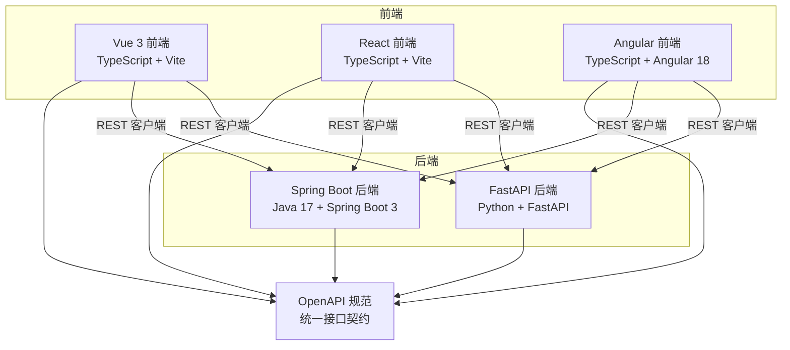
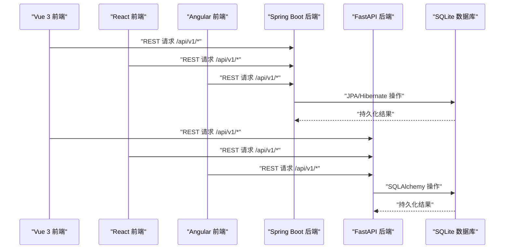
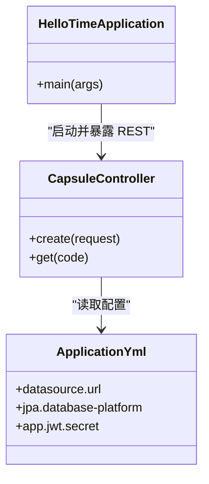
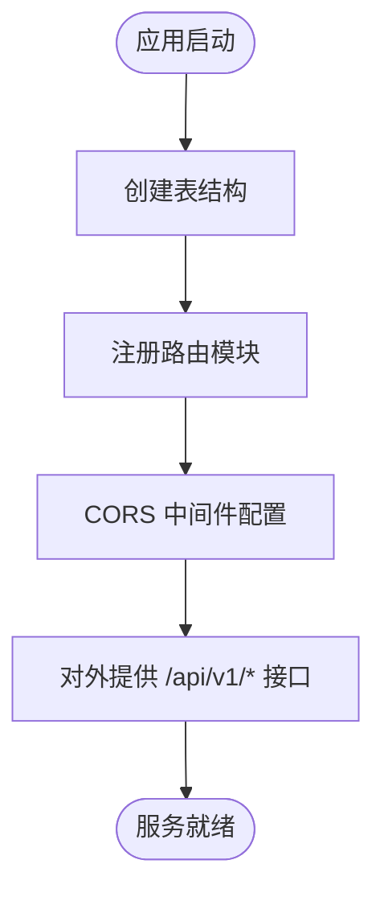
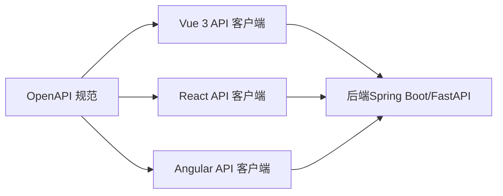
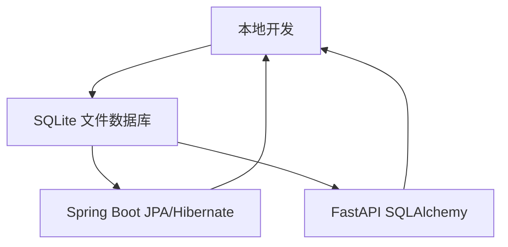
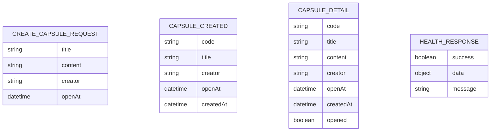
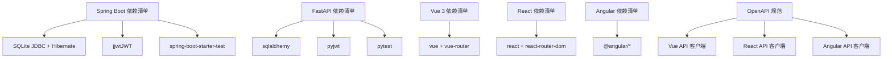

# 技术栈选择

<cite>
**本文引用的文件**
- [pom.xml](file://backends/spring-boot/pom.xml)
- [application.yml](file://backends/spring-boot/src/main/resources/application.yml)
- [HelloTimeApplication.java](file://backends/spring-boot/src/main/java/com/hellotime/HelloTimeApplication.java)
- [CapsuleController.java](file://backends/spring-boot/src/main/java/com/hellotime/controller/CapsuleController.java)
- [README.md（Spring Boot）](file://backends/spring-boot/README.md)
- [requirements.txt（FastAPI）](file://backends/fastapi/requirements.txt)
- [main.py（FastAPI）](file://backends/fastapi/app/main.py)
- [README.md（FastAPI）](file://backends/fastapi/README.md)
- [openapi.yaml](file://spec/api/openapi.yaml)
- [api-spec.md](file://docs/api-spec.md)
- [package.json（Vue 3）](file://frontends/vue3-ts/package.json)
- [package.json（React）](file://frontends/react-ts/package.json)
- [package.json（Angular）](file://frontends/angular-ts/package.json)
- [index.ts（Vue API 客户端）](file://frontends/vue3-ts/src/api/index.ts)
- [index.ts（React API 客户端）](file://frontends/react-ts/src/api/index.ts)
- [index.ts（Angular API 客户端）](file://frontends/angular-ts/src/app/api/index.ts)
- [README.md（Vue 3）](file://frontends/vue3-ts/README.md)
- [README.md（React）](file://frontends/react-ts/README.md)
- [README.md（Angular）](file://frontends/angular-ts/README.md)
</cite>

## 目录
1. [引言](#引言)
2. [项目结构](#项目结构)
3. [核心组件](#核心组件)
4. [架构总览](#架构总览)
5. [详细组件分析](#详细组件分析)
6. [依赖分析](#依赖分析)
7. [性能考量](#性能考量)
8. [故障排查指南](#故障排查指南)
9. [结论](#结论)
10. [附录](#附录)

## 引言
本文件旨在系统化阐述本项目的“技术栈选择决策”，围绕以下目标展开：
- 为什么选择 Spring Boot + Java 作为后端框架之一：企业级应用优势、生态完备性、性能与稳定性考量。
- 为什么选择 FastAPI + Python 作为另一个后端框架：开发效率、类型安全、异步支持与自动生成的 API 文档。
- 为什么选择 Vue 3、React、Angular 三个前端框架：各自的技术特点、学习曲线、社区支持与一致性保障。
- 为什么选择 SQLite 作为数据库：轻量、零配置、适合演示与本地开发。
- 为什么选择 OpenAPI 规范：API 文档自动化、客户端生成、标准化与互操作性。
- 技术选型的权衡与替代方案分析。

## 项目结构
项目采用“多后端 + 多前端 + 统一 API 规范”的架构设计，后端提供两套实现（Spring Boot 与 FastAPI），前端提供三套实现（Vue 3、React、Angular），并通过统一的 OpenAPI 规范与共享的类型/样式资源保证一致性。

图示来源
- [openapi.yaml:1-349](file://spec/api/openapi.yaml#L1-L349)
- [main.py（FastAPI）:19-34](file://backends/fastapi/app/main.py#L19-L34)
- [CapsuleController.java:17-56](file://backends/spring-boot/src/main/java/com/hellotime/controller/CapsuleController.java#L17-L56)
- [index.ts（Vue API 客户端）:19-119](file://frontends/vue3-ts/src/api/index.ts#L19-L119)
- [index.ts（React API 客户端）:14-93](file://frontends/react-ts/src/api/index.ts#L14-L93)
- [index.ts（Angular API 客户端）:10-70](file://frontends/angular-ts/src/app/api/index.ts#L10-L70)

章节来源
- [openapi.yaml:1-349](file://spec/api/openapi.yaml#L1-L349)
- [README.md（Spring Boot）:77-87](file://backends/spring-boot/README.md#L77-L87)
- [README.md（FastAPI）:99-116](file://backends/fastapi/README.md#L99-L116)
- [README.md（Vue 3）:51-83](file://frontends/vue3-ts/README.md#L51-L83)
- [README.md（React）:52-81](file://frontends/react-ts/README.md#L52-L81)
- [README.md（Angular）:34-51](file://frontends/angular-ts/README.md#L34-L51)

## 核心组件
- 后端实现（Spring Boot + Java）
  - 依赖与配置：Web、JPA、Validation、SQLite JDBC、Hibernate 社区方言、JWT（jjwt）、测试。
  - 运行与配置：Maven 插件打包；应用入口注解；SQLite 数据源与 JPA 方言；JWT 密钥与管理员密码通过环境变量注入。
  - 控制器：统一响应包装、参数校验、异常处理。
- 后端实现（FastAPI + Python）
  - 依赖与配置：FastAPI、Uvicorn、SQLAlchemy、PyJWT、HTTPX、Pytest。
  - 运行与配置：应用入口、CORS、全局异常处理器、统一响应格式。
- 前端实现（Vue 3 / React / Angular）
  - 依赖与配置：框架、路由、TypeScript、Vite、测试工具链。
  - API 客户端：统一的 fetch 封装、错误处理、认证头传递。
- 统一规范（OpenAPI）
  - 规范：OpenAPI 3.0.3；路径、参数、响应模型、安全方案（Bearer JWT）。
  - 文档：Swagger UI、ReDoc、JSON。

章节来源
- [pom.xml:25-80](file://backends/spring-boot/pom.xml#L25-L80)
- [application.yml:4-22](file://backends/spring-boot/src/main/resources/application.yml#L4-L22)
- [HelloTimeApplication.java:6-11](file://backends/spring-boot/src/main/java/com/hellotime/HelloTimeApplication.java#L6-L11)
- [CapsuleController.java:17-56](file://backends/spring-boot/src/main/java/com/hellotime/controller/CapsuleController.java#L17-L56)
- [requirements.txt:1-7](file://backends/fastapi/requirements.txt#L1-L7)
- [main.py（FastAPI）:19-89](file://backends/fastapi/app/main.py#L19-L89)
- [openapi.yaml:10-170](file://spec/api/openapi.yaml#L10-L170)
- [index.ts（Vue API 客户端）:19-119](file://frontends/vue3-ts/src/api/index.ts#L19-L119)
- [index.ts（React API 客户端）:14-93](file://frontends/react-ts/src/api/index.ts#L14-L93)
- [index.ts（Angular API 客户端）:10-70](file://frontends/angular-ts/src/app/api/index.ts#L10-L70)

## 架构总览
下图展示了“多后端 + 多前端 + 统一规范”的交互关系与数据流。

图示来源
- [openapi.yaml:10-170](file://spec/api/openapi.yaml#L10-L170)
- [CapsuleController.java:37-55](file://backends/spring-boot/src/main/java/com/hellotime/controller/CapsuleController.java#L37-L55)
- [main.py（FastAPI）:31-34](file://backends/fastapi/app/main.py#L31-L34)
- [application.yml:4-11](file://backends/spring-boot/src/main/resources/application.yml#L4-L11)

## 详细组件分析

### Spring Boot + Java 技术栈选择
- 企业级应用优势
  - Spring 生态成熟、模块化清晰、依赖注入与 AOP 完善，适合中大型团队协作与长期维护。
  - Spring Boot 提供开箱即用的自动配置与内嵌服务器，降低部署复杂度。
- 生态系统完善性
  - Web、JPA、Validation、测试、Actuator 等 Starter 丰富，结合 Maven 管理依赖。
  - SQLite + Hibernate 方言适配良好，便于本地开发与演示。
- 性能与稳定性
  - JVM 启动时间与内存占用相对较高，但具备成熟的 GC 与线程模型；对本项目体量而言足够稳定。
  - 通过统一响应、参数校验、全局异常处理提升健壮性。
- 与本项目契合点
  - 依赖清单覆盖 Web、JPA、Validation、JWT、测试；配置文件集中管理数据源、JPA、JWT、管理员密码等。
  - 控制器层统一响应包装，符合 OpenAPI 规范的数据结构。

图示来源
- [HelloTimeApplication.java:6-11](file://backends/spring-boot/src/main/java/com/hellotime/HelloTimeApplication.java#L6-L11)
- [CapsuleController.java:17-56](file://backends/spring-boot/src/main/java/com/hellotime/controller/CapsuleController.java#L17-L56)
- [application.yml:4-22](file://backends/spring-boot/src/main/resources/application.yml#L4-L22)

章节来源
- [pom.xml:25-80](file://backends/spring-boot/pom.xml#L25-L80)
- [application.yml:4-22](file://backends/spring-boot/src/main/resources/application.yml#L4-L22)
- [README.md（Spring Boot）:13-20](file://backends/spring-boot/README.md#L13-L20)
- [CapsuleController.java:17-56](file://backends/spring-boot/src/main/java/com/hellotime/controller/CapsuleController.java#L17-L56)

### FastAPI + Python 技术栈选择
- 开发效率
  - 类型提示与 Pydantic 模式自动校验，减少样板代码；异步支持与高性能 ASGI 服务器（Uvicorn）。
- 类型安全
  - Python 类型注解与 Pydantic 模型共同保证请求/响应结构正确性。
- 异步支持与文档
  - 基于 Starlette 的异步能力；自动生成 OpenAPI/Swagger/ReDoc 文档。
- 与本项目契合点
  - 依赖清单包含 FastAPI、SQLAlchemy、PyJWT、HTTPX、Pytest；应用入口注册路由与中间件，统一异常处理与响应格式。

图示来源
- [main.py（FastAPI）:16-34](file://backends/fastapi/app/main.py#L16-L34)

章节来源
- [requirements.txt:1-7](file://backends/fastapi/requirements.txt#L1-L7)
- [README.md（FastAPI）:13-20](file://backends/fastapi/README.md#L13-L20)
- [main.py（FastAPI）:19-89](file://backends/fastapi/app/main.py#L19-L89)

### 前端技术栈选择（Vue 3 / React / Angular）
- Vue 3
  - Composition API、TypeScript、Vite、路由与测试工具链完善；组件化与类型安全兼顾。
  - API 客户端统一封装，便于与后端交互与错误处理。
- React
  - 函数式组件、Hooks、TypeScript、Vite、路由与测试工具链完善；生态活跃、学习资源丰富。
  - API 客户端与 Vue/React 保持一致的契约与行为。
- Angular
  - Angular 18 独立组件、Signals 响应式、路由懒加载；与 Vue/React 共享 API 客户端与设计系统。
  - 服务层（Signals）与测试（Karma + Jasmine）体系完整。
- 一致性保障
  - 三个前端实现共享同一 OpenAPI 规范与 API 客户端封装，确保行为一致、维护成本低。

图示来源
- [openapi.yaml:10-170](file://spec/api/openapi.yaml#L10-L170)
- [index.ts（Vue API 客户端）:19-119](file://frontends/vue3-ts/src/api/index.ts#L19-L119)
- [index.ts（React API 客户端）:14-93](file://frontends/react-ts/src/api/index.ts#L14-L93)
- [index.ts（Angular API 客户端）:10-70](file://frontends/angular-ts/src/app/api/index.ts#L10-L70)

章节来源
- [package.json（Vue 3）:6-28](file://frontends/vue3-ts/package.json#L6-L28)
- [package.json（React）:6-29](file://frontends/react-ts/package.json#L6-L29)
- [package.json（Angular）:5-37](file://frontends/angular-ts/package.json#L5-L37)
- [README.md（Vue 3）:5-21](file://frontends/vue3-ts/README.md#L5-L21)
- [README.md（React）:5-21](file://frontends/react-ts/README.md#L5-L21)
- [README.md（Angular）:26-32](file://frontends/angular-ts/README.md#L26-L32)

### 数据库选择（SQLite）
- 轻量与零配置
  - 无需安装额外服务，直接使用 JDBC/SQLAlchemy 连接本地文件数据库，适合演示与本地开发。
- 与后端集成
  - Spring Boot 使用 SQLite JDBC 与 Hibernate 社区方言；FastAPI 使用 SQLAlchemy 连接 SQLite。
- 适用场景
  - 本项目以演示与教学为主，SQLite 足够满足数据持久化需求。

图示来源
- [application.yml:4-11](file://backends/spring-boot/src/main/resources/application.yml#L4-L11)
- [requirements.txt:3](file://backends/fastapi/requirements.txt#L3)

章节来源
- [application.yml:4-11](file://backends/spring-boot/src/main/resources/application.yml#L4-L11)
- [README.md（Spring Boot）:109-112](file://backends/spring-boot/README.md#L109-L112)
- [requirements.txt:3](file://backends/fastapi/requirements.txt#L3)
- [README.md（FastAPI）:9](file://backends/fastapi/README.md#L9)

### API 规范选择（OpenAPI）
- 标准化与自动化
  - 明确的路径、参数、响应模型与安全方案（Bearer JWT），自动生成 Swagger UI/ReDoc。
- 客户端生成与一致性
  - 三套前端共享同一规范，确保 API 客户端行为一致；便于后续生成 SDK 或文档。
- 与后端契约
  - 后端控制器与异常处理均遵循统一响应格式与错误码约定。

图示来源
- [openapi.yaml:172-349](file://spec/api/openapi.yaml#L172-L349)

章节来源
- [openapi.yaml:1-349](file://spec/api/openapi.yaml#L1-L349)
- [api-spec.md:1-195](file://docs/api-spec.md#L1-L195)

## 依赖分析
- 后端依赖
  - Spring Boot：Web、JPA、Validation、测试。
  - FastAPI：FastAPI、Uvicorn、SQLAlchemy、PyJWT、HTTPX、Pytest。
- 前端依赖
  - Vue 3 / React：框架、路由、TypeScript、Vite、测试工具链。
  - Angular：Angular 核心、路由、RxJS、测试工具链。
- 统一依赖
  - OpenAPI 规范驱动前后端契约；API 客户端封装统一错误处理与认证头。

图示来源
- [pom.xml:25-80](file://backends/spring-boot/pom.xml#L25-L80)
- [requirements.txt:1-7](file://backends/fastapi/requirements.txt#L1-L7)
- [package.json（Vue 3）:13-28](file://frontends/vue3-ts/package.json#L13-L28)
- [package.json（React）:13-29](file://frontends/react-ts/package.json#L13-L29)
- [package.json（Angular）:11-37](file://frontends/angular-ts/package.json#L11-L37)
- [openapi.yaml:10-170](file://spec/api/openapi.yaml#L10-L170)

章节来源
- [pom.xml:25-80](file://backends/spring-boot/pom.xml#L25-L80)
- [requirements.txt:1-7](file://backends/fastapi/requirements.txt#L1-L7)
- [package.json（Vue 3）:13-28](file://frontends/vue3-ts/package.json#L13-L28)
- [package.json（React）:13-29](file://frontends/react-ts/package.json#L13-L29)
- [package.json（Angular）:11-37](file://frontends/angular-ts/package.json#L11-L37)

## 性能考量
- 启动与资源占用
  - Spring Boot（JVM）与 FastAPI（Python）均具备较短启动时间；SQLite 本地文件数据库避免网络延迟。
- 并发与吞吐
  - FastAPI 的异步模型与 Uvicorn 在高并发场景更具弹性；Spring Boot 在传统企业环境中稳定可靠。
- 开发体验
  - FastAPI 的自动生成文档与类型安全显著提升开发效率；Spring Boot 的自动配置与 Actuator 便于运维监控。
- 本项目建议
  - 以演示与教学为主，SQLite 与两套后端实现足以满足性能需求；如需扩展，可评估引入缓存与连接池。

## 故障排查指南
- 后端常见问题
  - Spring Boot：数据库连接 URL 与驱动类名配置错误、JPA 方言不匹配、JWT 密钥长度不足。
  - FastAPI：CORS 配置导致跨域失败、统一异常处理未覆盖特定异常类型。
- 前端常见问题
  - API 基础路径未正确设置、认证头缺失、日期格式转换错误。
- 统一规范与日志
  - OpenAPI 规范与统一响应格式有助于快速定位问题；建议在网关或代理层记录请求与响应摘要。

章节来源
- [application.yml:4-22](file://backends/spring-boot/src/main/resources/application.yml#L4-L22)
- [main.py（FastAPI）:21-29](file://backends/fastapi/app/main.py#L21-L29)
- [index.ts（Vue API 客户端）:19-37](file://frontends/vue3-ts/src/api/index.ts#L19-L37)
- [index.ts（React API 客户端）:14-31](file://frontends/react-ts/src/api/index.ts#L14-L31)
- [index.ts（Angular API 客户端）:10-27](file://frontends/angular-ts/src/app/api/index.ts#L10-L27)

## 结论
本项目通过“多后端 + 多前端 + 统一规范”的技术栈组合，实现了：
- 后端：Spring Boot（企业级稳健）与 FastAPI（高效与类型安全）双轨并行；
- 前端：Vue 3、React、Angular 三种主流框架并存，满足不同团队偏好；
- 数据库：SQLite 轻量易用，适配演示与本地开发；
- 规范：OpenAPI 统一契约，保障文档自动化与客户端一致性。

该组合在教学、演示与快速原型阶段具备高性价比与强可维护性，同时为后续扩展（如引入缓存、微服务拆分、容器化部署）预留空间。

## 附录
- 替代方案与权衡
  - 后端：Node.js（Express/Koa/NestJS）可进一步提升异步性能；Go 微服务适合高并发场景；但会增加学习与运维成本。
  - 前端：SvelteKit、SolidJS、Next.js 等各有特色，但本项目已通过 Vue/React/Angular 覆盖主流生态。
  - 数据库：MySQL/PostgreSQL 更适合生产环境；SQLite 适合演示与本地开发。
  - 规范：GraphQL 可提供更灵活查询，但会增加客户端与文档复杂度；OpenAPI 更贴合本项目 REST 风格与统一响应格式。
- 最佳实践
  - 保持 OpenAPI 规范与后端实现同步演进；
  - 前端 API 客户端与类型定义集中管理；
  - 通过 CI/CD 自动化测试与文档生成。