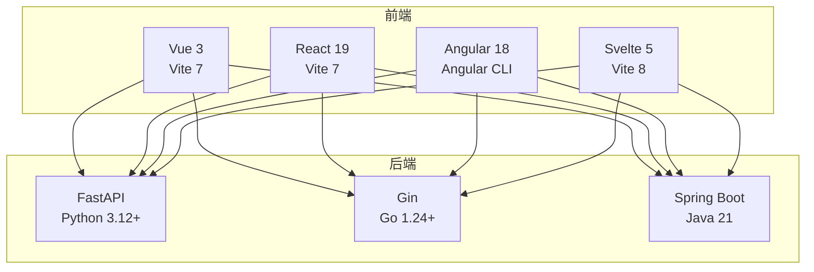
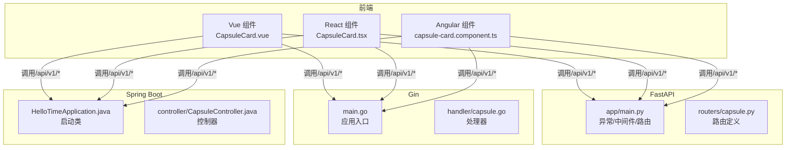
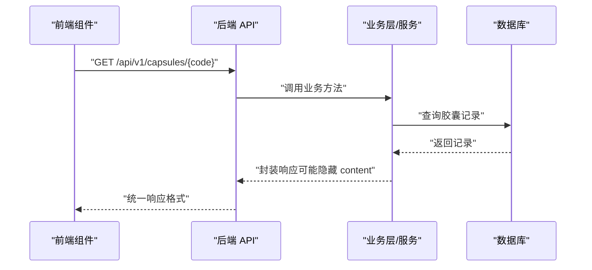

# 技术选型分析

<cite>
**本文引用的文件**
- [README.md](file://README.md)
- [backend-comparison.md](file://docs/backend-comparison.md)
- [frontend-comparison.md](file://docs/frontend-comparison.md)
- [fastapi/README.md](file://backends/fastapi/README.md)
- [gin/README.md](file://backends/gin/README.md)
- [spring-boot/README.md](file://backends/spring-boot/README.md)
- [backends/fastapi/app/main.py](file://backends/fastapi/app/main.py)
- [backends/fastapi/app/routers/capsule.py](file://backends/fastapi/app/routers/capsule.py)
- [backends/gin/main.go](file://backends/gin/main.go)
- [backends/gin/handler/capsule.go](file://backends/gin/handler/capsule.go)
- [backends/spring-boot/src/main/java/com/hellotime/HelloTimeApplication.java](file://backends/spring-boot/src/main/java/com/hellotime/HelloTimeApplication.java)
- [backends/spring-boot/src/main/java/com/hellotime/controller/CapsuleController.java](file://backends/spring-boot/src/main/java/com/hellotime/controller/CapsuleController.java)
- [frontends/vue3-ts/package.json](file://frontends/vue3-ts/package.json)
- [frontends/react-ts/package.json](file://frontends/react-ts/package.json)
- [frontends/angular-ts/package.json](file://frontends/angular-ts/package.json)
- [frontends/svelte-ts/package.json](file://frontends/svelte-ts/package.json)
- [frontends/vue3-ts/src/components/CapsuleCard.vue](file://frontends/vue3-ts/src/components/CapsuleCard.vue)
- [frontends/react-ts/src/components/CapsuleCard.tsx](file://frontends/react-ts/src/components/CapsuleCard.tsx)
- [frontends/angular-ts/src/app/components/capsule-card/capsule-card.component.ts](file://frontends/angular-ts/src/app/components/capsule-card/capsule-card.component.ts)
</cite>

## 目录
1. [引言](#引言)
2. [项目结构](#项目结构)
3. [核心组件](#核心组件)
4. [架构总览](#架构总览)
5. [详细组件分析](#详细组件分析)
6. [依赖关系分析](#依赖关系分析)
7. [性能考量](#性能考量)
8. [故障排查指南](#故障排查指南)
9. [结论](#结论)
10. [附录](#附录)

## 引言
本项目通过统一的 API 规范与设计系统，展示了四种前端框架（Vue 3、React 19、Angular 18、Svelte 5）与三种后端技术栈（FastAPI、Gin、Spring Boot）的自由组合能力。本文围绕技术特点、性能表现、开发效率、生态成熟度、社区支持、技术债务与迁移成本、长期维护与升级路径等方面展开系统性分析，帮助团队在不同阶段做出稳健的技术选型。

## 项目结构
项目采用“前后端完全解耦”的组织方式，后端与前端分别独立开发、独立运行，通过统一的 REST API 交互。后端提供三套实现，前端提供四套实现，均可与任意后端组合使用。

图表来源
- [README.md:37-63](file://README.md#L37-L63)
- [README.md:18-31](file://README.md#L18-L31)

章节来源
- [README.md:16-63](file://README.md#L16-L63)

## 核心组件
- 后端统一提供健康检查、胶囊 CRUD、管理员登录与管理等接口，响应格式统一，便于前后端对接。
- 前端统一使用设计令牌与路由约定，保证视觉与交互一致性。
- 后端实现对比与前端对比文档提供了横向比较维度与结论，便于选型参考。

章节来源
- [README.md:219-232](file://README.md#L219-L232)
- [backend-comparison.md:1-72](file://docs/backend-comparison.md#L1-L72)
- [frontend-comparison.md:1-64](file://docs/frontend-comparison.md#L1-L64)

## 架构总览
后端采用分层或模块化结构，路由注册、异常处理、CORS 配置集中管理；前端采用组件化架构，路由与状态管理清晰，测试工具链完善。

图表来源
- [backends/fastapi/app/main.py:1-89](file://backends/fastapi/app/main.py#L1-L89)
- [backends/fastapi/app/routers/capsule.py:1-31](file://backends/fastapi/app/routers/capsule.py#L1-L31)
- [backends/gin/main.go:1-32](file://backends/gin/main.go#L1-L32)
- [backends/gin/handler/capsule.go:1-56](file://backends/gin/handler/capsule.go#L1-L56)
- [backends/spring-boot/src/main/java/com/hellotime/HelloTimeApplication.java:1-12](file://backends/spring-boot/src/main/java/com/hellotime/HelloTimeApplication.java#L1-L12)
- [backends/spring-boot/src/main/java/com/hellotime/controller/CapsuleController.java:1-57](file://backends/spring-boot/src/main/java/com/hellotime/controller/CapsuleController.java#L1-L57)
- [frontends/vue3-ts/src/components/CapsuleCard.vue:1-89](file://frontends/vue3-ts/src/components/CapsuleCard.vue#L1-L89)
- [frontends/react-ts/src/components/CapsuleCard.tsx:1-54](file://frontends/react-ts/src/components/CapsuleCard.tsx#L1-L54)
- [frontends/angular-ts/src/app/components/capsule-card/capsule-card.component.ts:1-27](file://frontends/angular-ts/src/app/components/capsule-card/capsule-card.component.ts#L1-L27)

## 详细组件分析

### 后端技术栈对比与选型建议
- FastAPI（Python 3.12+）
  - 特点：异步高性能、自动生成 OpenAPI 文档、Pydantic 数据校验、类型提示完善、开发体验佳。
  - 适用场景：快速原型、中小型项目、需要强类型与自动文档的团队。
  - 性能：异步 I/O 与 Uvicorn 在高并发下表现优秀。
  - 开发效率：装饰器路由、依赖注入、自动校验与文档一体化，迭代速度快。
  - 章节来源
    - [fastapi/README.md:1-176](file://backends/fastapi/README.md#L1-L176)
    - [backends/fastapi/app/main.py:1-89](file://backends/fastapi/app/main.py#L1-L89)
    - [backends/fastapi/app/routers/capsule.py:1-31](file://backends/fastapi/app/routers/capsule.py#L1-L31)

- Gin（Go 1.24+）
  - 特点：轻量、高性能、编译型语言、天然并发 goroutines、错误处理显式。
  - 适用场景：对性能敏感、需要轻量化部署、微服务或边缘计算。
  - 性能：吞吐量高、内存占用低，适合高并发场景。
  - 开发效率：结构清晰、路由与处理器分离，测试完备。
  - 章节来源
    - [gin/README.md:1-171](file://backends/gin/README.md#L1-L171)
    - [backends/gin/main.go:1-32](file://backends/gin/main.go#L1-L32)
    - [backends/gin/handler/capsule.go:1-56](file://backends/gin/handler/capsule.go#L1-L56)

- Spring Boot（Java 21）
  - 特点：企业级生态完善、注解驱动、依赖注入、全局异常处理、JPA ORM。
  - 适用场景：大型团队、复杂业务、需要长期演进的企业系统。
  - 性能：虚拟线程提升 I/O 密集型并发能力，启动时间较长但功能完备。
  - 开发效率：注解与 DI 提升解耦，但样板代码较多。
  - 章节来源
    - [spring-boot/README.md:1-136](file://backends/spring-boot/README.md#L1-L136)
    - [backends/spring-boot/src/main/java/com/hellotime/HelloTimeApplication.java:1-12](file://backends/spring-boot/src/main/java/com/hellotime/HelloTimeApplication.java#L1-L12)
    - [backends/spring-boot/src/main/java/com/hellotime/controller/CapsuleController.java:1-57](file://backends/spring-boot/src/main/java/com/hellotime/controller/CapsuleController.java#L1-L57)

- 代码量与性能对比（LoC 与 DX）
  - FastAPI 最精简，Gin 居中，Spring Boot 最多但解耦程度高。
  - 性能潜力：Gin 吞吐量最高，Spring Boot（Java 21）借助虚拟线程提升并发，FastAPI 异步能力强。
  - 章节来源
    - [backend-comparison.md:43-71](file://docs/backend-comparison.md#L43-L71)

### 前端框架对比与选型建议
- Vue 3（Vite 7）
  - 特点：SFC + Composition API，逻辑与模板聚合，TypeScript 支持良好，生态成熟。
  - 适用场景：追求开发体验与性能平衡的团队。
  - 章节来源
    - [frontends/vue3-ts/package.json:1-30](file://frontends/vue3-ts/package.json#L1-L30)
    - [frontends/vue3-ts/src/components/CapsuleCard.vue:1-89](file://frontends/vue3-ts/src/components/CapsuleCard.vue#L1-L89)

- React 19（Vite 7）
  - 特点：函数组件 + Hooks，灵活但样板代码较多，CSS Modules 隔离样式。
  - 适用场景：生态最丰富、招聘容易、灵活性优先的团队。
  - 章节来源
    - [frontends/react-ts/package.json:1-31](file://frontends/react-ts/package.json#L1-L31)
    - [frontends/react-ts/src/components/CapsuleCard.tsx:1-54](file://frontends/react-ts/src/components/CapsuleCard.tsx#L1-L54)

- Angular 18（Angular CLI）
  - 特点：强约束、模块化、依赖注入、RxJS 与 HttpClient，适合大型团队。
  - 适用场景：需要强约束与长期维护的企业级应用。
  - 章节来源
    - [frontends/angular-ts/package.json:1-38](file://frontends/angular-ts/package.json#L1-L38)
    - [frontends/angular-ts/src/app/components/capsule-card/capsule-card.component.ts:1-27](file://frontends/angular-ts/src/app/components/capsule-card/capsule-card.component.ts#L1-L27)

- Svelte 5（Vite 8）
  - 特点：Runes API、真响应式、无虚拟 DOM、代码量最少、编译时优化。
  - 适用场景：追求极致性能与最小代码量的项目。
  - 章节来源
    - [frontends/svelte-ts/package.json:1-21](file://frontends/svelte-ts/package.json#L1-L21)

- 代码简洁度与 LoC
  - Svelte 5 最少，Vue 3 次之，React 中等，Angular 最多。
  - 章节来源
    - [frontend-comparison.md:28-56](file://docs/frontend-comparison.md#L28-L56)

### API 调用流程（以胶囊查询为例）

图表来源
- [backends/fastapi/app/routers/capsule.py:27-31](file://backends/fastapi/app/routers/capsule.py#L27-L31)
- [backends/gin/handler/capsule.go:40-56](file://backends/gin/handler/capsule.go#L40-L56)
- [backends/spring-boot/src/main/java/com/hellotime/controller/CapsuleController.java:44-56](file://backends/spring-boot/src/main/java/com/hellotime/controller/CapsuleController.java#L44-L56)

## 依赖关系分析
- 后端依赖管理
  - FastAPI：pip + requirements.txt
  - Gin：Go Modules（go.mod）
  - Spring Boot：Maven（pom.xml）
- 前端依赖管理
  - Vue 3：npm（package.json）
  - React 19：npm（package.json）
  - Angular 18：npm（package.json）
  - Svelte 5：npm（package.json）

章节来源
- [fastapi/README.md:28-39](file://backends/fastapi/README.md#L28-L39)
- [gin/README.md:26-30](file://backends/gin/README.md#L26-L30)
- [spring-boot/README.md:28-36](file://backends/spring-boot/README.md#L28-L36)
- [frontends/vue3-ts/package.json:1-30](file://frontends/vue3-ts/package.json#L1-L30)
- [frontends/react-ts/package.json:1-31](file://frontends/react-ts/package.json#L1-L31)
- [frontends/angular-ts/package.json:1-38](file://frontends/angular-ts/package.json#L1-L38)
- [frontends/svelte-ts/package.json:1-21](file://frontends/svelte-ts/package.json#L1-L21)

## 性能考量
- 并发模型
  - FastAPI：异步 I/O（Uvicorn/Starlette）
  - Gin：goroutines 天然并发
  - Spring Boot（Java 21）：虚拟线程提升并发上限
- 数据持久化
  - FastAPI：SQLAlchemy 2.0
  - Gin：GORM
  - Spring Boot：Spring Data JPA/Hibernate
- 开发体验（DX）
  - FastAPI：类型提示 + 自动文档 + 异步，开发迭代最快
  - Gin：编译型语言 + 轻量，适合极致性能与部署
  - Spring Boot：生态丰富，复杂业务与企业特性完备
- 章节来源
  - [backend-comparison.md:56-71](file://docs/backend-comparison.md#L56-L71)

## 故障排查指南
- 常见错误码与响应格式
  - 统一响应字段：success、data、message、errorCode
  - 常见错误码：VALIDATION_ERROR、CAPSULE_NOT_FOUND、UNAUTHORIZED、BAD_REQUEST
- 后端异常处理
  - FastAPI：全局异常处理器统一返回标准格式
  - Gin：Handler 层显式返回错误
  - Spring Boot：全局 @RestControllerAdvice
- 前端调试建议
  - 使用浏览器网络面板检查 API 响应
  - 校验 JWT Token 是否正确传递
  - 章节来源
    - [README.md:248-264](file://README.md#L248-L264)
    - [backends/fastapi/app/main.py:37-89](file://backends/fastapi/app/main.py#L37-L89)
    - [backends/gin/handler/capsule.go:20-56](file://backends/gin/handler/capsule.go#L20-L56)
    - [backends/spring-boot/src/main/java/com/hellotime/controller/CapsuleController.java:37-56](file://backends/spring-boot/src/main/java/com/hellotime/controller/CapsuleController.java#L37-L56)

## 结论
- 若追求“极简开发与自动文档”，优先选择 FastAPI。
- 若追求“极致性能与轻量化”，优先选择 Gin。
- 若构建“复杂、严谨、需要长期维护的企业系统”，优先选择 Spring Boot。
- 前端方面，若追求“生态最丰富与招聘便利”，优先选择 React；若追求“开发体验与性能平衡”，优先选择 Vue 3；若追求“极致性能与最小代码量”，优先选择 Svelte 5；若构建“超大规模企业应用”，优先选择 Angular。

## 附录
- 技术升级路径与替代方案
  - 后端：从 FastAPI/Gin/Spring Boot 中任一迁移到其他，需关注统一 API 规范与响应格式；升级语言版本（如 Java 21 → 22、Go 1.24 → 1.25）时注意兼容性。
  - 前端：从 Vue/React/Angular/Svelte 任一迁移到其他，需替换路由与状态管理模式；升级构建工具（Vite 7 → 8）时注意插件与配置变更。
- 技术债务评估
  - FastAPI：代码量少、迭代快，但需持续关注 Pydantic/SQLAlchemy 版本更新。
  - Gin：结构清晰、错误显式，需注意 Go 错误处理风格与并发安全。
  - Spring Boot：注解与 DI 解耦良好，但样板代码多，需加强代码生成与模板复用。
- 迁移成本
  - 同构迁移（同语言栈内）：中低
  - 跨语言迁移（如从 Python 到 Go）：较高，需重写路由、服务与数据层
  - 跨框架迁移（如从 Vue 到 React）：中等，需调整组件与状态管理
- 长期维护
  - 统一 API 规范与设计系统降低维护成本
  - 持续集成与测试覆盖保障质量
  - 章节来源
    - [README.md:283-311](file://README.md#L283-L311)