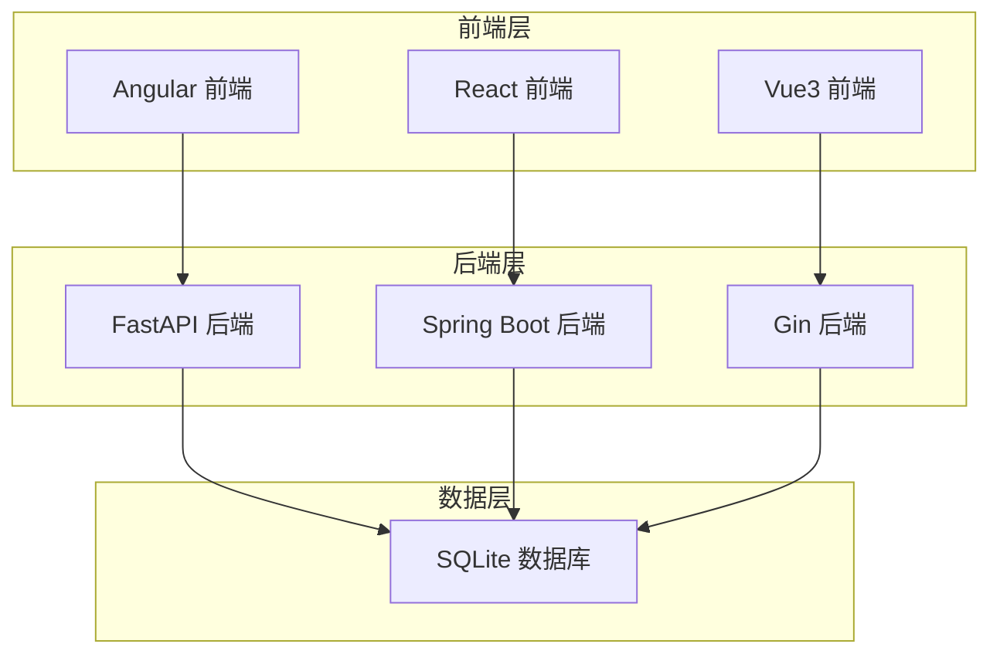
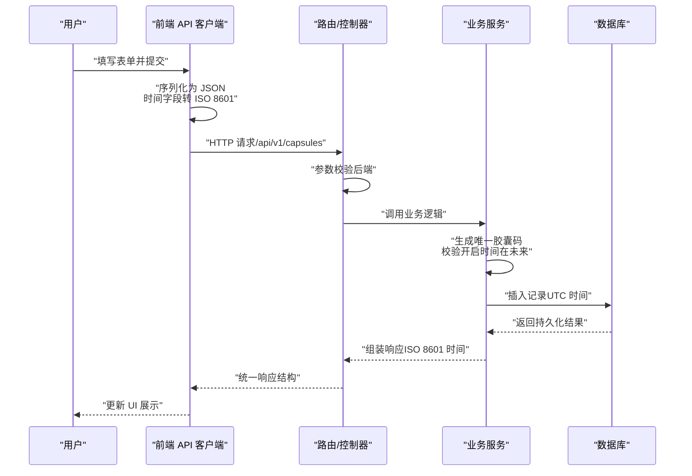
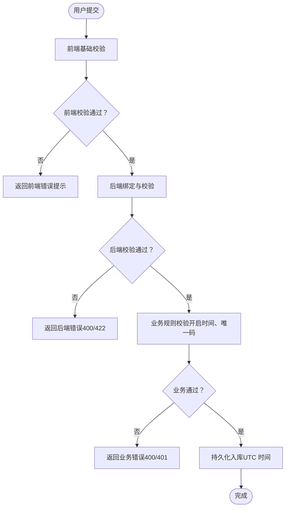
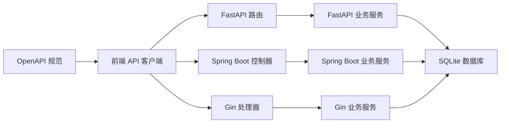

# 数据流架构分析

<cite>
**本文档引用的文件**
- [backends/fastapi/app/main.py](file://backends/fastapi/app/main.py)
- [backends/fastapi/app/routers/capsule.py](file://backends/fastapi/app/routers/capsule.py)
- [backends/fastapi/app/schemas.py](file://backends/fastapi/app/schemas.py)
- [backends/fastapi/app/models.py](file://backends/fastapi/app/models.py)
- [backends/fastapi/app/services/capsule_service.py](file://backends/fastapi/app/services/capsule_service.py)
- [backends/spring-boot/src/main/java/com/hellotime/HelloTimeApplication.java](file://backends/spring-boot/src/main/java/com/hellotime/HelloTimeApplication.java)
- [backends/spring-boot/src/main/java/com/hellotime/controller/CapsuleController.java](file://backends/spring-boot/src/main/java/com/hellotime/controller/CapsuleController.java)
- [backends/spring-boot/src/main/java/com/hellotime/service/CapsuleService.java](file://backends/spring-boot/src/main/java/com/hellotime/service/CapsuleService.java)
- [backends/gin/main.go](file://backends/gin/main.go)
- [backends/gin/handler/capsule.go](file://backends/gin/handler/capsule.go)
- [frontends/react-ts/src/api/index.ts](file://frontends/react-ts/src/api/index.ts)
- [frontends/vue3-ts/src/api/index.ts](file://frontends/vue3-ts/src/api/index.ts)
- [frontends/angular-ts/src/app/services/capsule.service.ts](file://frontends/angular-ts/src/app/services/capsule.service.ts)
- [docs/database-schema.md](file://docs/database-schema.md)
- [spec/api/openapi.yaml](file://spec/api/openapi.yaml)
</cite>

## 目录
1. [简介](#简介)
2. [项目结构](#项目结构)
3. [核心组件](#核心组件)
4. [架构总览](#架构总览)
5. [详细组件分析](#详细组件分析)
6. [依赖分析](#依赖分析)
7. [性能考量](#性能考量)
8. [故障排查指南](#故障排查指南)
9. [结论](#结论)
10. [附录](#附录)

## 简介
本文件针对 HelloTime 项目进行数据流架构分析，覆盖从前端用户输入到后端处理、数据库持久化，再到前端展示的完整链路；解释验证层次（前端、后端、数据库约束）的协同机制；梳理序列化与反序列化流程（时间格式转换、编码处理、字段映射）；阐述缓存策略设计（读写一致性、失效与性能优化）；并给出数据安全建议（敏感信息保护、传输加密、存储加密）以及监控与调试方法。

## 项目结构
HelloTime 采用多后端（FastAPI、Spring Boot、Gin）与多前端（Angular、React、Vue3、Svelte）的对比实现，便于横向比较不同技术栈的数据流设计与约束落地。核心数据实体为“时间胶囊”，围绕其创建、查询、管理员管理等能力构建 API 与数据模型。

图表来源
- [backends/fastapi/app/main.py:19-34](file://backends/fastapi/app/main.py#L19-L34)
- [backends/spring-boot/src/main/java/com/hellotime/HelloTimeApplication.java:6-11](file://backends/spring-boot/src/main/java/com/hellotime/HelloTimeApplication.java#L6-L11)
- [backends/gin/main.go:15-31](file://backends/gin/main.go#L15-L31)
- [docs/database-schema.md:5](file://docs/database-schema.md#L5)

章节来源
- [backends/fastapi/app/main.py:19-34](file://backends/fastapi/app/main.py#L19-L34)
- [backends/spring-boot/src/main/java/com/hellotime/HelloTimeApplication.java:6-11](file://backends/spring-boot/src/main/java/com/hellotime/HelloTimeApplication.java#L6-L11)
- [backends/gin/main.go:15-31](file://backends/gin/main.go#L15-L31)
- [docs/database-schema.md:5](file://docs/database-schema.md#L5)

## 核心组件
- 前端 API 客户端：统一封装请求、错误处理与 JSON 序列化，负责将用户输入转换为后端期望的契约格式（含时间字段的 ISO 8601 序列化）。
- 后端路由与控制器：接收请求、执行参数校验、调用业务服务、返回统一响应结构。
- 业务服务：实现核心业务规则（如胶囊码生成、开启时间校验、内容可见性控制）。
- 数据模型与序列化：Pydantic/Spring DTO/Go DTO 统一响应结构，时间字段按 ISO 8601 字符串输出。
- 数据库：SQLite，使用唯一索引保证胶囊码唯一性，统一存储 UTC 时间。

章节来源
- [frontends/react-ts/src/api/index.ts:14-31](file://frontends/react-ts/src/api/index.ts#L14-L31)
- [frontends/vue3-ts/src/api/index.ts:19-37](file://frontends/vue3-ts/src/api/index.ts#L19-L37)
- [backends/fastapi/app/routers/capsule.py:17-30](file://backends/fastapi/app/routers/capsule.py#L17-L30)
- [backends/spring-boot/src/main/java/com/hellotime/controller/CapsuleController.java:37-54](file://backends/spring-boot/src/main/java/com/hellotime/controller/CapsuleController.java#L37-L54)
- [backends/gin/handler/capsule.go:19-55](file://backends/gin/handler/capsule.go#L19-L55)
- [backends/fastapi/app/schemas.py:26-44](file://backends/fastapi/app/schemas.py#L26-L44)
- [backends/spring-boot/src/main/java/com/hellotime/service/CapsuleService.java:52-73](file://backends/spring-boot/src/main/java/com/hellotime/service/CapsuleService.java#L52-L73)
- [docs/database-schema.md:11-19](file://docs/database-schema.md#L11-L19)

## 架构总览
下图展示了从用户输入到数据库存储再到前端展示的完整数据流，涵盖验证、序列化、业务处理与持久化环节。

图表来源
- [frontends/react-ts/src/api/index.ts:37-45](file://frontends/react-ts/src/api/index.ts#L37-L45)
- [backends/fastapi/app/routers/capsule.py:17-24](file://backends/fastapi/app/routers/capsule.py#L17-L24)
- [backends/spring-boot/src/main/java/com/hellotime/controller/CapsuleController.java:37-42](file://backends/spring-boot/src/main/java/com/hellotime/controller/CapsuleController.java#L37-L42)
- [backends/gin/handler/capsule.go:19-38](file://backends/gin/handler/capsule.go#L19-L38)
- [backends/fastapi/app/services/capsule_service.py:79-102](file://backends/fastapi/app/services/capsule_service.py#L79-L102)
- [backends/spring-boot/src/main/java/com/hellotime/service/CapsuleService.java:52-73](file://backends/spring-boot/src/main/java/com/hellotime/service/CapsuleService.java#L52-L73)
- [docs/database-schema.md:11-19](file://docs/database-schema.md#L11-L19)

## 详细组件分析

### 前端数据流与序列化
- 统一请求封装：基于 fetch 的通用请求函数，设置 Content-Type 为 application/json，并对响应进行统一校验（HTTP 状态与业务 success 字段），失败时抛出错误。
- 时间字段处理：在创建胶囊时，将本地时间转换为 ISO 8601 字符串再发送，确保后端解析一致性。
- 错误处理：当响应 success=false 或 HTTP 非 2xx 时，抛出错误，便于上层捕获与 UI 提示。

章节来源
- [frontends/react-ts/src/api/index.ts:14-31](file://frontends/react-ts/src/api/index.ts#L14-L31)
- [frontends/react-ts/src/api/index.ts:37-45](file://frontends/react-ts/src/api/index.ts#L37-L45)
- [frontends/vue3-ts/src/api/index.ts:19-37](file://frontends/vue3-ts/src/api/index.ts#L19-L37)
- [frontends/vue3-ts/src/api/index.ts:46-54](file://frontends/vue3-ts/src/api/index.ts#L46-L54)
- [frontends/angular-ts/src/app/services/capsule.service.ts:11-24](file://frontends/angular-ts/src/app/services/capsule.service.ts#L11-L24)

### 后端验证与路由
- FastAPI：路由层接收请求并调用服务；全局异常处理器统一处理校验错误、未授权、值错误与通用异常，返回统一 ApiResponse 结构。
- Spring Boot：控制器使用 @Valid 进行参数校验；服务层进一步校验开启时间在未来；管理员接口通过 Bearer 认证。
- Gin：处理器使用 ShouldBindJSON 进行绑定与校验，错误时返回统一错误结构。

章节来源
- [backends/fastapi/app/main.py:58-89](file://backends/fastapi/app/main.py#L58-L89)
- [backends/fastapi/app/routers/capsule.py:17-30](file://backends/fastapi/app/routers/capsule.py#L17-L30)
- [backends/spring-boot/src/main/java/com/hellotime/controller/CapsuleController.java:37-54](file://backends/spring-boot/src/main/java/com/hellotime/controller/CapsuleController.java#L37-L54)
- [backends/gin/handler/capsule.go:19-55](file://backends/gin/handler/capsule.go#L19-L55)

### 业务服务与数据模型
- 生成唯一胶囊码：多后端均实现安全随机生成与碰撞检测（最多重试若干次），确保 code 唯一性。
- 开启时间校验：要求 openAt 在未来，否则拒绝创建。
- 内容可见性：查询详情时，若未到开启时间则不返回 content 字段；管理员视图可查看全部内容。
- 响应序列化：统一将时间字段序列化为 ISO 8601 字符串（Z 结尾表示 UTC），确保跨时区一致性。

章节来源
- [backends/fastapi/app/services/capsule_service.py:32-43](file://backends/fastapi/app/services/capsule_service.py#L32-L43)
- [backends/fastapi/app/services/capsule_service.py:79-102](file://backends/fastapi/app/services/capsule_service.py#L79-L102)
- [backends/fastapi/app/services/capsule_service.py:105-111](file://backends/fastapi/app/services/capsule_service.py#L105-L111)
- [backends/spring-boot/src/main/java/com/hellotime/service/CapsuleService.java:125-133](file://backends/spring-boot/src/main/java/com/hellotime/service/CapsuleService.java#L125-L133)
- [backends/spring-boot/src/main/java/com/hellotime/service/CapsuleService.java:52-73](file://backends/spring-boot/src/main/java/com/hellotime/service/CapsuleService.java#L52-L73)
- [backends/spring-boot/src/main/java/com/hellotime/service/CapsuleService.java:83-87](file://backends/spring-boot/src/main/java/com/hellotime/service/CapsuleService.java#L83-L87)
- [backends/gin/handler/capsule.go:27-35](file://backends/gin/handler/capsule.go#L27-L35)

### 数据库与约束
- 数据库：SQLite，零配置，适合演示与小规模部署。
- 表结构：capsules 表包含 code、title、content、creator、open_at、created_at 等字段；code 设为唯一索引。
- 约束：后端通过代码保证唯一性与开启时间校验，数据库层面通过唯一约束保障一致性。

章节来源
- [docs/database-schema.md:5](file://docs/database-schema.md#L5)
- [docs/database-schema.md:11-19](file://docs/database-schema.md#L11-L19)

### API 规范与契约
- OpenAPI：定义了统一的 API 路径、参数、响应与错误码，明确时间字段格式为 date-time（ISO 8601），管理员接口使用 Bearer 认证。
- 响应结构：统一使用 ApiResponse 包裹 data/message/errorCode，便于前端一致处理。

章节来源
- [spec/api/openapi.yaml:10-74](file://spec/api/openapi.yaml#L10-L74)
- [spec/api/openapi.yaml:172-349](file://spec/api/openapi.yaml#L172-L349)

### 数据验证层次结构
- 前端验证：输入格式与必填项的基础校验（由各前端自行实现），减少无效请求。
- 后端验证：路由层与控制器层的参数校验（FastAPI 的 Pydantic、Spring 的 @Valid、Gin 的 ShouldBindJSON），确保数据类型与范围正确。
- 数据库约束：唯一索引与 NOT NULL 约束，防止重复与空值进入系统。

图表来源
- [frontends/react-ts/src/api/index.ts:14-31](file://frontends/react-ts/src/api/index.ts#L14-L31)
- [backends/fastapi/app/routers/capsule.py:17-24](file://backends/fastapi/app/routers/capsule.py#L17-L24)
- [backends/spring-boot/src/main/java/com/hellotime/controller/CapsuleController.java:37-42](file://backends/spring-boot/src/main/java/com/hellotime/controller/CapsuleController.java#L37-L42)
- [backends/gin/handler/capsule.go:19-38](file://backends/gin/handler/capsule.go#L19-L38)
- [backends/fastapi/app/services/capsule_service.py:79-84](file://backends/fastapi/app/services/capsule_service.py#L79-L84)
- [backends/spring-boot/src/main/java/com/hellotime/service/CapsuleService.java:54-57](file://backends/spring-boot/src/main/java/com/hellotime/service/CapsuleService.java#L54-L57)
- [docs/database-schema.md:11-19](file://docs/database-schema.md#L11-L19)

### 序列化与反序列化流程
- 输入序列化：前端将日期转换为 ISO 8601 字符串（UTC），避免时区偏差。
- 后端反序列化：FastAPI 使用 Pydantic 的 field_validator 支持 ISO 8601 字符串或 datetime 对象；Spring Boot 使用 Instant/Date-Time API；Gin 接收 JSON 并交由服务层处理。
- 输出序列化：统一将时间字段序列化为 ISO 8601 字符串（Z 结尾），确保前端一致解析。

章节来源
- [frontends/react-ts/src/api/index.ts:46-54](file://frontends/react-ts/src/api/index.ts#L46-L54)
- [backends/fastapi/app/schemas.py:34-44](file://backends/fastapi/app/schemas.py#L34-L44)
- [backends/spring-boot/src/main/java/com/hellotime/service/CapsuleService.java:167-177](file://backends/spring-boot/src/main/java/com/hellotime/service/CapsuleService.java#L167-L177)
- [backends/fastapi/app/services/capsule_service.py:49-76](file://backends/fastapi/app/services/capsule_service.py#L49-L76)

### 缓存策略设计
- 读写一致性：当前实现未显式引入缓存层，读取直接命中数据库，确保强一致。
- 缓存建议：对只读详情查询可引入短期缓存（如 TTL=5-10 分钟），热点数据可预热；写入后主动失效相关缓存键。
- 性能优化：结合数据库索引（code 唯一索引）、分页查询（Spring Boot 已使用 PageRequest）与合理的查询条件，减少不必要的扫描。

章节来源
- [docs/database-schema.md:23](file://docs/database-schema.md#L23)
- [backends/spring-boot/src/main/java/com/hellotime/service/CapsuleService.java:97-104](file://backends/spring-boot/src/main/java/com/hellotime/service/CapsuleService.java#L97-L104)

### 数据安全考虑
- 传输加密：建议在生产环境启用 HTTPS，确保前后端通信加密。
- 存储加密：SQLite 文件可配合文件系统权限与加密工具；敏感字段（如管理员口令）应仅在内存中处理，不落盘明文。
- 认证与授权：管理员接口使用 Bearer Token；建议在网关层增加速率限制与 WAF。
- 敏感信息保护：避免在日志中打印请求体与响应体；对错误信息进行脱敏处理。

## 依赖分析
- 前端依赖后端 API 约定（OpenAPI），统一响应结构与时间格式。
- 后端依赖数据库约束与业务规则，确保数据完整性与一致性。
- 多后端实现共享同一 API 规范，便于替换与扩展。

图表来源
- [spec/api/openapi.yaml:10-74](file://spec/api/openapi.yaml#L10-L74)
- [frontends/react-ts/src/api/index.ts:14-31](file://frontends/react-ts/src/api/index.ts#L14-L31)
- [backends/fastapi/app/routers/capsule.py:17-30](file://backends/fastapi/app/routers/capsule.py#L17-L30)
- [backends/spring-boot/src/main/java/com/hellotime/controller/CapsuleController.java:37-54](file://backends/spring-boot/src/main/java/com/hellotime/controller/CapsuleController.java#L37-L54)
- [backends/gin/handler/capsule.go:19-55](file://backends/gin/handler/capsule.go#L19-L55)
- [docs/database-schema.md:11-19](file://docs/database-schema.md#L11-L19)

## 性能考量
- 数据库层面：利用 code 唯一索引进行快速查找；分页查询避免一次性加载大量数据。
- 业务层面：生成唯一码时的重试次数有限，避免长时间阻塞；查询详情时根据开启时间决定是否返回大字段 content。
- 前端层面：合理使用信号/状态管理（Angular Signal、React/Vue 状态）减少不必要渲染；对高频请求进行去抖/节流。

章节来源
- [docs/database-schema.md:23](file://docs/database-schema.md#L23)
- [backends/spring-boot/src/main/java/com/hellotime/service/CapsuleService.java:97-104](file://backends/spring-boot/src/main/java/com/hellotime/service/CapsuleService.java#L97-L104)
- [frontends/angular-ts/src/app/services/capsule.service.ts:7-9](file://frontends/angular-ts/src/app/services/capsule.service.ts#L7-L9)

## 故障排查指南
- 统一错误响应：后端使用统一 ApiResponse 结构，前端统一处理 data.success 与 message 字段，便于定位问题。
- 异常处理：FastAPI 提供全局异常处理器，覆盖校验错误、值错误与通用异常，返回标准错误码。
- 日志与追踪：建议在后端增加请求 ID 与访问日志，结合数据库慢查询日志定位性能瓶颈。
- 前端调试：在 API 客户端中打印请求与响应摘要，确认时间字段是否正确序列化为 ISO 8601。

章节来源
- [frontends/react-ts/src/api/index.ts:26-31](file://frontends/react-ts/src/api/index.ts#L26-L31)
- [backends/fastapi/app/main.py:58-89](file://backends/fastapi/app/main.py#L58-L89)
- [spec/api/openapi.yaml:336-349](file://spec/api/openapi.yaml#L336-L349)

## 结论
HelloTime 的数据流在多后端与多前端的对比实现中，保持了高度一致的 API 约定与数据契约。通过前端基础校验、后端严格校验与数据库约束的三层防护，确保数据质量与一致性。时间字段采用 ISO 8601（UTC）统一处理，避免时区与解析差异带来的问题。当前未引入缓存层，读写一致性得到保障；后续可根据业务增长引入缓存与索引优化，同时强化传输与存储安全。

## 附录
- API 规范参考：OpenAPI 文档定义了请求/响应结构、认证方式与错误码。
- 数据库设计参考：SQLite 表结构与索引设计，确保唯一性与查询效率。

章节来源
- [spec/api/openapi.yaml:10-74](file://spec/api/openapi.yaml#L10-L74)
- [docs/database-schema.md:11-19](file://docs/database-schema.md#L11-L19)