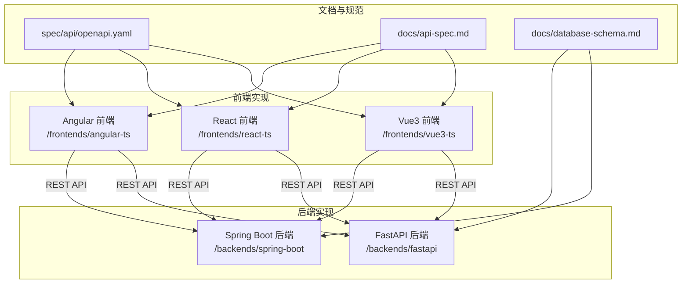
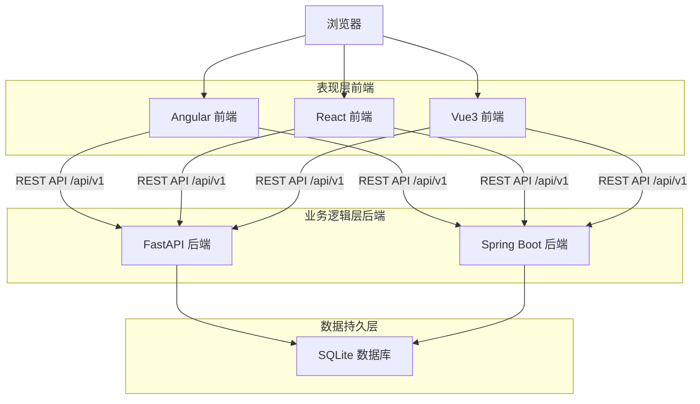
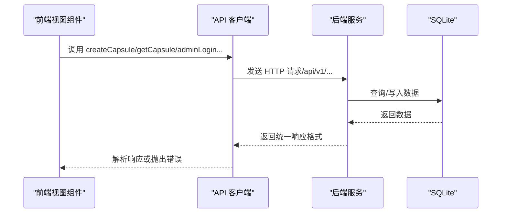
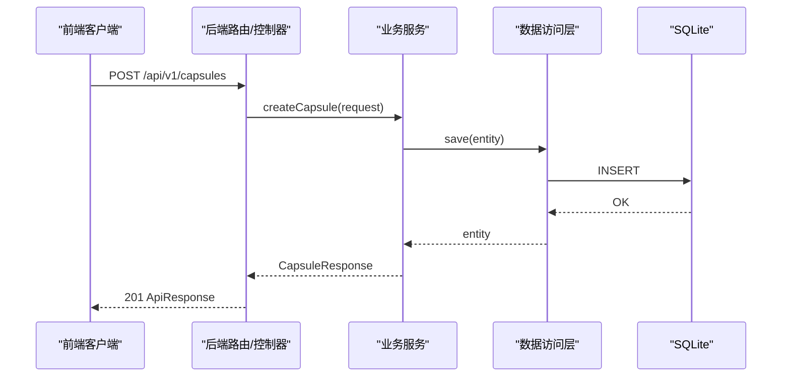
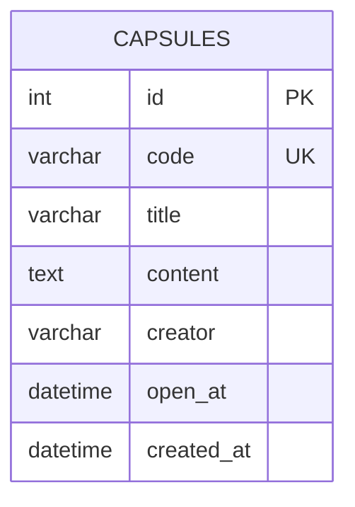
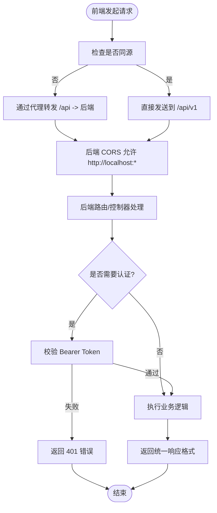
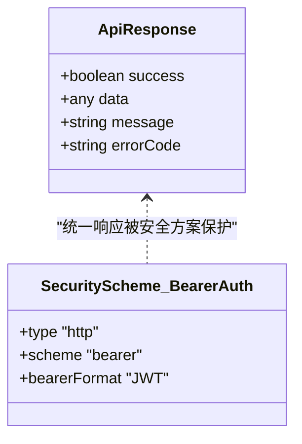
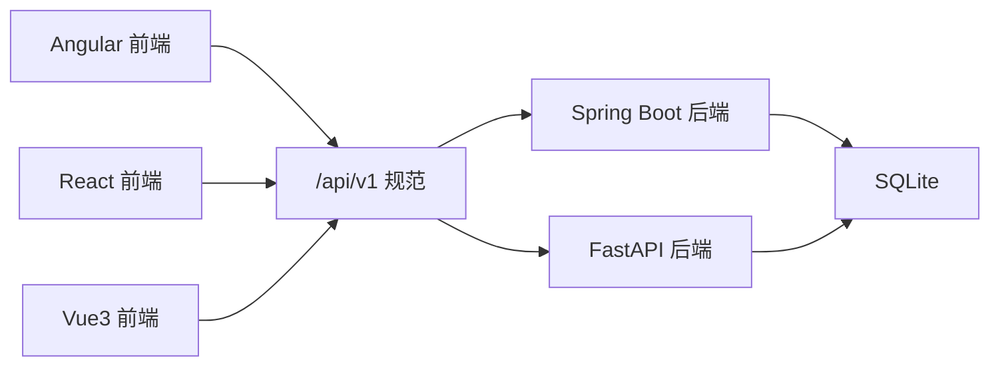

# 整体架构

<cite>
**本文引用的文件**
- [README.md](file://README.md)
- [api-spec.md](file://docs/api-spec.md)
- [database-schema.md](file://docs/database-schema.md)
- [openapi.yaml](file://spec/api/openapi.yaml)
- [proxy.conf.json](file://frontends/angular-ts/proxy.conf.json)
- [application.yml](file://backends/spring-boot/src/main/resources/application.yml)
- [HelloTimeApplication.java](file://backends/spring-boot/src/main/java/com/hellotime/HelloTimeApplication.java)
- [main.py](file://backends/fastapi/app/main.py)
- [capsule.py](file://backends/fastapi/app/routers/capsule.py)
- [CapsuleController.java](file://backends/spring-boot/src/main/java/com/hellotime/controller/CapsuleController.java)
- [index.ts（Angular API 客户端）](file://frontends/angular-ts/src/app/api/index.ts)
- [index.ts（React API 客户端）](file://frontends/react-ts/src/api/index.ts)
- [index.ts（Vue3 API 客户端）](file://frontends/vue3-ts/src/api/index.ts)
- [README.md（FastAPI 后端）](file://backends/fastapi/README.md)
- [README.md（Spring Boot 后端）](file://backends/spring-boot/README.md)
- [README.md（Angular 前端）](file://frontends/angular-ts/README.md)
- [README.md（React 前端）](file://frontends/react-ts/README.md)
- [README.md（Vue3 前端）](file://frontends/vue3-ts/README.md)
</cite>

## 目录
1. [简介](#简介)
2. [项目结构](#项目结构)
3. [核心组件](#核心组件)
4. [架构总览](#架构总览)
5. [详细组件分析](#详细组件分析)
6. [依赖分析](#依赖分析)
7. [性能考虑](#性能考虑)
8. [故障排查指南](#故障排查指南)
9. [结论](#结论)
10. [附录](#附录)

## 简介
HelloTime 是一个“类似 RealWorld”的技术展示应用，通过统一的 API 规范与可复用的前端样式，演示不同前后端技术栈的组合能力。项目采用前后端分离架构，表现层提供三种前端框架实现（Angular、React、Vue3），业务逻辑层提供两种后端框架实现（Spring Boot、FastAPI），数据持久层统一使用 SQLite。项目强调多框架并存与统一 API 规范，确保不同前端框架与后端的兼容性。

## 项目结构
项目采用按层与按功能混合的组织方式：
- 文档与规范：docs/（API 规范、数据库设计、部署说明）、spec/（OpenAPI 规范、共享样式）
- 前端：frontends/ 下的三个框架实现，均共享 API 客户端与类型定义
- 后端：backends/ 下的两个框架实现，分别对应 FastAPI 与 Spring Boot
- 脚本：scripts/（开发/构建/测试脚本）

图表来源
- [README.md:18-34](file://README.md#L18-L34)
- [openapi.yaml:1-20](file://spec/api/openapi.yaml#L1-L20)
- [api-spec.md:1-20](file://docs/api-spec.md#L1-L20)
- [database-schema.md:1-10](file://docs/database-schema.md#L1-L10)

章节来源
- [README.md:1-50](file://README.md#L1-L50)

## 核心组件
- 统一 API 规范：以 OpenAPI 3.0.3 为核心，定义了统一的端点、请求/响应模型与错误码，确保前后端一致的契约。
- 前端 API 客户端：Angular/React/Vue3 三个前端实现共享同一套 API 客户端封装，统一使用 /api/v1 基础路径与统一响应格式。
- 后端路由与控制器：FastAPI 与 Spring Boot 分别实现相同的路由与业务逻辑，保证对外接口一致。
- 数据持久层：统一使用 SQLite，Spring Boot 通过 JPA/Hibernate 管理表结构，FastAPI 通过 SQLAlchemy 初始化表。
- 跨域与认证：后端配置 CORS，前端通过代理或直接访问后端；管理员登录返回 JWT，后续请求携带 Bearer Token。

章节来源
- [openapi.yaml:10-164](file://spec/api/openapi.yaml#L10-L164)
- [api-spec.md:1-195](file://docs/api-spec.md#L1-L195)
- [README.md:146-213](file://README.md#L146-L213)

## 架构总览
系统采用典型的前后端分离架构，前端通过 REST API 与后端通信，后端负责业务逻辑与数据持久化。多框架并存的设计通过统一的 API 规范与共享样式实现解耦与复用。

图表来源
- [README.md:1-50](file://README.md#L1-L50)
- [openapi.yaml:7-9](file://spec/api/openapi.yaml#L7-L9)
- [application.yml:4-6](file://backends/spring-boot/src/main/resources/application.yml#L4-L6)
- [main.py:16-17](file://backends/fastapi/app/main.py#L16-L17)

## 详细组件分析

### 前端 API 客户端（Angular/React/Vue3）
三个前端实现共享统一的 API 客户端封装，统一处理：
- 基础路径：/api/v1
- Content-Type：application/json
- 统一错误处理：当响应 success=false 或 HTTP 非 2xx 时抛出错误
- 管理员认证：通过 Authorization: Bearer <token> 传递 JWT

图表来源
- [index.ts（Angular API 客户端）:10-27](file://frontends/angular-ts/src/app/api/index.ts#L10-L27)
- [index.ts（React API 客户端）:14-31](file://frontends/react-ts/src/api/index.ts#L14-L31)
- [index.ts（Vue3 API 客户端）:19-37](file://frontends/vue3-ts/src/api/index.ts#L19-L37)

章节来源
- [index.ts（Angular API 客户端）:1-71](file://frontends/angular-ts/src/app/api/index.ts#L1-L71)
- [index.ts（React API 客户端）:1-94](file://frontends/react-ts/src/api/index.ts#L1-L94)
- [index.ts（Vue3 API 客户端）:1-120](file://frontends/vue3-ts/src/api/index.ts#L1-L120)

### 后端路由与控制器（FastAPI/Spring Boot）
- FastAPI：通过路由模块注册 /api/v1/capsules、/api/v1/admin/* 与 /health，全局异常处理器统一错误响应。
- Spring Boot：通过控制器暴露相同路径，使用 ResponseEntity 返回统一响应格式，JPA 管理实体与表结构。

图表来源
- [capsule.py:17-24](file://backends/fastapi/app/routers/capsule.py#L17-L24)
- [CapsuleController.java:37-42](file://backends/spring-boot/src/main/java/com/hellotime/controller/CapsuleController.java#L37-L42)
- [application.yml:4-11](file://backends/spring-boot/src/main/resources/application.yml#L4-L11)

章节来源
- [capsule.py:1-31](file://backends/fastapi/app/routers/capsule.py#L1-L31)
- [CapsuleController.java:1-57](file://backends/spring-boot/src/main/java/com/hellotime/controller/CapsuleController.java#L1-L57)
- [README.md（FastAPI 后端）:76-98](file://backends/fastapi/README.md#L76-L98)
- [README.md（Spring Boot 后端）:54-76](file://backends/spring-boot/README.md#L54-L76)

### 数据持久层（SQLite）
- 数据库引擎：SQLite，零配置，适合演示与小规模部署。
- 表结构：capsules 表，包含 code、title、content、creator、open_at、created_at 等字段，code 唯一且长度为 8 的 Base62 编码。
- ORM/ODM：FastAPI 使用 SQLAlchemy 初始化表；Spring Boot 使用 JPA/Hibernate 自动管理表结构（ddl-auto: update）。

图表来源
- [database-schema.md:9-24](file://docs/database-schema.md#L9-L24)
- [application.yml:4-11](file://backends/spring-boot/src/main/resources/application.yml#L4-L11)

章节来源
- [database-schema.md:1-48](file://docs/database-schema.md#L1-L48)
- [application.yml:1-22](file://backends/spring-boot/src/main/resources/application.yml#L1-L22)

### 跨域与认证（CORS 与 JWT）
- CORS：FastAPI 使用 CORSMiddleware，允许 http://localhost:* 的来源，支持常用方法与凭证。
- 代理：Angular 通过 proxy.conf.json 将 /api 代理到后端地址，避免本地开发时的跨域问题。
- 认证：管理员登录返回 JWT，后续请求在请求头中携带 Authorization: Bearer <token>。

图表来源
- [main.py:21-29](file://backends/fastapi/app/main.py#L21-L29)
- [proxy.conf.json:1-8](file://frontends/angular-ts/proxy.conf.json#L1-L8)
- [openapi.yaml:166-171](file://spec/api/openapi.yaml#L166-L171)

章节来源
- [main.py:1-89](file://backends/fastapi/app/main.py#L1-L89)
- [README.md（Angular 前端）:94-102](file://frontends/angular-ts/README.md#L94-L102)
- [README.md（FastAPI 后端）:60-74](file://backends/fastapi/README.md#L60-L74)
- [README.md（Spring Boot 后端）:40-52](file://backends/spring-boot/README.md#L40-L52)

### 统一 API 规范与错误码
- 统一响应格式：success、data、message、errorCode 字段，便于前端统一处理。
- 错误码：VALIDATION_ERROR、BAD_REQUEST、UNAUTHORIZED、CAPSULE_NOT_FOUND、INTERNAL_ERROR 等。
- OpenAPI 规范：定义了端点、参数、响应模型与安全方案（BearerAuth）。

图表来源
- [api-spec.md:5-14](file://docs/api-spec.md#L5-L14)
- [openapi.yaml:166-171](file://spec/api/openapi.yaml#L166-L171)

章节来源
- [api-spec.md:1-195](file://docs/api-spec.md#L1-L195)
- [openapi.yaml:165-349](file://spec/api/openapi.yaml#L165-L349)

## 依赖分析
- 前端对后端的依赖：仅通过 /api/v1 REST API，不依赖具体后端实现，体现完全解耦。
- 后端对数据库的依赖：FastAPI 使用 SQLAlchemy，Spring Boot 使用 JPA/Hibernate，均通过统一的 SQLite。
- 统一规范驱动：OpenAPI 与共享样式确保多前端实现的一致性。

图表来源
- [README.md:1-50](file://README.md#L1-L50)
- [openapi.yaml:10-164](file://spec/api/openapi.yaml#L10-L164)

章节来源
- [README.md:226-254](file://README.md#L226-L254)

## 性能考虑
- 前端：三个前端实现均采用现代构建工具（Vite/Angular CLI），支持热更新与按路由懒加载，提升开发体验与首屏性能。
- 后端：FastAPI 使用异步与自动 OpenAPI 文档；Spring Boot 使用 JPA，Hibernate 自动 DDL 更新，适合演示场景。
- 数据库：SQLite 作为轻量级存储，适合小规模部署与演示，无需额外配置。

## 故障排查指南
- CORS 跨域问题：确认后端已允许 http://localhost:*，或前端使用代理（Angular 的 proxy.conf.json）。
- 认证失败：检查管理员登录是否成功获取 JWT，后续请求是否正确携带 Authorization: Bearer <token>。
- 数据库连接：确认 SQLite 文件存在与权限正常，Spring Boot 的 application.yml 中的数据库路径与驱动配置正确。
- 统一响应错误：根据 errorCode 与 message 判断业务错误类型，如 VALIDATION_ERROR、UNAUTHORIZED、CAPSULE_NOT_FOUND 等。

章节来源
- [main.py:21-29](file://backends/fastapi/app/main.py#L21-L29)
- [proxy.conf.json:1-8](file://frontends/angular-ts/proxy.conf.json#L1-L8)
- [application.yml:4-6](file://backends/spring-boot/src/main/resources/application.yml#L4-L6)
- [api-spec.md:186-195](file://docs/api-spec.md#L186-L195)

## 结论
HelloTime 通过统一的 API 规范与共享样式，实现了多前端框架与多后端框架的无缝组合。前后端分离、CORS 配置与 JWT 认证共同构成了清晰的边界与交互协议。SQLite 数据库简化了部署与演示成本，同时保持了良好的扩展性与一致性。

## 附录
- 快速开始与组合方案：可在 README 中找到多种前后端组合的启动方式与统一启动脚本。
- 开发指南：添加新前端或后端实现时，需遵循统一的 OpenAPI 规范与响应格式。

章节来源
- [README.md:36-121](file://README.md#L36-L121)
- [README.md（FastAPI 后端）:21-75](file://backends/fastapi/README.md#L21-L75)
- [README.md（Spring Boot 后端）:21-52](file://backends/spring-boot/README.md#L21-L52)
- [README.md（Angular 前端）:1-50](file://frontends/angular-ts/README.md#L1-L50)
- [README.md（React 前端）:1-50](file://frontends/react-ts/README.md#L1-L50)
- [README.md（Vue3 前端）:1-50](file://frontends/vue3-ts/README.md#L1-L50)