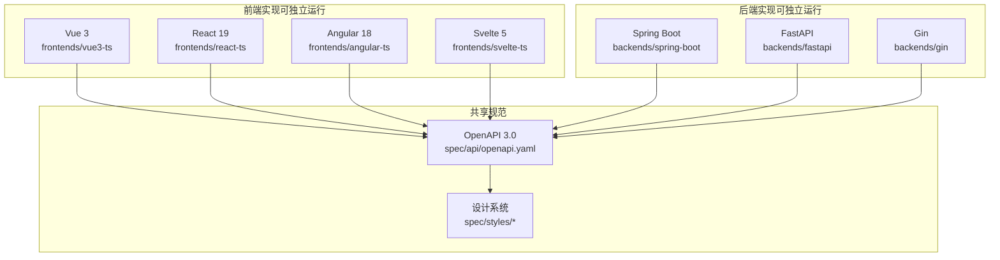
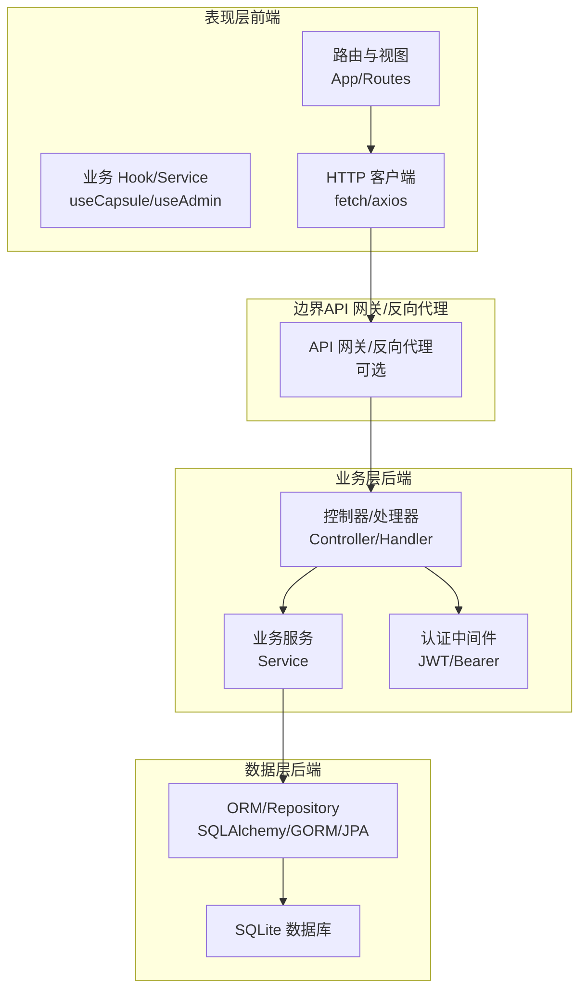
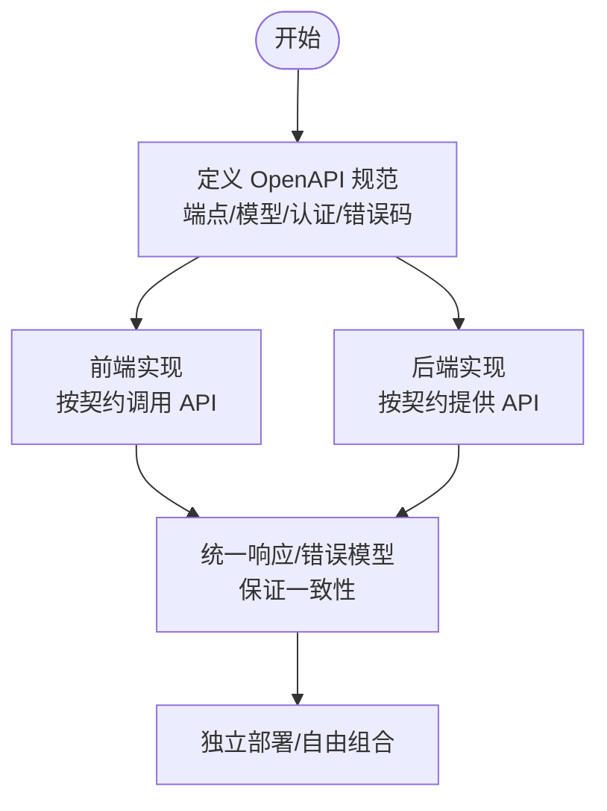
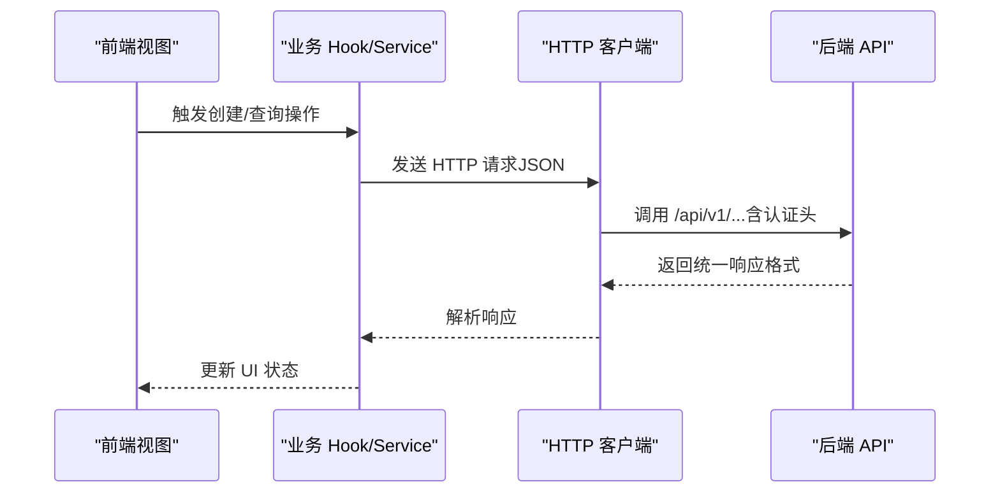
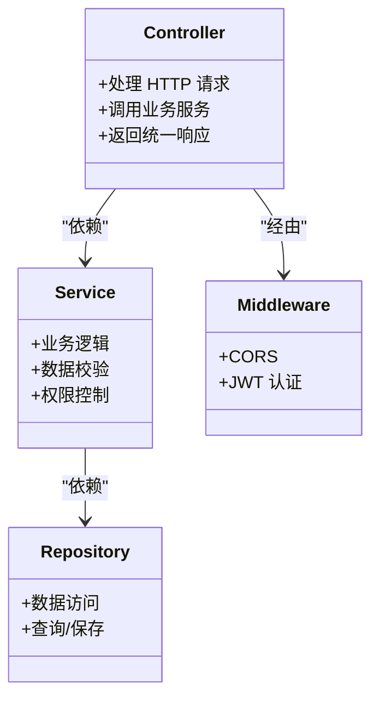
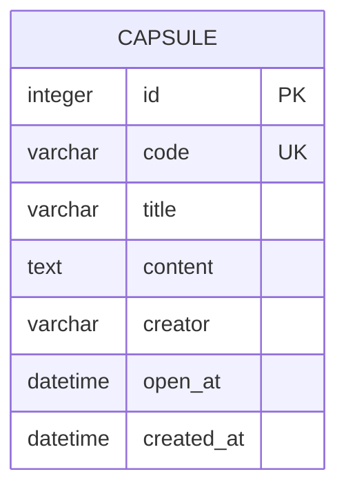
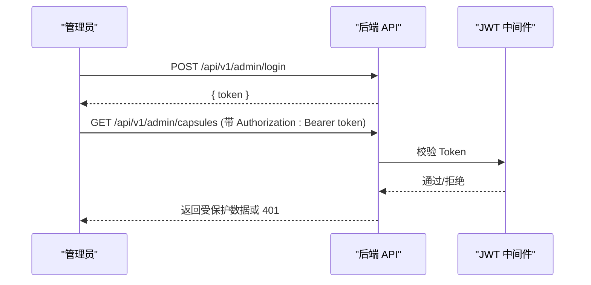
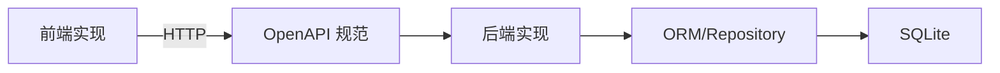
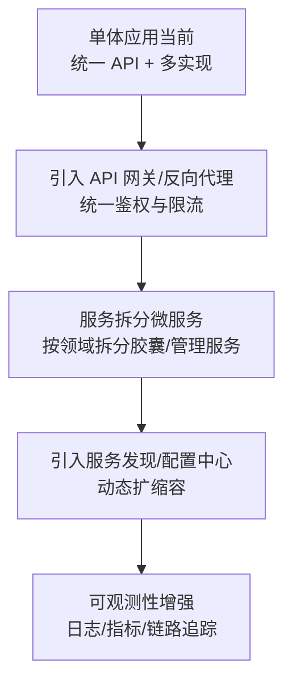

# 整体架构模式

<cite>
**本文引用的文件**
- [README.md](file://README.md)
- [docs/api-spec.md](file://docs/api-spec.md)
- [spec/api/openapi.yaml](file://spec/api/openapi.yaml)
- [backends/fastapi/README.md](file://backends/fastapi/README.md)
- [backends/gin/README.md](file://backends/gin/README.md)
- [backends/spring-boot/README.md](file://backends/spring-boot/README.md)
- [backends/fastapi/app/main.py](file://backends/fastapi/app/main.py)
- [backends/gin/main.go](file://backends/gin/main.go)
- [backends/spring-boot/src/main/java/com/hellotime/HelloTimeApplication.java](file://backends/spring-boot/src/main/java/com/hellotime/HelloTimeApplication.java)
- [frontends/react-ts/src/App.tsx](file://frontends/react-ts/src/App.tsx)
- [frontends/angular-ts/src/app/app.routes.ts](file://frontends/angular-ts/src/app/app.routes.ts)
- [frontends/svelte-ts/src/lib/router.svelte.ts](file://frontends/svelte-ts/src/lib/router.svelte.ts)
- [frontends/react-ts/src/hooks/useCapsule.ts](file://frontends/react-ts/src/hooks/useCapsule.ts)
- [frontends/angular-ts/src/app/app.config.ts](file://frontends/angular-ts/src/app/app.config.ts)
- [frontends/vue3-ts/package.json](file://frontends/vue3-ts/package.json)
</cite>

## 目录
1. [引言](#引言)
2. [项目结构](#项目结构)
3. [核心组件](#核心组件)
4. [架构总览](#架构总览)
5. [详细组件分析](#详细组件分析)
6. [依赖关系分析](#依赖关系分析)
7. [性能考量](#性能考量)
8. [故障排查指南](#故障排查指南)
9. [结论](#结论)
10. [附录](#附录)

## 引言
HelloTime 项目通过统一的 OpenAPI 3.0 规范与共享设计系统，实现了“任意前端 + 任意后端”的自由组合能力。项目采用前后端分离架构，通过 RESTful API 完全解耦；同时以统一的 API 响应格式与错误码体系，确保多技术栈之间的一致性与可互操作性。本文档从分层架构视角，系统阐述表现层、业务层、数据层的职责划分，解析系统边界与组件交互模式，并给出架构演进与扩展建议。

## 项目结构
项目采用多实现并存的组织方式：同一套业务需求在三个后端框架（Spring Boot、FastAPI、Gin）与多个前端框架（Vue 3、React 19、Angular 18、Svelte 5）中分别实现，所有实现严格遵循统一的 OpenAPI 规范与设计系统。

图表来源
- [README.md:37-63](file://README.md#L37-L63)
- [spec/api/openapi.yaml:1-349](file://spec/api/openapi.yaml#L1-L349)

章节来源
- [README.md:37-63](file://README.md#L37-L63)
- [README.md:16-35](file://README.md#L16-L35)

## 核心组件
- 统一 API 规范（OpenAPI 3.0）
  - 定义了统一的端点、请求/响应模型、认证方案与错误码，确保各语言实现行为一致。
- 统一响应格式
  - 所有接口返回统一的 success/data/message/errorCode 结构，便于前端统一处理。
- 多后端实现
  - Spring Boot、FastAPI、Gin 三套后端均实现相同 API，使用 SQLite 存储。
- 多前端实现
  - Vue 3、React 19、Angular 18、Svelte 5 四套前端均调用统一 API，共享设计系统。
- 认证与安全
  - JWT Bearer Token，支持管理员登录与受保护接口访问控制。

章节来源
- [docs/api-spec.md:5-14](file://docs/api-spec.md#L5-L14)
- [docs/api-spec.md:186-195](file://docs/api-spec.md#L186-L195)
- [spec/api/openapi.yaml:165-171](file://spec/api/openapi.yaml#L165-L171)
- [README.md:234-264](file://README.md#L234-L264)

## 架构总览
HelloTime 采用“前后端分离 + 统一 API 规范”的分层架构：
- 表现层（前端）：负责用户交互、路由与视图渲染，通过 HTTP 客户端调用后端 REST API。
- 业务层（后端）：负责领域逻辑、数据校验、权限控制与统一响应封装。
- 数据层（后端）：负责数据持久化与查询，统一使用 SQLite。

图表来源
- [frontends/react-ts/src/App.tsx:1-31](file://frontends/react-ts/src/App.tsx#L1-L31)
- [frontends/react-ts/src/hooks/useCapsule.ts:1-48](file://frontends/react-ts/src/hooks/useCapsule.ts#L1-L48)
- [backends/fastapi/app/main.py:19-34](file://backends/fastapi/app/main.py#L19-L34)
- [backends/gin/main.go:15-31](file://backends/gin/main.go#L15-L31)
- [backends/spring-boot/src/main/java/com/hellotime/HelloTimeApplication.java:6-11](file://backends/spring-boot/src/main/java/com/hellotime/HelloTimeApplication.java#L6-L11)

## 详细组件分析

### 统一 API 规范（OpenAPI 3.0）
- 规范定义
  - 基础路径、端点、请求/响应模型、认证方案（Bearer JWT）、错误码等。
- 设计理念
  - 以“契约优先”确保前后端一致性：前端按契约调用，后端按契约实现。
  - 通过统一响应与错误模型，降低前端适配成本。
- 与实现的关系
  - 各后端实现均暴露相同端点与模型，前端可自由替换后端而无需修改业务逻辑。

图表来源
- [spec/api/openapi.yaml:10-164](file://spec/api/openapi.yaml#L10-L164)
- [docs/api-spec.md:5-14](file://docs/api-spec.md#L5-L14)

章节来源
- [spec/api/openapi.yaml:1-349](file://spec/api/openapi.yaml#L1-L349)
- [docs/api-spec.md:1-195](file://docs/api-spec.md#L1-L195)
- [README.md:35](file://README.md#L35)

### 表现层（前端）
- 路由与视图
  - React/Angular/Svelte/Vue 均提供标准路由：首页、创建、打开、关于、管理后台。
- 业务封装
  - React 使用自定义 Hook 封装胶囊的创建与查询；Angular/Vue/Svelte 提供对应的服务或组合式函数。
- 统一调用
  - 所有前端实现均通过统一 API 地址调用后端，支持跨域开发与生产部署。

图表来源
- [frontends/react-ts/src/hooks/useCapsule.ts:14-44](file://frontends/react-ts/src/hooks/useCapsule.ts#L14-L44)
- [frontends/react-ts/src/App.tsx:12-30](file://frontends/react-ts/src/App.tsx#L12-L30)
- [frontends/angular-ts/src/app/app.routes.ts:3-34](file://frontends/angular-ts/src/app/app.routes.ts#L3-L34)
- [frontends/svelte-ts/src/lib/router.svelte.ts:1-25](file://frontends/svelte-ts/src/lib/router.svelte.ts#L1-L25)

章节来源
- [frontends/react-ts/src/hooks/useCapsule.ts:1-48](file://frontends/react-ts/src/hooks/useCapsule.ts#L1-L48)
- [frontends/react-ts/src/App.tsx:1-31](file://frontends/react-ts/src/App.tsx#L1-L31)
- [frontends/angular-ts/src/app/app.routes.ts:1-35](file://frontends/angular-ts/src/app/app.routes.ts#L1-L35)
- [frontends/svelte-ts/src/lib/router.svelte.ts:1-25](file://frontends/svelte-ts/src/lib/router.svelte.ts#L1-L25)
- [frontends/vue3-ts/package.json:1-30](file://frontends/vue3-ts/package.json#L1-L30)

### 业务层（后端）
- Spring Boot
  - 基于 Spring MVC/Security/JPA，提供 REST 控制器、业务服务与全局异常处理。
- FastAPI
  - 基于 FastAPI/SQLAlchemy/Pydantic，提供异步路由、依赖注入与统一异常处理。
- Gin
  - 基于 Gin/GORM，提供路由注册、中间件与统一响应封装。

图表来源
- [backends/spring-boot/README.md:77-87](file://backends/spring-boot/README.md#L77-L87)
- [backends/fastapi/README.md:99-116](file://backends/fastapi/README.md#L99-L116)
- [backends/gin/README.md:84-111](file://backends/gin/README.md#L84-L111)

章节来源
- [backends/spring-boot/README.md:1-136](file://backends/spring-boot/README.md#L1-L136)
- [backends/fastapi/README.md:1-176](file://backends/fastapi/README.md#L1-L176)
- [backends/gin/README.md:1-171](file://backends/gin/README.md#L1-L171)

### 数据层（后端）
- 统一存储
  - 所有后端实现使用 SQLite，表结构一致，便于迁移与备份。
- 模型映射
  - Spring Boot 使用 JPA 实体；FastAPI 使用 SQLAlchemy 模型；Gin 使用 GORM 模型。

图表来源
- [README.md:205-218](file://README.md#L205-L218)

章节来源
- [README.md:205-218](file://README.md#L205-L218)

### 认证与安全
- JWT Bearer Token
  - 管理员登录获取 Token，后续请求在 Authorization 头中携带 Bearer Token。
- 统一错误响应
  - 所有错误返回统一结构，包含 success=false、message、errorCode 等字段。

图表来源
- [spec/api/openapi.yaml:105-106](file://spec/api/openapi.yaml#L105-L106)
- [docs/api-spec.md:186-195](file://docs/api-spec.md#L186-L195)
- [README.md:234-264](file://README.md#L234-L264)

章节来源
- [spec/api/openapi.yaml:165-171](file://spec/api/openapi.yaml#L165-L171)
- [docs/api-spec.md:186-195](file://docs/api-spec.md#L186-L195)
- [README.md:234-264](file://README.md#L234-L264)

## 依赖关系分析
- 前后端依赖
  - 前端仅依赖后端提供的 OpenAPI 规范与 HTTP 接口，不依赖具体后端实现语言或框架。
- 后端内部依赖
  - 控制器依赖业务服务，业务服务依赖数据访问层，统一通过中间件进行认证与跨域处理。
- 外部依赖
  - 后端依赖 SQLite 与 ORM 框架；前端依赖浏览器/Node 环境与 HTTP 客户端。

图表来源
- [spec/api/openapi.yaml:1-349](file://spec/api/openapi.yaml#L1-L349)
- [backends/fastapi/app/main.py:19-34](file://backends/fastapi/app/main.py#L19-L34)
- [backends/gin/main.go:15-31](file://backends/gin/main.go#L15-L31)
- [backends/spring-boot/src/main/java/com/hellotime/HelloTimeApplication.java:6-11](file://backends/spring-boot/src/main/java/com/hellotime/HelloTimeApplication.java#L6-L11)

章节来源
- [README.md:37-63](file://README.md#L37-L63)

## 性能考量
- 前端
  - 使用路由懒加载与 Suspense，减少首屏体积与提升交互体验。
  - 统一的 API 调用封装，便于集中优化与缓存策略。
- 后端
  - FastAPI 支持异步 I/O，适合高并发场景；Spring Boot 与 Gin 也具备良好吞吐能力。
  - SQLite 适合中小规模数据与开发/演示场景，生产可平滑迁移到关系型数据库。
- 网络与缓存
  - 建议在网关层启用静态资源缓存与 Gzip 压缩，合理设置 CORS 与缓存头。

## 故障排查指南
- 统一错误响应
  - 前端可依据统一的 errorCode 与 message 快速定位问题类型（如参数校验、未授权、资源不存在等）。
- 日志与监控
  - 后端记录请求日志与异常堆栈；前端记录网络错误与业务错误。
- 常见问题
  - CORS 跨域：确认前端开发端口与后端允许的来源匹配。
  - 认证失败：确认 Authorization 头是否正确携带 Bearer Token。
  - 数据不一致：确认 SQLite 文件路径与权限，避免并发写入冲突。

章节来源
- [docs/api-spec.md:186-195](file://docs/api-spec.md#L186-L195)
- [README.md:248-264](file://README.md#L248-L264)

## 结论
HelloTime 通过 OpenAPI 3.0 与统一响应格式，实现了前后端的彻底解耦与多技术栈一致性。项目采用单体应用架构，简化了部署与运维复杂度，同时保留了良好的扩展性：可在保持 API 不变的前提下，替换前端框架、升级后端技术栈或引入新的认证与网关能力。对于未来演进，建议在保持现有契约不变的基础上，逐步引入 API 网关、服务发现与可观测性体系，以支撑更大规模的团队协作与生产环境需求。

## 附录
- 架构演进路线图（概念示意）

- 关键实现参考路径
  - OpenAPI 规范：[spec/api/openapi.yaml](file://spec/api/openapi.yaml)
  - API 规范文档：[docs/api-spec.md](file://docs/api-spec.md)
  - Spring Boot 后端：[backends/spring-boot/README.md](file://backends/spring-boot/README.md)
  - FastAPI 后端：[backends/fastapi/README.md](file://backends/fastapi/README.md)
  - Gin 后端：[backends/gin/README.md](file://backends/gin/README.md)
  - 前端路由与视图（React）：[frontends/react-ts/src/App.tsx](file://frontends/react-ts/src/App.tsx)
  - 前端路由与视图（Angular）：[frontends/angular-ts/src/app/app.routes.ts](file://frontends/angular-ts/src/app/app.routes.ts)
  - 前端路由与视图（Svelte）：[frontends/svelte-ts/src/lib/router.svelte.ts](file://frontends/svelte-ts/src/lib/router.svelte.ts)
  - 前端业务 Hook（React）：[frontends/react-ts/src/hooks/useCapsule.ts](file://frontends/react-ts/src/hooks/useCapsule.ts)
  - 前端应用配置（Angular）：[frontends/angular-ts/src/app/app.config.ts](file://frontends/angular-ts/src/app/app.config.ts)
  - 前端包管理（Vue 3）：[frontends/vue3-ts/package.json](file://frontends/vue3-ts/package.json)