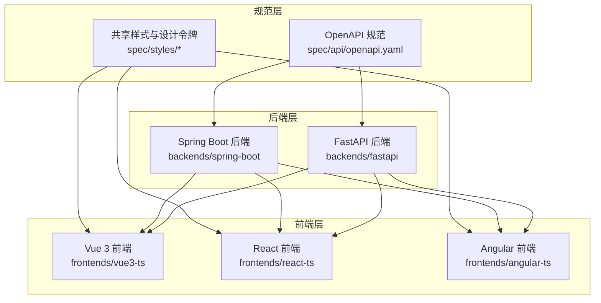
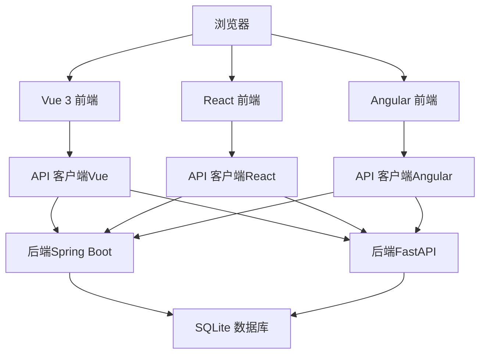
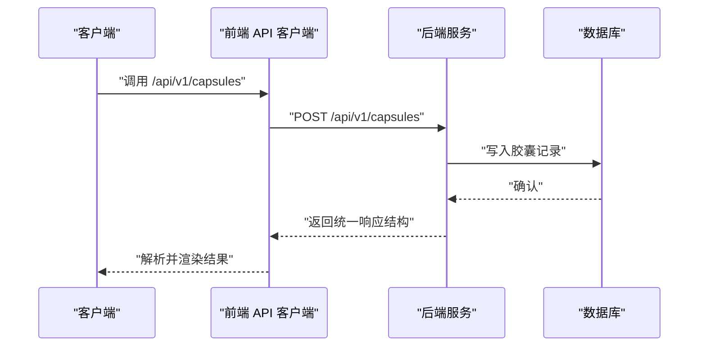
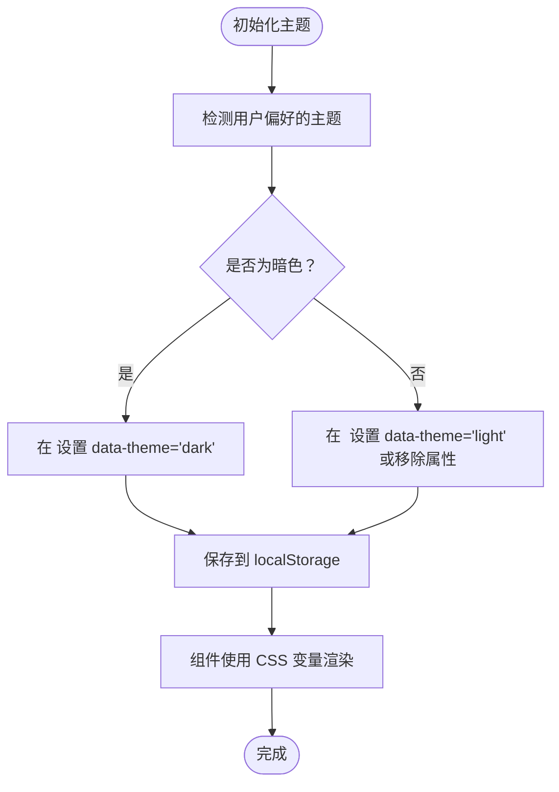
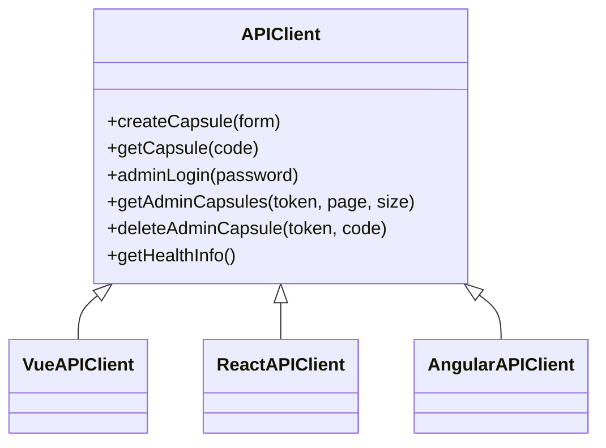
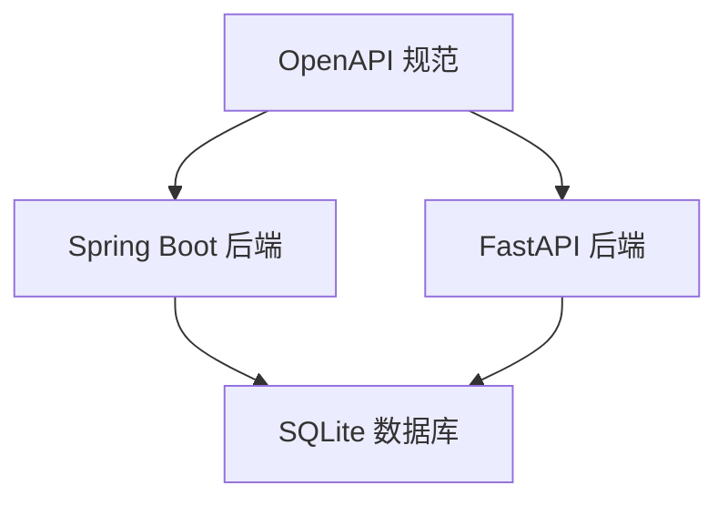
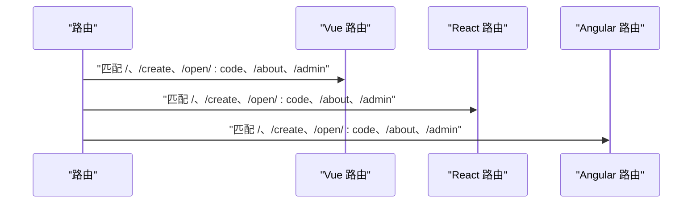
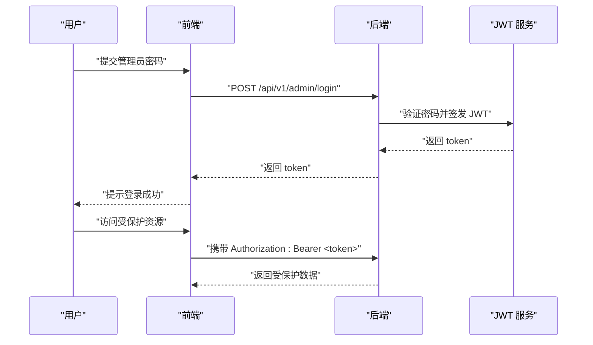
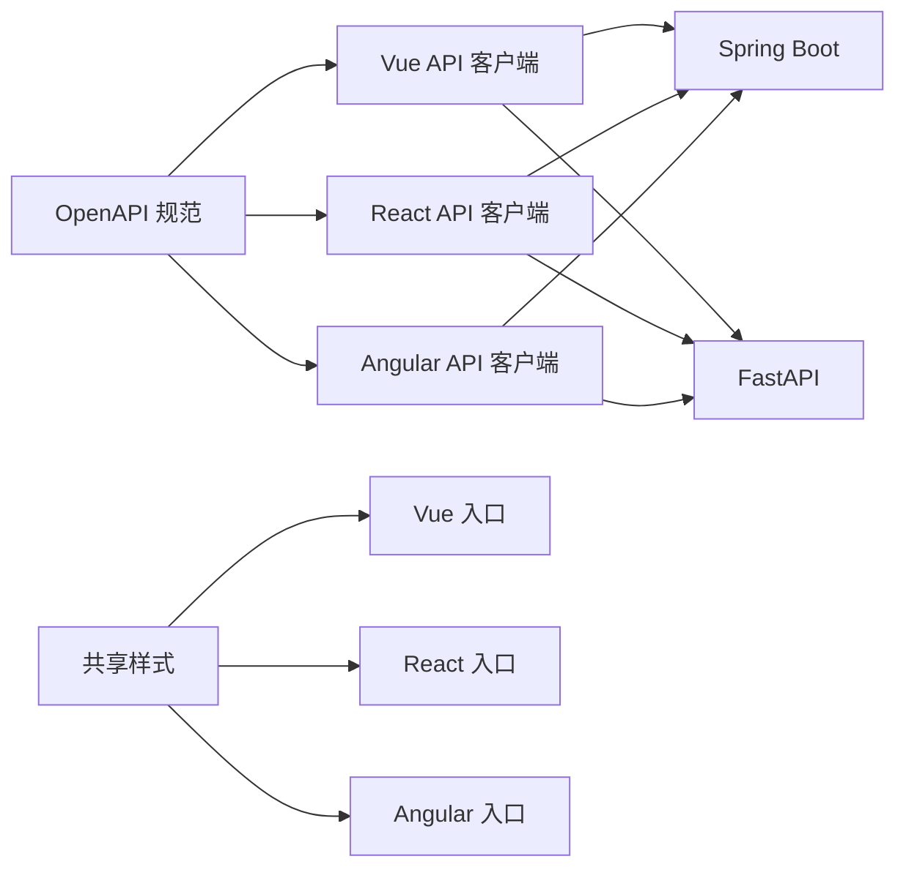

# 架构设计

<cite>
**本文引用的文件**
- [README.md](file://README.md)
- [docs/api-spec.md](file://docs/api-spec.md)
- [docs/design-tokens.md](file://docs/design-tokens.md)
- [spec/api/openapi.yaml](file://spec/api/openapi.yaml)
- [spec/styles/tokens.css](file://spec/styles/tokens.css)
- [backends/fastapi/README.md](file://backends/fastapi/README.md)
- [backends/fastapi/app/main.py](file://backends/fastapi/app/main.py)
- [backends/spring-boot/README.md](file://backends/spring-boot/README.md)
- [backends/spring-boot/src/main/java/com/hellotime/HelloTimeApplication.java](file://backends/spring-boot/src/main/java/com/hellotime/HelloTimeApplication.java)
- [frontends/vue3-ts/src/main.ts](file://frontends/vue3-ts/src/main.ts)
- [frontends/vue3-ts/src/router/index.ts](file://frontends/vue3-ts/src/router/index.ts)
- [frontends/react-ts/src/main.tsx](file://frontends/react-ts/src/main.tsx)
- [frontends/react-ts/src/App.tsx](file://frontends/react-ts/src/App.tsx)
- [frontends/angular-ts/src/main.ts](file://frontends/angular-ts/src/main.ts)
- [frontends/vue3-ts/src/api/index.ts](file://frontends/vue3-ts/src/api/index.ts)
- [frontends/react-ts/src/api/index.ts](file://frontends/react-ts/src/api/index.ts)
- [frontends/angular-ts/src/app/api/index.ts](file://frontends/angular-ts/src/app/api/index.ts)
</cite>

## 目录
1. [引言](#引言)
2. [项目结构](#项目结构)
3. [核心组件](#核心组件)
4. [架构总览](#架构总览)
5. [详细组件分析](#详细组件分析)
6. [依赖分析](#依赖分析)
7. [性能考量](#性能考量)
8. [故障排查指南](#故障排查指南)
9. [结论](#结论)
10. [附录](#附录)

## 引言
HelloTime 是一个前后端分离、多框架并存、统一规范的技术展示项目。其目标是通过统一的 API 规范与共享样式系统，演示不同技术栈组合（Spring Boot + Vue 3、FastAPI + React、Spring Boot + Angular 等）在保持功能与体验一致的前提下协同工作。项目强调：
- 前后端完全解耦，可独立开发与部署
- 统一的 REST API 规范与 OpenAPI 描述
- 共享设计令牌与样式体系，确保视觉一致性
- 跨框架兼容的共享 API 客户端与数据模型

## 项目结构
项目采用“规范先行 + 多实现”的组织方式：
- 规范层：spec/api/openapi.yaml 定义统一 API；spec/styles/ 定义共享设计令牌与样式
- 后端层：backends/spring-boot（Java/Spring Boot）、backends/fastapi（Python/FastAPI）
- 前端层：frontends/vue3-ts（Vue 3 + Vite）、frontends/react-ts（React + Vite）、frontends/angular-ts（Angular + CLI）
- 文档与脚本：docs/ 提供 API 与设计令牌说明；scripts/ 提供开发与测试脚本

图表来源
- [README.md:18-34](file://README.md#L18-L34)
- [spec/api/openapi.yaml:1-349](file://spec/api/openapi.yaml#L1-L349)
- [spec/styles/tokens.css:1-104](file://spec/styles/tokens.css#L1-L104)

章节来源
- [README.md:18-34](file://README.md#L18-L34)

## 核心组件
- 统一 API 规范与 OpenAPI：以 OpenAPI YAML 为准绳，约束端点、参数、响应与错误码，确保各后端实现行为一致
- 共享样式与设计令牌：通过 CSS 自定义属性定义颜色、排版、间距、圆角、阴影等，配合暗色模式开关，保证跨前端实现视觉一致
- 跨框架 API 客户端：三个前端分别提供同构的 API 客户端模块，封装统一的请求、鉴权头与错误处理
- 路由与视图：统一的路由约定（首页、创建、打开、关于、管理），便于跨框架复用

章节来源
- [docs/api-spec.md:1-195](file://docs/api-spec.md#L1-L195)
- [docs/design-tokens.md:1-91](file://docs/design-tokens.md#L1-L91)
- [spec/api/openapi.yaml:1-349](file://spec/api/openapi.yaml#L1-L349)
- [spec/styles/tokens.css:1-104](file://spec/styles/tokens.css#L1-L104)

## 架构总览
系统边界与交互关系如下：
- 系统边界：前端应用通过浏览器发起对 /api/v1 的 REST 请求；后端服务负责业务处理与数据持久化；数据库为 SQLite
- 组件交互：前端路由驱动视图渲染，API 客户端调用后端接口；后端控制器/路由层接收请求，业务服务处理领域逻辑，数据访问层与数据库交互
- 数据流：请求从浏览器进入前端，经 API 客户端标准化后转发至后端；后端按 OpenAPI 规范返回统一结构的响应；前端解析响应并更新 UI

图表来源
- [README.md:36-111](file://README.md#L36-L111)
- [spec/api/openapi.yaml:10-164](file://spec/api/openapi.yaml#L10-L164)

## 详细组件分析

### 统一 API 规范与 OpenAPI
- 规范来源：spec/api/openapi.yaml 明确定义了所有端点、请求/响应结构、安全方案（Bearer JWT）与错误模型
- 响应统一格式：所有端点遵循统一的成功/失败包装结构，便于前端一致化处理
- 错误码约定：VALIDATION_ERROR、BAD_REQUEST、UNAUTHORIZED、CAPSULE_NOT_FOUND、INTERNAL_ERROR 等，便于跨实现一致化错误处理

图表来源
- [spec/api/openapi.yaml:24-47](file://spec/api/openapi.yaml#L24-L47)
- [docs/api-spec.md:5-14](file://docs/api-spec.md#L5-L14)

章节来源
- [docs/api-spec.md:1-195](file://docs/api-spec.md#L1-L195)
- [spec/api/openapi.yaml:1-349](file://spec/api/openapi.yaml#L1-L349)

### 设计令牌与主题系统
- 设计令牌：spec/styles/tokens.css 定义颜色、排版、间距、圆角、阴影、过渡与布局基准
- 暗色模式：通过 [data-theme="dark"] 覆盖亮色令牌值，前端负责在 <html> 上设置该属性并持久化用户偏好
- 共享样式：三个前端均在入口处导入 tokens.css、base.css、components.css、layout.css，确保组件级样式一致

图表来源
- [docs/design-tokens.md:76-82](file://docs/design-tokens.md#L76-L82)
- [spec/styles/tokens.css:82-103](file://spec/styles/tokens.css#L82-L103)

章节来源
- [docs/design-tokens.md:1-91](file://docs/design-tokens.md#L1-L91)
- [spec/styles/tokens.css:1-104](file://spec/styles/tokens.css#L1-L104)

### 跨框架兼容性设计
- 共享 API 客户端：Vue/React/Angular 各自提供同构的 API 客户端模块，统一封装 BASE_URL、鉴权头、错误处理与响应解析
- 统一数据模型：前端 types/index.ts 与 OpenAPI 规范一一对应，确保各实现的数据结构一致
- 路由一致性：三个前端均提供相同的路由集合（/, /create, /open/:code?, /about, /admin），便于互换组合

图表来源
- [frontends/vue3-ts/src/api/index.ts:1-120](file://frontends/vue3-ts/src/api/index.ts#L1-L120)
- [frontends/react-ts/src/api/index.ts:1-94](file://frontends/react-ts/src/api/index.ts#L1-L94)
- [frontends/angular-ts/src/app/api/index.ts:1-71](file://frontends/angular-ts/src/app/api/index.ts#L1-L71)

章节来源
- [frontends/vue3-ts/src/api/index.ts:1-120](file://frontends/vue3-ts/src/api/index.ts#L1-L120)
- [frontends/react-ts/src/api/index.ts:1-94](file://frontends/react-ts/src/api/index.ts#L1-L94)
- [frontends/angular-ts/src/app/api/index.ts:1-71](file://frontends/angular-ts/src/app/api/index.ts#L1-L71)

### 后端实现对比与技术选型
- Spring Boot（Java 17 + SQLite + JPA）
  - 特点：强类型、注解驱动、生态成熟、生产就绪
  - 适用场景：企业级、对类型安全与可维护性要求高的团队
- FastAPI（Python 3.12+ + SQLite + SQLAlchemy 2.0）
  - 特点：异步、Pydantic 数据验证、自动生成 OpenAPI 文档
  - 适用场景：快速迭代、数据密集、Python 生态优先的团队

图表来源
- [backends/spring-boot/README.md:1-136](file://backends/spring-boot/README.md#L1-L136)
- [backends/fastapi/README.md:1-176](file://backends/fastapi/README.md#L1-L176)
- [spec/api/openapi.yaml:1-349](file://spec/api/openapi.yaml#L1-L349)

章节来源
- [backends/spring-boot/README.md:1-136](file://backends/spring-boot/README.md#L1-L136)
- [backends/fastapi/README.md:1-176](file://backends/fastapi/README.md#L1-L176)

### 前端实现与路由
- Vue 3（Vite + Vue Router + 组合式 API）
  - 入口导入共享样式；路由定义与视图懒加载
- React（Vite + React Router + Hooks）
  - 入口导入共享样式；路由定义与 Suspense 懒加载
- Angular（Angular CLI + Standalone Components）
  - 入口引导应用；路由与组件以 Standalone 形式组织

图表来源
- [frontends/vue3-ts/src/router/index.ts:1-44](file://frontends/vue3-ts/src/router/index.ts#L1-L44)
- [frontends/react-ts/src/App.tsx:1-31](file://frontends/react-ts/src/App.tsx#L1-L31)
- [frontends/angular-ts/src/app/app.component.ts:1-14](file://frontends/angular-ts/src/app/app.component.ts#L1-L14)

章节来源
- [frontends/vue3-ts/src/router/index.ts:1-44](file://frontends/vue3-ts/src/router/index.ts#L1-L44)
- [frontends/react-ts/src/App.tsx:1-31](file://frontends/react-ts/src/App.tsx#L1-L31)
- [frontends/angular-ts/src/app/app.component.ts:1-14](file://frontends/angular-ts/src/app/app.component.ts#L1-L14)

### 认证与令牌系统
- JWT 认证：管理员登录成功后返回 JWT，后续请求在请求头携带 Authorization: Bearer <token>
- 令牌生命周期：有效期为 2 小时（HS256 签名算法）
- 前端存储：建议将 token 存储于安全的上下文或受控的内存中，并在本地持久化时注意安全性

图表来源
- [README.md:186-194](file://README.md#L186-L194)
- [docs/api-spec.md:113-133](file://docs/api-spec.md#L113-L133)
- [spec/api/openapi.yaml:75-98](file://spec/api/openapi.yaml#L75-L98)

章节来源
- [README.md:186-194](file://README.md#L186-L194)
- [docs/api-spec.md:113-133](file://docs/api-spec.md#L113-L133)
- [spec/api/openapi.yaml:75-98](file://spec/api/openapi.yaml#L75-L98)

## 依赖分析
- 前端对规范的依赖：API 客户端严格遵循 OpenAPI 规范；路由与视图遵循统一约定
- 前端对样式的依赖：共享样式文件被三个前端共同导入，形成一致的视觉基线
- 后端对规范的依赖：控制器/路由层与服务层实现均遵循 OpenAPI 的端点、参数与响应结构
- 跨框架一致性：通过共享 API 客户端与统一数据模型，降低因框架差异导致的行为偏差

图表来源
- [spec/api/openapi.yaml:1-349](file://spec/api/openapi.yaml#L1-L349)
- [spec/styles/tokens.css:1-104](file://spec/styles/tokens.css#L1-L104)
- [frontends/vue3-ts/src/main.ts:9-13](file://frontends/vue3-ts/src/main.ts#L9-L13)
- [frontends/react-ts/src/main.tsx:9-13](file://frontends/react-ts/src/main.tsx#L9-L13)
- [frontends/angular-ts/src/main.ts:1-7](file://frontends/angular-ts/src/main.ts#L1-L7)

章节来源
- [spec/api/openapi.yaml:1-349](file://spec/api/openapi.yaml#L1-L349)
- [spec/styles/tokens.css:1-104](file://spec/styles/tokens.css#L1-L104)
- [frontends/vue3-ts/src/main.ts:9-13](file://frontends/vue3-ts/src/main.ts#L9-L13)
- [frontends/react-ts/src/main.tsx:9-13](file://frontends/react-ts/src/main.tsx#L9-L13)
- [frontends/angular-ts/src/main.ts:1-7](file://frontends/angular-ts/src/main.ts#L1-L7)

## 性能考量
- 前端层面
  - 路由懒加载与组件懒加载减少首屏体积
  - 统一的 API 客户端避免重复网络请求与重复序列化
  - 共享样式减少重复定义，提升样式计算效率
- 后端层面
  - Spring Boot 与 FastAPI 均支持异步与并发，结合 SQLite 适配中小规模数据
  - OpenAPI 自动生成文档与校验有助于减少无效请求与错误处理成本
- 资源与缓存
  - 建议在生产环境启用静态资源缓存与 Gzip 压缩
  - 前端可对不敏感的公开数据进行短期缓存（如健康检查信息）

## 故障排查指南
- API 响应不符合预期
  - 检查 OpenAPI 规范与前端类型定义是否一致
  - 确认后端返回的统一响应结构字段是否完整
- 认证失败
  - 确认请求头 Authorization 是否正确携带 Bearer token
  - 检查 token 是否过期（默认 2 小时）
- 跨域问题
  - 确认后端已启用 CORS 并允许前端开发服务器域名
- 样式不一致
  - 确认已在入口导入共享样式文件
  - 检查是否正确设置 data-theme 并持久化用户偏好

章节来源
- [docs/api-spec.md:5-14](file://docs/api-spec.md#L5-L14)
- [README.md:186-194](file://README.md#L186-L194)
- [backends/fastapi/app/main.py:21-29](file://backends/fastapi/app/main.py#L21-L29)

## 结论
HelloTime 通过“规范先行 + 多实现并存”的架构，实现了前后端解耦、跨框架兼容与视觉一致性。统一的 OpenAPI 规范确保了 API 的行为一致性，共享设计令牌与样式体系保障了视觉统一，而跨框架的 API 客户端与路由约定则降低了集成成本。该架构既适合教学与技术展示，也可作为多团队协作与技术选型探索的参考模板。

## 附录
- 快速开始与组合示例参见项目根 README 的“快速开始”与“统一启动所有服务”
- API 详细定义与错误码参见 docs/api-spec.md 与 spec/api/openapi.yaml
- 设计令牌与样式文件参见 docs/design-tokens.md 与 spec/styles/tokens.css