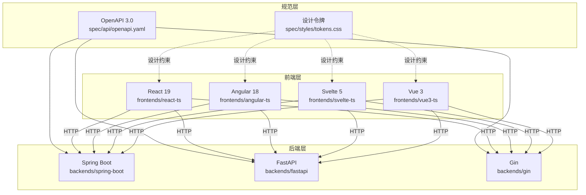
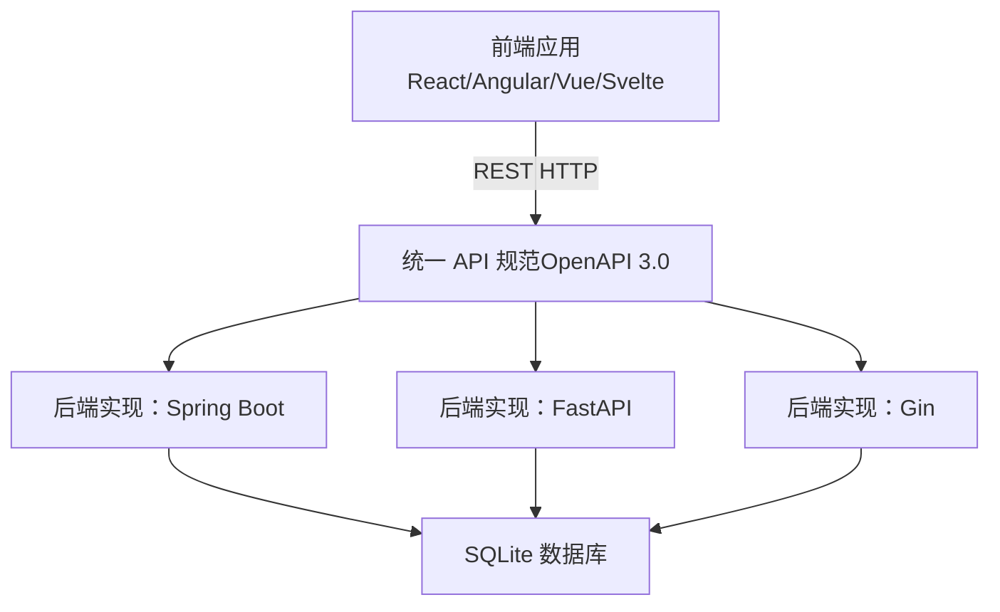
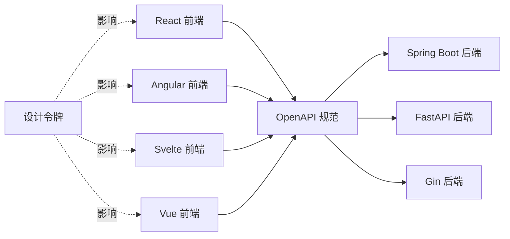

# 架构设计

<cite>
**本文引用的文件**
- [README.md](file://README.md)
- [docs/api-spec.md](file://docs/api-spec.md)
- [spec/api/openapi.yaml](file://spec/api/openapi.yaml)
- [docs/design-tokens.md](file://docs/design-tokens.md)
- [spec/styles/tokens.css](file://spec/styles/tokens.css)
- [backends/fastapi/README.md](file://backends/fastapi/README.md)
- [backends/fastapi/app/main.py](file://backends/fastapi/app/main.py)
- [backends/gin/README.md](file://backends/gin/README.md)
- [backends/gin/main.go](file://backends/gin/main.go)
- [backends/spring-boot/README.md](file://backends/spring-boot/README.md)
- [backends/spring-boot/src/main/java/com/hellotime/HelloTimeApplication.java](file://backends/spring-boot/src/main/java/com/hellotime/HelloTimeApplication.java)
- [frontends/react-ts/src/App.tsx](file://frontends/react-ts/src/App.tsx)
- [frontends/angular-ts/src/app/app.config.ts](file://frontends/angular-ts/src/app/app.config.ts)
- [frontends/svelte-ts/src/App.svelte](file://frontends/svelte-ts/src/App.svelte)
- [frontends/vue3-ts/package.json](file://frontends/vue3-ts/package.json)
- [frontends/react-ts/package.json](file://frontends/react-ts/package.json)
- [backends/fastapi/requirements.txt](file://backends/fastapi/requirements.txt)
- [backends/gin/go.mod](file://backends/gin/go.mod)
</cite>

## 目录
1. [引言](#引言)
2. [项目结构](#项目结构)
3. [核心组件](#核心组件)
4. [架构总览](#架构总览)
5. [详细组件分析](#详细组件分析)
6. [依赖关系分析](#依赖关系分析)
7. [性能考虑](#性能考虑)
8. [故障排查指南](#故障排查指南)
9. [结论](#结论)
10. [附录](#附录)

## 引言
HelloTime 是一个前后端完全解耦的多技术栈演示项目，目标是通过统一的 API 规范与设计系统，展示多种前端与后端技术栈的自由组合能力。项目采用 OpenAPI 3.0 规范定义统一接口契约，并以 CSS 设计令牌（Design Tokens）确保跨前端实现的视觉一致性。后端提供三种实现（Spring Boot、FastAPI、Gin），均遵循同一套 REST API、统一响应格式与认证机制，便于横向对比与扩展。

## 项目结构
项目采用“共享规范 + 多实现”的组织方式：
- 规范层：spec/api/openapi.yaml 定义统一 API；spec/styles/ 提供设计令牌与样式基线
- 后端层：backends 下的三个子项目分别实现统一 API
- 前端层：frontends 下的四个框架实现（Vue 3、React 19、Angular 18、Svelte 5）
- 文档与脚本：docs/ 提供架构与部署说明；scripts/ 提供一键开发与测试脚本

图表来源
- [spec/api/openapi.yaml:1-349](file://spec/api/openapi.yaml#L1-L349)
- [spec/styles/tokens.css:1-104](file://spec/styles/tokens.css#L1-L104)
- [backends/spring-boot/README.md:1-136](file://backends/spring-boot/README.md#L1-L136)
- [backends/fastapi/README.md:1-176](file://backends/fastapi/README.md#L1-L176)
- [backends/gin/README.md:1-171](file://backends/gin/README.md#L1-L171)
- [frontends/react-ts/src/App.tsx:1-31](file://frontends/react-ts/src/App.tsx#L1-L31)
- [frontends/angular-ts/src/app/app.config.ts:1-14](file://frontends/angular-ts/src/app/app.config.ts#L1-L14)
- [frontends/svelte-ts/src/App.svelte:1-51](file://frontends/svelte-ts/src/App.svelte#L1-L51)

章节来源
- [README.md:37-63](file://README.md#L37-L63)

## 核心组件
- 统一 API 规范（OpenAPI 3.0）：定义健康检查、胶囊 CRUD、管理员登录与分页列表、删除等端点，统一响应体与错误码
- 设计系统（CSS 设计令牌）：通过 CSS 自定义属性定义颜色、排版、间距、圆角、阴影等，支持亮/暗主题切换
- 多后端实现：Spring Boot（Java）、FastAPI（Python）、Gin（Go），均提供相同端点与统一响应格式
- 多前端实现：Vue 3、React 19、Angular 18、Svelte 5，均消费同一套 API 并遵循设计令牌

章节来源
- [docs/api-spec.md:1-195](file://docs/api-spec.md#L1-L195)
- [spec/api/openapi.yaml:1-349](file://spec/api/openapi.yaml#L1-L349)
- [docs/design-tokens.md:1-91](file://docs/design-tokens.md#L1-L91)
- [spec/styles/tokens.css:1-104](file://spec/styles/tokens.css#L1-L104)

## 架构总览
系统采用“前后端分离 + 统一契约 + 设计约束”的架构模式：
- 前端通过 HTTP 与后端交互，不直接依赖后端实现语言或框架
- 后端通过 OpenAPI 3.0 明确契约，提供统一响应格式与认证机制
- 设计系统通过 CSS 设计令牌保证跨前端实现的视觉一致性
- 多技术栈并存，既提升灵活性，也带来一致性保障与运维复杂度的平衡

图表来源
- [spec/api/openapi.yaml:1-349](file://spec/api/openapi.yaml#L1-L349)
- [backends/spring-boot/README.md:54-76](file://backends/spring-boot/README.md#L54-L76)
- [backends/fastapi/README.md:76-98](file://backends/fastapi/README.md#L76-L98)
- [backends/gin/README.md:61-83](file://backends/gin/README.md#L61-L83)

## 详细组件分析

### 统一 API 规范（OpenAPI 3.0）
- 规范位置：spec/api/openapi.yaml
- 关键点：
  - 基础路径：/api/v1
  - 端点：健康检查、创建胶囊、查询胶囊、管理员登录、分页列表、删除胶囊
  - 认证：Bearer JWT，SecurityScheme 定义于 components.securitySchemes
  - 统一响应模型：ApiResponse_* 与 ApiErrorResponse
  - 数据模型：CreateCapsuleRequest、CapsuleDetail、CapsulePage、TechStack 等
- 设计价值：
  - 为多后端实现提供一致的契约，降低集成成本
  - 为多前端实现提供一致的调用协议，便于自动化客户端生成与测试

章节来源
- [docs/api-spec.md:1-195](file://docs/api-spec.md#L1-L195)
- [spec/api/openapi.yaml:1-349](file://spec/api/openapi.yaml#L1-L349)

### 设计系统（CSS 设计令牌）
- 令牌定义：spec/styles/tokens.css
- 关键点：
  - 颜色系统：主色、背景、文字、边框、状态色
  - 排版系统：字体族、字号、行高、字重
  - 间距系统：以 4px 为基准的 spacing 令牌
  - 圆角与阴影：统一的视觉层级
  - 暗色模式：通过 [data-theme="dark"] 覆盖亮色令牌值
- 设计价值：
  - 保证多前端实现视觉一致性
  - 降低设计与开发沟通成本，便于主题切换与品牌化

章节来源
- [docs/design-tokens.md:1-91](file://docs/design-tokens.md#L1-L91)
- [spec/styles/tokens.css:1-104](file://spec/styles/tokens.css#L1-L104)

### 后端实现（Spring Boot）
- 应用入口：HelloTimeApplication.java
- 特点：
  - 基于 Spring Boot 3 + Java 21
  - 使用 SQLite + Spring Data JPA
  - 提供统一响应格式与全局异常处理
  - 支持管理员 JWT 认证与内容隐藏机制
- 项目结构要点：
  - controller/service/repository/entity/dto/security 等层次清晰
  - 环境变量：ADMIN_PASSWORD、JWT_SECRET

章节来源
- [backends/spring-boot/README.md:1-136](file://backends/spring-boot/README.md#L1-L136)
- [backends/spring-boot/src/main/java/com/hellotime/HelloTimeApplication.java:1-12](file://backends/spring-boot/src/main/java/com/hellotime/HelloTimeApplication.java#L1-L12)

### 后端实现（FastAPI）
- 应用入口：app/main.py
- 特点：
  - 异步 RESTful API，自动生成 OpenAPI 文档
  - 基于 Pydantic 的数据验证
  - 全局异常处理与统一响应格式
  - JWT 管理员认证
- 项目结构要点：
  - routers/services/config/database/dependencies/schemas/models
  - CORS 配置允许本地开发跨域

章节来源
- [backends/fastapi/README.md:1-176](file://backends/fastapi/README.md#L1-L176)
- [backends/fastapi/app/main.py:1-89](file://backends/fastapi/app/main.py#L1-L89)

### 后端实现（Gin）
- 应用入口：main.go
- 特点：
  - RESTful API，GORM 自动迁移
  - JWT 管理员认证与全局异常处理
  - 完整单元测试
- 项目结构要点：
  - config/database/model/dto/service/handler/middleware/router/tests

章节来源
- [backends/gin/README.md:1-171](file://backends/gin/README.md#L1-L171)
- [backends/gin/main.go:1-32](file://backends/gin/main.go#L1-L32)

### 前端实现（React 19）
- 路由与视图：App.tsx 定义标准路由（/, /create, /open/:code, /about, /admin）
- 依赖与测试：package.json 包含 react、react-router-dom、vite、vitest 等
- 设计约束：遵循 spec/styles/ 设计令牌进行样式开发

章节来源
- [frontends/react-ts/src/App.tsx:1-31](file://frontends/react-ts/src/App.tsx#L1-L31)
- [frontends/react-ts/package.json:1-31](file://frontends/react-ts/package.json#L1-L31)

### 前端实现（Angular 18）
- 配置与路由：app.config.ts 提供路由、HTTP 客户端与动画配置
- 设计约束：遵循 spec/styles/ 设计令牌进行样式开发

章节来源
- [frontends/angular-ts/src/app/app.config.ts:1-14](file://frontends/angular-ts/src/app/app.config.ts#L1-L14)

### 前端实现（Svelte 5）
- 路由与视图：App.svelte 通过自定义路由逻辑渲染标准视图
- 设计约束：遵循 spec/styles/ 设计令牌进行样式开发

章节来源
- [frontends/svelte-ts/src/App.svelte:1-51](file://frontends/svelte-ts/src/App.svelte#L1-L51)

### 前端实现（Vue 3）
- 依赖与测试：package.json 包含 vue、vue-router、vite、vitest 等
- 设计约束：遵循 spec/styles/ 设计令牌进行样式开发

章节来源
- [frontends/vue3-ts/package.json:1-30](file://frontends/vue3-ts/package.json#L1-L30)

## 依赖关系分析
- 后端对外依赖：
  - Spring Boot：JPA、SQLite、JWT
  - FastAPI：SQLAlchemy、PyJWT、Uvicorn
  - Gin：GORM、golang-jwt
- 前端对后端依赖：
  - 仅通过 HTTP 与 OpenAPI 定义的端点交互
- 规范与设计约束：
  - OpenAPI 3.0 为后端契约，设计令牌为前端视觉约束

图表来源
- [spec/api/openapi.yaml:1-349](file://spec/api/openapi.yaml#L1-L349)
- [spec/styles/tokens.css:1-104](file://spec/styles/tokens.css#L1-L104)
- [backends/fastapi/requirements.txt:1-7](file://backends/fastapi/requirements.txt#L1-L7)
- [backends/gin/go.mod:1-46](file://backends/gin/go.mod#L1-L46)

章节来源
- [backends/fastapi/requirements.txt:1-7](file://backends/fastapi/requirements.txt#L1-L7)
- [backends/gin/go.mod:1-46](file://backends/gin/go.mod#L1-L46)

## 性能考虑
- 前后端分离的优势：
  - 前端可独立缓存静态资源，后端专注数据与业务逻辑
  - 可按需扩展前端实例与后端实例，提升弹性
- 统一 API 的收益：
  - 减少重复开发与维护成本，便于横向对比
- 潜在挑战：
  - 跨域与认证配置需统一管理
  - 多后端实现的一致性保障（响应格式、错误码、时区）需持续校验
- 建议优化：
  - 在网关层统一接入鉴权与限流
  - 使用 CDN 缓存前端静态资源
  - 对后端接口增加速率限制与超时控制

## 故障排查指南
- API 响应不符合统一格式
  - 检查后端是否遵循 ApiResponse 与 ApiErrorResponse 模式
  - 参考：docs/api-spec.md、spec/api/openapi.yaml
- 前端样式不一致
  - 检查是否使用了 spec/styles/tokens.css 中的令牌
  - 确认暗色模式开关与 data-theme 属性设置
- 跨域问题（本地开发）
  - FastAPI 已配置 CORS 允许 localhost，确认前端端口与后端允许范围
- 认证失败
  - 确认管理员登录流程与 Bearer Token 传递
  - 检查 JWT_SECRET 与过期时间配置

章节来源
- [docs/api-spec.md:1-195](file://docs/api-spec.md#L1-L195)
- [docs/design-tokens.md:76-82](file://docs/design-tokens.md#L76-L82)
- [backends/fastapi/app/main.py:21-29](file://backends/fastapi/app/main.py#L21-L29)

## 结论
HelloTime 通过 OpenAPI 3.0 与 CSS 设计令牌实现了“多技术栈并存但行为一致”的架构目标。该设计既保留了各技术栈的灵活性，又通过统一契约与视觉约束降低了集成与维护成本。对于架构师与高级开发者而言，这一模式提供了良好的扩展性与可演进性，建议在生产环境中进一步完善网关、监控与一致性校验机制。

## 附录
- 快速开始与组合示例：README.md 中提供了多种后端+前端的启动方式
- API 端点与统一响应：docs/api-spec.md、spec/api/openapi.yaml
- 设计令牌与样式文件：docs/design-tokens.md、spec/styles/tokens.css
- 后端实现文档：backends/*/README.md
- 前端依赖与测试：frontends/*/package.json