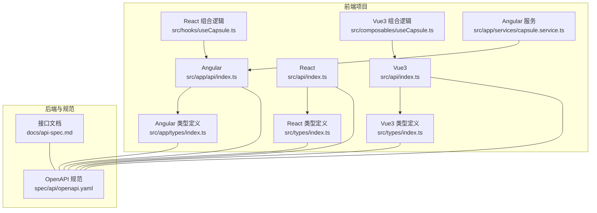
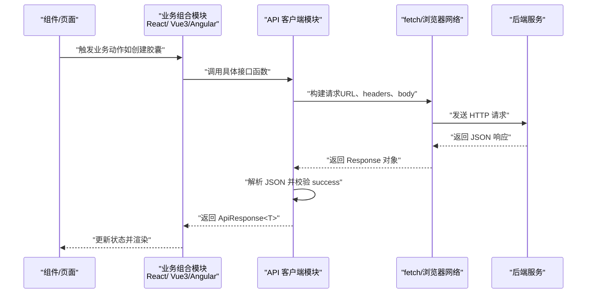
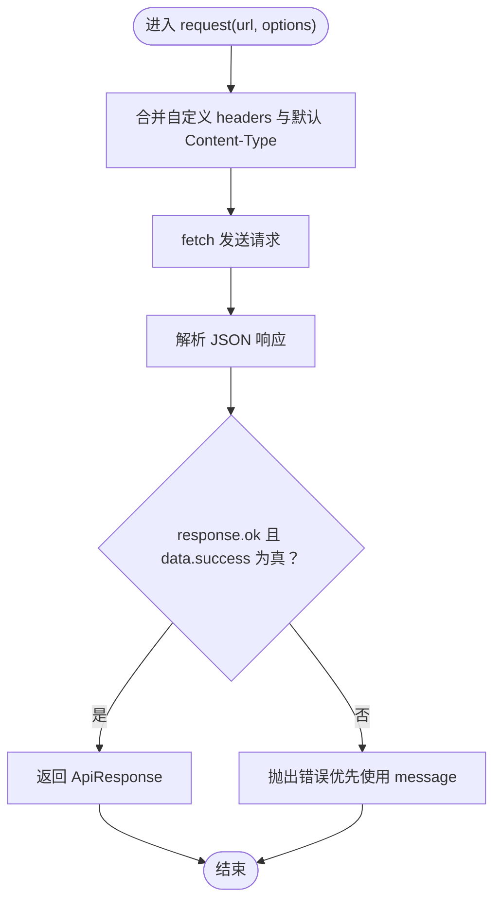
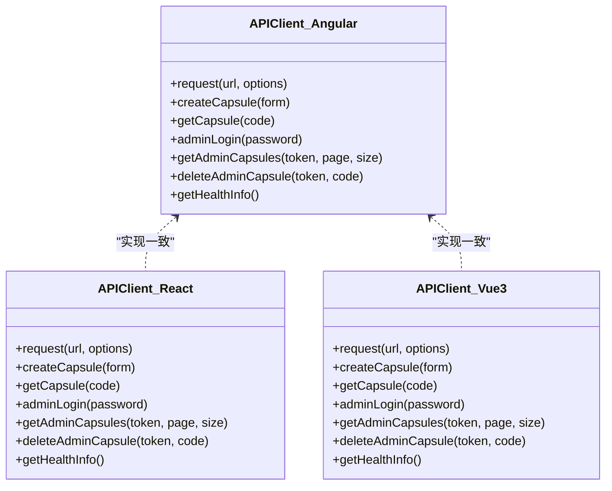
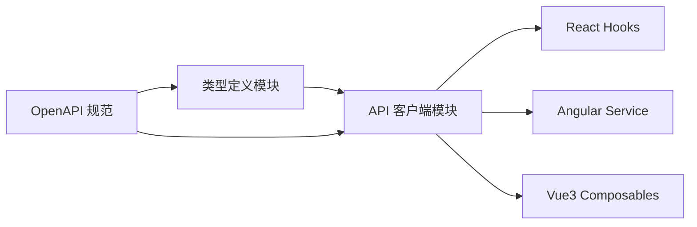

# API客户端生成

<cite>
**本文引用的文件**
- [openapi.yaml](file://spec/api/openapi.yaml)
- [api-spec.md](file://docs/api-spec.md)
- [index.ts（Angular）](file://frontends/angular-ts/src/app/api/index.ts)
- [index.ts（React）](file://frontends/react-ts/src/api/index.ts)
- [index.ts（Vue3）](file://frontends/vue3-ts/src/api/index.ts)
- [index.ts（Angular 类型）](file://frontends/angular-ts/src/app/types/index.ts)
- [index.ts（React 类型）](file://frontends/react-ts/src/types/index.ts)
- [index.ts（Vue3 类型）](file://frontends/vue3-ts/src/types/index.ts)
- [useCapsule.ts（React）](file://frontends/react-ts/src/hooks/useCapsule.ts)
- [capsule.service.ts（Angular）](file://frontends/angular-ts/src/app/services/capsule.service.ts)
- [useCapsule.ts（Vue3）](file://frontends/vue3-ts/src/composables/useCapsule.ts)
- [package.json（Angular）](file://frontends/angular-ts/package.json)
- [package.json（React）](file://frontends/react-ts/package.json)
- [package.json（Vue3）](file://frontends/vue3-ts/package.json)
</cite>

## 目录
1. [简介](#简介)
2. [项目结构](#项目结构)
3. [核心组件](#核心组件)
4. [架构总览](#架构总览)
5. [详细组件分析](#详细组件分析)
6. [依赖关系分析](#依赖关系分析)
7. [性能考虑](#性能考虑)
8. [故障排查指南](#故障排查指南)
9. [结论](#结论)
10. [附录](#附录)

## 简介
本文件面向需要在前端项目中集成后端 API 的开发者，系统性讲解如何基于 OpenAPI 规范自动生成 TypeScript 客户端代码，并在 Angular、React、Vue3 三种前端框架中统一实现 API 客户端。文档覆盖以下主题：
- 基于 OpenAPI 规范的客户端生成流程与注意事项
- 三框架中 API 客户端的实现差异与共性
- 统一的请求构建、响应处理与错误处理模式
- TypeScript 类型定义的生成与使用，确保类型安全
- 客户端配置项（基础 URL、请求头、超时等）
- 实际使用示例与最佳实践

## 项目结构
本仓库采用多前端框架并行的结构，每个前端子项目均包含：
- API 客户端模块：封装统一的请求与响应处理
- 类型定义模块：与后端统一的响应格式保持一致
- 业务组合模块（React Hooks、Angular Service、Vue3 Composables）：封装业务状态与调用流程

图表来源
- [index.ts（Angular）:1-71](file://frontends/angular-ts/src/app/api/index.ts#L1-L71)
- [index.ts（React）:1-94](file://frontends/react-ts/src/api/index.ts#L1-L94)
- [index.ts（Vue3）:1-120](file://frontends/vue3-ts/src/api/index.ts#L1-L120)
- [index.ts（Angular 类型）:1-53](file://frontends/angular-ts/src/app/types/index.ts#L1-L53)
- [index.ts（React 类型）:1-80](file://frontends/react-ts/src/types/index.ts#L1-L80)
- [index.ts（Vue3 类型）:1-80](file://frontends/vue3-ts/src/types/index.ts#L1-L80)
- [openapi.yaml:1-349](file://spec/api/openapi.yaml#L1-L349)
- [api-spec.md:1-195](file://docs/api-spec.md#L1-L195)

章节来源
- [openapi.yaml:1-349](file://spec/api/openapi.yaml#L1-L349)
- [api-spec.md:1-195](file://docs/api-spec.md#L1-L195)

## 核心组件
- 统一响应格式：所有接口返回统一的 ApiResponse 结构，包含 success、data、message、errorCode 字段，便于前端统一处理。
- API 客户端模块：在各前端框架中提供统一的 request 封装与具体接口函数（创建胶囊、查询胶囊、管理员登录、分页查询、删除胶囊、健康检查）。
- 类型定义模块：与 OpenAPI 中的 schemas 严格对应，确保类型安全。
- 业务组合模块：React Hooks、Angular Service、Vue3 Composables 将 API 调用与状态管理解耦。

章节来源
- [api-spec.md:5-14](file://docs/api-spec.md#L5-L14)
- [index.ts（Angular）:1-71](file://frontends/angular-ts/src/app/api/index.ts#L1-L71)
- [index.ts（React）:1-94](file://frontends/react-ts/src/api/index.ts#L1-L94)
- [index.ts（Vue3）:1-120](file://frontends/vue3-ts/src/api/index.ts#L1-L120)
- [index.ts（Angular 类型）:1-53](file://frontends/angular-ts/src/app/types/index.ts#L1-L53)
- [index.ts（React 类型）:1-80](file://frontends/react-ts/src/types/index.ts#L1-L80)
- [index.ts（Vue3 类型）:1-80](file://frontends/vue3-ts/src/types/index.ts#L1-L80)

## 架构总览
下图展示了三框架中 API 客户端的统一调用链路：组件/页面通过业务组合模块触发 API 调用，API 客户端模块负责请求构建与响应解析，最终返回统一的 ApiResponse 结构。

图表来源
- [index.ts（Angular）:10-27](file://frontends/angular-ts/src/app/api/index.ts#L10-L27)
- [index.ts（React）:14-31](file://frontends/react-ts/src/api/index.ts#L14-L31)
- [index.ts（Vue3）:19-37](file://frontends/vue3-ts/src/api/index.ts#L19-L37)

## 详细组件分析

### 统一请求封装与错误处理
- 请求封装：在各前端框架的 API 客户端模块中，均提供一个通用的 request 函数，负责：
  - 统一的基础 URL（/api/v1）
  - Content-Type 设置为 application/json
  - 合并自定义 headers
  - 使用 fetch 发送请求并解析 JSON
- 错误处理：当 HTTP 状态非 2xx 或响应中的 success 字段为 false 时，抛出错误，错误信息优先取自响应 message 字段。

图表来源
- [index.ts（Angular）:10-27](file://frontends/angular-ts/src/app/api/index.ts#L10-L27)
- [index.ts（React）:14-31](file://frontends/react-ts/src/api/index.ts#L14-L31)
- [index.ts（Vue3）:19-37](file://frontends/vue3-ts/src/api/index.ts#L19-L37)

章节来源
- [index.ts（Angular）:10-27](file://frontends/angular-ts/src/app/api/index.ts#L10-L27)
- [index.ts（React）:14-31](file://frontends/react-ts/src/api/index.ts#L14-L31)
- [index.ts（Vue3）:19-37](file://frontends/vue3-ts/src/api/index.ts#L19-L37)

### 具体接口函数
- 创建时间胶囊：POST /api/v1/capsules，请求体包含标题、内容、创建者、开启时间；开启时间在客户端转换为 ISO 8601 字符串。
- 查询时间胶囊：GET /api/v1/capsules/{code}，路径参数为 8 位胶囊码。
- 管理员登录：POST /api/v1/admin/login，返回 JWT Token。
- 分页查询胶囊（管理员）：GET /api/v1/admin/capsules?page=&size=，需要携带 Bearer Token。
- 删除胶囊（管理员）：DELETE /api/v1/admin/capsules/{code}，需要携带 Bearer Token。
- 健康检查：GET /api/v1/health，返回服务状态与技术栈信息。

章节来源
- [index.ts（Angular）:29-71](file://frontends/angular-ts/src/app/api/index.ts#L29-L71)
- [index.ts（React）:37-94](file://frontends/react-ts/src/api/index.ts#L37-L94)
- [index.ts（Vue3）:46-120](file://frontends/vue3-ts/src/api/index.ts#L46-L120)
- [openapi.yaml:10-164](file://spec/api/openapi.yaml#L10-L164)

### 三框架实现差异与共性
- 共性
  - 统一的基础 URL（/api/v1）
  - 统一的请求封装与错误处理
  - 统一的类型定义与响应格式
- 差异
  - React：通过自定义 Hook（useCapsule）封装状态与调用
  - Angular：通过 Service（CapsuleService）提供信号（signal）驱动的状态
  - Vue3：通过 Composables（useCapsule）提供 ref 驱动的状态

图表来源
- [index.ts（Angular）:1-71](file://frontends/angular-ts/src/app/api/index.ts#L1-L71)
- [index.ts（React）:1-94](file://frontends/react-ts/src/api/index.ts#L1-L94)
- [index.ts（Vue3）:1-120](file://frontends/vue3-ts/src/api/index.ts#L1-L120)

章节来源
- [useCapsule.ts（React）:1-48](file://frontends/react-ts/src/hooks/useCapsule.ts#L1-L48)
- [capsule.service.ts（Angular）:1-41](file://frontends/angular-ts/src/app/services/capsule.service.ts#L1-L41)
- [useCapsule.ts（Vue3）:1-65](file://frontends/vue3-ts/src/composables/useCapsule.ts#L1-L65)

### TypeScript 类型定义与生成
- 类型来源：类型定义与 OpenAPI 规范中的 schemas 一一对应，确保前后端一致。
- 关键类型
  - ApiResponse<T>：统一响应包装
  - Capsule：胶囊对象
  - CreateCapsuleForm：创建胶囊表单
  - PageData<T>：分页数据
  - AdminToken：管理员 Token
  - TechStack、HealthInfo：健康检查相关
- 生成建议：可使用 openapi-generator 或类似工具基于 openapi.yaml 自动生成 TS 客户端与类型定义，再结合本项目的统一响应格式进行微调。

章节来源
- [index.ts（Angular 类型）:1-53](file://frontends/angular-ts/src/app/types/index.ts#L1-L53)
- [index.ts（React 类型）:1-80](file://frontends/react-ts/src/types/index.ts#L1-L80)
- [index.ts（Vue3 类型）:1-80](file://frontends/vue3-ts/src/types/index.ts#L1-L80)
- [openapi.yaml:165-349](file://spec/api/openapi.yaml#L165-L349)

### OpenAPI 客户端生成与使用指南
- 生成步骤
  - 使用 openapi-generator（或其他支持 TypeScript 的工具）加载 spec/api/openapi.yaml
  - 选择合适的模板（如 axios/fetch、react-query/vanilla 等），生成客户端代码与类型定义
  - 将生成的类型与接口适配到现有项目结构（例如放置于 src/types 与 src/api 目录）
- 适配要点
  - 统一基础 URL 与认证头（Bearer Token）
  - 统一错误处理策略（基于 success 字段与 HTTP 状态）
  - 日期时间字段按需转换（如将 Date 转为 ISO 8601 字符串）

章节来源
- [openapi.yaml:1-349](file://spec/api/openapi.yaml#L1-L349)
- [api-spec.md:1-14](file://docs/api-spec.md#L1-L14)

### API 调用统一模式
- 请求构建
  - 基础 URL 固定为 /api/v1
  - Content-Type 默认 application/json
  - 管理员接口统一添加 Authorization: Bearer {token}
- 响应处理
  - 成功条件：HTTP 2xx 且 data.success 为 true
  - 失败条件：抛出错误，错误信息取自 data.message
- 错误处理机制
  - 在 API 客户端层统一捕获并抛错
  - 在业务组合模块中捕获并更新错误状态

章节来源
- [index.ts（Angular）:10-27](file://frontends/angular-ts/src/app/api/index.ts#L10-L27)
- [index.ts（React）:14-31](file://frontends/react-ts/src/api/index.ts#L14-L31)
- [index.ts（Vue3）:19-37](file://frontends/vue3-ts/src/api/index.ts#L19-L37)
- [api-spec.md:5-14](file://docs/api-spec.md#L5-L14)

### 配置选项与最佳实践
- 基础 URL 设置
  - 当前项目固定为 /api/v1，可通过环境变量或构建期替换实现多环境切换
- 请求头配置
  - Content-Type 默认 application/json
  - 管理员接口统一注入 Authorization: Bearer {token}
- 超时处理
  - fetch 本身不带超时，可在 request 封装中引入 AbortController 实现超时控制
- 代理与跨域
  - 开发环境下可通过 Vite/Angular DevServer 的 proxy 配置转发到后端服务

章节来源
- [index.ts（Angular）:8-18](file://frontends/angular-ts/src/app/api/index.ts#L8-L18)
- [index.ts（React）:8-22](file://frontends/react-ts/src/api/index.ts#L8-L22)
- [index.ts（Vue3）:8-27](file://frontends/vue3-ts/src/api/index.ts#L8-L27)
- [package.json（Angular）](file://frontends/angular-ts/package.json#L6)
- [package.json（React）](file://frontends/react-ts/package.json#L7)
- [package.json（Vue3）](file://frontends/vue3-ts/package.json#L7)

### 实际使用模式与示例
- React（Hooks）
  - 使用 useCapsule 提供的 create/get 方法，自动管理 loading 与 error 状态
- Angular（Service）
  - 注入 CapsuleService，在组件中通过信号读取状态并触发 API 调用
- Vue3（Composables）
  - 在组件中调用 useCapsule，使用 ref 管理响应式状态

章节来源
- [useCapsule.ts（React）:1-48](file://frontends/react-ts/src/hooks/useCapsule.ts#L1-L48)
- [capsule.service.ts（Angular）:1-41](file://frontends/angular-ts/src/app/services/capsule.service.ts#L1-L41)
- [useCapsule.ts（Vue3）:1-65](file://frontends/vue3-ts/src/composables/useCapsule.ts#L1-L65)

## 依赖关系分析
- API 客户端模块依赖类型定义模块，确保请求与响应的类型一致性
- 业务组合模块依赖 API 客户端模块，实现关注点分离
- 各前端框架的 package.json 提供开发与测试脚本，支撑本地开发与 CI 流程

图表来源
- [index.ts（Angular 类型）:1-53](file://frontends/angular-ts/src/app/types/index.ts#L1-L53)
- [index.ts（React 类型）:1-80](file://frontends/react-ts/src/types/index.ts#L1-L80)
- [index.ts（Vue3 类型）:1-80](file://frontends/vue3-ts/src/types/index.ts#L1-L80)
- [index.ts（Angular）:1-71](file://frontends/angular-ts/src/app/api/index.ts#L1-L71)
- [index.ts（React）:1-94](file://frontends/react-ts/src/api/index.ts#L1-L94)
- [index.ts（Vue3）:1-120](file://frontends/vue3-ts/src/api/index.ts#L1-L120)
- [openapi.yaml:1-349](file://spec/api/openapi.yaml#L1-L349)

章节来源
- [package.json（Angular）:1-38](file://frontends/angular-ts/package.json#L1-L38)
- [package.json（React）:1-31](file://frontends/react-ts/package.json#L1-L31)
- [package.json（Vue3）:1-30](file://frontends/vue3-ts/package.json#L1-L30)

## 性能考虑
- 请求合并与去重：对高频查询（如查询同一胶囊码）可增加缓存与去重逻辑
- 分页优化：合理设置 page 与 size，避免一次性拉取过多数据
- 超时与重试：在 request 封装中加入超时与有限重试，提升用户体验
- 类型预编译：利用 TypeScript 的强类型检查在构建阶段发现潜在问题

## 故障排查指南
- 统一错误处理
  - 当接口返回 success=false 或 HTTP 非 2xx 时，会抛出错误，错误信息来自响应 message
  - 在业务组合模块中捕获错误并显示用户友好的提示
- 常见问题定位
  - 确认基础 URL 与后端服务地址一致
  - 管理员接口需正确传递 Bearer Token
  - 检查日期时间字段格式是否符合 ISO 8601

章节来源
- [index.ts（Angular）:22-24](file://frontends/angular-ts/src/app/api/index.ts#L22-L24)
- [index.ts（React）:26-28](file://frontends/react-ts/src/api/index.ts#L26-L28)
- [index.ts（Vue3）:32-34](file://frontends/vue3-ts/src/api/index.ts#L32-L34)

## 结论
本项目以 OpenAPI 规范为基础，实现了三框架下一致的 API 客户端与类型体系。通过统一的请求封装、响应格式与错误处理，开发者可以在不同前端框架中复用相同的业务逻辑与类型定义。建议在团队内推广该模式，并结合 openapi-generator 自动化生成与维护客户端代码，进一步提升开发效率与类型安全性。

## 附录
- OpenAPI 规范与接口文档
  - 规范文件：[openapi.yaml:1-349](file://spec/api/openapi.yaml#L1-L349)
  - 接口文档：[api-spec.md:1-195](file://docs/api-spec.md#L1-L195)
- 前端项目脚本
  - Angular：[package.json:1-38](file://frontends/angular-ts/package.json#L1-L38)
  - React：[package.json:1-31](file://frontends/react-ts/package.json#L1-L31)
  - Vue3：[package.json:1-30](file://frontends/vue3-ts/package.json#L1-L30)