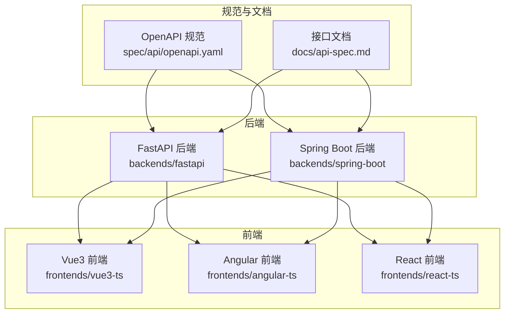
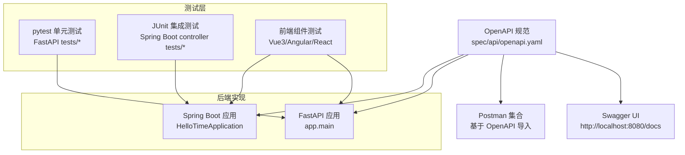
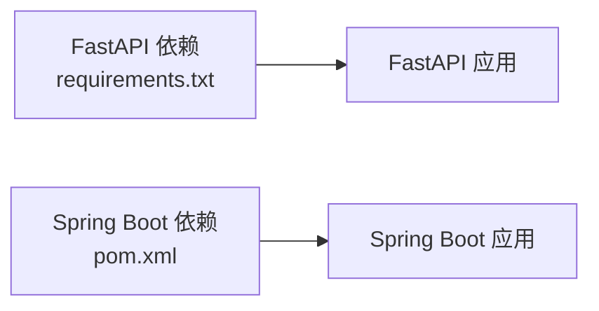

# API测试与验证

<cite>
**本文引用的文件**
- [openapi.yaml](file://spec/api/openapi.yaml)
- [api-spec.md](file://docs/api-spec.md)
- [FastAPI 说明](file://backends/fastapi/README.md)
- [Spring Boot 说明](file://backends/spring-boot/README.md)
- [测试脚本](file://scripts/test.sh)
- [FastAPI 测试夹具](file://backends/fastapi/tests/conftest.py)
- [胶囊 API 测试（FastAPI）](file://backends/fastapi/tests/test_capsule_api.py)
- [管理员 API 测试（FastAPI）](file://backends/fastapi/tests/test_admin_api.py)
- [胶囊控制器测试（Spring Boot）](file://backends/spring-boot/src/test/java/com/hellotime/controller/CapsuleControllerTest.java)
- [管理员控制器测试（Spring Boot）](file://backends/spring-boot/src/test/java/com/hellotime/controller/AdminControllerTest.java)
- [Vue3 组件测试](file://frontends/vue3-ts/src/__tests__/components/CapsuleCard.test.ts)
- [Angular 组件测试](file://frontends/angular-ts/src/__tests__/components/capsule-card.component.spec.ts)
- [React 组件测试](file://frontends/react-ts/src/__tests__/components/CapsuleCard.test.tsx)
- [FastAPI 依赖](file://backends/fastapi/requirements.txt)
- [Spring Boot POM](file://backends/spring-boot/pom.xml)
- [Vue3 Vitest 配置](file://frontends/vue3-ts/vitest.config.ts)
</cite>

## 目录
1. [引言](#引言)
2. [项目结构](#项目结构)
3. [核心组件](#核心组件)
4. [架构总览](#架构总览)
5. [详细组件分析](#详细组件分析)
6. [依赖分析](#依赖分析)
7. [性能考虑](#性能考虑)
8. [故障排查指南](#故障排查指南)
9. [结论](#结论)
10. [附录](#附录)

## 引言
本指南围绕基于 OpenAPI 规范的 API 测试与验证展开，覆盖单元测试、集成测试与端到端测试的实施方法；阐明测试用例设计原则（正常流程、异常情况、边界条件）；给出自动化测试流程（测试数据准备、Mock 服务配置、持续集成）；介绍 API 验证工具（Swagger UI、Postman、OpenAPI Generator）；并提供性能与负载测试指导及常见问题解决方案。

## 项目结构
该项目采用多后端（FastAPI、Spring Boot）、多前端（Vue3、Angular、React）与统一 OpenAPI 规范的架构。测试覆盖后端 API、前端组件与跨端一致性验证。

图表来源
- [openapi.yaml:1-349](file://spec/api/openapi.yaml#L1-L349)
- [FastAPI 说明:1-176](file://backends/fastapi/README.md#L1-L176)
- [Spring Boot 说明:1-136](file://backends/spring-boot/README.md#L1-L136)

章节来源
- [openapi.yaml:1-349](file://spec/api/openapi.yaml#L1-L349)
- [api-spec.md:1-195](file://docs/api-spec.md#L1-L195)
- [FastAPI 说明:1-176](file://backends/fastapi/README.md#L1-L176)
- [Spring Boot 说明:1-136](file://backends/spring-boot/README.md#L1-L136)

## 核心组件
- OpenAPI 规范：定义了健康检查、胶囊 CRUD、管理员登录与分页查询、删除等端点，以及统一响应格式与错误码。
- 后端实现：FastAPI 与 Spring Boot 提供相同语义的 REST API，均遵循统一 OpenAPI 规范。
- 前端组件：在不同框架中对胶囊卡片展示进行单元测试，验证“已开启/未开启”场景下的内容可见性。
- 测试体系：后端使用 pytest/JUnit/MockMvc，前端使用 Vitest/Jasmine/Karma，配合统一的 OpenAPI 规范驱动测试。

章节来源
- [openapi.yaml:10-164](file://spec/api/openapi.yaml#L10-L164)
- [api-spec.md:16-184](file://docs/api-spec.md#L16-L184)
- [FastAPI 说明:118-129](file://backends/fastapi/README.md#L118-L129)
- [Spring Boot 说明:89-97](file://backends/spring-boot/README.md#L89-L97)

## 架构总览
下图展示了从 OpenAPI 规范到后端实现再到前端消费的整体流程，以及测试在各层的切入位置。

图表来源
- [openapi.yaml:1-349](file://spec/api/openapi.yaml#L1-L349)
- [FastAPI 说明:53-58](file://backends/fastapi/README.md#L53-L58)
- [Spring Boot 说明:30-36](file://backends/spring-boot/README.md#L30-L36)

## 详细组件分析

### 健康检查端点测试
- 目标：验证健康检查返回 200 且响应包含 UP 状态。
- 测试要点：断言状态码、success 字段与 data.status。
- 设计原则：正常流程验证，确保服务可用性。

章节来源
- [胶囊 API 测试（FastAPI）:7-14](file://backends/fastapi/tests/test_capsule_api.py#L7-L14)
- [胶囊控制器测试（Spring Boot）:30-36](file://backends/spring-boot/src/test/java/com/hellotime/controller/CapsuleControllerTest.java#L30-L36)

### 胶囊创建端点测试
- 目标：验证创建胶囊返回 201，且返回数据包含 8 位 code、title 等字段。
- 异常分支：缺少必填字段返回 400，错误码为 VALIDATION_ERROR。
- 边界条件：openAt 必须为未来时间，否则校验失败。
- 设计原则：正常流程 + 参数缺失 + 日期合法性。

章节来源
- [胶囊 API 测试（FastAPI）:16-31](file://backends/fastapi/tests/test_capsule_api.py#L16-L31)
- [胶囊 API 测试（FastAPI）:33-42](file://backends/fastapi/tests/test_capsule_api.py#L33-L42)
- [胶囊控制器测试（Spring Boot）:38-53](file://backends/spring-boot/src/test/java/com/hellotime/controller/CapsuleControllerTest.java#L38-L53)
- [胶囊控制器测试（Spring Boot）:55-63](file://backends/spring-boot/src/test/java/com/hellotime/controller/CapsuleControllerTest.java#L55-L63)

### 胶囊查询端点测试
- 目标：验证查询不存在的胶囊返回 404，错误码为 CAPSULE_NOT_FOUND。
- 特殊行为：未到开启时间的胶囊 content 为 null 或不返回 content 字段。
- 设计原则：存在性校验 + 内容可见性控制。

章节来源
- [胶囊 API 测试（FastAPI）:44-51](file://backends/fastapi/tests/test_capsule_api.py#L44-L51)
- [胶囊 API 测试（FastAPI）:53-69](file://backends/fastapi/tests/test_capsule_api.py#L53-L69)
- [胶囊控制器测试（Spring Boot）:65-71](file://backends/spring-boot/src/test/java/com/hellotime/controller/CapsuleControllerTest.java#L65-L71)
- [胶囊控制器测试（Spring Boot）:73-92](file://backends/spring-boot/src/test/java/com/hellotime/controller/CapsuleControllerTest.java#L73-L92)

### 管理员登录与鉴权测试
- 目标：正确密码返回 200 与 token；错误密码返回 401。
- 集成测试：携带 Bearer Token 访问受保护端点，验证分页列表与删除操作。
- 设计原则：鉴权流程 + 权限控制。

章节来源
- [管理员 API 测试（FastAPI）:13-29](file://backends/fastapi/tests/test_admin_api.py#L13-L29)
- [管理员 API 测试（FastAPI）:31-50](file://backends/fastapi/tests/test_admin_api.py#L31-L50)
- [管理员 API 测试（FastAPI）:52-77](file://backends/fastapi/tests/test_admin_api.py#L52-L77)
- [管理员控制器测试（Spring Boot）:43-66](file://backends/spring-boot/src/test/java/com/hellotime/controller/AdminControllerTest.java#L43-L66)
- [管理员控制器测试（Spring Boot）:68-83](file://backends/spring-boot/src/test/java/com/hellotime/controller/AdminControllerTest.java#L68-L83)
- [管理员控制器测试（Spring Boot）:85-111](file://backends/spring-boot/src/test/java/com/hellotime/controller/AdminControllerTest.java#L85-L111)

### 前端组件测试（胶囊卡片）
- 目标：验证“已开启/未开启”两种状态下内容显示差异。
- 测试框架：Vitest（Vue3）、Jasmine/Karma（Angular）、Testing Library（React）。
- 设计原则：UI 行为一致性 + 可访问性提示。

章节来源
- [Vue3 组件测试:25-39](file://frontends/vue3-ts/src/__tests__/components/CapsuleCard.test.ts#L25-L39)
- [Angular 组件测试:37-60](file://frontends/angular-ts/src/__tests__/components/capsule-card.component.spec.ts#L37-L60)
- [React 组件测试:6-44](file://frontends/react-ts/src/__tests__/components/CapsuleCard.test.tsx#L6-L44)

### 测试夹具与 Mock 服务
- FastAPI：使用内存 SQLite + TestClient，通过依赖注入替换数据库会话，确保测试隔离与可重复性。
- Spring Boot：使用 @AutoConfigureMockMvc + @Transactional，避免真实持久化副作用。
- 前端：Vitest 使用 happy-dom 环境模拟浏览器 DOM。

章节来源
- [FastAPI 测试夹具:16-47](file://backends/fastapi/tests/conftest.py#L16-L47)
- [Vue3 Vitest 配置:13-17](file://frontends/vue3-ts/vitest.config.ts#L13-L17)

### 自动化测试流程与持续集成
- 执行顺序：先后端（Spring Boot），再前端（Vue3、Angular）。
- 命令入口：统一脚本按框架执行测试命令。
- CI 建议：在流水线中复用该脚本，分别运行后端与前端测试套件。

章节来源
- [测试脚本:11-33](file://scripts/test.sh#L11-L33)
- [FastAPI 说明:118-129](file://backends/fastapi/README.md#L118-L129)
- [Spring Boot 说明:89-97](file://backends/spring-boot/README.md#L89-L97)

### API 验证工具使用
- Swagger UI：自动生成文档，便于手动验证与调试。
- Postman：导入 OpenAPI 后可直接生成集合，支持环境变量与预/后置脚本。
- OpenAPI Generator：可从规范生成客户端 SDK 或服务端骨架，用于契约驱动开发。

章节来源
- [FastAPI 说明:53-58](file://backends/fastapi/README.md#L53-L58)
- [openapi.yaml:1-349](file://spec/api/openapi.yaml#L1-L349)

### 性能与负载测试指导
- 压力测试：建议使用 JMeter 或 k6 对关键端点（如查询、创建）施加并发负载，观察响应时间与错误率。
- 场景设计：峰值流量、长时间稳定负载、突发流量。
- 指标监控：P95/P99 延迟、吞吐量、错误率、数据库连接池使用率。
- 优化方向：连接池配置、缓存策略、索引优化、异步处理。

（本节为通用指导，无需特定文件引用）

## 依赖分析
- 后端依赖：FastAPI、SQLAlchemy、PyJWT、pytest、httpx；Spring Boot 使用 Spring Boot Starter、JPA、SQLite、jjwt。
- 前端依赖：Vitest、happy-dom、Testing Library 等。

图表来源
- [FastAPI 依赖:1-7](file://backends/fastapi/requirements.txt#L1-L7)
- [Spring Boot POM:25-80](file://backends/spring-boot/pom.xml#L25-L80)

章节来源
- [FastAPI 依赖:1-7](file://backends/fastapi/requirements.txt#L1-L7)
- [Spring Boot POM:25-80](file://backends/spring-boot/pom.xml#L25-L80)

## 性能考虑
- 并发与资源：测试阶段使用内存数据库与轻量级测试环境，生产环境建议使用连接池与合适的工作者数量。
- 响应时间：关注序列化与数据库查询开销，必要时引入缓存与只读副本。
- 可观测性：在 CI 中记录测试耗时与失败率，形成回归基线。

（本节为通用指导，无需特定文件引用）

## 故障排查指南
- 常见问题
  - 鉴权失败：确认管理员密码与 JWT 密钥配置一致，Authorization 头格式为 Bearer token。
  - 参数校验失败：检查请求体是否满足 OpenAPI 字段约束（必填、长度、格式）。
  - 未开启胶囊内容为空：这是预期行为，前端应显示“未到时间”提示。
- 定位手段
  - 使用 Swagger UI 手动调用并查看响应。
  - 在后端日志中定位请求链路与异常堆栈。
  - 在前端测试中增加断言以捕获 UI 行为异常。

章节来源
- [openapi.yaml:165-171](file://spec/api/openapi.yaml#L165-L171)
- [api-spec.md:186-195](file://docs/api-spec.md#L186-L195)

## 结论
本项目以统一 OpenAPI 规范为契约，实现了前后端一致的 API 行为与完善的测试体系。通过单元、集成与前端组件测试，结合 Swagger UI、Postman 与 OpenAPI Generator，能够高效地验证 API 正确性与一致性。建议在持续集成中固化测试流程，并逐步引入性能与负载测试，确保系统在高并发场景下的稳定性。

## 附录

### 测试用例设计原则清单
- 正常流程：覆盖健康检查、创建、查询、登录、分页、删除等主路径。
- 异常情况：参数缺失、格式错误、权限不足、资源不存在。
- 边界条件：openAt 为未来时间、8 位 code、最大长度限制、空内容隐藏。
- 前端一致性：不同框架下 UI 行为一致，特别是“未开启”状态的内容可见性。

章节来源
- [openapi.yaml:10-164](file://spec/api/openapi.yaml#L10-L164)
- [api-spec.md:16-184](file://docs/api-spec.md#L16-L184)