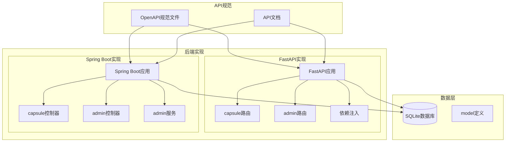
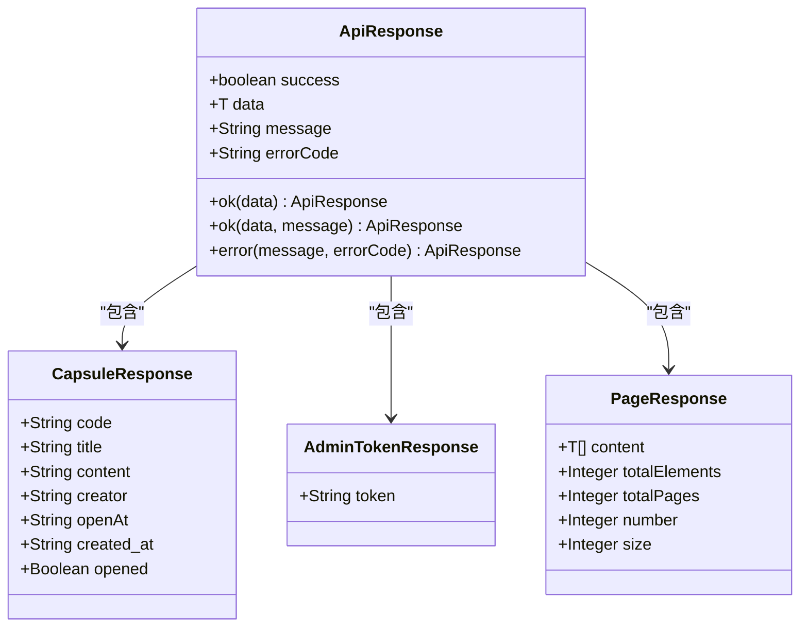
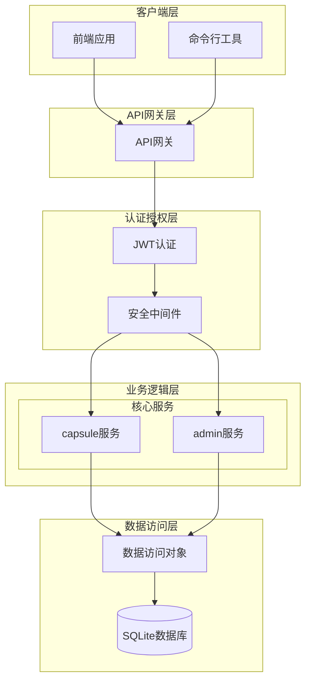
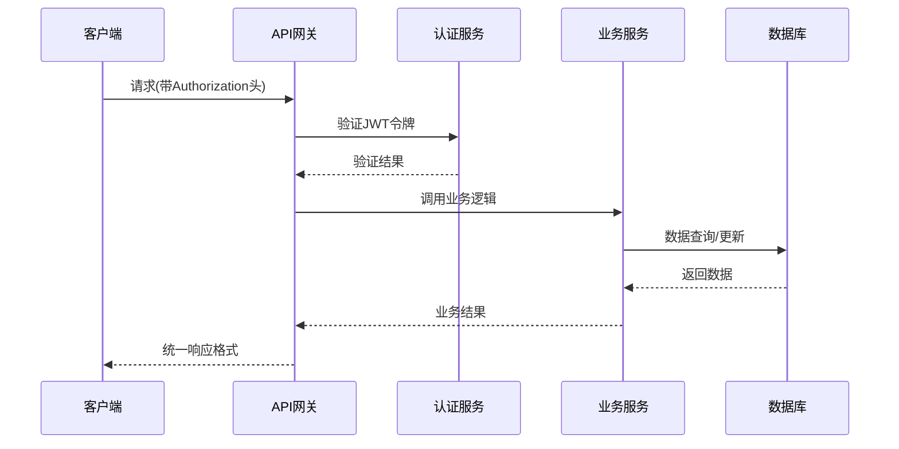
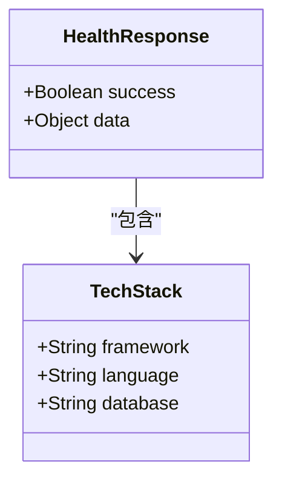
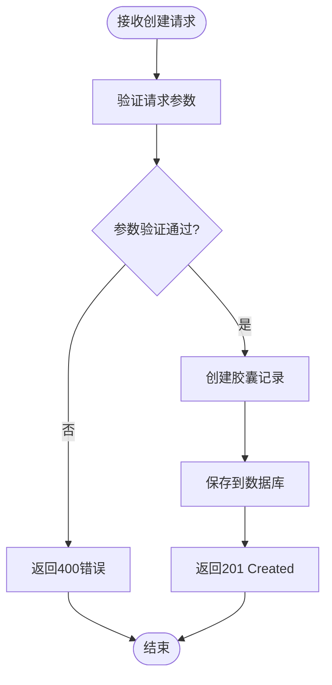
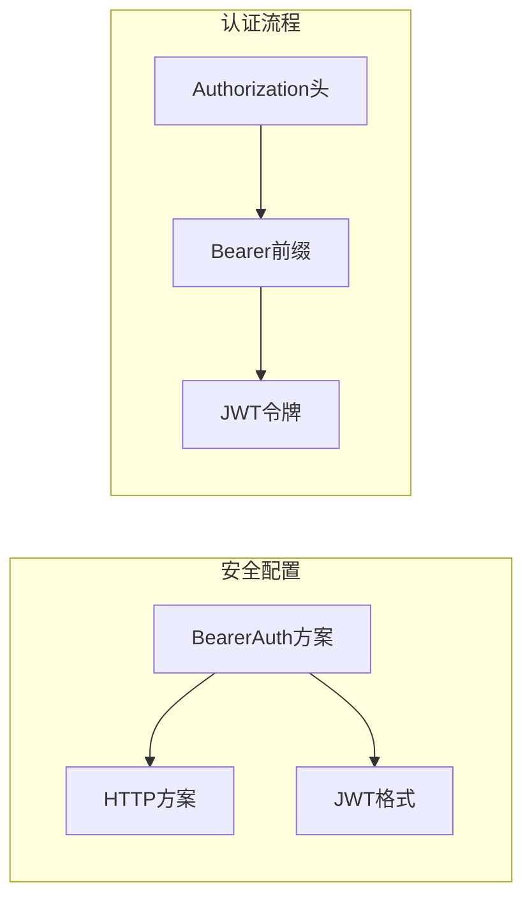
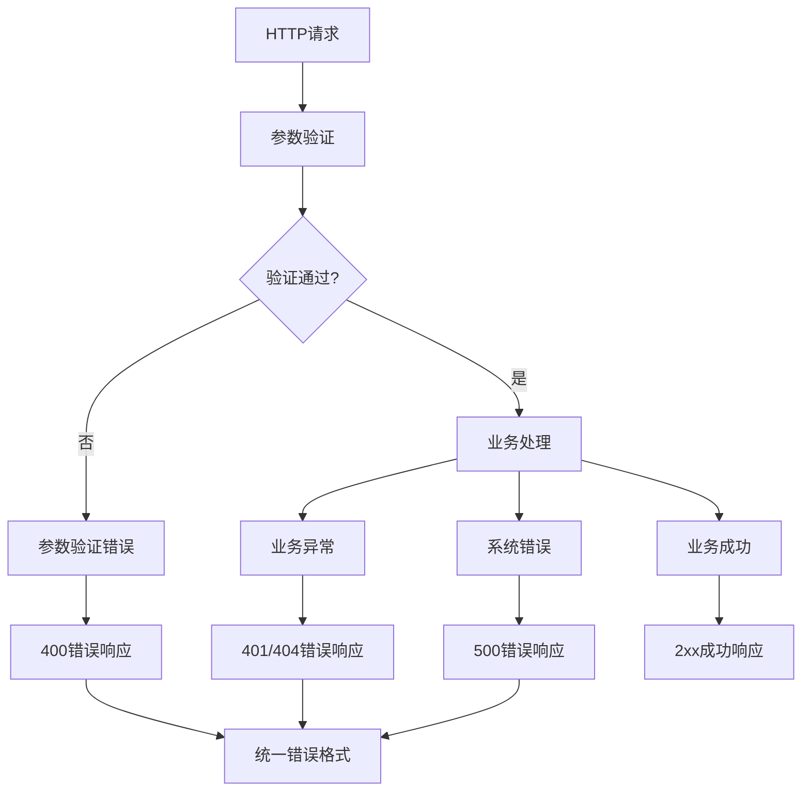

# OpenAPI规范定义

<cite>
**本文档引用的文件**
- [openapi.yaml](file://spec/api/openapi.yaml)
- [api-spec.md](file://docs/api-spec.md)
- [main.py](file://backends/fastapi/app/main.py)
- [schemas.py](file://backends/fastapi/app/schemas.py)
- [capsule.py](file://backends/fastapi/app/routers/capsule.py)
- [admin.py](file://backends/fastapi/app/routers/admin.py)
- [dependencies.py](file://backends/fastapi/app/dependencies.py)
- [HelloTimeApplication.java](file://backends/spring-boot/src/main/java/com/hellotime/HelloTimeApplication.java)
- [CapsuleController.java](file://backends/spring-boot/src/main/java/com/hellotime/controller/CapsuleController.java)
- [AdminController.java](file://backends/spring-boot/src/main/java/com/hellotime/controller/AdminController.java)
- [AdminService.java](file://backends/spring-boot/src/main/java/com/hellotime/service/AdminService.java)
- [ApiResponse.java](file://backends/spring-boot/src/main/java/com/hellotime/dto/ApiResponse.java)
- [CreateCapsuleRequest.java](file://backends/spring-boot/src/main/java/com/hellotime/dto/CreateCapsuleRequest.java)
- [AdminTokenResponse.java](file://backends/spring-boot/src/main/java/com/hellotime/dto/AdminTokenResponse.java)
- [application.yml](file://backends/spring-boot/src/main/resources/application.yml)
</cite>

## 目录
1. [简介](#简介)
2. [项目结构](#项目结构)
3. [核心组件](#核心组件)
4. [架构概览](#架构概览)
5. [详细组件分析](#详细组件分析)
6. [依赖分析](#依赖分析)
7. [性能考虑](#性能考虑)
8. [故障排除指南](#故障排除指南)
9. [结论](#结论)
10. [附录](#附录)

## 简介

HelloTime时间胶囊应用是一个基于OpenAPI 3.0.3规范的REST API系统。该应用提供了时间胶囊的创建、查询、管理和管理员功能。API采用统一的响应格式，支持JWT Bearer认证，并实现了完整的错误处理机制。

本规范文档详细解析了OpenAPI 3.0.3规范文件的完整结构，包括API基本信息、服务器配置、路径定义、组件定义等。同时深入说明了每个API端点的HTTP方法、请求参数、响应格式、错误处理机制。

## 项目结构

该项目采用多后端架构，同时提供了FastAPI和Spring Boot两种实现方式：

**图表来源**
- [openapi.yaml:1-349](file://spec/api/openapi.yaml#L1-L349)
- [main.py:1-89](file://backends/fastapi/app/main.py#L1-L89)
- [HelloTimeApplication.java:1-12](file://backends/spring-boot/src/main/java/com/hellotime/HelloTimeApplication.java#L1-L12)

**章节来源**
- [openapi.yaml:1-349](file://spec/api/openapi.yaml#L1-L349)
- [api-spec.md:1-195](file://docs/api-spec.md#L1-L195)

## 核心组件

### API基本信息

OpenAPI规范定义了以下核心信息：

- **版本信息**: 版本号为1.0.0，遵循语义化版本控制
- **服务器配置**: 默认服务器URL为`http://localhost:8080/api/v1`
- **安全方案**: 定义了JWT Bearer认证方案
- **统一响应格式**: 所有响应遵循统一的数据结构

### 统一响应格式

系统实现了统一的响应包装格式，确保前后端数据交互的一致性：

**图表来源**
- [ApiResponse.java:16-67](file://backends/spring-boot/src/main/java/com/hellotime/dto/ApiResponse.java#L16-L67)
- [schemas.py:81-96](file://backends/fastapi/app/schemas.py#L81-L96)

**章节来源**
- [openapi.yaml:165-349](file://spec/api/openapi.yaml#L165-L349)
- [ApiResponse.java:16-67](file://backends/spring-boot/src/main/java/com/hellotime/dto/ApiResponse.java#L16-L67)
- [schemas.py:81-96](file://backends/fastapi/app/schemas.py#L81-L96)

## 架构概览

### API架构设计

**图表来源**
- [dependencies.py:10-22](file://backends/fastapi/app/dependencies.py#L10-L22)
- [AdminService.java:75-87](file://backends/spring-boot/src/main/java/com/hellotime/service/AdminService.java#L75-L87)

### 数据流架构

**图表来源**
- [admin.py:33-54](file://backends/fastapi/app/routers/admin.py#L33-L54)
- [AdminController.java:57-76](file://backends/spring-boot/src/main/java/com/hellotime/controller/AdminController.java#L57-L76)

## 详细组件分析

### 健康检查端点

健康检查端点提供系统状态监控功能：

| 属性 | 值 |
|------|-----|
| HTTP方法 | GET |
| 路径 | `/health` |
| 认证要求 | 无需认证 |
| 响应码 | 200 |

响应格式包含系统状态、时间戳和技术栈信息：

**图表来源**
- [openapi.yaml:196-227](file://spec/api/openapi.yaml#L196-L227)

**章节来源**
- [openapi.yaml:11-23](file://spec/api/openapi.yaml#L11-L23)
- [api-spec.md:18-31](file://docs/api-spec.md#L18-L31)

### 时间胶囊管理

#### 创建时间胶囊

创建时间胶囊是系统的核心功能，支持用户创建未来可开启的消息胶囊：

| 属性 | 值 |
|------|-----|
| HTTP方法 | POST |
| 路径 | `/capsules` |
| 认证要求 | 无需认证 |
| 响应码 | 201 |

请求参数验证规则：
- `title`: 必填，1-100字符
- `content`: 必填，至少1字符  
- `creator`: 必填，1-30字符
- `openAt`: 必填，未来时间的ISO 8601格式

**图表来源**
- [openapi.yaml:24-48](file://spec/api/openapi.yaml#L24-L48)
- [CreateCapsuleRequest.java:13-55](file://backends/spring-boot/src/main/java/com/hellotime/dto/CreateCapsuleRequest.java#L13-L55)

**章节来源**
- [openapi.yaml:24-48](file://spec/api/openapi.yaml#L24-L48)
- [api-spec.md:35-70](file://docs/api-spec.md#L35-L70)

#### 查询时间胶囊

查询功能支持通过8位胶囊码获取胶囊信息，时间未到时content字段为null：

| 属性 | 值 |
|------|-----|
| HTTP方法 | GET |
| 路径 | `/capsules/{code}` |
| 认证要求 | 无需认证 |
| 响应码 | 200/404 |

路径参数规则：
- `code`: 必填，8位字母数字组合

**章节来源**
- [openapi.yaml:49-74](file://spec/api/openapi.yaml#L49-L74)
- [api-spec.md:73-110](file://docs/api-spec.md#L73-L110)

### 管理员功能

#### 管理员登录

管理员登录功能提供JWT令牌生成：

| 属性 | 值 |
|------|-----|
| HTTP方法 | POST |
| 路径 | `/admin/login` |
| 认证要求 | 无需认证 |
| 响应码 | 200/401 |

请求参数：
- `password`: 必填，管理员密码

响应包含JWT令牌，有效期2小时。

**章节来源**
- [openapi.yaml:75-99](file://spec/api/openapi.yaml#L75-L99)
- [api-spec.md:113-134](file://docs/api-spec.md#L113-L134)

#### 分页查询胶囊

管理员分页查询功能支持分页浏览所有胶囊：

| 属性 | 值 |
|------|-----|
| HTTP方法 | GET |
| 路径 | `/admin/capsules` |
| 认证要求 | 需要JWT认证 |
| 响应码 | 200/401 |

查询参数：
- `page`: 可选，默认0，非负整数
- `size`: 可选，默认20，1-100范围

**章节来源**
- [openapi.yaml:100-131](file://spec/api/openapi.yaml#L100-L131)
- [api-spec.md:137-166](file://docs/api-spec.md#L137-L166)

#### 删除胶囊

管理员删除功能提供胶囊删除能力：

| 属性 | 值 |
|------|-----|
| HTTP方法 | DELETE |
| 路径 | `/admin/capsules/{code}` |
| 认证要求 | 需要JWT认证 |
| 响应码 | 200/401/404 |

**章节来源**
- [openapi.yaml:132-164](file://spec/api/openapi.yaml#L132-L164)
- [api-spec.md:169-182](file://docs/api-spec.md#L169-L182)

## 依赖分析

### 安全方案配置

系统采用JWT Bearer认证方案，配置如下：

**图表来源**
- [openapi.yaml:166-170](file://spec/api/openapi.yaml#L166-L170)
- [dependencies.py:16-19](file://backends/fastapi/app/dependencies.py#L16-L19)

### 错误处理机制

系统实现了统一的错误处理机制：

**图表来源**
- [main.py:37-89](file://backends/fastapi/app/main.py#L37-L89)
- [openapi.yaml:336-349](file://spec/api/openapi.yaml#L336-L349)

**章节来源**
- [openapi.yaml:166-170](file://spec/api/openapi.yaml#L166-L170)
- [main.py:37-89](file://backends/fastapi/app/main.py#L37-L89)

## 性能考虑

### 缓存策略

- **响应缓存**: 健康检查结果可短期缓存
- **数据库连接池**: 使用SQLAlchemy连接池优化数据库访问
- **静态资源**: 前端静态资源可启用浏览器缓存

### 并发处理

- **异步处理**: 支持异步任务处理耗时操作
- **限流机制**: 实现API调用频率限制
- **超时设置**: 合理设置请求超时时间

### 数据库优化

- **索引优化**: 为常用查询字段建立索引
- **查询优化**: 使用分页查询避免大数据量返回
- **连接复用**: 复用数据库连接减少开销

## 故障排除指南

### 常见问题诊断

| 问题类型 | 症状 | 可能原因 | 解决方案 |
|----------|------|----------|----------|
| 认证失败 | 401未授权 | 令牌格式错误或过期 | 检查Authorization头格式，重新登录获取新令牌 |
| 参数验证错误 | 400参数错误 | 请求参数不符合约束 | 检查参数类型、长度和格式要求 |
| 资源不存在 | 404未找到 | 胶囊码错误或已被删除 | 确认胶囊码正确性和存在性 |
| 服务器错误 | 500内部错误 | 服务器异常或数据库问题 | 查看服务器日志，检查数据库连接 |

### 日志分析

- **访问日志**: 记录所有API请求的详细信息
- **错误日志**: 记录异常堆栈和错误详情
- **性能日志**: 记录慢查询和性能瓶颈

**章节来源**
- [main.py:37-89](file://backends/fastapi/app/main.py#L37-L89)
- [api-spec.md:186-195](file://docs/api-spec.md#L186-L195)

## 结论

HelloTime时间胶囊应用的OpenAPI规范定义完整且规范，涵盖了以下关键特性：

1. **完整的API覆盖**: 包含核心功能的所有端点
2. **统一的响应格式**: 确保前后端交互的一致性
3. **完善的错误处理**: 提供详细的错误码和错误信息
4. **安全的认证机制**: 实现JWT Bearer认证
5. **清晰的文档结构**: 符合OpenAPI 3.0.3标准

该规范为系统的开发、测试和部署提供了坚实的基础，支持多后端实现和扩展。

## 附录

### API版本控制策略

系统采用语义化版本控制：
- **主版本**: 重大变更或不兼容修改
- **次版本**: 新功能添加，向后兼容
- **修订版本**: 错误修复，向后兼容

### 最佳实践建议

1. **规范维护**
   - 定期更新API文档
   - 保持OpenAPI文件与实现同步
   - 添加详细的参数描述

2. **安全性**
   - 生产环境使用HTTPS
   - 定期轮换JWT密钥
   - 实施适当的速率限制

3. **性能优化**
   - 实现适当的缓存策略
   - 优化数据库查询
   - 监控API性能指标

4. **测试保障**
   - 编写完整的单元测试
   - 实施集成测试
   - 建立API回归测试