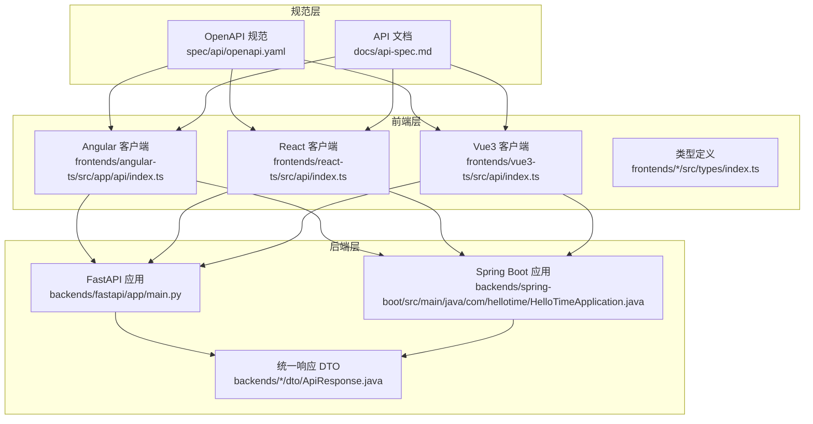
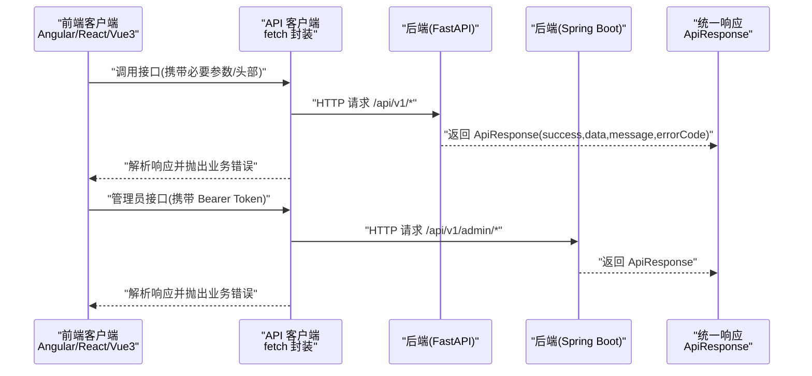
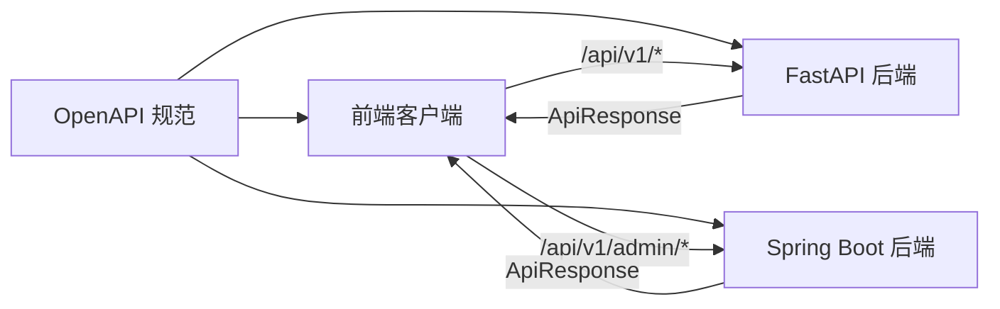

# 统一API规范

<cite>
**本文引用的文件**
- [spec/api/openapi.yaml](file://spec/api/openapi.yaml)
- [docs/api-spec.md](file://docs/api-spec.md)
- [backends/fastapi/app/main.py](file://backends/fastapi/app/main.py)
- [backends/fastapi/app/schemas.py](file://backends/fastapi/app/schemas.py)
- [backends/fastapi/app/routers/capsule.py](file://backends/fastapi/app/routers/capsule.py)
- [backends/fastapi/app/routers/admin.py](file://backends/fastapi/app/routers/admin.py)
- [backends/fastapi/app/models.py](file://backends/fastapi/app/models.py)
- [backends/spring-boot/src/main/java/com/hellotime/HelloTimeApplication.java](file://backends/spring-boot/src/main/java/com/hellotime/HelloTimeApplication.java)
- [backends/spring-boot/src/main/java/com/hellotime/dto/ApiResponse.java](file://backends/spring-boot/src/main/java/com/hellotime/dto/ApiResponse.java)
- [backends/spring-boot/src/main/java/com/hellotime/controller/AdminController.java](file://backends/spring-boot/src/main/java/com/hellotime/controller/AdminController.java)
- [frontends/angular-ts/src/app/api/index.ts](file://frontends/angular-ts/src/app/api/index.ts)
- [frontends/angular-ts/src/app/types/index.ts](file://frontends/angular-ts/src/app/types/index.ts)
- [frontends/react-ts/src/api/index.ts](file://frontends/react-ts/src/api/index.ts)
- [frontends/react-ts/src/types/index.ts](file://frontends/react-ts/src/types/index.ts)
- [frontends/vue3-ts/src/api/index.ts](file://frontends/vue3-ts/src/api/index.ts)
</cite>

## 目录
1. [简介](#简介)
2. [项目结构](#项目结构)
3. [核心组件](#核心组件)
4. [架构总览](#架构总览)
5. [详细组件分析](#详细组件分析)
6. [依赖关系分析](#依赖关系分析)
7. [性能考虑](#性能考虑)
8. [故障排查指南](#故障排查指南)
9. [结论](#结论)
10. [附录](#附录)

## 简介
本文件系统化阐述本项目中基于 OpenAPI 3.0.3 的统一 API 规范实施情况，覆盖规范文件结构、组件与安全方案、跨前端与后端的兼容性保障、API 客户端生成与使用、版本控制与迁移策略、最佳实践以及测试与验证方法。目标是确保 Angular、React、Vue3 三种前端框架与 FastAPI、Spring Boot 两种后端框架在接口契约、数据格式与错误处理上保持高度一致。

## 项目结构
项目采用“规范先行”的设计：以 OpenAPI YAML 作为单一事实来源，驱动后端实现与前端客户端生成与使用。前端通过统一的 API 客户端模块发起请求，后端通过统一响应包装类与异常处理机制保证一致性。

图示来源
- [spec/api/openapi.yaml:1-349](file://spec/api/openapi.yaml#L1-L349)
- [docs/api-spec.md:1-195](file://docs/api-spec.md#L1-L195)
- [backends/fastapi/app/main.py:1-89](file://backends/fastapi/app/main.py#L1-L89)
- [backends/spring-boot/src/main/java/com/hellotime/HelloTimeApplication.java:1-12](file://backends/spring-boot/src/main/java/com/hellotime/HelloTimeApplication.java#L1-L12)
- [frontends/angular-ts/src/app/api/index.ts:1-71](file://frontends/angular-ts/src/app/api/index.ts#L1-L71)
- [frontends/react-ts/src/api/index.ts:1-94](file://frontends/react-ts/src/api/index.ts#L1-L94)
- [frontends/vue3-ts/src/api/index.ts:1-120](file://frontends/vue3-ts/src/api/index.ts#L1-L120)

章节来源
- [spec/api/openapi.yaml:1-349](file://spec/api/openapi.yaml#L1-L349)
- [docs/api-spec.md:1-195](file://docs/api-spec.md#L1-L195)

## 核心组件
- OpenAPI 规范文件：定义服务器地址、路径、参数、响应、安全方案与数据模型组件。
- 统一响应包装：后端通过 ApiResponse 统一输出 success/data/message/errorCode 字段，前端统一解析与错误处理。
- 前端 API 客户端：封装 fetch 请求、统一错误处理、按规范调用后端接口。
- 异常与状态码映射：后端全局异常处理器将业务异常映射为统一错误码与 HTTP 状态码。
- 数据模型与序列化：后端 Pydantic/Spring DTO 与前端 TypeScript 类型保持字段名与格式一致。

章节来源
- [spec/api/openapi.yaml:10-170](file://spec/api/openapi.yaml#L10-L170)
- [backends/fastapi/app/schemas.py:81-96](file://backends/fastapi/app/schemas.py#L81-L96)
- [backends/spring-boot/src/main/java/com/hellotime/dto/ApiResponse.java:16-67](file://backends/spring-boot/src/main/java/com/hellotime/dto/ApiResponse.java#L16-L67)
- [frontends/angular-ts/src/app/api/index.ts:10-27](file://frontends/angular-ts/src/app/api/index.ts#L10-L27)
- [backends/fastapi/app/main.py:37-89](file://backends/fastapi/app/main.py#L37-L89)

## 架构总览
下图展示了从前端客户端到后端服务的完整调用链路，以及统一响应与错误处理的交互。

图示来源
- [frontends/angular-ts/src/app/api/index.ts:10-71](file://frontends/angular-ts/src/app/api/index.ts#L10-L71)
- [frontends/react-ts/src/api/index.ts:14-94](file://frontends/react-ts/src/api/index.ts#L14-L94)
- [frontends/vue3-ts/src/api/index.ts:19-120](file://frontends/vue3-ts/src/api/index.ts#L19-L120)
- [backends/fastapi/app/main.py:37-89](file://backends/fastapi/app/main.py#L37-L89)
- [backends/spring-boot/src/main/java/com/hellotime/dto/ApiResponse.java:16-67](file://backends/spring-boot/src/main/java/com/hellotime/dto/ApiResponse.java#L16-L67)

## 详细组件分析

### OpenAPI 规范文件结构与组件
- 服务器与基础路径：定义基础服务器地址为本地开发环境的 /api/v1。
- 路径与操作：涵盖健康检查、创建胶囊、查询胶囊、管理员登录、分页查询胶囊、删除胶囊等。
- 安全方案：定义 BearerAuth 使用 JWT。
- 数据模型组件：包含请求体、响应体、分页、错误响应等复用模型。

章节来源
- [spec/api/openapi.yaml:7-170](file://spec/api/openapi.yaml#L7-L170)

### 统一响应与错误处理
- 统一响应结构：success、data、message、errorCode 四要素，便于前端统一处理。
- FastAPI 异常映射：将业务异常映射为统一错误码与 HTTP 状态码，并通过 ApiResponse 输出。
- Spring Boot 统一响应：通过 ApiResponse 静态工厂方法构造成功/失败响应。
- 前端统一错误处理：当 response.ok 为 false 或 data.success 为 false 时抛出错误，避免重复判断。

章节来源
- [backends/fastapi/app/schemas.py:81-96](file://backends/fastapi/app/schemas.py#L81-L96)
- [backends/fastapi/app/main.py:37-89](file://backends/fastapi/app/main.py#L37-L89)
- [backends/spring-boot/src/main/java/com/hellotime/dto/ApiResponse.java:16-67](file://backends/spring-boot/src/main/java/com/hellotime/dto/ApiResponse.java#L16-L67)
- [frontends/angular-ts/src/app/api/index.ts:10-27](file://frontends/angular-ts/src/app/api/index.ts#L10-L27)
- [frontends/react-ts/src/api/index.ts:14-31](file://frontends/react-ts/src/api/index.ts#L14-L31)
- [frontends/vue3-ts/src/api/index.ts:19-37](file://frontends/vue3-ts/src/api/index.ts#L19-L37)

### 前端 API 客户端与类型定义
- 基础路径：统一为 /api/v1，便于与 OpenAPI 规范保持一致。
- 请求封装：统一封装 fetch，设置 Content-Type，合并自定义头部。
- 错误处理：统一校验 response.ok 与 data.success，抛出可读错误。
- 类型定义：与后端响应严格对齐，包括 Capsule、ApiResponse、PageData、AdminToken、HealthInfo 等。

章节来源
- [frontends/angular-ts/src/app/api/index.ts:8-71](file://frontends/angular-ts/src/app/api/index.ts#L8-L71)
- [frontends/angular-ts/src/app/types/index.ts:6-53](file://frontends/angular-ts/src/app/types/index.ts#L6-L53)
- [frontends/react-ts/src/api/index.ts:8-94](file://frontends/react-ts/src/api/index.ts#L8-L94)
- [frontends/react-ts/src/types/index.ts:10-80](file://frontends/react-ts/src/types/index.ts#L10-L80)
- [frontends/vue3-ts/src/api/index.ts:8-120](file://frontends/vue3-ts/src/api/index.ts#L8-L120)

### 后端实现要点
- FastAPI
  - 路由前缀与标签：统一 /api/v1 前缀与标签，与 OpenAPI 一致。
  - 响应模型：使用 ApiResponse 泛型包装，遵循 camelCase 序列化。
  - 异常处理：全局捕获业务异常与参数校验异常，映射为统一错误码与 HTTP 状态码。
- Spring Boot
  - 控制器：AdminController 提供登录、分页查询、删除等接口，均返回 ApiResponse。
  - 统一响应：ApiResponse 支持泛型数据与静态工厂方法，Jackson 序列化时忽略 null 字段。
  - 应用入口：SpringBootApplication 启动类。

章节来源
- [backends/fastapi/app/routers/capsule.py:14-31](file://backends/fastapi/app/routers/capsule.py#L14-L31)
- [backends/fastapi/app/routers/admin.py:22-55](file://backends/fastapi/app/routers/admin.py#L22-L55)
- [backends/fastapi/app/schemas.py:26-96](file://backends/fastapi/app/schemas.py#L26-L96)
- [backends/fastapi/app/main.py:37-89](file://backends/fastapi/app/main.py#L37-L89)
- [backends/spring-boot/src/main/java/com/hellotime/controller/AdminController.java:16-78](file://backends/spring-boot/src/main/java/com/hellotime/controller/AdminController.java#L16-L78)
- [backends/spring-boot/src/main/java/com/hellotime/dto/ApiResponse.java:16-67](file://backends/spring-boot/src/main/java/com/hellotime/dto/ApiResponse.java#L16-L67)
- [backends/spring-boot/src/main/java/com/hellotime/HelloTimeApplication.java:6-11](file://backends/spring-boot/src/main/java/com/hellotime/HelloTimeApplication.java#L6-L11)

### 数据模型与序列化
- FastAPI：Pydantic 模型使用 alias_generator 实现 snake_case 到 camelCase 的序列化，确保与前端类型一致。
- Spring Boot：DTO 字段命名与前端类型一致；Jackson 通过 JsonInclude.NON_NULL 减少响应体积。
- 前端类型：与后端响应严格对齐，避免字段不一致导致的解析问题。

章节来源
- [backends/fastapi/app/schemas.py:14-18](file://backends/fastapi/app/schemas.py#L14-L18)
- [backends/fastapi/app/schemas.py:54-64](file://backends/fastapi/app/schemas.py#L54-L64)
- [backends/spring-boot/src/main/java/com/hellotime/dto/ApiResponse.java:16-67](file://backends/spring-boot/src/main/java/com/hellotime/dto/ApiResponse.java#L16-L67)
- [frontends/angular-ts/src/app/types/index.ts:6-53](file://frontends/angular-ts/src/app/types/index.ts#L6-L53)
- [frontends/react-ts/src/types/index.ts:10-80](file://frontends/react-ts/src/types/index.ts#L10-L80)

### API 版本控制与迁移策略
- 版本号：OpenAPI 中 info.version 为 1.0.0；后端应用也标注版本。
- 迁移路径：新增接口时在 OpenAPI 中添加新路径与模型，同时在后端实现并保持统一响应；对废弃接口保留一段时间并在 OpenAPI 中标记弃用，前端逐步替换调用。

章节来源
- [spec/api/openapi.yaml:2-5](file://spec/api/openapi.yaml#L2-L5)
- [backends/fastapi/app/main.py:19](file://backends/fastapi/app/main.py#L19)

### API 客户端生成与使用
- 客户端生成：可基于 OpenAPI YAML 使用工具生成 TypeScript 客户端，确保类型与契约一致。
- 统一模式：前端三个框架共享同一套 API 客户端封装与类型定义，降低维护成本。
- 错误处理：统一在客户端层进行业务错误与网络错误的判定与抛出。

章节来源
- [spec/api/openapi.yaml:10-170](file://spec/api/openapi.yaml#L10-L170)
- [frontends/angular-ts/src/app/api/index.ts:10-71](file://frontends/angular-ts/src/app/api/index.ts#L10-L71)
- [frontends/react-ts/src/api/index.ts:14-94](file://frontends/react-ts/src/api/index.ts#L14-L94)
- [frontends/vue3-ts/src/api/index.ts:19-120](file://frontends/vue3-ts/src/api/index.ts#L19-L120)

### 最佳实践
- 参数命名：统一使用 camelCase（后端 Pydantic alias_generator），前端类型与后端 DTO 保持一致。
- 响应格式：统一 ApiResponse 结构，避免多套响应格式。
- 错误码：后端异常映射到统一错误码，前端统一处理。
- 时间格式：统一使用 ISO 8601 字符串，后端内部解析为 datetime 并转换为 UTC。
- 分页参数：后端限制每页最大值，前端传入默认页码与大小。

章节来源
- [backends/fastapi/app/schemas.py:14-18](file://backends/fastapi/app/schemas.py#L14-L18)
- [backends/fastapi/app/schemas.py:34-44](file://backends/fastapi/app/schemas.py#L34-L44)
- [backends/fastapi/app/main.py:58-70](file://backends/fastapi/app/main.py#L58-L70)
- [backends/spring-boot/src/main/java/com/hellotime/dto/ApiResponse.java:16-67](file://backends/spring-boot/src/main/java/com/hellotime/dto/ApiResponse.java#L16-L67)
- [frontends/react-ts/src/types/index.ts:10-80](file://frontends/react-ts/src/types/index.ts#L10-L80)

### API 测试与验证
- OpenAPI 校验：使用工具对 openapi.yaml 进行语法与契约校验。
- 单元测试：后端路由与服务层编写单元测试，覆盖正常与异常场景。
- 端到端测试：前端通过 API 客户端发起真实请求，验证响应结构与错误处理。
- 文档一致性：docs/api-spec.md 与 OpenAPI 保持同步更新。

章节来源
- [spec/api/openapi.yaml:10-170](file://spec/api/openapi.yaml#L10-L170)
- [docs/api-spec.md:1-195](file://docs/api-spec.md#L1-L195)

## 依赖关系分析
- 前端依赖 OpenAPI 规范与后端统一响应结构，确保契约一致。
- 后端依赖统一响应 DTO 与异常处理机制，保证输出一致性。
- FastAPI 与 Spring Boot 在路由前缀、安全方案与响应结构上保持一致。

图示来源
- [spec/api/openapi.yaml:7-170](file://spec/api/openapi.yaml#L7-L170)
- [frontends/angular-ts/src/app/api/index.ts:8-71](file://frontends/angular-ts/src/app/api/index.ts#L8-L71)
- [frontends/react-ts/src/api/index.ts:8-94](file://frontends/react-ts/src/api/index.ts#L8-L94)
- [frontends/vue3-ts/src/api/index.ts:8-120](file://frontends/vue3-ts/src/api/index.ts#L8-L120)
- [backends/fastapi/app/main.py:37-89](file://backends/fastapi/app/main.py#L37-L89)
- [backends/spring-boot/src/main/java/com/hellotime/dto/ApiResponse.java:16-67](file://backends/spring-boot/src/main/java/com/hellotime/dto/ApiResponse.java#L16-L67)

章节来源
- [spec/api/openapi.yaml:7-170](file://spec/api/openapi.yaml#L7-L170)
- [frontends/angular-ts/src/app/api/index.ts:8-71](file://frontends/angular-ts/src/app/api/index.ts#L8-L71)
- [frontends/react-ts/src/api/index.ts:8-94](file://frontends/react-ts/src/api/index.ts#L8-L94)
- [frontends/vue3-ts/src/api/index.ts:8-120](file://frontends/vue3-ts/src/api/index.ts#L8-L120)
- [backends/fastapi/app/main.py:37-89](file://backends/fastapi/app/main.py#L37-L89)
- [backends/spring-boot/src/main/java/com/hellotime/dto/ApiResponse.java:16-67](file://backends/spring-boot/src/main/java/com/hellotime/dto/ApiResponse.java#L16-L67)

## 性能考虑
- 响应体积优化：Spring Boot 使用 Jackson 非空字段序列化，减少传输体积。
- 前端缓存策略：在前端层对只读数据（如健康信息）进行简单缓存，避免重复请求。
- 分页参数限制：后端限制每页最大条数，防止过大请求影响性能。
- 异常快速失败：后端在参数校验阶段尽早返回错误，减少无效计算。

## 故障排查指南
- 响应结构不符：检查前端类型定义与后端响应结构是否一致，确认 camelCase 序列化生效。
- 错误码不匹配：核对后端异常映射与统一响应错误码，确保前端统一处理逻辑正确。
- 认证失败：确认前端是否正确传递 Bearer Token，后端是否正确校验。
- 时间格式问题：确保前端发送 ISO 8601 字符串，后端正确解析为 UTC。

章节来源
- [backends/fastapi/app/schemas.py:14-18](file://backends/fastapi/app/schemas.py#L14-L18)
- [backends/fastapi/app/main.py:58-70](file://backends/fastapi/app/main.py#L58-L70)
- [frontends/angular-ts/src/app/api/index.ts:10-27](file://frontends/angular-ts/src/app/api/index.ts#L10-L27)

## 结论
通过以 OpenAPI 3.0.3 为核心，结合统一响应包装、严格的类型定义与一致的错误处理机制，本项目实现了 Angular、React、Vue3 三端与 FastAPI、Spring Boot 两端之间的高一致性与可维护性。建议持续以 OpenAPI 为单一事实来源，配合自动化测试与文档校验，保障 API 的长期稳定演进。

## 附录
- OpenAPI 规范与文档：[spec/api/openapi.yaml](file://spec/api/openapi.yaml)、[docs/api-spec.md](file://docs/api-spec.md)
- 前端客户端与类型：Angular、React、Vue3 的 API 客户端与类型定义
- 后端实现：FastAPI 与 Spring Boot 的路由、响应包装与异常处理