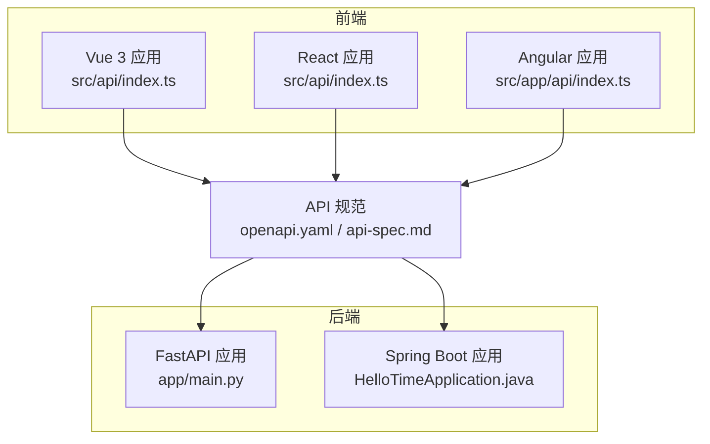
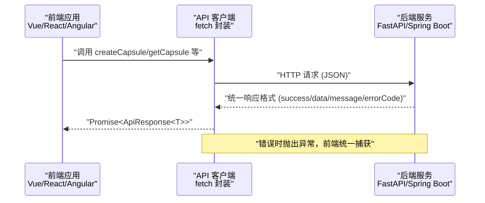
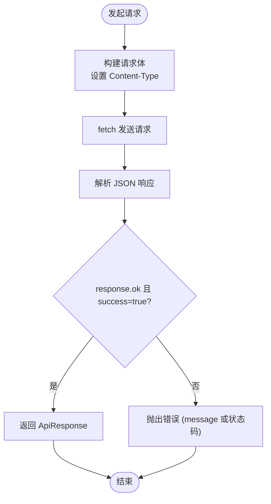
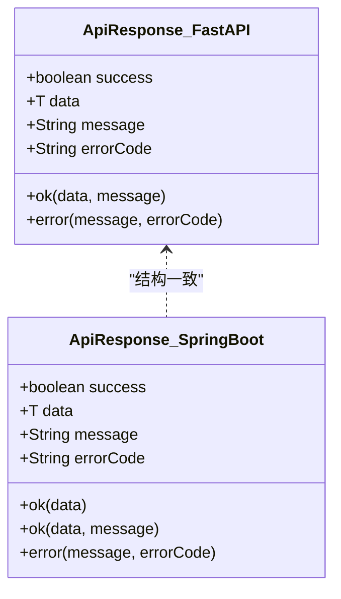
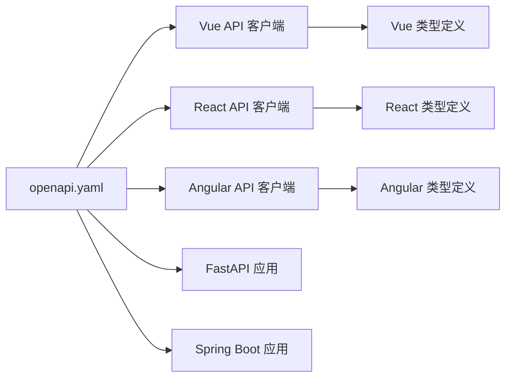

# 跨框架兼容性

<cite>
**本文引用的文件**
- [docs/api-spec.md](file://docs/api-spec.md)
- [spec/api/openapi.yaml](file://spec/api/openapi.yaml)
- [backends/fastapi/README.md](file://backends/fastapi/README.md)
- [backends/fastapi/app/main.py](file://backends/fastapi/app/main.py)
- [backends/fastapi/app/schemas.py](file://backends/fastapi/app/schemas.py)
- [backends/spring-boot/README.md](file://backends/spring-boot/README.md)
- [backends/spring-boot/src/main/java/com/hellotime/HelloTimeApplication.java](file://backends/spring-boot/src/main/java/com/hellotime/HelloTimeApplication.java)
- [backends/spring-boot/src/main/java/com/hellotime/dto/ApiResponse.java](file://backends/spring-boot/src/main/java/com/hellotime/dto/ApiResponse.java)
- [frontends/vue3-ts/package.json](file://frontends/vue3-ts/package.json)
- [frontends/vue3-ts/src/api/index.ts](file://frontends/vue3-ts/src/api/index.ts)
- [frontends/vue3-ts/src/types/index.ts](file://frontends/vue3-ts/src/types/index.ts)
- [frontends/react-ts/package.json](file://frontends/react-ts/package.json)
- [frontends/react-ts/src/api/index.ts](file://frontends/react-ts/src/api/index.ts)
- [frontends/react-ts/src/types/index.ts](file://frontends/react-ts/src/types/index.ts)
- [frontends/angular-ts/package.json](file://frontends/angular-ts/package.json)
- [frontends/angular-ts/src/app/api/index.ts](file://frontends/angular-ts/src/app/api/index.ts)
- [frontends/angular-ts/src/app/types/index.ts](file://frontends/angular-ts/src/app/types/index.ts)
</cite>

## 目录
1. [简介](#简介)
2. [项目结构](#项目结构)
3. [核心组件](#核心组件)
4. [架构总览](#架构总览)
5. [详细组件分析](#详细组件分析)
6. [依赖关系分析](#依赖关系分析)
7. [性能考量](#性能考量)
8. [故障排查指南](#故障排查指南)
9. [结论](#结论)
10. [附录](#附录)

## 简介
本文件旨在建立一套完整的跨框架兼容性方案，确保 Vue 3、React、Angular 三大前端框架与 FastAPI、Spring Boot 两大后端框架在 API 层面实现完全一致的交互体验。通过统一的 API 协议、统一的请求/响应格式、统一的错误码体系以及一致的版本控制策略，达成“一次设计，多端复用”的目标。

## 项目结构
项目采用“前后端分离 + 多前端框架并存”的组织方式：
- 后端：FastAPI 与 Spring Boot 并行实现相同业务逻辑，共享统一的 OpenAPI 规范与响应契约
- 前端：Vue 3、React、Angular 各自独立工程，共享统一的 API 客户端与类型定义
- 规范：OpenAPI YAML 与 Markdown 文档共同约束接口行为与数据模型

图表来源
- [frontends/vue3-ts/src/api/index.ts:1-120](file://frontends/vue3-ts/src/api/index.ts#L1-L120)
- [frontends/react-ts/src/api/index.ts:1-94](file://frontends/react-ts/src/api/index.ts#L1-L94)
- [frontends/angular-ts/src/app/api/index.ts:1-71](file://frontends/angular-ts/src/app/api/index.ts#L1-L71)
- [spec/api/openapi.yaml:1-349](file://spec/api/openapi.yaml#L1-L349)
- [backends/fastapi/app/main.py:1-89](file://backends/fastapi/app/main.py#L1-L89)
- [backends/spring-boot/src/main/java/com/hellotime/HelloTimeApplication.java:1-12](file://backends/spring-boot/src/main/java/com/hellotime/HelloTimeApplication.java#L1-L12)

章节来源
- [frontends/vue3-ts/package.json:1-30](file://frontends/vue3-ts/package.json#L1-L30)
- [frontends/react-ts/package.json:1-31](file://frontends/react-ts/package.json#L1-L31)
- [frontends/angular-ts/package.json:1-38](file://frontends/angular-ts/package.json#L1-L38)
- [spec/api/openapi.yaml:1-349](file://spec/api/openapi.yaml#L1-L349)

## 核心组件
- 统一 API 规范：以 OpenAPI 3.0.3 为核心，明确 HTTP 方法、URL 模式、请求/响应结构与错误码映射
- 统一响应格式：所有接口返回统一的 ApiResponse 结构，包含 success、data、message、errorCode
- 统一错误码：定义 VALIDATION_ERROR、BAD_REQUEST、UNAUTHORIZED、CAPSULE_NOT_FOUND、INTERNAL_ERROR 等标准错误码
- 前端 API 客户端：各前端工程均实现相同的 API 客户端，负责统一的请求封装、鉴权头注入与错误处理
- 类型定义：前后端共享 TypeScript/Java DTO，确保数据模型一致性

章节来源
- [docs/api-spec.md:1-195](file://docs/api-spec.md#L1-L195)
- [spec/api/openapi.yaml:1-349](file://spec/api/openapi.yaml#L1-L349)
- [frontends/vue3-ts/src/types/index.ts:1-80](file://frontends/vue3-ts/src/types/index.ts#L1-L80)
- [frontends/react-ts/src/types/index.ts:1-80](file://frontends/react-ts/src/types/index.ts#L1-L80)
- [frontends/angular-ts/src/app/types/index.ts:1-53](file://frontends/angular-ts/src/app/types/index.ts#L1-L53)
- [backends/spring-boot/src/main/java/com/hellotime/dto/ApiResponse.java:1-68](file://backends/spring-boot/src/main/java/com/hellotime/dto/ApiResponse.java#L1-L68)

## 架构总览
下图展示了跨框架兼容的关键交互流程：前端通过统一 API 客户端发起请求，后端按统一规范返回响应，错误码与消息保持一致，便于前端统一处理。

图表来源
- [frontends/vue3-ts/src/api/index.ts:19-37](file://frontends/vue3-ts/src/api/index.ts#L19-L37)
- [frontends/react-ts/src/api/index.ts:14-31](file://frontends/react-ts/src/api/index.ts#L14-L31)
- [frontends/angular-ts/src/app/api/index.ts:10-27](file://frontends/angular-ts/src/app/api/index.ts#L10-L27)
- [backends/fastapi/app/schemas.py:81-96](file://backends/fastapi/app/schemas.py#L81-L96)
- [backends/spring-boot/src/main/java/com/hellotime/dto/ApiResponse.java:15-67](file://backends/spring-boot/src/main/java/com/hellotime/dto/ApiResponse.java#L15-L67)

## 详细组件分析

### API 协议一致性保障
- HTTP 方法与 URL 模式：由 OpenAPI 明确声明，前后端严格对齐
- 请求/响应格式：统一 ApiResponse 结构；请求体字段命名采用 camelCase，时间字段统一 ISO 8601 字符串
- 错误码定义：统一映射到标准错误码，便于前端一致化处理

章节来源
- [docs/api-spec.md:16-195](file://docs/api-spec.md#L16-L195)
- [spec/api/openapi.yaml:10-164](file://spec/api/openapi.yaml#L10-L164)
- [backends/fastapi/app/schemas.py:14-18](file://backends/fastapi/app/schemas.py#L14-L18)
- [backends/fastapi/app/schemas.py:26-45](file://backends/fastapi/app/schemas.py#L26-L45)
- [backends/fastapi/app/schemas.py:54-65](file://backends/fastapi/app/schemas.py#L54-L65)
- [backends/spring-boot/src/main/java/com/hellotime/dto/ApiResponse.java:15-67](file://backends/spring-boot/src/main/java/com/hellotime/dto/ApiResponse.java#L15-L67)

### 前端 API 客户端实现对比
- 基础路径：统一为 /api/v1
- 统一封装：基于 fetch，自动设置 Content-Type，解析 JSON，抛出业务错误与 HTTP 错误
- 鉴权头：管理员接口统一注入 Authorization: Bearer {token}
- 时间字段：前端将 Date 转换为 ISO 8601 字符串再发送

图表来源
- [frontends/vue3-ts/src/api/index.ts:19-37](file://frontends/vue3-ts/src/api/index.ts#L19-L37)
- [frontends/react-ts/src/api/index.ts:14-31](file://frontends/react-ts/src/api/index.ts#L14-L31)
- [frontends/angular-ts/src/app/api/index.ts:10-27](file://frontends/angular-ts/src/app/api/index.ts#L10-L27)

章节来源
- [frontends/vue3-ts/src/api/index.ts:8-119](file://frontends/vue3-ts/src/api/index.ts#L8-L119)
- [frontends/react-ts/src/api/index.ts:8-93](file://frontends/react-ts/src/api/index.ts#L8-L93)
- [frontends/angular-ts/src/app/api/index.ts:8-71](file://frontends/angular-ts/src/app/api/index.ts#L8-L71)

### 后端统一响应与异常处理
- FastAPI：全局异常处理器将业务异常与通用异常转换为统一 ApiResponse，并设置对应 HTTP 状态码
- Spring Boot：统一响应类 ApiResponse 提供 ok/error 工厂方法，Jackson 序列化时忽略 null 字段

图表来源
- [backends/fastapi/app/schemas.py:81-96](file://backends/fastapi/app/schemas.py#L81-L96)
- [backends/spring-boot/src/main/java/com/hellotime/dto/ApiResponse.java:15-67](file://backends/spring-boot/src/main/java/com/hellotime/dto/ApiResponse.java#L15-L67)

章节来源
- [backends/fastapi/app/main.py:37-89](file://backends/fastapi/app/main.py#L37-L89)
- [backends/fastapi/app/schemas.py:81-96](file://backends/fastapi/app/schemas.py#L81-L96)
- [backends/spring-boot/src/main/java/com/hellotime/dto/ApiResponse.java:15-67](file://backends/spring-boot/src/main/java/com/hellotime/dto/ApiResponse.java#L15-L67)

### 数据模型与类型定义
- 前端类型：与后端 DTO 保持一致，确保序列化/反序列化无歧义
- 时间字段：统一使用 ISO 8601 字符串，避免时区与解析差异
- 可选字段：content 在未到开启时间时为 null/undefined，opened 为可选布尔值

章节来源
- [frontends/vue3-ts/src/types/index.ts:10-79](file://frontends/vue3-ts/src/types/index.ts#L10-L79)
- [frontends/react-ts/src/types/index.ts:10-79](file://frontends/react-ts/src/types/index.ts#L10-L79)
- [frontends/angular-ts/src/app/types/index.ts:6-52](file://frontends/angular-ts/src/app/types/index.ts#L6-L52)
- [backends/fastapi/app/schemas.py:54-65](file://backends/fastapi/app/schemas.py#L54-L65)

### 版本控制与演进策略
- API 版本：统一在基础路径中体现 /api/v1，便于未来扩展 /api/v2
- OpenAPI 版本：OpenAPI 3.0.3 作为契约基线，新增字段采用可选策略，避免破坏性变更
- 前端类型：保持向后兼容，新增字段标记为可选，逐步迁移
- 后端：新增字段默认可空，旧字段保持不变，确保兼容性

章节来源
- [docs/api-spec.md](file://docs/api-spec.md#L3)
- [spec/api/openapi.yaml:1-6](file://spec/api/openapi.yaml#L1-L6)
- [frontends/vue3-ts/src/types/index.ts:35-40](file://frontends/vue3-ts/src/types/index.ts#L35-L40)
- [frontends/react-ts/src/types/index.ts:35-40](file://frontends/react-ts/src/types/index.ts#L35-L40)
- [frontends/angular-ts/src/app/types/index.ts:23-28](file://frontends/angular-ts/src/app/types/index.ts#L23-L28)

### 兼容性测试与验证
- 自动化测试：前端使用 Vitest/Jest，后端使用 pytest/JUnit，覆盖核心接口与边界条件
- OpenAPI 验证：基于 openapi.yaml 生成客户端/服务端桩，进行契约驱动测试
- 端到端测试：通过 cURL 或 Postman 验证接口行为与响应一致性
- 跨框架对比：同时启动 FastAPI 与 Spring Boot，分别调用同一套接口，比对响应结构与错误码

章节来源
- [backends/fastapi/README.md:118-129](file://backends/fastapi/README.md#L118-L129)
- [backends/spring-boot/README.md:89-97](file://backends/spring-boot/README.md#L89-L97)
- [spec/api/openapi.yaml:1-349](file://spec/api/openapi.yaml#L1-L349)

## 依赖关系分析
- 前端依赖：Vue 3、React、Angular 各自生态稳定，API 客户端与类型定义相互独立但契约一致
- 后端依赖：FastAPI 使用 Pydantic 进行数据校验与序列化；Spring Boot 使用 Jackson 进行 JSON 序列化
- 规范依赖：OpenAPI YAML 作为契约，被前后端共同遵守

图表来源
- [spec/api/openapi.yaml:1-349](file://spec/api/openapi.yaml#L1-L349)
- [frontends/vue3-ts/src/api/index.ts:1-120](file://frontends/vue3-ts/src/api/index.ts#L1-L120)
- [frontends/react-ts/src/api/index.ts:1-94](file://frontends/react-ts/src/api/index.ts#L1-L94)
- [frontends/angular-ts/src/app/api/index.ts:1-71](file://frontends/angular-ts/src/app/api/index.ts#L1-L71)
- [frontends/vue3-ts/src/types/index.ts:1-80](file://frontends/vue3-ts/src/types/index.ts#L1-L80)
- [frontends/react-ts/src/types/index.ts:1-80](file://frontends/react-ts/src/types/index.ts#L1-L80)
- [frontends/angular-ts/src/app/types/index.ts:1-53](file://frontends/angular-ts/src/app/types/index.ts#L1-L53)
- [backends/fastapi/app/main.py:1-89](file://backends/fastapi/app/main.py#L1-L89)
- [backends/spring-boot/src/main/java/com/hellotime/HelloTimeApplication.java:1-12](file://backends/spring-boot/src/main/java/com/hellotime/HelloTimeApplication.java#L1-L12)

章节来源
- [frontends/vue3-ts/package.json:13-28](file://frontends/vue3-ts/package.json#L13-L28)
- [frontends/react-ts/package.json:13-29](file://frontends/react-ts/package.json#L13-L29)
- [frontends/angular-ts/package.json:11-36](file://frontends/angular-ts/package.json#L11-L36)
- [backends/fastapi/README.md:7-19](file://backends/fastapi/README.md#L7-L19)
- [backends/spring-boot/README.md:5-20](file://backends/spring-boot/README.md#L5-L20)

## 性能考量
- 响应体积：Spring Boot 使用 Jackson 的 JsonInclude.Include.NON_NULL，减少空字段传输
- 序列化开销：前后端统一使用 JSON 与 ISO 8601 字符串，避免额外转换成本
- 缓存策略：建议在网关或 CDN 层对只读接口（如健康检查、胶囊详情）实施缓存
- 并发请求：前端 API 客户端按需并发，注意后端限流与数据库连接池配置

## 故障排查指南
- 统一错误处理：前端在 request 封装中统一判断 response.ok 与 data.success，任何不满足即抛错
- 常见问题定位
  - 参数校验失败：检查请求体字段类型与长度限制，参考 OpenAPI 中的字段约束
  - 未授权访问：确认管理员接口是否正确携带 Authorization: Bearer {token}
  - 胶囊不存在：确认 code 是否为 8 位字符，且符合后端规则
  - 时间字段问题：确保前端将 Date 转换为 ISO 8601 字符串后再发送
- 日志与监控：后端记录统一响应与异常上下文，前端捕获异常并上报

章节来源
- [frontends/vue3-ts/src/api/index.ts:19-37](file://frontends/vue3-ts/src/api/index.ts#L19-L37)
- [frontends/react-ts/src/api/index.ts:14-31](file://frontends/react-ts/src/api/index.ts#L14-L31)
- [frontends/angular-ts/src/app/api/index.ts:10-27](file://frontends/angular-ts/src/app/api/index.ts#L10-L27)
- [backends/fastapi/app/main.py:37-89](file://backends/fastapi/app/main.py#L37-L89)
- [docs/api-spec.md:186-195](file://docs/api-spec.md#L186-L195)

## 结论
通过统一的 API 规范、统一的响应格式与错误码、一致的数据模型与版本控制策略，本项目实现了 Vue 3、React、Angular 与 FastAPI、Spring Boot 的跨框架兼容。前端仅需关注契约与类型，后端专注于业务实现，双方通过 OpenAPI 契约协同，确保了高一致性与可维护性。

## 附录
- 快速对照表
  - 基础路径：/api/v1
  - 统一响应：success、data、message、errorCode
  - 错误码：VALIDATION_ERROR、BAD_REQUEST、UNAUTHORIZED、CAPSULE_NOT_FOUND、INTERNAL_ERROR
  - 时间格式：ISO 8601 字符串
  - 鉴权头：Authorization: Bearer {token}

章节来源
- [docs/api-spec.md:3-14](file://docs/api-spec.md#L3-L14)
- [docs/api-spec.md:186-195](file://docs/api-spec.md#L186-L195)
- [spec/api/openapi.yaml:1-349](file://spec/api/openapi.yaml#L1-L349)