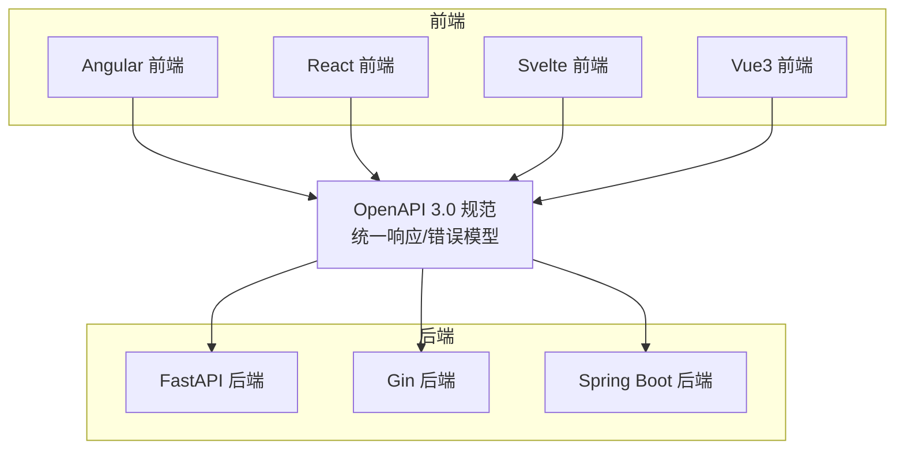
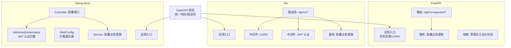
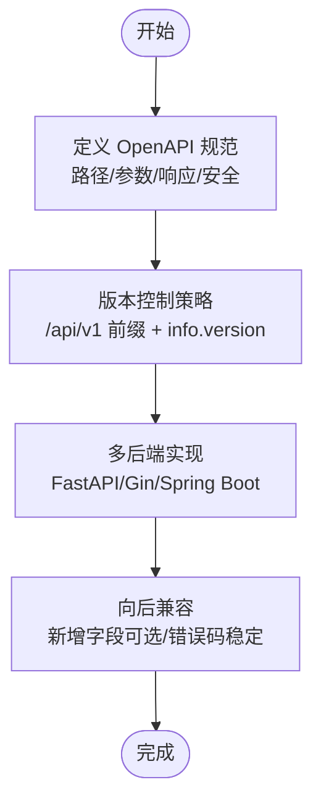
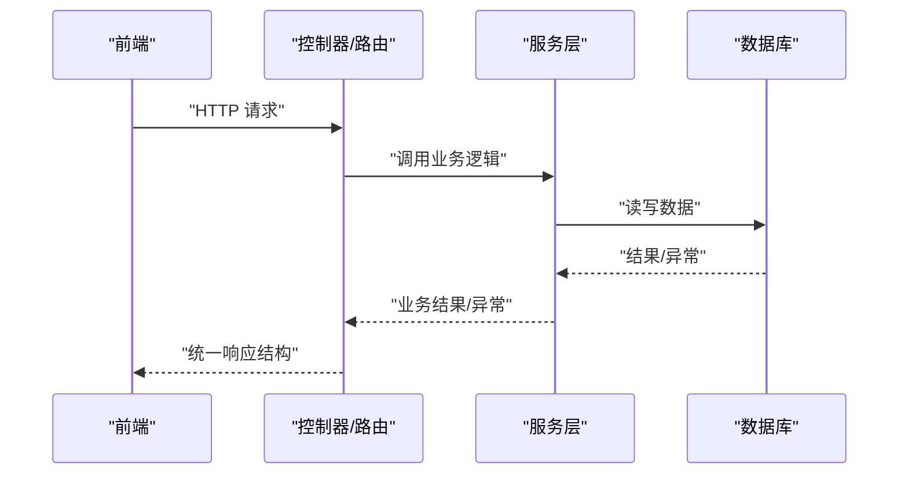
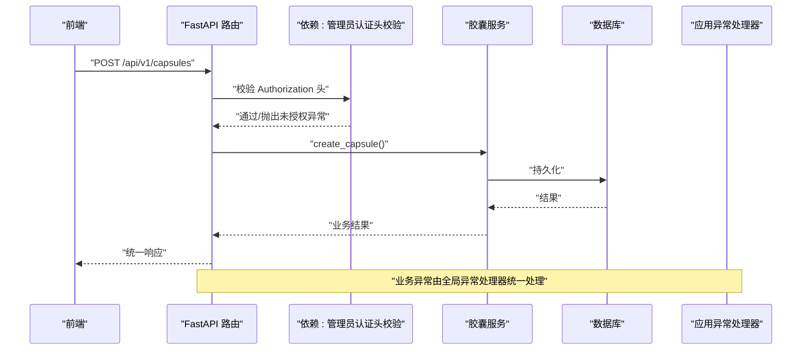
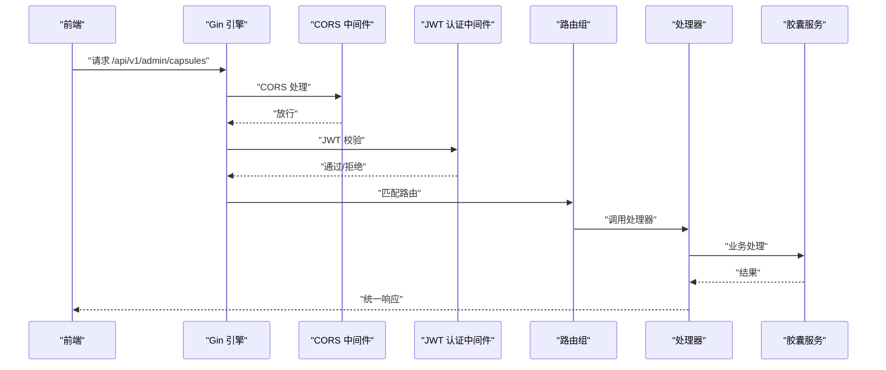
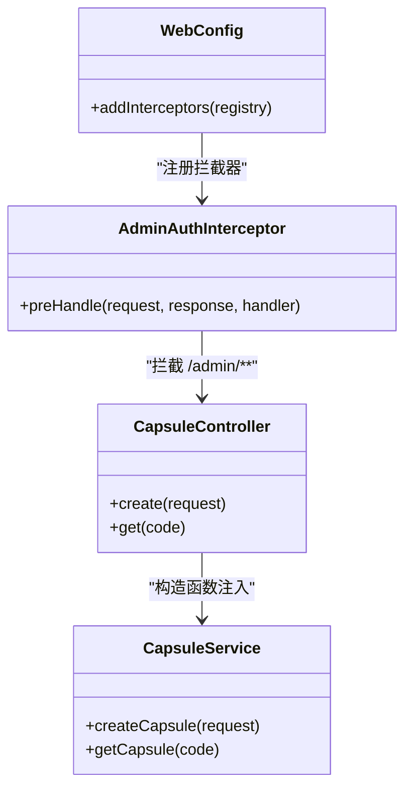
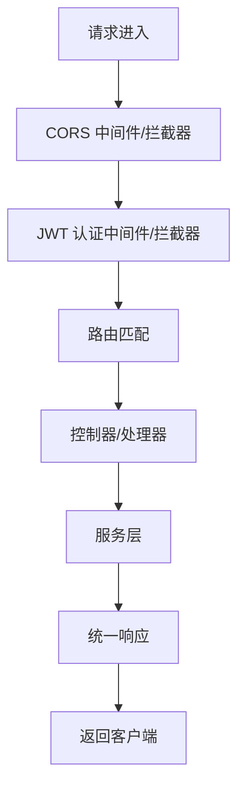
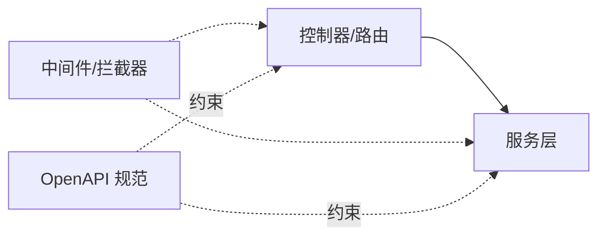

# 解耦策略设计

<cite>
**本文引用的文件**
- [openapi.yaml](file://spec/api/openapi.yaml)
- [api-spec.md](file://docs/api-spec.md)
- [main.py](file://backends/fastapi/app/main.py)
- [capsule.py](file://backends/fastapi/app/routers/capsule.py)
- [capsule_service.py](file://backends/fastapi/app/services/capsule_service.py)
- [dependencies.py](file://backends/fastapi/app/dependencies.py)
- [main.go](file://backends/gin/main.go)
- [router.go](file://backends/gin/router/router.go)
- [auth.go](file://backends/gin/middleware/auth.go)
- [cors.go](file://backends/gin/middleware/cors.go)
- [capsule_service.go](file://backends/gin/service/capsule_service.go)
- [HelloTimeApplication.java](file://backends/spring-boot/src/main/java/com/hellotime/HelloTimeApplication.java)
- [WebConfig.java](file://backends/spring-boot/src/main/java/com/hellotime/config/WebConfig.java)
- [AdminAuthInterceptor.java](file://backends/spring-boot/src/main/java/com/hellotime/config/AdminAuthInterceptor.java)
- [CapsuleController.java](file://backends/spring-boot/src/main/java/com/hellotime/controller/CapsuleController.java)
</cite>

## 目录
1. [引言](#引言)
2. [项目结构](#项目结构)
3. [核心组件](#核心组件)
4. [架构总览](#架构总览)
5. [详细组件分析](#详细组件分析)
6. [依赖分析](#依赖分析)
7. [性能考虑](#性能考虑)
8. [故障排查指南](#故障排查指南)
9. [结论](#结论)
10. [附录](#附录)

## 引言
本设计文档围绕 HelloTime 项目的“解耦策略”展开，目标是通过统一的 API 规范（OpenAPI 3.0）、一致的响应模型与错误码、以及跨后端一致的中间件/拦截器机制，实现前后端与多后端实现之间的松耦合。文档将系统阐述：
- API 契约管理与版本控制策略
- 向后兼容性保障
- 统一 API 规范如何实现技术栈无关性
- 依赖注入、接口抽象、事件驱动等解耦技术的应用
- 通过中间件/拦截器实现横切关注点（认证、CORS、日志等）的解耦
- 不同后端实现如何遵循统一规范
- 解耦效果评估指标与最佳实践建议

## 项目结构
HelloTime 采用“多后端并行”的架构：同一套 API 规范在 FastAPI、Gin、Spring Boot 三种技术栈上分别实现，前端则以 Angular/React/Svelte/Vue3 作为客户端。统一的 API 规范由 OpenAPI 3.0 文档与统一响应模型共同定义。

图表来源
- [openapi.yaml:1-349](file://spec/api/openapi.yaml#L1-L349)
- [api-spec.md:1-195](file://docs/api-spec.md#L1-L195)
- [main.py:1-89](file://backends/fastapi/app/main.py#L1-L89)
- [main.go:1-32](file://backends/gin/main.go#L1-L32)
- [HelloTimeApplication.java:1-12](file://backends/spring-boot/src/main/java/com/hellotime/HelloTimeApplication.java#L1-L12)

章节来源
- [openapi.yaml:1-349](file://spec/api/openapi.yaml#L1-L349)
- [api-spec.md:1-195](file://docs/api-spec.md#L1-L195)

## 核心组件
- 统一 API 规范（OpenAPI 3.0）：定义路径、参数、响应体、安全方案与数据模型，确保前后端与多后端实现共享契约。
- 统一响应模型与错误码：所有接口返回统一的 success/data/message/errorCode 结构，便于前端与各后端实现一致处理。
- 控制器层（Controller/Handler/Endpoint）：负责路由映射与请求转发，保持薄控制器，业务逻辑下沉至服务层。
- 服务层（Service）：封装核心业务规则与数据访问，提供可测试、可替换的业务能力。
- 中间件/拦截器：集中处理 CORS、认证、日志、异常等横切关注点，避免在控制器中重复实现。
- 数据模型与 DTO：在不同后端中保持字段语义一致，确保序列化/反序列化的一致性。

章节来源
- [openapi.yaml:10-164](file://spec/api/openapi.yaml#L10-L164)
- [api-spec.md:5-14](file://docs/api-spec.md#L5-L14)
- [CapsuleController.java:17-56](file://backends/spring-boot/src/main/java/com/hellotime/controller/CapsuleController.java#L17-L56)
- [capsule.py:6-30](file://backends/fastapi/app/routers/capsule.py#L6-L30)
- [router.go:11-45](file://backends/gin/router/router.go#L11-L45)

## 架构总览
下图展示了三类后端实现如何遵循统一规范，并通过中间件/拦截器实现横切关注点解耦：

图表来源
- [main.py:19-89](file://backends/fastapi/app/main.py#L19-L89)
- [capsule.py:6-30](file://backends/fastapi/app/routers/capsule.py#L6-L30)
- [dependencies.py:10-22](file://backends/fastapi/app/dependencies.py#L10-L22)
- [main.go:15-31](file://backends/gin/main.go#L15-L31)
- [router.go:11-45](file://backends/gin/router/router.go#L11-L45)
- [cors.go:14-35](file://backends/gin/middleware/cors.go#L14-L35)
- [auth.go:15-36](file://backends/gin/middleware/auth.go#L15-L36)
- [HelloTimeApplication.java:6-11](file://backends/spring-boot/src/main/java/com/hellotime/HelloTimeApplication.java#L6-L11)
- [WebConfig.java:26-30](file://backends/spring-boot/src/main/java/com/hellotime/config/WebConfig.java#L26-L30)
- [AdminAuthInterceptor.java:35-57](file://backends/spring-boot/src/main/java/com/hellotime/config/AdminAuthInterceptor.java#L35-L57)
- [CapsuleController.java:17-56](file://backends/spring-boot/src/main/java/com/hellotime/controller/CapsuleController.java#L17-L56)

## 详细组件分析

### API 契约管理与版本控制
- 统一契约：OpenAPI 3.0 定义了路径、参数、请求体、响应体与安全方案，确保不同后端实现遵循相同契约。
- 版本控制：通过 servers.url 中的 /api/v1 路径前缀与 info.version 字段，明确版本边界；新增功能以新版本路径扩展，旧版本保持不变。
- 向后兼容：新增字段采用可选属性，变更字段需提供兼容映射；错误码与响应结构保持稳定。

图表来源
- [openapi.yaml:7-16](file://spec/api/openapi.yaml#L7-L16)
- [api-spec.md:3-14](file://docs/api-spec.md#L3-L14)

章节来源
- [openapi.yaml:1-349](file://spec/api/openapi.yaml#L1-L349)
- [api-spec.md:1-195](file://docs/api-spec.md#L1-L195)

### 统一响应模型与错误码
- 统一响应结构：success、data、message、errorCode 四要素，覆盖所有接口。
- 错误码映射：VALIDATION_ERROR、BAD_REQUEST、UNAUTHORIZED、CAPSULE_NOT_FOUND、INTERNAL_ERROR 等，HTTP 状态码与错误码一一对应。
- 前后端一致性：前端按统一结构解析响应，后端实现按统一模型序列化输出。

图表来源
- [api-spec.md:5-14](file://docs/api-spec.md#L5-L14)
- [CapsuleController.java:37-54](file://backends/spring-boot/src/main/java/com/hellotime/controller/CapsuleController.java#L37-L54)
- [capsule.py:17-30](file://backends/fastapi/app/routers/capsule.py#L17-L30)
- [router.go:21-43](file://backends/gin/router/router.go#L21-L43)

章节来源
- [api-spec.md:5-14](file://docs/api-spec.md#L5-L14)
- [CapsuleController.java:37-54](file://backends/spring-boot/src/main/java/com/hellotime/controller/CapsuleController.java#L37-L54)
- [capsule.py:17-30](file://backends/fastapi/app/routers/capsule.py#L17-L30)
- [router.go:21-43](file://backends/gin/router/router.go#L21-L43)

### FastAPI 实现（依赖注入与异常处理）
- 依赖注入：通过 Header 依赖校验管理员 JWT，异常统一交由全局异常处理器处理。
- 异常处理：针对业务异常（如胶囊不存在、未授权）与通用异常（参数校验、值错误、未知错误）进行分类处理，返回统一响应结构。
- 路由与服务：路由层仅做参数绑定与响应包装，业务逻辑集中在服务层。

图表来源
- [dependencies.py:10-22](file://backends/fastapi/app/dependencies.py#L10-L22)
- [capsule_service.py:79-102](file://backends/fastapi/app/services/capsule_service.py#L79-L102)
- [main.py:37-89](file://backends/fastapi/app/main.py#L37-L89)
- [capsule.py:17-24](file://backends/fastapi/app/routers/capsule.py#L17-L24)

章节来源
- [dependencies.py:10-22](file://backends/fastapi/app/dependencies.py#L10-L22)
- [capsule_service.py:79-102](file://backends/fastapi/app/services/capsule_service.py#L79-L102)
- [main.py:37-89](file://backends/fastapi/app/main.py#L37-L89)
- [capsule.py:17-24](file://backends/fastapi/app/routers/capsule.py#L17-L24)

### Gin 实现（中间件与路由组织）
- 路由组织：使用路由组 /api/v1，子组 /capsules 与 /admin，清晰划分领域。
- 中间件：CORS 中间件统一处理跨域；JWT 认证中间件拦截 /admin 下的受保护路由。
- 服务层：封装业务逻辑，与控制器解耦，便于测试与替换。

图表来源
- [router.go:11-45](file://backends/gin/router/router.go#L11-L45)
- [cors.go:14-35](file://backends/gin/middleware/cors.go#L14-L35)
- [auth.go:15-36](file://backends/gin/middleware/auth.go#L15-L36)
- [capsule_service.go:94-129](file://backends/gin/service/capsule_service.go#L94-L129)

章节来源
- [router.go:11-45](file://backends/gin/router/router.go#L11-L45)
- [cors.go:14-35](file://backends/gin/middleware/cors.go#L14-L35)
- [auth.go:15-36](file://backends/gin/middleware/auth.go#L15-L36)
- [capsule_service.go:94-129](file://backends/gin/service/capsule_service.go#L94-L129)

### Spring Boot 实现（拦截器与构造函数注入）
- 构造函数注入：控制器通过构造函数注入服务，提升可测试性与不可变性。
- 拦截器：AdminAuthInterceptor 在 WebConfig 中注册，拦截 /api/v1/admin/** 并排除 /login。
- 统一响应：控制器返回 ResponseEntity<ApiResponse<T>>，与统一响应模型一致。

图表来源
- [CapsuleController.java:21-28](file://backends/spring-boot/src/main/java/com/hellotime/controller/CapsuleController.java#L21-L28)
- [WebConfig.java:26-30](file://backends/spring-boot/src/main/java/com/hellotime/config/WebConfig.java#L26-L30)
- [AdminAuthInterceptor.java:35-57](file://backends/spring-boot/src/main/java/com/hellotime/config/AdminAuthInterceptor.java#L35-L57)

章节来源
- [CapsuleController.java:21-28](file://backends/spring-boot/src/main/java/com/hellotime/controller/CapsuleController.java#L21-L28)
- [WebConfig.java:26-30](file://backends/spring-boot/src/main/java/com/hellotime/config/WebConfig.java#L26-L30)
- [AdminAuthInterceptor.java:35-57](file://backends/spring-boot/src/main/java/com/hellotime/config/AdminAuthInterceptor.java#L35-L57)

### 依赖注入、接口抽象与事件驱动
- 依赖注入：Spring Boot 使用构造函数注入；FastAPI 使用依赖函数；Gin 通过结构体注入 DB 与 Handler。
- 接口抽象：可在服务层定义接口，不同后端实现相同接口，便于替换与测试。
- 事件驱动：可通过消息队列或事件总线解耦异步任务（如发送通知），保持控制器与服务层简洁。

章节来源
- [CapsuleController.java:21-28](file://backends/spring-boot/src/main/java/com/hellotime/controller/CapsuleController.java#L21-L28)
- [dependencies.py:10-22](file://backends/fastapi/app/dependencies.py#L10-L22)
- [router.go:16-17](file://backends/gin/router/router.go#L16-L17)

### 中间件/拦截器实现横切关注点解耦
- CORS：Gin/CORS 中间件与 FastAPI 中间件分别处理跨域，避免在控制器中重复实现。
- 认证：Gin/JWT 认证中间件与 Spring Boot 拦截器统一从 Authorization 头提取 Bearer Token 并校验。
- 异常：FastAPI 全局异常处理器统一处理业务异常与通用异常，返回统一响应结构。

图表来源
- [cors.go:14-35](file://backends/gin/middleware/cors.go#L14-L35)
- [auth.go:15-36](file://backends/gin/middleware/auth.go#L15-L36)
- [AdminAuthInterceptor.java:35-57](file://backends/spring-boot/src/main/java/com/hellotime/config/AdminAuthInterceptor.java#L35-L57)
- [main.py:37-89](file://backends/fastapi/app/main.py#L37-L89)

章节来源
- [cors.go:14-35](file://backends/gin/middleware/cors.go#L14-L35)
- [auth.go:15-36](file://backends/gin/middleware/auth.go#L15-L36)
- [AdminAuthInterceptor.java:35-57](file://backends/spring-boot/src/main/java/com/hellotime/config/AdminAuthInterceptor.java#L35-L57)
- [main.py:37-89](file://backends/fastapi/app/main.py#L37-L89)

## 依赖分析
- 控制器依赖服务：三层解耦，控制器只负责编排，服务负责业务，DAO/ORM 负责数据。
- 中间件/拦截器独立：与控制器/服务解耦，通过框架钩子接入。
- 统一规范驱动：OpenAPI 3.0 作为契约，约束所有实现的输入输出。

图表来源
- [CapsuleController.java:17-56](file://backends/spring-boot/src/main/java/com/hellotime/controller/CapsuleController.java#L17-L56)
- [capsule.py:6-30](file://backends/fastapi/app/routers/capsule.py#L6-L30)
- [router.go:11-45](file://backends/gin/router/router.go#L11-L45)
- [openapi.yaml:10-164](file://spec/api/openapi.yaml#L10-L164)

章节来源
- [CapsuleController.java:17-56](file://backends/spring-boot/src/main/java/com/hellotime/controller/CapsuleController.java#L17-L56)
- [capsule.py:6-30](file://backends/fastapi/app/routers/capsule.py#L6-L30)
- [router.go:11-45](file://backends/gin/router/router.go#L11-L45)
- [openapi.yaml:10-164](file://spec/api/openapi.yaml#L10-L164)

## 性能考虑
- 路由与中间件顺序：将高频过滤（CORS、认证）前置，减少后续处理开销。
- 服务层幂等与缓存：对只读查询引入缓存，避免重复数据库访问。
- 异步处理：对非关键路径（如通知）采用异步队列，降低请求延迟。
- 日志与监控：在中间件/拦截器中统一埋点，避免业务代码侵入。

## 故障排查指南
- 统一错误码定位：根据 errorCode 快速定位问题类型（参数校验、未授权、资源不存在、内部错误）。
- 异常处理链路：确认中间件/拦截器是否正确传递异常，异常处理器是否返回统一响应结构。
- 跨域问题：检查 CORS 中间件/拦截器是否允许来源与方法，必要时放宽开发环境限制。
- 认证失败：核对 Authorization 头格式与签名有效性，确认拦截器/中间件是否正确提取与校验 Token。

章节来源
- [api-spec.md:186-195](file://docs/api-spec.md#L186-L195)
- [main.py:37-89](file://backends/fastapi/app/main.py#L37-L89)
- [auth.go:15-36](file://backends/gin/middleware/auth.go#L15-L36)
- [AdminAuthInterceptor.java:35-57](file://backends/spring-boot/src/main/java/com/hellotime/config/AdminAuthInterceptor.java#L35-L57)

## 结论
通过 OpenAPI 3.0 统一契约、统一响应模型与错误码、以及跨后端一致的中间件/拦截器机制，HelloTime 在多后端实现之间实现了高度解耦。控制器/路由薄化、服务层内聚、横切关注点集中处理，显著提升了系统的可维护性与可扩展性。建议持续完善接口文档、引入事件驱动与异步处理，并建立完善的监控与告警体系。

## 附录
- 最佳实践建议
  - 严格遵守 OpenAPI 规范，变更需走评审与版本发布流程。
  - 所有异常统一由中间件/拦截器/异常处理器处理，控制器不直接处理异常。
  - 服务层尽量无副作用，便于单元测试与替换。
  - 对外暴露的接口尽量幂等，配合缓存与异步处理提升性能。
  - 建立解耦效果评估指标：接口一致性、异常处理覆盖率、中间件复用率、服务层可测试性评分。