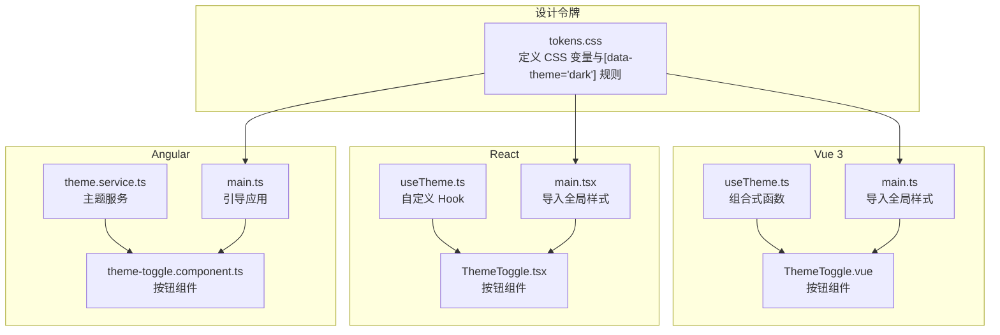
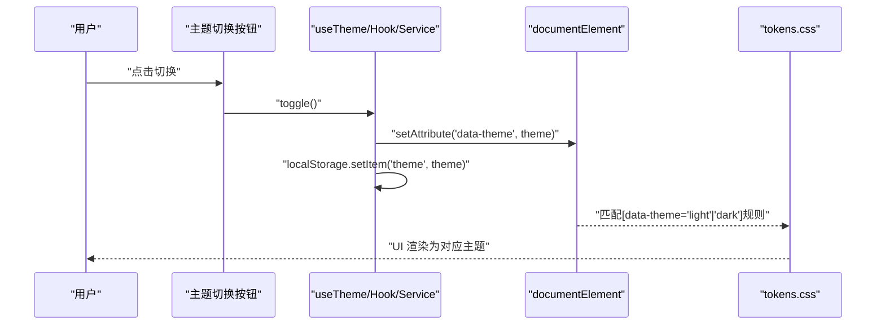
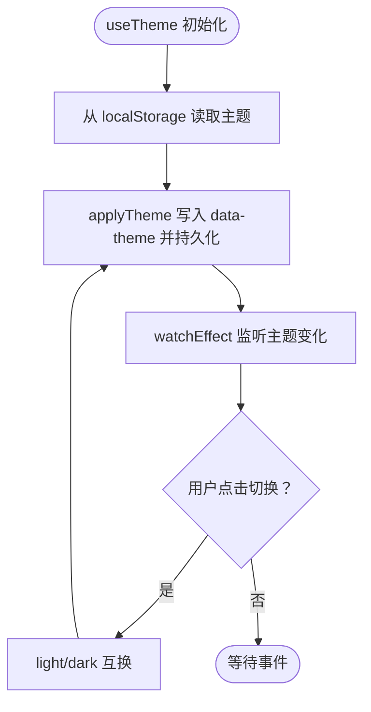
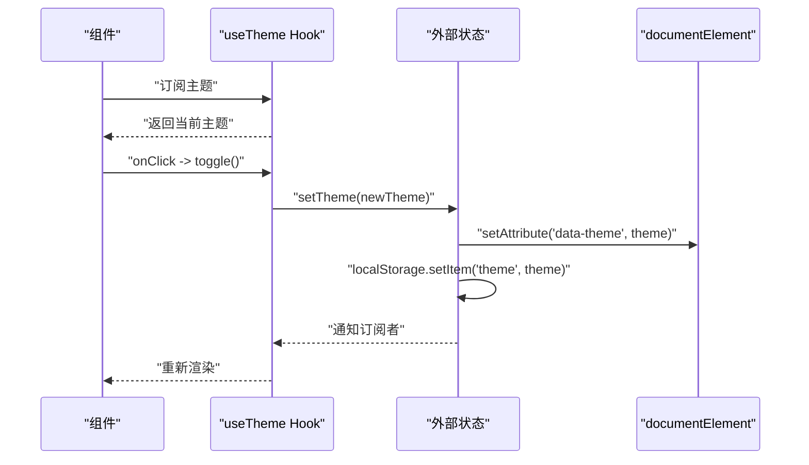
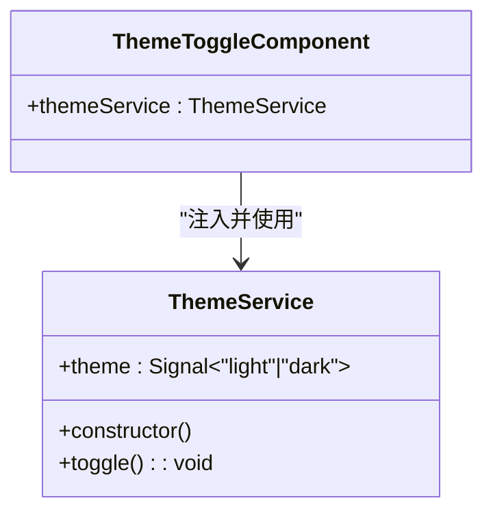
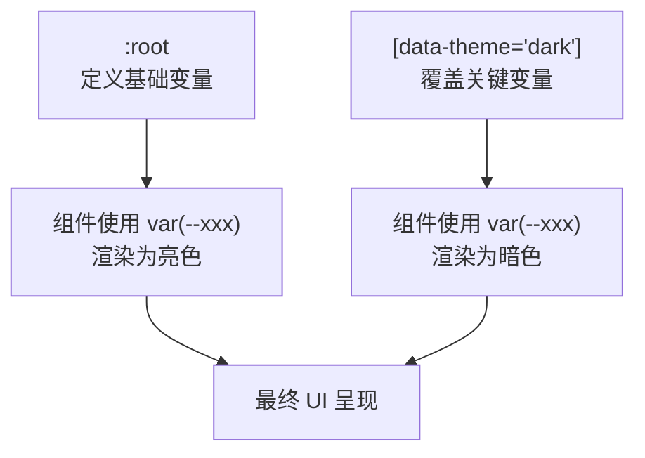
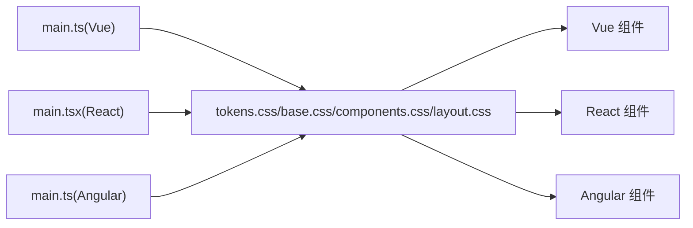

# 主题切换机制

<cite>
**本文档引用的文件**
- [useTheme.ts（Vue 3）](file://frontends/vue3-ts/src/composables/useTheme.ts)
- [ThemeToggle.vue](file://frontends/vue3-ts/src/components/ThemeToggle.vue)
- [AppHeader.vue](file://frontends/vue3-ts/src/components/AppHeader.vue)
- [useTheme.ts（React）](file://frontends/react-ts/src/hooks/useTheme.ts)
- [ThemeToggle.tsx](file://frontends/react-ts/src/components/ThemeToggle.tsx)
- [AppHeader.tsx](file://frontends/react-ts/src/components/AppHeader.tsx)
- [theme.service.ts（Angular）](file://frontends/angular-ts/src/app/services/theme.service.ts)
- [theme-toggle.component.ts（Angular）](file://frontends/angular-ts/src/app/components/theme-toggle/theme-toggle.component.ts)
- [tokens.css（设计令牌）](file://spec/styles/tokens.css)
- [main.ts（Vue 3）](file://frontends/vue3-ts/src/main.ts)
- [main.ts（React）](file://frontends/react-ts/src/main.tsx)
- [main.ts（Angular）](file://frontends/angular-ts/src/main.ts)
</cite>

## 目录
1. [简介](#简介)
2. [项目结构](#项目结构)
3. [核心组件](#核心组件)
4. [架构总览](#架构总览)
5. [详细组件分析](#详细组件分析)
6. [依赖关系分析](#依赖关系分析)
7. [性能考虑](#性能考虑)
8. [故障排查指南](#故障排查指南)
9. [结论](#结论)
10. [附录](#附录)

## 简介
本文件系统性阐述 HelloTime 项目中“主题切换机制”的实现与使用方式，覆盖以下要点：
- 明/暗主题的实现原理：基于 CSS 变量与 data-theme 属性的动态切换
- 主题状态持久化：通过 localStorage 记忆用户偏好
- 多框架实现：Vue 3 Composition API、React Hooks、Angular 信号与服务注入
- 用户体验设计：平滑过渡动画、系统主题跟随能力、无障碍提示
- 扩展方法：新增自定义主题、品牌色彩集成、主题配置管理
- 调试方法与性能优化建议

## 项目结构
主题系统横跨三个前端框架（Vue 3、React、Angular），均采用统一的设计令牌与 CSS 变量方案：
- 设计令牌集中于 spec/styles/tokens.css，定义了基础颜色、排版、间距、圆角、阴影与过渡等变量
- 各框架通过组合式函数/钩子/服务注入读取与更新主题状态，并将当前主题写入 documentElement 的 data-theme 属性
- 组件层通过 data-theme 选择器应用明/暗两套变量值，实现全站主题切换

图表来源
- [tokens.css（设计令牌）:1-104](file://spec/styles/tokens.css#L1-L104)
- [main.ts（Vue 3）:9-13](file://frontends/vue3-ts/src/main.ts#L9-L13)
- [main.ts（React）:9-13](file://frontends/react-ts/src/main.tsx#L9-L13)
- [main.ts（Angular）:1-7](file://frontends/angular-ts/src/main.ts#L1-L7)
- [useTheme.ts（Vue 3）:1-57](file://frontends/vue3-ts/src/composables/useTheme.ts#L1-L57)
- [useTheme.ts（React）:1-48](file://frontends/react-ts/src/hooks/useTheme.ts#L1-L48)
- [theme.service.ts（Angular）:1-28](file://frontends/angular-ts/src/app/services/theme.service.ts#L1-L28)
- [ThemeToggle.vue:1-34](file://frontends/vue3-ts/src/components/ThemeToggle.vue#L1-L34)
- [ThemeToggle.tsx:1-17](file://frontends/react-ts/src/components/ThemeToggle.tsx#L1-L17)
- [theme-toggle.component.ts（Angular）:1-14](file://frontends/angular-ts/src/app/components/theme-toggle/theme-toggle.component.ts#L1-L14)

章节来源
- [tokens.css（设计令牌）:1-104](file://spec/styles/tokens.css#L1-L104)
- [main.ts（Vue 3）:9-13](file://frontends/vue3-ts/src/main.ts#L9-L13)
- [main.ts（React）:9-13](file://frontends/react-ts/src/main.tsx#L9-L13)
- [main.ts（Angular）:1-7](file://frontends/angular-ts/src/main.ts#L1-L7)

## 核心组件
- 设计令牌与 CSS 变量：集中定义基础变量，暗色模式通过 [data-theme="dark"] 选择器覆盖关键变量
- 主题状态管理（Vue 3）：useTheme 组合式函数，维护响应式主题状态，监听变化后写入 data-theme 并持久化
- 主题状态管理（React）：useTheme Hook，使用 useSyncExternalStore 共享状态，提供订阅与切换
- 主题状态管理（Angular）：ThemeService，使用 signal 与 effect，自动将主题写入 data-theme 并持久化
- 主题切换按钮：三端组件均提供 ThemeToggle，点击后调用对应框架的主题切换逻辑

章节来源
- [useTheme.ts（Vue 3）:1-57](file://frontends/vue3-ts/src/composables/useTheme.ts#L1-L57)
- [useTheme.ts（React）:1-48](file://frontends/react-ts/src/hooks/useTheme.ts#L1-L48)
- [theme.service.ts（Angular）:1-28](file://frontends/angular-ts/src/app/services/theme.service.ts#L1-L28)
- [ThemeToggle.vue:1-34](file://frontends/vue3-ts/src/components/ThemeToggle.vue#L1-L34)
- [ThemeToggle.tsx:1-17](file://frontends/react-ts/src/components/ThemeToggle.tsx#L1-L17)
- [theme-toggle.component.ts（Angular）:1-14](file://frontends/angular-ts/src/app/components/theme-toggle/theme-toggle.component.ts#L1-L14)

## 架构总览
主题切换的核心流程如下：
- 应用启动时，各框架从 localStorage 读取主题偏好，若不存在则默认 light
- 将当前主题写入 documentElement 的 data-theme 属性，触发 CSS 变量切换
- 用户点击主题切换按钮，调用对应框架的主题切换逻辑，更新主题状态并持久化
- 组件层通过 CSS 变量与 data-theme 选择器实现明/暗两套样式

图表来源
- [useTheme.ts（Vue 3）:20-23](file://frontends/vue3-ts/src/composables/useTheme.ts#L20-L23)
- [useTheme.ts（React）:14-17](file://frontends/react-ts/src/hooks/useTheme.ts#L14-L17)
- [theme.service.ts（Angular）:17-21](file://frontends/angular-ts/src/app/services/theme.service.ts#L17-L21)
- [tokens.css（设计令牌）:82-103](file://spec/styles/tokens.css#L82-L103)

## 详细组件分析

### Vue 3：Composition API 实现
- 状态与初始化：useTheme 组合式函数在模块级维护响应式主题状态，启动时从 localStorage 读取并应用
- 切换逻辑：toggle 方法在 light 与 dark 之间切换
- 自动应用：watchEffect 监听主题变化，调用 applyTheme 将 data-theme 写入根元素并持久化
- 组件集成：ThemeToggle.vue 通过 useTheme 获取 theme 与 toggle；AppHeader.vue 引入 ThemeToggle

图表来源
- [useTheme.ts（Vue 3）:13-38](file://frontends/vue3-ts/src/composables/useTheme.ts#L13-L38)
- [ThemeToggle.vue:8-12](file://frontends/vue3-ts/src/components/ThemeToggle.vue#L8-L12)

章节来源
- [useTheme.ts（Vue 3）:1-57](file://frontends/vue3-ts/src/composables/useTheme.ts#L1-L57)
- [ThemeToggle.vue:1-34](file://frontends/vue3-ts/src/components/ThemeToggle.vue#L1-L34)
- [AppHeader.vue:13-13](file://frontends/vue3-ts/src/components/AppHeader.vue#L13-L13)

### React：Hooks 实现
- 状态与初始化：模块级变量保存当前主题，启动时从 localStorage 读取并应用
- 订阅机制：useSyncExternalStore 订阅主题变化，确保跨组件一致
- 切换逻辑：toggle 根据当前主题切换至另一主题
- 组件集成：ThemeToggle.tsx 通过 useTheme 获取 theme 与 toggle；AppHeader.tsx 引入 ThemeToggle

图表来源
- [useTheme.ts（React）:24-47](file://frontends/react-ts/src/hooks/useTheme.ts#L24-L47)
- [ThemeToggle.tsx:4-16](file://frontends/react-ts/src/components/ThemeToggle.tsx#L4-L16)

章节来源
- [useTheme.ts（React）:1-48](file://frontends/react-ts/src/hooks/useTheme.ts#L1-L48)
- [ThemeToggle.tsx:1-17](file://frontends/react-ts/src/components/ThemeToggle.tsx#L1-L17)
- [AppHeader.tsx:19-19](file://frontends/react-ts/src/components/AppHeader.tsx#L19-L19)

### Angular：服务注入与信号实现
- 服务与初始化：ThemeService 使用 signal 存储主题，构造函数内 effect 监听主题变化并应用
- 切换逻辑：toggle 更新主题状态
- 组件集成：ThemeToggleComponent 注入 ThemeService，模板中可直接绑定 theme

图表来源
- [theme.service.ts（Angular）:6-27](file://frontends/angular-ts/src/app/services/theme.service.ts#L6-L27)
- [theme-toggle.component.ts（Angular）:11-13](file://frontends/angular-ts/src/app/components/theme-toggle/theme-toggle.component.ts#L11-L13)

章节来源
- [theme.service.ts（Angular）:1-28](file://frontends/angular-ts/src/app/services/theme.service.ts#L1-L28)
- [theme-toggle.component.ts（Angular）:1-14](file://frontends/angular-ts/src/app/components/theme-toggle/theme-toggle.component.ts#L1-L14)

### CSS 变量与 data-theme 管理
- 设计令牌：tokens.css 定义基础变量（颜色、字体、间距、圆角、阴影、过渡、布局等）
- 暗色模式：通过 [data-theme="dark"] 选择器覆盖关键变量，实现明/暗两套配色与阴影
- 组件样式：各组件通过 var(...) 使用设计令牌变量，无需关心具体颜色值

图表来源
- [tokens.css（设计令牌）:2-80](file://spec/styles/tokens.css#L2-L80)
- [tokens.css（设计令牌）:82-103](file://spec/styles/tokens.css#L82-L103)

章节来源
- [tokens.css（设计令牌）:1-104](file://spec/styles/tokens.css#L1-L104)

### 主题切换按钮组件
- Vue：ThemeToggle.vue 通过 useTheme 获取 theme 与 toggle，按钮标题根据当前主题动态提示
- React：ThemeToggle.tsx 通过 useTheme 获取 theme 与 toggle，按钮标题根据当前主题动态提示
- Angular：ThemeToggleComponent 注入 ThemeService，模板中可绑定 theme 并调用 toggle

章节来源
- [ThemeToggle.vue:1-34](file://frontends/vue3-ts/src/components/ThemeToggle.vue#L1-L34)
- [ThemeToggle.tsx:1-17](file://frontends/react-ts/src/components/ThemeToggle.tsx#L1-L17)
- [theme-toggle.component.ts（Angular）:1-14](file://frontends/angular-ts/src/app/components/theme-toggle/theme-toggle.component.ts#L1-L14)

## 依赖关系分析
- 入口文件负责导入全局样式（tokens.css、base.css、components.css、layout.css），确保设计令牌在应用启动时可用
- 各框架的主题逻辑相互独立，但共享同一套 CSS 变量体系
- 组件层不直接操作 CSS，仅依赖 data-theme 选择器与 CSS 变量

图表来源
- [main.ts（Vue 3）:9-13](file://frontends/vue3-ts/src/main.ts#L9-L13)
- [main.ts（React）:9-13](file://frontends/react-ts/src/main.tsx#L9-L13)
- [main.ts（Angular）:1-7](file://frontends/angular-ts/src/main.ts#L1-L7)
- [tokens.css（设计令牌）:1-104](file://spec/styles/tokens.css#L1-L104)

章节来源
- [main.ts（Vue 3）:9-13](file://frontends/vue3-ts/src/main.ts#L9-L13)
- [main.ts（React）:9-13](file://frontends/react-ts/src/main.tsx#L9-L13)
- [main.ts（Angular）:1-7](file://frontends/angular-ts/src/main.ts#L1-L7)

## 性能考虑
- CSS 变量切换开销极低：仅修改根元素的 data-theme 属性，避免重排与重绘
- 避免不必要的全局刷新：Vue 与 Angular 使用响应式系统，React 使用 useSyncExternalStore 精准通知订阅者
- 动画性能：tokens.css 中定义了过渡变量，组件可按需使用，建议控制过渡时长与复杂度
- 首屏渲染：入口文件统一导入样式，减少样式抖动；如需进一步优化，可考虑按需加载或样式拆分

## 故障排查指南
- 切换无效
  - 检查是否正确将 data-theme 写入 documentElement
  - 确认 tokens.css 中 [data-theme="dark"] 规则未被覆盖
- 主题未持久化
  - 检查 localStorage 中是否存在 "theme" 键
  - 确认各框架的 applyTheme 或 setTheme/更新逻辑已执行
- SSR 环境问题
  - 确保在客户端环境再进行 DOM 操作与 localStorage 读写
- 过渡动画异常
  - 检查组件中是否正确使用了过渡变量
  - 确认未被其他样式覆盖 transition 属性

## 结论
HelloTime 的主题系统以“CSS 变量 + data-theme 属性”为核心，结合三端各自的状态管理模式，实现了统一、可扩展且高性能的主题切换方案。通过设计令牌集中管理视觉变量，组件层仅依赖变量即可适配明/暗两套风格，便于后续扩展更多主题与品牌色彩。

## 附录

### 主题扩展方法
- 新增主题
  - 在 tokens.css 中新增一组变量覆盖规则，例如 [data-theme="auto"] 或 [data-theme="ocean"]
  - 在各框架的主题逻辑中增加新主题枚举值与切换分支
- 品牌色彩集成
  - 在 :root 中定义品牌主色与辅助色变量
  - 在 [data-theme="..."] 中覆盖关键变量，保持对比度与可访问性
- 主题配置管理
  - 可引入配置对象集中管理主题变量映射，便于测试与导出
  - 对外暴露主题切换 API，支持系统主题跟随（如 prefers-color-scheme）

### 用户体验设计建议
- 平滑过渡：使用 tokens.css 中的过渡变量，控制背景、边框、阴影等关键属性的过渡时长
- 偏好记忆：优先读取 localStorage，若无则根据系统主题或默认值初始化
- 无障碍提示：按钮 title 或 aria-label 明确当前主题与切换动作
- 系统跟随：可通过媒体查询检测系统主题并在首次加载时应用