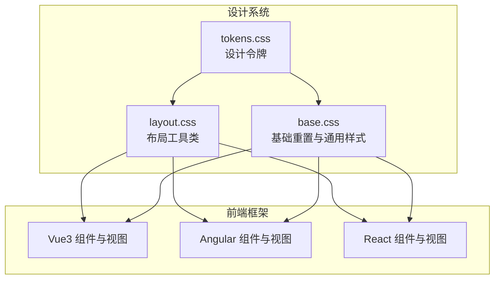
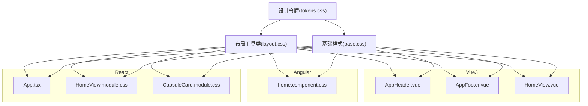
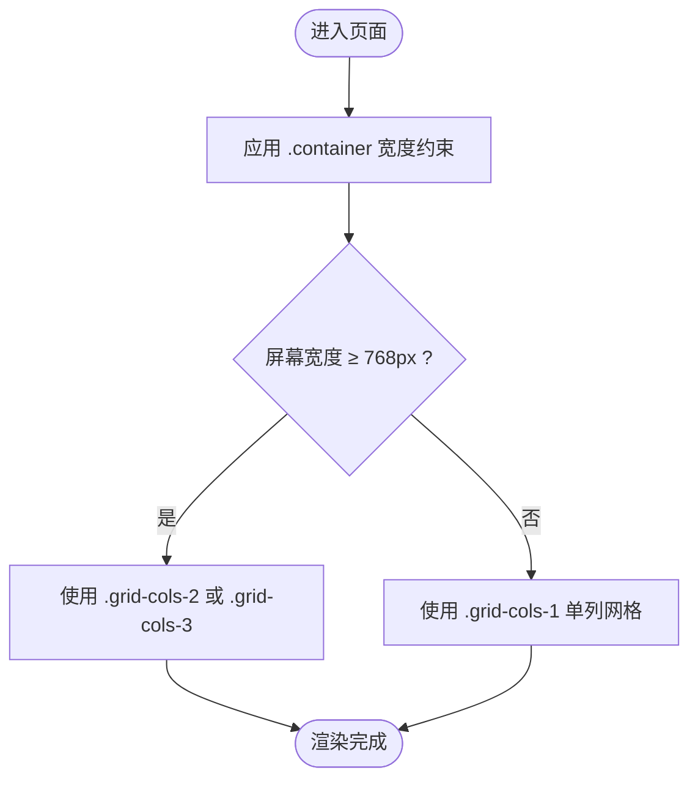
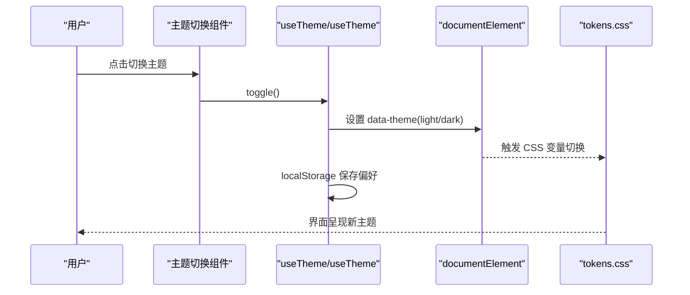
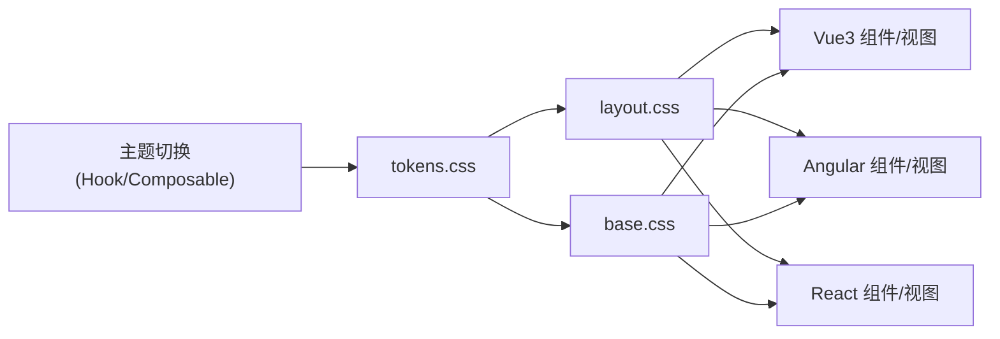

# 响应式设计策略

<cite>
**本文引用的文件**
- [spec/styles/base.css](file://spec/styles/base.css)
- [spec/styles/layout.css](file://spec/styles/layout.css)
- [spec/styles/tokens.css](file://spec/styles/tokens.css)
- [frontends/vue3-ts/src/components/AppHeader.vue](file://frontends/vue3-ts/src/components/AppHeader.vue)
- [frontends/vue3-ts/src/views/HomeView.vue](file://frontends/vue3-ts/src/views/HomeView.vue)
- [frontends/angular-ts/src/app/views/home/home.component.css](file://frontends/angular-ts/src/app/views/home/home.component.css)
- [frontends/react-ts/src/views/HomeView.module.css](file://frontends/react-ts/src/views/HomeView.module.css)
- [frontends/react-ts/src/components/CapsuleCard.module.css](file://frontends/react-ts/src/components/CapsuleCard.module.css)
- [frontends/vue3-ts/src/components/AppFooter.vue](file://frontends/vue3-ts/src/components/AppFooter.vue)
- [frontends/react-ts/src/App.tsx](file://frontends/react-ts/src/App.tsx)
- [frontends/react-ts/src/hooks/useTheme.ts](file://frontends/react-ts/src/hooks/useTheme.ts)
- [frontends/vue3-ts/src/composables/useTheme.ts](file://frontends/vue3-ts/src/composables/useTheme.ts)
</cite>

## 目录
1. [引言](#引言)
2. [项目结构](#项目结构)
3. [核心组件](#核心组件)
4. [架构总览](#架构总览)
5. [详细组件分析](#详细组件分析)
6. [依赖分析](#依赖分析)
7. [性能考虑](#性能考虑)
8. [故障排查指南](#故障排查指南)
9. [结论](#结论)
10. [附录](#附录)

## 引言
本文件系统性梳理 HelloTimeByClaude 项目的响应式设计策略，覆盖断点与媒体查询原则、网格系统与容器约束、弹性布局（Flexbox/Grid）实践、响应式图片与流式布局、移动端适配（触摸交互、视口配置、设备差异）、以及测试与调试方法。文档面向不同技术栈（Angular/Vue3/React）的前端实现，统一基于共享设计令牌与通用布局规范。

## 项目结构
项目采用“共享设计系统 + 多框架前端”的组织方式：
- 设计系统位于 spec/styles，包含基础重置、布局工具类、设计令牌（颜色、排版、间距、阴影、过渡、布局尺寸等），并提供明/暗主题变量。
- 前端框架层（Angular/Vue3/React）各自维护页面与组件样式，同时复用共享布局工具类与设计令牌，确保视觉与交互一致性。

图表来源
- [spec/styles/tokens.css:1-104](file://spec/styles/tokens.css#L1-L104)
- [spec/styles/layout.css:1-103](file://spec/styles/layout.css#L1-L103)
- [spec/styles/base.css:1-67](file://spec/styles/base.css#L1-L67)

章节来源
- [spec/styles/tokens.css:1-104](file://spec/styles/tokens.css#L1-L104)
- [spec/styles/layout.css:1-103](file://spec/styles/layout.css#L1-L103)
- [spec/styles/base.css:1-67](file://spec/styles/base.css#L1-L67)

## 核心组件
- 设计令牌（Design Tokens）
  - 定义颜色、字体、字号、行高、字重、间距、圆角、阴影、过渡、布局最大宽度等全局变量，支撑跨框架一致的视觉语言与主题切换。
- 布局工具类（Layout Utilities）
  - 提供 container、flex、grid、spacing、文本、显示控制与页面布局等原子化类，配合媒体查询实现响应式布局。
- 基础样式（Base Reset）
  - 归一化浏览器默认样式、设置根字体大小、图片流式、按钮可点击态等，奠定响应式基础。

章节来源
- [spec/styles/tokens.css:1-104](file://spec/styles/tokens.css#L1-L104)
- [spec/styles/layout.css:1-103](file://spec/styles/layout.css#L1-L103)
- [spec/styles/base.css:1-67](file://spec/styles/base.css#L1-L67)

## 架构总览
整体响应式架构由“设计令牌驱动 + 布局工具类 + 媒体查询”构成，多框架组件通过类名组合与局部样式实现一致的响应式行为。

图表来源
- [spec/styles/tokens.css:1-104](file://spec/styles/tokens.css#L1-L104)
- [spec/styles/layout.css:1-103](file://spec/styles/layout.css#L1-L103)
- [spec/styles/base.css:1-67](file://spec/styles/base.css#L1-L67)
- [frontends/vue3-ts/src/components/AppHeader.vue:1-75](file://frontends/vue3-ts/src/components/AppHeader.vue#L1-L75)
- [frontends/vue3-ts/src/components/AppFooter.vue:1-46](file://frontends/vue3-ts/src/components/AppFooter.vue#L1-L46)
- [frontends/vue3-ts/src/views/HomeView.vue:1-65](file://frontends/vue3-ts/src/views/HomeView.vue#L1-L65)
- [frontends/angular-ts/src/app/views/home/home.component.css:1-70](file://frontends/angular-ts/src/app/views/home/home.component.css#L1-L70)
- [frontends/react-ts/src/App.tsx:1-31](file://frontends/react-ts/src/App.tsx#L1-L31)
- [frontends/react-ts/src/views/HomeView.module.css:1-93](file://frontends/react-ts/src/views/HomeView.module.css#L1-L93)
- [frontends/react-ts/src/components/CapsuleCard.module.css:1-33](file://frontends/react-ts/src/components/CapsuleCard.module.css#L1-L33)

## 详细组件分析

### 断点与媒体查询策略
- 断点原则
  - 以“移动优先”为核心：先写移动端默认样式，再在需要时通过媒体查询向上增强。
  - 关键断点：768px（平板小屏）、480px（小屏手机）。前者用于网格列数与导航布局调整；后者用于极小屏下的元素隐藏与堆叠。
- 媒体查询使用策略
  - 仅在必要时启用：如网格从多列变为单列、导航折叠、按钮堆叠等。
  - 避免过度碎片化：优先使用语义化工具类与原子化布局，减少重复的自定义规则。
  - 与设计令牌联动：断点值来源于布局最大宽度与间距变量，便于统一管理。

章节来源
- [spec/styles/layout.css:96-103](file://spec/styles/layout.css#L96-L103)
- [frontends/vue3-ts/src/components/AppHeader.vue:68-73](file://frontends/vue3-ts/src/components/AppHeader.vue#L68-L73)
- [frontends/angular-ts/src/app/views/home/home.component.css:65-69](file://frontends/angular-ts/src/app/views/home/home.component.css#L65-L69)
- [frontends/react-ts/src/views/HomeView.module.css:77-87](file://frontends/react-ts/src/views/HomeView.module.css#L77-L87)

### 网格系统与容器约束
- 容器宽度控制
  - 使用 .container 设置全宽自适应，配合 max-width 控制最大宽度，左右留白由内边距控制。
  - 提供 .container-sm/.container-md 用于特定区域的窄/中等宽度约束。
- 网格布局
  - 通用网格类：.grid、.grid-cols-2、.grid-cols-3、.gap-N 等。
  - 响应式网格：在 768px 以下，多列网格自动降为单列，保证内容可读性与触达性。
- 布局约束
  - 页面主体高度通过 CSS 变量与头部高度计算，确保内容区占满剩余空间。

图表来源
- [spec/styles/layout.css:3-8](file://spec/styles/layout.css#L3-L8)
- [spec/styles/layout.css:35-40](file://spec/styles/layout.css#L35-L40)
- [spec/styles/layout.css:96-103](file://spec/styles/layout.css#L96-L103)

章节来源
- [spec/styles/layout.css:1-103](file://spec/styles/layout.css#L1-L103)

### 弹性布局（Flexbox 与 CSS Grid）
- Flexbox 场景
  - 导航栏两端布局、按钮水平居中与等分布局、卡片元信息分组等。
  - 示例：Vue3 Header 的容器使用 .flex、.items-center、.justify-between 实现两端对齐与垂直居中。
- CSS Grid 场景
  - 特性卡片展示、功能模块网格排列。
  - 示例：Angular Home 视图在桌面端使用三列网格，移动端降为单列。
- 流式布局与响应式图片
  - 图片默认最大宽度 100%，配合块级显示实现流式缩放。
  - 示例：基础样式中对 img 的流式处理，避免溢出。

章节来源
- [frontends/vue3-ts/src/components/AppHeader.vue:3-16](file://frontends/vue3-ts/src/components/AppHeader.vue#L3-L16)
- [frontends/angular-ts/src/app/views/home/home.component.css:36-41](file://frontends/angular-ts/src/app/views/home/home.component.css#L36-L41)
- [frontends/vue3-ts/src/views/HomeView.vue:17-34](file://frontends/vue3-ts/src/views/HomeView.vue#L17-L34)
- [spec/styles/base.css:35-38](file://spec/styles/base.css#L35-L38)

### 移动端适配方案
- 触摸友好交互
  - 导航链接与按钮在小屏下进行堆叠与间距调整，提升点击面积与可触达性。
  - 示例：React HomeView 在 480px 以下将操作按钮堆叠并限制最大宽度。
- 视口配置
  - 项目未显式提供独立的视口 meta 配置文件；建议在各框架入口 HTML 中添加标准视口配置以保障移动端渲染一致性。
- 移动设备特殊处理
  - 极小屏隐藏冗余文案（如 Vue3 Header 在 480px 以下隐藏 Logo 文本）。
  - 导航在窄屏下更易访问，避免横向滚动。

章节来源
- [frontends/react-ts/src/views/HomeView.module.css:77-87](file://frontends/react-ts/src/views/HomeView.module.css#L77-L87)
- [frontends/vue3-ts/src/components/AppHeader.vue:68-73](file://frontends/vue3-ts/src/components/AppHeader.vue#L68-L73)

### 主题与暗色模式
- 主题切换机制
  - 通过在 <html> 上设置 data-theme 属性，驱动 tokens.css 中的暗色变量生效。
  - 偏好存储于 localStorage，实现跨会话持久化。
- 跨框架一致性
  - React 与 Vue3 的主题 Hook/Composable 均遵循相同逻辑：初始化读取、变更应用、本地存储。

图表来源
- [frontends/react-ts/src/hooks/useTheme.ts:14-22](file://frontends/react-ts/src/hooks/useTheme.ts#L14-L22)
- [frontends/vue3-ts/src/composables/useTheme.ts:20-28](file://frontends/vue3-ts/src/composables/useTheme.ts#L20-L28)
- [spec/styles/tokens.css:82-103](file://spec/styles/tokens.css#L82-L103)

章节来源
- [frontends/react-ts/src/hooks/useTheme.ts:1-48](file://frontends/react-ts/src/hooks/useTheme.ts#L1-L48)
- [frontends/vue3-ts/src/composables/useTheme.ts:1-57](file://frontends/vue3-ts/src/composables/useTheme.ts#L1-L57)
- [spec/styles/tokens.css:82-103](file://spec/styles/tokens.css#L82-L103)

### 页面骨架与内容区高度
- 页面主体高度通过 CSS 变量与头部高度计算，确保内容区占满剩余空间，避免底部留白。
- 示例：React App 中 main 容器使用内联样式计算最小高度。

章节来源
- [frontends/react-ts/src/App.tsx:16](file://frontends/react-ts/src/App.tsx#L16)
- [spec/styles/tokens.css:79](file://spec/styles/tokens.css#L79)
- [spec/styles/layout.css:77-80](file://spec/styles/layout.css#L77-L80)

## 依赖分析
- 组件耦合关系
  - 所有框架组件均依赖共享布局工具类与设计令牌，降低重复样式与断点不一致风险。
  - 主题切换与布局工具类相互独立但共同作用于界面外观。
- 外部依赖与集成点
  - 无额外第三方 UI 框架，完全基于原生 CSS 与原子化类。
  - 主题切换与 localStorage 的集成，确保跨组件状态共享。

图表来源
- [spec/styles/tokens.css:1-104](file://spec/styles/tokens.css#L1-L104)
- [spec/styles/layout.css:1-103](file://spec/styles/layout.css#L1-L103)
- [spec/styles/base.css:1-67](file://spec/styles/base.css#L1-L67)
- [frontends/react-ts/src/hooks/useTheme.ts:1-48](file://frontends/react-ts/src/hooks/useTheme.ts#L1-L48)
- [frontends/vue3-ts/src/composables/useTheme.ts:1-57](file://frontends/vue3-ts/src/composables/useTheme.ts#L1-L57)

## 性能考虑
- 原子化布局减少特例样式，降低 CSS 体积与复杂度。
- 设计令牌集中管理，避免重复定义与断点漂移。
- 图片流式与容器约束减少重排与重绘。
- 主题切换使用 CSS 变量与 data-theme 属性，避免运行时样式计算开销。

## 故障排查指南
- 常见问题
  - 布局溢出：检查容器类与最大宽度变量是否正确应用。
  - 网格错乱：确认断点条件与网格列数类是否匹配。
  - 主题不生效：确认 data-theme 属性是否设置、tokens 中暗色变量是否完整。
  - 图片变形：确认是否使用了流式图片规则或设置了固定宽高。
- 调试技巧
  - 使用浏览器开发者工具查看元素实际应用的类与变量。
  - 临时在断点处添加背景色或边框，快速定位布局异常。
  - 在不同设备与窗口尺寸下验证关键交互（点击、滚动、输入）。

## 结论
本项目以“移动优先 + 设计令牌 + 原子化布局”为核心策略，结合明确的断点与媒体查询规范，实现了跨框架的一致响应式体验。通过主题切换与流式图片等细节优化，进一步提升了可用性与可维护性。建议后续补充视口配置与更完善的跨设备测试流程，持续完善移动端交互细节。

## 附录
- 关键断点参考
  - 768px：平板小屏，网格降单列、导航调整。
  - 480px：小屏手机，元素隐藏与堆叠。
- 推荐测试清单
  - 横竖屏切换、不同 DPR 设备、手势交互、键盘弹起遮挡、无障碍读屏。
- 最佳实践
  - 优先使用工具类组合，避免新增自定义规则。
  - 保持断点数量精简，统一来源于设计令牌。
  - 对关键交互（按钮、输入、导航）进行移动端专项测试。