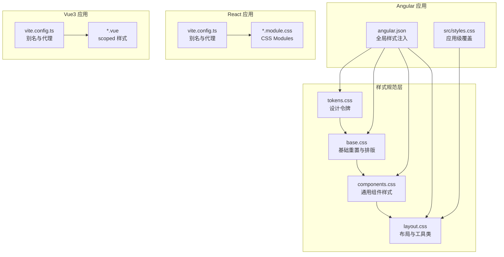
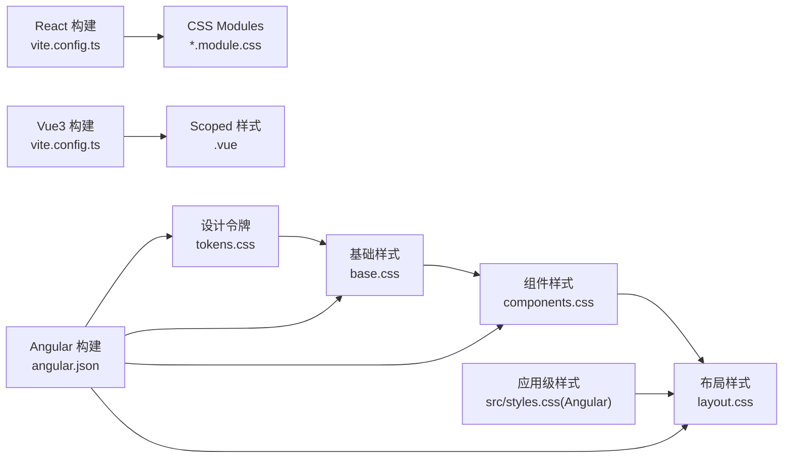
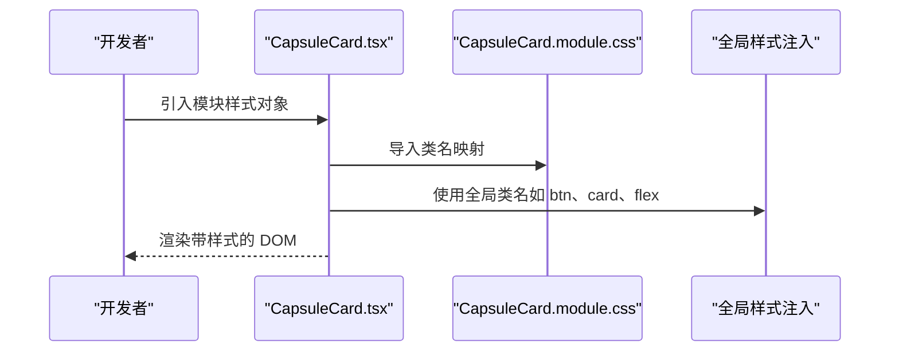

# 组件样式架构

<cite>
**本文引用的文件**
- [spec/styles/base.css](file://spec/styles/base.css)
- [spec/styles/components.css](file://spec/styles/components.css)
- [spec/styles/layout.css](file://spec/styles/layout.css)
- [spec/styles/tokens.css](file://spec/styles/tokens.css)
- [frontends/angular-ts/src/styles.css](file://frontends/angular-ts/src/styles.css)
- [frontends/angular-ts/angular.json](file://frontends/angular-ts/angular.json)
- [frontends/react-ts/src/components/AdminLogin.module.css](file://frontends/react-ts/src/components/AdminLogin.module.css)
- [frontends/react-ts/src/components/CapsuleCard.module.css](file://frontends/react-ts/src/components/CapsuleCard.module.css)
- [frontends/react-ts/src/components/CapsuleCard.tsx](file://frontends/react-ts/src/components/CapsuleCard.tsx)
- [frontends/vue3-ts/src/components/AdminLogin.vue](file://frontends/vue3-ts/src/components/AdminLogin.vue)
- [frontends/react-ts/vite.config.ts](file://frontends/react-ts/vite.config.ts)
- [frontends/vue3-ts/vite.config.ts](file://frontends/vue3-ts/vite.config.ts)
- [frontends/angular-ts/package.json](file://frontends/angular-ts/package.json)
- [frontends/react-ts/package.json](file://frontends/react-ts/package.json)
</cite>

## 目录
1. [简介](#简介)
2. [项目结构](#项目结构)
3. [核心组件](#核心组件)
4. [架构总览](#架构总览)
5. [详细组件分析](#详细组件分析)
6. [依赖分析](#依赖分析)
7. [性能考虑](#性能考虑)
8. [故障排查指南](#故障排查指南)
9. [结论](#结论)
10. [附录](#附录)

## 简介
本文件系统性梳理 HelloTime 项目的组件样式架构，围绕“设计令牌（tokens.css）—基础样式（base.css）—组件样式（components.css）—布局样式（layout.css）”的分层组织方式，阐释样式职责划分与相互关系；解析样式隔离机制（CSS 模块化、BEM 命名、作用域管理）；总结组件样式的复用策略（通用样式抽取、跨组件共享、继承与覆盖）；并给出性能优化建议（压缩、按需加载、关键渲染路径优化）与最佳实践及常见问题解决方案。

## 项目结构
前端采用多框架并行：Angular（Standalone 组件 + 全局样式）、React（CSS Modules）、Vue3（scoped 样式）。样式体系以 spec/styles 为核心，统一注入到各框架构建配置中，确保设计一致性与主题切换能力。



图表来源
- [spec/styles/tokens.css:1-104](file://spec/styles/tokens.css#L1-L104)
- [spec/styles/base.css:1-67](file://spec/styles/base.css#L1-L67)
- [spec/styles/components.css:1-207](file://spec/styles/components.css#L1-L207)
- [spec/styles/layout.css:1-103](file://spec/styles/layout.css#L1-L103)
- [frontends/angular-ts/angular.json:39-45](file://frontends/angular-ts/angular.json#L39-L45)
- [frontends/angular-ts/src/styles.css:1-3](file://frontends/angular-ts/src/styles.css#L1-L3)
- [frontends/react-ts/vite.config.ts:1-23](file://frontends/react-ts/vite.config.ts#L1-L23)
- [frontends/vue3-ts/vite.config.ts:1-23](file://frontends/vue3-ts/vite.config.ts#L1-L23)

章节来源
- [spec/styles/tokens.css:1-104](file://spec/styles/tokens.css#L1-L104)
- [spec/styles/base.css:1-67](file://spec/styles/base.css#L1-L67)
- [spec/styles/components.css:1-207](file://spec/styles/components.css#L1-L207)
- [spec/styles/layout.css:1-103](file://spec/styles/layout.css#L1-L103)
- [frontends/angular-ts/angular.json:39-45](file://frontends/angular-ts/angular.json#L39-L45)
- [frontends/angular-ts/src/styles.css:1-3](file://frontends/angular-ts/src/styles.css#L1-L3)
- [frontends/react-ts/vite.config.ts:1-23](file://frontends/react-ts/vite.config.ts#L1-L23)
- [frontends/vue3-ts/vite.config.ts:1-23](file://frontends/vue3-ts/vite.config.ts#L1-L23)

## 核心组件
- 设计令牌（tokens.css）
  - 定义颜色、字体、字号、行高、间距、圆角、阴影、过渡、布局等原子化变量，支持明/暗主题切换。
  - 为所有样式提供一致的设计语言与可维护的变量源。
- 基础样式（base.css）
  - 归一化浏览器默认样式，设置根元素与排版基线，定义链接、图片、表单控件的基础行为与过渡。
- 组件样式（components.css）
  - 提供按钮、输入框、卡片、徽标、对话框遮罩、表格等通用组件的样式基线与状态变体。
  - 使用主题属性实现明/暗模式下的视觉一致性。
- 布局样式（layout.css）
  - 提供容器、Flex/Grid、间距、文本、显示控制与页面级布局工具类，并包含移动端断点适配。

章节来源
- [spec/styles/tokens.css:1-104](file://spec/styles/tokens.css#L1-L104)
- [spec/styles/base.css:1-67](file://spec/styles/base.css#L1-L67)
- [spec/styles/components.css:1-207](file://spec/styles/components.css#L1-L207)
- [spec/styles/layout.css:1-103](file://spec/styles/layout.css#L1-L103)

## 架构总览
样式架构遵循“自下而上”的分层原则：先有设计令牌，再是基础与组件，最后是布局工具类；在各前端框架中通过构建配置集中注入，确保全局一致性与主题切换。



图表来源
- [spec/styles/tokens.css:1-104](file://spec/styles/tokens.css#L1-L104)
- [spec/styles/base.css:1-67](file://spec/styles/base.css#L1-L67)
- [spec/styles/components.css:1-207](file://spec/styles/components.css#L1-L207)
- [spec/styles/layout.css:1-103](file://spec/styles/layout.css#L1-L103)
- [frontends/angular-ts/angular.json:39-45](file://frontends/angular-ts/angular.json#L39-L45)
- [frontends/angular-ts/src/styles.css:1-3](file://frontends/angular-ts/src/styles.css#L1-L3)
- [frontends/react-ts/vite.config.ts:1-23](file://frontends/react-ts/vite.config.ts#L1-L23)
- [frontends/vue3-ts/vite.config.ts:1-23](file://frontends/vue3-ts/vite.config.ts#L1-L23)

## 详细组件分析

### 样式隔离与作用域管理
- Angular（Standalone 组件 + 全局样式）
  - 通过 angular.json 的 styles 数组集中引入 tokens/base/components/layout，保证全局样式一致性。
  - 组件样式文件独立，不使用作用域隔离，依赖类名组织与设计令牌约束。
- React（CSS Modules）
  - 每个组件以 module.css 结尾，构建时自动哈希类名，实现局部作用域，避免冲突。
  - 组件内部通过导入样式对象进行类名绑定，提升可读性与可维护性。
- Vue3（Scoped 样式）
  - 在 .vue 文件中使用 <style scoped>，编译时自动为选择器添加唯一后缀，实现组件级样式隔离。
  - 同时可在模板中直接复用全局工具类（如 btn、card、flex 等），实现“隔离 + 共享”的平衡。

章节来源
- [frontends/angular-ts/angular.json:39-45](file://frontends/angular-ts/angular.json#L39-L45)
- [frontends/angular-ts/src/styles.css:1-3](file://frontends/angular-ts/src/styles.css#L1-L3)
- [frontends/react-ts/src/components/AdminLogin.module.css:1-13](file://frontends/react-ts/src/components/AdminLogin.module.css#L1-L13)
- [frontends/vue3-ts/src/components/AdminLogin.vue:43-56](file://frontends/vue3-ts/src/components/AdminLogin.vue#L43-L56)

### 样式复用策略
- 通用样式抽取
  - 将按钮、输入、卡片、表格等通用组件样式沉淀至 components.css，形成“样式库”，减少重复定义。
- 跨组件共享
  - 通过 tokens.css 的变量与 layout.css 的工具类（如 flex、grid、text-*、p*/m*）在不同组件间共享，降低耦合。
- 继承与覆盖
  - 组件内使用 CSS Modules 或 scoped 样式进行局部覆盖，同时保持对全局类（如 btn、card）的继承。
  - 明/暗主题通过 tokens.css 的 [data-theme="dark"] 切换，组件无需感知即可获得一致的视觉反馈。

章节来源
- [spec/styles/components.css:1-207](file://spec/styles/components.css#L1-L207)
- [spec/styles/layout.css:1-103](file://spec/styles/layout.css#L1-L103)
- [spec/styles/tokens.css:82-103](file://spec/styles/tokens.css#L82-L103)
- [frontends/react-ts/src/components/CapsuleCard.module.css:1-33](file://frontends/react-ts/src/components/CapsuleCard.module.css#L1-L33)
- [frontends/vue3-ts/src/components/AdminLogin.vue:1-57](file://frontends/vue3-ts/src/components/AdminLogin.vue#L1-L57)

### 典型组件流程（React 组件样式）
以下序列图展示 React 组件如何组合全局样式与模块化样式：



图表来源
- [frontends/react-ts/src/components/CapsuleCard.tsx:1-66](file://frontends/react-ts/src/components/CapsuleCard.tsx#L1-L66)
- [frontends/react-ts/src/components/CapsuleCard.module.css:1-33](file://frontends/react-ts/src/components/CapsuleCard.module.css#L1-L33)
- [spec/styles/components.css:1-207](file://spec/styles/components.css#L1-L207)
- [spec/styles/layout.css:1-103](file://spec/styles/layout.css#L1-L103)

### 类关系图（概念性）
```mermaid
classDiagram
class 设计令牌 {
"+颜色变量"
"+字体变量"
"+间距变量"
"+阴影变量"
"+过渡变量"
}
class 基础样式 {
"+重置与排版"
"+链接与表单"
}
class 组件样式 {
"+按钮/输入/卡片"
"+徽标/对话框"
"+表格"
}
class 布局样式 {
"+容器/Flex/Grid"
"+间距/文本/显示"
"+页面布局"
}
设计令牌 --> 基础样式 : "提供变量"
基础样式 --> 组件样式 : "建立基线"
组件样式 --> 布局样式 : "补充工具"
```

## 依赖分析
- Angular
  - 通过 angular.json 的 styles 数组集中引入 tokens/base/components/layout，确保构建产物包含全局样式。
  - 生产环境启用输出哈希与预算限制，有利于缓存与体积控制。
- React/Vue3
  - 通过 vite.config.ts 配置 @spec 别名，便于从 spec/styles 直接导入样式或变量。
  - 组件级样式（CSS Modules/scoped）天然具备作用域隔离，降低全局污染风险。

章节来源
- [frontends/angular-ts/angular.json:39-45](file://frontends/angular-ts/angular.json#L39-L45)
- [frontends/angular-ts/angular.json:49-64](file://frontends/angular-ts/angular.json#L49-L64)
- [frontends/react-ts/vite.config.ts:1-23](file://frontends/react-ts/vite.config.ts#L1-L23)
- [frontends/vue3-ts/vite.config.ts:1-23](file://frontends/vue3-ts/vite.config.ts#L1-L23)

## 性能考虑
- CSS 压缩与哈希
  - Angular 生产配置启用输出哈希，利于浏览器缓存与长期缓存策略。
- 按需加载
  - React/Vue3 采用 CSS Modules/scoped 样式，组件按需打包，避免全局样式冗余。
- 关键渲染路径优化
  - 将 tokens/base/components/layout 作为首屏关键样式注入，减少阻塞；布局工具类按需使用，避免过度渲染。
- 主题切换与重绘
  - 通过 tokens.css 的 [data-theme="dark"] 切换，避免重复定义暗色样式，降低运行时开销。

章节来源
- [frontends/angular-ts/angular.json:49-64](file://frontends/angular-ts/angular.json#L49-L64)
- [spec/styles/tokens.css:82-103](file://spec/styles/tokens.css#L82-L103)
- [spec/styles/layout.css:1-103](file://spec/styles/layout.css#L1-L103)

## 故障排查指南
- 样式未生效
  - 检查 Angular 是否在 angular.json 的 styles 数组中正确引入 tokens/base/components/layout。
  - 确认组件是否正确导入模块样式（React）或使用 scoped 样式（Vue）。
- 类名冲突
  - React 使用 CSS Modules 自动哈希类名；Vue 使用 scoped 样式自动加后缀；避免手动硬编码相同类名。
- 主题不一致
  - 确保 [data-theme="dark"] 属性正确设置，且 tokens.css 中的变量值已更新。
- 构建体积过大
  - 检查生产配置是否启用输出哈希与预算限制；清理未使用的工具类与组件样式。

章节来源
- [frontends/angular-ts/angular.json:39-45](file://frontends/angular-ts/angular.json#L39-L45)
- [frontends/react-ts/src/components/AdminLogin.module.css:1-13](file://frontends/react-ts/src/components/AdminLogin.module.css#L1-L13)
- [frontends/vue3-ts/src/components/AdminLogin.vue:43-56](file://frontends/vue3-ts/src/components/AdminLogin.vue#L43-L56)
- [spec/styles/tokens.css:82-103](file://spec/styles/tokens.css#L82-L103)

## 结论
本项目通过“设计令牌—基础—组件—布局”的分层样式架构，结合 Angular 全局注入、React CSS Modules 与 Vue3 scoped 样式的作用域隔离，实现了高内聚、低耦合的组件样式体系。配合明/暗主题变量与工具类复用，既保证了视觉一致性，又提升了开发效率与运行性能。建议持续维护 tokens 变量与组件样式基线，严格遵循命名规范与作用域策略，以保障长期演进中的样式可维护性。

## 附录
- 最佳实践清单
  - 使用 tokens.css 统一变量，避免硬编码值。
  - 组件样式优先继承全局类（如 btn、card），必要时局部覆盖。
  - React/Vue3 优先使用模块化/作用域样式，减少全局污染。
  - 明/暗主题通过 [data-theme] 切换，避免重复样式。
  - 首屏关键样式集中注入，布局工具类按需使用。
- 常见问题速查
  - 样式不生效：检查 angular.json 注入顺序与组件导入。
  - 类名冲突：确认使用模块化或作用域样式。
  - 主题异常：核对 [data-theme] 与 tokens.css 变量。
  - 体积过大：启用生产哈希与预算限制，清理冗余样式。