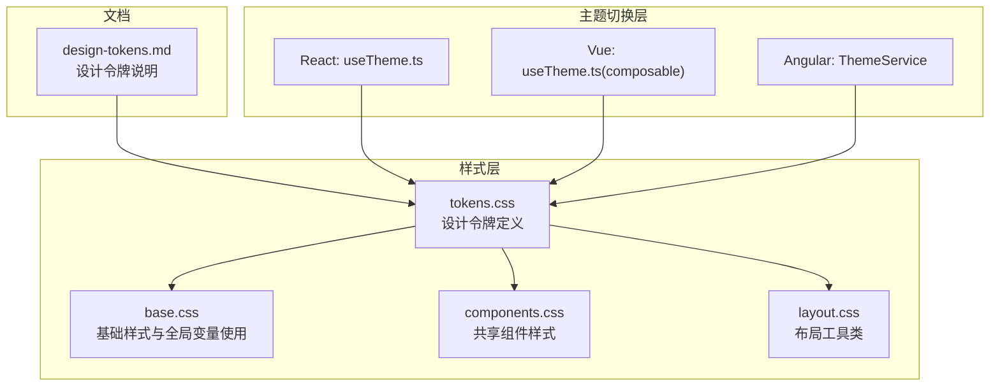
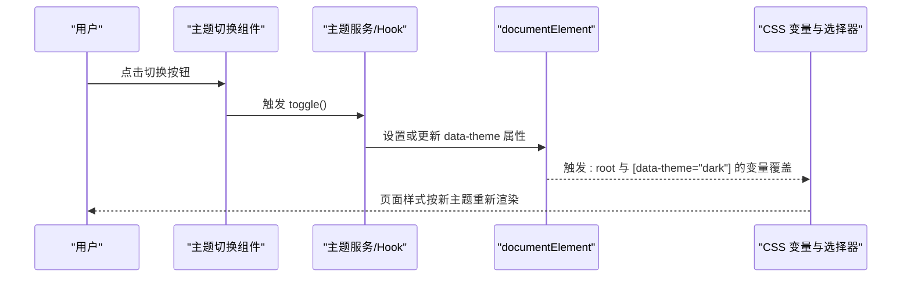
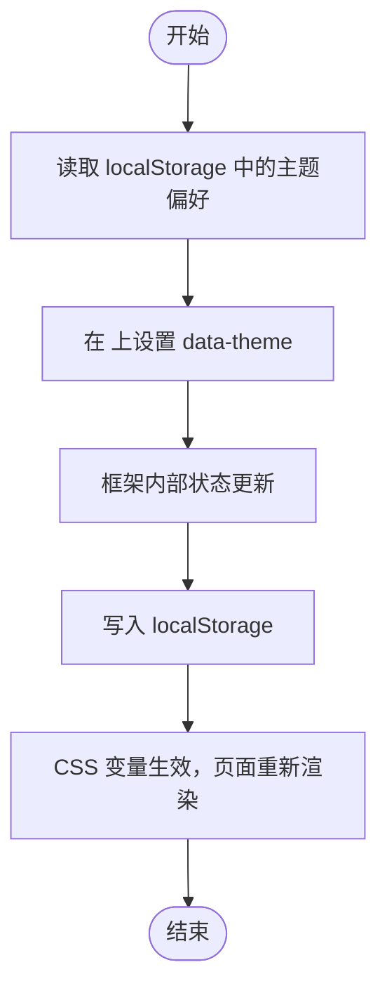
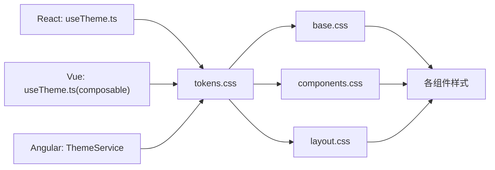

# 设计令牌系统

<cite>
**本文档引用的文件**
- [design-tokens.md](file://docs/design-tokens.md)
- [tokens.css](file://spec/styles/tokens.css)
- [base.css](file://spec/styles/base.css)
- [components.css](file://spec/styles/components.css)
- [layout.css](file://spec/styles/layout.css)
- [useTheme.ts (React)](file://frontends/react-ts/src/hooks/useTheme.ts)
- [useTheme.ts (Vue)](file://frontends/vue3-ts/src/composables/useTheme.ts)
- [theme.service.ts (Angular)](file://frontends/angular-ts/src/app/services/theme.service.ts)
- [theme-toggle.component.html (Angular)](file://frontends/angular-ts/src/app/components/theme-toggle/theme-toggle.component.html)
- [ThemeToggle.tsx (React)](file://frontends/react-ts/src/components/ThemeToggle.tsx)
- [CapsuleCard.vue (Vue)](file://frontends/vue3-ts/src/components/CapsuleCard.vue)
- [CapsuleCard.tsx (React)](file://frontends/react-ts/src/components/CapsuleCard.tsx)
</cite>

## 目录
1. [简介](#简介)
2. [项目结构](#项目结构)
3. [核心组件](#核心组件)
4. [架构总览](#架构总览)
5. [详细组件分析](#详细组件分析)
6. [依赖关系分析](#依赖关系分析)
7. [性能考量](#性能考量)
8. [故障排查指南](#故障排查指南)
9. [结论](#结论)
10. [附录](#附录)

## 简介
本设计令牌系统采用 CSS 自定义属性（CSS Variables）作为统一的设计语言承载，确保在 Angular、React、Vue 三种前端框架中保持一致的视觉风格与交互体验。系统通过集中定义颜色、排版、间距、圆角、阴影、过渡与布局等令牌，并结合 data-theme 属性驱动的明/暗主题切换，实现跨框架的一致性与可维护性。

## 项目结构
设计令牌相关的核心文件分布如下：
- 设计令牌定义：spec/styles/tokens.css
- 基础样式与全局变量使用：spec/styles/base.css
- 共享组件样式：spec/styles/components.css
- 布局工具类：spec/styles/layout.css
- 明/暗主题切换逻辑（React/Vue/Angular）：对应 hooks/composables/services 与组件模板
- 文档说明：docs/design-tokens.md

图表来源
- [tokens.css:1-104](file://spec/styles/tokens.css#L1-L104)
- [base.css:1-67](file://spec/styles/base.css#L1-L67)
- [components.css:1-207](file://spec/styles/components.css#L1-L207)
- [layout.css:1-103](file://spec/styles/layout.css#L1-L103)
- [useTheme.ts (React):1-48](file://frontends/react-ts/src/hooks/useTheme.ts#L1-L48)
- [useTheme.ts (Vue):1-57](file://frontends/vue3-ts/src/composables/useTheme.ts#L1-L57)
- [theme.service.ts (Angular):1-28](file://frontends/angular-ts/src/app/services/theme.service.ts#L1-L28)
- [design-tokens.md:1-91](file://docs/design-tokens.md#L1-L91)

章节来源
- [design-tokens.md:1-91](file://docs/design-tokens.md#L1-L91)
- [tokens.css:1-104](file://spec/styles/tokens.css#L1-L104)

## 核心组件
- 设计令牌定义：集中于 tokens.css，包含颜色、排版、间距、圆角、阴影、过渡与布局等令牌。
- 主题切换机制：通过 data-theme 属性在 <html> 上切换 light/dark，配合各框架的 hook/composable/service 实现状态管理与持久化。
- 样式复用：base.css、components.css、layout.css 通过 var(--token-name) 引用令牌，保证全局一致性。

章节来源
- [tokens.css:1-104](file://spec/styles/tokens.css#L1-L104)
- [base.css:1-67](file://spec/styles/base.css#L1-L67)
- [components.css:1-207](file://spec/styles/components.css#L1-L207)
- [layout.css:1-103](file://spec/styles/layout.css#L1-L103)

## 架构总览
整体架构围绕“集中令牌 + 动态主题 + 组件复用”展开。data-theme 的值决定最终渲染的颜色与阴影等视觉表现；各前端框架通过本地状态与 localStorage 同步，实现跨页面的主题偏好持久化。

图表来源
- [useTheme.ts (React):33-44](file://frontends/react-ts/src/hooks/useTheme.ts#L33-L44)
- [useTheme.ts (Vue):46-56](file://frontends/vue3-ts/src/composables/useTheme.ts#L46-L56)
- [theme.service.ts (Angular):16-26](file://frontends/angular-ts/src/app/services/theme.service.ts#L16-L26)
- [tokens.css:82-103](file://spec/styles/tokens.css#L82-L103)

## 详细组件分析

### 设计令牌定义与命名规范
- 颜色令牌
  - 主色：--color-primary、--color-primary-hover、--color-primary-light
  - 背景：--color-bg、--color-bg-secondary、--color-bg-tertiary
  - 文字：--color-text、--color-text-secondary、--color-text-tertiary、--color-text-inverse
  - 边框：--color-border、--color-border-hover
  - 状态：--color-success、--color-warning、--color-error、--color-info
- 排版令牌
  - 字体族：--font-family、--font-mono
  - 字号：--text-xs 到 --text-3xl
  - 行高：--leading-tight、--leading-normal、--leading-relaxed
  - 字重：--font-normal、--font-medium、--font-semibold、--font-bold
- 间距令牌
  - 基于 4px 基准：--space-1 到 --space-16
- 圆角令牌
  - --radius-sm、--radius-md、--radius-lg、--radius-xl、--radius-full
- 阴影令牌
  - --shadow-sm、--shadow-md、--shadow-lg
- 过渡令牌
  - --transition-fast、--transition-base、--transition-slow
- 布局令牌
  - --max-width、--max-width-sm、--max-width-md、--header-height

章节来源
- [tokens.css:1-104](file://spec/styles/tokens.css#L1-L104)

### 明/暗主题切换机制
- data-theme 属性
  - 在 <html> 元素上设置 data-theme="light" 或 "dark"
  - [data-theme="dark"] 选择器覆盖关键颜色与阴影令牌，实现暗色主题
- 前端框架集成
  - React：useTheme Hook 使用 useSyncExternalStore 管理状态，切换时写入 localStorage 并设置 data-theme
  - Vue：useTheme composable 通过 ref + watchEffect 监听主题变化并持久化
  - Angular：ThemeService 使用 signal + effect，在构造函数中初始化并监听主题变化
- 触发条件
  - 用户点击主题切换组件
  - 应用启动时根据 localStorage 初始化主题

图表来源
- [useTheme.ts (React):10-22](file://frontends/react-ts/src/hooks/useTheme.ts#L10-L22)
- [useTheme.ts (Vue):13-28](file://frontends/vue3-ts/src/composables/useTheme.ts#L13-L28)
- [theme.service.ts (Angular):10-22](file://frontends/angular-ts/src/app/services/theme.service.ts#L10-L22)
- [tokens.css:82-103](file://spec/styles/tokens.css#L82-L103)

章节来源
- [useTheme.ts (React):1-48](file://frontends/react-ts/src/hooks/useTheme.ts#L1-L48)
- [useTheme.ts (Vue):1-57](file://frontends/vue3-ts/src/composables/useTheme.ts#L1-L57)
- [theme.service.ts (Angular):1-28](file://frontends/angular-ts/src/app/services/theme.service.ts#L1-L28)
- [tokens.css:82-103](file://spec/styles/tokens.css#L82-L103)

### 样式文件中的令牌使用
- 基础样式（base.css）
  - body 使用 --font-family、--text-base、--leading-normal、--color-text、--color-bg、--transition-base
  - 链接、标题、选区等使用 --color-primary、--color-text-inverse 等
- 共享组件（components.css）
  - 按钮、输入框、卡片、表格等广泛使用 --space-*、--radius-*、--color-*、--shadow-*、--transition-*
  - 暗色模式下的徽标（badge）颜色通过 [data-theme="dark"] 子选择器覆盖
- 布局工具（layout.css）
  - 容器、网格、间距、文本、显示与响应式断点均基于 --max-width、--space-*、--text-*、--font-*、--header-height

章节来源
- [base.css:1-67](file://spec/styles/base.css#L1-L67)
- [components.css:1-207](file://spec/styles/components.css#L1-L207)
- [layout.css:1-103](file://spec/styles/layout.css#L1-L103)

### 组件中的令牌引用示例
- React 组件 CapsuleCard
  - 使用共享类名 card、badge、flex、items-center、justify-between、text-sm、text-secondary、text-tertiary 等
  - 这些类来自 components.css 与 layout.css，内部大量引用 tokens.css 中的令牌
- Vue 组件 CapsuleCard
  - 同样使用 card、badge、flex、text-* 等类，scoped 样式中也引用了 --space-*、--color-bg-secondary、--radius-md 等令牌

章节来源
- [CapsuleCard.tsx (React):34-62](file://frontends/react-ts/src/components/CapsuleCard.tsx#L34-L62)
- [CapsuleCard.vue (Vue):1-98](file://frontends/vue3-ts/src/components/CapsuleCard.vue#L1-L98)
- [components.css:1-207](file://spec/styles/components.css#L1-L207)
- [layout.css:1-103](file://spec/styles/layout.css#L1-L103)

## 依赖关系分析
- tokens.css 是所有样式的基础，被 base.css、components.css、layout.css 间接依赖
- 主题切换层（React/Vue/Angular）依赖 tokens.css 的变量定义与 [data-theme="dark"] 覆盖规则
- 组件层（各框架的组件）依赖共享样式层（components.css、layout.css），从而间接依赖 tokens.css

图表来源
- [tokens.css:1-104](file://spec/styles/tokens.css#L1-L104)
- [base.css:1-67](file://spec/styles/base.css#L1-L67)
- [components.css:1-207](file://spec/styles/components.css#L1-L207)
- [layout.css:1-103](file://spec/styles/layout.css#L1-L103)
- [useTheme.ts (React):1-48](file://frontends/react-ts/src/hooks/useTheme.ts#L1-L48)
- [useTheme.ts (Vue):1-57](file://frontends/vue3-ts/src/composables/useTheme.ts#L1-L57)
- [theme.service.ts (Angular):1-28](file://frontends/angular-ts/src/app/services/theme.service.ts#L1-L28)

章节来源
- [tokens.css:1-104](file://spec/styles/tokens.css#L1-L104)
- [base.css:1-67](file://spec/styles/base.css#L1-L67)
- [components.css:1-207](file://spec/styles/components.css#L1-L207)
- [layout.css:1-103](file://spec/styles/layout.css#L1-L103)
- [useTheme.ts (React):1-48](file://frontends/react-ts/src/hooks/useTheme.ts#L1-L48)
- [useTheme.ts (Vue):1-57](file://frontends/vue3-ts/src/composables/useTheme.ts#L1-L57)
- [theme.service.ts (Angular):1-28](file://frontends/angular-ts/src/app/services/theme.service.ts#L1-L28)

## 性能考量
- CSS 变量切换开销极低：仅改变变量值，不触发重排与重绘，适合频繁的主题切换
- 令牌集中管理：减少重复定义，降低样式体积与维护成本
- 组件样式复用：通过共享类名减少自定义样式编写，提升开发效率
- 建议
  - 避免在运行时动态计算复杂 CSS 表达式
  - 控制阴影与过渡的复杂度，避免在低端设备上造成卡顿
  - 对大组件进行懒加载与按需样式引入

## 故障排查指南
- 主题未生效
  - 检查 <html> 是否正确设置了 data-theme 属性
  - 确认 [data-theme="dark"] 选择器是否覆盖了目标令牌
- 主题切换后样式异常
  - 确认各框架的主题 Hook/Service 是否正确写入 localStorage 并设置 data-theme
  - 检查是否存在局部样式优先级高于 tokens.css 的情况
- 令牌值不一致
  - 确保所有框架使用同一套 tokens.css 定义
  - 检查组件是否直接硬编码了颜色值而非引用令牌

章节来源
- [tokens.css:82-103](file://spec/styles/tokens.css#L82-L103)
- [useTheme.ts (React):14-17](file://frontends/react-ts/src/hooks/useTheme.ts#L14-L17)
- [useTheme.ts (Vue):20-23](file://frontends/vue3-ts/src/composables/useTheme.ts#L20-L23)
- [theme.service.ts (Angular):17-21](file://frontends/angular-ts/src/app/services/theme.service.ts#L17-L21)

## 结论
该设计令牌系统通过集中化的 CSS 变量定义与 data-theme 驱动的主题切换，实现了跨框架的一致性与可维护性。配合共享组件样式与布局工具类，开发者可以快速构建风格统一的应用界面。建议在团队内统一令牌命名与使用规范，确保长期演进中的稳定性与扩展性。

## 附录

### 令牌命名规范与层级关系
- 命名规范
  - 颜色：--color-{category}[-state]
  - 排版：--text-{size}、--leading-{level}、--font-{weight}
  - 间距：--space-{n}
  - 圆角：--radius-{size}
  - 阴影：--shadow-{level}
  - 过渡：--transition-{speed}
  - 布局：--max-width{-size}、--header-height
- 层级关系
  - 令牌之间无强耦合，通过基础令牌派生语义令牌（如按钮、输入框等）
  - 暗色模式通过 [data-theme="dark"] 选择器对关键令牌进行覆盖

章节来源
- [tokens.css:1-104](file://spec/styles/tokens.css#L1-L104)
- [design-tokens.md:1-91](file://docs/design-tokens.md#L1-L91)

### 在不同前端框架中的引用方式
- React
  - 使用 useTheme Hook 获取 theme 与 toggle，并在组件中调用 toggle 切换主题
  - 组件样式通过共享类名引用 tokens.css 中的令牌
- Vue
  - 使用 useTheme composable 管理主题状态，watchEffect 自动应用到 DOM
  - 组件模板与样式中通过类名与 scoped 样式引用 tokens.css 令牌
- Angular
  - 使用 ThemeService 提供的主题信号与 toggle 方法
  - 组件模板中通过方法调用切换主题，effect 自动同步到 DOM

章节来源
- [useTheme.ts (React):39-47](file://frontends/react-ts/src/hooks/useTheme.ts#L39-L47)
- [ThemeToggle.tsx (React):1-17](file://frontends/react-ts/src/components/ThemeToggle.tsx#L1-L17)
- [useTheme.ts (Vue):46-56](file://frontends/vue3-ts/src/composables/useTheme.ts#L46-L56)
- [theme.service.ts (Angular):24-26](file://frontends/angular-ts/src/app/services/theme.service.ts#L24-L26)
- [theme-toggle.component.html (Angular):1-13](file://frontends/angular-ts/src/app/components/theme-toggle/theme-toggle.component.html#L1-L13)