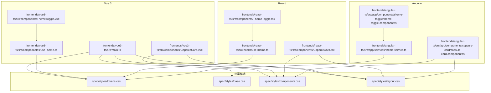
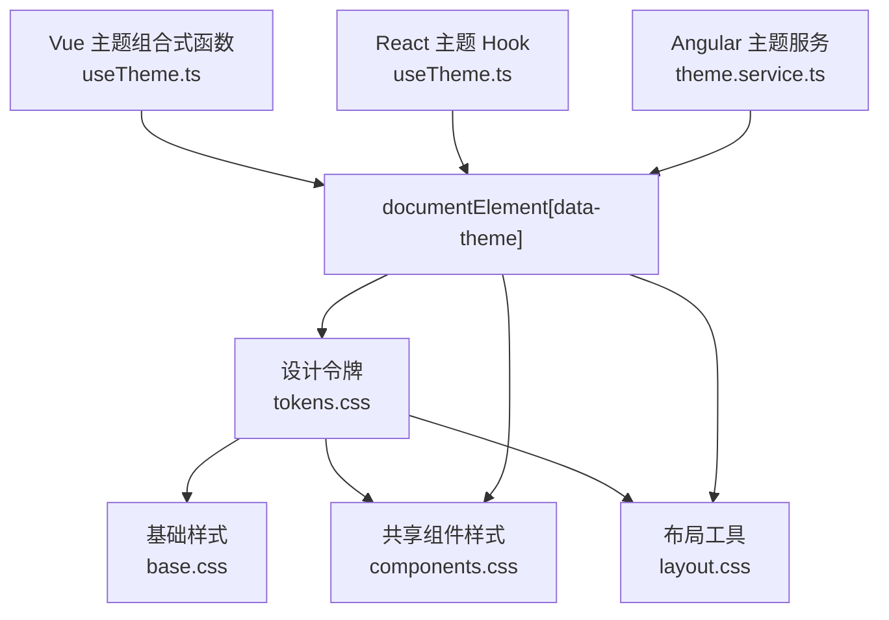
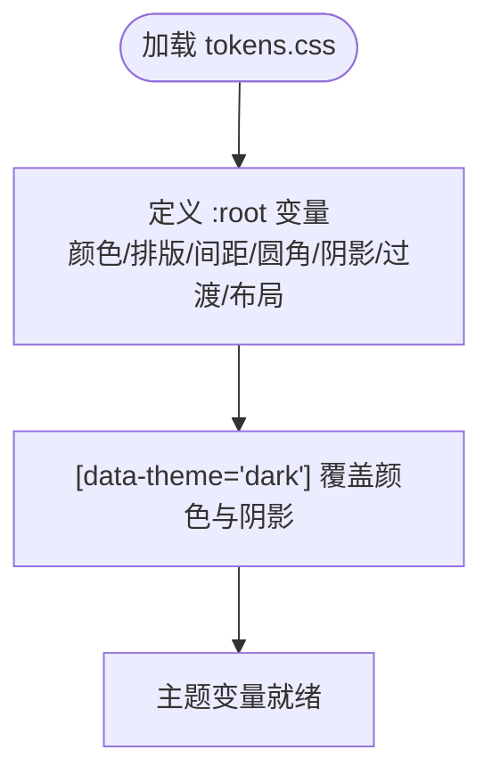
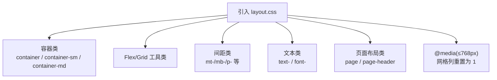
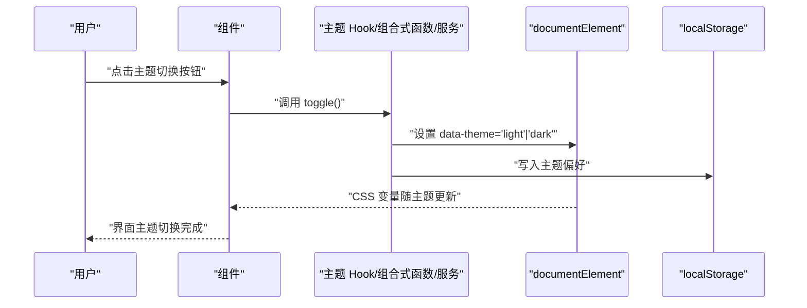
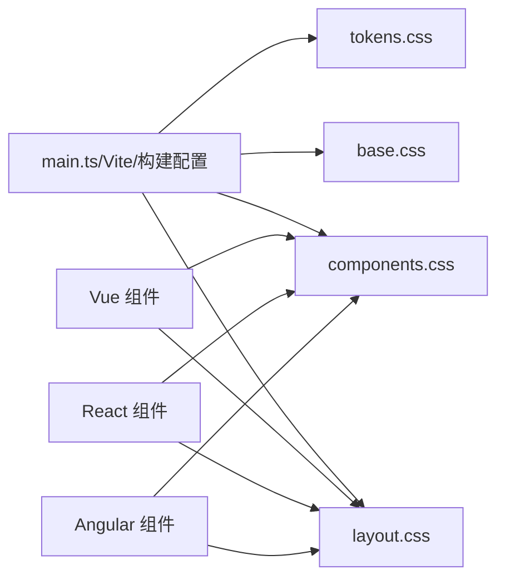
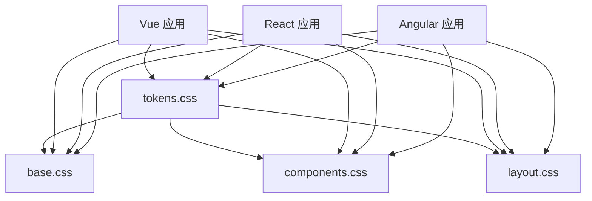

# 设计系统实现

<cite>
**本文引用的文件**
- [design-tokens.md](file://docs/design-tokens.md)
- [tokens.css](file://spec/styles/tokens.css)
- [base.css](file://spec/styles/base.css)
- [components.css](file://spec/styles/components.css)
- [layout.css](file://spec/layout.css)
- [useTheme(Vue)](file://frontends/vue3-ts/src/composables/useTheme.ts)
- [useTheme(React)](file://frontends/react-ts/src/hooks/useTheme.ts)
- [ThemeService(Angular)](file://frontends/angular-ts/src/app/services/theme.service.ts)
- [ThemeToggle(Vue)](file://frontends/vue3-ts/src/components/ThemeToggle.vue)
- [ThemeToggle(React)](file://frontends/react-ts/src/components/ThemeToggle.tsx)
- [ThemeToggle(Angular)](file://frontends/angular-ts/src/app/components/theme-toggle/theme-toggle.component.ts)
- [CapsuleCard(Vue)](file://frontends/vue3-ts/src/components/CapsuleCard.vue)
- [CapsuleCard(React)](file://frontends/react-ts/src/components/CapsuleCard.tsx)
- [CapsuleCard(Angular)](file://frontends/angular-ts/src/app/components/capsule-card/capsule-card.component.ts)
- [main.ts(Vue)](file://frontends/vue3-ts/src/main.ts)
</cite>

## 目录
1. [简介](#简介)
2. [项目结构](#项目结构)
3. [核心组件](#核心组件)
4. [架构总览](#架构总览)
5. [详细组件分析](#详细组件分析)
6. [依赖关系分析](#依赖关系分析)
7. [性能考量](#性能考量)
8. [故障排查指南](#故障排查指南)
9. [结论](#结论)
10. [附录](#附录)

## 简介
本设计系统以“设计令牌”为核心，采用 CSS 自定义属性统一管理颜色、排版、间距、圆角、阴影、过渡与布局约束，并通过 data-theme 属性驱动明/暗主题切换。样式分为三类：设计令牌(tokens.css)、基础样式(base.css)、共享组件样式(components.css)与布局工具(layout.css)。前端框架层通过组合式函数/钩子/服务封装主题状态与 DOM 更新，确保跨 Vue 3、React、Angular 的一致性体验。

## 项目结构
设计系统相关资源集中在 spec/styles 下，前端框架通过模块别名导入这些共享样式；主题切换在各框架中以组合式函数/钩子/信号的形式实现，统一写入 documentElement 的 data-theme 属性并持久化至 localStorage。



图表来源
- [tokens.css](file://spec/styles/tokens.css)
- [base.css](file://spec/styles/base.css)
- [components.css](file://spec/styles/components.css)
- [layout.css](file://spec/styles/layout.css)
- [useTheme(Vue)](file://frontends/vue3-ts/src/composables/useTheme.ts)
- [useTheme(React)](file://frontends/react-ts/src/hooks/useTheme.ts)
- [ThemeService(Angular)](file://frontends/angular-ts/src/app/services/theme.service.ts)
- [ThemeToggle(Vue)](file://frontends/vue3-ts/src/components/ThemeToggle.vue)
- [ThemeToggle(React)](file://frontends/react-ts/src/components/ThemeToggle.tsx)
- [ThemeToggle(Angular)](file://frontends/angular-ts/src/app/components/theme-toggle/theme-toggle.component.ts)
- [CapsuleCard(Vue)](file://frontends/vue3-ts/src/components/CapsuleCard.vue)
- [CapsuleCard(React)](file://frontends/react-ts/src/components/CapsuleCard.tsx)
- [CapsuleCard(Angular)](file://frontends/angular-ts/src/app/components/capsule-card/capsule-card.component.ts)
- [main.ts(Vue)](file://frontends/vue3-ts/src/main.ts)

章节来源
- [design-tokens.md](file://docs/design-tokens.md)
- [tokens.css](file://spec/styles/tokens.css)
- [base.css](file://spec/styles/base.css)
- [components.css](file://spec/styles/components.css)
- [layout.css](file://spec/styles/layout.css)
- [main.ts(Vue)](file://frontends/vue3-ts/src/main.ts)

## 核心组件
- 设计令牌系统：集中定义颜色、字体、字号、行高、间距、圆角、阴影、过渡与布局约束，支持明/暗两套值，通过 data-theme 选择器覆盖。
- 基础样式：重置与基础排版，统一根元素字体、行高、颜色与背景色，启用 CSS 变量过渡。
- 共享组件样式：按钮、输入、卡片、徽标、对话框、表格等通用组件的样式基线。
- 布局工具：容器、Flex/Grid、间距、文本对齐、显示控制与响应式断点。
- 主题切换：在 HTML 上设置 data-theme 并持久化 localStorage，三端实现一致。

章节来源
- [design-tokens.md](file://docs/design-tokens.md)
- [tokens.css](file://spec/styles/tokens.css)
- [base.css](file://spec/styles/base.css)
- [components.css](file://spec/styles/components.css)
- [layout.css](file://spec/styles/layout.css)

## 架构总览
设计系统采用“令牌驱动 + 组件复用 + 主题解耦”的分层架构。令牌层提供原子化设计变量；基础与组件层提供语义化样式；布局层提供栅格与间距工具；主题层通过 data-theme 与本地存储实现跨框架一致的主题切换。



图表来源
- [tokens.css](file://spec/styles/tokens.css)
- [base.css](file://spec/styles/base.css)
- [components.css](file://spec/styles/components.css)
- [layout.css](file://spec/styles/layout.css)
- [useTheme(Vue)](file://frontends/vue3-ts/src/composables/useTheme.ts)
- [useTheme(React)](file://frontends/react-ts/src/hooks/useTheme.ts)
- [ThemeService(Angular)](file://frontends/angular-ts/src/app/services/theme.service.ts)

## 详细组件分析

### 设计令牌系统
- 设计原则
  - 单一事实源：所有视觉变量集中于 tokens.css，避免硬编码。
  - 明/暗双态：:root 定义亮色值，[data-theme="dark"] 覆盖暗色值，确保主题切换无闪烁。
  - 语义化命名：如 --color-primary、--text-base、--space-4 等，便于跨框架复用。
- 关键类别
  - 颜色：主色、背景、文字、边框、状态色。
  - 排版：字体族、等宽字体、字号、行高、字重。
  - 间距：以 4px 为基准的离散步进。
  - 圆角：小/中/大/超大/全圆角。
  - 阴影与过渡：统一阴影与过渡时长/缓动。
  - 布局：最大宽度、容器尺寸、页头高度等。



图表来源
- [tokens.css](file://spec/styles/tokens.css)

章节来源
- [design-tokens.md](file://docs/design-tokens.md)
- [tokens.css](file://spec/styles/tokens.css)

### 基础样式与组件样式
- 基础样式
  - 重置盒模型与内外边距，设置根字体大小与文本调整。
  - body 统一使用 --font-family、--text-base、--leading-normal，并启用颜色/背景过渡。
  - 链接、标题、选择器等基础元素使用设计令牌变量。
- 共享组件样式
  - 按钮：主/次/危险态，尺寸变体，悬停与禁用状态。
  - 输入：边框、聚焦态、占位符、错误态。
  - 卡片：背景、边框、圆角、阴影、悬停效果。
  - 徽标：成功/警告态，暗色模式下的对比度适配。
  - 对话框：遮罩层、弹窗容器、最大宽度与圆角。
  - 表格：表头背景、悬停态、边框与对齐。

```mermaid
classDiagram
class Tokens {
"+颜色变量"
"+排版变量"
"+间距变量"
"+圆角变量"
"+阴影变量"
"+过渡变量"
"+布局变量"
}
class BaseStyles {
"+重置与基础排版"
"+根元素变量绑定"
}
class ComponentStyles {
"+按钮"
"+输入"
"+卡片"
"+徽标"
"+对话框"
"+表格"
}
Tokens --> BaseStyles : "提供变量"
Tokens --> ComponentStyles : "提供变量"
```

图表来源
- [tokens.css](file://spec/styles/tokens.css)
- [base.css](file://spec/styles/base.css)
- [components.css](file://spec/styles/components.css)

章节来源
- [base.css](file://spec/styles/base.css)
- [components.css](file://spec/styles/components.css)

### 布局系统与响应式策略
- 布局工具
  - 容器：默认最大宽度与内边距，提供 sm/md 尺寸变体。
  - Flex：方向、换行、对齐与间距。
  - Grid：列数模板。
  - 间距：上下左右与内边距多档位。
  - 文本：对齐、字号、字重与辅助色。
  - 页面布局：页面主体最小高度、页头样式。
- 响应式
  - 在 768px 以下将 2 列/3 列网格重置为 1 列，保证移动端可读性。



图表来源
- [layout.css](file://spec/styles/layout.css)

章节来源
- [layout.css](file://spec/styles/layout.css)

### 主题切换机制
- 切换逻辑
  - Vue：组合式函数 useTheme，基于 ref 与 watchEffect，在 documentElement 上设置 data-theme 并写入 localStorage。
  - React：useTheme Hook，使用 useSyncExternalStore 订阅外部主题状态，切换后更新 data-theme 与 localStorage。
  - Angular：ThemeService，使用 signal 与 effect，自动同步主题到 data-theme 并持久化。
- 动态更新
  - 所有组件样式均通过 CSS 变量引用，无需重新编译即可随主题切换即时生效。
- 用户偏好持久化
  - 初始值从 localStorage 读取，若不存在则默认亮色；每次切换后立即写回。



图表来源
- [useTheme(Vue)](file://frontends/vue3-ts/src/composables/useTheme.ts)
- [useTheme(React)](file://frontends/react-ts/src/hooks/useTheme.ts)
- [ThemeService(Angular)](file://frontends/angular-ts/src/app/services/theme.service.ts)
- [ThemeToggle(Vue)](file://frontends/vue3-ts/src/components/ThemeToggle.vue)
- [ThemeToggle(React)](file://frontends/react-ts/src/components/ThemeToggle.tsx)
- [ThemeToggle(Angular)](file://frontends/angular-ts/src/app/components/theme-toggle/theme-toggle.component.ts)

章节来源
- [useTheme(Vue)](file://frontends/vue3-ts/src/composables/useTheme.ts)
- [useTheme(React)](file://frontends/react-ts/src/hooks/useTheme.ts)
- [ThemeService(Angular)](file://frontends/angular-ts/src/app/services/theme.service.ts)
- [ThemeToggle(Vue)](file://frontends/vue3-ts/src/components/ThemeToggle.vue)
- [ThemeToggle(React)](file://frontends/react-ts/src/components/ThemeToggle.tsx)
- [ThemeToggle(Angular)](file://frontends/angular-ts/src/app/components/theme-toggle/theme-toggle.component.ts)

### 组件样式组织与复用
- 组织方式
  - 基础样式：base.css
  - 共享组件样式：components.css
  - 布局工具：layout.css
  - 设计令牌：tokens.css
- 复用策略
  - Vue：在 main.ts 中统一导入共享样式，组件通过类名复用。
  - React：组件导入模块化 CSS 或共享类名，复用 tokens.css 变量。
  - Angular：组件样式与共享样式解耦，通过服务与信号驱动主题。



图表来源
- [main.ts(Vue)](file://frontends/vue3-ts/src/main.ts)
- [tokens.css](file://spec/styles/tokens.css)
- [base.css](file://spec/styles/base.css)
- [components.css](file://spec/styles/components.css)
- [layout.css](file://spec/styles/layout.css)

章节来源
- [main.ts(Vue)](file://frontends/vue3-ts/src/main.ts)
- [CapsuleCard(Vue)](file://frontends/vue3-ts/src/components/CapsuleCard.vue)
- [CapsuleCard(React)](file://frontends/react-ts/src/components/CapsuleCard.tsx)
- [CapsuleCard(Angular)](file://frontends/angular-ts/src/app/components/capsule-card/capsule-card.component.ts)

### 前端框架集成要点
- Vue 3
  - 在应用入口导入共享样式，组件通过类名复用 tokens.css 变量。
  - 使用 useTheme 组合式函数管理主题状态与 DOM 更新。
- React
  - 使用 useTheme Hook 管理主题状态，组件通过类名或模块化 CSS 复用共享样式。
- Angular
  - 使用 ThemeService 管理主题状态，组件通过类名复用共享样式。

章节来源
- [main.ts(Vue)](file://frontends/vue3-ts/src/main.ts)
- [useTheme(Vue)](file://frontends/vue3-ts/src/composables/useTheme.ts)
- [useTheme(React)](file://frontends/react-ts/src/hooks/useTheme.ts)
- [ThemeService(Angular)](file://frontends/angular-ts/src/app/services/theme.service.ts)

### 扩展与定制指南
- 新增组件样式
  - 在 components.css 中新增类名，优先使用 tokens.css 中的变量，避免硬编码。
  - 若需暗色模式特例，使用 [data-theme="dark"] 前缀进行覆盖。
- 扩展主题
  - 在 tokens.css 中新增变量或扩展颜色/排版/间距体系，确保明/暗两套值同步更新。
  - 如需新增断点，可在 layout.css 的 @media 规则中扩展。
- 跨框架一致性
  - 保持类名与变量命名规范，确保 Vue/React/Angular 三端一致复用。

章节来源
- [components.css](file://spec/styles/components.css)
- [layout.css](file://spec/styles/layout.css)
- [tokens.css](file://spec/styles/tokens.css)

## 依赖关系分析
- 内部依赖
  - 所有组件样式依赖 tokens.css 提供的 CSS 变量。
  - 基础样式与组件样式共同依赖 tokens.css。
  - 布局工具类独立于 tokens.css，但与组件样式配合使用。
- 外部依赖
  - Vue/React/Angular 通过各自的状态管理方案（组合式函数/钩子/信号）与 DOM 持久化交互，最终统一到 data-theme 属性。



图表来源
- [tokens.css](file://spec/styles/tokens.css)
- [base.css](file://spec/styles/base.css)
- [components.css](file://spec/styles/components.css)
- [layout.css](file://spec/styles/layout.css)

章节来源
- [tokens.css](file://spec/styles/tokens.css)
- [base.css](file://spec/styles/base.css)
- [components.css](file://spec/styles/components.css)
- [layout.css](file://spec/styles/layout.css)

## 性能考量
- CSS 变量切换成本低：无需重绘或重排，仅影响颜色与阴影等视觉属性。
- 样式按需加载：通过模块别名导入共享样式，减少重复打包。
- 组件样式复用：统一类名与变量，降低样式体积与维护成本。
- 响应式优化：在 768px 断点下简化网格布局，提升移动端渲染效率。

## 故障排查指南
- 主题不生效
  - 检查是否正确在 documentElement 设置 data-theme 属性。
  - 确认 tokens.css 已被导入且未被覆盖。
  - 查看 localStorage 中是否存在主题偏好。
- 样式冲突
  - 检查组件是否使用了正确的类名与共享样式。
  - 确认未在组件内硬编码颜色/间距等变量。
- 响应式异常
  - 检查 @media 规则是否在 768px 断点下正确覆盖网格列数。

章节来源
- [useTheme(Vue)](file://frontends/vue3-ts/src/composables/useTheme.ts)
- [useTheme(React)](file://frontends/react-ts/src/hooks/useTheme.ts)
- [ThemeService(Angular)](file://frontends/angular-ts/src/app/services/theme.service.ts)
- [layout.css](file://spec/styles/layout.css)

## 结论
该设计系统以 CSS 自定义属性为核心，结合基础/组件/布局三层样式与 data-theme 主题机制，实现了跨 Vue 3、React、Angular 的一致视觉与良好可维护性。通过明确的变量命名、语义化类名与响应式策略，设计系统既满足当前需求，也为后续扩展与定制提供了清晰路径。

## 附录
- 设计令牌说明文档：[design-tokens.md](file://docs/design-tokens.md)
- 样式文件清单
  - 设计令牌：[tokens.css](file://spec/styles/tokens.css)
  - 基础样式：[base.css](file://spec/styles/base.css)
  - 共享组件样式：[components.css](file://spec/styles/components.css)
  - 布局工具：[layout.css](file://spec/styles/layout.css)