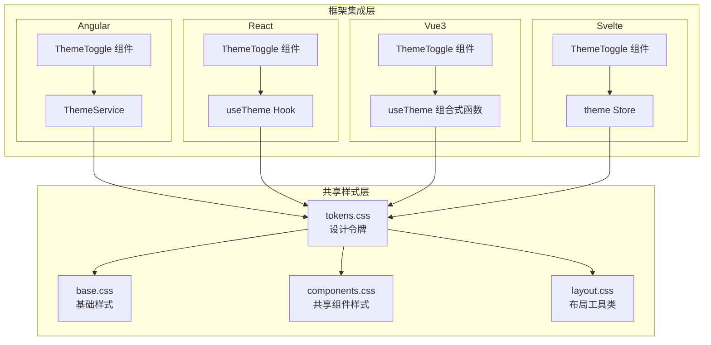
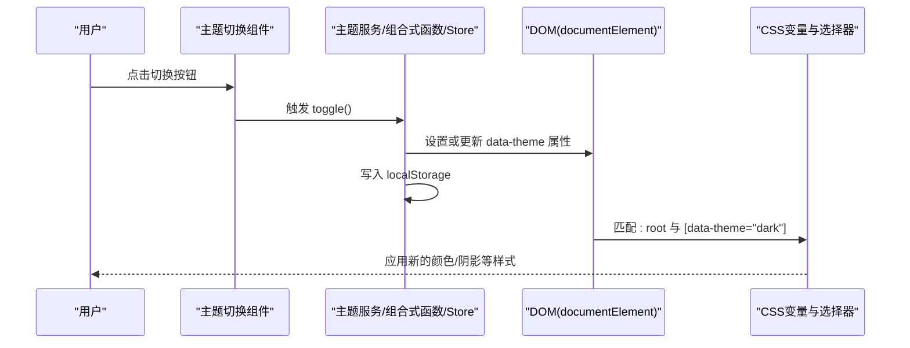
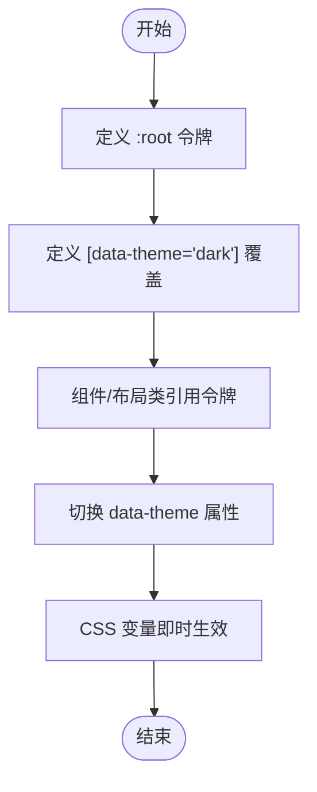
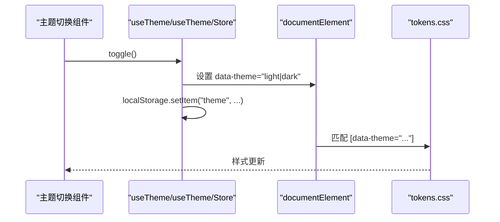
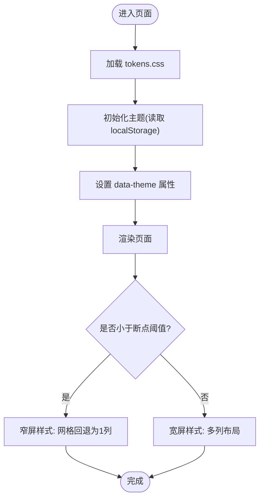
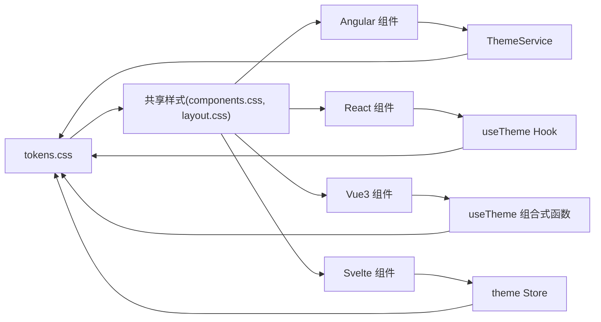
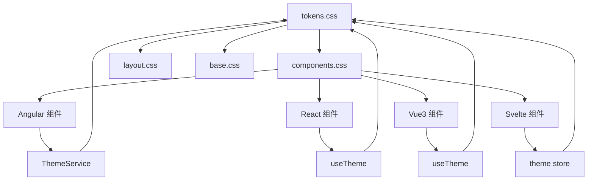

# 设计系统架构

<cite>
**本文引用的文件**
- [design-tokens.md](file://docs/design-tokens.md)
- [tokens.css](file://spec/styles/tokens.css)
- [base.css](file://spec/styles/base.css)
- [components.css](file://spec/styles/components.css)
- [layout.css](file://spec/styles/layout.css)
- [theme.service.ts](file://frontends/angular-ts/src/app/services/theme.service.ts)
- [useTheme.ts (React)](file://frontends/react-ts/src/hooks/useTheme.ts)
- [useTheme.ts (Vue3)](file://frontends/vue3-ts/src/composables/useTheme.ts)
- [theme.ts (Svelte)](file://frontends/svelte-ts/src/lib/theme.ts)
- [ThemeToggle (Angular)](file://frontends/angular-ts/src/app/components/theme-toggle/theme-toggle.component.ts)
- [ThemeToggle (React)](file://frontends/react-ts/src/components/ThemeToggle.tsx)
- [ThemeToggle (Vue3)](file://frontends/vue3-ts/src/components/ThemeToggle.vue)
- [ThemeToggle (Svelte)](file://frontends/svelte-ts/src/lib/components/ThemeToggle.svelte)
- [CapsuleCard (Angular)](file://frontends/angular-ts/src/app/components/capsule-card/capsule-card.component.css)
- [CapsuleCard (React)](file://frontends/react-ts/src/components/CapsuleCard.module.css)
- [CapsuleCard (Vue3)](file://frontends/vue3-ts/src/components/CapsuleCard.vue)
- [CapsuleCard (Svelte)](file://frontends/svelte-ts/src/lib/components/CapsuleCard.svelte)
</cite>

## 目录
1. [引言](#引言)
2. [项目结构](#项目结构)
3. [核心组件](#核心组件)
4. [架构总览](#架构总览)
5. [详细组件分析](#详细组件分析)
6. [依赖关系分析](#依赖关系分析)
7. [性能考量](#性能考量)
8. [故障排查指南](#故障排查指南)
9. [结论](#结论)
10. [附录](#附录)

## 引言
本文件面向HelloTime项目的设计系统，系统性阐述CSS设计令牌体系、组件库理念、主题系统、响应式策略与多框架集成方式，并提供扩展与维护建议。目标是帮助开发者在不同前端框架中保持一致的视觉与交互体验。

## 项目结构
设计系统由“共享样式层”和“框架集成层”两部分组成：
- 共享样式层：统一的CSS设计令牌、基础样式、共享组件样式与布局工具类，位于 spec/styles 下。
- 框架集成层：各前端框架的主题服务/组合式函数与主题切换组件，负责将设计令牌与运行时状态绑定。



图表来源
- [tokens.css:1-104](file://spec/styles/tokens.css#L1-L104)
- [base.css:1-67](file://spec/styles/base.css#L1-L67)
- [components.css:1-207](file://spec/styles/components.css#L1-L207)
- [layout.css:1-103](file://spec/styles/layout.css#L1-L103)
- [theme.service.ts:1-28](file://frontends/angular-ts/src/app/services/theme.service.ts#L1-L28)
- [useTheme.ts (React):1-48](file://frontends/react-ts/src/hooks/useTheme.ts#L1-L48)
- [useTheme.ts (Vue3):1-57](file://frontends/vue3-ts/src/composables/useTheme.ts#L1-L57)
- [theme.ts (Svelte):1-35](file://frontends/svelte-ts/src/lib/theme.ts#L1-L35)

章节来源
- [design-tokens.md:1-91](file://docs/design-tokens.md#L1-L91)
- [tokens.css:1-104](file://spec/styles/tokens.css#L1-L104)
- [base.css:1-67](file://spec/styles/base.css#L1-L67)
- [components.css:1-207](file://spec/styles/components.css#L1-L207)
- [layout.css:1-103](file://spec/styles/layout.css#L1-L103)

## 核心组件
- 设计令牌（Design Tokens）
  - 定义于 tokens.css，采用CSS自定义属性，覆盖颜色、排版、间距、圆角、阴影、过渡与布局约束。
  - 通过[data-theme="dark"]选择器在暗色模式下覆盖关键令牌值，实现主题切换。
- 基础样式（Base）
  - 提供CSS重置、全局字体、行高、链接、按钮基线行为与选区配色，统一页面基底。
- 共享组件样式（Components）
  - 定义按钮、输入框、卡片、徽章、对话框、表格等通用组件的原子化类名，组件内部可叠加原子类实现复用。
- 布局工具类（Layout）
  - 提供容器、Flex/Grid、间距、文本对齐、显示控制与基础页面布局，配合tokens中的max-width与header高度实现响应式布局。
- 主题系统（Theme）
  - 各框架通过服务/组合式函数/Store维护当前主题状态，写入<html>元素的data-theme属性并持久化至localStorage，驱动CSS变量切换。
- 响应式策略（Responsive）
  - 基于max-width阈值（如768px）进行断点控制，网格列在窄屏时回退为单列，保证内容可读性与可用性。

章节来源
- [design-tokens.md:7-91](file://docs/design-tokens.md#L7-L91)
- [tokens.css:1-104](file://spec/styles/tokens.css#L1-L104)
- [base.css:1-67](file://spec/styles/base.css#L1-L67)
- [components.css:1-207](file://spec/styles/components.css#L1-L207)
- [layout.css:96-103](file://spec/styles/layout.css#L96-L103)

## 架构总览
设计系统采用“令牌驱动 + 原子化组件 + 多框架集成”的架构。令牌集中管理，组件样式基于令牌与原子类构建，主题切换通过DOM属性与本地存储实现跨框架一致。



图表来源
- [theme.service.ts:24-26](file://frontends/angular-ts/src/app/services/theme.service.ts#L24-L26)
- [useTheme.ts (React):42-44](file://frontends/react-ts/src/hooks/useTheme.ts#L42-L44)
- [useTheme.ts (Vue3):51-53](file://frontends/vue3-ts/src/composables/useTheme.ts#L51-L53)
- [theme.ts (Svelte):32-34](file://frontends/svelte-ts/src/lib/theme.ts#L32-L34)
- [tokens.css:82-103](file://spec/styles/tokens.css#L82-L103)

## 详细组件分析

### 设计令牌系统
- 变量命名规范
  - 颜色：--color-*，含主色、背景、文字、边框、状态色等；支持hover/light变体。
  - 排版：--font-*、--text-*、--leading-*、--font-* 字重。
  - 间距：--space-1 至 --space-16（以4px为基准）。
  - 圆角：--radius-sm/md/lg/xl/full。
  - 阴影：--shadow-sm/md/lg。
  - 过渡：--transition-fast/base/slow。
  - 布局：--max-width、--max-width-sm/md、--header-height。
- 层级结构
  - :root 定义亮色默认值；[data-theme="dark"] 覆盖关键令牌，形成双态体系。
- 作用域管理
  - 令牌在:root全局生效，组件样式通过类名与原子类引用，避免样式污染。
- 复杂度与性能
  - 令牌为O(1)读取，主题切换为O(1)DOM属性变更，成本极低。



图表来源
- [tokens.css:1-104](file://spec/styles/tokens.css#L1-L104)

章节来源
- [tokens.css:1-104](file://spec/styles/tokens.css#L1-L104)
- [design-tokens.md:9-75](file://docs/design-tokens.md#L9-L75)

### 组件库与原子化设计
- 原子化设计原则
  - 使用短小、单一职责的类名（如flex、items-center、gap-4、text-sm），通过组合实现复杂布局与样式。
  - 共享组件样式（buttons、inputs、cards、tables）以原子类为基础，减少重复定义。
- 复用性与一致性
  - 所有组件样式依赖令牌，确保颜色、间距、圆角等一致；组件内部再叠加原子类完成差异化。
- 示例组件
  - 按钮：.btn、.btn-primary、.btn-secondary、.btn-lg、.btn-sm。
  - 输入：.input、.input-label、.input-error、.input-error-text。
  - 卡片：.card、.card-header、.card-title。
  - 表格：.table、.table th/td、.table tr:hover。
  - 徽章：.badge、.badge-success、.badge-warning（含暗色覆盖）。

```mermaid
classDiagram
class Button {
"+btn"
"+btn-primary"
"+btn-secondary"
"+btn-danger"
"+btn-lg"
"+btn-sm"
}
class Input {
"+input"
"+input-label"
"+input-error"
"+input-error-text"
}
class Card {
"+card"
"+card-header"
"+card-title"
}
class Table {
"+table"
"+table th"
"+table td"
}
class Badge {
"+badge"
"+badge-success"
"+badge-warning"
}
Button --> Tokens : "引用令牌"
Input --> Tokens : "引用令牌"
Card --> Tokens : "引用令牌"
Table --> Tokens : "引用令牌"
Badge --> Tokens : "引用令牌"
```

图表来源
- [components.css:3-207](file://spec/styles/components.css#L3-L207)
- [tokens.css:1-104](file://spec/styles/tokens.css#L1-L104)

章节来源
- [components.css:1-207](file://spec/styles/components.css#L1-L207)
- [layout.css:1-103](file://spec/styles/layout.css#L1-L103)

### 主题系统与明暗切换
- 技术实现
  - 各框架通过服务/组合式函数/Store维护主题状态，写入<html>的data-theme属性，并持久化到localStorage。
  - CSS侧通过[data-theme="dark"]覆盖关键令牌，实现一键切换。
- 生命周期
  - 初始化：从localStorage读取主题，若无则默认亮色。
  - 切换：调用toggle()更新状态，写回DOM与localStorage。
  - 渲染：CSS变量随data-theme即时生效。
- 框架差异
  - Angular：signal + effect，自动同步DOM与存储。
  - React：useSyncExternalStore实现跨组件共享状态。
  - Vue3：ref + watchEffect，自动应用主题。
  - Svelte：writable store，订阅后应用主题。



图表来源
- [useTheme.ts (React):33-44](file://frontends/react-ts/src/hooks/useTheme.ts#L33-L44)
- [useTheme.ts (Vue3):34-53](file://frontends/vue3-ts/src/composables/useTheme.ts#L34-L53)
- [theme.ts (Svelte):15-34](file://frontends/svelte-ts/src/lib/theme.ts#L15-L34)
- [theme.service.ts:16-26](file://frontends/angular-ts/src/app/services/theme.service.ts#L16-L26)
- [tokens.css:82-103](file://spec/styles/tokens.css#L82-L103)

章节来源
- [theme.service.ts:1-28](file://frontends/angular-ts/src/app/services/theme.service.ts#L1-L28)
- [useTheme.ts (React):1-48](file://frontends/react-ts/src/hooks/useTheme.ts#L1-L48)
- [useTheme.ts (Vue3):1-57](file://frontends/vue3-ts/src/composables/useTheme.ts#L1-L57)
- [theme.ts (Svelte):1-35](file://frontends/svelte-ts/src/lib/theme.ts#L1-L35)
- [tokens.css:82-103](file://spec/styles/tokens.css#L82-L103)

### 响应式设计与断点策略
- 断点与媒体查询
  - 基于max-width阈值（如768px）控制布局行为。
  - 在窄屏时，多列网格回退为单列，保证内容可读性。
- 布局工具类
  - container/container-sm/container-md 控制最大宽度与居中。
  - grid-cols-2/3 在窄屏时自动变为1列。
- 页面布局
  - page类结合--header-height与间距，计算页面主体最小高度与内边距。



图表来源
- [layout.css:96-103](file://spec/styles/layout.css#L96-L103)
- [tokens.css:75-80](file://spec/styles/tokens.css#L75-L80)

章节来源
- [layout.css:1-103](file://spec/styles/layout.css#L1-L103)
- [tokens.css:75-80](file://spec/styles/tokens.css#L75-L80)

### 多框架集成方式与设计一致性
- 集成要点
  - 统一从tokens.css读取令牌，组件样式通过原子类与共享组件类实现一致外观。
  - 主题切换在各框架中保持相同流程：更新data-theme、持久化localStorage。
- 一致性保障
  - 所有框架均依赖同一套CSS变量与选择器，避免视觉漂移。
  - 组件库以原子化类为主，减少内联样式的不一致风险。
- 框架示例
  - Angular：ThemeService + ThemeToggle组件。
  - React：useTheme Hook + ThemeToggle组件。
  - Vue3：useTheme组合式函数 + ThemeToggle组件。
  - Svelte：theme store + ThemeToggle组件。



图表来源
- [components.css:1-207](file://spec/styles/components.css#L1-L207)
- [layout.css:1-103](file://spec/styles/layout.css#L1-L103)
- [theme.service.ts:1-28](file://frontends/angular-ts/src/app/services/theme.service.ts#L1-L28)
- [useTheme.ts (React):1-48](file://frontends/react-ts/src/hooks/useTheme.ts#L1-L48)
- [useTheme.ts (Vue3):1-57](file://frontends/vue3-ts/src/composables/useTheme.ts#L1-L57)
- [theme.ts (Svelte):1-35](file://frontends/svelte-ts/src/lib/theme.ts#L1-L35)

章节来源
- [ThemeToggle (Angular):1-14](file://frontends/angular-ts/src/app/components/theme-toggle/theme-toggle.component.ts#L1-L14)
- [ThemeToggle (React):1-17](file://frontends/react-ts/src/components/ThemeToggle.tsx#L1-L17)
- [ThemeToggle (Vue3):1-34](file://frontends/vue3-ts/src/components/ThemeToggle.vue#L1-L34)
- [ThemeToggle (Svelte):1-39](file://frontends/svelte-ts/src/lib/components/ThemeToggle.svelte#L1-L39)

### 组件复用示例：胶囊卡片
- Angular
  - 组件样式文件引入原子类与共享卡片类，局部样式仅处理组件特有布局。
- React
  - 模块化CSS文件，局部样式与原子类结合，卡片内容区域使用共享背景与圆角。
- Vue3/Svelte
  - 组件模板直接复用 .card、.badge、.flex 等原子类与共享类，减少重复样式。

章节来源
- [CapsuleCard (Angular):1-76](file://frontends/angular-ts/src/app/components/capsule-card/capsule-card.component.css#L1-L76)
- [CapsuleCard (React):1-33](file://frontends/react-ts/src/components/CapsuleCard.module.css#L1-L33)
- [CapsuleCard (Vue3):1-89](file://frontends/vue3-ts/src/components/CapsuleCard.vue#L1-L89)
- [CapsuleCard (Svelte):1-89](file://frontends/svelte-ts/src/lib/components/CapsuleCard.svelte#L1-L89)

## 依赖关系分析
- 组件对令牌的依赖
  - 所有共享组件样式与布局工具类均依赖tokens.css中的CSS变量。
- 主题对DOM的依赖
  - 主题切换通过修改<html>的data-theme属性，触发CSS变量覆盖。
- 框架对主题服务的依赖
  - 各框架的主题服务/组合式函数/Store负责状态管理与DOM同步。



图表来源
- [tokens.css:1-104](file://spec/styles/tokens.css#L1-L104)
- [components.css:1-207](file://spec/styles/components.css#L1-L207)
- [layout.css:1-103](file://spec/styles/layout.css#L1-L103)
- [theme.service.ts:1-28](file://frontends/angular-ts/src/app/services/theme.service.ts#L1-L28)
- [useTheme.ts (React):1-48](file://frontends/react-ts/src/hooks/useTheme.ts#L1-L48)
- [useTheme.ts (Vue3):1-57](file://frontends/vue3-ts/src/composables/useTheme.ts#L1-L57)
- [theme.ts (Svelte):1-35](file://frontends/svelte-ts/src/lib/theme.ts#L1-L35)

章节来源
- [tokens.css:1-104](file://spec/styles/tokens.css#L1-L104)
- [components.css:1-207](file://spec/styles/components.css#L1-L207)
- [layout.css:1-103](file://spec/styles/layout.css#L1-L103)

## 性能考量
- CSS变量切换开销极低，适合频繁主题切换。
- 原子类组合减少CSS体积与规则数量，提升渲染效率。
- 建议将tokens.css与基础样式预打包，避免重复请求。
- 对大组件（如表格、卡片）尽量使用共享类，减少局部样式的复杂度。

## 故障排查指南
- 主题未生效
  - 检查<html>是否正确设置data-theme属性。
  - 确认localStorage中是否存在"theme"键及其值。
  - 核对[data-theme="dark"]选择器是否被正确覆盖。
- 样式错乱
  - 确保组件使用的是共享类（如.card、.btn），而非内联样式。
  - 检查容器与网格类是否与断点策略匹配。
- 响应式异常
  - 确认断点阈值与max-width令牌一致。
  - 检查窄屏时网格列数是否回退为1列。

章节来源
- [tokens.css:82-103](file://spec/styles/tokens.css#L82-L103)
- [layout.css:96-103](file://spec/styles/layout.css#L96-L103)

## 结论
HelloTime的设计系统以CSS变量令牌为核心，辅以原子化组件与布局工具类，在多框架中实现一致的视觉与交互体验。通过data-theme驱动的主题切换机制，确保明暗模式无缝衔接。遵循本文档的命名规范、层级结构与集成方式，可高效扩展组件库并长期维护设计一致性。

## 附录
- 设计令牌清单与说明参见：[design-tokens.md:1-91](file://docs/design-tokens.md#L1-L91)
- 令牌定义文件：[tokens.css:1-104](file://spec/styles/tokens.css#L1-L104)
- 基础样式文件：[base.css:1-67](file://spec/styles/base.css#L1-L67)
- 共享组件样式文件：[components.css:1-207](file://spec/styles/components.css#L1-L207)
- 布局工具类文件：[layout.css:1-103](file://spec/styles/layout.css#L1-L103)
- 主题服务与组件（Angular）：[theme.service.ts:1-28](file://frontends/angular-ts/src/app/services/theme.service.ts#L1-L28)，[ThemeToggle (Angular):1-14](file://frontends/angular-ts/src/app/components/theme-toggle/theme-toggle.component.ts#L1-L14)
- 主题Hook与组件（React）：[useTheme.ts (React):1-48](file://frontends/react-ts/src/hooks/useTheme.ts#L1-L48)，[ThemeToggle (React):1-17](file://frontends/react-ts/src/components/ThemeToggle.tsx#L1-L17)
- 主题组合式函数与组件（Vue3）：[useTheme.ts (Vue3):1-57](file://frontends/vue3-ts/src/composables/useTheme.ts#L1-L57)，[ThemeToggle (Vue3):1-34](file://frontends/vue3-ts/src/components/ThemeToggle.vue#L1-L34)
- 主题Store与组件（Svelte）：[theme.ts (Svelte):1-35](file://frontends/svelte-ts/src/lib/theme.ts#L1-L35)，[ThemeToggle (Svelte):1-39](file://frontends/svelte-ts/src/lib/components/ThemeToggle.svelte#L1-L39)