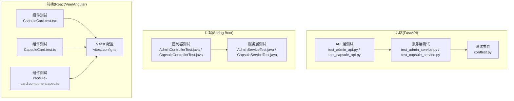
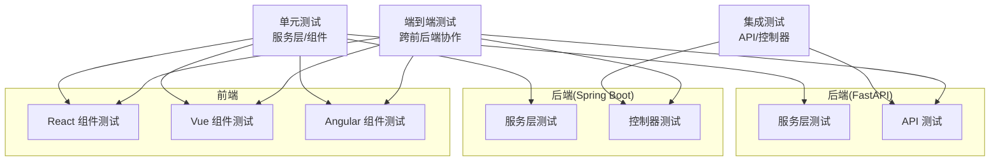
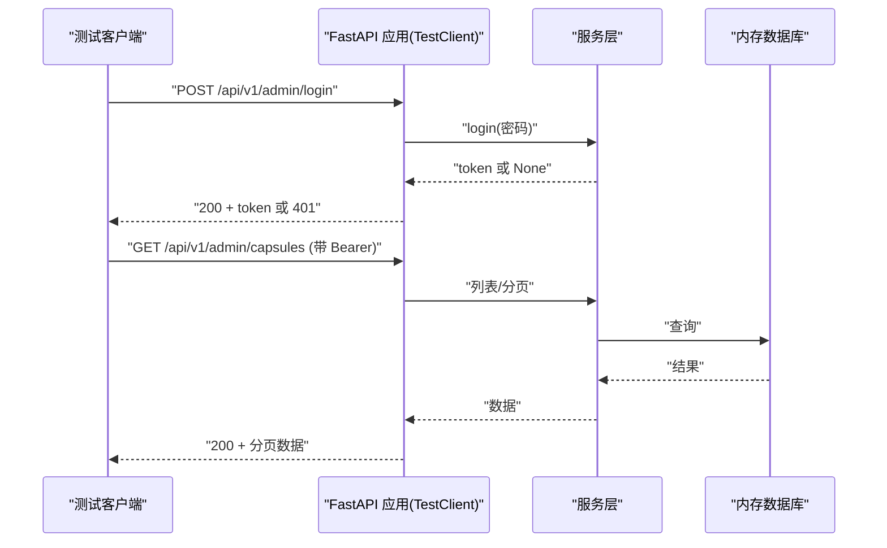
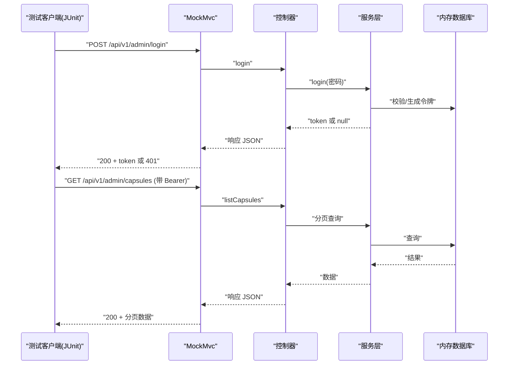
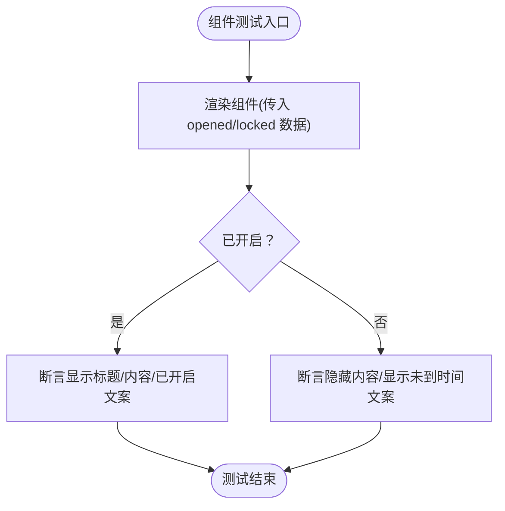
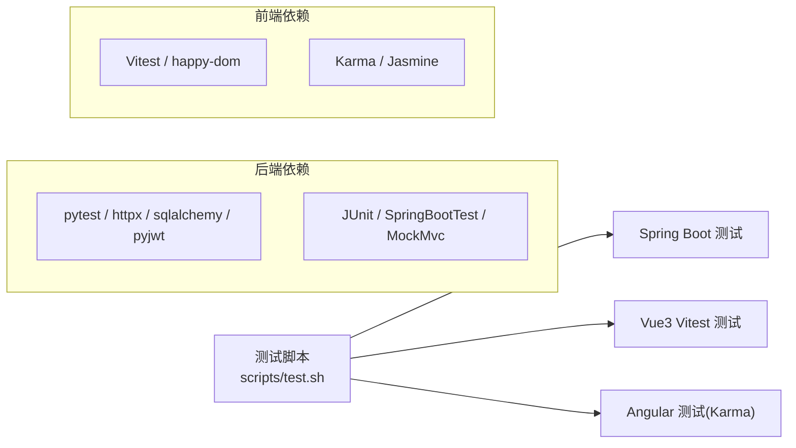

# 测试策略

<cite>
**本文引用的文件**
- [backends/fastapi/tests/conftest.py](file://backends/fastapi/tests/conftest.py)
- [backends/fastapi/tests/test_admin_api.py](file://backends/fastapi/tests/test_admin_api.py)
- [backends/fastapi/tests/test_capsule_api.py](file://backends/fastapi/tests/test_capsule_api.py)
- [backends/fastapi/tests/test_admin_service.py](file://backends/fastapi/tests/test_admin_service.py)
- [backends/fastapi/tests/test_capsule_service.py](file://backends/fastapi/tests/test_capsule_service.py)
- [backends/fastapi/requirements.txt](file://backends/fastapi/requirements.txt)
- [backends/spring-boot/src/test/java/com/hellotime/controller/AdminControllerTest.java](file://backends/spring-boot/src/test/java/com/hellotime/controller/AdminControllerTest.java)
- [backends/spring-boot/src/test/java/com/hellotime/controller/CapsuleControllerTest.java](file://backends/spring-boot/src/test/java/com/hellotime/controller/CapsuleControllerTest.java)
- [backends/spring-boot/src/test/java/com/hellotime/service/AdminServiceTest.java](file://backends/spring-boot/src/test/java/com/hellotime/service/AdminServiceTest.java)
- [backends/spring-boot/src/test/java/com/hellotime/service/CapsuleServiceTest.java](file://backends/spring-boot/src/test/java/com/hellotime/service/CapsuleServiceTest.java)
- [frontends/react-ts/vitest.config.ts](file://frontends/react-ts/vitest.config.ts)
- [frontends/react-ts/src/__tests__/components/CapsuleCard.test.tsx](file://frontends/react-ts/src/__tests__/components/CapsuleCard.test.tsx)
- [frontends/vue3-ts/src/__tests__/components/CapsuleCard.test.ts](file://frontends/vue3-ts/src/__tests__/components/CapsuleCard.test.ts)
- [frontends/angular-ts/src/__tests__/components/capsule-card.component.spec.ts](file://frontends/angular-ts/src/__tests__/components/capsule-card.component.spec.ts)
- [frontends/angular-ts/package.json](file://frontends/angular-ts/package.json)
- [scripts/test.sh](file://scripts/test.sh)
</cite>

## 目录
1. [引言](#引言)
2. [项目结构](#项目结构)
3. [核心组件](#核心组件)
4. [架构总览](#架构总览)
5. [详细组件分析](#详细组件分析)
6. [依赖分析](#依赖分析)
7. [性能考虑](#性能考虑)
8. [故障排查指南](#故障排查指南)
9. [结论](#结论)
10. [附录](#附录)

## 引言
本测试策略文档面向 HelloTime 项目，系统化阐述测试金字塔结构与实施策略，覆盖单元测试、集成测试与端到端测试。文档明确各技术栈的测试工具选择与使用方式：前端使用 Vitest（React/Vue）、Angular 使用 Karma；后端 FastAPI 使用 Pytest；Spring Boot 使用 JUnit。同时给出 API 测试、组件测试、服务层测试的编写规范，涵盖 JWT 认证、数据库操作、异步处理等核心功能的测试要点，以及测试数据管理、持续集成执行流程、覆盖率与质量门禁建议、调试技巧与常见问题解决方案，并提供为新功能编写测试用例的方法论。

## 项目结构
HelloTime 采用多后端与多前端的分层结构，测试也按层次与技术栈划分：
- 后端（FastAPI）
  - 单元测试：服务层方法验证
  - 集成测试：API 层端点验证
- 后端（Spring Boot）
  - 单元测试：服务层方法验证
  - 集成测试：控制器端点验证
- 前端（React/Vue/Angular）
  - 组件级测试：UI 行为与状态渲染
  - 工具配置：Vitest/Karma 环境与别名

图表来源
- [backends/fastapi/tests/test_admin_api.py:1-77](file://backends/fastapi/tests/test_admin_api.py#L1-L77)
- [backends/fastapi/tests/test_capsule_api.py:1-69](file://backends/fastapi/tests/test_capsule_api.py#L1-L69)
- [backends/fastapi/tests/test_admin_service.py:1-30](file://backends/fastapi/tests/test_admin_service.py#L1-L30)
- [backends/fastapi/tests/test_capsule_service.py:1-89](file://backends/fastapi/tests/test_capsule_service.py#L1-L89)
- [backends/fastapi/tests/conftest.py:1-47](file://backends/fastapi/tests/conftest.py#L1-L47)
- [backends/spring-boot/src/test/java/com/hellotime/controller/AdminControllerTest.java:1-113](file://backends/spring-boot/src/test/java/com/hellotime/controller/AdminControllerTest.java#L1-L113)
- [backends/spring-boot/src/test/java/com/hellotime/controller/CapsuleControllerTest.java:1-94](file://backends/spring-boot/src/test/java/com/hellotime/controller/CapsuleControllerTest.java#L1-L94)
- [backends/spring-boot/src/test/java/com/hellotime/service/AdminServiceTest.java:1-39](file://backends/spring-boot/src/test/java/com/hellotime/service/AdminServiceTest.java#L1-L39)
- [backends/spring-boot/src/test/java/com/hellotime/service/CapsuleServiceTest.java:1-95](file://backends/spring-boot/src/test/java/com/hellotime/service/CapsuleServiceTest.java#L1-L95)
- [frontends/react-ts/src/__tests__/components/CapsuleCard.test.tsx:1-46](file://frontends/react-ts/src/__tests__/components/CapsuleCard.test.tsx#L1-L46)
- [frontends/vue3-ts/src/__tests__/components/CapsuleCard.test.ts:1-41](file://frontends/vue3-ts/src/__tests__/components/CapsuleCard.test.ts#L1-L41)
- [frontends/angular-ts/src/__tests__/components/capsule-card.component.spec.ts:1-69](file://frontends/angular-ts/src/__tests__/components/capsule-card.component.spec.ts#L1-L69)
- [frontends/react-ts/vitest.config.ts:1-18](file://frontends/react-ts/vitest.config.ts#L1-L18)

章节来源
- [scripts/test.sh:1-34](file://scripts/test.sh#L1-L34)

## 核心组件
- 测试金字塔
  - 单元测试：服务层方法与组件逻辑验证，快速反馈，高可维护性
  - 集成测试：API/控制器端点验证，覆盖请求/响应、鉴权、业务规则
  - 端到端测试：跨前后端协作场景（本仓库未提供 E2E 测试文件，建议在 CI 中补充）
- 测试工具矩阵
  - FastAPI：Pytest + TestClient + 内存数据库（SQLite）
  - Spring Boot：JUnit + SpringBootTest + MockMvc + 内存数据库事务回滚
  - React/Vue/Angular：Vitest（React/Vue）+ Karma（Angular）+ DOM 环境
- 覆盖率与质量门禁
  - 建议：单元测试覆盖率 ≥ 80%，集成测试覆盖率 ≥ 60%
  - 质量门禁：CI 失败即阻断合并；覆盖率低于阈值拒绝合并
- 测试数据管理
  - FastAPI：内存 SQLite + 会话夹具；通过依赖注入替换数据库会话
  - Spring Boot：@Transactional + 内存数据库（如 H2），测试后自动回滚
  - Mock 对象：JWT 解析、外部服务调用、异步任务（建议使用框架内置 Mock）

章节来源
- [backends/fastapi/tests/conftest.py:1-47](file://backends/fastapi/tests/conftest.py#L1-L47)
- [backends/fastapi/requirements.txt:1-7](file://backends/fastapi/requirements.txt#L1-L7)
- [backends/spring-boot/src/test/java/com/hellotime/controller/AdminControllerTest.java:1-113](file://backends/spring-boot/src/test/java/com/hellotime/controller/AdminControllerTest.java#L1-L113)
- [backends/spring-boot/src/test/java/com/hellotime/controller/CapsuleControllerTest.java:1-94](file://backends/spring-boot/src/test/java/com/hellotime/controller/CapsuleControllerTest.java#L1-L94)
- [frontends/react-ts/vitest.config.ts:1-18](file://frontends/react-ts/vitest.config.ts#L1-L18)
- [frontends/angular-ts/package.json:1-38](file://frontends/angular-ts/package.json#L1-L38)

## 架构总览
下图展示测试金字塔在各技术栈中的分布与交互：

图表来源
- [backends/fastapi/tests/test_admin_service.py:1-30](file://backends/fastapi/tests/test_admin_service.py#L1-L30)
- [backends/fastapi/tests/test_capsule_service.py:1-89](file://backends/fastapi/tests/test_capsule_service.py#L1-L89)
- [backends/spring-boot/src/test/java/com/hellotime/service/AdminServiceTest.java:1-39](file://backends/spring-boot/src/test/java/com/hellotime/service/AdminServiceTest.java#L1-L39)
- [backends/spring-boot/src/test/java/com/hellotime/service/CapsuleServiceTest.java:1-95](file://backends/spring-boot/src/test/java/com/hellotime/service/CapsuleServiceTest.java#L1-L95)
- [frontends/react-ts/src/__tests__/components/CapsuleCard.test.tsx:1-46](file://frontends/react-ts/src/__tests__/components/CapsuleCard.test.tsx#L1-L46)
- [frontends/vue3-ts/src/__tests__/components/CapsuleCard.test.ts:1-41](file://frontends/vue3-ts/src/__tests__/components/CapsuleCard.test.ts#L1-L41)
- [frontends/angular-ts/src/__tests__/components/capsule-card.component.spec.ts:1-69](file://frontends/angular-ts/src/__tests__/components/capsule-card.component.spec.ts#L1-L69)

## 详细组件分析

### FastAPI 测试策略
- 单元测试（服务层）
  - 验证管理员登录与令牌校验、胶囊创建/查询/删除的业务规则与异常路径
  - 使用内存数据库会话夹具，确保测试隔离与可重复性
- 集成测试（API 层）
  - 使用 TestClient 调用真实路由，验证鉴权头、状态码、响应结构
  - 包含健康检查、创建胶囊、缺失字段校验、未开启胶囊隐藏内容等场景
- JWT 认证测试
  - 登录接口返回令牌；后续受保护端点需携带 Bearer Token
  - 无/错误令牌应返回 4xx
- 数据库操作测试
  - 通过夹具创建/清理内存数据库；验证创建后读取、删除后不可见
- 异步处理
  - 当前 API 未暴露异步端点；若新增，建议使用 pytest-asyncio 并结合内存队列/定时器模拟

图表来源
- [backends/fastapi/tests/test_admin_api.py:1-77](file://backends/fastapi/tests/test_admin_api.py#L1-L77)
- [backends/fastapi/tests/test_admin_service.py:1-30](file://backends/fastapi/tests/test_admin_service.py#L1-L30)
- [backends/fastapi/tests/conftest.py:1-47](file://backends/fastapi/tests/conftest.py#L1-L47)

章节来源
- [backends/fastapi/tests/test_admin_api.py:1-77](file://backends/fastapi/tests/test_admin_api.py#L1-L77)
- [backends/fastapi/tests/test_capsule_api.py:1-69](file://backends/fastapi/tests/test_capsule_api.py#L1-L69)
- [backends/fastapi/tests/test_admin_service.py:1-30](file://backends/fastapi/tests/test_admin_service.py#L1-L30)
- [backends/fastapi/tests/test_capsule_service.py:1-89](file://backends/fastapi/tests/test_capsule_service.py#L1-L89)
- [backends/fastapi/tests/conftest.py:1-47](file://backends/fastapi/tests/conftest.py#L1-L47)

### Spring Boot 测试策略
- 单元测试（服务层）
  - 验证管理员登录/令牌校验、胶囊创建/查询/删除、异常场景
  - 使用 @Transactional，测试结束后自动回滚，避免污染数据库
- 集成测试（控制器层）
  - 使用 @AutoConfigureMockMvc + MockMvc 发起 HTTP 请求
  - 验证状态码、JSON 路径断言、鉴权头传递
- JWT 认证测试
  - 登录成功返回 token；受保护端点携带 Authorization: Bearer
- 数据库操作测试
  - 通过内存数据库与事务回滚保障测试隔离
- 异步处理
  - 若引入异步任务，建议使用 @MockBean 替换执行器并断言调度行为

图表来源
- [backends/spring-boot/src/test/java/com/hellotime/controller/AdminControllerTest.java:1-113](file://backends/spring-boot/src/test/java/com/hellotime/controller/AdminControllerTest.java#L1-L113)
- [backends/spring-boot/src/test/java/com/hellotime/controller/CapsuleControllerTest.java:1-94](file://backends/spring-boot/src/test/java/com/hellotime/controller/CapsuleControllerTest.java#L1-L94)
- [backends/spring-boot/src/test/java/com/hellotime/service/AdminServiceTest.java:1-39](file://backends/spring-boot/src/test/java/com/hellotime/service/AdminServiceTest.java#L1-L39)
- [backends/spring-boot/src/test/java/com/hellotime/service/CapsuleServiceTest.java:1-95](file://backends/spring-boot/src/test/java/com/hellotime/service/CapsuleServiceTest.java#L1-L95)

章节来源
- [backends/spring-boot/src/test/java/com/hellotime/controller/AdminControllerTest.java:1-113](file://backends/spring-boot/src/test/java/com/hellotime/controller/AdminControllerTest.java#L1-L113)
- [backends/spring-boot/src/test/java/com/hellotime/controller/CapsuleControllerTest.java:1-94](file://backends/spring-boot/src/test/java/com/hellotime/controller/CapsuleControllerTest.java#L1-L94)
- [backends/spring-boot/src/test/java/com/hellotime/service/AdminServiceTest.java:1-39](file://backends/spring-boot/src/test/java/com/hellotime/service/AdminServiceTest.java#L1-L39)
- [backends/spring-boot/src/test/java/com/hellotime/service/CapsuleServiceTest.java:1-95](file://backends/spring-boot/src/test/java/com/hellotime/service/CapsuleServiceTest.java#L1-L95)

### 前端测试策略
- React/Vue 组件测试
  - 使用 Vitest + @testing-library（React）或 @vue/test-utils（Vue）进行快照与行为断言
  - 关注“已开启/未开启”两种状态下的内容显示与文案差异
- Angular 组件测试
  - 使用 Jasmine + Karma，基于 TestBed 挂载组件，断言文本与状态
- Vitest 配置
  - happy-dom 环境、全局断言启用、路径别名映射至 src 与 spec
- 覆盖率与质量门禁
  - 建议组件测试覆盖率 ≥ 70%，并结合 CI 报告与阈值控制

图表来源
- [frontends/react-ts/src/__tests__/components/CapsuleCard.test.tsx:1-46](file://frontends/react-ts/src/__tests__/components/CapsuleCard.test.tsx#L1-L46)
- [frontends/vue3-ts/src/__tests__/components/CapsuleCard.test.ts:1-41](file://frontends/vue3-ts/src/__tests__/components/CapsuleCard.test.ts#L1-L41)
- [frontends/angular-ts/src/__tests__/components/capsule-card.component.spec.ts:1-69](file://frontends/angular-ts/src/__tests__/components/capsule-card.component.spec.ts#L1-L69)
- [frontends/react-ts/vitest.config.ts:1-18](file://frontends/react-ts/vitest.config.ts#L1-L18)

章节来源
- [frontends/react-ts/src/__tests__/components/CapsuleCard.test.tsx:1-46](file://frontends/react-ts/src/__tests__/components/CapsuleCard.test.tsx#L1-L46)
- [frontends/vue3-ts/src/__tests__/components/CapsuleCard.test.ts:1-41](file://frontends/vue3-ts/src/__tests__/components/CapsuleCard.test.ts#L1-L41)
- [frontends/angular-ts/src/__tests__/components/capsule-card.component.spec.ts:1-69](file://frontends/angular-ts/src/__tests__/components/capsule-card.component.spec.ts#L1-L69)
- [frontends/react-ts/vitest.config.ts:1-18](file://frontends/react-ts/vitest.config.ts#L1-L18)
- [frontends/angular-ts/package.json:1-38](file://frontends/angular-ts/package.json#L1-L38)

## 依赖分析
- 测试工具依赖
  - FastAPI：pytest、httpx、sqlalchemy、pyjwt、uvicorn
  - Spring Boot：JUnit、MockMvc、SpringBootTest、Jackson
  - 前端：Vitest、happy-dom、@testing-library 或 @vue/test-utils、Karma
- 执行顺序与脚本
  - 统一测试脚本按顺序运行后端、Vue、Angular 测试，失败即中止

图表来源
- [scripts/test.sh:1-34](file://scripts/test.sh#L1-L34)
- [backends/fastapi/requirements.txt:1-7](file://backends/fastapi/requirements.txt#L1-L7)

章节来源
- [scripts/test.sh:1-34](file://scripts/test.sh#L1-L34)
- [backends/fastapi/requirements.txt:1-7](file://backends/fastapi/requirements.txt#L1-L7)

## 性能考虑
- 快速反馈优先：单元测试应尽可能独立且运行迅速
- 内存数据库：避免磁盘 IO，提升集成测试吞吐
- 并行执行：前端测试可在本地并行运行不同框架的测试套件
- 覆盖率采样：仅对关键分支与异常路径做重点覆盖，避免过度测试导致 CI 时间过长

## 故障排查指南
- FastAPI
  - 依赖注入覆盖失败：确认夹具中是否正确替换 get_db，并在测试结束后清理 overrides
  - 内存数据库未清理：确保夹具在 finally 中关闭会话并 drop_all
- Spring Boot
  - 事务未回滚：确认测试类使用 @Transactional 或在测试方法上使用 @Rollback
  - MockMvc 断言失败：核对 JSON 路径表达式与响应体结构
- 前端
  - Vitest 环境报错：确认 happy-dom 环境与路径别名配置
  - Angular 测试卡住：检查浏览器驱动与 ChromeHeadless 可用性
- 通用
  - CI 失败：优先查看最近提交的变更影响范围，缩小问题定位区间

章节来源
- [backends/fastapi/tests/conftest.py:1-47](file://backends/fastapi/tests/conftest.py#L1-L47)
- [backends/spring-boot/src/test/java/com/hellotime/controller/AdminControllerTest.java:1-113](file://backends/spring-boot/src/test/java/com/hellotime/controller/AdminControllerTest.java#L1-L113)
- [frontends/react-ts/vitest.config.ts:1-18](file://frontends/react-ts/vitest.config.ts#L1-L18)
- [frontends/angular-ts/package.json:1-38](file://frontends/angular-ts/package.json#L1-L38)

## 结论
HelloTime 的测试体系以测试金字塔为核心，结合各技术栈的最佳实践：FastAPI 使用 Pytest + 内存数据库 + TestClient，Spring Boot 使用 JUnit + SpringBootTest + MockMvc，前端使用 Vitest/Karma。通过清晰的夹具与事务回滚机制，确保测试隔离与可重复性；通过统一的执行脚本与覆盖率门禁，保障质量与效率。建议在现有基础上补充端到端测试与异步处理专项测试，进一步完善测试闭环。

## 附录

### 测试用例编写规范
- API 测试
  - 明确请求/响应结构与状态码；覆盖正常路径、缺失参数、鉴权失败、资源不存在等
  - 使用真实路由与 TestClient/MockMvc，避免绕过中间件
- 组件测试
  - 覆盖“已开启/未开启”两种状态；断言文案与可见性；避免渲染细节耦合
  - 使用真实组件类型与最小化 props
- 服务层测试
  - 验证业务规则、异常抛出、边界条件；必要时使用内存数据库或 Mock

### JWT 认证测试要点
- 正确密码：返回 200 与 token
- 错误密码：返回 401，错误码为 UNAUTHORIZED/VALIDATION_ERROR
- 无/无效 token：受保护端点返回 4xx

### 数据库操作测试要点
- 创建后立即读取，验证字段与格式
- 未开启胶囊 content 为 null
- 删除后查询抛出异常或返回 404

### 异步处理测试要点
- 使用线程池/调度器的 Mock 替换
- 断言调度次数与参数
- 通过时间推进或延迟注入进行可控测试

### 测试数据管理策略
- FastAPI：内存 SQLite + 会话夹具；通过依赖注入替换 get_db
- Spring Boot：@Transactional + 内存数据库；测试后自动回滚
- Mock 对象：JWT 解析、外部服务、异步任务

### 持续集成中的测试执行流程
- 执行统一测试脚本，依次运行后端、Vue、Angular 测试
- 失败即中止，避免污染后续阶段

### 覆盖率要求与质量门禁
- 单元测试覆盖率 ≥ 80%，集成测试覆盖率 ≥ 60%
- 质量门禁：CI 失败阻断合并；覆盖率低于阈值拒绝合并

### 测试调试技巧与常见问题
- 逐步缩小范围：先跑失败用例，再定位到具体模块
- 日志与断言：增加关键断言点，输出上下文信息
- 环境一致性：确保本地与 CI 使用相同依赖版本与 Node/JDK 版本

### 新功能测试用例编写步骤
- 明确需求与边界：列出正常/异常/边界场景
- 设计用例：每个场景对应一个或多个测试
- 实现测试：先写失败用例，再实现代码使其通过
- 验证与回归：运行全量用例，确保不破坏既有功能