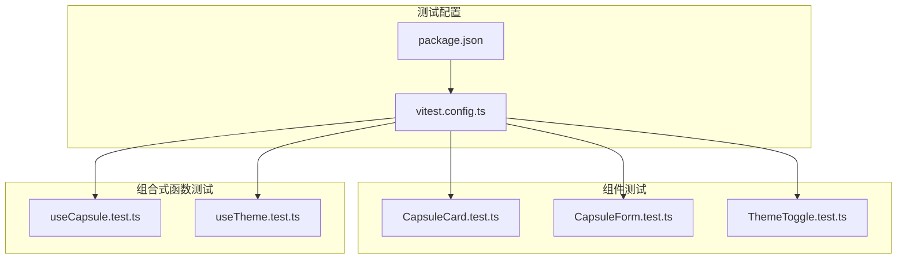
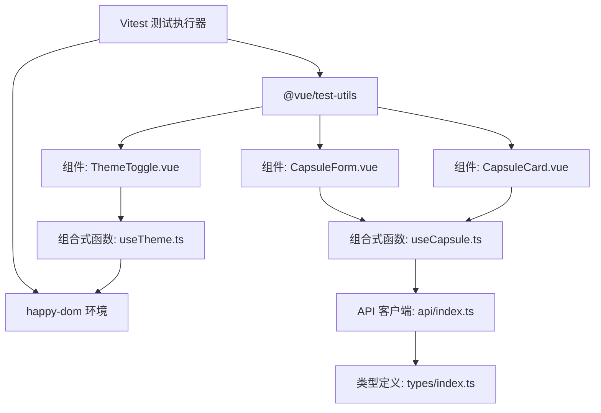
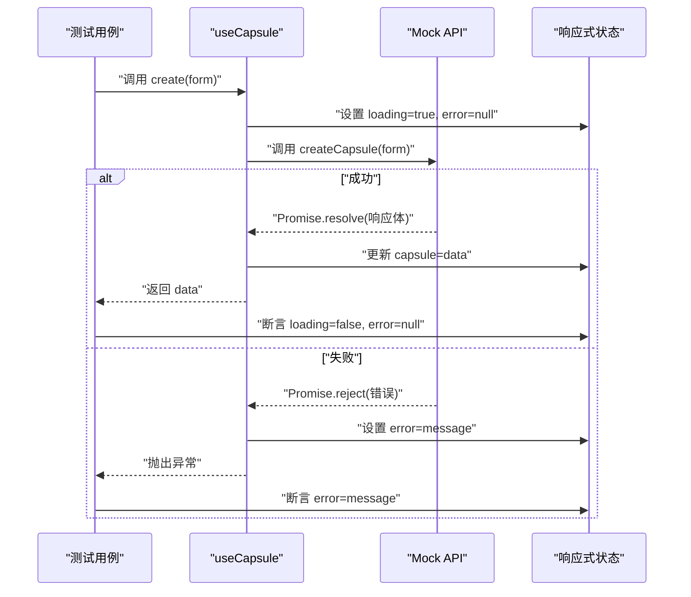
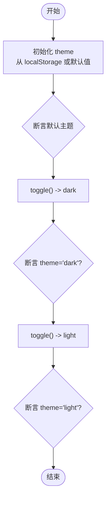
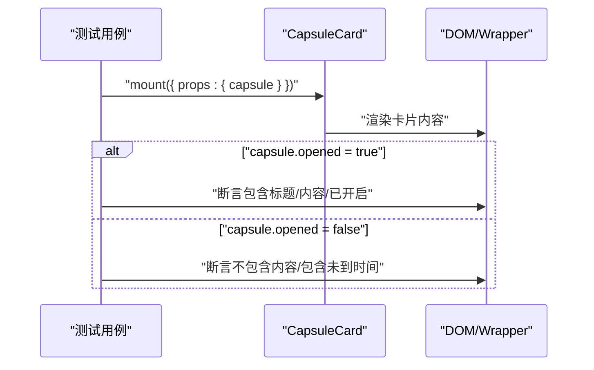
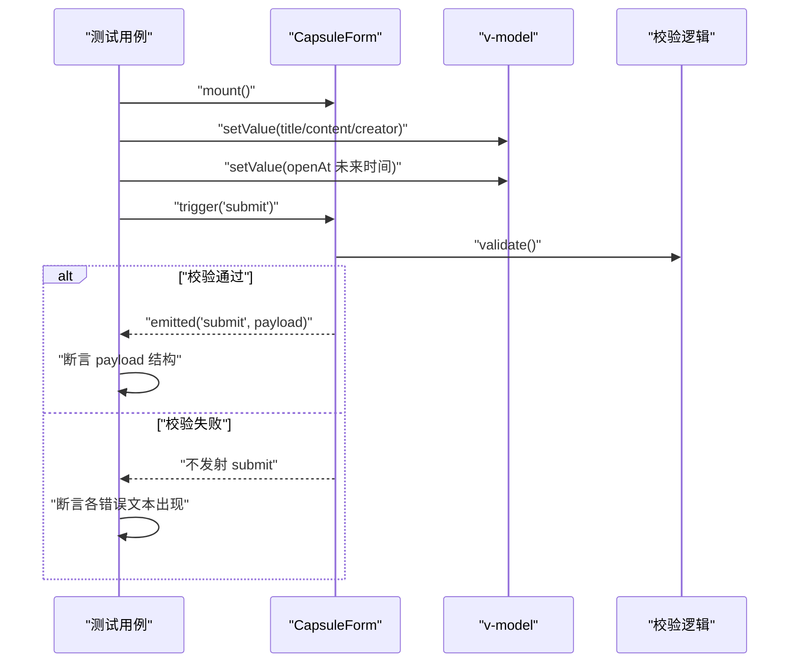
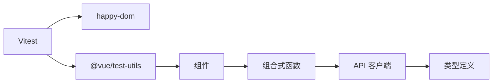

# Vue 3测试

<cite>
**本文引用的文件**
- [vitest.config.ts](file://frontends/vue3-ts/vitest.config.ts)
- [package.json](file://frontends/vue3-ts/package.json)
- [useCapsule.test.ts](file://frontends/vue3-ts/src/__tests__/composables/useCapsule.test.ts)
- [useTheme.test.ts](file://frontends/vue3-ts/src/__tests__/composables/useTheme.test.ts)
- [CapsuleCard.test.ts](file://frontends/vue3-ts/src/__tests__/components/CapsuleCard.test.ts)
- [CapsuleForm.test.ts](file://frontends/vue3-ts/src/__tests__/components/CapsuleForm.test.ts)
- [ThemeToggle.test.ts](file://frontends/vue3-ts/src/__tests__/components/ThemeToggle.test.ts)
- [useCapsule.ts](file://frontends/vue3-ts/src/composables/useCapsule.ts)
- [useTheme.ts](file://frontends/vue3-ts/src/composables/useTheme.ts)
- [CapsuleCard.vue](file://frontends/vue3-ts/src/components/CapsuleCard.vue)
- [CapsuleForm.vue](file://frontends/vue3-ts/src/components/CapsuleForm.vue)
- [ThemeToggle.vue](file://frontends/vue3-ts/src/components/ThemeToggle.vue)
- [index.ts](file://frontends/vue3-ts/src/api/index.ts)
- [index.ts](file://frontends/vue3-ts/src/types/index.ts)
</cite>

## 目录
1. [简介](#简介)
2. [项目结构](#项目结构)
3. [核心组件](#核心组件)
4. [架构总览](#架构总览)
5. [详细组件分析](#详细组件分析)
6. [依赖分析](#依赖分析)
7. [性能考虑](#性能考虑)
8. [故障排查指南](#故障排查指南)
9. [结论](#结论)
10. [附录](#附录)

## 简介
本文件面向Vue 3前端实现，系统性梳理Vitest测试框架在项目中的配置与使用方法，并结合实际代码示例，给出组件测试、组合式函数（Composition API）测试、响应式测试、异步组件测试、路由导航测试、全局状态测试等高级场景的最佳实践。同时提供测试覆盖率配置、Mock数据处理、测试环境隔离等建议，帮助团队建立稳定高效的前端测试体系。

## 项目结构
Vue 3前端采用Vite + TypeScript + Vitest的组合，测试目录组织遵循“按功能域划分”的原则：
- 组件测试：src/__tests__/components
- 组合式函数测试：src/__tests__/composables
- 测试运行配置：vitest.config.ts
- 依赖与脚本：package.json

**图表来源**
- [vitest.config.ts:1-18](file://frontends/vue3-ts/vitest.config.ts#L1-L18)
- [package.json:1-30](file://frontends/vue3-ts/package.json#L1-L30)

**章节来源**
- [vitest.config.ts:1-18](file://frontends/vue3-ts/vitest.config.ts#L1-L18)
- [package.json:1-30](file://frontends/vue3-ts/package.json#L1-L30)

## 核心组件
本节聚焦测试中涉及的关键模块与测试策略：

- 组合式函数
  - useCapsule：封装创建/查询胶囊的异步逻辑与响应式状态，便于在组件中复用与测试。
  - useTheme：封装主题切换与本地存储持久化，适合纯逻辑与DOM副作用分离的测试。

- 组件
  - CapsuleCard：根据胶囊状态显示内容或倒计时锁，具备条件渲染与子组件交互。
  - CapsuleForm：表单校验与提交，包含v-model、计算属性、事件发射等典型响应式场景。
  - ThemeToggle：基于useTheme的UI按钮，验证点击行为与主题切换效果。

- API层
  - index.ts：封装统一fetch请求、错误处理与业务接口（创建、查询、管理员接口、健康检查），为组合式函数提供数据源。

- 类型定义
  - types/index.ts：统一的响应体、胶囊对象、分页数据、管理员Token、健康信息等类型，确保测试数据结构一致性。

**章节来源**
- [useCapsule.ts:1-65](file://frontends/vue3-ts/src/composables/useCapsule.ts#L1-L65)
- [useTheme.ts:1-57](file://frontends/vue3-ts/src/composables/useTheme.ts#L1-L57)
- [CapsuleCard.vue:1-89](file://frontends/vue3-ts/src/components/CapsuleCard.vue#L1-L89)
- [CapsuleForm.vue:1-165](file://frontends/vue3-ts/src/components/CapsuleForm.vue#L1-L165)
- [ThemeToggle.vue:1-34](file://frontends/vue3-ts/src/components/ThemeToggle.vue#L1-L34)
- [index.ts:1-120](file://frontends/vue3-ts/src/api/index.ts#L1-L120)
- [index.ts:1-80](file://frontends/vue3-ts/src/types/index.ts#L1-L80)

## 架构总览
下图展示了测试运行时的总体架构：Vitest作为测试执行器，通过happy-dom模拟浏览器环境；Vue Test Utils负责组件挂载与断言；组合式函数与组件通过API层访问后端服务；测试通过Mock隔离真实网络请求。

**图表来源**
- [vitest.config.ts:13-17](file://frontends/vue3-ts/vitest.config.ts#L13-L17)
- [package.json:17-28](file://frontends/vue3-ts/package.json#L17-L28)
- [CapsuleCard.vue:32-42](file://frontends/vue3-ts/src/components/CapsuleCard.vue#L32-L42)
- [CapsuleForm.vue:63-69](file://frontends/vue3-ts/src/components/CapsuleForm.vue#L63-L69)
- [ThemeToggle.vue:8-12](file://frontends/vue3-ts/src/components/ThemeToggle.vue#L8-L12)
- [useCapsule.ts:6-8](file://frontends/vue3-ts/src/composables/useCapsule.ts#L6-L8)
- [useTheme.ts:5,13](file://frontends/vue3-ts/src/composables/useTheme.ts#L5,L13)
- [index.ts:6,19](file://frontends/vue3-ts/src/api/index.ts#L6,L19)

## 详细组件分析

### 组合式函数测试：useCapsule
- 测试目标
  - 异步创建胶囊：验证成功/失败分支、响应式状态更新、错误信息与加载态。
  - 异步获取胶囊：验证成功/失败分支、响应式状态更新。
- Mock策略
  - 使用vi.mock对API模块进行Mock，分别模拟resolve/reject以覆盖正反向场景。
- 断言要点
  - 断言响应式状态（capsule、loading、error）与返回值的一致性。
  - 断言错误信息字符串与异常抛出行为。

**图表来源**
- [useCapsule.test.ts:19-43](file://frontends/vue3-ts/src/__tests__/composables/useCapsule.test.ts#L19-L43)
- [useCapsule.ts:24-37](file://frontends/vue3-ts/src/composables/useCapsule.ts#L24-L37)
- [index.ts:46-54](file://frontends/vue3-ts/src/api/index.ts#L46-L54)

**章节来源**
- [useCapsule.test.ts:1-68](file://frontends/vue3-ts/src/__tests__/composables/useCapsule.test.ts#L1-L68)
- [useCapsule.ts:1-65](file://frontends/vue3-ts/src/composables/useCapsule.ts#L1-L65)
- [index.ts:1-120](file://frontends/vue3-ts/src/api/index.ts#L1-L120)

### 组合式函数测试：useTheme
- 测试目标
  - 默认主题：初始化时默认为亮色主题。
  - 主题切换：在亮/暗之间循环切换。
- Mock策略
  - 清理DOM属性与localStorage，避免跨用例污染。
- 断言要点
  - 断言theme.value在不同阶段的值。
  - 通过点击行为间接验证DOM属性变更（由组件测试覆盖）。

**图表来源**
- [useTheme.test.ts:10-21](file://frontends/vue3-ts/src/__tests__/composables/useTheme.test.ts#L10-L21)
- [useTheme.ts:13,51-53](file://frontends/vue3-ts/src/composables/useTheme.ts#L13,L51-L53)

**章节来源**
- [useTheme.test.ts:1-23](file://frontends/vue3-ts/src/__tests__/composables/useTheme.test.ts#L1-L23)
- [useTheme.ts:1-57](file://frontends/vue3-ts/src/composables/useTheme.ts#L1-L57)

### 组件测试：CapsuleCard
- 测试目标
  - 已开启胶囊：显示标题、内容、状态标签。
  - 未开启胶囊：隐藏内容，显示“未到时间”提示与倒计时组件。
- 测试策略
  - 使用mount挂载组件并传入props。
  - 通过wrapper.text()与条件渲染断言内容可见性。
  - 验证事件发射（expired）与子组件交互。

**图表来源**
- [CapsuleCard.test.ts:25-39](file://frontends/vue3-ts/src/__tests__/components/CapsuleCard.test.ts#L25-L39)
- [CapsuleCard.vue:20-28](file://frontends/vue3-ts/src/components/CapsuleCard.vue#L20-L28)

**章节来源**
- [CapsuleCard.test.ts:1-41](file://frontends/vue3-ts/src/__tests__/components/CapsuleCard.test.ts#L1-L41)
- [CapsuleCard.vue:1-89](file://frontends/vue3-ts/src/components/CapsuleCard.vue#L1-L89)

### 组件测试：CapsuleForm
- 测试目标
  - 渲染：表单字段与提交按钮存在。
  - 校验：空提交时显示各字段错误提示。
  - 提交：有效数据时发射submit事件并携带预期payload。
- 测试策略
  - 使用setValue填充表单，datetime-local设置未来时间。
  - 触发submit事件，断言emitted数组与第一个参数的结构。

**图表来源**
- [CapsuleForm.test.ts:16-49](file://frontends/vue3-ts/src/__tests__/components/CapsuleForm.test.ts#L16-L49)
- [CapsuleForm.vue:75-128](file://frontends/vue3-ts/src/components/CapsuleForm.vue#L75-L128)

**章节来源**
- [CapsuleForm.test.ts:1-51](file://frontends/vue3-ts/src/__tests__/components/CapsuleForm.test.ts#L1-L51)
- [CapsuleForm.vue:1-165](file://frontends/vue3-ts/src/components/CapsuleForm.vue#L1-L165)

### 组件测试：ThemeToggle
- 测试目标
  - 渲染：按钮存在。
  - 交互：点击后图标变化（通过类名/内容断言）。
- 测试策略
  - mount组件，查找button并触发click。
  - 断言图标元素存在，间接验证主题切换流程。

**章节来源**
- [ThemeToggle.test.ts:1-20](file://frontends/vue3-ts/src/__tests__/components/ThemeToggle.test.ts#L1-L20)
- [ThemeToggle.vue:1-34](file://frontends/vue3-ts/src/components/ThemeToggle.vue#L1-L34)

### 响应式测试：computed与watchEffect
- computed属性
  - 示例：CapsuleForm中的minDateTime计算属性，基于当前时间生成最小可选时间。
  - 测试方法：构造测试场景，断言计算结果符合预期（如时间格式、时区偏移处理）。
- watchEffect
  - 示例：useTheme中的watchEffect，监听theme.value并在DOM上应用data-theme属性。
  - 测试方法：通过修改ref值断言DOM属性变化；注意在测试环境中清理副作用。

**章节来源**
- [CapsuleForm.vue:89-93](file://frontends/vue3-ts/src/components/CapsuleForm.vue#L89-L93)
- [useTheme.ts:34-38](file://frontends/vue3-ts/src/composables/useTheme.ts#L34-L38)

### 异步组件测试
- 场景：CapsuleCard内部使用CountdownClock子组件。
- 测试策略：通过mount挂载父组件，断言子组件渲染与事件转发（如expired）。

**章节来源**
- [CapsuleCard.vue:27](file://frontends/vue3-ts/src/components/CapsuleCard.vue#L27)

### 路由导航测试（概念性指导）
- 概念：在Vue Router环境下，可通过@vue/test-utils的挂载能力与happy-dom环境进行导航测试。
- 建议：使用router.push模拟导航，断言组件渲染与URL变化；对需要鉴权的路由，结合全局状态（store或provide/inject）进行隔离测试。

[本节为概念性指导，不直接分析具体文件]

### 全局状态测试（概念性指导）
- 概念：对于Pinia/Vuex等全局状态，建议通过provide/inject或局部store实例化的方式进行隔离测试。
- 建议：在测试中注入mock store，断言actions/mutations对组件渲染的影响。

[本节为概念性指导，不直接分析具体文件]

## 依赖分析
- 测试运行时依赖
  - Vitest：测试执行器与断言库。
  - happy-dom：DOM环境模拟，支持JSDOM特性但更轻量。
  - @vue/test-utils：Vue组件测试工具集。
  - @testing-library/vue：辅助断言与可访问性测试（可选增强）。
- 项目内依赖关系
  - 组件依赖组合式函数；组合式函数依赖API客户端；API客户端依赖类型定义。

**图表来源**
- [package.json:17-28](file://frontends/vue3-ts/package.json#L17-L28)
- [useCapsule.ts:6-8](file://frontends/vue3-ts/src/composables/useCapsule.ts#L6-L8)
- [index.ts:6,19](file://frontends/vue3-ts/src/api/index.ts#L6,L19)

**章节来源**
- [package.json:1-30](file://frontends/vue3-ts/package.json#L1-L30)

## 性能考虑
- 测试隔离：每个测试用例独立清理Mock与DOM副作用，避免相互影响。
- 快照与最小断言：优先断言关键行为与状态，减少冗余快照。
- 并行执行：Vitest默认并行执行测试文件，合理拆分测试文件以提升吞吐。
- Mock粒度：对第三方依赖（如fetch）进行细粒度Mock，减少真实网络请求。

[本节提供一般性建议，不直接分析具体文件]

## 故障排查指南
- 环境变量与别名
  - 确认vitest.config.ts中的environment与globals配置正确。
  - 确认alias别名指向正确的源码目录。
- DOM相关错误
  - 在happy-dom环境下，确保对document与localStorage的操作在测试前清理。
- Mock未生效
  - 确保vi.mock在导入被测模块之前执行，并在beforeEach中清空所有Mock。
- 异步测试超时
  - 为异步操作添加await，必要时增加timeout配置。

**章节来源**
- [vitest.config.ts:13-17](file://frontends/vue3-ts/vitest.config.ts#L13-L17)
- [useTheme.test.ts:5-8](file://frontends/vue3-ts/src/__tests__/composables/useTheme.test.ts#L5-L8)
- [useCapsule.test.ts:15-17](file://frontends/vue3-ts/src/__tests__/composables/useCapsule.test.ts#L15-L17)

## 结论
本测试文档基于实际代码实现了从配置到组件与组合式函数的全链路测试策略。通过Mock隔离、响应式状态断言、事件与交互验证，以及对computed/watchEffect的针对性测试，能够有效保障Vue 3前端的功能稳定性与可维护性。建议在持续集成中启用覆盖率统计与测试报告，进一步提升质量保障水平。

## 附录
- 测试命令
  - 运行全部测试：npm run test
  - 监听模式：npm run test:watch
- 覆盖率配置建议
  - 在vitest.config.ts中启用coverage选项，结合.nycrc或vite配置生成报告。
- 最佳实践清单
  - 使用vi.mock隔离外部依赖。
  - 在beforeEach中清理副作用与Mock。
  - 对关键分支（成功/失败）与边界条件（空值、未来时间）进行断言。
  - 优先使用@vue/test-utils的find/findComponent与trigger/emitted等API。

**章节来源**
- [package.json:10-11](file://frontends/vue3-ts/package.json#L10-L11)
- [vitest.config.ts:13-17](file://frontends/vue3-ts/vitest.config.ts#L13-L17)