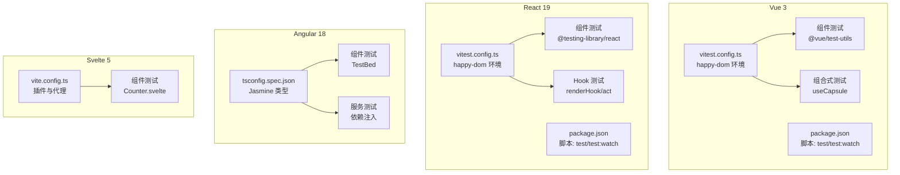
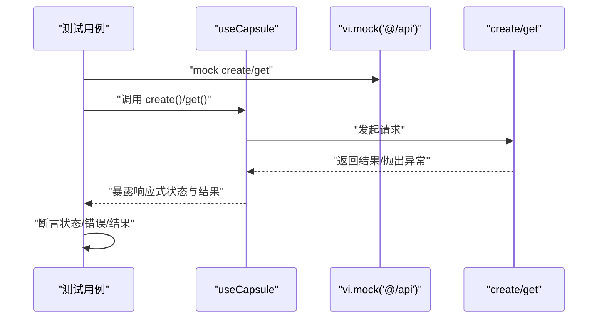
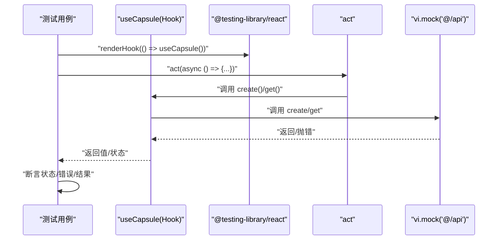
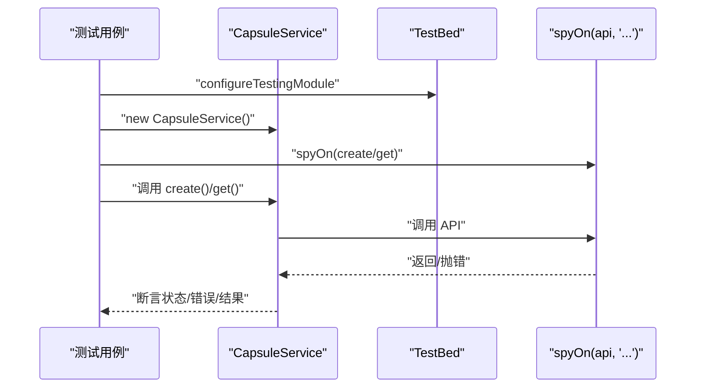
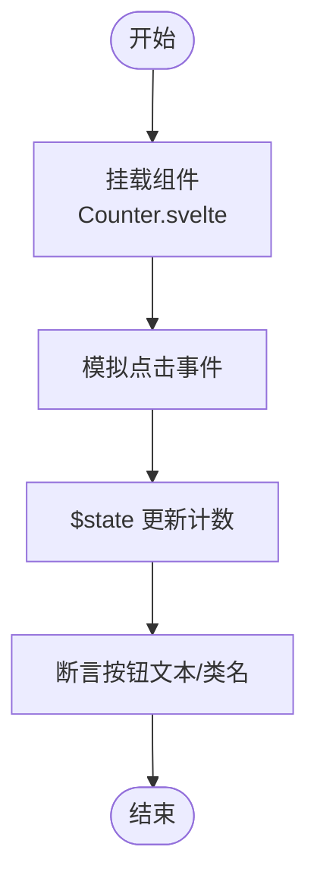
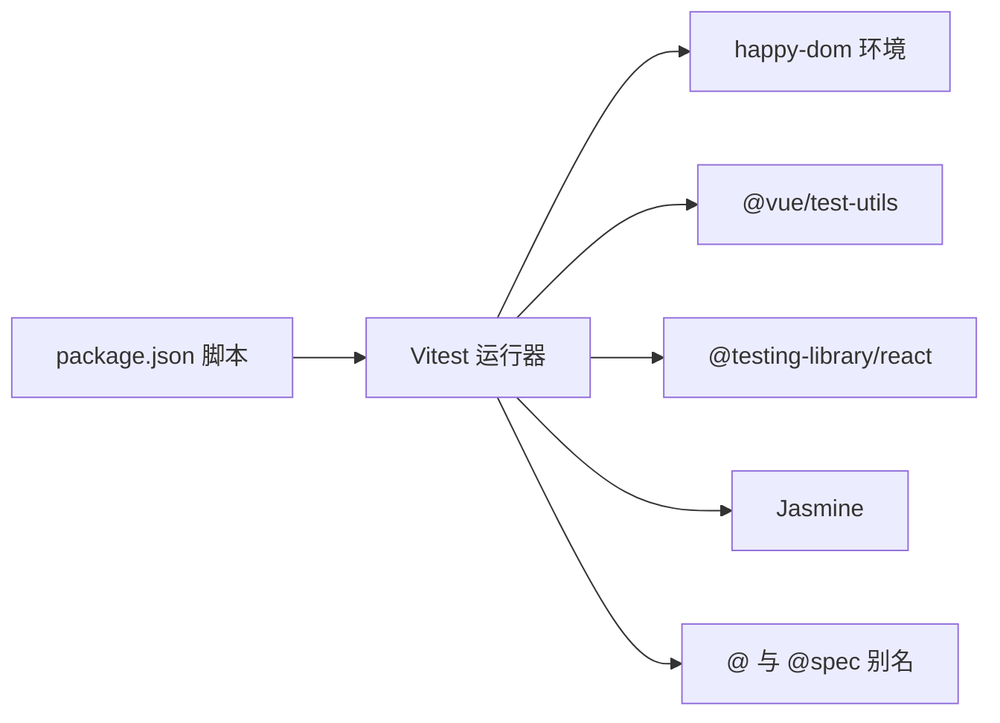

# 前端测试

<cite>
**本文引用的文件**
- [frontends/vue3-ts/vitest.config.ts](file://frontends/vue3-ts/vitest.config.ts)
- [frontends/vue3-ts/package.json](file://frontends/vue3-ts/package.json)
- [frontends/vue3-ts/src/__tests__/components/CapsuleCard.test.ts](file://frontends/vue3-ts/src/__tests__/components/CapsuleCard.test.ts)
- [frontends/vue3-ts/src/__tests__/composables/useCapsule.test.ts](file://frontends/vue3-ts/src/__tests__/composables/useCapsule.test.ts)
- [frontends/react-ts/vitest.config.ts](file://frontends/react-ts/vitest.config.ts)
- [frontends/react-ts/package.json](file://frontends/react-ts/package.json)
- [frontends/react-ts/src/__tests__/components/CapsuleCard.test.tsx](file://frontends/react-ts/src/__tests__/components/CapsuleCard.test.tsx)
- [frontends/react-ts/src/__tests__/hooks/useCapsule.test.ts](file://frontends/react-ts/src/__tests__/hooks/useCapsule.test.ts)
- [frontends/angular-ts/tsconfig.spec.json](file://frontends/angular-ts/tsconfig.spec.json)
- [frontends/angular-ts/src/__tests__/components/capsule-card.component.spec.ts](file://frontends/angular-ts/src/__tests__/components/capsule-card.component.spec.ts)
- [frontends/angular-ts/src/__tests__/services/capsule.service.spec.ts](file://frontends/angular-ts/src/__tests__/services/capsule.service.spec.ts)
- [frontends/svelte-ts/vite.config.ts](file://frontends/svelte-ts/vite.config.ts)
- [frontends/svelte-ts/src/lib/Counter.svelte](file://frontends/svelte-ts/src/lib/Counter.svelte)
</cite>

## 目录
1. [简介](#简介)
2. [项目结构](#项目结构)
3. [核心组件](#核心组件)
4. [架构总览](#架构总览)
5. [详细组件分析](#详细组件分析)
6. [依赖关系分析](#依赖关系分析)
7. [性能考虑](#性能考虑)
8. [故障排查指南](#故障排查指南)
9. [结论](#结论)
10. [附录](#附录)

## 简介
本文件面向 HelloTime 项目的前端测试体系，系统性梳理 Vue 3、React 19、Angular 18、Svelte 5 四种前端框架在本仓库中的测试策略与实现方式。重点覆盖：
- 测试运行器与环境：统一采用 Vitest + happy-dom；Angular 使用 Jasmine。
- 组件测试：基于官方推荐的测试库进行渲染与断言。
- 组合式/自定义 Hook 测试：隔离业务逻辑，验证状态与副作用。
- 服务与依赖注入测试：验证服务行为与依赖注入容器配置。
- 异步测试与交互模拟：通过 Mock、act、spyOn 等机制保证可测性。
- 覆盖率与环境配置：路径别名、全局变量、测试入口等。

## 项目结构
各前端子项目均采用“src/__tests__”组织测试文件，并通过各自的测试配置文件启用 Vitest 或 Jasmine。Vue 3 与 React 使用 Vitest + happy-dom；Angular 使用 Jasmine；Svelte 使用 Vite 配置与 Svelte 插件。

**图表来源**
- [frontends/vue3-ts/vitest.config.ts:1-18](file://frontends/vue3-ts/vitest.config.ts#L1-L18)
- [frontends/vue3-ts/package.json:1-30](file://frontends/vue3-ts/package.json#L1-L30)
- [frontends/react-ts/vitest.config.ts:1-18](file://frontends/react-ts/vitest.config.ts#L1-L18)
- [frontends/react-ts/package.json:1-31](file://frontends/react-ts/package.json#L1-L31)
- [frontends/angular-ts/tsconfig.spec.json:1-25](file://frontends/angular-ts/tsconfig.spec.json#L1-L25)
- [frontends/svelte-ts/vite.config.ts:1-29](file://frontends/svelte-ts/vite.config.ts#L1-L29)

**章节来源**
- [frontends/vue3-ts/vitest.config.ts:1-18](file://frontends/vue3-ts/vitest.config.ts#L1-L18)
- [frontends/react-ts/vitest.config.ts:1-18](file://frontends/react-ts/vitest.config.ts#L1-L18)
- [frontends/angular-ts/tsconfig.spec.json:1-25](file://frontends/angular-ts/tsconfig.spec.json#L1-L25)
- [frontends/svelte-ts/vite.config.ts:1-29](file://frontends/svelte-ts/vite.config.ts#L1-L29)

## 核心组件
- Vue 3
  - Vitest 配置启用 happy-dom，支持全局变量与路径别名。
  - 组件测试使用 @vue/test-utils 的 mount 进行挂载断言。
  - 组合式 API 测试通过直接导入 useCapsule 并以 mock 形式隔离外部依赖。
- React 19
  - Vitest 配置与 Vue 类似，使用 happy-dom。
  - 组件测试使用 @testing-library/react 的 render/screen。
  - Hook 测试使用 renderHook 与 act 包裹异步调用，确保状态更新后断言。
- Angular 18
  - Jasmine 类型在 tsconfig.spec.json 中声明，模块解析采用 bundler。
  - 组件测试通过 TestBed 创建组件实例并断言文本内容。
  - 服务测试通过构造函数实例化并 spy API 方法验证行为。
- Svelte 5
  - Vite 配置包含 Svelte 插件与本地开发代理。
  - 示例组件 Counter.svelte 展示了 $state 与事件绑定的基本用法，便于编写交互测试。

**章节来源**
- [frontends/vue3-ts/vitest.config.ts:1-18](file://frontends/vue3-ts/vitest.config.ts#L1-L18)
- [frontends/vue3-ts/src/__tests__/components/CapsuleCard.test.ts:1-41](file://frontends/vue3-ts/src/__tests__/components/CapsuleCard.test.ts#L1-L41)
- [frontends/vue3-ts/src/__tests__/composables/useCapsule.test.ts:1-68](file://frontends/vue3-ts/src/__tests__/composables/useCapsule.test.ts#L1-L68)
- [frontends/react-ts/vitest.config.ts:1-18](file://frontends/react-ts/vitest.config.ts#L1-L18)
- [frontends/react-ts/src/__tests__/components/CapsuleCard.test.tsx:1-46](file://frontends/react-ts/src/__tests__/components/CapsuleCard.test.tsx#L1-L46)
- [frontends/react-ts/src/__tests__/hooks/useCapsule.test.ts:1-89](file://frontends/react-ts/src/__tests__/hooks/useCapsule.test.ts#L1-L89)
- [frontends/angular-ts/tsconfig.spec.json:1-25](file://frontends/angular-ts/tsconfig.spec.json#L1-L25)
- [frontends/angular-ts/src/__tests__/components/capsule-card.component.spec.ts:1-69](file://frontends/angular-ts/src/__tests__/components/capsule-card.component.spec.ts#L1-L69)
- [frontends/angular-ts/src/__tests__/services/capsule.service.spec.ts:1-79](file://frontends/angular-ts/src/__tests__/services/capsule.service.spec.ts#L1-L79)
- [frontends/svelte-ts/vite.config.ts:1-29](file://frontends/svelte-ts/vite.config.ts#L1-L29)
- [frontends/svelte-ts/src/lib/Counter.svelte:1-11](file://frontends/svelte-ts/src/lib/Counter.svelte#L1-L11)

## 架构总览
下图展示各框架测试栈的关键交互：测试运行器加载配置 → 挂载/渲染组件或实例 → Mock 外部依赖 → 断言结果。

```mermaid
graph TB
subgraph "Vue 3"
VRun["Vitest 运行器"]
VEnv["happy-dom 环境"]
VMount["@vue/test-utils.mount"]
VMock["vi.mock('@/api')"]
VRun --> VEnv --> VMount --> VMock
end
subgraph "React 19"
RRun["Vitest 运行器"]
REnv["happy-dom 环境"]
RRender["@testing-library/react.render"]
RHook["renderHook + act"]
RMock["vi.mock('@/api')"]
RRun --> REnv --> RRender --> RHook --> RMock
end
subgraph "Angular 18"
AConf["tsconfig.spec.json(Jasmine)"]
ATestBed["TestBed.configureTestingModule"]
ASpy["spyOn(api, '...')"]
AConf --> ATestBed --> ASpy
end
subgraph "Svelte 5"
SCfg["vite.config.ts"]
SComp["Counter.svelte"]
SCfg --> SComp
end
```

**图表来源**
- [frontends/vue3-ts/vitest.config.ts:1-18](file://frontends/vue3-ts/vitest.config.ts#L1-L18)
- [frontends/react-ts/vitest.config.ts:1-18](file://frontends/react-ts/vitest.config.ts#L1-L18)
- [frontends/angular-ts/tsconfig.spec.json:1-25](file://frontends/angular-ts/tsconfig.spec.json#L1-L25)
- [frontends/svelte-ts/vite.config.ts:1-29](file://frontends/svelte-ts/vite.config.ts#L1-L29)

## 详细组件分析

### Vue 3 测试策略
- 测试运行与环境
  - 通过 Vitest 配置启用 happy-dom，提供 DOM API 支持。
  - 启用全局变量，简化断言书写。
  - 设置路径别名，便于跨目录引用源码与测试规范。
- 组件测试
  - 使用 @vue/test-utils 的 mount 对组件进行挂载。
  - 通过传入 props 验证不同状态下的渲染差异（如已开启/未开启胶囊）。
- 组合式 API 测试
  - 使用 vi.mock 对外部 API 进行模块级 Mock。
  - 在 beforeEach 中清理所有 Mock，避免用例间互相影响。
  - 分别验证成功与失败场景，断言返回值、响应式状态与错误信息。

**图表来源**
- [frontends/vue3-ts/src/__tests__/composables/useCapsule.test.ts:1-68](file://frontends/vue3-ts/src/__tests__/composables/useCapsule.test.ts#L1-L68)

**章节来源**
- [frontends/vue3-ts/vitest.config.ts:1-18](file://frontends/vue3-ts/vitest.config.ts#L1-L18)
- [frontends/vue3-ts/package.json:1-30](file://frontends/vue3-ts/package.json#L1-L30)
- [frontends/vue3-ts/src/__tests__/components/CapsuleCard.test.ts:1-41](file://frontends/vue3-ts/src/__tests__/components/CapsuleCard.test.ts#L1-L41)
- [frontends/vue3-ts/src/__tests__/composables/useCapsule.test.ts:1-68](file://frontends/vue3-ts/src/__tests__/composables/useCapsule.test.ts#L1-L68)

### React 19 测试策略
- 测试运行与环境
  - 与 Vue 类似的 Vitest + happy-dom 配置。
- 组件测试
  - 使用 @testing-library/react 的 render 与 screen 进行断言。
  - 通过 props 传递不同胶囊状态，验证显示逻辑。
- Hook 测试
  - 使用 renderHook 获取 Hook 返回值。
  - 使用 act 包裹异步调用，确保状态更新后再断言。
  - 通过 vi.mock 对外部 API 进行 Mock。

**图表来源**
- [frontends/react-ts/src/__tests__/hooks/useCapsule.test.ts:1-89](file://frontends/react-ts/src/__tests__/hooks/useCapsule.test.ts#L1-L89)

**章节来源**
- [frontends/react-ts/vitest.config.ts:1-18](file://frontends/react-ts/vitest.config.ts#L1-L18)
- [frontends/react-ts/package.json:1-31](file://frontends/react-ts/package.json#L1-L31)
- [frontends/react-ts/src/__tests__/components/CapsuleCard.test.tsx:1-46](file://frontends/react-ts/src/__tests__/components/CapsuleCard.test.tsx#L1-L46)
- [frontends/react-ts/src/__tests__/hooks/useCapsule.test.ts:1-89](file://frontends/react-ts/src/__tests__/hooks/useCapsule.test.ts#L1-L89)

### Angular 18 测试策略
- 测试运行与环境
  - tsconfig.spec.json 声明 Jasmine 类型，目标与模块版本为 ES2022。
  - 模块解析采用 bundler，路径别名映射至 @app 与 @spec。
- 组件测试
  - 使用 TestBed.configureTestingModule 配置组件导入。
  - 通过 fixture.componentInstance 设置输入属性并触发变更检测。
  - 断言原生元素文本内容，验证渲染逻辑。
- 服务测试
  - 直接构造服务实例，spyOn API 方法模拟成功/失败场景。
  - 断言服务内部状态（如 capsule、loading、error）与返回值。

**图表来源**
- [frontends/angular-ts/src/__tests__/services/capsule.service.spec.ts:1-79](file://frontends/angular-ts/src/__tests__/services/capsule.service.spec.ts#L1-L79)

**章节来源**
- [frontends/angular-ts/tsconfig.spec.json:1-25](file://frontends/angular-ts/tsconfig.spec.json#L1-L25)
- [frontends/angular-ts/src/__tests__/components/capsule-card.component.spec.ts:1-69](file://frontends/angular-ts/src/__tests__/components/capsule-card.component.spec.ts#L1-L69)
- [frontends/angular-ts/src/__tests__/services/capsule.service.spec.ts:1-79](file://frontends/angular-ts/src/__tests__/services/capsule.service.spec.ts#L1-L79)

### Svelte 5 测试策略
- 测试运行与环境
  - Vite 配置包含 @sveltejs/vite-plugin-svelte 插件与本地代理。
  - 示例组件 Counter.svelte 展示了 $state 与事件绑定的基础写法。
- 组件测试建议
  - 可参考其他框架的测试模式：使用 happy-dom 环境，挂载组件并断言渲染结果。
  - 通过事件模拟触发 $state 更新，断言 UI 变化。

**图表来源**
- [frontends/svelte-ts/src/lib/Counter.svelte:1-11](file://frontends/svelte-ts/src/lib/Counter.svelte#L1-L11)

**章节来源**
- [frontends/svelte-ts/vite.config.ts:1-29](file://frontends/svelte-ts/vite.config.ts#L1-L29)
- [frontends/svelte-ts/src/lib/Counter.svelte:1-11](file://frontends/svelte-ts/src/lib/Counter.svelte#L1-L11)

## 依赖关系分析
- 路径别名与测试入口
  - Vue 3 与 React 的 Vitest 配置均设置 @ 与 @spec 别名，便于跨目录引用。
  - Angular 的 tsconfig.spec.json 同样声明 @app 与 @spec 路径映射。
- 测试运行脚本
  - 各框架 package.json 提供 test 与 test:watch 脚本，统一通过 Vitest 执行。
- 外部依赖与环境
  - happy-dom 作为 DOM 环境，提供浏览器 API。
  - 各框架测试库（@vue/test-utils、@testing-library/react、Jasmine）分别承担组件与服务测试职责。

**图表来源**
- [frontends/vue3-ts/package.json:1-30](file://frontends/vue3-ts/package.json#L1-L30)
- [frontends/react-ts/package.json:1-31](file://frontends/react-ts/package.json#L1-L31)
- [frontends/angular-ts/tsconfig.spec.json:1-25](file://frontends/angular-ts/tsconfig.spec.json#L1-L25)
- [frontends/vue3-ts/vitest.config.ts:1-18](file://frontends/vue3-ts/vitest.config.ts#L1-L18)
- [frontends/react-ts/vitest.config.ts:1-18](file://frontends/react-ts/vitest.config.ts#L1-L18)

**章节来源**
- [frontends/vue3-ts/package.json:1-30](file://frontends/vue3-ts/package.json#L1-L30)
- [frontends/react-ts/package.json:1-31](file://frontends/react-ts/package.json#L1-L31)
- [frontends/angular-ts/tsconfig.spec.json:1-25](file://frontends/angular-ts/tsconfig.spec.json#L1-L25)
- [frontends/vue3-ts/vitest.config.ts:1-18](file://frontends/vue3-ts/vitest.config.ts#L1-L18)
- [frontends/react-ts/vitest.config.ts:1-18](file://frontends/react-ts/vitest.config.ts#L1-L18)

## 性能考虑
- 测试执行速度
  - 使用 Vitest 的 watch 模式进行增量测试，提升迭代效率。
  - 尽量复用 Mock 数据与共享的测试工具，减少重复初始化。
- 覆盖率与隔离
  - 通过模块级 Mock 隔离外部依赖，避免真实网络请求影响性能。
  - 在组件测试中仅渲染必要节点，减少不必要的断言与查询。
- 环境一致性
  - 统一使用 happy-dom，避免不同浏览器差异导致的不稳定。

## 故障排查指南
- 常见问题
  - 路径别名不生效：检查 Vitest 配置中的 alias 与 tsconfig 中的 paths 是否一致。
  - 组件未渲染：确认已调用变更检测（Angular）或正确挂载（Vue/React）。
  - 异步断言失败：确保使用 act（React）或等待状态更新后再断言。
  - Mock 未生效：在 beforeEach 中清理所有 Mock，避免状态污染。
- 定位手段
  - 使用控制台输出与最小化用例定位问题。
  - 分离成功与失败分支，逐步缩小范围。

**章节来源**
- [frontends/vue3-ts/src/__tests__/composables/useCapsule.test.ts:1-68](file://frontends/vue3-ts/src/__tests__/composables/useCapsule.test.ts#L1-L68)
- [frontends/react-ts/src/__tests__/hooks/useCapsule.test.ts:1-89](file://frontends/react-ts/src/__tests__/hooks/useCapsule.test.ts#L1-L89)
- [frontends/angular-ts/src/__tests__/services/capsule.service.spec.ts:1-79](file://frontends/angular-ts/src/__tests__/services/capsule.service.spec.ts#L1-L79)

## 结论
本项目在四类前端框架上建立了统一的测试基础设施：Vitest + happy-dom 用于 Vue 与 React；Jasmine 用于 Angular；并通过清晰的路径别名与脚本约定，实现了可维护、可扩展的测试体系。通过组件测试、组合式/Hook 测试、服务与依赖注入测试，覆盖了从 UI 到业务逻辑的关键路径。建议后续补充 Svelte 的组件测试用例，并完善覆盖率统计与持续集成流程。

## 附录
- 测试数据与 Mock
  - 使用 vi.mock 或 spyOn 对外部 API 进行 Mock，返回预设的成功/失败响应。
  - 在 beforeEach 中清理 Mock，确保用例独立性。
- 用户交互与异步处理
  - React 使用 act 包裹异步调用，确保状态更新后再断言。
  - Vue 与 Angular 通过事件触发与变更检测验证交互逻辑。
- 覆盖率与环境
  - 当前配置未显式声明覆盖率规则，可在各自 vitest.config.ts 中添加 coverage 字段以启用覆盖率统计。