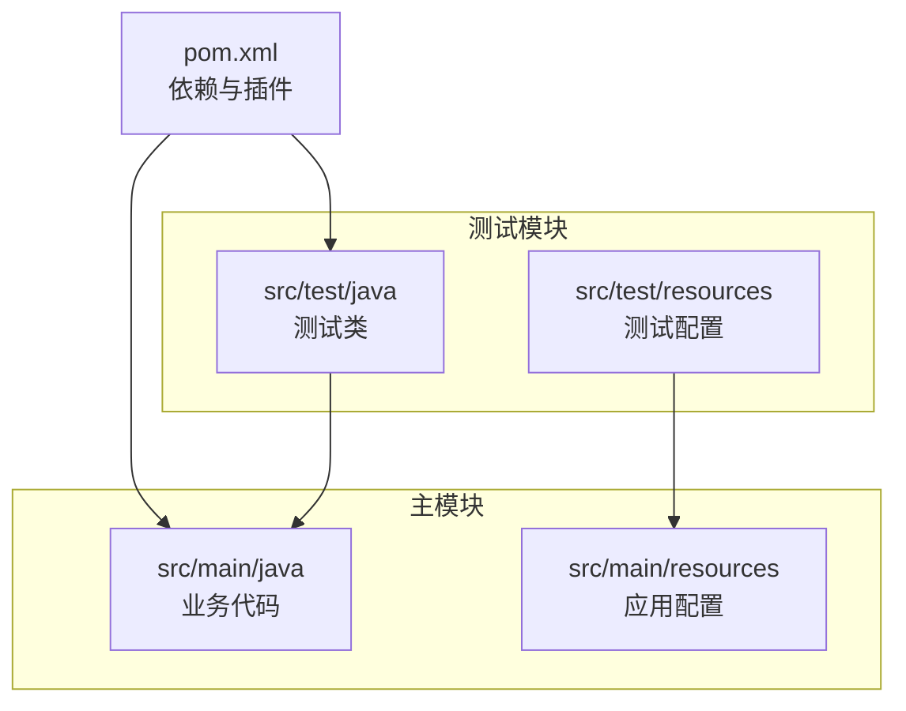
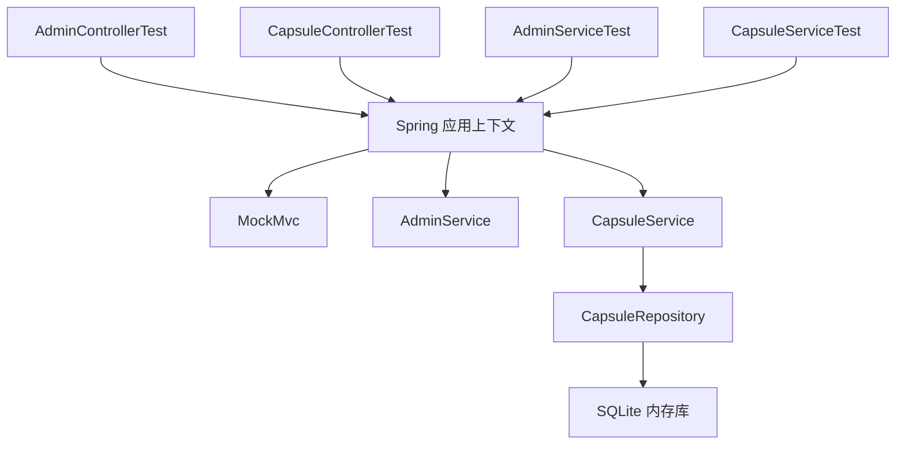
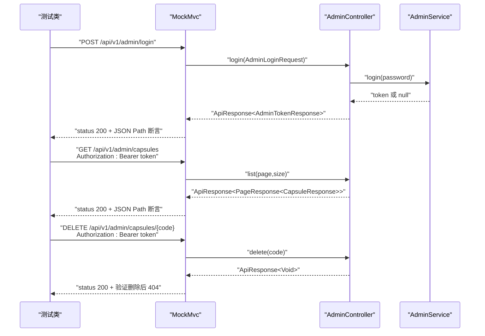
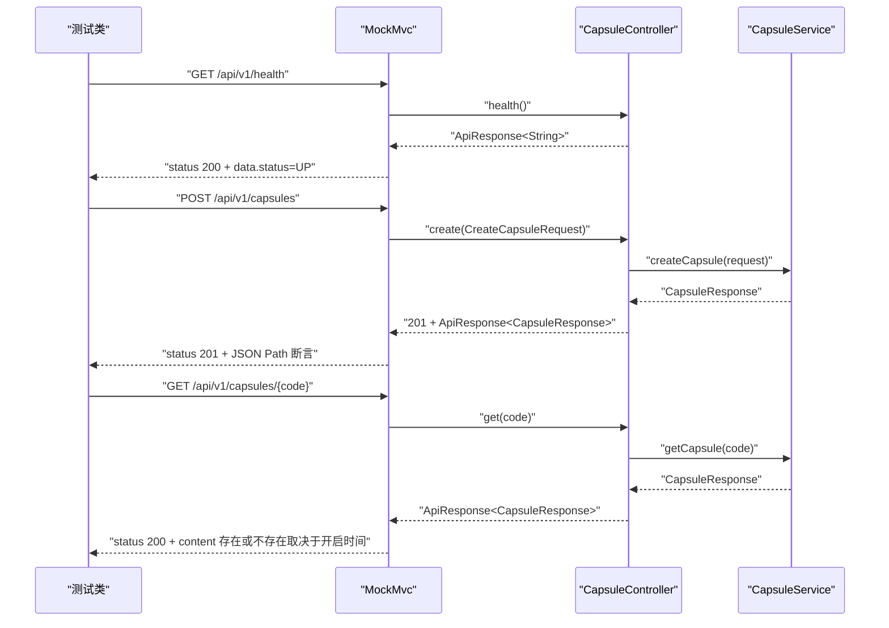
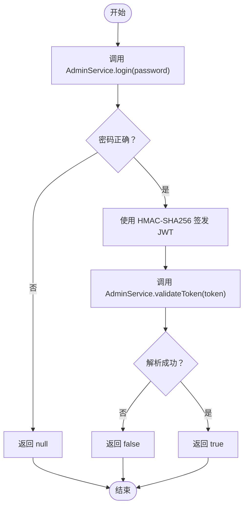
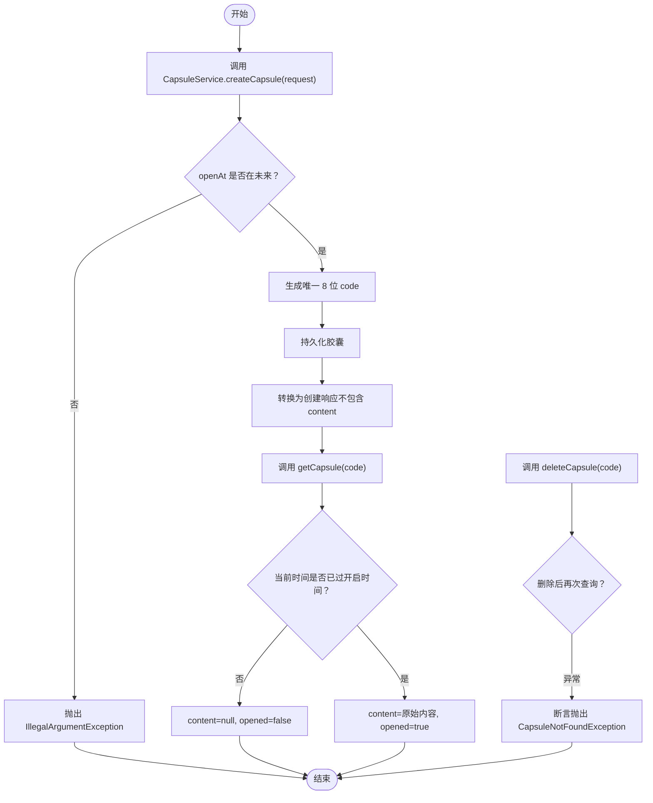
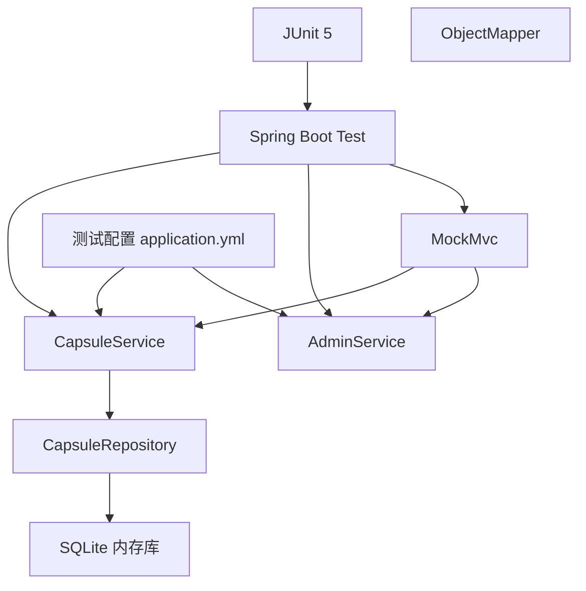

# Spring Boot测试

<cite>
**本文引用的文件**
- [AdminControllerTest.java](file://backends/spring-boot/src/test/java/com/hellotime/controller/AdminControllerTest.java)
- [CapsuleControllerTest.java](file://backends/spring-boot/src/test/java/com/hellotime/controller/CapsuleControllerTest.java)
- [AdminServiceTest.java](file://backends/spring-boot/src/test/java/com/hellotime/service/AdminServiceTest.java)
- [CapsuleServiceTest.java](file://backends/spring-boot/src/test/java/com/hellotime/service/CapsuleServiceTest.java)
- [application.yml（主应用）](file://backends/spring-boot/src/main/resources/application.yml)
- [application.yml（测试资源）](file://backends/spring-boot/src/test/resources/application.yml)
- [pom.xml](file://backends/spring-boot/pom.xml)
- [HelloTimeApplication.java](file://backends/spring-boot/src/main/java/com/hellotime/HelloTimeApplication.java)
- [AdminController.java](file://backends/spring-boot/src/main/java/com/hellotime/controller/AdminController.java)
- [CapsuleController.java](file://backends/spring-boot/src/main/java/com/hellotime/controller/CapsuleController.java)
- [AdminService.java](file://backends/spring-boot/src/main/java/com/hellotime/service/AdminService.java)
- [CapsuleService.java](file://backends/spring-boot/src/main/java/com/hellotime/service/CapsuleService.java)
</cite>

## 目录
1. [简介](#简介)
2. [项目结构](#项目结构)
3. [核心组件](#核心组件)
4. [架构总览](#架构总览)
5. [详细组件分析](#详细组件分析)
6. [依赖分析](#依赖分析)
7. [性能考虑](#性能考虑)
8. [故障排查指南](#故障排查指南)
9. [结论](#结论)
10. [附录](#附录)

## 简介
本文件系统性梳理 Spring Boot 后端在本仓库中的测试实现，围绕以下目标展开：
- 基于 JUnit 5 的测试框架使用
- 使用 MockMvc 进行 HTTP 请求模拟
- 使用 @SpringBootTest 进行集成测试配置
- 使用 @Transactional 实现事务回滚
- 控制器测试最佳实践：JWT 认证测试、API 端点测试、错误处理测试
- 服务层测试策略：业务逻辑验证、数据访问测试、异常情况处理
- 测试数据准备、Mock 对象使用、测试环境配置
- 测试覆盖率分析、性能测试考虑、测试调试技巧等高级主题

## 项目结构
Spring Boot 测试位于 backends/spring-boot 模块中，采用标准的 Maven 结构：
- 测试代码位于 src/test/java 下，按包划分 controller 与 service 两个子包
- 测试资源位于 src/test/resources，覆盖数据源与应用配置
- 主应用配置位于 src/main/resources，生产环境配置
- 顶层 pom.xml 提供依赖与插件配置，包含 Spring Boot Starter Test

图表来源
- [pom.xml:1-91](file://backends/spring-boot/pom.xml#L1-L91)
- [application.yml（主应用）:1-26](file://backends/spring-boot/src/main/resources/application.yml#L1-L26)
- [application.yml（测试资源）:1-16](file://backends/spring-boot/src/test/resources/application.yml#L1-L16)

章节来源
- [pom.xml:1-91](file://backends/spring-boot/pom.xml#L1-L91)
- [HelloTimeApplication.java:1-12](file://backends/spring-boot/src/main/java/com/hellotime/HelloTimeApplication.java#L1-L12)

## 核心组件
本项目的测试覆盖了控制器与服务层两大层面，并结合配置与依赖，形成完整的测试体系。

- 控制器层测试
  - AdminControllerTest：管理员登录、列表查询、删除胶囊的端到端测试，包含 JWT 认证流程与错误场景
  - CapsuleControllerTest：健康检查、创建胶囊、参数校验、不存在资源的错误处理、未开启胶囊的内容隐藏逻辑
- 服务层测试
  - AdminServiceTest：管理员登录与令牌校验的纯业务逻辑测试
  - CapsuleServiceTest：创建胶囊、未来开启时间校验、未开启内容隐藏、不存在资源的异常处理、删除与二次查找验证

章节来源
- [AdminControllerTest.java:1-114](file://backends/spring-boot/src/test/java/com/hellotime/controller/AdminControllerTest.java#L1-L114)
- [CapsuleControllerTest.java:1-99](file://backends/spring-boot/src/test/java/com/hellotime/controller/CapsuleControllerTest.java#L1-L99)
- [AdminServiceTest.java:1-39](file://backends/spring-boot/src/test/java/com/hellotime/service/AdminServiceTest.java#L1-L39)
- [CapsuleServiceTest.java:1-102](file://backends/spring-boot/src/test/java/com/hellotime/service/CapsuleServiceTest.java#L1-L102)

## 架构总览
下图展示了测试执行的关键路径：测试类通过 @SpringBootTest 启动应用上下文，使用 @AutoConfigureMockMvc 注入 MockMvc，对控制器端点发起 HTTP 请求；服务层测试直接通过 @SpringBootTest 获取 Bean 并调用业务方法；事务通过 @Transactional 在测试结束后自动回滚。

图表来源
- [AdminControllerTest.java:24-26](file://backends/spring-boot/src/test/java/com/hellotime/controller/AdminControllerTest.java#L24-L26)
- [CapsuleControllerTest.java:23-25](file://backends/spring-boot/src/test/java/com/hellotime/controller/CapsuleControllerTest.java#L23-L25)
- [AdminServiceTest.java:9](file://backends/spring-boot/src/test/java/com/hellotime/service/AdminServiceTest.java#L9)
- [CapsuleServiceTest.java:21-22](file://backends/spring-boot/src/test/java/com/hellotime/service/CapsuleServiceTest.java#L21-L22)
- [application.yml（测试资源）:1-16](file://backends/spring-boot/src/test/resources/application.yml#L1-L16)

## 详细组件分析

### 控制器测试：AdminControllerTest
- 测试目标
  - 管理员登录：正确密码返回 Token，错误密码返回 401
  - 未携带 Token 访问受保护端点返回 401
  - 携带 Token 访问受保护端点返回 200
  - 删除胶囊：先创建再删除，验证删除后查询返回 404
- 关键技术点
  - 使用 MockMvc 发起 HTTP 请求，JSON 请求体通过 ObjectMapper 序列化
  - 通过登录接口获取 Token，并在后续请求头中添加 Authorization: Bearer
  - 使用 JSON Path 断言响应字段，如 success、data.token、data.content 等
  - 使用 @Transactional 在测试结束后回滚，保证数据库状态一致

图表来源
- [AdminControllerTest.java:35-44](file://backends/spring-boot/src/test/java/com/hellotime/controller/AdminControllerTest.java#L35-L44)
- [AdminControllerTest.java:76-84](file://backends/spring-boot/src/test/java/com/hellotime/controller/AdminControllerTest.java#L76-L84)
- [AdminControllerTest.java:87-113](file://backends/spring-boot/src/test/java/com/hellotime/controller/AdminControllerTest.java#L87-L113)
- [AdminController.java:41-48](file://backends/spring-boot/src/main/java/com/hellotime/controller/AdminController.java#L41-L48)
- [AdminController.java:59-64](file://backends/spring-boot/src/main/java/com/hellotime/controller/AdminController.java#L59-L64)
- [AdminController.java:74-78](file://backends/spring-boot/src/main/java/com/hellotime/controller/AdminController.java#L74-L78)

章节来源
- [AdminControllerTest.java:1-114](file://backends/spring-boot/src/test/java/com/hellotime/controller/AdminControllerTest.java#L1-L114)
- [AdminController.java:18-79](file://backends/spring-boot/src/main/java/com/hellotime/controller/AdminController.java#L18-L79)

### 控制器测试：CapsuleControllerTest
- 测试目标
  - 健康检查端点返回 200 且 data.status 为 UP
  - 创建胶囊：正常请求返回 201，断言 code、title 等字段
  - 参数缺失返回 400，断言 errorCode 为 VALIDATION_ERROR
  - 查询不存在的胶囊返回 404，断言 errorCode 为 CAPSULE_NOT_FOUND
  - 未开启胶囊查询时 content 不应存在
- 关键技术点
  - 使用 ObjectMapper 将请求对象序列化为 JSON
  - 使用 JSON Path 断言响应结构与字段值
  - 通过创建后立即查询，验证内容隐藏逻辑

图表来源
- [CapsuleControllerTest.java:35-40](file://backends/spring-boot/src/test/java/com/hellotime/controller/CapsuleControllerTest.java#L35-L40)
- [CapsuleControllerTest.java:43-58](file://backends/spring-boot/src/test/java/com/hellotime/controller/CapsuleControllerTest.java#L43-L58)
- [CapsuleControllerTest.java:61-68](file://backends/spring-boot/src/test/java/com/hellotime/controller/CapsuleControllerTest.java#L61-L68)
- [CapsuleControllerTest.java:71-76](file://backends/spring-boot/src/test/java/com/hellotime/controller/CapsuleControllerTest.java#L71-L76)
- [CapsuleControllerTest.java:79-98](file://backends/spring-boot/src/test/java/com/hellotime/controller/CapsuleControllerTest.java#L79-L98)
- [CapsuleController.java:37-42](file://backends/spring-boot/src/main/java/com/hellotime/controller/CapsuleController.java#L37-L42)
- [CapsuleController.java:51-55](file://backends/spring-boot/src/main/java/com/hellotime/controller/CapsuleController.java#L51-L55)

章节来源
- [CapsuleControllerTest.java:1-99](file://backends/spring-boot/src/test/java/com/hellotime/controller/CapsuleControllerTest.java#L1-L99)
- [CapsuleController.java:17-57](file://backends/spring-boot/src/main/java/com/hellotime/controller/CapsuleController.java#L17-L57)

### 服务层测试：AdminServiceTest
- 测试目标
  - 正确密码返回非空 Token
  - 错误密码返回 null
  - 校验有效 Token 返回 true
  - 校验无效 Token 返回 false
- 关键技术点
  - 通过 @SpringBootTest 直接注入 AdminService
  - 基于配置文件中的密钥与密码进行签发与校验
  - 无需启动 Web 层，专注纯业务逻辑验证

图表来源
- [AdminServiceTest.java:15-37](file://backends/spring-boot/src/test/java/com/hellotime/service/AdminServiceTest.java#L15-L37)
- [AdminService.java:53-87](file://backends/spring-boot/src/main/java/com/hellotime/service/AdminService.java#L53-L87)

章节来源
- [AdminServiceTest.java:1-39](file://backends/spring-boot/src/test/java/com/hellotime/service/AdminServiceTest.java#L1-L39)
- [AdminService.java:18-89](file://backends/spring-boot/src/main/java/com/hellotime/service/AdminService.java#L18-L89)

### 服务层测试：CapsuleServiceTest
- 测试目标
  - 创建胶囊：返回 8 位 code，title、creator、createdAt 等字段正确
  - 未来开启时间校验：过去时间抛出 IllegalArgumentException
  - 未开启胶囊：查询时不返回 content，opened=false
  - 不存在资源：查询与删除抛出 CapsuleNotFoundException
  - 删除后二次查找应抛异常
- 关键技术点
  - 使用 @Transactional 在测试结束后回滚，避免污染数据库
  - 通过 CapsuleRepository 验证删除效果
  - 使用 Java 21 Record 作为 DTO，简化测试数据构造

图表来源
- [CapsuleServiceTest.java:32-47](file://backends/spring-boot/src/test/java/com/hellotime/service/CapsuleServiceTest.java#L32-L47)
- [CapsuleServiceTest.java:50-59](file://backends/spring-boot/src/test/java/com/hellotime/service/CapsuleServiceTest.java#L50-L59)
- [CapsuleServiceTest.java:62-76](file://backends/spring-boot/src/test/java/com/hellotime/service/CapsuleServiceTest.java#L62-L76)
- [CapsuleServiceTest.java:79-96](file://backends/spring-boot/src/test/java/com/hellotime/service/CapsuleServiceTest.java#L79-L96)
- [CapsuleService.java:52-87](file://backends/spring-boot/src/main/java/com/hellotime/service/CapsuleService.java#L52-L87)
- [CapsuleService.java:106-119](file://backends/spring-boot/src/main/java/com/hellotime/service/CapsuleService.java#L106-L119)

章节来源
- [CapsuleServiceTest.java:1-102](file://backends/spring-boot/src/test/java/com/hellotime/service/CapsuleServiceTest.java#L1-L102)
- [CapsuleService.java:26-196](file://backends/spring-boot/src/main/java/com/hellotime/service/CapsuleService.java#L26-L196)

## 依赖分析
- 测试框架与工具
  - JUnit 5：测试生命周期与断言
  - Spring Boot Test：@SpringBootTest、@AutoConfigureMockMvc、@Transactional
  - MockMvc：HTTP 层面的端到端测试
  - ObjectMapper：JSON 序列化与反序列化
- 数据与配置
  - SQLite 内存库：测试环境使用内存数据库，DDL 行为由测试配置控制
  - 应用配置：测试配置覆盖管理员密码与 JWT 密钥，便于可控的认证与断言
- 业务依赖
  - AdminService：负责 JWT 签发与校验
  - CapsuleService：负责业务逻辑与数据访问（通过 Repository）

图表来源
- [pom.xml:74-79](file://backends/spring-boot/pom.xml#L74-L79)
- [application.yml（测试资源）:1-16](file://backends/spring-boot/src/test/resources/application.yml#L1-L16)
- [AdminService.java:35-44](file://backends/spring-boot/src/main/java/com/hellotime/service/AdminService.java#L35-L44)
- [CapsuleService.java:40-42](file://backends/spring-boot/src/main/java/com/hellotime/service/CapsuleService.java#L40-L42)

章节来源
- [pom.xml:1-91](file://backends/spring-boot/pom.xml#L1-L91)
- [application.yml（测试资源）:1-16](file://backends/spring-boot/src/test/resources/application.yml#L1-L16)

## 性能考虑
- 测试数据库选择
  - 使用 SQLite 内存库可显著降低 I/O 开销，提升测试执行速度
- 事务回滚
  - @Transactional 在测试结束后自动回滚，避免重复清理与长事务开销
- 虚拟线程
  - 生产配置启用了虚拟线程，有助于高并发下的吞吐优化；测试阶段可关注线程切换与并发行为的稳定性
- 响应式与异步
  - 若后续引入响应式栈或异步任务，建议配合 Project Reactor Test 或 CompletableFuture 测试工具，以减少阻塞等待

## 故障排查指南
- 常见问题与定位
  - 认证失败：核对测试配置中的管理员密码与 JWT 密钥是否与生产一致
  - JSON 断言失败：确认响应结构与字段名是否与 ApiResponse 统一约定一致
  - 404 未找到：确认创建流程是否成功，以及 code 的生成与存储逻辑
  - 事务未回滚：确认测试类是否标注 @Transactional，以及是否在事务边界内执行
- 调试技巧
  - 在测试中打印关键中间值（如生成的 code、Token、响应体片段）
  - 使用 MockMvc 的 andReturn().getResponse().getContentAsString() 快速查看原始响应
  - 逐步拆分复杂测试，将“创建-修改-删除”链路拆分为独立用例，便于定位问题

章节来源
- [application.yml（测试资源）:10-16](file://backends/spring-boot/src/test/resources/application.yml#L10-L16)
- [AdminControllerTest.java:35-44](file://backends/spring-boot/src/test/java/com/hellotime/controller/AdminControllerTest.java#L35-L44)
- [CapsuleServiceTest.java:84-96](file://backends/spring-boot/src/test/java/com/hellotime/service/CapsuleServiceTest.java#L84-L96)

## 结论
本项目的测试体系以 JUnit 5 为基础，结合 @SpringBootTest、@AutoConfigureMockMvc 与 @Transactional，实现了控制器与服务层的全面覆盖。通过统一的 ApiResponse 约定与测试配置，测试具备良好的可维护性与可扩展性。建议在后续迭代中补充：
- 更多边界条件与异常分支的断言
- 使用 @MockBean 替换真实依赖，隔离外部系统影响
- 引入测试覆盖率工具（如 Jacoco）评估关键路径覆盖度
- 针对高并发场景增加压力测试与线程安全验证

## 附录
- 测试数据准备
  - 使用 Java 21 Record 简化 DTO 构造，减少样板代码
  - 在测试中通过 ObjectMapper 序列化请求体，保持与生产一致的 JSON 结构
- Mock 对象使用
  - 对于服务层测试，优先通过 @SpringBootTest 注入真实 Bean；对于控制器测试，使用 MockMvc 模拟 HTTP 层
- 测试环境配置
  - 测试配置覆盖数据源为内存库，DDL 行为设置为 create-drop，确保每次测试前后的数据库状态一致