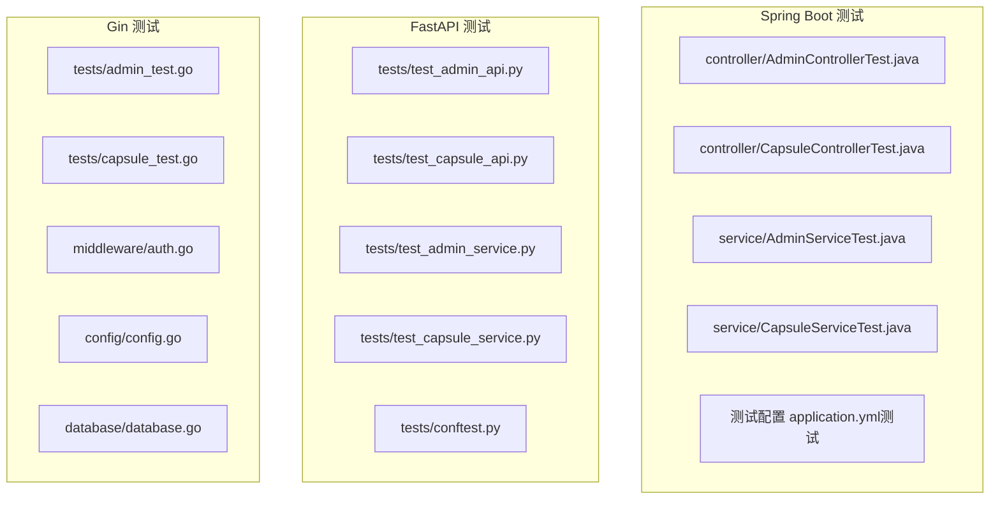
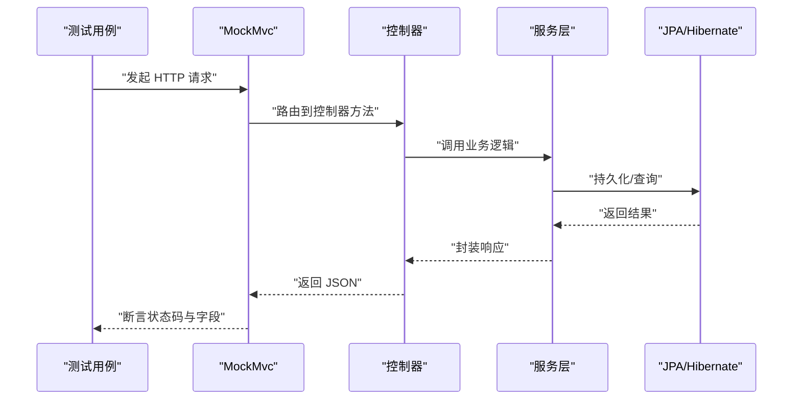
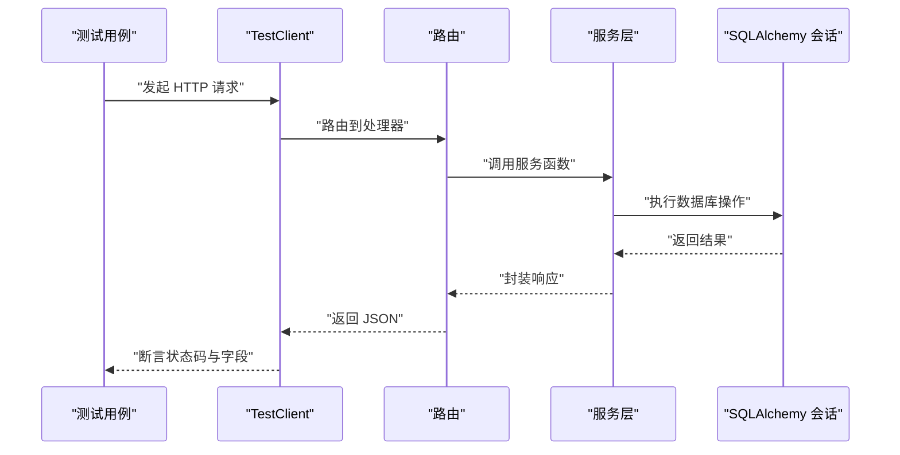
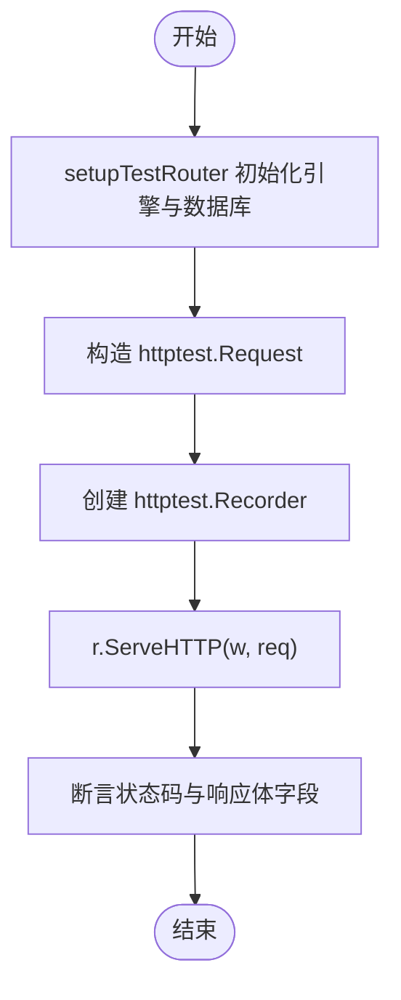
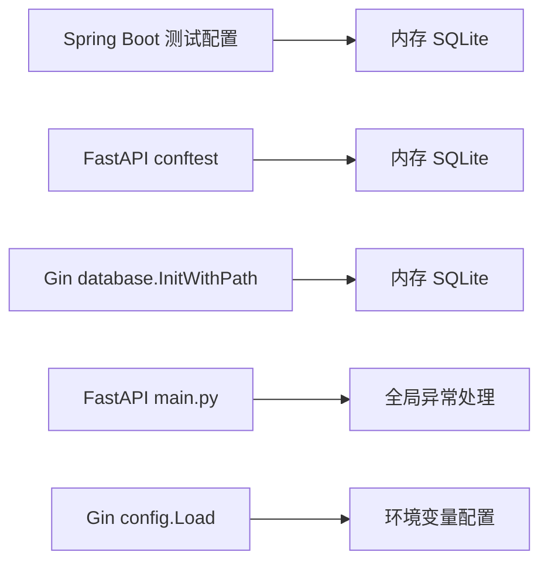

# 后端测试

<cite>
**本文引用的文件**
- [AdminControllerTest.java](file://backends/spring-boot/src/test/java/com/hellotime/controller/AdminControllerTest.java)
- [CapsuleControllerTest.java](file://backends/spring-boot/src/test/java/com/hellotime/controller/CapsuleControllerTest.java)
- [AdminServiceTest.java](file://backends/spring-boot/src/test/java/com/hellotime/service/AdminServiceTest.java)
- [CapsuleServiceTest.java](file://backends/spring-boot/src/test/java/com/hellotime/service/CapsuleServiceTest.java)
- [application.yml（测试）](file://backends/spring-boot/src/test/resources/application.yml)
- [application.yml（生产）](file://backends/spring-boot/src/main/resources/application.yml)
- [test_admin_api.py](file://backends/fastapi/tests/test_admin_api.py)
- [test_capsule_api.py](file://backends/fastapi/tests/test_capsule_api.py)
- [test_admin_service.py](file://backends/fastapi/tests/test_admin_service.py)
- [test_capsule_service.py](file://backends/fastapi/tests/test_capsule_service.py)
- [conftest.py](file://backends/fastapi/tests/conftest.py)
- [main.py（FastAPI）](file://backends/fastapi/app/main.py)
- [database.py（FastAPI）](file://backends/fastapi/app/database.py)
- [admin_test.go](file://backends/gin/tests/admin_test.go)
- [capsule_test.go](file://backends/gin/tests/capsule_test.go)
- [auth.go（Gin 中间件）](file://backends/gin/middleware/auth.go)
- [config.go（Gin 配置）](file://backends/gin/config/config.go)
- [database.go（Gin 数据库）](file://backends/gin/database/database.go)
</cite>

## 目录
1. [引言](#引言)
2. [项目结构](#项目结构)
3. [核心组件](#核心组件)
4. [架构总览](#架构总览)
5. [详细组件分析](#详细组件分析)
6. [依赖分析](#依赖分析)
7. [性能考虑](#性能考虑)
8. [故障排查指南](#故障排查指南)
9. [结论](#结论)
10. [附录](#附录)

## 引言
本文件面向 HelloTime 项目的后端测试，系统性梳理 Spring Boot、FastAPI、Gin 三套后端框架在测试方面的实现与最佳实践。重点覆盖：
- Spring Boot 的 JUnit 测试：控制器测试、服务层测试、集成测试
- FastAPI 的 pytest 测试：API 端点测试、服务层测试、数据库与依赖注入测试
- Gin 的 Go testing 包测试：HTTP 请求模拟、数据库测试、中间件测试
并提供 JWT 认证测试、数据库操作测试、错误处理测试的可复用模板与实施建议。

## 项目结构
后端测试分布在三个子项目中，均采用“按功能分层”的组织方式：
- Spring Boot：src/test 下按 controller 与 service 子包划分，配合测试资源 application.yml
- FastAPI：tests 下按模块划分（API 与服务），并提供 conftest.py 统一数据库与客户端 fixture
- Gin：tests 下按模块划分，每个测试文件内含 setupTestRouter 辅助函数，直接使用内存数据库

图表来源
- [AdminControllerTest.java:1-114](file://backends/spring-boot/src/test/java/com/hellotime/controller/AdminControllerTest.java#L1-L114)
- [CapsuleControllerTest.java:1-99](file://backends/spring-boot/src/test/java/com/hellotime/controller/CapsuleControllerTest.java#L1-L99)
- [AdminServiceTest.java:1-39](file://backends/spring-boot/src/test/java/com/hellotime/service/AdminServiceTest.java#L1-L39)
- [CapsuleServiceTest.java:1-102](file://backends/spring-boot/src/test/java/com/hellotime/service/CapsuleServiceTest.java#L1-L102)
- [application.yml（测试）:1-16](file://backends/spring-boot/src/test/resources/application.yml#L1-L16)
- [test_admin_api.py:1-77](file://backends/fastapi/tests/test_admin_api.py#L1-L77)
- [test_capsule_api.py:1-89](file://backends/fastapi/tests/test_capsule_api.py#L1-L89)
- [test_admin_service.py:1-30](file://backends/fastapi/tests/test_admin_service.py#L1-L30)
- [test_capsule_service.py:1-89](file://backends/fastapi/tests/test_capsule_service.py#L1-L89)
- [conftest.py:1-47](file://backends/fastapi/tests/conftest.py#L1-L47)
- [admin_test.go:1-181](file://backends/gin/tests/admin_test.go#L1-L181)
- [capsule_test.go:1-194](file://backends/gin/tests/capsule_test.go#L1-L194)
- [auth.go（Gin 中间件）:1-37](file://backends/gin/middleware/auth.go#L1-L37)
- [config.go（Gin 配置）:1-51](file://backends/gin/config/config.go#L1-L51)
- [database.go（Gin 数据库）:1-38](file://backends/gin/database/database.go#L1-L38)

章节来源
- [application.yml（测试）:1-16](file://backends/spring-boot/src/test/resources/application.yml#L1-L16)
- [application.yml（生产）:1-26](file://backends/spring-boot/src/main/resources/application.yml#L1-L26)
- [conftest.py:1-47](file://backends/fastapi/tests/conftest.py#L1-L47)
- [capsule_test.go:21-38](file://backends/gin/tests/capsule_test.go#L21-L38)

## 核心组件
- Spring Boot
  - 控制器测试：使用 @SpringBootTest + @AutoConfigureMockMvc + @Transactional，结合 MockMvc 发起 HTTP 请求，断言状态码与 JSONPath 结果
  - 服务层测试：直接注入服务进行单元测试，验证业务逻辑与异常行为
  - 集成测试：通过测试配置文件切换到内存数据库，确保事务回滚与隔离
- FastAPI
  - API 端点测试：使用 TestClient，通过依赖注入覆盖 get_db，使用内存 SQLite
  - 服务层测试：直接调用服务函数，传入 db_session，断言返回值与异常
  - 依赖注入与异常处理：统一在 conftest.py 中注入 db_session，在 main.py 中集中处理异常
- Gin
  - HTTP 请求模拟：使用 httptest.NewRequest + NewRecorder 模拟请求与响应
  - 数据库测试：在测试中使用内存 SQLite，setupTestRouter 完成引擎与路由初始化
  - 中间件测试：通过构造请求头（如 Authorization: Bearer ...）验证 JWT 中间件行为

章节来源
- [AdminControllerTest.java:24-26](file://backends/spring-boot/src/test/java/com/hellotime/controller/AdminControllerTest.java#L24-L26)
- [CapsuleControllerTest.java:23-25](file://backends/spring-boot/src/test/java/com/hellotime/controller/CapsuleControllerTest.java#L23-L25)
- [AdminServiceTest.java:9-10](file://backends/spring-boot/src/test/java/com/hellotime/service/AdminServiceTest.java#L9-L10)
- [CapsuleServiceTest.java:21-22](file://backends/spring-boot/src/test/java/com/hellotime/service/CapsuleServiceTest.java#L21-L22)
- [test_admin_api.py:1-77](file://backends/fastapi/tests/test_admin_api.py#L1-L77)
- [test_capsule_service.py:1-89](file://backends/fastapi/tests/test_capsule_service.py#L1-L89)
- [admin_test.go:1-181](file://backends/gin/tests/admin_test.go#L1-L181)
- [capsule_test.go:21-38](file://backends/gin/tests/capsule_test.go#L21-L38)

## 架构总览
下图展示三套后端测试的整体流程与关键交互点，包括数据库、依赖注入、异常处理与中间件。

```mermaid
graph TB
subgraph "Spring Boot"
SB1["MockMvc 发起请求"]
SB2["控制器层"]
SB3["服务层"]
SB4["JPA/Hibernate"]
SB5["SQLite 内存数据库"]
end
subgraph "FastAPI"
FA1["TestClient 发起请求"]
FA2["路由层"]
FA3["服务层"]
FA4["SQLAlchemy 会话"]
FA5["SQLite 内存数据库"]
end
subgraph "Gin"
GI1["httptest 模拟请求"]
GI2["路由层"]
GI3["服务层"]
GI4["GORM"]
GI5["SQLite 内存数据库"]
end
SB1 --> SB2 --> SB3 --> SB4 --> SB5
FA1 --> FA2 --> FA3 --> FA4 --> FA5
GI1 --> GI2 --> GI3 --> GI4 --> GI5
```

图表来源
- [AdminControllerTest.java:35-44](file://backends/spring-boot/src/test/java/com/hellotime/controller/AdminControllerTest.java#L35-L44)
- [CapsuleControllerTest.java:43-57](file://backends/spring-boot/src/test/java/com/hellotime/controller/CapsuleControllerTest.java#L43-L57)
- [test_admin_api.py:7-10](file://backends/fastapi/tests/test_admin_api.py#L7-L10)
- [test_capsule_service.py:17-26](file://backends/fastapi/tests/test_capsule_service.py#L17-L26)
- [admin_test.go:14-28](file://backends/gin/tests/admin_test.go#L14-L28)
- [capsule_test.go:64-102](file://backends/gin/tests/capsule_test.go#L64-L102)

## 详细组件分析

### Spring Boot 测试最佳实践
- 控制器测试
  - 使用 @SpringBootTest 启动完整上下文，@AutoConfigureMockMvc 注入 MockMvc，@Transactional 确保测试后回滚
  - 通过 MockMvc.perform(...) 发送请求，断言状态码与 JSONPath 字段
  - 示例路径：[AdminControllerTest.java:46-56](file://backends/spring-boot/src/test/java/com/hellotime/controller/AdminControllerTest.java#L46-L56)、[CapsuleControllerTest.java:42-57](file://backends/spring-boot/src/test/java/com/hellotime/controller/CapsuleControllerTest.java#L42-L57)
- 服务层测试
  - 直接注入服务进行单元测试，验证业务规则与异常
  - 示例路径：[AdminServiceTest.java:15-37](file://backends/spring-boot/src/test/java/com/hellotime/service/AdminServiceTest.java#L15-L37)、[CapsuleServiceTest.java:31-47](file://backends/spring-boot/src/test/java/com/hellotime/service/CapsuleServiceTest.java#L31-L47)
- 集成测试
  - 测试配置使用内存 SQLite，Hibernate DDL 自动建模，事务回滚
  - 示例路径：[application.yml（测试）:1-16](file://backends/spring-boot/src/test/resources/application.yml#L1-L16)

图表来源
- [AdminControllerTest.java:75-83](file://backends/spring-boot/src/test/java/com/hellotime/controller/AdminControllerTest.java#L75-L83)
- [CapsuleControllerTest.java:78-98](file://backends/spring-boot/src/test/java/com/hellotime/controller/CapsuleControllerTest.java#L78-L98)
- [AdminServiceTest.java:15-20](file://backends/spring-boot/src/test/java/com/hellotime/service/AdminServiceTest.java#L15-L20)
- [CapsuleServiceTest.java:31-47](file://backends/spring-boot/src/test/java/com/hellotime/service/CapsuleServiceTest.java#L31-L47)

章节来源
- [AdminControllerTest.java:24-26](file://backends/spring-boot/src/test/java/com/hellotime/controller/AdminControllerTest.java#L24-L26)
- [CapsuleControllerTest.java:23-25](file://backends/spring-boot/src/test/java/com/hellotime/controller/CapsuleControllerTest.java#L23-L25)
- [AdminServiceTest.java:9-10](file://backends/spring-boot/src/test/java/com/hellotime/service/AdminServiceTest.java#L9-L10)
- [CapsuleServiceTest.java:21-22](file://backends/spring-boot/src/test/java/com/hellotime/service/CapsuleServiceTest.java#L21-L22)
- [application.yml（测试）:1-16](file://backends/spring-boot/src/test/resources/application.yml#L1-L16)

### FastAPI 测试策略
- API 端点测试
  - 使用 TestClient，通过依赖注入覆盖 get_db，使用内存 SQLite，确保每次测试独立
  - 示例路径：[test_admin_api.py:13-28](file://backends/fastapi/tests/test_admin_api.py#L13-L28)、[test_capsule_api.py:17-33](file://backends/fastapi/tests/test_capsule_api.py#L17-L33)
- 服务层测试
  - 直接调用服务函数，传入 db_session，断言返回值与异常类型
  - 示例路径：[test_admin_service.py:7-12](file://backends/fastapi/tests/test_admin_service.py#L7-L12)、[test_capsule_service.py:17-33](file://backends/fastapi/tests/test_capsule_service.py#L17-L33)
- 依赖注入与异常处理
  - 在 conftest.py 中提供 db_session 与 client fixture；在 main.py 中集中处理各类异常并返回统一 ApiResponse
  - 示例路径：[conftest.py:16-46](file://backends/fastapi/tests/conftest.py#L16-L46)、[main.py（FastAPI）:37-89](file://backends/fastapi/app/main.py#L37-L89)

图表来源
- [test_admin_api.py:37-50](file://backends/fastapi/tests/test_admin_api.py#L37-L50)
- [test_capsule_service.py:17-33](file://backends/fastapi/tests/test_capsule_service.py#L17-L33)
- [conftest.py:16-46](file://backends/fastapi/tests/conftest.py#L16-L46)
- [main.py（FastAPI）:37-89](file://backends/fastapi/app/main.py#L37-L89)

章节来源
- [test_admin_api.py:1-77](file://backends/fastapi/tests/test_admin_api.py#L1-L77)
- [test_capsule_api.py:1-89](file://backends/fastapi/tests/test_capsule_api.py#L1-L89)
- [test_admin_service.py:1-30](file://backends/fastapi/tests/test_admin_service.py#L1-L30)
- [test_capsule_service.py:1-89](file://backends/fastapi/tests/test_capsule_service.py#L1-L89)
- [conftest.py:1-47](file://backends/fastapi/tests/conftest.py#L1-L47)
- [main.py（FastAPI）:1-89](file://backends/fastapi/app/main.py#L1-L89)

### Gin 测试实现
- HTTP 请求模拟
  - 使用 httptest.NewRequest 构造请求，httptest.NewRecorder 获取响应，再通过 gin 引擎 ServeHTTP 执行
  - 示例路径：[admin_test.go:30-57](file://backends/gin/tests/admin_test.go#L30-L57)、[capsule_test.go:40-62](file://backends/gin/tests/capsule_test.go#L40-L62)
- 数据库测试
  - 在测试中使用内存 SQLite，setupTestRouter 完成路由与数据库初始化
  - 示例路径：[capsule_test.go:21-38](file://backends/gin/tests/capsule_test.go#L21-L38)
- 中间件测试
  - 通过设置 Authorization 头触发 JWTAuth 中间件，断言 401 与错误码
  - 示例路径：[auth.go（Gin 中间件）:13-36](file://backends/gin/middleware/auth.go#L13-L36)、[admin_test.go:86-96](file://backends/gin/tests/admin_test.go#L86-L96)

图表来源
- [capsule_test.go:21-38](file://backends/gin/tests/capsule_test.go#L21-L38)
- [admin_test.go:14-28](file://backends/gin/tests/admin_test.go#L14-L28)
- [auth.go（Gin 中间件）:13-36](file://backends/gin/middleware/auth.go#L13-L36)

章节来源
- [admin_test.go:1-181](file://backends/gin/tests/admin_test.go#L1-L181)
- [capsule_test.go:1-194](file://backends/gin/tests/capsule_test.go#L1-L194)
- [auth.go（Gin 中间件）:1-37](file://backends/gin/middleware/auth.go#L1-L37)
- [config.go（Gin 配置）:1-51](file://backends/gin/config/config.go#L1-L51)
- [database.go（Gin 数据库）:1-38](file://backends/gin/database/database.go#L1-L38)

## 依赖分析
- Spring Boot
  - 测试配置依赖内存 SQLite 与 Hibernate Dialect，确保与生产环境一致的 SQL 方言
  - 示例路径：[application.yml（测试）:1-16](file://backends/spring-boot/src/test/resources/application.yml#L1-L16)、[application.yml（生产）:1-26](file://backends/spring-boot/src/main/resources/application.yml#L1-L26)
- FastAPI
  - 通过 conftest.py 的 get_db 覆盖，使用内存 SQLite；main.py 注册全局异常处理器
  - 示例路径：[conftest.py:16-46](file://backends/fastapi/tests/conftest.py#L16-L46)、[main.py（FastAPI）:37-89](file://backends/fastapi/app/main.py#L37-L89)
- Gin
  - 通过 database.InitWithPath 支持内存数据库；config.Load 从环境变量读取配置
  - 示例路径：[database.go（Gin 数据库）:23-37](file://backends/gin/database/database.go#L23-L37)、[config.go（Gin 配置）:31-43](file://backends/gin/config/config.go#L31-L43)

图表来源
- [application.yml（测试）:1-16](file://backends/spring-boot/src/test/resources/application.yml#L1-L16)
- [application.yml（生产）:1-26](file://backends/spring-boot/src/main/resources/application.yml#L1-L26)
- [conftest.py:16-46](file://backends/fastapi/tests/conftest.py#L16-L46)
- [main.py（FastAPI）:37-89](file://backends/fastapi/app/main.py#L37-L89)
- [database.go（Gin 数据库）:23-37](file://backends/gin/database/database.go#L23-L37)
- [config.go（Gin 配置）:31-43](file://backends/gin/config/config.go#L31-L43)

章节来源
- [application.yml（测试）:1-16](file://backends/spring-boot/src/test/resources/application.yml#L1-L16)
- [application.yml（生产）:1-26](file://backends/spring-boot/src/main/resources/application.yml#L1-L26)
- [conftest.py:1-47](file://backends/fastapi/tests/conftest.py#L1-L47)
- [main.py（FastAPI）:1-89](file://backends/fastapi/app/main.py#L1-L89)
- [database.go（Gin 数据库）:1-38](file://backends/gin/database/database.go#L1-L38)
- [config.go（Gin 配置）:1-51](file://backends/gin/config/config.go#L1-L51)

## 性能考虑
- 内存数据库优先：三套后端均采用内存数据库（SQLite in-memory），避免磁盘 IO，提升测试速度
- 最小化上下文启动：Spring Boot 使用 @AutoConfigureMockMvc，FastAPI 使用 TestClient，Gin 使用 httptest，均避免真实网络开销
- 事务与会话隔离：Spring Boot 事务回滚，FastAPI 会话作用域隔离，Gin 每次测试重建数据库，确保测试互不干扰
- 日志级别控制：Gin 在测试中设置 logger.Silent 或较低日志级别，减少输出噪声

## 故障排查指南
- JWT 认证测试
  - Spring Boot：通过 MockMvc 设置 Authorization 头，断言 401 与错误码
    - 参考路径：[AdminControllerTest.java:69-73](file://backends/spring-boot/src/test/java/com/hellotime/controller/AdminControllerTest.java#L69-L73)
  - FastAPI：使用 TestClient 设置 Authorization 头，断言 401 与 errorCode
    - 参考路径：[test_admin_api.py:31-34](file://backends/fastapi/tests/test_admin_api.py#L31-L34)
  - Gin：中间件 JWTAuth 未通过时返回 401，断言错误响应
    - 参考路径：[auth.go（Gin 中间件）:15-35](file://backends/gin/middleware/auth.go#L15-L35)、[admin_test.go:86-96](file://backends/gin/tests/admin_test.go#L86-L96)
- 数据库操作测试
  - Spring Boot：使用 @Transactional 回滚，断言 CRUD 行为
    - 参考路径：[CapsuleServiceTest.java:83-96](file://backends/spring-boot/src/test/java/com/hellotime/service/CapsuleServiceTest.java#L83-L96)
  - FastAPI：db_session fixture 提供独立会话，断言异常与返回值
    - 参考路径：[test_capsule_service.py:64-82](file://backends/fastapi/tests/test_capsule_service.py#L64-L82)
  - Gin：setupTestRouter 使用内存数据库，断言 CRUD 行为
    - 参考路径：[capsule_test.go:131-151](file://backends/gin/tests/capsule_test.go#L131-L151)
- 错误处理测试
  - Spring Boot：全局异常映射到统一响应结构
    - 参考路径：[application.yml（测试）:1-16](file://backends/spring-boot/src/test/resources/application.yml#L1-L16)
  - FastAPI：main.py 注册多种异常处理器，统一返回 ApiResponse
    - 参考路径：[main.py（FastAPI）:37-89](file://backends/fastapi/app/main.py#L37-L89)
  - Gin：中间件与路由层返回标准化错误响应
    - 参考路径：[auth.go（Gin 中间件）:15-35](file://backends/gin/middleware/auth.go#L15-L35)

章节来源
- [AdminControllerTest.java:69-73](file://backends/spring-boot/src/test/java/com/hellotime/controller/AdminControllerTest.java#L69-L73)
- [test_admin_api.py:31-34](file://backends/fastapi/tests/test_admin_api.py#L31-L34)
- [auth.go（Gin 中间件）:15-35](file://backends/gin/middleware/auth.go#L15-L35)
- [CapsuleServiceTest.java:83-96](file://backends/spring-boot/src/test/java/com/hellotime/service/CapsuleServiceTest.java#L83-L96)
- [test_capsule_service.py:64-82](file://backends/fastapi/tests/test_capsule_service.py#L64-L82)
- [capsule_test.go:131-151](file://backends/gin/tests/capsule_test.go#L131-L151)
- [main.py（FastAPI）:37-89](file://backends/fastapi/app/main.py#L37-L89)

## 结论
HelloTime 项目在三套后端框架上均实现了完善的测试体系：
- Spring Boot：以 MockMvc 为核心的控制器测试与以 @Transactional 为基础的集成测试
- FastAPI：以 TestClient 为核心的端到端测试与以 db_session 为核心的纯服务层测试
- Gin：以 httptest 为核心的端到端测试与以内存数据库为核心的集成测试
三者均采用内存数据库与最小化上下文启动策略，确保测试快速、稳定且可重复。

## 附录
- 测试数据准备
  - Spring Boot：使用 Java Record 构造 DTO，MockMvc 发送 JSON
    - 参考路径：[CapsuleControllerTest.java:43-57](file://backends/spring-boot/src/test/java/com/hellotime/controller/CapsuleControllerTest.java#L43-L57)
  - FastAPI：使用 Pydantic 模型构造请求体，TestClient 发送 JSON
    - 参考路径：[test_capsule_api.py:56-63](file://backends/fastapi/tests/test_capsule_api.py#L56-L63)
  - Gin：使用 map[string]interface{} 构造请求体，httptest 发送 JSON
    - 参考路径：[capsule_test.go:67-73](file://backends/gin/tests/capsule_test.go#L67-L73)
- Mock 对象使用
  - Spring Boot：通过 @SpringBootTest 启动完整上下文，无需额外 Mock
  - FastAPI：通过 dependency overrides 覆盖 get_db，无需外部 Mock
  - Gin：通过 setupTestRouter 与内存数据库替代外部依赖
- 测试环境配置
  - Spring Boot：测试 application.yml 指向内存数据库与测试密钥
    - 参考路径：[application.yml（测试）:1-16](file://backends/spring-boot/src/test/resources/application.yml#L1-L16)
  - FastAPI：conftest.py 提供 db_session 与 TestClient
    - 参考路径：[conftest.py:16-46](file://backends/fastapi/tests/conftest.py#L16-L46)
  - Gin：config.Load 从环境变量读取配置，database.InitWithPath 支持内存数据库
    - 参考路径：[config.go（Gin 配置）:31-43](file://backends/gin/config/config.go#L31-L43)、[database.go（Gin 数据库）:23-37](file://backends/gin/database/database.go#L23-L37)