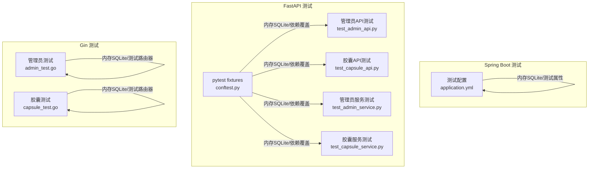
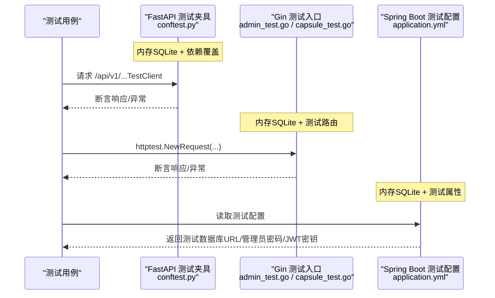
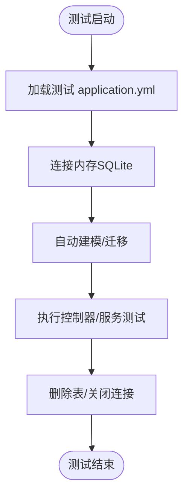
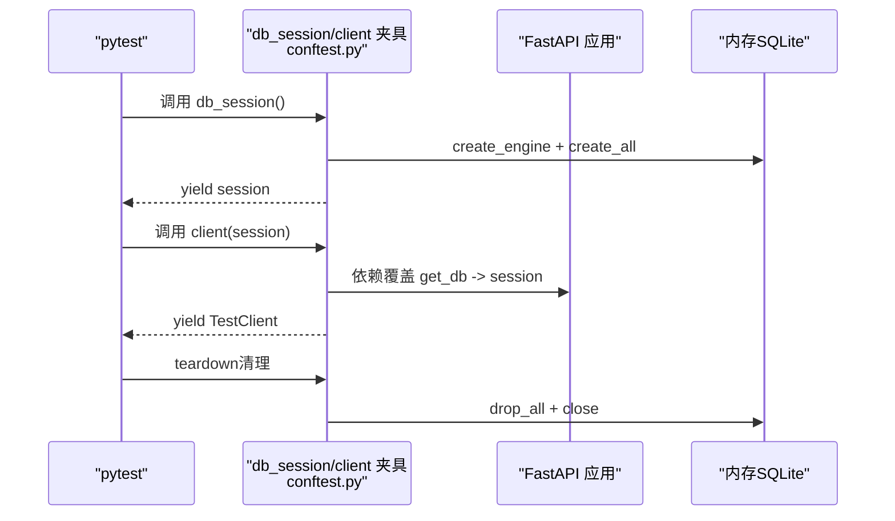
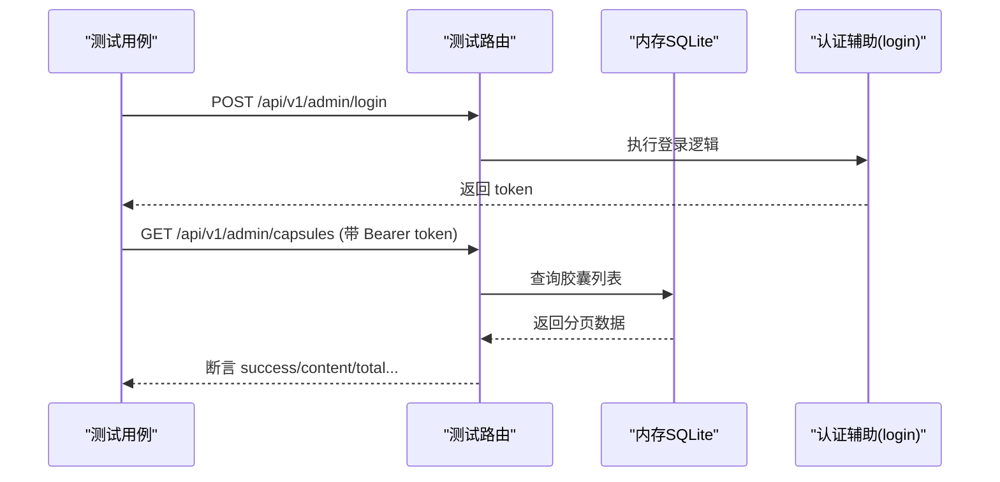
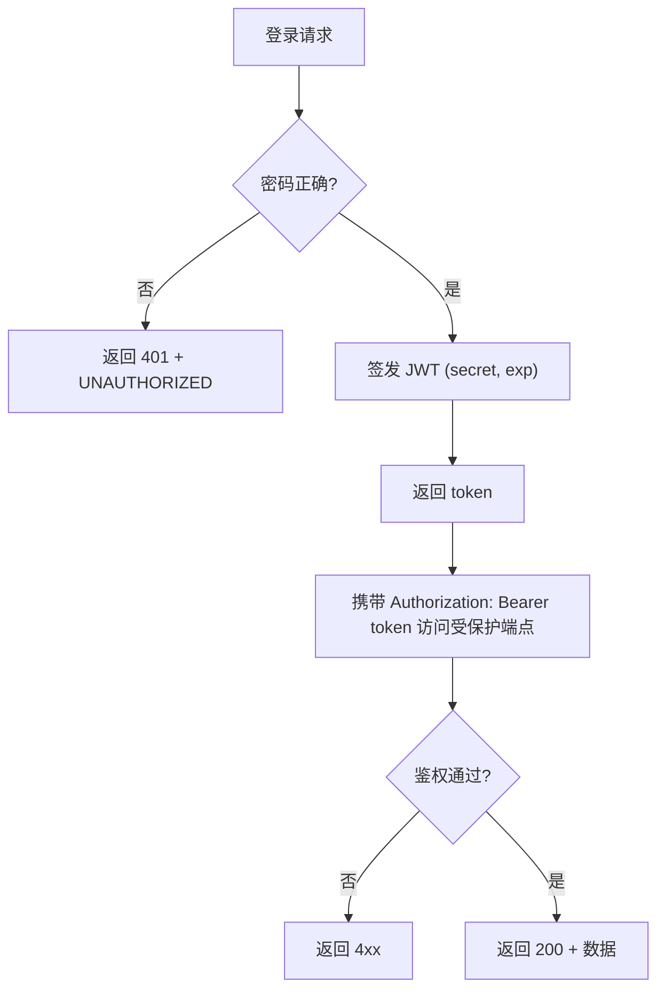
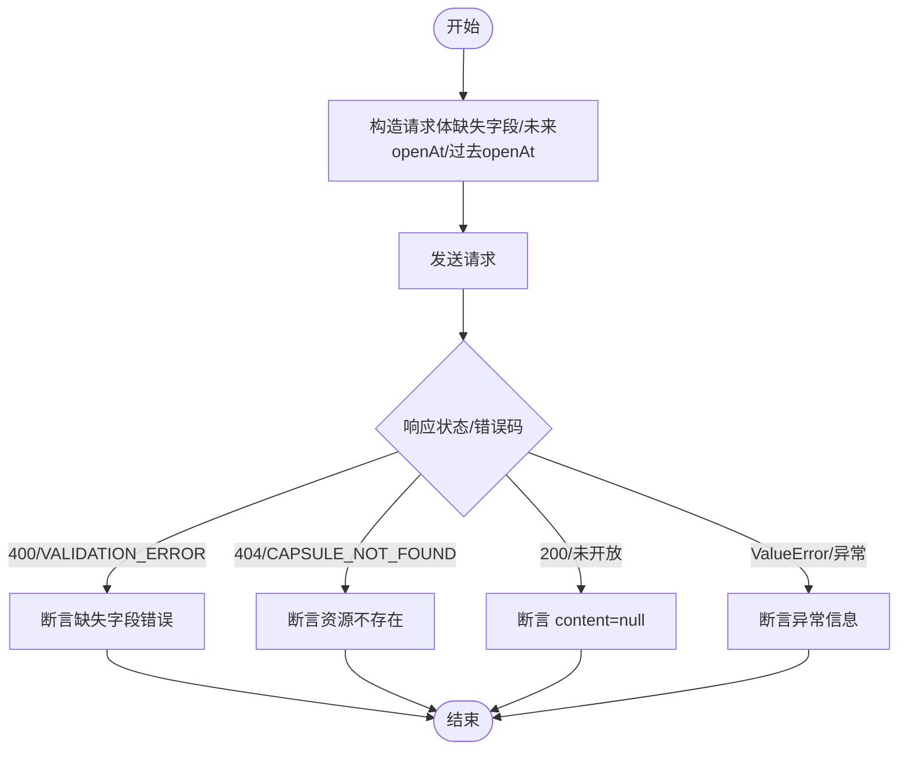
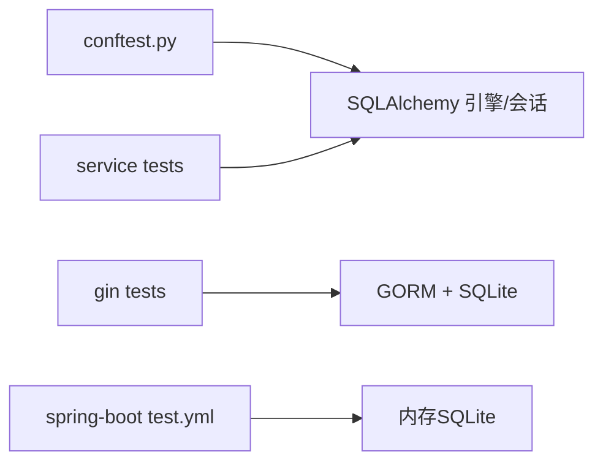

# 测试数据管理

<cite>
**本文引用的文件**
- [backends/spring-boot/src/test/resources/application.yml](file://backends/spring-boot/src/test/resources/application.yml)
- [backends/spring-boot/src/main/resources/application.yml](file://backends/spring-boot/src/main/resources/application.yml)
- [backends/fastapi/tests/conftest.py](file://backends/fastapi/tests/conftest.py)
- [backends/fastapi/tests/test_admin_api.py](file://backends/fastapi/tests/test_admin_api.py)
- [backends/fastapi/tests/test_capsule_api.py](file://backends/fastapi/tests/test_capsule_api.py)
- [backends/fastapi/tests/test_admin_service.py](file://backends/fastapi/tests/test_admin_service.py)
- [backends/fastapi/tests/test_capsule_service.py](file://backends/fastapi/tests/test_capsule_service.py)
- [backends/fastapi/app/config.py](file://backends/fastapi/app/config.py)
- [backends/fastapi/app/database.py](file://backends/fastapi/app/database.py)
- [backends/gin/tests/admin_test.go](file://backends/gin/tests/admin_test.go)
- [backends/gin/tests/capsule_test.go](file://backends/gin/tests/capsule_test.go)
- [backends/gin/config/config.go](file://backends/gin/config/config.go)
- [backends/gin/database/database.go](file://backends/gin/database/database.go)
- [backends/gin/main.go](file://backends/gin/main.go)
</cite>

## 目录
1. [引言](#引言)
2. [项目结构](#项目结构)
3. [核心组件](#核心组件)
4. [架构总览](#架构总览)
5. [详细组件分析](#详细组件分析)
6. [依赖分析](#依赖分析)
7. [性能考虑](#性能考虑)
8. [故障排查指南](#故障排查指南)
9. [结论](#结论)
10. [附录](#附录)

## 引言
本文件面向HelloTime项目的测试团队，系统化梳理三套后端（Spring Boot、FastAPI、Gin）在测试阶段的数据准备、组织与维护策略，覆盖以下关键主题：
- Spring Boot测试中的application.yml配置与测试数据库连接、测试属性设置
- FastAPI的pytest fixtures使用，包括数据库连接、测试数据初始化与测试清理机制
- Gin测试中的测试数据准备，包括模拟数据生成、数据库种子数据、测试环境隔离
- JWT token生成、用户权限模拟、异常场景数据准备的具体实现
- 测试数据版本控制、数据隐私保护、测试环境数据同步等最佳实践

## 项目结构
HelloTime采用多后端架构，测试数据管理在各后端以独立方式实现，但遵循统一的“内存数据库 + 测试客户端 + 明确的清理流程”的模式。

图表来源
- [backends/spring-boot/src/test/resources/application.yml:1-16](file://backends/spring-boot/src/test/resources/application.yml#L1-L16)
- [backends/fastapi/tests/conftest.py:1-47](file://backends/fastapi/tests/conftest.py#L1-L47)
- [backends/fastapi/tests/test_admin_api.py:1-77](file://backends/fastapi/tests/test_admin_api.py#L1-L77)
- [backends/fastapi/tests/test_capsule_api.py:1-69](file://backends/fastapi/tests/test_capsule_api.py#L1-L69)
- [backends/fastapi/tests/test_admin_service.py:1-30](file://backends/fastapi/tests/test_admin_service.py#L1-L30)
- [backends/fastapi/tests/test_capsule_service.py:1-89](file://backends/fastapi/tests/test_capsule_service.py#L1-L89)
- [backends/gin/tests/admin_test.go:1-181](file://backends/gin/tests/admin_test.go#L1-L181)
- [backends/gin/tests/capsule_test.go:1-194](file://backends/gin/tests/capsule_test.go#L1-L194)

章节来源
- [backends/spring-boot/src/test/resources/application.yml:1-16](file://backends/spring-boot/src/test/resources/application.yml#L1-L16)
- [backends/fastapi/tests/conftest.py:1-47](file://backends/fastapi/tests/conftest.py#L1-L47)
- [backends/gin/tests/admin_test.go:1-181](file://backends/gin/tests/admin_test.go#L1-L181)
- [backends/gin/tests/capsule_test.go:1-194](file://backends/gin/tests/capsule_test.go#L1-L194)

## 核心组件
- Spring Boot测试配置：使用内存SQLite作为测试数据库，自动建表/删表；通过测试专用属性覆盖管理员密码与JWT密钥。
- FastAPI测试夹具：使用内存SQLite引擎与静态连接池，创建/销毁表结构；通过依赖覆盖将真实数据库替换为测试会话；提供TestClient。
- Gin测试：在测试中直接构造内存数据库（共享缓存），迁移模型，构建测试路由；通过HTTP测试工具链发起请求并断言响应。
- JWT与权限模拟：三套后端均通过固定密钥生成短时JWT；测试中通过登录接口或手动构造令牌进行鉴权断言；对未开放胶囊隐藏内容的场景进行验证。
- 异常场景：缺失字段、不存在资源、未来开启时间等边界条件均有明确断言。

章节来源
- [backends/spring-boot/src/test/resources/application.yml:1-16](file://backends/spring-boot/src/test/resources/application.yml#L1-L16)
- [backends/fastapi/tests/conftest.py:16-47](file://backends/fastapi/tests/conftest.py#L16-L47)
- [backends/gin/tests/admin_test.go:14-28](file://backends/gin/tests/admin_test.go#L14-L28)
- [backends/gin/tests/capsule_test.go:21-38](file://backends/gin/tests/capsule_test.go#L21-L38)

## 架构总览
下图展示三套后端在测试阶段的“数据流”与“控制流”：测试夹具/测试入口负责初始化内存数据库与路由，测试用例通过HTTP客户端或服务层调用触发业务逻辑，断言结果与异常。

图表来源
- [backends/fastapi/tests/conftest.py:16-47](file://backends/fastapi/tests/conftest.py#L16-L47)
- [backends/gin/tests/admin_test.go:30-84](file://backends/gin/tests/admin_test.go#L30-L84)
- [backends/gin/tests/capsule_test.go:64-102](file://backends/gin/tests/capsule_test.go#L64-L102)
- [backends/spring-boot/src/test/resources/application.yml:1-16](file://backends/spring-boot/src/test/resources/application.yml#L1-L16)

## 详细组件分析

### Spring Boot 测试配置与数据准备
- 测试数据库连接
  - 使用内存SQLite，自动建模与回收，确保每次测试前后状态一致。
- 测试属性设置
  - 管理员密码与JWT密钥在测试配置中显式设定，便于统一鉴权与断言。
- 控制流
  - 测试运行时加载测试配置，创建/销毁内存数据库，避免影响生产数据。

图表来源
- [backends/spring-boot/src/test/resources/application.yml:1-16](file://backends/spring-boot/src/test/resources/application.yml#L1-L16)

章节来源
- [backends/spring-boot/src/test/resources/application.yml:1-16](file://backends/spring-boot/src/test/resources/application.yml#L1-L16)
- [backends/spring-boot/src/main/resources/application.yml:1-26](file://backends/spring-boot/src/main/resources/application.yml#L1-L26)

### FastAPI 测试夹具与数据生命周期
- 内存数据库与会话
  - 使用内存SQLite引擎与静态连接池，创建/销毁表结构，确保并发安全与一致性。
- 依赖覆盖
  - 将真实数据库依赖替换为测试会话，使API与服务层测试可完全隔离。
- 测试客户端
  - 提供TestClient，简化HTTP请求与响应断言。
- 数据生命周期
  - fixture在yield前创建表，在finally中关闭会话并删除表，确保测试间无污染。

图表来源
- [backends/fastapi/tests/conftest.py:16-47](file://backends/fastapi/tests/conftest.py#L16-L47)

章节来源
- [backends/fastapi/tests/conftest.py:16-47](file://backends/fastapi/tests/conftest.py#L16-L47)
- [backends/fastapi/app/config.py:8-18](file://backends/fastapi/app/config.py#L8-L18)
- [backends/fastapi/app/database.py:11-30](file://backends/fastapi/app/database.py#L11-L30)

### Gin 测试数据准备与环境隔离
- 内存数据库与路由
  - 在测试中使用共享缓存的内存SQLite，迁移模型并构建测试路由，确保隔离性。
- 登录与权限模拟
  - 通过登录接口获取token，随后在请求头中携带Authorization进行鉴权断言。
- 异常场景与边界条件
  - 对未开放胶囊隐藏内容、不存在资源、缺失字段等场景进行断言。
- 数据生成
  - 使用当前时间加未来日期生成测试胶囊，确保openAt在未来且符合ISO格式。

图表来源
- [backends/gin/tests/admin_test.go:14-28](file://backends/gin/tests/admin_test.go#L14-L28)
- [backends/gin/tests/admin_test.go:98-130](file://backends/gin/tests/admin_test.go#L98-L130)
- [backends/gin/tests/capsule_test.go:21-38](file://backends/gin/tests/capsule_test.go#L21-L38)

章节来源
- [backends/gin/tests/admin_test.go:30-181](file://backends/gin/tests/admin_test.go#L30-L181)
- [backends/gin/tests/capsule_test.go:64-194](file://backends/gin/tests/capsule_test.go#L64-L194)
- [backends/gin/config/config.go:31-43](file://backends/gin/config/config.go#L31-L43)
- [backends/gin/database/database.go:18-38](file://backends/gin/database/database.go#L18-L38)
- [backends/gin/main.go:15-31](file://backends/gin/main.go#L15-L31)

### JWT 令牌生成与权限模拟
- 密钥与过期时间
  - 各后端均支持从环境变量读取JWT密钥与过期时间，并提供默认值。
- 令牌生成
  - 通过登录接口返回token，或在测试中使用固定密钥生成短时令牌。
- 权限断言
  - 无token访问受保护端点应返回4xx；携带有效token应返回200并包含分页数据。
- 异常场景
  - 错误密码导致鉴权失败；无效token验证失败。

图表来源
- [backends/fastapi/tests/test_admin_api.py:13-30](file://backends/fastapi/tests/test_admin_api.py#L13-L30)
- [backends/fastapi/tests/test_admin_api.py:37-50](file://backends/fastapi/tests/test_admin_api.py#L37-L50)
- [backends/gin/tests/admin_test.go:30-84](file://backends/gin/tests/admin_test.go#L30-L84)
- [backends/gin/tests/admin_test.go:98-130](file://backends/gin/tests/admin_test.go#L98-L130)

章节来源
- [backends/fastapi/app/config.py:13-17](file://backends/fastapi/app/config.py#L13-L17)
- [backends/fastapi/tests/test_admin_api.py:7-10](file://backends/fastapi/tests/test_admin_api.py#L7-L10)
- [backends/gin/config/config.go:35-42](file://backends/gin/config/config.go#L35-L42)
- [backends/gin/tests/admin_test.go:14-28](file://backends/gin/tests/admin_test.go#L14-L28)

### 异常场景与边界条件数据准备
- 缺失字段
  - 仅提供部分必填字段，断言返回400与VALIDATION_ERROR。
- 不存在资源
  - 查询不存在的胶囊，断言返回404与CAPSULE_NOT_FOUND。
- 未开放胶囊
  - 创建未来开启时间的胶囊，访问时content应为null。
- 过去开启时间
  - 服务层对过去开启时间抛出异常，断言错误信息。

图表来源
- [backends/fastapi/tests/test_capsule_api.py:33-42](file://backends/fastapi/tests/test_capsule_api.py#L33-L42)
- [backends/fastapi/tests/test_capsule_api.py:44-51](file://backends/fastapi/tests/test_capsule_api.py#L44-L51)
- [backends/fastapi/tests/test_capsule_service.py:36-47](file://backends/fastapi/tests/test_capsule_service.py#L36-L47)
- [backends/gin/tests/capsule_test.go:104-129](file://backends/gin/tests/capsule_test.go#L104-L129)
- [backends/gin/tests/capsule_test.go:131-151](file://backends/gin/tests/capsule_test.go#L131-L151)

章节来源
- [backends/fastapi/tests/test_capsule_api.py:33-69](file://backends/fastapi/tests/test_capsule_api.py#L33-L69)
- [backends/fastapi/tests/test_capsule_service.py:36-89](file://backends/fastapi/tests/test_capsule_service.py#L36-L89)
- [backends/gin/tests/capsule_test.go:104-194](file://backends/gin/tests/capsule_test.go#L104-L194)

## 依赖分析
- FastAPI
  - 测试夹具依赖SQLAlchemy引擎与会话工厂，通过依赖覆盖实现数据库隔离。
  - 服务层测试直接依赖db_session，确保事务级隔离。
- Gin
  - 测试通过setupTestRouter在内存数据库上迁移模型并注册路由，避免外部依赖。
- Spring Boot
  - 测试配置独立于主配置，使用内存数据库与测试属性，避免污染生产数据。

图表来源
- [backends/fastapi/tests/conftest.py:16-47](file://backends/fastapi/tests/conftest.py#L16-L47)
- [backends/fastapi/tests/test_capsule_service.py:17-34](file://backends/fastapi/tests/test_capsule_service.py#L17-L34)
- [backends/gin/tests/capsule_test.go:21-38](file://backends/gin/tests/capsule_test.go#L21-L38)
- [backends/spring-boot/src/test/resources/application.yml:1-16](file://backends/spring-boot/src/test/resources/application.yml#L1-L16)

章节来源
- [backends/fastapi/tests/conftest.py:16-47](file://backends/fastapi/tests/conftest.py#L16-L47)
- [backends/gin/tests/capsule_test.go:21-38](file://backends/gin/tests/capsule_test.go#L21-L38)
- [backends/spring-boot/src/test/resources/application.yml:1-16](file://backends/spring-boot/src/test/resources/application.yml#L1-L16)

## 性能考虑
- 内存数据库
  - 使用内存SQLite显著提升测试速度，避免磁盘I/O开销。
- 连接池与并发
  - FastAPI使用静态连接池确保同一连接；Gin使用共享缓存内存数据库，减少连接竞争。
- 自动迁移成本
  - 每次测试前迁移模型带来一定开销，建议在单测中复用同一会话/连接，避免重复迁移。
- 建议
  - 对复杂集成测试可考虑使用更轻量的嵌入式数据库；对高并发场景可在测试中模拟并发写入以发现竞态问题。

## 故障排查指南
- 测试数据库连接失败
  - 检查内存数据库URL与驱动；确认测试配置是否正确加载。
- 依赖覆盖未生效
  - 确认TestClient或路由初始化顺序，确保在创建客户端前完成依赖覆盖。
- 令牌校验失败
  - 核对JWT密钥与过期时间；确保测试中使用的密钥与服务端一致。
- 未开放胶囊内容泄露
  - 确认服务层在未开放状态下对content置空的逻辑已在测试中覆盖。
- 清理不彻底
  - 确保fixture的finally块执行了drop_all与session.close；检查是否存在外部进程持有连接。

章节来源
- [backends/fastapi/tests/conftest.py:16-47](file://backends/fastapi/tests/conftest.py#L16-L47)
- [backends/gin/tests/admin_test.go:14-28](file://backends/gin/tests/admin_test.go#L14-L28)
- [backends/gin/tests/capsule_test.go:21-38](file://backends/gin/tests/capsule_test.go#L21-L38)

## 结论
HelloTime项目在三套后端中实现了统一的测试数据管理范式：以内存数据库为核心，结合依赖覆盖与严格的测试生命周期，确保测试的稳定性与可重复性。通过明确的JWT配置与权限模拟、完善的异常场景断言，以及清晰的测试夹具与路由初始化，测试团队可以高效地编写与维护高质量的测试用例。

## 附录

### 最佳实践清单
- 测试数据版本控制
  - 使用固定种子数据与明确的时间戳，避免随机性导致的不可重复测试。
- 数据隐私保护
  - 测试中不使用真实用户敏感信息；如需模拟，使用脱敏占位符。
- 测试环境数据同步
  - 保持测试配置与主配置分离；通过环境变量切换数据库路径与密钥。
- 可观测性
  - 在测试中记录关键断言与错误上下文，便于定位问题。
- 并发与隔离
  - 使用静态连接池或共享内存数据库，避免跨测试用例的副作用。