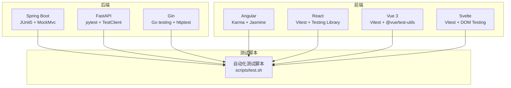
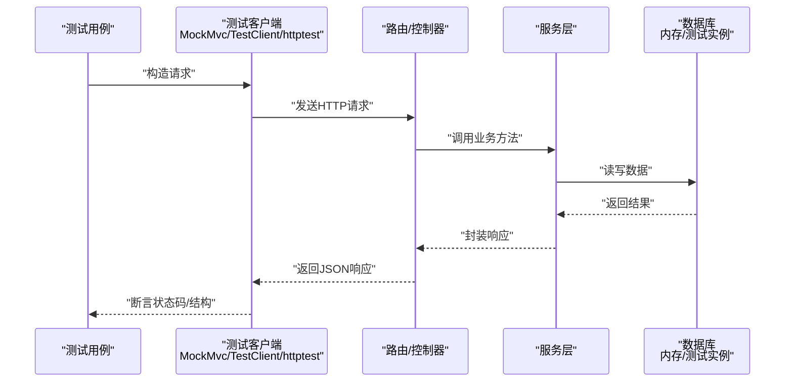
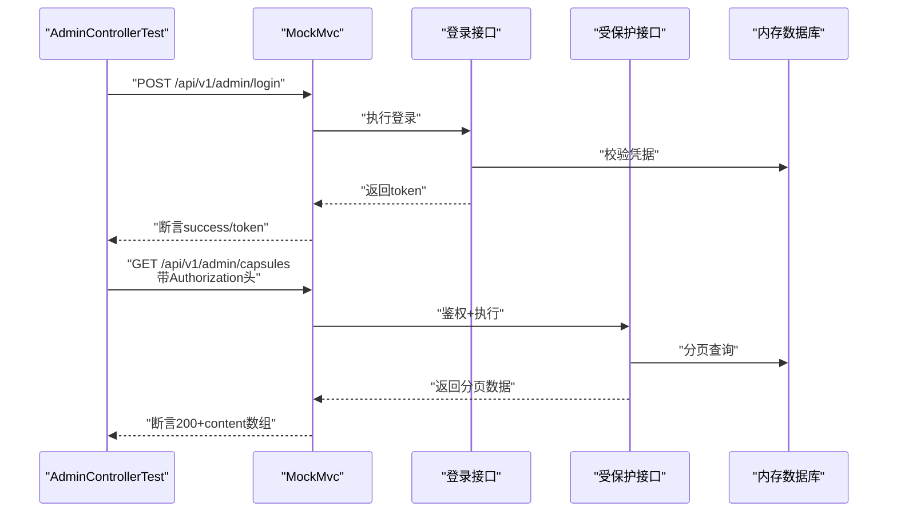
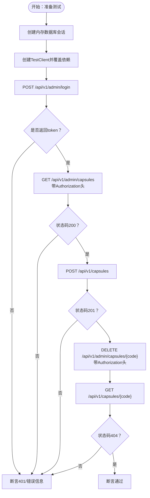
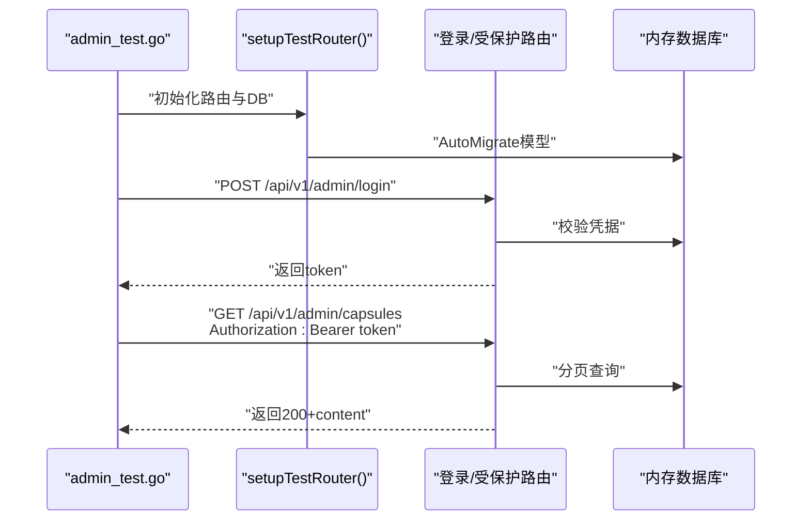
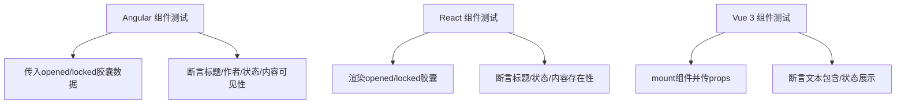
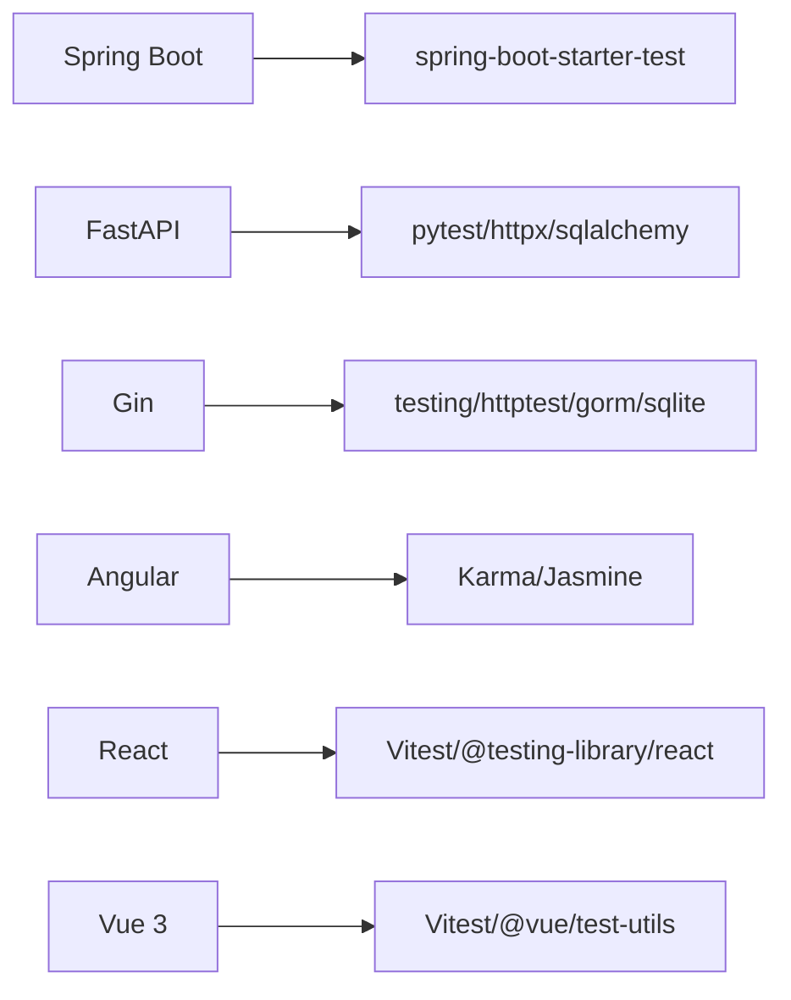

# 测试策略

<cite>
**本文引用的文件**
- [backends/fastapi/tests/conftest.py](file://backends/fastapi/tests/conftest.py)
- [backends/fastapi/tests/test_admin_api.py](file://backends/fastapi/tests/test_admin_api.py)
- [backends/fastapi/tests/test_capsule_api.py](file://backends/fastapi/tests/test_capsule_api.py)
- [backends/fastapi/requirements.txt](file://backends/fastapi/requirements.txt)
- [backends/gin/tests/admin_test.go](file://backends/gin/tests/admin_test.go)
- [backends/gin/tests/capsule_test.go](file://backends/gin/tests/capsule_test.go)
- [backends/gin/go.mod](file://backends/gin/go.mod)
- [backends/spring-boot/src/test/java/com/hellotime/controller/AdminControllerTest.java](file://backends/spring-boot/src/test/java/com/hellotime/controller/AdminControllerTest.java)
- [backends/spring-boot/src/test/java/com/hellotime/controller/CapsuleControllerTest.java](file://backends/spring-boot/src/test/java/com/hellotime/controller/CapsuleControllerTest.java)
- [backends/spring-boot/pom.xml](file://backends/spring-boot/pom.xml)
- [frontends/angular-ts/src/__tests__/components/capsule-card.component.spec.ts](file://frontends/angular-ts/src/__tests__/components/capsule-card.component.spec.ts)
- [frontends/react-ts/src/__tests__/components/CapsuleCard.test.tsx](file://frontends/react-ts/src/__tests__/components/CapsuleCard.test.tsx)
- [frontends/vue3-ts/src/__tests__/components/CapsuleCard.test.ts](file://frontends/vue3-ts/src/__tests__/components/CapsuleCard.test.ts)
- [scripts/test.sh](file://scripts/test.sh)
</cite>

## 目录
1. [引言](#引言)
2. [项目结构](#项目结构)
3. [核心组件](#核心组件)
4. [架构总览](#架构总览)
5. [详细组件分析](#详细组件分析)
6. [依赖分析](#依赖分析)
7. [性能考虑](#性能考虑)
8. [故障排查指南](#故障排查指南)
9. [结论](#结论)
10. [附录](#附录)

## 引言
本测试策略文档面向HelloTime项目的质量保证团队与开发者，系统化梳理后端（Spring Boot、FastAPI、Gin）与前端（Vue 3、React、Angular、Svelte）的测试体系与最佳实践。文档覆盖单元测试、集成测试与端到端测试的组织方式，明确JWT认证、API接口、数据库操作等关键场景的测试实现路径，并给出测试覆盖率建议、持续集成配置与自动化测试流程，帮助团队建立稳定高效的测试流水线。

## 项目结构
HelloTime采用多语言分层架构：后端提供REST API，前端以组件驱动渲染。测试按“后端语言+测试框架”与“前端框架+测试工具”两条主线组织，分别在各自目录下维护独立的测试套件与配置。

图表来源
- [scripts/test.sh:1-34](file://scripts/test.sh#L1-L34)

章节来源
- [scripts/test.sh:1-34](file://scripts/test.sh#L1-L34)

## 核心组件
- 后端测试框架与工具
  - Spring Boot：JUnit 5 + Spring Boot Test + MockMvc（事务回滚、自动装配）
  - FastAPI：pytest + SQLAlchemy 内存数据库 + TestClient
  - Gin：Go testing + httptest + GORM 内存数据库
- 前端测试工具与策略
  - Angular：Karma + Jasmine（组件单元测试）
  - React：Vitest + @testing-library/react（组件与Hook）
  - Vue 3：Vitest + @vue/test-utils（组件与组合式函数）
  - Svelte：Vitest + DOM Testing（基于DOM的组件测试）

章节来源
- [backends/spring-boot/pom.xml:74-79](file://backends/spring-boot/pom.xml#L74-L79)
- [backends/fastapi/requirements.txt:1-7](file://backends/fastapi/requirements.txt#L1-L7)
- [backends/gin/go.mod:1-46](file://backends/gin/go.mod#L1-L46)
- [frontends/angular-ts/src/__tests__/components/capsule-card.component.spec.ts:1-69](file://frontends/angular-ts/src/__tests__/components/capsule-card.component.spec.ts#L1-L69)
- [frontends/react-ts/src/__tests__/components/CapsuleCard.test.tsx:1-46](file://frontends/react-ts/src/__tests__/components/CapsuleCard.test.tsx#L1-L46)
- [frontends/vue3-ts/src/__tests__/components/CapsuleCard.test.ts:1-41](file://frontends/vue3-ts/src/__tests__/components/CapsuleCard.test.ts#L1-L41)

## 架构总览
以下序列图展示典型API测试流程：客户端请求经由后端路由进入业务层，最终落库或返回JSON响应；测试通过Mock或内存数据库验证行为与契约。

图表来源
- [backends/spring-boot/src/test/java/com/hellotime/controller/AdminControllerTest.java:35-44](file://backends/spring-boot/src/test/java/com/hellotime/controller/AdminControllerTest.java#L35-L44)
- [backends/fastapi/tests/test_admin_api.py:7-10](file://backends/fastapi/tests/test_admin_api.py#L7-L10)
- [backends/gin/tests/admin_test.go:14-28](file://backends/gin/tests/admin_test.go#L14-L28)

## 详细组件分析

### Spring Boot 测试策略
- 控制器测试
  - 使用 @SpringBootTest + @AutoConfigureMockMvc 注入MockMvc，结合 @Transactional 在测试后回滚，避免污染数据库。
  - 通过 MockMvc 的 perform(...) 验证状态码、JSON路径断言与响应体结构。
- JWT认证测试
  - 登录接口返回令牌后，后续受保护接口通过 Authorization 头携带 Bearer Token 访问。
  - 断言未携带或无效令牌时返回401/403。
- 数据库操作测试
  - 使用内存数据库（SQLite）与实体映射，确保测试隔离与可重复性。
  - 对创建、查询、删除等场景进行正反向断言。

图表来源
- [backends/spring-boot/src/test/java/com/hellotime/controller/AdminControllerTest.java:46-84](file://backends/spring-boot/src/test/java/com/hellotime/controller/AdminControllerTest.java#L46-L84)

章节来源
- [backends/spring-boot/src/test/java/com/hellotime/controller/AdminControllerTest.java:1-114](file://backends/spring-boot/src/test/java/com/hellotime/controller/AdminControllerTest.java#L1-L114)
- [backends/spring-boot/src/test/java/com/hellotime/controller/CapsuleControllerTest.java:1-99](file://backends/spring-boot/src/test/java/com/hellotime/controller/CapsuleControllerTest.java#L1-L99)
- [backends/spring-boot/pom.xml:20-23](file://backends/spring-boot/pom.xml#L20-L23)

### FastAPI 测试策略
- 测试客户端与依赖注入
  - 使用 SQLAlchemy 内存数据库（SQLite）与 StaticPool 保证连接一致性。
  - 通过依赖覆盖（dependency_overrides）将生产数据库替换为测试会话，确保测试隔离。
- API 行为验证
  - 健康检查返回200与UP状态。
  - 创建胶囊返回201，校验code长度、标题与消息。
  - 缺少字段返回400，错误码为VALIDATION_ERROR。
  - 未开启胶囊查询隐藏content，opened为false。
  - 管理员登录返回200+token；无token访问受保护接口返回4xx。
  - 受保护接口携带有效token返回200+分页数据；删除后再次查询返回404。

图表来源
- [backends/fastapi/tests/conftest.py:16-47](file://backends/fastapi/tests/conftest.py#L16-L47)
- [backends/fastapi/tests/test_admin_api.py:13-77](file://backends/fastapi/tests/test_admin_api.py#L13-L77)
- [backends/fastapi/tests/test_capsule_api.py:7-69](file://backends/fastapi/tests/test_capsule_api.py#L7-L69)

章节来源
- [backends/fastapi/tests/conftest.py:1-47](file://backends/fastapi/tests/conftest.py#L1-L47)
- [backends/fastapi/tests/test_admin_api.py:1-77](file://backends/fastapi/tests/test_admin_api.py#L1-L77)
- [backends/fastapi/tests/test_capsule_api.py:1-69](file://backends/fastapi/tests/test_capsule_api.py#L1-L69)
- [backends/fastapi/requirements.txt:1-7](file://backends/fastapi/requirements.txt#L1-L7)

### Gin 测试策略
- 内存数据库与路由初始化
  - 使用 GORM + SQLite 内存数据库，禁用日志静默模式，自动迁移模型。
  - 在测试中构建最小路由引擎并注册业务路由，确保与生产一致。
- 接口行为验证
  - 健康检查返回200与UP状态。
  - 创建胶囊返回201，校验code长度、标题与消息。
  - 缺少字段返回400，错误码为VALIDATION_ERROR。
  - 未开启胶囊查询隐藏content，opened为false。
  - 管理员登录返回200+token；无token访问受保护接口返回401。
  - 受保护接口携带有效token返回200+分页数据；删除后再次查询返回404。

图表来源
- [backends/gin/tests/admin_test.go:30-130](file://backends/gin/tests/admin_test.go#L30-L130)
- [backends/gin/tests/capsule_test.go:21-38](file://backends/gin/tests/capsule_test.go#L21-L38)

章节来源
- [backends/gin/tests/admin_test.go:1-181](file://backends/gin/tests/admin_test.go#L1-L181)
- [backends/gin/tests/capsule_test.go:1-194](file://backends/gin/tests/capsule_test.go#L1-L194)
- [backends/gin/go.mod:1-46](file://backends/gin/go.mod#L1-L46)

### 前端组件测试策略
- Angular 组件测试
  - 使用 TestBed 配置组件模块，传入真实类型对象，断言渲染文本与显示逻辑。
  - 针对已开启与未开启胶囊分别断言内容可见性与提示文案。
- React 组件测试
  - 使用 Vitest + @testing-library/react 渲染组件，断言标题、状态标签与内容存在性。
  - 针对锁定胶囊断言隐藏内容与提示文案。
- Vue 3 组件测试
  - 使用 Vitest + @vue/test-utils 挂载组件，断言文本包含关系与状态展示。
  - 针对锁定胶囊断言不包含内容且显示未到时间提示。

图表来源
- [frontends/angular-ts/src/__tests__/components/capsule-card.component.spec.ts:37-60](file://frontends/angular-ts/src/__tests__/components/capsule-card.component.spec.ts#L37-L60)
- [frontends/react-ts/src/__tests__/components/CapsuleCard.test.tsx:6-44](file://frontends/react-ts/src/__tests__/components/CapsuleCard.test.tsx#L6-L44)
- [frontends/vue3-ts/src/__tests__/components/CapsuleCard.test.ts:25-39](file://frontends/vue3-ts/src/__tests__/components/CapsuleCard.test.ts#L25-L39)

章节来源
- [frontends/angular-ts/src/__tests__/components/capsule-card.component.spec.ts:1-69](file://frontends/angular-ts/src/__tests__/components/capsule-card.component.spec.ts#L1-L69)
- [frontends/react-ts/src/__tests__/components/CapsuleCard.test.tsx:1-46](file://frontends/react-ts/src/__tests__/components/CapsuleCard.test.tsx#L1-L46)
- [frontends/vue3-ts/src/__tests__/components/CapsuleCard.test.ts:1-41](file://frontends/vue3-ts/src/__tests__/components/CapsuleCard.test.ts#L1-L41)

## 依赖分析
- 后端依赖与测试相关的关键项
  - Spring Boot：starter-test 提供测试依赖，MockMvc用于Web层测试。
  - FastAPI：pytest + httpx + SQLAlchemy用于接口与数据库测试。
  - Gin：testing + httptest + gorm/sqlite用于接口与数据库测试。
- 前端依赖与测试相关的关键项
  - Vitest + @testing-library/react 或 @vue/test-utils 作为测试运行器与工具集。
  - Angular使用Karma + Jasmine进行组件测试。

图表来源
- [backends/spring-boot/pom.xml:74-79](file://backends/spring-boot/pom.xml#L74-L79)
- [backends/fastapi/requirements.txt:1-7](file://backends/fastapi/requirements.txt#L1-L7)
- [backends/gin/go.mod:1-46](file://backends/gin/go.mod#L1-L46)

章节来源
- [backends/spring-boot/pom.xml:1-91](file://backends/spring-boot/pom.xml#L1-L91)
- [backends/fastapi/requirements.txt:1-7](file://backends/fastapi/requirements.txt#L1-L7)
- [backends/gin/go.mod:1-46](file://backends/gin/go.mod#L1-L46)

## 性能考虑
- 测试数据库选择
  - Spring Boot：使用内存数据库（SQLite）提升速度，配合事务回滚减少I/O。
  - FastAPI/Gin：使用内存SQLite + StaticPool，避免跨线程锁竞争。
- 测试并发与隔离
  - 使用独立会话/连接池配置，避免测试间共享状态导致竞态。
- 前端测试
  - Vitest默认并发执行，建议控制快照与渲染复杂度，必要时拆分大组件测试。
- 依赖加载
  - 将测试依赖与开发依赖分离，避免生产镜像包含测试代码。

## 故障排查指南
- Spring Boot
  - MockMvc断言失败：核对JSON路径表达式与响应体结构；确认事务注解与回滚机制生效。
  - JWT鉴权失败：检查Authorization头格式与令牌有效期；确认拦截器配置。
- FastAPI
  - TestClient依赖覆盖未生效：确认依赖覆盖在with TestClient上下文内设置并在退出后清理。
  - 内存数据库异常：检查StaticPool与会话关闭顺序，确保metadata drop在finally中执行。
- Gin
  - httptest路由未注册：确认setupTestRouter中路由注册与DB迁移顺序。
  - JSON解析失败：检查响应体结构与键名大小写。
- 前端
  - 组件渲染不一致：确认传入props与国际化/主题切换对渲染的影响。
  - 测试超时：适当增加等待时间或简化渲染逻辑。

章节来源
- [backends/spring-boot/src/test/java/com/hellotime/controller/AdminControllerTest.java:69-84](file://backends/spring-boot/src/test/java/com/hellotime/controller/AdminControllerTest.java#L69-L84)
- [backends/fastapi/tests/conftest.py:34-47](file://backends/fastapi/tests/conftest.py#L34-L47)
- [backends/gin/tests/admin_test.go:14-28](file://backends/gin/tests/admin_test.go#L14-L28)

## 结论
HelloTime的测试体系以“后端语言测试栈 + 前端框架测试栈”为核心，辅以统一的自动化脚本串联各子项目测试。通过内存数据库、Mock与依赖注入，确保测试隔离与稳定性；通过MockMvc/TestClient/httptest与Vitest/Karma等工具，覆盖API契约与组件行为。建议在CI中引入覆盖率统计与慢测试告警，持续优化测试效率与质量。

## 附录

### 测试覆盖率要求（建议）
- 后端API层：≥80%
- 业务服务层：≥70%
- 数据访问层：≥60%
- 前端组件：≥75%
- 关键交互流程（登录/创建/查看）：100%

### 持续集成与自动化
- 自动化脚本
  - 脚本顺序：Spring Boot → Vue 3 → Angular → 其他前端
  - 失败即停止，输出各子项目测试结果摘要
- CI建议
  - 并行执行不同语言测试，缩短总时长
  - 生成覆盖率报告并上传至平台
  - 对慢测试与失败重试策略进行监控

章节来源
- [scripts/test.sh:1-34](file://scripts/test.sh#L1-L34)