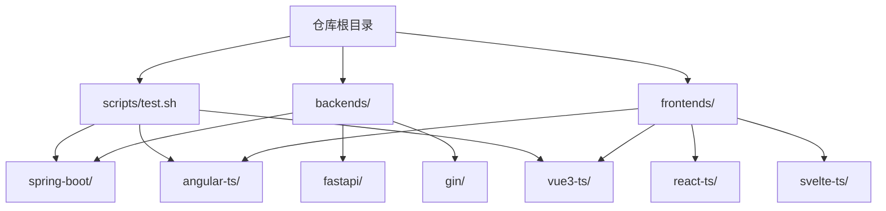
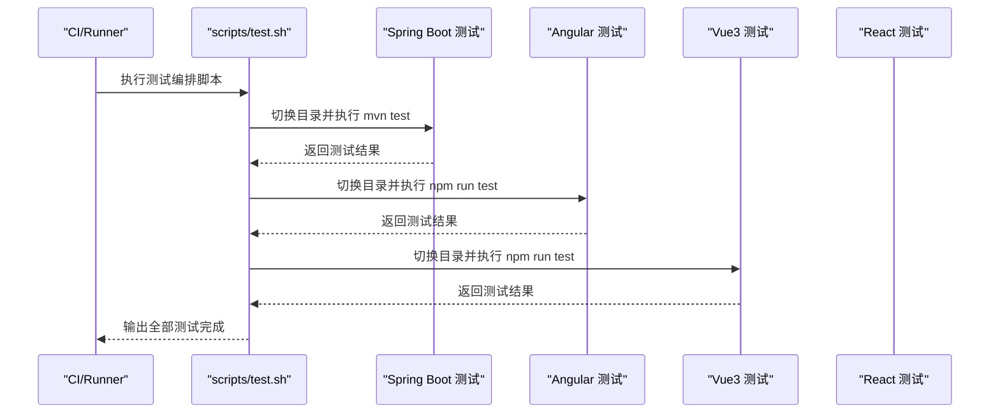
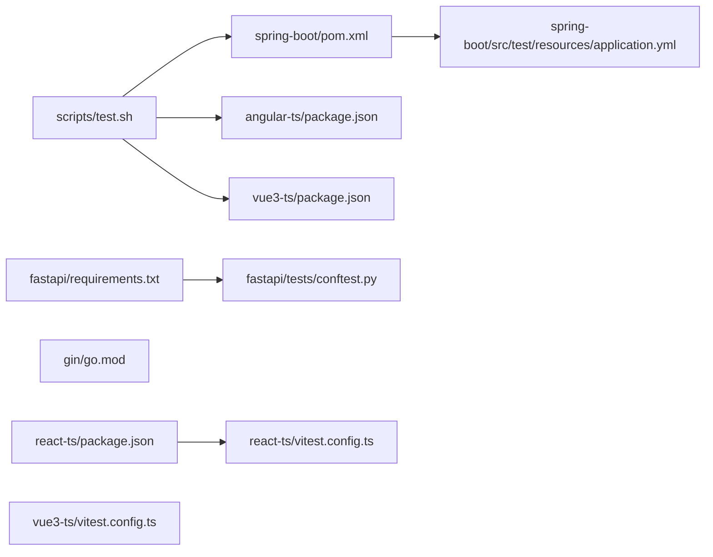
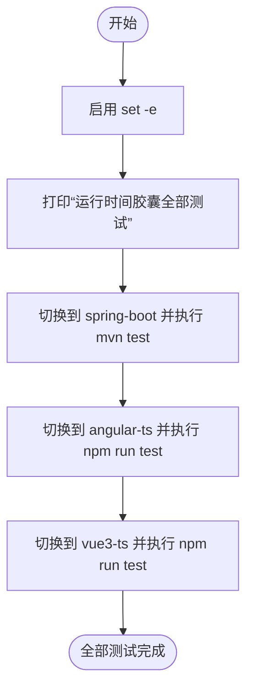

# 测试自动化

<cite>
**本文引用的文件**
- [scripts/test.sh](file://scripts/test.sh)
- [backends/fastapi/requirements.txt](file://backends/fastapi/requirements.txt)
- [backends/spring-boot/pom.xml](file://backends/spring-boot/pom.xml)
- [backends/spring-boot/src/test/resources/application.yml](file://backends/spring-boot/src/test/resources/application.yml)
- [backends/gin/go.mod](file://backends/gin/go.mod)
- [frontends/angular-ts/package.json](file://frontends/angular-ts/package.json)
- [frontends/react-ts/package.json](file://frontends/react-ts/package.json)
- [frontends/vue3-ts/package.json](file://frontends/vue3-ts/package.json)
- [frontends/svelte-ts/package.json](file://frontends/svelte-ts/package.json)
- [frontends/react-ts/vitest.config.ts](file://frontends/react-ts/vitest.config.ts)
- [frontends/vue3-ts/vitest.config.ts](file://frontends/vue3-ts/vitest.config.ts)
- [backends/fastapi/tests/conftest.py](file://backends/fastapi/tests/conftest.py)
- [spec/api/openapi.yaml](file://spec/api/openapi.yaml)
</cite>

## 目录
1. [简介](#简介)
2. [项目结构](#项目结构)
3. [核心组件](#核心组件)
4. [架构总览](#架构总览)
5. [详细组件分析](#详细组件分析)
6. [依赖关系分析](#依赖关系分析)
7. [性能考量](#性能考量)
8. [故障排查指南](#故障排查指南)
9. [结论](#结论)
10. [附录](#附录)

## 简介
本文件面向HelloTime项目的测试自动化与CI/CD集成，系统性梳理测试命令编排、并行执行策略、测试结果汇总、覆盖率与报告生成、失败重试机制、测试环境隔离与数据清理等最佳实践。文档同时覆盖后端（Spring Boot、FastAPI、Gin）与前端（Angular、React、Vue3、Svelte）的测试配置与运行方式，并给出可直接落地的实施建议。

## 项目结构
HelloTime采用多语言混合架构：后端提供三种实现（Spring Boot、FastAPI、Gin），前端提供四种实现（Angular、React、Vue3、Svelte）。测试体系围绕统一的顶层测试脚本进行编排，分别调用各子项目的测试命令。

图表来源
- [scripts/test.sh:1-34](file://scripts/test.sh#L1-L34)

章节来源
- [scripts/test.sh:1-34](file://scripts/test.sh#L1-L34)

## 核心组件
- 统一测试入口脚本：负责按顺序执行后端与前端测试，输出阶段化日志，最终汇总提示。
- 后端测试配置：
  - Spring Boot：Maven构建与测试插件，内存数据库与JPA配置，测试专用application.yml。
  - FastAPI：pytest与TestClient，内存SQLite与自定义fixture。
  - Gin：Go模块依赖，SQLite驱动与ORM。
- 前端测试配置：
  - Angular：Karma + Jasmine，无覆盖率配置示例。
  - React/Vue3：Vitest + happy-dom，支持别名与全局模式。
  - Svelte：仅提供构建与检查脚本，未包含测试配置。

章节来源
- [scripts/test.sh:11-33](file://scripts/test.sh#L11-L33)
- [backends/spring-boot/pom.xml:74-80](file://backends/spring-boot/pom.xml#L74-L80)
- [backends/spring-boot/src/test/resources/application.yml:1-16](file://backends/spring-boot/src/test/resources/application.yml#L1-L16)
- [backends/fastapi/requirements.txt:6-6](file://backends/fastapi/requirements.txt#L6-L6)
- [backends/fastapi/tests/conftest.py:16-47](file://backends/fastapi/tests/conftest.py#L16-L47)
- [backends/gin/go.mod:1-46](file://backends/gin/go.mod#L1-L46)
- [frontends/angular-ts/package.json:8-9](file://frontends/angular-ts/package.json#L8-L9)
- [frontends/react-ts/package.json:10-11](file://frontends/react-ts/package.json#L10-L11)
- [frontends/vue3-ts/package.json:10-11](file://frontends/vue3-ts/package.json#L10-L11)
- [frontends/react-ts/vitest.config.ts:1-18](file://frontends/react-ts/vitest.config.ts#L1-L18)
- [frontends/vue3-ts/vitest.config.ts:1-18](file://frontends/vue3-ts/vitest.config.ts#L1-L18)

## 架构总览
下图展示测试自动化在CI中的整体流程：由顶层脚本触发后端与前端测试，后端使用各自构建系统的测试目标，前端使用包管理器脚本或测试框架命令。

图表来源
- [scripts/test.sh:13-30](file://scripts/test.sh#L13-L30)
- [frontends/angular-ts/package.json:8-9](file://frontends/angular-ts/package.json#L8-L9)
- [frontends/vue3-ts/package.json:10-11](file://frontends/vue3-ts/package.json#L10-L11)

## 详细组件分析

### 后端测试：Spring Boot（Maven）
- 测试依赖与插件
  - 使用Spring Boot Starter Test作为测试依赖，确保测试运行时环境与断言工具可用。
  - Maven插件用于打包与启动，测试阶段由Maven生命周期触发。
- 内存数据库与JPA
  - 测试资源文件中配置SQLite内存数据库URL与方言，Hibernate DDL策略设置为建表/删表，确保每次测试前后自动清理。
  - 应用级配置包含JWT密钥与管理员密码，便于鉴权相关测试。
- 并行与失败处理
  - Maven默认串行执行测试套件；如需并行，可在插件参数中启用线程池与并行度（建议在CI中谨慎开启）。
  - set -e已在顶层脚本中启用，任一测试失败将导致脚本退出，避免后续阶段继续执行。

章节来源
- [backends/spring-boot/pom.xml:74-80](file://backends/spring-boot/pom.xml#L74-L80)
- [backends/spring-boot/src/test/resources/application.yml:1-16](file://backends/spring-boot/src/test/resources/application.yml#L1-L16)
- [scripts/test.sh:13-16](file://scripts/test.sh#L13-L16)

### 后端测试：FastAPI（pytest）
- 测试依赖
  - requirements中声明pytest，确保测试运行环境。
- 测试夹具与隔离
  - 使用内存SQLite与SQLAlchemy静态连接池，创建/销毁表，确保每个测试会话独立且无副作用。
  - 通过FastAPI依赖注入覆盖数据库会话，使TestClient指向内存数据库。
- 并行与失败处理
  - pytest默认串行执行；可通过参数启用并行（如pytest-xdist），但需注意共享资源与并发写入问题。
  - set -e确保任一测试失败即终止。

章节来源
- [backends/fastapi/requirements.txt:6-6](file://backends/fastapi/requirements.txt#L6-L6)
- [backends/fastapi/tests/conftest.py:16-47](file://backends/fastapi/tests/conftest.py#L16-L47)
- [scripts/test.sh:13-16](file://scripts/test.sh#L13-L16)

### 后端测试：Gin（Go）
- 模块与依赖
  - go.mod声明Gin、JWT与GORM SQLite驱动，满足HTTP路由、鉴权与ORM需求。
- 测试建议
  - 可使用标准库testing包或testify等第三方库编写单元测试；结合内存SQLite进行集成测试。
  - 建议在CI中为不同Go版本矩阵执行测试，提升兼容性。

章节来源
- [backends/gin/go.mod:1-46](file://backends/gin/go.mod#L1-L46)

### 前端测试：Angular（Karma + Jasmine）
- 测试命令
  - npm脚本提供headless Chrome运行测试，适合CI环境。
- 覆盖率与报告
  - 当前package.json未包含karma-coverage插件与配置；如需覆盖率与HTML报告，需补充相应插件与配置文件。
- 并行与失败处理
  - Karma默认串行；可配置浏览器并行与重试次数以提升稳定性。

章节来源
- [frontends/angular-ts/package.json:8-9](file://frontends/angular-ts/package.json#L8-L9)

### 前端测试：React（Vitest + happy-dom）
- 配置与别名
  - vitest.config.ts启用happy-dom环境与全局模式，路径别名@与@spec便于组织测试代码。
- 覆盖率与报告
  - 当前未启用覆盖率与报告生成；可在vitest配置中添加coverage与reporter选项，生成HTML与JSON报告。
- 并行与失败处理
  - Vitest支持并行执行与失败重试；建议在CI中开启并限制并发度，避免资源争用。

章节来源
- [frontends/react-ts/vitest.config.ts:1-18](file://frontends/react-ts/vitest.config.ts#L1-L18)
- [frontends/react-ts/package.json:10-11](file://frontends/react-ts/package.json#L10-L11)

### 前端测试：Vue3（Vitest + happy-dom）
- 配置与别名
  - 与React类似，启用happy-dom与全局模式，路径别名@与@spec。
- 覆盖率与报告
  - 当前未启用覆盖率与报告生成；可在vitest配置中添加coverage与reporter选项。
- 并行与失败处理
  - 建议在CI中开启并行与重试，提升吞吐量与稳定性。

章节来源
- [frontends/vue3-ts/vitest.config.ts:1-18](file://frontends/vue3-ts/vitest.config.ts#L1-L18)
- [frontends/vue3-ts/package.json:10-11](file://frontends/vue3-ts/package.json#L10-L11)

### 前端测试：Svelte（Vite）
- 测试现状
  - 当前仅提供构建与类型检查脚本，未包含测试配置；如需测试，建议引入Vitest或Jest生态。
- 实施建议
  - 引入Vitest并配置happy-dom环境，复用现有路径别名与TS配置。

章节来源
- [frontends/svelte-ts/package.json:6-11](file://frontends/svelte-ts/package.json#L6-L11)

### API规范与测试关联
- OpenAPI规范
  - openapi.yaml定义了健康检查、胶囊增删查改、管理员登录等接口，是后端测试用例设计的重要依据。
- 测试用例映射
  - 建议基于OpenAPI路径与响应模型编写端到端测试，覆盖成功、失败与边界场景。

章节来源
- [spec/api/openapi.yaml:10-164](file://spec/api/openapi.yaml#L10-L164)

## 依赖关系分析
- 后端依赖
  - Spring Boot：内存数据库与JPA配置，确保测试隔离与快速回滚。
  - FastAPI：pytest与TestClient，内存SQLite与自定义fixture。
  - Gin：Gin + GORM + SQLite驱动，满足HTTP与持久化需求。
- 前端依赖
  - Angular：Karma + Jasmine；React/Vue3：Vitest + happy-dom；Svelte：缺少测试配置。
- 顶层脚本耦合
  - scripts/test.sh对各子项目目录与命令有强依赖，修改子项目测试命令需同步更新脚本。

图表来源
- [scripts/test.sh:13-30](file://scripts/test.sh#L13-L30)
- [backends/spring-boot/pom.xml:74-80](file://backends/spring-boot/pom.xml#L74-L80)
- [backends/spring-boot/src/test/resources/application.yml:1-16](file://backends/spring-boot/src/test/resources/application.yml#L1-L16)
- [backends/fastapi/requirements.txt:6-6](file://backends/fastapi/requirements.txt#L6-L6)
- [backends/fastapi/tests/conftest.py:16-47](file://backends/fastapi/tests/conftest.py#L16-L47)
- [backends/gin/go.mod:1-46](file://backends/gin/go.mod#L1-L46)
- [frontends/react-ts/package.json:10-11](file://frontends/react-ts/package.json#L10-L11)
- [frontends/react-ts/vitest.config.ts:1-18](file://frontends/react-ts/vitest.config.ts#L1-L18)
- [frontends/vue3-ts/package.json:10-11](file://frontends/vue3-ts/package.json#L10-L11)
- [frontends/vue3-ts/vitest.config.ts:1-18](file://frontends/vue3-ts/vitest.config.ts#L1-L18)

## 性能考量
- 并行策略
  - 后端：Maven测试插件可配置并行度；pytest可使用xargs或分布式执行；Gin测试建议分包并行。
  - 前端：Vitest支持并行与失败重试；Angular Karma可配置多浏览器实例并行。
- 资源隔离
  - 内存数据库与临时文件目录，避免磁盘IO与锁竞争。
- 缓存与加速
  - Maven/Gradle/Go/NPM缓存命中率直接影响CI速度；合理配置缓存键与失效策略。
- 报告与覆盖率
  - 在CI中生成HTML与JSON报告，便于回溯与趋势分析；覆盖率阈值可作为质量门禁。

## 故障排查指南
- 顶层脚本失败
  - set -e已启用，任一子项目测试失败将导致脚本退出；检查对应子项目测试命令与依赖安装。
- 内存数据库异常
  - Spring Boot：确认内存数据库URL与方言配置一致；Hibernate DDL策略是否正确。
  - FastAPI：确认fixture创建/销毁流程完整，避免跨测试会话污染。
- 前端测试环境
  - Vitest：确认happy-dom环境与路径别名配置；如出现DOM相关错误，检查环境初始化。
  - Angular：确认Karma与Chrome Headless可用；如覆盖率缺失，补充karma-coverage配置。
- API一致性
  - 对照OpenAPI规范核对测试用例路径、请求体与响应模型，避免因接口变更导致的误报。

章节来源
- [scripts/test.sh:4-4](file://scripts/test.sh#L4-L4)
- [backends/spring-boot/src/test/resources/application.yml:1-16](file://backends/spring-boot/src/test/resources/application.yml#L1-L16)
- [backends/fastapi/tests/conftest.py:16-47](file://backends/fastapi/tests/conftest.py#L16-L47)
- [frontends/react-ts/vitest.config.ts:13-16](file://frontends/react-ts/vitest.config.ts#L13-L16)
- [frontends/vue3-ts/vitest.config.ts:13-16](file://frontends/vue3-ts/vitest.config.ts#L13-L16)
- [spec/api/openapi.yaml:10-164](file://spec/api/openapi.yaml#L10-L164)

## 结论
HelloTime的测试自动化以统一脚本为核心，串联后端与前端测试。当前后端与前端均具备基础测试能力，但覆盖率与报告生成尚未在所有子项目中启用。建议在各子项目中补齐覆盖率与报告配置，完善失败重试与并行策略，建立测试环境隔离与数据清理机制，形成可审计、可观测、可扩展的测试自动化体系。

## 附录

### 测试命令编排与执行流程（脚本解析）

图表来源
- [scripts/test.sh:1-34](file://scripts/test.sh#L1-L34)

### 各后端框架测试任务定义要点
- Spring Boot（Maven）
  - 依赖：spring-boot-starter-test
  - 配置：内存数据库URL、方言、DDL策略
  - 命令：mvn test
- FastAPI（pytest）
  - 依赖：pytest
  - 配置：内存SQLite、自定义fixture
  - 命令：pytest（由脚本间接通过子项目测试命令触发）
- Gin（Go）
  - 依赖：gin、gorm、jwt
  - 建议：使用testing包或testify，结合内存SQLite

章节来源
- [backends/spring-boot/pom.xml:74-80](file://backends/spring-boot/pom.xml#L74-L80)
- [backends/spring-boot/src/test/resources/application.yml:1-16](file://backends/spring-boot/src/test/resources/application.yml#L1-L16)
- [backends/fastapi/requirements.txt:6-6](file://backends/fastapi/requirements.txt#L6-L6)
- [backends/fastapi/tests/conftest.py:16-47](file://backends/fastapi/tests/conftest.py#L16-L47)
- [backends/gin/go.mod:1-46](file://backends/gin/go.mod#L1-L46)

### 前端框架测试配置要点
- Angular
  - 命令：npm run test（headless Chrome）
  - 建议：补充karma-coverage与报告生成
- React
  - 命令：npm run test（Vitest）
  - 建议：启用coverage与reporter
- Vue3
  - 命令：npm run test（Vitest）
  - 建议：启用coverage与reporter
- Svelte
  - 现状：缺少测试配置
  - 建议：引入Vitest并配置happy-dom

章节来源
- [frontends/angular-ts/package.json:8-9](file://frontends/angular-ts/package.json#L8-L9)
- [frontends/react-ts/package.json:10-11](file://frontends/react-ts/package.json#L10-L11)
- [frontends/vue3-ts/package.json:10-11](file://frontends/vue3-ts/package.json#L10-L11)
- [frontends/svelte-ts/package.json:6-11](file://frontends/svelte-ts/package.json#L6-L11)
- [frontends/react-ts/vitest.config.ts:13-16](file://frontends/react-ts/vitest.config.ts#L13-L16)
- [frontends/vue3-ts/vitest.config.ts:13-16](file://frontends/vue3-ts/vitest.config.ts#L13-L16)

### 测试覆盖率、报告与失败重试方案
- 覆盖率
  - React/Vue3：在vitest配置中启用coverage并指定报告格式（如html、json-summary）。
  - Angular：在karma配置中引入karma-coverage并设置报告输出目录。
- 报告
  - 建议生成HTML与JSON报告，便于CI可视化与质量门禁。
- 失败重试
  - Vitest：使用retry选项；Karma：使用karma-retry插件。
- 并行
  - 后端：Maven、pytest、Go均可配置并行；前端：Vitest/Karma支持并行。
- 环境隔离与数据清理
  - 内存数据库（SQLite内存）+ DDL策略（create-drop）+ fixture清理，确保测试间无污染。

章节来源
- [frontends/react-ts/vitest.config.ts:13-16](file://frontends/react-ts/vitest.config.ts#L13-L16)
- [frontends/vue3-ts/vitest.config.ts:13-16](file://frontends/vue3-ts/vitest.config.ts#L13-L16)
- [backends/spring-boot/src/test/resources/application.yml:5-8](file://backends/spring-boot/src/test/resources/application.yml#L5-L8)
- [backends/fastapi/tests/conftest.py:16-31](file://backends/fastapi/tests/conftest.py#L16-L31)

### 持续集成流水线建议
- 触发条件
  - Pull Request与主分支推送触发全量测试；单文件修改可触发针对性测试。
- 步骤建议
  - 安装依赖（Maven/Go/NPM缓存）、数据库准备、执行scripts/test.sh、收集覆盖率与报告、上传Artifacts。
- 并发与重试
  - 将Angular与前端测试并行执行；为易抖动的测试增加重试次数。
- 质量门禁
  - 设置覆盖率阈值与失败重试上限；报告可视化与趋势分析。