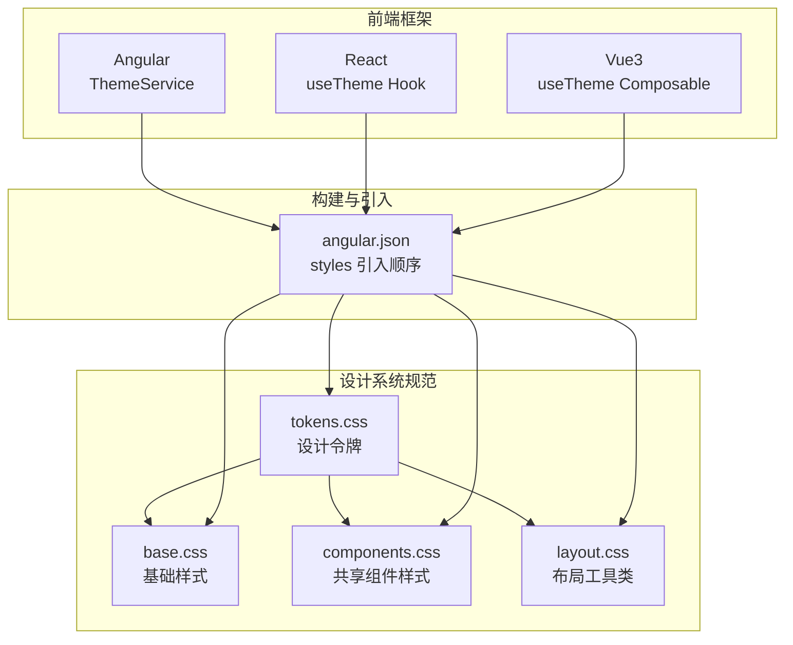
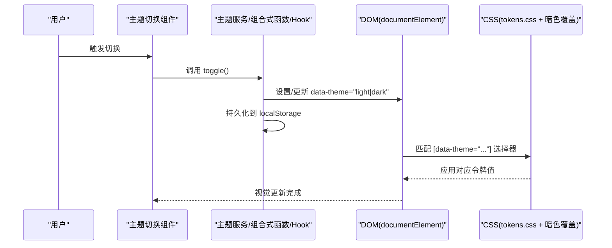
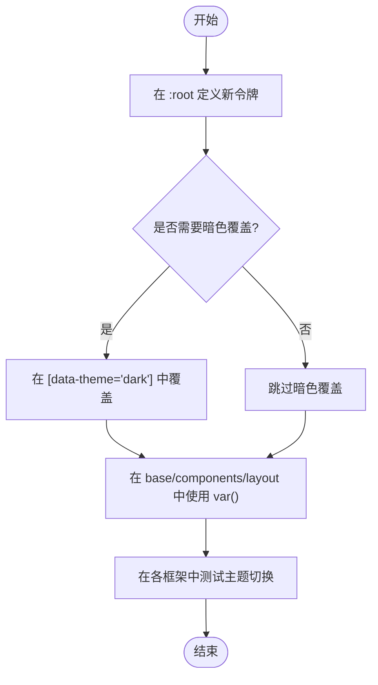
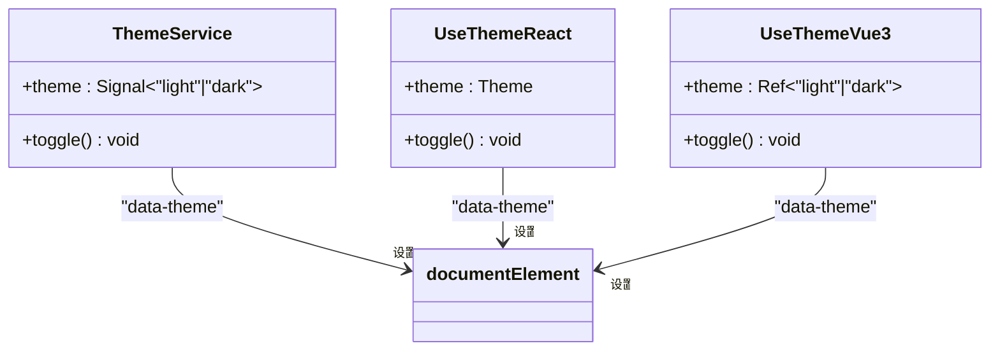
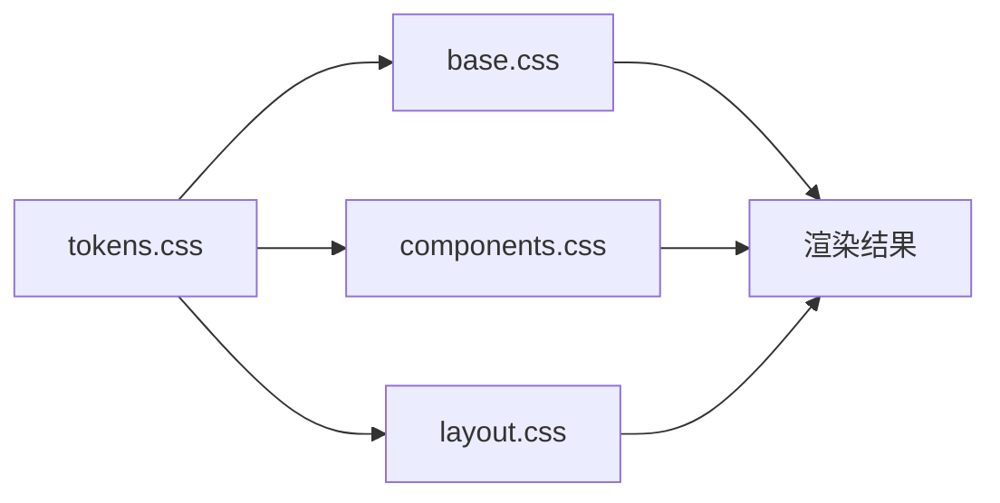
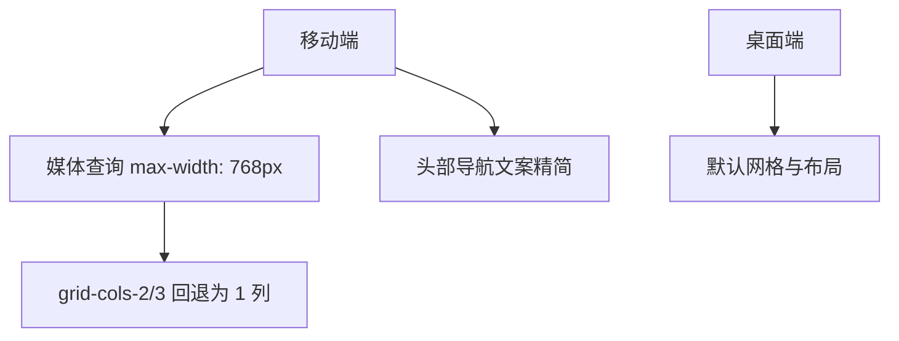
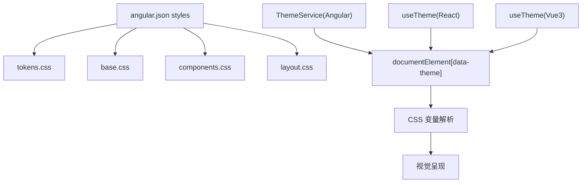
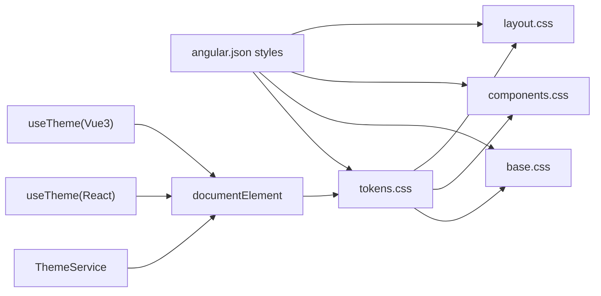

# 设计系统

<cite>
**本文引用的文件**
- [design-tokens.md](file://docs/design-tokens.md)
- [tokens.css](file://spec/styles/tokens.css)
- [base.css](file://spec/styles/base.css)
- [components.css](file://spec/styles/components.css)
- [layout.css](file://spec/styles/layout.css)
- [angular.json](file://frontends/angular-ts/angular.json)
- [theme.service.ts](file://frontends/angular-ts/src/app/services/theme.service.ts)
- [useTheme.ts (React)](file://frontends/react-ts/src/hooks/useTheme.ts)
- [useTheme.ts (Vue3)](file://frontends/vue3-ts/src/composables/useTheme.ts)
- [capsule-card.component.css (Angular)](file://frontends/angular-ts/src/app/components/capsule-card/capsule-card.component.css)
- [CapsuleCard.module.css (React)](file://frontends/react-ts/src/components/CapsuleCard.module.css)
- [CapsuleCard.vue (Vue3)](file://frontends/vue3-ts/src/components/CapsuleCard.vue)
- [admin-login.component.css (Angular)](file://frontends/angular-ts/src/app/components/admin-login/admin-login.component.css)
- [app-header.component.css (Angular)](file://frontends/angular-ts/src/app/components/app-header/app-header.component.css)
- [app-footer.component.css (Angular)](file://frontends/angular-ts/src/app/components/app-footer/app-footer.component.css)
</cite>

## 目录
1. [简介](#简介)
2. [项目结构](#项目结构)
3. [核心组件](#核心组件)
4. [架构总览](#架构总览)
5. [详细组件分析](#详细组件分析)
6. [依赖关系分析](#依赖关系分析)
7. [性能考量](#性能考量)
8. [故障排查指南](#故障排查指南)
9. [结论](#结论)
10. [附录](#附录)

## 简介
本设计系统以“设计令牌”为核心，通过 CSS 自定义属性统一颜色、排版、间距、圆角、阴影、过渡与布局等视觉变量，配合暗色模式选择器实现主题切换。样式文件按“令牌 → 基础 → 组件 → 布局”的层次组织，前端框架通过服务或组合式函数/Hook 管理主题状态并在 DOM 上设置 data-theme 属性，从而驱动 CSS 变量生效。该体系既保证了多框架一致性，又便于扩展与维护。

## 项目结构
设计系统相关资源集中在 spec/styles 下，由 Angular 构建配置集中引入；前端框架通过各自的主题服务/组合式函数/Hook 与令牌系统联动。

**图表来源**
- [angular.json:39-45](file://frontends/angular-ts/angular.json#L39-L45)
- [tokens.css:1-104](file://spec/styles/tokens.css#L1-L104)
- [base.css:1-67](file://spec/styles/base.css#L1-L67)
- [components.css:1-207](file://spec/styles/components.css#L1-L207)
- [layout.css:1-103](file://spec/styles/layout.css#L1-L103)

**章节来源**
- [angular.json:39-45](file://frontends/angular-ts/angular.json#L39-L45)
- [design-tokens.md:83-91](file://docs/design-tokens.md#L83-L91)

## 核心组件
- 设计令牌(tokens.css)
  - 颜色：主色、背景、文字、边框、状态色等，支持亮/暗两套映射
  - 排版：字体族、字号、行高、字重
  - 间距：以 4px 为基准的 space-1 到 space-16
  - 圆角：sm/md/lg/xl/full
  - 阴影：sm/md/lg
  - 过渡：fast/base/slow
  - 布局：最大宽度、头部高度等
  - 暗色模式：通过 [data-theme="dark"] 覆盖关键令牌
- 基础样式(base.css)
  - 重置与全局排版、链接、表单控件继承、选择器配色
- 组件样式(components.css)
  - 按钮、输入、卡片、徽标、对话框、表格等共享组件
- 布局样式(layout.css)
  - 容器、Flex/Grid 工具类、文本与显示控制、页面布局、移动端断点

**章节来源**
- [tokens.css:1-104](file://spec/styles/tokens.css#L1-L104)
- [base.css:1-67](file://spec/styles/base.css#L1-L67)
- [components.css:1-207](file://spec/styles/components.css#L1-L207)
- [layout.css:1-103](file://spec/styles/layout.css#L1-L103)
- [design-tokens.md:9-91](file://docs/design-tokens.md#L9-L91)

## 架构总览
设计系统通过“令牌 → 样式 → 主题服务/组合式函数”的链路实现主题切换与跨框架一致性。

**图表来源**
- [theme.service.ts:16-26](file://frontends/angular-ts/src/app/services/theme.service.ts#L16-L26)
- [useTheme.ts (React):14-37](file://frontends/react-ts/src/hooks/useTheme.ts#L14-L37)
- [useTheme.ts (Vue3):20-38](file://frontends/vue3-ts/src/composables/useTheme.ts#L20-L38)
- [tokens.css:82-103](file://spec/styles/tokens.css#L82-L103)

## 详细组件分析

### 设计令牌系统
- 结构与职责
  - 令牌集中于 :root，提供默认亮色值
  - [data-theme="dark"] 覆盖关键令牌，实现暗色主题
  - 令牌命名遵循语义化，如 color、text、space、radius、shadow、transition、max-width 等
- 使用方式
  - 基础样式与组件样式通过 var(--token-name) 引用
  - 暗色模式通过在 <html> 上设置 data-theme 属性触发
- 扩展建议
  - 新增令牌时先在 :root 定义默认值，再在暗色覆盖中补充
  - 保持命名一致性，避免硬编码颜色与尺寸

**图表来源**
- [tokens.css:2-80](file://spec/styles/tokens.css#L2-L80)
- [tokens.css:82-103](file://spec/styles/tokens.css#L82-L103)

**章节来源**
- [tokens.css:1-104](file://spec/styles/tokens.css#L1-L104)
- [design-tokens.md:76-82](file://docs/design-tokens.md#L76-L82)

### 主题切换服务与实现
- Angular
  - ThemeService 使用 signal 与 effect，监听主题信号并写入 documentElement 的 data-theme，同时持久化到 localStorage
- React
  - useTheme Hook 使用 useSyncExternalStore 管理模块级主题状态，提供 toggle 方法，内部通过 applyTheme 设置 data-theme 并持久化
- Vue3
  - useTheme Composable 使用 ref 与 watchEffect，初始化时应用主题，变更时自动写入 DOM 并持久化

**图表来源**
- [theme.service.ts:10-26](file://frontends/angular-ts/src/app/services/theme.service.ts#L10-L26)
- [useTheme.ts (React):39-47](file://frontends/react-ts/src/hooks/useTheme.ts#L39-L47)
- [useTheme.ts (Vue3):46-56](file://frontends/vue3-ts/src/composables/useTheme.ts#L46-L56)

**章节来源**
- [theme.service.ts:1-28](file://frontends/angular-ts/src/app/services/theme.service.ts#L1-L28)
- [useTheme.ts (React):1-48](file://frontends/react-ts/src/hooks/useTheme.ts#L1-L48)
- [useTheme.ts (Vue3):1-57](file://frontends/vue3-ts/src/composables/useTheme.ts#L1-L57)

### 基础样式、组件样式与布局样式
- 基础样式
  - 统一重置、全局排版、链接与选择器配色、表单控件继承
- 组件样式
  - 按钮、输入、卡片、徽标、对话框、表格等，均通过 var() 引用令牌
- 布局样式
  - 容器、Flex/Grid 工具类、文本与显示控制、页面布局、移动端断点

**图表来源**
- [base.css:15-23](file://spec/styles/base.css#L15-L23)
- [components.css:4-64](file://spec/styles/components.css#L4-L64)
- [layout.css:3-8](file://spec/styles/layout.css#L3-L8)

**章节来源**
- [base.css:1-67](file://spec/styles/base.css#L1-L67)
- [components.css:1-207](file://spec/styles/components.css#L1-L207)
- [layout.css:1-103](file://spec/styles/layout.css#L1-L103)

### 响应式设计策略
- 断点与网格
  - 移动优先：在小屏默认布局，大屏增强
  - 媒体查询在 layout.css 中针对 768px 进行网格列数回退
- 移动端适配
  - 头部导航在更窄屏幕下隐藏部分文案，减少信息密度
- 间距与排版
  - 使用 space-* 与 text-* 令牌保证在不同视口下的比例一致

**图表来源**
- [layout.css:96-102](file://spec/styles/layout.css#L96-L102)
- [app-header.component.css:60-65](file://frontends/angular-ts/src/app/components/app-header/app-header.component.css#L60-L65)

**章节来源**
- [layout.css:96-102](file://spec/styles/layout.css#L96-L102)
- [app-header.component.css:60-65](file://frontends/angular-ts/src/app/components/app-header/app-header.component.css#L60-L65)

### 在不同前端框架中复用设计系统
- 样式导入
  - Angular 通过 angular.json 的 styles 数组引入 tokens/base/components/layout
- 主题变量传递
  - 各框架通过服务/组合式函数/Hook 设置 documentElement 的 data-theme，并持久化到 localStorage
- 组件样式一致性
  - 组件内部可局部使用模块作用域样式，但推荐优先复用共享组件类名与令牌

**图表来源**
- [angular.json:39-45](file://frontends/angular-ts/angular.json#L39-L45)
- [theme.service.ts:17-21](file://frontends/angular-ts/src/app/services/theme.service.ts#L17-L21)
- [useTheme.ts (React):14-17](file://frontends/react-ts/src/hooks/useTheme.ts#L14-L17)
- [useTheme.ts (Vue3):20-23](file://frontends/vue3-ts/src/composables/useTheme.ts#L20-L23)

**章节来源**
- [angular.json:39-45](file://frontends/angular-ts/angular.json#L39-L45)
- [theme.service.ts:1-28](file://frontends/angular-ts/src/app/services/theme.service.ts#L1-L28)
- [useTheme.ts (React):1-48](file://frontends/react-ts/src/hooks/useTheme.ts#L1-L48)
- [useTheme.ts (Vue3):1-57](file://frontends/vue3-ts/src/composables/useTheme.ts#L1-L57)

### 设计系统扩展指南
- 添加新的设计令牌
  - 在 tokens.css 的 :root 中新增默认值
  - 如需暗色覆盖，在 [data-theme="dark"] 中补充对应令牌
  - 在 base/components/layout 中通过 var(--token) 使用
- 创建自定义组件样式
  - 优先复用共享组件类名（如 card、btn、input）
  - 局部样式可使用模块作用域样式，但建议通过 tokens.css 保持一致性
- 与业务组件解耦
  - 业务组件仅消费共享类名与令牌变量，不直接修改令牌
  - 主题切换由主题服务/组合式函数/ Hook 统一处理

**章节来源**
- [tokens.css:2-80](file://spec/styles/tokens.css#L2-L80)
- [tokens.css:82-103](file://spec/styles/tokens.css#L82-L103)
- [components.css:111-124](file://spec/styles/components.css#L111-L124)

## 依赖关系分析
- 样式层依赖
  - base 依赖 tokens
  - components 依赖 tokens
  - layout 依赖 tokens
- 构建层依赖
  - angular.json 的 styles 数组决定加载顺序
- 主题层依赖
  - 各框架的主题服务/组合式函数/ Hook 依赖 DOM 属性 data-theme 与 localStorage

**图表来源**
- [angular.json:39-45](file://frontends/angular-ts/angular.json#L39-L45)
- [theme.service.ts:17-21](file://frontends/angular-ts/src/app/services/theme.service.ts#L17-L21)
- [useTheme.ts (React):14-17](file://frontends/react-ts/src/hooks/useTheme.ts#L14-L17)
- [useTheme.ts (Vue3):20-23](file://frontends/vue3-ts/src/composables/useTheme.ts#L20-L23)

**章节来源**
- [angular.json:39-45](file://frontends/angular-ts/angular.json#L39-L45)
- [theme.service.ts:1-28](file://frontends/angular-ts/src/app/services/theme.service.ts#L1-L28)
- [useTheme.ts (React):1-48](file://frontends/react-ts/src/hooks/useTheme.ts#L1-L48)
- [useTheme.ts (Vue3):1-57](file://frontends/vue3-ts/src/composables/useTheme.ts#L1-L57)

## 性能考量
- 样式体积
  - 通过构建配置在生产环境启用输出哈希与预算限制，降低运行时体积
- 渲染性能
  - 使用 CSS 变量进行主题切换，避免重排与重绘抖动
  - 合理使用过渡时长，避免过度动画影响交互流畅性
- 可维护性
  - 令牌集中管理，减少重复定义与冲突
  - 组件样式复用共享类名，降低样式膨胀

**章节来源**
- [angular.json:49-63](file://frontends/angular-ts/angular.json#L49-L63)

## 故障排查指南
- 主题未生效
  - 检查 documentElement 是否正确设置了 data-theme
  - 确认 localStorage 中是否存在主题偏好
  - 核对 tokens.css 中是否定义了对应令牌
- 样式错乱
  - 检查 angular.json 的 styles 加载顺序
  - 确认组件是否使用了共享类名而非硬编码样式
- 响应式异常
  - 检查媒体查询断点与容器最大宽度设置
  - 确认移动端断点下的布局类名使用是否正确

**章节来源**
- [theme.service.ts:17-21](file://frontends/angular-ts/src/app/services/theme.service.ts#L17-L21)
- [useTheme.ts (React):14-17](file://frontends/react-ts/src/hooks/useTheme.ts#L14-L17)
- [useTheme.ts (Vue3):20-23](file://frontends/vue3-ts/src/composables/useTheme.ts#L20-L23)
- [angular.json:39-45](file://frontends/angular-ts/angular.json#L39-L45)

## 结论
本设计系统以 CSS 自定义属性为核心，结合令牌、基础、组件与布局四层结构，实现了跨前端框架的一致性与可维护性。通过主题服务/组合式函数/ Hook 统一管理主题状态，配合暗色模式覆盖，满足现代应用的视觉与可用性需求。建议在扩展时严格遵循令牌命名与使用规范，确保系统长期稳定演进。

## 附录
- 设计令牌说明文档
  - 颜色系统、排版、间距、圆角、暗色模式与样式文件清单详见设计令牌说明文档

**章节来源**
- [design-tokens.md:1-91](file://docs/design-tokens.md#L1-L91)