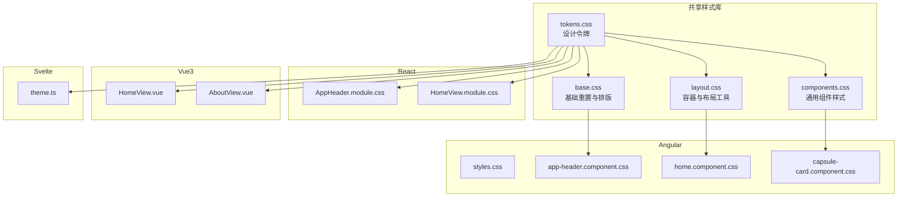
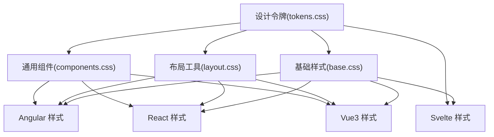
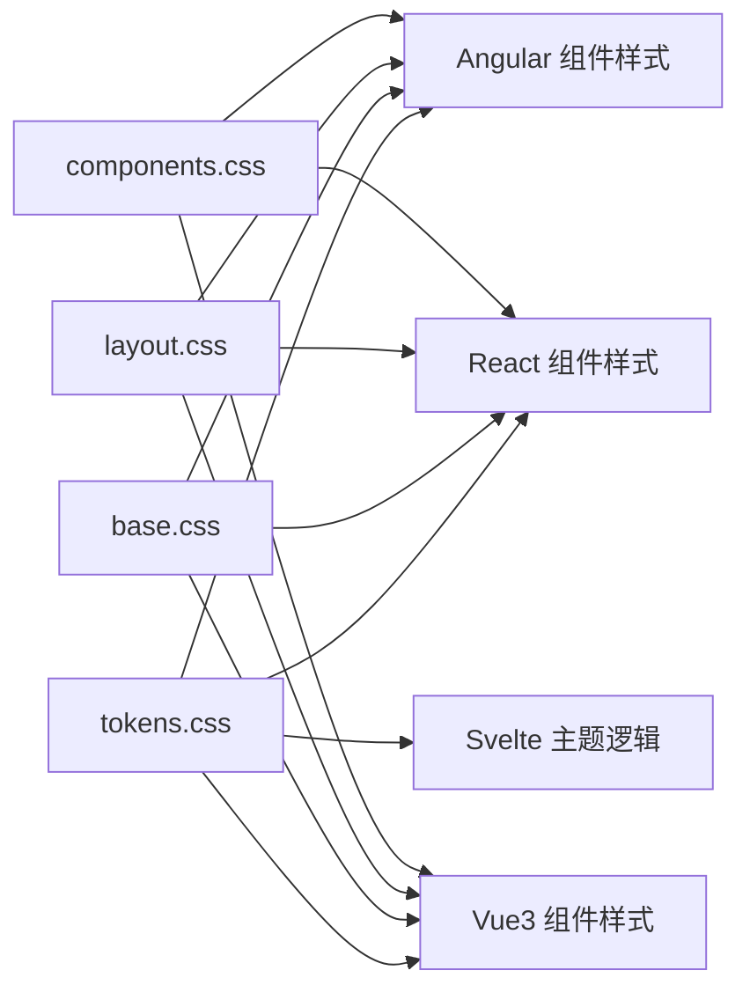
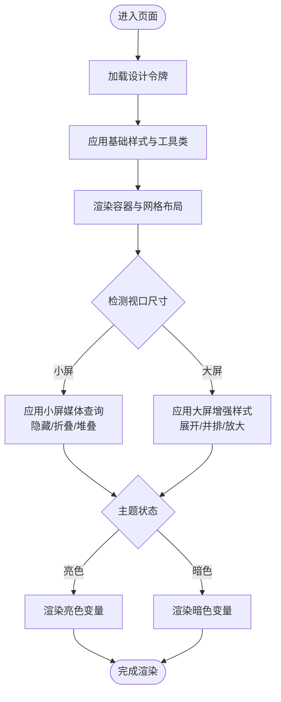

# 响应式设计

<cite>
**本文引用的文件**
- [spec/styles/base.css](file://spec/styles/base.css)
- [spec/styles/layout.css](file://spec/styles/layout.css)
- [spec/styles/components.css](file://spec/styles/components.css)
- [spec/styles/tokens.css](file://spec/styles/tokens.css)
- [frontends/angular-ts/src/styles.css](file://frontends/angular-ts/src/styles.css)
- [frontends/angular-ts/src/app/components/app-header/app-header.component.css](file://frontends/angular-ts/src/app/components/app-header/app-header.component.css)
- [frontends/angular-ts/src/app/components/capsule-card/capsule-card.component.css](file://frontends/angular-ts/src/app/components/capsule-card/capsule-card.component.css)
- [frontends/angular-ts/src/app/views/home/home.component.css](file://frontends/angular-ts/src/app/views/home/home.component.css)
- [frontends/react-ts/src/components/AppHeader.module.css](file://frontends/react-ts/src/components/AppHeader.module.css)
- [frontends/react-ts/src/views/HomeView.module.css](file://frontends/react-ts/src/views/HomeView.module.css)
- [frontends/vue3-ts/src/views/HomeView.vue](file://frontends/vue3-ts/src/views/HomeView.vue)
- [frontends/vue3-ts/src/views/AboutView.vue](file://frontends/vue3-ts/src/views/AboutView.vue)
- [frontends/svelte-ts/src/lib/theme.ts](file://frontends/svelte-ts/src/lib/theme.ts)
</cite>

## 目录
1. [引言](#引言)
2. [项目结构](#项目结构)
3. [核心组件](#核心组件)
4. [架构总览](#架构总览)
5. [详细组件分析](#详细组件分析)
6. [依赖关系分析](#依赖关系分析)
7. [性能考量](#性能考量)
8. [故障排查指南](#故障排查指南)
9. [结论](#结论)
10. [附录](#附录)

## 引言
本文件面向HelloTime项目的前端团队与设计师，系统化梳理项目中的响应式设计体系与实现细节。文档从移动端优先的理念出发，结合项目中已有的断点与布局工具，解释在不同屏幕尺寸下如何进行布局调整、字体大小变化与间距重排，并总结跨设备测试方法与最佳实践。同时，文档给出媒体查询的使用建议、断点命名规范以及样式覆盖策略，帮助开发者在多框架（Angular、React、Vue、Svelte）中保持一致的用户体验与视觉效果。

## 项目结构
HelloTime采用“共享设计令牌 + 组件级样式”的分层组织方式：
- 设计令牌集中于共享样式库，提供颜色、字体、间距、阴影、过渡与布局上限等全局变量。
- 基础样式与通用布局工具类位于共享样式库，确保各框架一致的基础体验。
- 各框架的页面与组件样式在各自目录内维护，遵循模块化与作用域隔离（如Vue单文件组件的scoped样式）。

图表来源
- [spec/styles/tokens.css:1-104](file://spec/styles/tokens.css#L1-L104)
- [spec/styles/base.css:1-67](file://spec/styles/base.css#L1-L67)
- [spec/styles/layout.css:1-103](file://spec/styles/layout.css#L1-L103)
- [spec/styles/components.css:1-207](file://spec/styles/components.css#L1-L207)
- [frontends/angular-ts/src/styles.css:1-3](file://frontends/angular-ts/src/styles.css#L1-L3)
- [frontends/angular-ts/src/app/components/app-header/app-header.component.css:1-66](file://frontends/angular-ts/src/app/components/app-header/app-header.component.css#L1-L66)
- [frontends/angular-ts/src/app/views/home/home.component.css:1-141](file://frontends/angular-ts/src/app/views/home/home.component.css#L1-L141)
- [frontends/angular-ts/src/app/components/capsule-card/capsule-card.component.css:1-76](file://frontends/angular-ts/src/app/components/capsule-card/capsule-card.component.css#L1-L76)
- [frontends/react-ts/src/components/AppHeader.module.css:1-51](file://frontends/react-ts/src/components/AppHeader.module.css#L1-L51)
- [frontends/react-ts/src/views/HomeView.module.css:1-115](file://frontends/react-ts/src/views/HomeView.module.css#L1-L115)
- [frontends/vue3-ts/src/views/HomeView.vue:1-173](file://frontends/vue3-ts/src/views/HomeView.vue#L1-L173)
- [frontends/vue3-ts/src/views/AboutView.vue:1-97](file://frontends/vue3-ts/src/views/AboutView.vue#L1-L97)
- [frontends/svelte-ts/src/lib/theme.ts:1-35](file://frontends/svelte-ts/src/lib/theme.ts#L1-L35)

章节来源
- [spec/styles/tokens.css:1-104](file://spec/styles/tokens.css#L1-L104)
- [spec/styles/base.css:1-67](file://spec/styles/base.css#L1-L67)
- [spec/styles/layout.css:1-103](file://spec/styles/layout.css#L1-L103)
- [spec/styles/components.css:1-207](file://spec/styles/components.css#L1-L207)
- [frontends/angular-ts/src/styles.css:1-3](file://frontends/angular-ts/src/styles.css#L1-L3)

## 核心组件
- 设计令牌（Design Tokens）
  - 提供颜色、字体、行高、字号、间距、圆角半径、阴影、过渡时长与布局最大宽度等全局变量，支撑跨框架一致性。
  - 支持亮/暗主题切换，通过根元素上的data-theme属性驱动。
- 基础样式（Base）
  - 统一重置与排版基线，设置根字体大小、文本缩放、最小视口高度、链接与图片处理等。
- 布局工具（Layout Utilities）
  - 容器与断点：提供container、container-sm、container-md及基于max-width的断点；网格在小屏自动变为单列。
  - Flex/Grid/Spacing/Text/Display等原子类，便于快速构建响应式布局。
- 通用组件样式（Components）
  - 按钮、输入框、卡片、徽标、对话框、表格等组件的通用样式与交互态，配合设计令牌实现主题一致。

章节来源
- [spec/styles/tokens.css:1-104](file://spec/styles/tokens.css#L1-L104)
- [spec/styles/base.css:1-67](file://spec/styles/base.css#L1-L67)
- [spec/styles/layout.css:1-103](file://spec/styles/layout.css#L1-L103)
- [spec/styles/components.css:1-207](file://spec/styles/components.css#L1-L207)

## 架构总览
响应式体系由“设计令牌 + 基础样式 + 布局工具 + 组件样式 + 框架样式”五层构成，形成自上而下的继承与覆盖关系。框架侧通过模块化样式或scoped样式隔离，避免相互污染；同时利用共享令牌与工具类，保证在不同框架间的一致性。

图表来源
- [spec/styles/tokens.css:1-104](file://spec/styles/tokens.css#L1-L104)
- [spec/styles/base.css:1-67](file://spec/styles/base.css#L1-L67)
- [spec/styles/layout.css:1-103](file://spec/styles/layout.css#L1-L103)
- [spec/styles/components.css:1-207](file://spec/styles/components.css#L1-L207)
- [frontends/angular-ts/src/app/views/home/home.component.css:1-141](file://frontends/angular-ts/src/app/views/home/home.component.css#L1-L141)
- [frontends/react-ts/src/views/HomeView.module.css:1-115](file://frontends/react-ts/src/views/HomeView.module.css#L1-L115)
- [frontends/vue3-ts/src/views/HomeView.vue:1-173](file://frontends/vue3-ts/src/views/HomeView.vue#L1-L173)
- [frontends/svelte-ts/src/lib/theme.ts:1-35](file://frontends/svelte-ts/src/lib/theme.ts#L1-L35)

## 详细组件分析

### 响应式断点与布局策略
- 断点与容器
  - 使用max-width作为断点依据，结合container、container-sm、container-md控制页面最大宽度与居中。
  - 网格在小屏自动变为单列，确保内容可读性与触控可达性。
- 移动优先
  - 默认样式面向小屏，随后在@media中针对更大屏幕进行增强；例如首页功能区在小屏为三列网格，小屏以下自动改为单列。
- 字体与间距
  - 所有字号、行高、间距均来自设计令牌，随主题切换自动更新，确保在不同色彩背景下具备合适的对比度与节奏感。
- 媒体查询实践
  - 在组件级样式中按需添加@media，避免全局样式过度耦合；例如Angular头部Logo文字在极小屏隐藏，React/Vue首页按钮在极小屏堆叠并限制最大宽度。

章节来源
- [spec/styles/layout.css:1-103](file://spec/styles/layout.css#L1-L103)
- [frontends/angular-ts/src/app/views/home/home.component.css:136-140](file://frontends/angular-ts/src/app/views/home/home.component.css#L136-L140)
- [frontends/react-ts/src/views/HomeView.module.css:99-109](file://frontends/react-ts/src/views/HomeView.module.css#L99-L109)
- [frontends/vue3-ts/src/views/HomeView.vue:143-153](file://frontends/vue3-ts/src/views/HomeView.vue#L143-L153)
- [frontends/angular-ts/src/app/components/app-header/app-header.component.css:60-65](file://frontends/angular-ts/src/app/components/app-header/app-header.component.css#L60-L65)

### Flexbox与CSS Grid在响应式中的应用
- Flexbox
  - 用于导航、操作区、卡片头等需要弹性排列与对齐的场景；在小屏下通过flex-direction: column与wrap实现自然换行。
  - 示例路径：[flex相关样式:18-34](file://spec/styles/layout.css#L18-L34)，[React首页操作区:21-25](file://frontends/react-ts/src/views/HomeView.module.css#L21-L25)，[Vue首页操作区:81-85](file://frontends/vue3-ts/src/views/HomeView.vue#L81-L85)
- Grid
  - 用于功能区、卡片网格等二维布局；在小屏自动降级为单列，提升可读性与触控效率。
  - 示例路径：[Grid工具类:35-39](file://spec/styles/layout.css#L35-L39)，[Angular首页功能区:107-112](file://frontends/angular-ts/src/app/views/home/home.component.css#L107-L112)，[Vue首页功能区:32-49](file://frontends/vue3-ts/src/views/HomeView.vue#L32-L49)

章节来源
- [spec/styles/layout.css:18-39](file://spec/styles/layout.css#L18-L39)
- [frontends/angular-ts/src/app/views/home/home.component.css:107-112](file://frontends/angular-ts/src/app/views/home/home.component.css#L107-L112)
- [frontends/react-ts/src/views/HomeView.module.css:21-25](file://frontends/react-ts/src/views/HomeView.module.css#L21-L25)
- [frontends/vue3-ts/src/views/HomeView.vue:32-49](file://frontends/vue3-ts/src/views/HomeView.vue#L32-L49)

### 主题与暗色模式的响应式协同
- 主题切换
  - 通过data-theme属性驱动，所有颜色、阴影等基于令牌的变量会随之更新，无需为每个组件单独写暗色样式。
  - 示例路径：[tokens中的暗色模式变量:82-103](file://spec/styles/tokens.css#L82-L103)，[Svelte主题存储与切换:1-35](file://frontends/svelte-ts/src/lib/theme.ts#L1-L35)
- 暗色模式下的视觉强化
  - 部分组件在暗色模式下增加边框光晕或提升滤镜亮度，增强层次感与可读性。
  - 示例路径：[React首页按钮暗色模式样式:67-81](file://frontends/react-ts/src/views/HomeView.module.css#L67-L81)，[Vue首页按钮暗色模式样式:156-172](file://frontends/vue3-ts/src/views/HomeView.vue#L156-L172)

章节来源
- [spec/styles/tokens.css:82-103](file://spec/styles/tokens.css#L82-L103)
- [frontends/svelte-ts/src/lib/theme.ts:1-35](file://frontends/svelte-ts/src/lib/theme.ts#L1-L35)
- [frontends/react-ts/src/views/HomeView.module.css:67-81](file://frontends/react-ts/src/views/HomeView.module.css#L67-L81)
- [frontends/vue3-ts/src/views/HomeView.vue:156-172](file://frontends/vue3-ts/src/views/HomeView.vue#L156-L172)

### 跨框架一致性与样式覆盖策略
- 共享基础
  - 所有框架共享tokens、base、layout、components，确保基础体验一致。
  - Angular通过angular.json的styles数组引入共享样式；组件样式按需覆盖。
- 模块化与作用域
  - React使用CSS Modules隔离作用域；Vue使用scoped样式；Svelte通过store与DOM属性控制主题。
- 覆盖策略
  - 优先使用工具类与令牌变量；仅在必要时在组件级样式中添加@media或局部覆盖。
  - 避免全局重置与深层选择器，减少样式冲突。

章节来源
- [frontends/angular-ts/src/styles.css:1-3](file://frontends/angular-ts/src/styles.css#L1-L3)
- [spec/styles/base.css:1-67](file://spec/styles/base.css#L1-L67)
- [spec/styles/layout.css:1-103](file://spec/styles/layout.css#L1-L103)
- [spec/styles/components.css:1-207](file://spec/styles/components.css#L1-L207)
- [frontends/react-ts/src/components/AppHeader.module.css:1-51](file://frontends/react-ts/src/components/AppHeader.module.css#L1-L51)
- [frontends/vue3-ts/src/views/AboutView.vue:79-96](file://frontends/vue3-ts/src/views/AboutView.vue#L79-L96)
- [frontends/svelte-ts/src/lib/theme.ts:1-35](file://frontends/svelte-ts/src/lib/theme.ts#L1-L35)

### 媒体查询使用方法与断点命名规范
- 媒体查询位置
  - 在组件级样式中按需添加@media，避免在共享样式中过度使用断点。
- 断点命名
  - 推荐使用语义化命名：max-width系列（如max-width: 768px），并在注释中标明设备范围与意图。
- 覆盖顺序
  - 小屏默认，大屏增强；优先使用工具类，再在组件样式中微调。

章节来源
- [spec/styles/layout.css:96-102](file://spec/styles/layout.css#L96-L102)
- [frontends/angular-ts/src/app/views/home/home.component.css:136-140](file://frontends/angular-ts/src/app/views/home/home.component.css#L136-L140)
- [frontends/react-ts/src/views/HomeView.module.css:99-109](file://frontends/react-ts/src/views/HomeView.module.css#L99-L109)
- [frontends/vue3-ts/src/views/HomeView.vue:143-153](file://frontends/vue3-ts/src/views/HomeView.vue#L143-L153)

### 具体响应式示例与实现要点
- Angular头部导航
  - 在极小屏隐藏Logo文字，保留图标，保证空间利用率与可读性。
  - 示例路径：[Angular头部样式:60-65](file://frontends/angular-ts/src/app/components/app-header/app-header.component.css#L60-L65)
- Angular首页功能区
  - 大屏三列网格，小屏单列；按钮区域在小屏堆叠并限制最大宽度。
  - 示例路径：[Angular首页网格与媒体查询:107-140](file://frontends/angular-ts/src/app/views/home/home.component.css#L107-L140)
- React首页按钮区
  - 小屏flex-direction: column，align-items: center，按钮宽度自适应且限制最大宽度。
  - 示例路径：[React首页样式:99-109](file://frontends/react-ts/src/views/HomeView.module.css#L99-L109)
- Vue首页按钮区
  - 与React类似的响应式行为，使用scoped样式隔离。
  - 示例路径：[Vue首页样式:143-153](file://frontends/vue3-ts/src/views/HomeView.vue#L143-L153)

章节来源
- [frontends/angular-ts/src/app/components/app-header/app-header.component.css:60-65](file://frontends/angular-ts/src/app/components/app-header/app-header.component.css#L60-L65)
- [frontends/angular-ts/src/app/views/home/home.component.css:107-140](file://frontends/angular-ts/src/app/views/home/home.component.css#L107-L140)
- [frontends/react-ts/src/views/HomeView.module.css:99-109](file://frontends/react-ts/src/views/HomeView.module.css#L99-L109)
- [frontends/vue3-ts/src/views/HomeView.vue:143-153](file://frontends/vue3-ts/src/views/HomeView.vue#L143-L153)

## 依赖关系分析
- 低耦合高内聚
  - 共享样式库独立于框架，组件样式仅依赖令牌与工具类，降低跨框架迁移成本。
- 主题依赖
  - 主题切换通过data-theme影响所有基于令牌的颜色变量，组件无需感知主题细节。
- 媒体查询依赖
  - 断点集中在共享布局工具与组件级样式中，避免重复与冲突。

图表来源
- [spec/styles/tokens.css:1-104](file://spec/styles/tokens.css#L1-L104)
- [spec/styles/base.css:1-67](file://spec/styles/base.css#L1-L67)
- [spec/styles/layout.css:1-103](file://spec/styles/layout.css#L1-L103)
- [spec/styles/components.css:1-207](file://spec/styles/components.css#L1-L207)
- [frontends/svelte-ts/src/lib/theme.ts:1-35](file://frontends/svelte-ts/src/lib/theme.ts#L1-L35)

## 性能考量
- 减少重绘与回流
  - 优先使用transform与opacity等复合属性动画，避免频繁修改布局属性。
- 媒体查询优化
  - 合理合并@media规则，避免过多断点导致样式体积膨胀。
- 主题切换性能
  - 通过data-theme一次性切换，减少逐元素更新带来的抖动。

## 故障排查指南
- 样式不生效
  - 检查是否正确引入共享样式库；确认组件级样式是否具有足够优先级。
- 响应式异常
  - 确认断点是否与工具类配合使用；检查容器类与网格类的组合是否正确。
- 主题不一致
  - 确认data-theme属性是否正确设置；检查tokens中暗色模式变量是否覆盖到目标组件。

章节来源
- [frontends/angular-ts/src/styles.css:1-3](file://frontends/angular-ts/src/styles.css#L1-L3)
- [spec/styles/tokens.css:82-103](file://spec/styles/tokens.css#L82-L103)
- [frontends/svelte-ts/src/lib/theme.ts:1-35](file://frontends/svelte-ts/src/lib/theme.ts#L1-L35)

## 结论
HelloTime的响应式设计以“移动端优先 + 设计令牌 + 布局工具 + 组件样式 + 框架样式”为核心，实现了跨框架的一致体验与可维护性。通过合理的断点策略、Flexbox与Grid的应用、主题系统的协同以及模块化的样式组织，开发者可以在不同设备与框架间快速迭代并保持高质量的视觉与交互体验。

## 附录
- 响应式流程示意（概念图）

