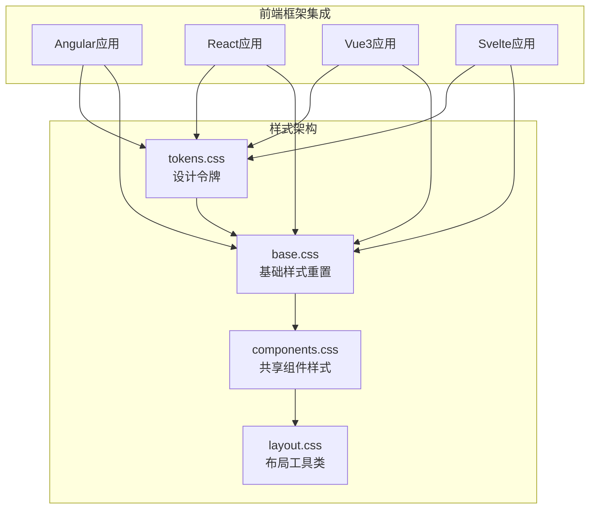
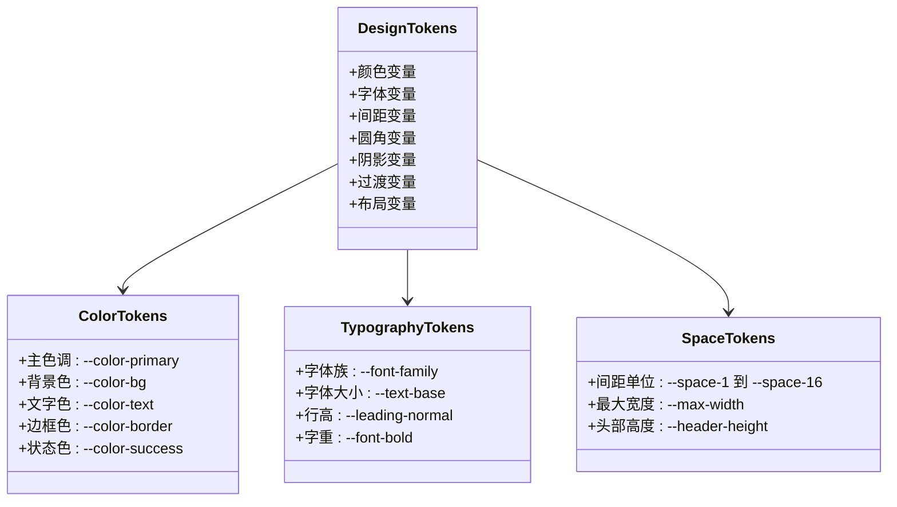
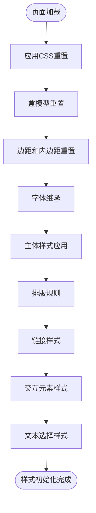
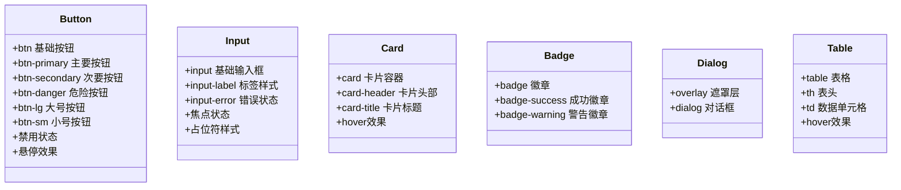
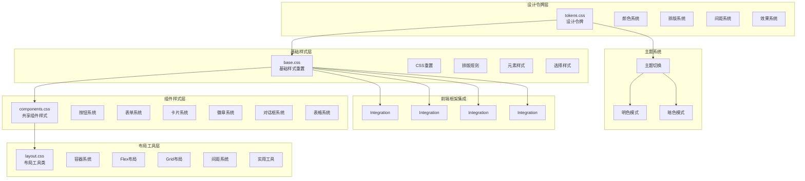
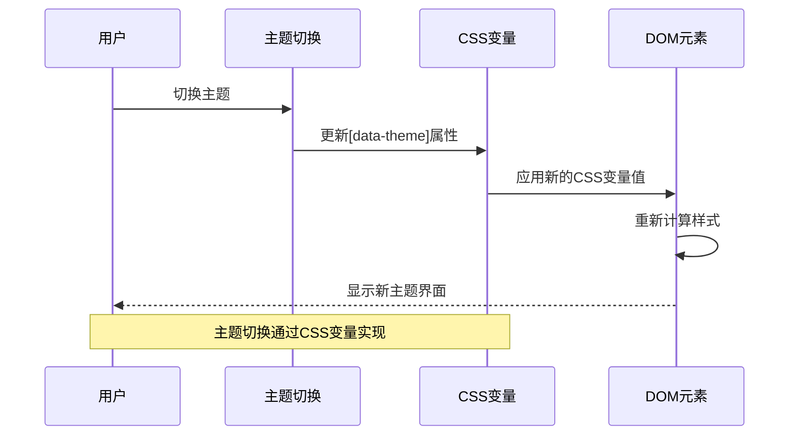
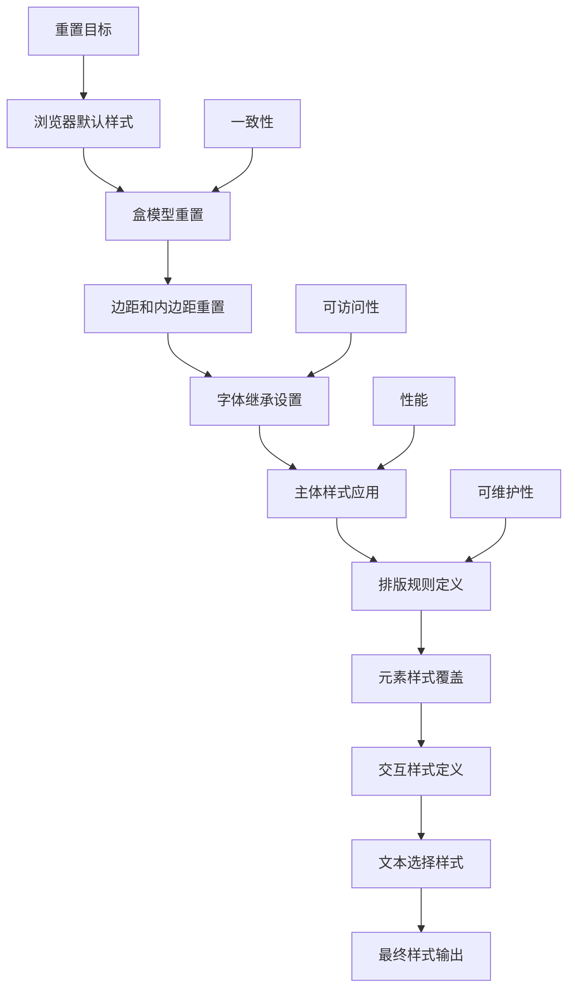
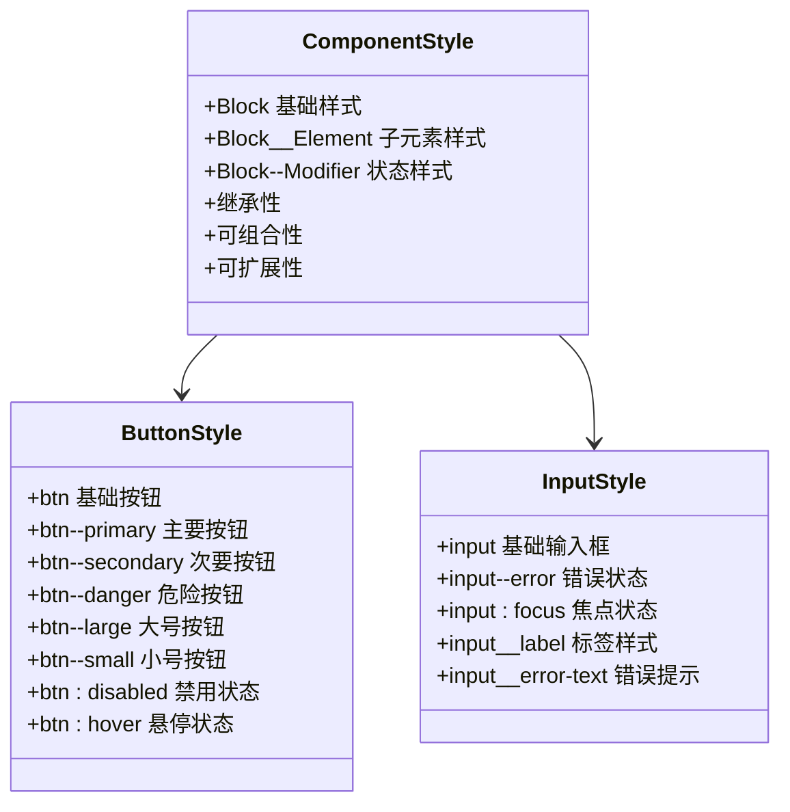
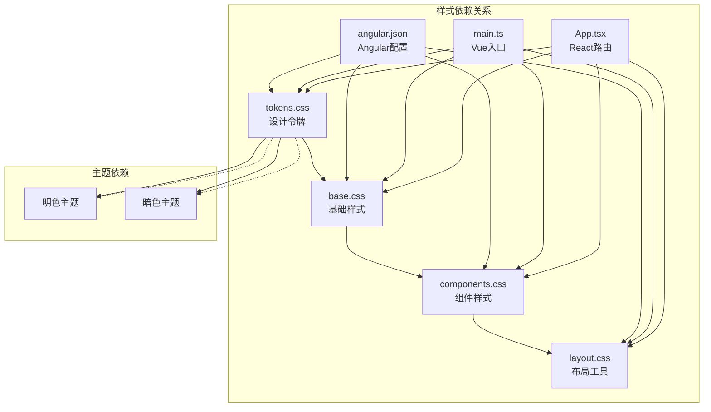

# 基础样式

<cite>
**本文档引用的文件**
- [base.css](file://spec/styles/base.css)
- [tokens.css](file://spec/styles/tokens.css)
- [components.css](file://spec/styles/components.css)
- [layout.css](file://spec/styles/layout.css)
- [angular.json](file://frontends/angular-ts/angular.json)
- [main.ts](file://frontends/vue3-ts/src/main.ts)
- [App.tsx](file://frontends/react-ts/src/App.tsx)
- [styles.css](file://frontends/angular-ts/src/styles.css)
- [app.css](file://frontends/svelte-ts/src/app.css)
</cite>

## 目录
1. [简介](#简介)
2. [项目结构](#项目结构)
3. [核心组件](#核心组件)
4. [架构概览](#架构概览)
5. [详细组件分析](#详细组件分析)
6. [依赖分析](#依赖分析)
7. [性能考虑](#性能考虑)
8. [故障排除指南](#故障排除指南)
9. [结论](#结论)

## 简介

HelloTime项目的基础样式系统采用现代化的CSS设计令牌（Design Tokens）架构，通过统一的变量定义和模块化样式组织，为所有前端框架提供一致的视觉体验。该系统实现了完整的CSS重置、基础排版规则、默认元素样式覆盖，以及响应式布局工具类。

基础样式系统的核心设计理念是：
- **设计令牌驱动**：使用CSS自定义属性作为单一事实来源
- **主题化支持**：内置明暗主题切换机制
- **跨框架兼容**：为Angular、React、Vue3、Svelte提供统一样式
- **可扩展性**：基于BEM命名约定的组件样式体系

## 项目结构

HelloTime项目的基础样式采用分层架构，将样式按功能域进行模块化组织：



**图表来源**
- [tokens.css:1-104](file://spec/styles/tokens.css#L1-L104)
- [base.css:1-67](file://spec/styles/base.css#L1-L67)
- [components.css:1-207](file://spec/styles/components.css#L1-L207)
- [layout.css:1-103](file://spec/styles/layout.css#L1-L103)

**章节来源**
- [angular.json:39-45](file://frontends/angular-ts/angular.json#L39-L45)
- [main.ts:10-13](file://frontends/vue3-ts/src/main.ts#L10-L13)

## 核心组件

### 设计令牌系统

设计令牌是整个样式系统的基石，提供了统一的颜色、字体、间距、阴影等设计变量：



**图表来源**
- [tokens.css:2-80](file://spec/styles/tokens.css#L2-L80)

设计令牌系统包含以下主要类别：

**颜色系统**：定义了主色调、背景色、文字色、边框色和状态色的完整色彩体系，支持明暗两种主题模式。

**排版系统**：包含字体家族、字号层级、行高设置和字重定义，确保文本内容的一致性和可读性。

**间距系统**：采用8px为基础的间距递增系统，提供从0.25rem到4rem的完整间距体系。

**圆角系统**：从0.25rem到1rem的渐进式圆角半径，支持按钮、卡片等UI组件的统一圆角风格。

**阴影系统**：提供sm、md、lg三个级别的阴影效果，增强层次感和深度感。

**过渡系统**：定义了fast、base、slow三种动画持续时间，确保交互反馈的一致性。

**章节来源**
- [tokens.css:1-104](file://spec/styles/tokens.css#L1-L104)

### CSS重置与基础样式

基础样式重置确保不同浏览器间的样式一致性，并为后续样式定义奠定基础：



**图表来源**
- [base.css:1-67](file://spec/styles/base.css#L1-L67)

基础样式重置策略包括：

**盒模型统一**：将所有元素的box-sizing设置为border-box，简化尺寸计算。

**字体继承**：确保所有表单控件继承父元素的字体和颜色设置。

**链接样式**：定义主色调链接，提供悬停状态的交互反馈。

**图片处理**：确保图片在容器内自适应，避免溢出问题。

**文本选择**：统一文本选择的视觉效果，使用主色调配色方案。

**章节来源**
- [base.css:1-67](file://spec/styles/base.css#L1-L67)

### 组件样式体系

共享组件样式采用BEM（Block Element Modifier）命名约定，确保样式模块的独立性和可复用性：



**图表来源**
- [components.css:3-207](file://spec/styles/components.css#L3-L207)

组件样式体系特点：

**按钮系统**：提供primary、secondary、danger三种语义化按钮，支持不同尺寸规格，包含禁用状态和悬停交互。

**输入系统**：统一的输入框样式，包含标签、错误状态、焦点状态和占位符样式。

**卡片系统**：标准化的卡片容器，支持悬停效果和阴影变化。

**徽章系统**：语义化的状态徽章，支持成功和警告两种状态。

**对话框系统**：模态对话框的遮罩层和内容区域样式。

**表格系统**：响应式表格样式，支持悬停高亮和表头固定。

**章节来源**
- [components.css:1-207](file://spec/styles/components.css#L1-L207)

### 布局工具类系统

布局工具类提供快速的布局解决方案，减少重复的样式定义：

```mermaid
graph LR
subgraph "容器系统"
Container[.container<br/>标准容器]
SmContainer[.container-sm<br/>小容器]
MdContainer[.container-md<br/>中容器]
end
subgraph "Flex布局"
Flex[.flex<br/>弹性布局]
FlexCol[.flex-col<br/>垂直排列]
FlexWrap[.flex-wrap<br/>换行]
ItemsCenter[.items-center<br/>居中对齐]
JustifyCenter[.justify-center<br/>水平居中]
end
subgraph "Grid布局"
Grid[.grid<br/>网格布局]
GridCols2[.grid-cols-2<br/>两列网格]
GridCols3[.grid-cols-3<br/>三列网格]
end
subgraph "间距系统"
Gap[.gap-{size}<br/>间距]
Margin[.m{axis}-{size}<br/>外边距]
Padding[.p{axis}-{size}<br/>内边距]
end
subgraph "文本系统"
TextAlign[.text-{center/right}<br/>文本对齐]
TextSize[.text-{sm/lg/xl}<br/>文本大小]
FontWeight[.font-{medium/semibold/bold}<br/>字重]
end
Container --> Flex
Flex --> Grid
Grid --> Gap
Gap --> Margin
Margin --> Padding
Padding --> TextAlign
TextAlign --> TextSize
TextSize --> FontWeight
```

**图表来源**
- [layout.css:3-103](file://spec/styles/layout.css#L3-L103)

布局工具类系统包含：

**容器系统**：提供不同宽度限制的标准容器，支持响应式断点。

**Flex布局系统**：完整的弹性布局工具类，支持方向、对齐、间距等常用属性。

**Grid布局系统**：基础的网格布局工具类，支持多列布局。

**间距系统**：基于设计令牌的完整间距体系，支持所有轴向的内外边距。

**文本系统**：文本对齐、大小、字重的快速样式应用。

**显示系统**：block、inline-block、hidden等显示方式的快速切换。

**页面布局**：针对页面级布局的专用工具类，包含页眉和页脚的适配。

**响应式系统**：在768px断点下的网格布局自动调整。

**章节来源**
- [layout.css:1-103](file://spec/styles/layout.css#L1-L103)

## 架构概览

HelloTime项目的基础样式架构体现了现代前端开发的最佳实践，通过设计令牌驱动的样式系统，实现了跨框架的一致性和可维护性。



**图表来源**
- [tokens.css:1-104](file://spec/styles/tokens.css#L1-L104)
- [base.css:1-67](file://spec/styles/base.css#L1-L67)
- [components.css:1-207](file://spec/styles/components.css#L1-L207)
- [layout.css:1-103](file://spec/styles/layout.css#L1-L103)

架构优势：

**单一事实来源**：所有设计变量都来源于tokens.css，确保设计的一致性。

**主题化支持**：通过CSS自定义属性和[data-theme]选择器实现无缝的主题切换。

**模块化组织**：按功能域划分样式文件，便于维护和扩展。

**跨框架兼容**：统一的样式接口，支持多种前端框架的集成。

**响应式设计**：内置响应式工具类，支持移动端优先的设计理念。

## 详细组件分析

### 设计令牌系统详解

设计令牌系统是HelloTime样式架构的核心，它将设计决策转化为可复用的CSS变量：



**图表来源**
- [tokens.css:82-103](file://spec/styles/tokens.css#L82-L103)

设计令牌的组织结构：

**颜色令牌**：包含主色调、背景色、文字色、边框色和状态色的完整体系，支持明暗两种主题模式。

**字体令牌**：定义了系统字体栈，确保在不同操作系统和设备上的最佳显示效果。

**间距令牌**：采用8px为基础的递增系统，提供从0.25rem到4rem的完整间距范围。

**圆角令牌**：从0.25rem到1rem的渐进式圆角半径，支持不同UI组件的圆角需求。

**阴影令牌**：提供sm、md、lg三个级别的阴影效果，增强视觉层次。

**过渡令牌**：定义了fast、base、slow三种动画时长，确保交互反馈的一致性。

**布局令牌**：包含最大宽度、容器宽度和头部高度等布局相关变量。

**章节来源**
- [tokens.css:1-104](file://spec/styles/tokens.css#L1-L104)

### CSS重置策略分析

HelloTime的CSS重置策略采用了现代化的方法，既保证了跨浏览器的一致性，又保持了必要的可访问性：



**图表来源**
- [base.css:1-67](file://spec/styles/base.css#L1-L67)

重置策略的关键要素：

**盒模型统一**：将box-sizing设置为border-box，简化尺寸计算，避免常见的布局问题。

**边距重置**：将所有元素的margin和padding重置为0，确保跨浏览器的一致性。

**字体继承**：确保表单控件继承父元素的字体设置，保持视觉一致性。

**链接样式**：定义主色调链接，提供清晰的视觉反馈和交互状态。

**图片处理**：确保图片在容器内自适应，防止溢出和布局破坏。

**文本选择**：统一文本选择的视觉效果，提升用户体验。

**章节来源**
- [base.css:1-67](file://spec/styles/base.css#L1-L67)

### 组件样式实现分析

组件样式采用BEM命名约定，确保样式的模块化和可复用性：



**图表来源**
- [components.css:3-207](file://spec/styles/components.css#L3-L207)

组件样式的实现原则：

**BEM命名约定**：Block__Element--Modifier的命名模式，确保样式的唯一性和可读性。

**状态管理**：通过伪类选择器和状态类管理组件的不同状态。

**主题适配**：所有组件样式都使用CSS变量，自动适配明暗主题。

**响应式设计**：组件样式包含响应式断点，确保在不同设备上的良好表现。

**可访问性**：组件样式考虑了键盘导航和屏幕阅读器的支持。

**章节来源**
- [components.css:1-207](file://spec/styles/components.css#L1-L207)

### 布局工具类系统

布局工具类系统提供了快速的布局解决方案，减少了重复的样式定义：

```mermaid
graph TD
A[布局工具类] --> B[容器系统]
A --> C[Flex布局]
A --> D[Grid布局]
A --> E[间距系统]
A --> F[文本系统]
A --> G[显示系统]
A --> H[页面布局]
A --> I[响应式系统]
B --> B1[.container 标准容器]
B --> B2[.container-sm 小容器]
B --> B3[.container-md 中容器]
C --> C1[.flex 弹性布局]
C --> C2[.flex-col 垂直排列]
C --> C3[.items-center 居中对齐]
C --> C4[.justify-between 两端对齐]
D --> D1[.grid 网格布局]
D --> D2[.grid-cols-2 两列网格]
D --> D3[.grid-cols-3 三列网格]
E --> E1[.gap-{size} 间距]
E --> E2[.m{axis}-{size} 外边距]
E --> E3[.p{axis}-{size} 内边距]
F --> F1[.text-{center/right} 文本对齐]
F --> F2[.text-{sm/lg/xl} 文本大小]
F --> F3[.font-{medium/semibold/bold} 字重]
G --> G1[.hidden 隐藏]
G --> G2[.block 块级显示]
G --> G3[.inline-block 行内块]
H --> H1[.page 页面布局]
H --> H2[.page-header 页眉]
I --> I1[@media (max-width: 768px) 响应式断点]
```

**图表来源**
- [layout.css:1-103](file://spec/styles/layout.css#L1-L103)

布局工具类的设计理念：

**原子化设计**：每个工具类只负责单一的样式属性，便于组合和复用。

**命名一致性**：采用简短而明确的命名，便于记忆和使用。

**响应式集成**：工具类与响应式设计相结合，在移动设备上自动调整。

**性能优化**：工具类经过压缩和优化，减少CSS文件大小。

**可维护性**：工具类的结构清晰，便于维护和扩展。

**章节来源**
- [layout.css:1-103](file://spec/styles/layout.css#L1-L103)

## 依赖分析

HelloTime项目的基础样式系统具有清晰的依赖关系和模块化结构：



**图表来源**
- [angular.json:39-45](file://frontends/angular-ts/angular.json#L39-L45)
- [main.ts:10-13](file://frontends/vue3-ts/src/main.ts#L10-L13)

依赖关系特点：

**层次化依赖**：设计令牌 -> 基础样式 -> 组件样式 -> 布局工具，形成清晰的层次结构。

**框架无关性**：样式系统独立于具体框架，通过配置文件集成到各个前端框架。

**主题独立性**：主题切换不依赖特定框架，通过CSS变量实现。

**可扩展性**：新的样式文件可以轻松添加到现有架构中。

**兼容性**：所有样式文件都考虑了浏览器兼容性要求。

**章节来源**
- [angular.json:1-108](file://frontends/angular-ts/angular.json#L1-L108)
- [main.ts:1-23](file://frontends/vue3-ts/src/main.ts#L1-L23)

## 性能考虑

HelloTime基础样式系统在设计时充分考虑了性能优化：

**CSS变量优化**：
- 使用CSS自定义属性替代硬编码值，提高维护性和性能
- 通过主题切换实现零重绘的样式变更

**选择器优化**：
- 采用扁平的选择器结构，避免复杂的嵌套选择器
- 使用类名而非标签选择器，提高选择器性能

**文件组织优化**：
- 按功能域分离样式文件，支持按需加载
- 最小化重复的样式定义，减少CSS文件大小

**缓存策略**：
- 设计令牌作为基础样式，具有最高的缓存价值
- 组件样式和布局工具类支持增量更新

**浏览器兼容性**：
- 支持现代浏览器的CSS特性
- 提供降级方案以确保旧版本浏览器的兼容性

## 故障排除指南

### 常见样式冲突问题

**问题**：组件样式被第三方库覆盖
**解决方案**：使用更具体的选择器或添加!important声明（谨慎使用）

**问题**：主题切换不生效
**解决方案**：检查[data-theme]属性是否正确设置，确认CSS变量优先级

**问题**：响应式布局异常
**解决方案**：验证媒体查询断点，检查容器宽度设置

### 样式调试技巧

**使用浏览器开发者工具**：
- 检查元素的实际计算样式
- 查看CSS变量的最终值
- 分析选择器的优先级

**样式隔离**：
- 在组件内部使用scoped样式
- 避免全局样式的意外影响
- 使用CSS模块化技术

**性能监控**：
- 监控CSS文件的加载时间
- 检查重绘和回流的频率
- 优化复杂的选择器

## 结论

HelloTime项目的基础样式系统展现了现代前端开发的最佳实践，通过设计令牌驱动的架构、模块化的样式组织和跨框架的兼容性设计，为项目提供了强大而灵活的样式基础设施。

该系统的主要优势包括：

**一致性**：通过设计令牌确保所有组件和页面的视觉一致性。

**可维护性**：模块化的样式架构使得维护和扩展变得简单。

**可访问性**：内置的可访问性考虑确保了良好的用户体验。

**性能优化**：经过精心设计的样式系统在保证功能的同时优化了性能。

**跨框架兼容**：统一的样式接口支持多种前端框架的集成。

对于开发者而言，理解和掌握这个基础样式系统不仅有助于正确使用现有的样式资源，也为未来的样式扩展和定制奠定了坚实的基础。通过遵循BEM命名约定、合理使用设计令牌和充分利用布局工具类，开发者可以快速构建出既美观又实用的用户界面。