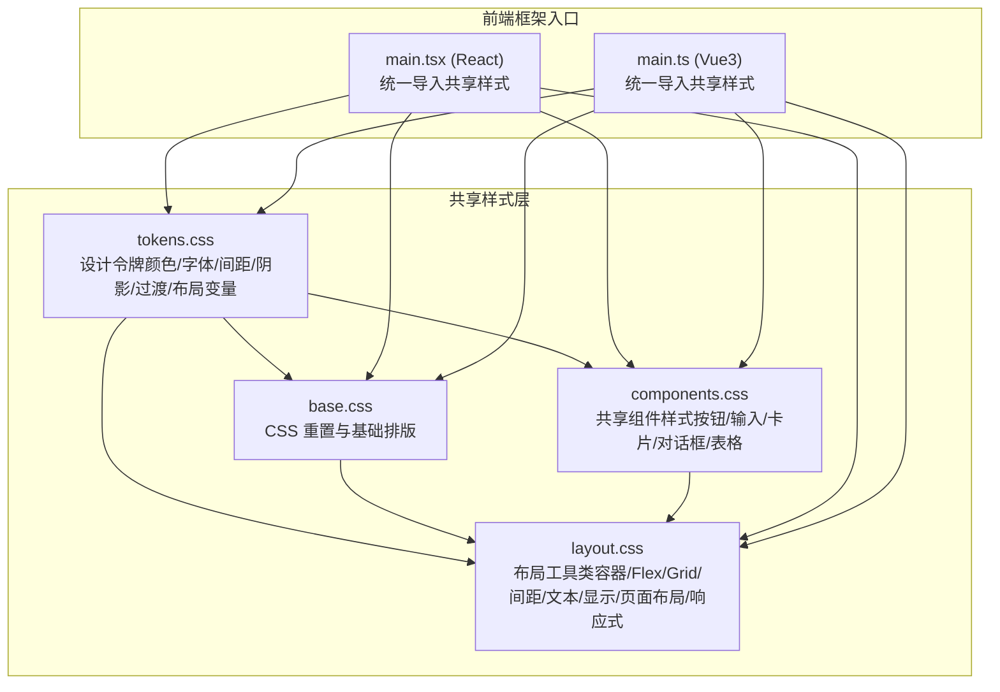
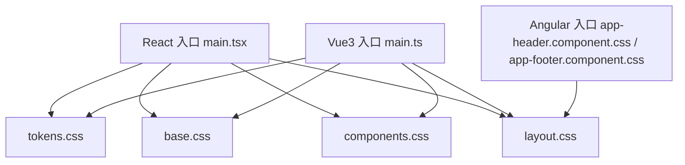
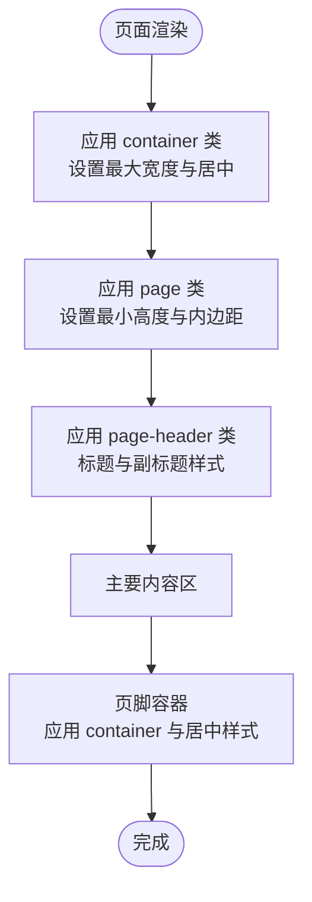
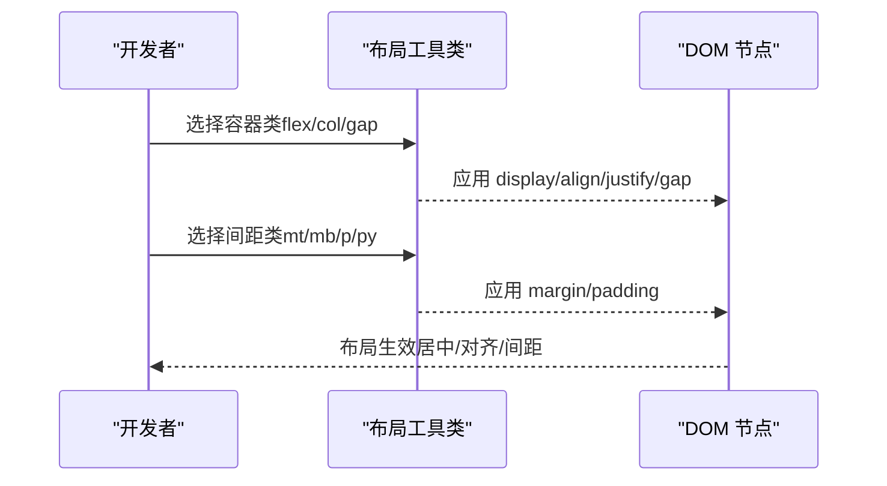
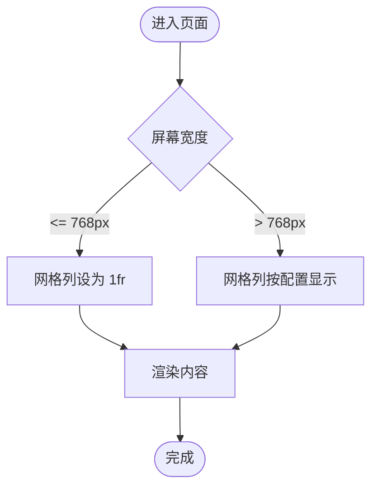
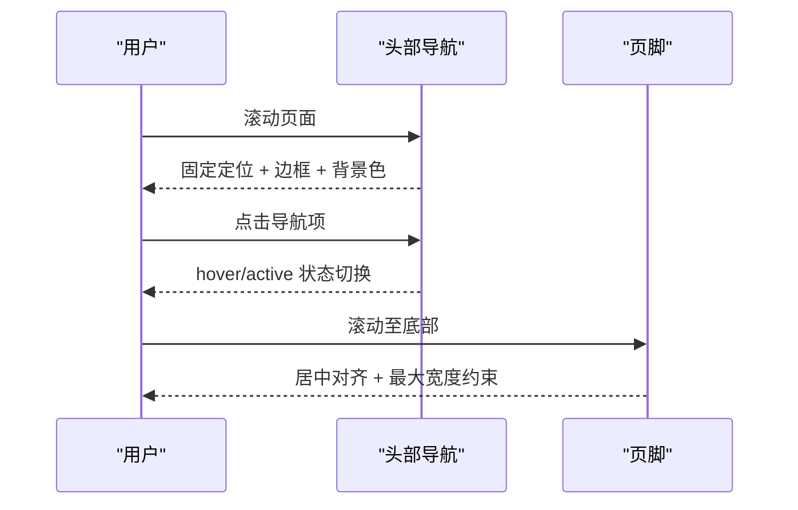
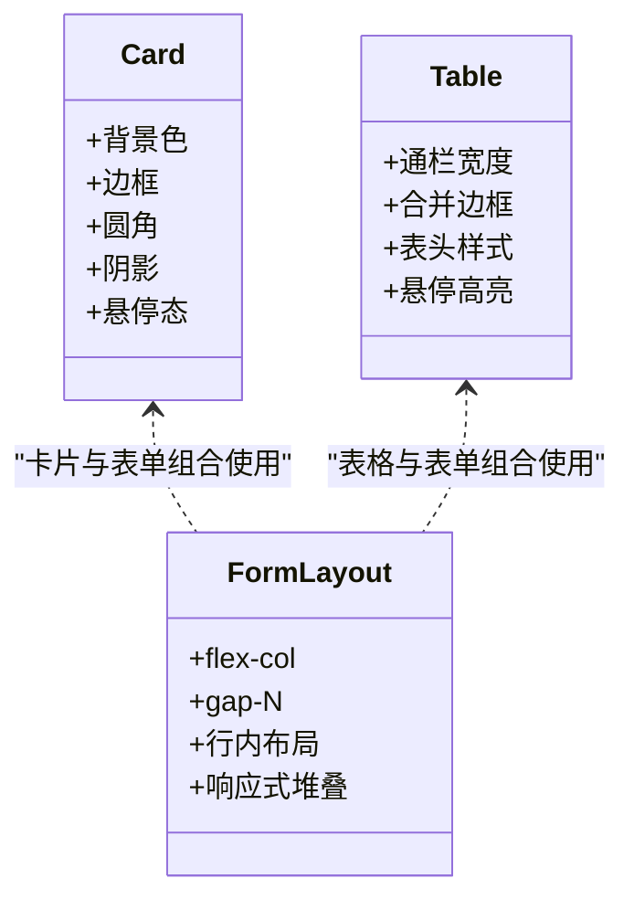
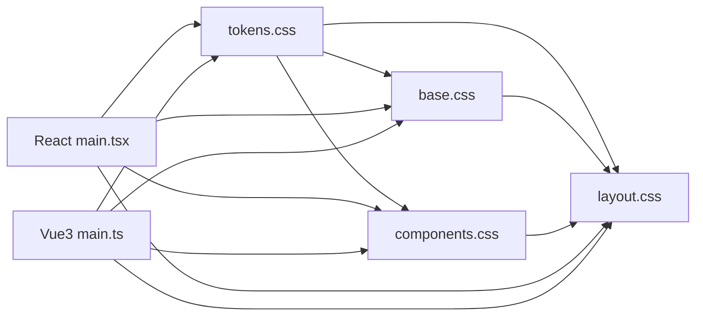

# 布局样式

<cite>
**本文引用的文件**
- [layout.css](file://spec/styles/layout.css)
- [base.css](file://spec/styles/base.css)
- [components.css](file://spec/styles/components.css)
- [tokens.css](file://spec/styles/tokens.css)
- [main.tsx](file://frontends/react-ts/src/main.tsx)
- [main.ts](file://frontends/vue3-ts/src/main.ts)
- [app-header.component.css](file://frontends/angular-ts/src/app/components/app-header/app-header.component.css)
- [app-footer.component.css](file://frontends/angular-ts/src/app/components/app-footer/app-footer.component.css)
- [HomeView.module.css (React)](file://frontends/react-ts/src/views/HomeView.module.css)
- [HomeView.vue (Vue3)](file://frontends/vue3-ts/src/views/HomeView.vue)
- [CapsuleForm.module.css (React)](file://frontends/react-ts/src/components/CapsuleForm.module.css)
- [capsule-table.component.css (Angular)](file://frontends/angular-ts/src/app/components/capsule-table/capsule-table.component.css)
</cite>

## 目录
1. [简介](#简介)
2. [项目结构](#项目结构)
3. [核心组件](#核心组件)
4. [架构总览](#架构总览)
5. [详细组件分析](#详细组件分析)
6. [依赖关系分析](#依赖关系分析)
7. [性能考量](#性能考量)
8. [故障排查指南](#故障排查指南)
9. [结论](#结论)
10. [附录](#附录)

## 简介
本文件系统性梳理 HelloTime 项目的布局样式体系，覆盖页面布局结构、容器设计、网格与弹性布局、间距与对齐、响应式断点、头部导航、主要内容区域与页脚等关键要素。文档基于仓库中的共享样式与各前端框架（React/Vue/Angular）的具体实现，给出可操作的组合使用方法、嵌套规则与最佳实践，并提供可视化图示帮助开发者快速掌握布局样式的使用技巧。

## 项目结构
HelloTime 的布局样式由“设计令牌 + 基础样式 + 组件样式 + 布局工具类”四层构成，配合各前端框架入口统一引入，形成一致的设计语言与布局规范。

**图表来源**
- [tokens.css](file://spec/styles/tokens.css)
- [base.css](file://spec/styles/base.css)
- [components.css](file://spec/styles/components.css)
- [layout.css](file://spec/styles/layout.css)
- [main.tsx](file://frontends/react-ts/src/main.tsx)
- [main.ts](file://frontends/vue3-ts/src/main.ts)

**章节来源**
- [tokens.css](file://spec/styles/tokens.css)
- [base.css](file://spec/styles/base.css)
- [components.css](file://spec/styles/components.css)
- [layout.css](file://spec/styles/layout.css)
- [main.tsx](file://frontends/react-ts/src/main.tsx)
- [main.ts](file://frontends/vue3-ts/src/main.ts)

## 核心组件
- 容器系统
  - 标准容器：宽度 100%，最大宽度由设计令牌控制，自动水平居中并带有内边距。
  - 容器尺寸变体：提供 sm/md 等不同最大宽度的容器，用于不同密度的内容布局。
- 弹性布局（Flex）
  - 方向、换行、对齐（起始/居中/两端/末尾）、主轴间距（gap）等常用属性的工具类。
  - 自适应子元素：flex-1 实现弹性伸缩。
- 网格布局（Grid）
  - 列数重复：支持 2 列、3 列网格；在小屏设备上自动降级为单列以保证可读性。
- 间距与对齐
  - 外边距与内边距：提供多档位的上下左右间距工具类，配合 mx-auto 实现水平居中。
  - 文本对齐：左/中/右对齐与字号、字重、颜色等文本工具类。
- 页面布局
  - page：最小高度确保内容区占满视口（排除头部与底部预留空间），提供上下内边距。
  - page-header：标题区与副标题区的统一间距与颜色规范。
- 响应式
  - 在 768px 断点以下，网格列自动切换为单列；部分组件在更小断点下进一步优化布局。

**章节来源**
- [layout.css](file://spec/styles/layout.css)
- [tokens.css](file://spec/styles/tokens.css)

## 架构总览
下图展示共享样式层与前端入口的关系，以及布局工具类在页面中的典型使用位置（头部、主要内容区、页脚）。

**图表来源**
- [main.tsx](file://frontends/react-ts/src/main.tsx)
- [main.ts](file://frontends/vue3-ts/src/main.ts)
- [app-header.component.css](file://frontends/angular-ts/src/app/components/app-header/app-header.component.css)
- [app-footer.component.css](file://frontends/angular-ts/src/app/components/app-footer/app-footer.component.css)
- [tokens.css](file://spec/styles/tokens.css)
- [base.css](file://spec/styles/base.css)
- [components.css](file://spec/styles/components.css)
- [layout.css](file://spec/styles/layout.css)

## 详细组件分析

### 页面布局结构与容器设计
- 标准容器
  - 使用 container 类包裹主要内容，实现最大宽度限制与水平居中；内边距由设计令牌统一管理，确保视觉一致性。
  - 容器尺寸变体：container-sm/container-md 适用于不同信息密度场景，如对话框、侧栏或窄幅内容。
- 主要内容区
  - page 类提供最小高度与上下内边距，避免内容过短时页脚紧贴视窗底部。
  - page-header 提供标题与副标题的统一间距与颜色，便于快速构建页面头部信息。
- 页脚
  - 页脚采用垂直居中与统一边框线，内嵌容器类实现内容居中与最大宽度约束。

**图表来源**
- [layout.css](file://spec/styles/layout.css)
- [HomeView.vue](file://frontends/vue3-ts/src/views/HomeView.vue)
- [app-footer.component.css](file://frontends/angular-ts/src/app/components/app-footer/app-footer.component.css)

**章节来源**
- [layout.css](file://spec/styles/layout.css)
- [HomeView.vue](file://frontends/vue3-ts/src/views/HomeView.vue)
- [app-footer.component.css](file://frontends/angular-ts/src/app/components/app-footer/app-footer.component.css)

### 弹性布局（Flex）与间距分配
- 弹性容器
  - flex/flex-col/flex-wrap：快速声明弹性方向与换行策略。
  - items-center/items-start/justify-center/justify-between/justify-end：灵活控制交叉轴与主轴对齐。
  - gap-N：统一控制子元素间距，N 对应设计令牌的多档位间距。
- 间距工具
  - mt-N/mx-auto/mb-N/p-N/py-N/px-N：提供上下左右与对称间距，结合居中类实现常见布局需求。
- 实战示例
  - 头部导航：使用 flex 与 items-center 实现垂直居中；使用 justify-between 实现 logo 与导航项的空间分配。
  - 表单与表格：使用 flex-col 与 gap 控制分组与行内元素间距；在小屏设备上将行内布局改为纵向堆叠。

**图表来源**
- [layout.css](file://spec/styles/layout.css)
- [app-header.component.css](file://frontends/angular-ts/src/app/components/app-header/app-header.component.css)
- [CapsuleForm.module.css](file://frontends/react-ts/src/components/CapsuleForm.module.css)

**章节来源**
- [layout.css](file://spec/styles/layout.css)
- [app-header.component.css](file://frontends/angular-ts/src/app/components/app-header/app-header.component.css)
- [CapsuleForm.module.css](file://frontends/react-ts/src/components/CapsuleForm.module.css)

### 网格系统（Grid）与响应式断点
- 网格列数
  - grid/grid-cols-2/grid-cols-3：快速构建等宽列布局；在小屏设备上自动降为单列，保证可读性。
- 断点策略
  - 768px：网格列自动切换为 1fr，确保移动端体验。
  - 更小断点：部分组件在 480px 左右进一步调整布局（如按钮堆叠、图标隐藏等）。
- 实战示例
  - 首页特性卡片：使用 grid-cols-3 在桌面端三列展示；在 768px 以下变为单列。
  - 表格：使用 table 容器与列类组合，确保内容在小屏下仍可横向滚动阅读。

**图表来源**
- [layout.css](file://spec/styles/layout.css)
- [HomeView.module.css (React)](file://frontends/react-ts/src/views/HomeView.module.css)
- [HomeView.vue (Vue3)](file://frontends/vue3-ts/src/views/HomeView.vue)

**章节来源**
- [layout.css](file://spec/styles/layout.css)
- [HomeView.module.css (React)](file://frontends/react-ts/src/views/HomeView.module.css)
- [HomeView.vue (Vue3)](file://frontends/vue3-ts/src/views/HomeView.vue)

### 头部导航与页脚样式
- 头部导航
  - 使用 header/header-inner 实现固定定位、边框与背景色；内部使用 flex 与 items-center 实现垂直居中。
  - 导航链接使用 hover/active 状态切换强调色，移动端在 480px 以下隐藏文字仅保留图标。
- 页脚
  - 页脚容器采用 flex-column 与 align-items-center 实现内容垂直居中；内嵌 container 保持最大宽度与居中。

**图表来源**
- [app-header.component.css](file://frontends/angular-ts/src/app/components/app-header/app-header.component.css)
- [app-footer.component.css](file://frontends/angular-ts/src/app/components/app-footer/app-footer.component.css)

**章节来源**
- [app-header.component.css](file://frontends/angular-ts/src/app/components/app-header/app-header.component.css)
- [app-footer.component.css](file://frontends/angular-ts/src/app/components/app-footer/app-footer.component.css)

### 主要内容区域与卡片、表格布局
- 卡片
  - card 类提供统一背景、边框、圆角、阴影与悬停态；card-header 与 card-title 规范标题层级与间距。
- 表格
  - table 类提供通栏宽度与合并边框；th 与 td 统一内边距与对齐；hover 效果提升可读性。
- 表单
  - capsuleForm 使用 flex-col 与 gap 控制分组；表单行 formRow 使用 gap 控制横向排列；在小屏设备上切换为纵向堆叠。

**图表来源**
- [components.css](file://spec/styles/components.css)
- [CapsuleForm.module.css](file://frontends/react-ts/src/components/CapsuleForm.module.css)
- [capsule-table.component.css](file://frontends/angular-ts/src/app/components/capsule-table/capsule-table.component.css)

**章节来源**
- [components.css](file://spec/styles/components.css)
- [CapsuleForm.module.css](file://frontends/react-ts/src/components/CapsuleForm.module.css)
- [capsule-table.component.css](file://frontends/angular-ts/src/app/components/capsule-table/capsule-table.component.css)

## 依赖关系分析
- 入口统一引入
  - React 与 Vue3 的入口文件均显式导入 tokens/base/components/layout 四个共享样式文件，确保全局一致的布局与设计语言。
- 样式分层耦合
  - layout.css 依赖 tokens.css 中的布局变量（最大宽度、头部高度等）；components.css 依赖 tokens.css 的颜色与阴影变量；base.css 提供全局重置与基础排版。
- 组件内联样式
  - 各框架组件的局部样式与共享布局工具类协同工作，形成“全局规范 + 局部定制”的组合。

**图表来源**
- [tokens.css](file://spec/styles/tokens.css)
- [base.css](file://spec/styles/base.css)
- [components.css](file://spec/styles/components.css)
- [layout.css](file://spec/styles/layout.css)
- [main.tsx](file://frontends/react-ts/src/main.tsx)
- [main.ts](file://frontends/vue3-ts/src/main.ts)

**章节来源**
- [main.tsx](file://frontends/react-ts/src/main.tsx)
- [main.ts](file://frontends/vue3-ts/src/main.ts)
- [tokens.css](file://spec/styles/tokens.css)
- [base.css](file://spec/styles/base.css)
- [components.css](file://spec/styles/components.css)
- [layout.css](file://spec/styles/layout.css)

## 性能考量
- 变量驱动的布局
  - 通过设计令牌统一管理最大宽度、间距、阴影等，减少重复定义，提高维护效率。
- 响应式断点集中
  - 断点集中在 layout.css 中，避免在组件内散落多个断点，降低复杂度。
- 组合类优先
  - 使用布局工具类组合而非内联样式，有利于浏览器缓存与样式复用。

## 故障排查指南
- 布局不居中
  - 检查是否正确应用 container 与 mx-auto；确认 --max-width 与 --space-* 变量值是否符合预期。
- 网格在小屏不可读
  - 确认 768px 断点下的 grid-cols-2/3 是否降级为 1fr；必要时在组件内补充更细粒度的断点。
- 头部遮挡内容
  - 检查 page 类的最小高度与 --header-height 变量；确保页面内容区留有足够上边距。
- 间距不一致
  - 统一使用 mt-N/mb-N/p-N 等工具类；避免直接写死像素值，保持与设计令牌一致。

## 结论
HelloTime 的布局样式体系以“设计令牌 + 布局工具类 + 组件样式 + 基础样式”为核心，通过统一的变量与断点策略，实现了跨框架的一致性与可维护性。开发者可优先使用 container、flex、grid、gap 等工具类进行布局组合，并在需要时在组件内补充局部样式。遵循本文提供的组合与嵌套规则，可在不同组件中高效应用合适的布局类名，获得稳定且美观的响应式效果。

## 附录
- 常用布局类速查
  - 容器：container / container-sm / container-md
  - 弹性：flex / flex-col / flex-wrap / items-center / justify-center / gap-N / flex-1
  - 网格：grid / grid-cols-2 / grid-cols-3
  - 间距：mt-N / mb-N / mx-auto / p-N / py-N / px-N
  - 文本：text-center / text-right / text-sm / text-lg / text-secondary / font-medium / font-semibold
  - 显示：hidden / block / inline-block
  - 页面：page / page-header
  - 响应式：768px 断点下的网格降级
- 组合使用建议
  - 头部：header + header-inner + flex + items-center + justify-between
  - 主内容：page + container + grid / flex 组合
  - 卡片：card + grid / flex 组合
  - 表单：capsuleForm + formRow + gap-N
  - 表格：table + grid-cols-N（在小屏降级）