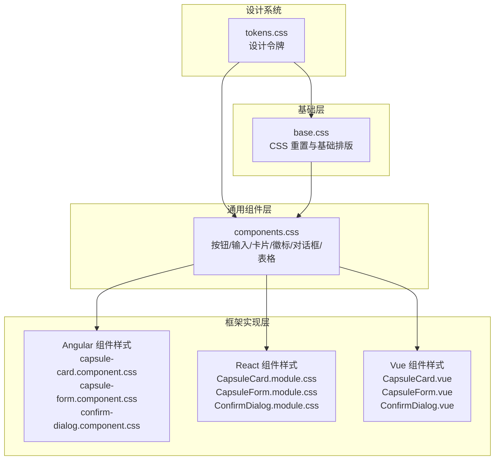
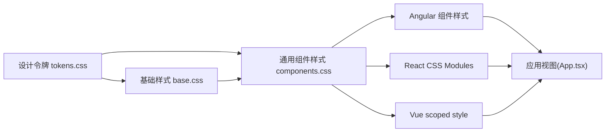
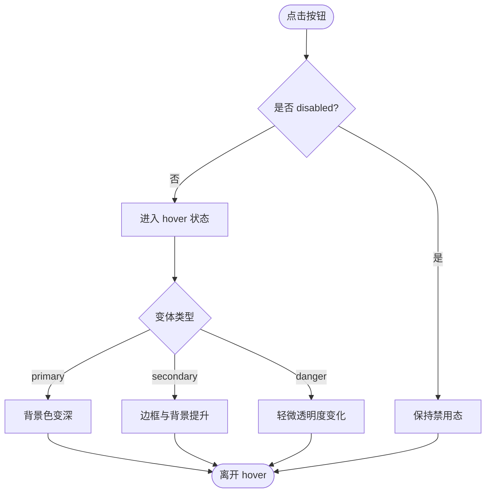
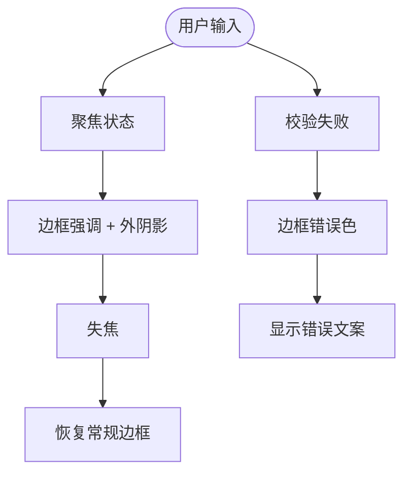
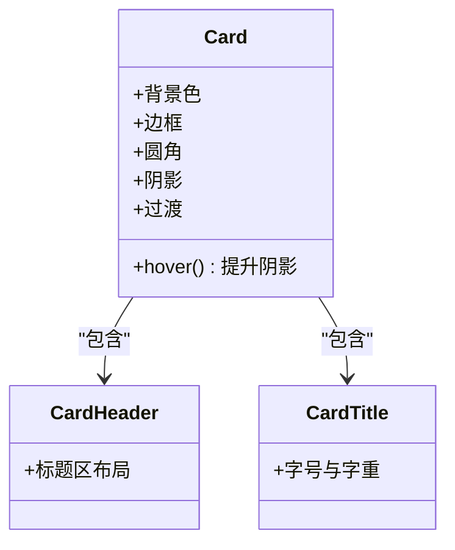
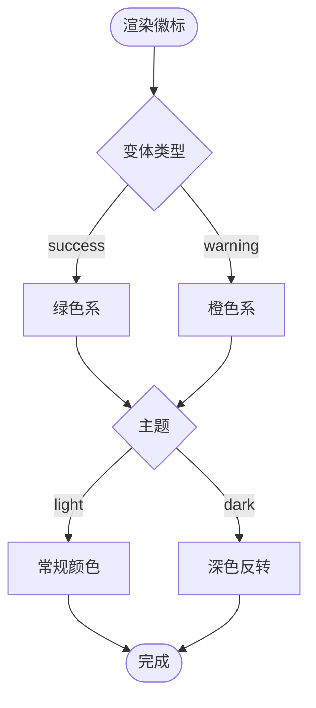
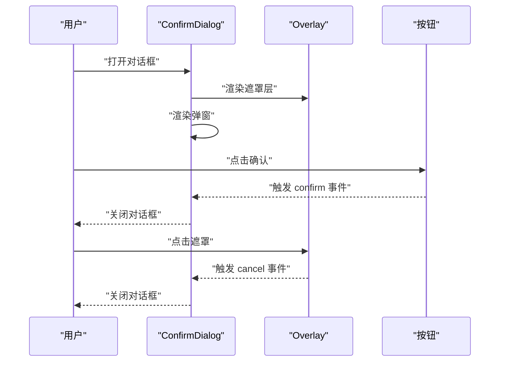
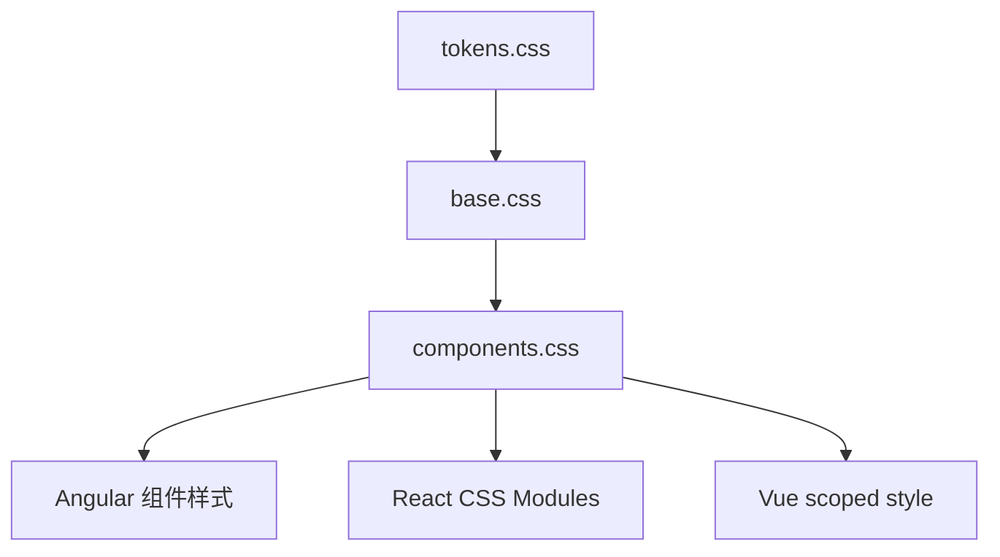

# 组件样式

<cite>
**本文引用的文件**
- [spec/styles/base.css](file://spec/styles/base.css)
- [spec/styles/components.css](file://spec/styles/components.css)
- [spec/styles/tokens.css](file://spec/styles/tokens.css)
- [frontends/angular-ts/src/app/components/capsule-card/capsule-card.component.css](file://frontends/angular-ts/src/app/components/capsule-card/capsule-card.component.css)
- [frontends/angular-ts/src/app/components/capsule-form/capsule-form.component.css](file://frontends/angular-ts/src/app/components/capsule-form/capsule-form.component.css)
- [frontends/angular-ts/src/app/components/confirm-dialog/confirm-dialog.component.css](file://frontends/angular-ts/src/app/components/confirm-dialog/confirm-dialog.component.css)
- [frontends/react-ts/src/components/CapsuleCard.module.css](file://frontends/react-ts/src/components/CapsuleCard.module.css)
- [frontends/react-ts/src/components/CapsuleForm.module.css](file://frontends/react-ts/src/components/CapsuleForm.module.css)
- [frontends/react-ts/src/components/ConfirmDialog.module.css](file://frontends/react-ts/src/components/ConfirmDialog.module.css)
- [frontends/vue3-ts/src/components/CapsuleCard.vue](file://frontends/vue3-ts/src/components/CapsuleCard.vue)
- [frontends/vue3-ts/src/components/CapsuleForm.vue](file://frontends/vue3-ts/src/components/CapsuleForm.vue)
- [frontends/vue3-ts/src/components/ConfirmDialog.vue](file://frontends/vue3-ts/src/components/ConfirmDialog.vue)
- [frontends/react-ts/src/App.tsx](file://frontends/react-ts/src/App.tsx)
</cite>

## 目录
1. [简介](#简介)
2. [项目结构](#项目结构)
3. [核心组件](#核心组件)
4. [架构总览](#架构总览)
5. [详细组件分析](#详细组件分析)
6. [依赖关系分析](#依赖关系分析)
7. [性能考量](#性能考量)
8. [故障排查指南](#故障排查指南)
9. [结论](#结论)
10. [附录](#附录)

## 简介
本文件面向前端开发者，系统化梳理 HelloTime 项目的组件样式体系，涵盖设计系统（tokens）、基础样式（base）、通用组件样式（components），以及在 Angular、React、Vue 三种前端框架中的具体实现与最佳实践。重点说明卡片、表单、按钮、对话框等核心 UI 组件的样式规范、状态样式（hover、active、disabled）、尺寸变体（small、medium、large）、颜色变体（primary、secondary、success、error），并提供复用策略、组合模式、扩展方法及样式冲突解决方案。

## 项目结构
HelloTime 的样式采用“设计令牌 + 基础样式 + 通用组件样式”的分层组织，并在各前端框架中以模块化或 scoped 样式落地：

- 设计令牌：集中定义颜色、字体、间距、圆角、阴影、过渡、布局等变量，支持明暗主题切换。
- 基础样式：重置与基础排版、交互元素默认样式，确保全局一致性。
- 通用组件样式：按钮、输入、卡片、徽标、对话框、表格等可复用组件的基础样式。
- 框架级样式：各组件在 Angular（CSS 文件）、React（CSS Modules）、Vue（scoped style）中的局部样式与组合使用。

图表来源
- [spec/styles/tokens.css:1-104](file://spec/styles/tokens.css#L1-L104)
- [spec/styles/base.css:1-67](file://spec/styles/base.css#L1-L67)
- [spec/styles/components.css:1-207](file://spec/styles/components.css#L1-L207)
- [frontends/angular-ts/src/app/components/capsule-card/capsule-card.component.css:1-76](file://frontends/angular-ts/src/app/components/capsule-card/capsule-card.component.css#L1-L76)
- [frontends/angular-ts/src/app/components/capsule-form/capsule-form.component.css:1-46](file://frontends/angular-ts/src/app/components/capsule-form/capsule-form.component.css#L1-L46)
- [frontends/angular-ts/src/app/components/confirm-dialog/confirm-dialog.component.css:1-35](file://frontends/angular-ts/src/app/components/confirm-dialog/confirm-dialog.component.css#L1-L35)
- [frontends/react-ts/src/components/CapsuleCard.module.css:1-33](file://frontends/react-ts/src/components/CapsuleCard.module.css#L1-L33)
- [frontends/react-ts/src/components/CapsuleForm.module.css:1-32](file://frontends/react-ts/src/components/CapsuleForm.module.css#L1-L32)
- [frontends/react-ts/src/components/ConfirmDialog.module.css:1-11](file://frontends/react-ts/src/components/ConfirmDialog.module.css#L1-L11)
- [frontends/vue3-ts/src/components/CapsuleCard.vue:55-88](file://frontends/vue3-ts/src/components/CapsuleCard.vue#L55-L88)
- [frontends/vue3-ts/src/components/CapsuleForm.vue:131-157](file://frontends/vue3-ts/src/components/CapsuleForm.vue#L131-L157)
- [frontends/vue3-ts/src/components/ConfirmDialog.vue:29-40](file://frontends/vue3-ts/src/components/ConfirmDialog.vue#L29-L40)

章节来源
- [spec/styles/tokens.css:1-104](file://spec/styles/tokens.css#L1-L104)
- [spec/styles/base.css:1-67](file://spec/styles/base.css#L1-L67)
- [spec/styles/components.css:1-207](file://spec/styles/components.css#L1-L207)

## 核心组件
本节总结通用组件样式规范与设计系统映射关系，便于跨框架复用与统一维护。

- 按钮（.btn）
  - 基础：内边距、字号、行高、圆角、过渡、禁用态透明度与光标。
  - 颜色变体：primary、secondary、danger；hover 状态在非禁用时生效。
  - 尺寸变体：sm、lg；通过内边距与字号微调。
  - 使用建议：组合类名如 .btn-primary.btn-lg 实现复合样式。

- 输入（.input）
  - 基础：宽度、内边距、边框、圆角、背景、文本色、过渡。
  - 状态：focus 时强调色与外阴影；错误态 .input-error 改变边框色。
  - 文案：.input-label、.input-error-text 辅助信息与错误提示。

- 卡片（.card）
  - 基础：背景、边框、圆角、内边距、阴影、过渡。
  - 状态：hover 提升阴影；.card-header、.card-title 结构化标题区域。
  - 适用场景：展示型容器，常与按钮、徽标组合。

- 徽标（.badge）
  - 基础：内联弹性布局、内边距、字号、字重、圆角。
  - 变体：success、warning；暗色主题下颜色反转以保证对比度。

- 对话框（.overlay、.dialog）
  - 覆盖层：固定定位、居中、遮罩背景、z-index。
  - 弹窗：背景、圆角、内边距、最大宽度、阴影。
  - 交互：点击遮罩触发取消；按钮使用 .btn-primary/.btn-secondary 组合。

- 表格（.table）
  - 基础：全宽、合并边框。
  - 表头：强调字重与背景；单元格内边距与底部边框。
  - 交互：悬停行背景色变化。

章节来源
- [spec/styles/components.css:3-206](file://spec/styles/components.css#L3-L206)

## 架构总览
下图展示设计令牌如何驱动基础样式与通用组件样式，以及框架侧组件如何复用这些样式。

图表来源
- [spec/styles/tokens.css:1-104](file://spec/styles/tokens.css#L1-L104)
- [spec/styles/base.css:1-67](file://spec/styles/base.css#L1-L67)
- [spec/styles/components.css:1-207](file://spec/styles/components.css#L1-L207)
- [frontends/react-ts/src/App.tsx:12-30](file://frontends/react-ts/src/App.tsx#L12-L30)

## 详细组件分析

### 按钮组件（Button）
- 设计系统映射
  - 颜色：primary、secondary、danger 对应 --color-primary、--color-error 等令牌。
  - 尺寸：sm、md、lg 通过内边距与字号实现；当前仓库提供 sm、lg。
  - 过渡：统一使用 --transition-fast。
- 状态样式
  - hover：primary 在非禁用时改变背景色；secondary 改变边框与背景。
  - disabled：降低不透明度与禁用指针。
- 复用与组合
  - 推荐组合：.btn-primary.btn-lg 或 .btn-secondary.btn-sm。
  - 与图标结合：使用 gap 控制图标与文字间距。
- 扩展方法
  - 新增变体：新增 .btn-variant 类，继承 .btn 基础属性后覆盖颜色与 hover 行为。
  - 新增尺寸：新增 .btn-xs/.btn-xl 并在 tokens 中补充对应 spacing/radius。

图表来源
- [spec/styles/components.css:4-64](file://spec/styles/components.css#L4-L64)

章节来源
- [spec/styles/components.css:4-64](file://spec/styles/components.css#L4-L64)

### 输入组件（Input）
- 设计系统映射
  - 边框色、背景色、文本色、占位符色均来自令牌。
  - focus 状态：强调色与外阴影由 --color-primary-light 与阴影令牌控制。
- 错误态
  - 通过 .input-error 临时覆盖边框色，配合 .input-error-text 显示错误文案。
- 复用与组合
  - 与 .input-label 搭配形成表单组；在表单组件中统一使用 .input-error 样式。
- 扩展方法
  - 新增尺寸：提供 .input-sm/.input-lg，调整内边距与字号。
  - 新增形状：提供圆角变体 .input-round。

图表来源
- [spec/styles/components.css:67-109](file://spec/styles/components.css#L67-L109)

章节来源
- [spec/styles/components.css:67-109](file://spec/styles/components.css#L67-L109)

### 卡片组件（Card）
- 设计系统映射
  - 背景色、边框色、圆角、阴影、过渡均来自令牌。
- 状态样式
  - hover 提升阴影，增强可交互反馈。
- 结构化样式
  - .card-header、.card-title 用于标题区布局与排版。
- 复用与组合
  - 常与按钮、徽标组合；在卡片组件中进一步细化子元素样式（如内容区、锁定区）。
- 扩展方法
  - 新增卡片变体：.card-elevated/.card-subtle，分别提升阴影与弱化边框。

图表来源
- [spec/styles/components.css:111-133](file://spec/styles/components.css#L111-L133)

章节来源
- [spec/styles/components.css:111-133](file://spec/styles/components.css#L111-L133)

### 徽标组件（Badge）
- 设计系统映射
  - 内边距、字号、字重、圆角来自令牌。
  - success/warning 变体使用语义化颜色；暗色主题下颜色反转以保证对比度。
- 复用与组合
  - 常与卡片标题组合，用于状态标识。
- 扩展方法
  - 新增变体：info、warning（已存在）；新增 danger、success（已存在）。

图表来源
- [spec/styles/components.css:135-162](file://spec/styles/components.css#L135-L162)

章节来源
- [spec/styles/components.css:135-162](file://spec/styles/components.css#L135-L162)

### 对话框组件（Overlay + Dialog）
- 设计系统映射
  - 遮罩背景、弹窗背景、圆角、阴影、最大宽度来自令牌。
- 交互流程
  - 点击遮罩触发取消；确认按钮触发确认。
- 复用与组合
  - 在确认对话框中组合 .btn-primary/.btn-secondary；在框架侧通过 Teleport 或 Portal 渲染到 body。
- 扩展方法
  - 新增尺寸：.dialog-sm/.dialog-lg；新增动画变体（需 JS 配合）。

图表来源
- [spec/styles/components.css:164-182](file://spec/styles/components.css#L164-L182)
- [frontends/vue3-ts/src/components/ConfirmDialog.vue:1-41](file://frontends/vue3-ts/src/components/ConfirmDialog.vue#L1-L41)
- [frontends/react-ts/src/components/ConfirmDialog.module.css:1-11](file://frontends/react-ts/src/components/ConfirmDialog.module.css#L1-L11)
- [frontends/angular-ts/src/app/components/confirm-dialog/confirm-dialog.component.css:1-35](file://frontends/angular-ts/src/app/components/confirm-dialog/confirm-dialog.component.css#L1-L35)

章节来源
- [spec/styles/components.css:164-182](file://spec/styles/components.css#L164-L182)
- [frontends/vue3-ts/src/components/ConfirmDialog.vue:1-41](file://frontends/vue3-ts/src/components/ConfirmDialog.vue#L1-L41)
- [frontends/react-ts/src/components/ConfirmDialog.module.css:1-11](file://frontends/react-ts/src/components/ConfirmDialog.module.css#L1-L11)
- [frontends/angular-ts/src/app/components/confirm-dialog/confirm-dialog.component.css:1-35](file://frontends/angular-ts/src/app/components/confirm-dialog/confirm-dialog.component.css#L1-L35)

### 表格组件（Table）
- 设计系统映射
  - 表头字重与背景、单元格内边距、底部边框色来自令牌。
- 交互样式
  - 悬停行背景色变化，提升可读性。
- 复用与组合
  - 在胶囊列表等场景直接复用；可在父容器中添加滚动容器以适配小屏。

章节来源
- [spec/styles/components.css:184-206](file://spec/styles/components.css#L184-L206)

## 依赖关系分析
- 设计令牌依赖：所有组件样式最终依赖 tokens.css 中的 CSS 变量。
- 基础样式依赖：base.css 为全局重置与基础排版，components.css 依赖其基础元素样式。
- 框架实现依赖：Angular/React/Vue 各自的组件样式文件依赖通用组件样式类名与设计令牌。

图表来源
- [spec/styles/tokens.css:1-104](file://spec/styles/tokens.css#L1-L104)
- [spec/styles/base.css:1-67](file://spec/styles/base.css#L1-L67)
- [spec/styles/components.css:1-207](file://spec/styles/components.css#L1-L207)

章节来源
- [spec/styles/tokens.css:1-104](file://spec/styles/tokens.css#L1-L104)
- [spec/styles/base.css:1-67](file://spec/styles/base.css#L1-L67)
- [spec/styles/components.css:1-207](file://spec/styles/components.css#L1-L207)

## 性能考量
- CSS 变量与过渡：统一使用 tokens 中的过渡时长与缓动函数，减少重复定义，提升动画性能一致性。
- 选择器复杂度：优先使用扁平类名组合（如 .btn-primary.btn-lg），避免深层嵌套与复杂选择器。
- 作用域隔离：Angular 使用组件样式文件、React 使用 CSS Modules、Vue 使用 scoped style，有效避免样式泄漏。
- 暗色主题：通过 data-theme 切换，仅在必要处使用媒体查询与条件规则，减少重绘范围。

## 故障排查指南
- 暗色主题图标颜色异常
  - 现象：日期选择器日历图标颜色不随主题变化。
  - 解决：在表单组件中使用 :host-context 或 :global[data-theme="dark"] 选择器，对特定输入类型进行颜色反转。
  - 参考路径：
    - [frontends/angular-ts/src/app/components/capsule-form/capsule-form.component.css:42-45](file://frontends/angular-ts/src/app/components/capsule-form/capsule-form.component.css#L42-L45)
    - [frontends/react-ts/src/components/CapsuleForm.module.css:22-25](file://frontends/react-ts/src/components/CapsuleForm.module.css#L22-L25)
    - [frontends/vue3-ts/src/components/CapsuleForm.vue:160-165](file://frontends/vue3-ts/src/components/CapsuleForm.vue#L160-L165)
- 按钮 hover 无效
  - 现象：按钮禁用后 hover 仍生效。
  - 解决：确保 hover 选择器包含 :not(:disabled)，并在禁用态设置 opacity 与 cursor。
  - 参考路径：
    - [spec/styles/components.css:19-32](file://spec/styles/components.css#L19-L32)
- 输入错误态不显示
  - 现象：输入错误但无边框强调。
  - 解决：在表单组件中动态绑定 .input-error 类，并确保 .input-error 样式优先级高于基础 .input。
  - 参考路径：
    - [spec/styles/components.css:101-109](file://spec/styles/components.css#L101-L109)
- 对话框无法关闭
  - 现象：点击遮罩无响应。
  - 解决：确保遮罩层点击事件正确触发取消回调；在 Vue 中使用 @click.self，在 React/Angular 中绑定相应事件。
  - 参考路径：
    - [frontends/vue3-ts/src/components/ConfirmDialog.vue:2-13](file://frontends/vue3-ts/src/components/ConfirmDialog.vue#L2-L13)
    - [frontends/react-ts/src/components/ConfirmDialog.module.css:1-11](file://frontends/react-ts/src/components/ConfirmDialog.module.css#L1-L11)
    - [frontends/angular-ts/src/app/components/confirm-dialog/confirm-dialog.component.css:1-35](file://frontends/angular-ts/src/app/components/confirm-dialog/confirm-dialog.component.css#L1-L35)

章节来源
- [spec/styles/components.css:19-32](file://spec/styles/components.css#L19-L32)
- [spec/styles/components.css:101-109](file://spec/styles/components.css#L101-L109)
- [frontends/vue3-ts/src/components/ConfirmDialog.vue:2-13](file://frontends/vue3-ts/src/components/ConfirmDialog.vue#L2-L13)
- [frontends/react-ts/src/components/ConfirmDialog.module.css:1-11](file://frontends/react-ts/src/components/ConfirmDialog.module.css#L1-L11)
- [frontends/angular-ts/src/app/components/confirm-dialog/confirm-dialog.component.css:1-35](file://frontends/angular-ts/src/app/components/confirm-dialog/confirm-dialog.component.css#L1-L35)

## 结论
HelloTime 的组件样式体系以设计令牌为核心，通过基础样式与通用组件样式实现跨框架一致的视觉与交互体验。推荐遵循以下实践：
- 使用 tokens.css 定义与维护设计变量；
- 以 .btn、.input、.card、.badge、.overlay/.dialog 等通用类为基础，按需组合；
- 在框架侧严格使用作用域样式，避免全局污染；
- 针对暗色主题与交互状态（hover/disabled）提供明确的视觉反馈；
- 通过组合与扩展方法持续完善组件库，保持一致性与可维护性。

## 附录

### 设计系统与令牌映射
- 颜色：--color-primary、--color-error、--color-bg、--color-text 等
- 字体：--font-family、--font-mono、--text-*、--leading-*
- 间距：--space-*
- 圆角：--radius-*
- 阴影：--shadow-*
- 过渡：--transition-*
- 布局：--max-width-*

章节来源
- [spec/styles/tokens.css:1-104](file://spec/styles/tokens.css#L1-L104)

### BEM 命名约定与作用域隔离
- 命名约定
  - 块（Block）：.btn、.input、.card、.overlay、.dialog
  - 元素（Element）：.btn__icon、.input__label、.card__header、.dialog__actions
  - 修饰符（Modifier）：.btn--primary、.btn--lg、.input--error、[data-theme="dark"]
- 作用域隔离
  - Angular：组件样式文件独立作用域；
  - React：CSS Modules 生成唯一类名；
  - Vue：scoped style 自动注入作用域属性。

章节来源
- [frontends/angular-ts/src/app/components/capsule-card/capsule-card.component.css:1-76](file://frontends/angular-ts/src/app/components/capsule-card/capsule-card.component.css#L1-L76)
- [frontends/react-ts/src/components/CapsuleCard.module.css:1-33](file://frontends/react-ts/src/components/CapsuleCard.module.css#L1-L33)
- [frontends/vue3-ts/src/components/CapsuleCard.vue:55-88](file://frontends/vue3-ts/src/components/CapsuleCard.vue#L55-L88)