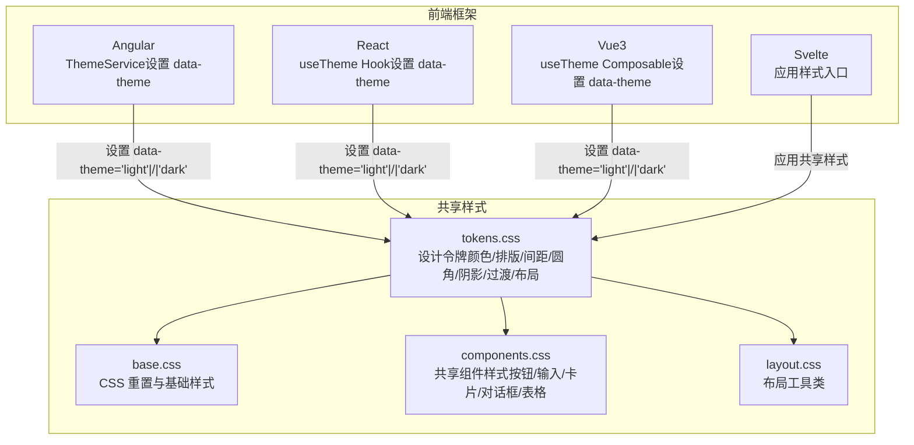
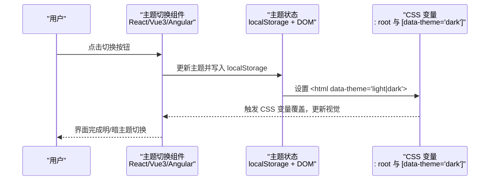
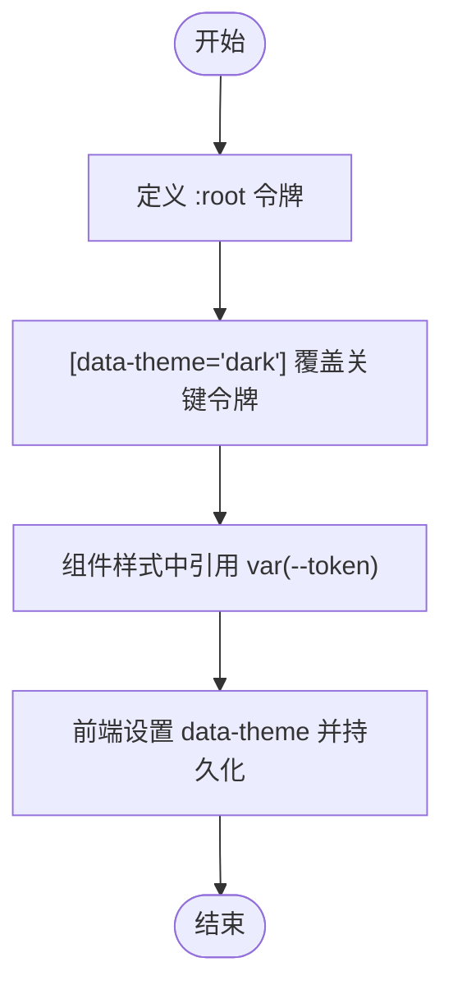
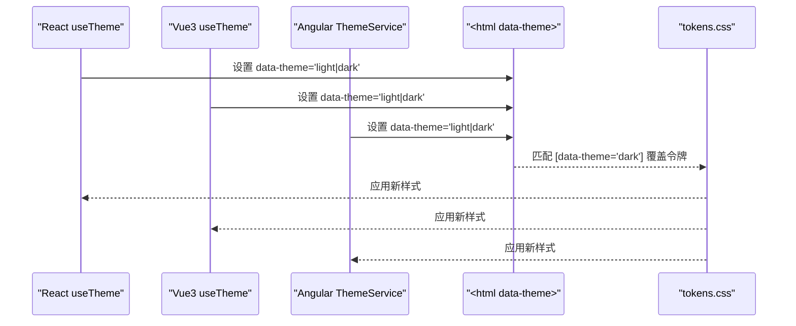
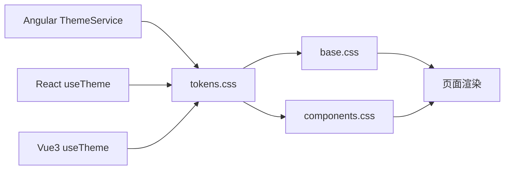

# 设计令牌

<cite>
**本文引用的文件**
- [design-tokens.md](file://docs/design-tokens.md)
- [tokens.css](file://spec/styles/tokens.css)
- [base.css](file://spec/styles/base.css)
- [components.css](file://spec/styles/components.css)
- [layout.css](file://spec/styles/layout.css)
- [theme.service.ts](file://frontends/angular-ts/src/app/services/theme.service.ts)
- [useTheme.ts（React）](file://frontends/react-ts/src/hooks/useTheme.ts)
- [useTheme.ts（Vue3）](file://frontends/vue3-ts/src/composables/useTheme.ts)
- [ThemeToggle.tsx](file://frontends/react-ts/src/components/ThemeToggle.tsx)
- [ThemeToggle.vue](file://frontends/vue3-ts/src/components/ThemeToggle.vue)
- [theme-toggle.component.css](file://frontends/angular-ts/src/app/components/theme-toggle/theme-toggle.component.css)
- [ThemeToggle.module.css（React）](file://frontends/react-ts/src/components/ThemeToggle.module.css)
- [App.tsx（React）](file://frontends/react-ts/src/App.tsx)
- [App.vue（Vue3）](file://frontends/vue3-ts/src/App.vue)
</cite>

## 目录
1. [简介](#简介)
2. [项目结构](#项目结构)
3. [核心组件](#核心组件)
4. [架构总览](#架构总览)
5. [详细组件分析](#详细组件分析)
6. [依赖关系分析](#依赖关系分析)
7. [性能考量](#性能考量)
8. [故障排查指南](#故障排查指南)
9. [结论](#结论)
10. [附录](#附录)

## 简介
本文件系统性阐述 HelloTime 项目的“设计令牌”体系，围绕 CSS 自定义属性（CSS Variables）构建统一的视觉语言与交互体验。内容涵盖：
- 颜色系统（主色、背景、文本、边框、状态色）
- 字体排版（字体族、字号、行高、字重）
- 间距系统（space tokens）
- 圆角半径（border radius）
- 阴影系统（shadow tokens）
- 过渡动画（transition tokens）
- 明/暗主题切换机制（data-theme 属性与 CSS 变量覆盖规则）
- 命名规范、最佳实践与扩展方法
- 结合前端框架（Angular、React、Vue3、Svelte）的实际使用路径与示例路径

## 项目结构
设计令牌与样式分层清晰：共享令牌集中于 tokens.css；基础样式与组件样式分别位于 base.css 与 components.css；布局工具类位于 layout.css；各前端框架通过服务或组合式函数管理主题并在根节点设置 data-theme。

图表来源
- [tokens.css:1-104](file://spec/styles/tokens.css#L1-L104)
- [base.css:1-67](file://spec/styles/base.css#L1-L67)
- [components.css:1-207](file://spec/styles/components.css#L1-L207)
- [theme.service.ts:1-28](file://frontends/angular-ts/src/app/services/theme.service.ts#L1-L28)
- [useTheme.ts（React）:1-48](file://frontends/react-ts/src/hooks/useTheme.ts#L1-L48)
- [useTheme.ts（Vue3）:1-57](file://frontends/vue3-ts/src/composables/useTheme.ts#L1-L57)

章节来源
- [design-tokens.md:1-91](file://docs/design-tokens.md#L1-L91)
- [tokens.css:1-104](file://spec/styles/tokens.css#L1-L104)
- [base.css:1-67](file://spec/styles/base.css#L1-L67)
- [components.css:1-207](file://spec/styles/components.css#L1-L207)

## 核心组件
- 设计令牌（tokens.css）
  - 颜色系统：主色、背景、文本、边框、状态色（成功/警告/错误/信息）
  - 字体排版：字体族、等宽字体、字号、行高、字重
  - 间距系统：以 4px 为基准的 space-1 到 space-16
  - 圆角半径：sm/md/lg/xl/full
  - 阴影系统：sm/md/lg
  - 过渡动画：fast/base/slow
  - 布局：最大宽度、头部高度等
- 明/暗主题（data-theme）
  - 在 :root 定义亮色默认值，在 [data-theme="dark"] 中覆盖对应令牌
  - 前端通过服务/组合式函数设置 <html> 的 data-theme，并持久化到 localStorage
- 基础样式与组件样式
  - base.css：全局重置、基础排版、链接、选择器等
  - components.css：按钮、输入、卡片、徽标、对话框、表格等共享组件

章节来源
- [tokens.css:1-104](file://spec/styles/tokens.css#L1-L104)
- [base.css:1-67](file://spec/styles/base.css#L1-L67)
- [components.css:1-207](file://spec/styles/components.css#L1-L207)
- [design-tokens.md:76-82](file://docs/design-tokens.md#L76-L82)

## 架构总览
下图展示“设计令牌 → 主题切换 → 样式应用”的完整链路，以及前端框架如何与之协作。

图表来源
- [useTheme.ts（React）:14-47](file://frontends/react-ts/src/hooks/useTheme.ts#L14-L47)
- [useTheme.ts（Vue3）:20-56](file://frontends/vue3-ts/src/composables/useTheme.ts#L20-L56)
- [theme.service.ts:10-26](file://frontends/angular-ts/src/app/services/theme.service.ts#L10-L26)
- [tokens.css:82-103](file://spec/styles/tokens.css#L82-L103)

## 详细组件分析

### 设计令牌定义与覆盖规则
- 令牌集中于 tokens.css 的 :root，定义颜色、排版、间距、圆角、阴影、过渡、布局等
- [data-theme="dark"] 选择器用于覆盖亮色令牌值，实现明/暗主题切换
- 组件样式通过 var(--token-name) 引用令牌，无需硬编码具体值，保证一致性与可维护性

图表来源
- [tokens.css:2-103](file://spec/styles/tokens.css#L2-L103)
- [components.css:4-206](file://spec/styles/components.css#L4-L206)

章节来源
- [tokens.css:1-104](file://spec/styles/tokens.css#L1-L104)
- [components.css:1-207](file://spec/styles/components.css#L1-L207)

### 明/暗主题切换机制
- React：useTheme Hook 使用 useSyncExternalStore 管理主题状态，设置 data-theme 并持久化到 localStorage
- Vue3：useTheme Composable 使用 ref + watchEffect 管理主题状态，设置 data-theme 并持久化
- Angular：ThemeService 使用 signal + effect 管理主题状态，设置 data-theme 并持久化

图表来源
- [useTheme.ts（React）:14-47](file://frontends/react-ts/src/hooks/useTheme.ts#L14-L47)
- [useTheme.ts（Vue3）:20-56](file://frontends/vue3-ts/src/composables/useTheme.ts#L20-L56)
- [theme.service.ts:10-26](file://frontends/angular-ts/src/app/services/theme.service.ts#L10-L26)
- [tokens.css:82-103](file://spec/styles/tokens.css#L82-L103)

章节来源
- [useTheme.ts（React）:1-48](file://frontends/react-ts/src/hooks/useTheme.ts#L1-L48)
- [useTheme.ts（Vue3）:1-57](file://frontends/vue3-ts/src/composables/useTheme.ts#L1-L57)
- [theme.service.ts:1-28](file://frontends/angular-ts/src/app/services/theme.service.ts#L1-L28)

### 命名规范与最佳实践
- 命名规范
  - 颜色：--color-{category}（如 primary、bg、text、border、success、warning、error、info）
  - 排版：--font-family、--font-mono、--text-{size}、--leading-{level}、--font-{weight}
  - 间距：--space-{n}（1..16）
  - 圆角：--radius-{size}（sm/md/lg/xl/full）
  - 阴影：--shadow-{size}（sm/md/lg）
  - 过渡：--transition-{speed}（fast/base/slow）
  - 布局：--max-width、--max-width-{size}、--header-height
- 最佳实践
  - 所有组件样式统一通过 var(--token) 引用，避免硬编码颜色/尺寸
  - 优先使用语义化令牌（如 --color-primary），而非直接使用具体色值
  - 在 [data-theme="dark"] 中仅覆盖必要令牌，减少重复定义
  - 组件 hover/focus 状态使用对应的 hover/active 变体令牌，保持一致性
  - 使用过渡令牌统一动画时长与缓动，提升交互一致性
- 扩展方法
  - 新增令牌：在 tokens.css 中添加新的 --token-name
  - 新增组件：在 components.css 中使用现有令牌，避免新增独立色值
  - 新增主题：在 [data-theme="dark"] 中覆盖新增令牌，或新增 [data-theme="new"] 分支

章节来源
- [tokens.css:1-104](file://spec/styles/tokens.css#L1-L104)
- [components.css:1-207](file://spec/styles/components.css#L1-L207)
- [design-tokens.md:76-82](file://docs/design-tokens.md#L76-L82)

### 视觉效果对比与使用示例
- 颜色系统
  - 主色：用于主要操作与强调元素，支持 hover/light 变体
  - 背景/文本：区分主/次/三级背景与文本层级
  - 边框：常规边框与 hover 边框
  - 状态色：成功/警告/错误/信息，用于反馈与徽标
- 排版
  - 字体族：无衬线与等宽字体，满足正文与代码场景
  - 字号/行高/字重：提供 xs 到 3xl 的完整体系
- 间距
  - 以 4px 为基准，space-1 到 space-16 覆盖常见布局需求
- 圆角/阴影/过渡
  - 圆角提供一致性边界
  - 阴影提供层级感
  - 过渡提供顺滑交互
- 主题切换
  - 切换后，按钮、输入、卡片、徽标等组件自动适配明/暗主题

章节来源
- [design-tokens.md:9-44](file://docs/design-tokens.md#L9-L44)
- [tokens.css:25-80](file://spec/styles/tokens.css#L25-L80)
- [components.css:3-119](file://spec/styles/components.css#L3-L119)

### 组件样式中的令牌使用
- 按钮：背景、文字、边框、圆角、过渡、尺寸变体
- 输入：边框、背景、文字、占位符、焦点态阴影
- 卡片：背景、边框、圆角、阴影、悬停阴影
- 表格：表头背景、悬停态背景、边框
- 徽标：圆角、背景与文字色（含暗色覆盖）

章节来源
- [components.css:3-207](file://spec/styles/components.css#L3-L207)

### 前端框架集成要点
- React
  - 使用 useTheme Hook 获取 theme 与 toggle，并在组件中渲染主题切换按钮
  - 示例路径：[ThemeToggle.tsx:1-17](file://frontends/react-ts/src/components/ThemeToggle.tsx#L1-L17)，[useTheme.ts（React）:1-48](file://frontends/react-ts/src/hooks/useTheme.ts#L1-L48)
- Vue3
  - 使用 useTheme Composable 获取 theme 与 toggle，并在组件中渲染主题切换按钮
  - 示例路径：[ThemeToggle.vue:1-34](file://frontends/vue3-ts/src/components/ThemeToggle.vue#L1-L34)，[useTheme.ts（Vue3）:1-57](file://frontends/vue3-ts/src/composables/useTheme.ts#L1-L57)
- Angular
  - 使用 ThemeService 管理主题状态，设置 data-theme 并持久化
  - 示例路径：[theme.service.ts:1-28](file://frontends/angular-ts/src/app/services/theme.service.ts#L1-L28)
- Svelte
  - 应用样式入口文件用于覆盖或补充样式
  - 示例路径：[app.css（Svelte）:1-2](file://frontends/svelte-ts/src/app.css#L1-L2)

章节来源
- [ThemeToggle.tsx:1-17](file://frontends/react-ts/src/components/ThemeToggle.tsx#L1-L17)
- [ThemeToggle.vue:1-34](file://frontends/vue3-ts/src/components/ThemeToggle.vue#L1-L34)
- [theme.service.ts:1-28](file://frontends/angular-ts/src/app/services/theme.service.ts#L1-L28)
- [useTheme.ts（React）:1-48](file://frontends/react-ts/src/hooks/useTheme.ts#L1-L48)
- [useTheme.ts（Vue3）:1-57](file://frontends/vue3-ts/src/composables/useTheme.ts#L1-L57)

## 依赖关系分析
- tokens.css 是所有样式的根，被 base.css 与 components.css 间接依赖
- 前端主题服务/组合式函数依赖 DOM 与 localStorage，最终作用于 tokens.css 的变量覆盖
- 组件样式对 tokens.css 的强依赖，体现“单一事实源”的设计原则

图表来源
- [tokens.css:1-104](file://spec/styles/tokens.css#L1-L104)
- [base.css:1-67](file://spec/styles/base.css#L1-L67)
- [components.css:1-207](file://spec/styles/components.css#L1-L207)
- [theme.service.ts:10-26](file://frontends/angular-ts/src/app/services/theme.service.ts#L10-L26)
- [useTheme.ts（React）:14-47](file://frontends/react-ts/src/hooks/useTheme.ts#L14-L47)
- [useTheme.ts（Vue3）:20-56](file://frontends/vue3-ts/src/composables/useTheme.ts#L20-L56)

章节来源
- [tokens.css:1-104](file://spec/styles/tokens.css#L1-L104)
- [base.css:1-67](file://spec/styles/base.css#L1-L67)
- [components.css:1-207](file://spec/styles/components.css#L1-L207)
- [theme.service.ts:1-28](file://frontends/angular-ts/src/app/services/theme.service.ts#L1-L28)
- [useTheme.ts（React）:1-48](file://frontends/react-ts/src/hooks/useTheme.ts#L1-L48)
- [useTheme.ts（Vue3）:1-57](file://frontends/vue3-ts/src/composables/useTheme.ts#L1-L57)

## 性能考量
- CSS 变量覆盖成本极低，仅影响匹配选择器的属性，整体开销可忽略
- 通过 [data-theme] 选择器进行主题切换，避免在组件内重复计算样式
- 组件样式统一引用令牌，减少重复定义与样式体积
- 建议在生产环境启用 CSS 压缩与按需加载，配合前端打包策略优化首屏渲染

## 故障排查指南
- 主题未生效
  - 检查是否在 <html> 上设置了正确的 data-theme 属性
  - 确认 [data-theme="dark"] 已覆盖所需令牌
  - 确认前端主题服务/组合式函数已将主题写入 localStorage
- 样式不一致
  - 检查组件是否直接使用了硬编码颜色/尺寸，应改为 var(--token)
  - 确认 tokens.css 中是否存在遗漏的令牌定义
- 动画异常
  - 检查 transition 令牌是否正确引用
  - 确认过渡目标属性（如 color、background-color、box-shadow）均使用令牌

章节来源
- [tokens.css:82-103](file://spec/styles/tokens.css#L82-L103)
- [useTheme.ts（React）:14-47](file://frontends/react-ts/src/hooks/useTheme.ts#L14-L47)
- [useTheme.ts（Vue3）:20-56](file://frontends/vue3-ts/src/composables/useTheme.ts#L20-L56)
- [theme.service.ts:10-26](file://frontends/angular-ts/src/app/services/theme.service.ts#L10-L26)

## 结论
HelloTime 的设计令牌系统以 CSS 自定义属性为核心，结合明/暗主题切换机制，实现了跨前端框架的一致视觉与交互体验。通过明确的命名规范、最佳实践与扩展方法，团队可在保证设计一致性的同时高效迭代产品界面。

## 附录
- 样式文件清单
  - tokens.css：设计令牌（颜色/排版/间距/圆角/阴影/过渡/布局）
  - base.css：CSS 重置与基础样式
  - components.css：共享组件样式（按钮/输入/卡片/对话框/表格）
  - layout.css：布局工具类
- 前端主题集成
  - Angular：ThemeService
  - React：useTheme Hook
  - Vue3：useTheme Composable
  - Svelte：应用样式入口

章节来源
- [design-tokens.md:83-91](file://docs/design-tokens.md#L83-L91)
- [tokens.css:1-104](file://spec/styles/tokens.css#L1-L104)
- [base.css:1-67](file://spec/styles/base.css#L1-L67)
- [components.css:1-207](file://spec/styles/components.css#L1-L207)
- [layout.css](file://spec/styles/layout.css)